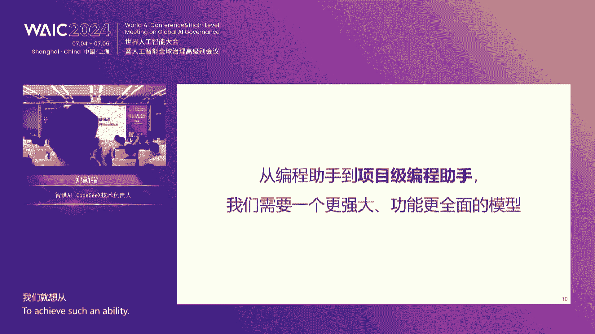
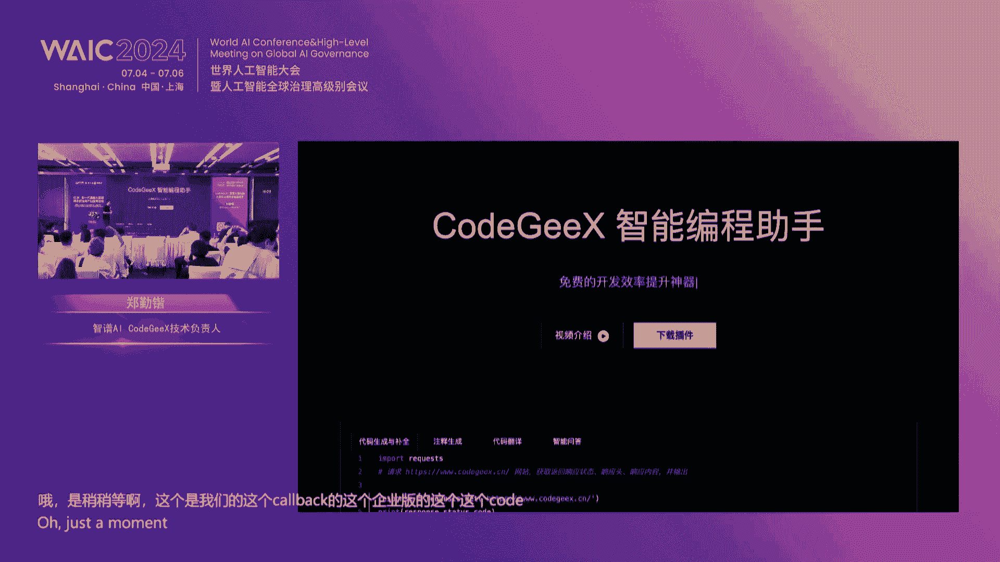
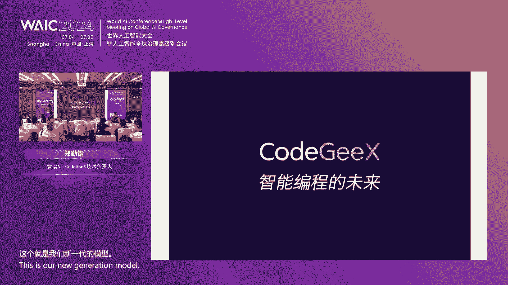
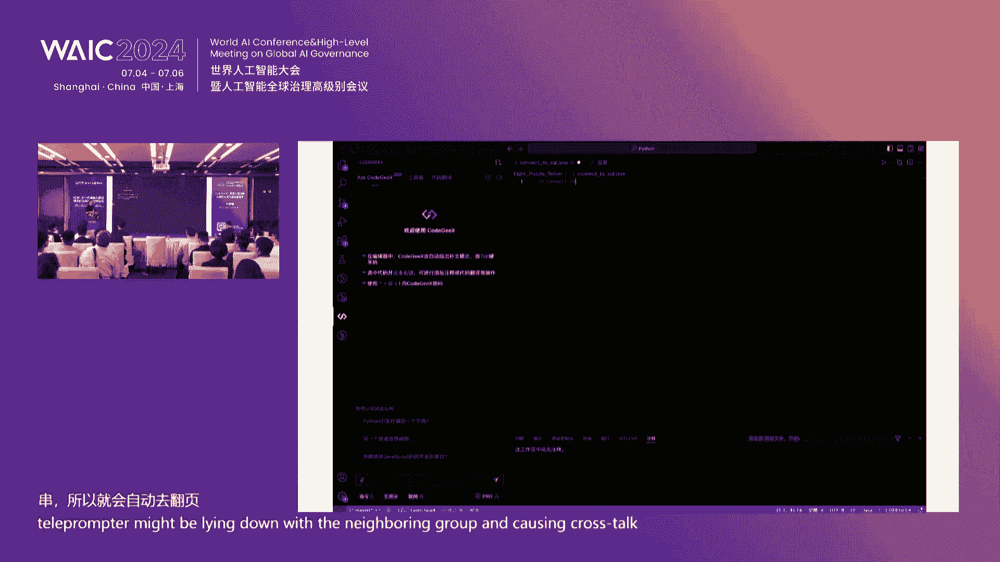
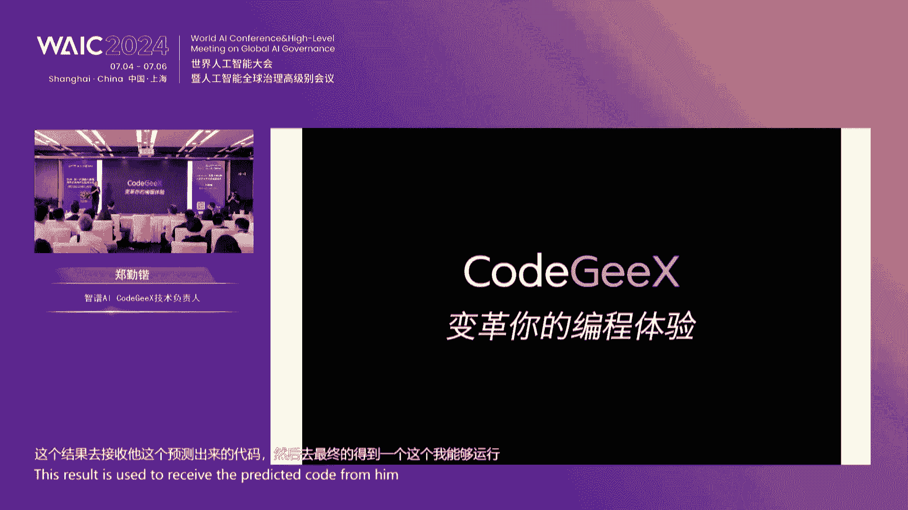
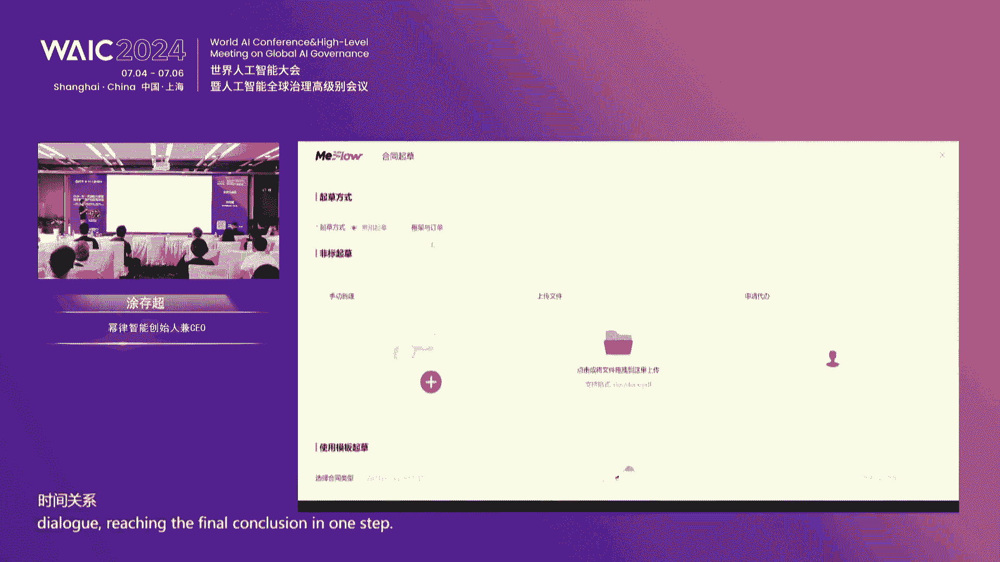

# 36：GLM大模型技术前沿与产业应用论坛精华解读 📚

## 课程概述
在本节课中，我们将系统性地学习由智谱AI、清华大学知识工程实验室等机构联合举办的“新一代基座大模型技术前沿与产业应用论坛”的核心内容。课程将涵盖大模型的技术原理、产业落地实践、安全对齐、以及在法律、代码生成、时间序列分析等垂直领域的应用探索，旨在为初学者提供一个全面、清晰的大模型知识图谱。

---

## 第一节：大模型落地应用的整体探索 🚀

上一节我们介绍了课程的整体框架，本节中我们来看看智谱AI首席执行官张鹏先生关于大模型落地应用的整体思考与实践。

智谱AI在大模型领域已深耕四年多，其自主研发的GLM（General Language Model）算法框架，融合了BERT的自编码和GPT的自回归思想，形成了独特的技术路径。该框架在部分国际评测中展现出优秀的鲁棒性和较低的校准误差，这意味着它在控制大模型“幻觉”问题上具有潜力。

基于GLM框架，智谱AI逐步推出了对标国际顶尖水平的模型系列，最新的GLM-4模型在多项能力上已追平甚至超越GPT-4。其核心能力体现在：
*   **长文本处理**：上下文长度可达128K，能一次性精准处理近百万字的文档。
*   **多模态理解**：在图像理解等任务上达到与GPT-4V相当的水平。
*   **智能体（Agent）能力**：支持工具调用，让普通用户也能快速开发AI应用。

在应用层面，智谱AI聚焦于赋能个人与企业：
*   **个人赋能**：通过“智谱清言”APP，提供AI超级助手平台，用户可创建个性化智能体，用于文档总结、文案生成、图像创作等，实现“AI for Everyone”。
*   **企业赋能**：提出“企业大模型落地就绪度（LLM Ready）”方法论，从技术栈、管理、数据、基础设施、业务适配五个维度评估企业现状，并提供定制化咨询与实施方案。例如，在保险核保、金融财报分析等场景中，通过大模型实现业务流程自动化，显著提升效率与用户体验。

智谱AI通过开放平台提供模型即服务（MaaS），已服务超40万客户，覆盖金融、医疗、汽车等16个行业。同时，公司积极承担社会责任，参与全球AI安全承诺与国内行业标准制定，倡导安全、向善的AI发展道路。

**核心公式/概念**：
*   **GLM框架**：`GLM = 融合(BERT自编码, GPT自回归)`
*   **企业就绪度**：`LLM_Ready = f(技术栈, 管理, 数据, 基础设施, 业务适配)`

---

## 第二节：大模型的安全与超级对齐研究 🔒

上一节我们探讨了大模型如何落地应用，本节中我们来看看当模型智能超越人类时，如何确保其安全与对齐——即清华大学黄民烈教授分享的“超级对齐”前沿研究。

当前的大模型训练（如SFT、RLHF）基于一个强假设：人类提供的监督信号（如标注数据、奖励函数）是绝对正确（Ground Truth）的。然而，当AI能力超越人类智能后，人类将无法提供可靠监督，这个假设便不再成立。**超级对齐**的核心就是研究如何在弱监督甚至不可靠监督下，让强AI模型持续、安全地进化。

黄教授团队围绕该问题展开了一系列探索：
1.  **复杂任务分解**：面对竞赛级代码生成等超人类难度的任务，研究如何让大模型先将任务分解为子任务，再由人类对分解方案进行偏好标注（如A分解优于B），最后分别求解子任务。该方法能显著提升人类解题效率，甚至让未经专业训练者达到专业水平。
2.  **模型权重外插**：一种无需训练即可提升模型性能的方法。给定两个模型检查点（Checkpoint）参数θ和θ1，通过公式 `θ2 = θ1 + α * (θ1 - θ)` 进行外插，即可获得一个能力更强的模型θ2。这证明了现有模型仍有未被充分挖掘的潜力。
3.  **精确对齐优化**：针对当前流行的DPO（直接偏好优化）方法会学习到一个“平均分布”而非数据真实“主峰”的问题，团队提出了理论推导更严谨的EXO方法，能更精确地拟合最优输出分布。
4.  **提示词自动优化**：通过大模型自动重写用户输入的提示词（Prompt），使其对模型更友好，从而激发模型潜能，在各类任务上可获得显著的胜率提升。
5.  **自我迭代与净化**：构建一个自动化系统，让模型自动发现自身漏洞（如通过“出题-答题-判卷”流程），并基于漏洞数据重新训练，实现模型的自我迭代与能力提升。

这些研究为构建安全、可控、持续进化的超级智能提供了重要的技术思路。

**核心公式/概念**：
*   **模型权重外插**：`θ_enhanced = θ1 + α * (θ1 - θ)`
*   **超级对齐定义**：研究在 `Human_Intelligence < AI_Intelligence` 时，如何实现 `Weak_Supervision -> Strong_AI` 的泛化。

---

## 第三节：大模型处理结构化数据的挑战与实践 📊

上一节我们深入探讨了超级智能的对齐问题，本节中我们回到当前更普遍的应用场景：如何让大模型理解和处理海量的结构化数据。中国人民大学张静副教授分享了在此领域的系列工作。

结构化数据（如数据库、电子表格）是产业数据的核心形态，但大模型直接处理它们面临幻觉和逻辑能力不足的挑战。张静老师团队从数据存储形式出发，研究了三种场景：
1.  **数据库场景（Text-to-SQL）**：目标是将自然语言查询转换为SQL语句。挑战在于数据库模式（Schema）复杂、表名歧义。解决方案是设计高质量的**数据库提示（Prompt）**，包含表关系、列描述等，并采用**双向数据增强**方法，在缺乏标注数据的新数据库上快速微调适配模型。
2.  **电子表格场景（Table QA & 操作）**：目标是让模型支持对Excel/CSV文件的查询、修改、绘图等多样操作。团队通过大模型**扩充现有QA数据的推理链（COT）**，并利用**交叉验证（Crowd-Way）** 生成高质量的操作指令-答案对，从而训练出能处理多种表格任务的统一模型。
3.  **工具调用场景**：当数据封装在API后，目标是让大模型学会规划并调用一系列有依赖关系的工具。例如，在学术搜索系统中，回答“某人引用最高的论文”需要依次调用“找人->找论文->获取每篇引用数->排序”等多个API。团队通过预定义API序列并生成包含循环、判断逻辑的代码，比传统的树状规划更高效。

未来的研究方向包括：数据格式统一与清理、更复杂的表格函数支持、训练数据与真实用户请求的分布对齐、以及为代码等严谨任务构建高质量的偏好数据（Preference Data）。

**核心概念**：
*   **双向数据增强**：`(NL -> SQL) + (SQL -> NL)` 循环，生成适配新数据库的微调数据。
*   **交叉验证（Crowd-Way）**：通过不同方法（如直接推理、代码执行）生成答案，一致性检查通过则视为高质量数据。

---

## 第四节：面向时间序列的垂直领域大模型探索 ⏳

上一节我们讨论了大模型处理表格和数据库，本节中我们聚焦另一种重要的结构化数据——时间序列。浙江大学杨洋教授分享了在脑电、电力等领域构建垂直大模型的实践。

时间序列数据广泛存在于医疗、金融、工业等领域，但直接套用文本大模型的“暴力预训练”范式效果不佳，核心在于时间序列缺乏像文本词元（Token）那样天然可泛化的基本单元。杨洋教授团队提出了实现时间序列模型泛化的三个层面：
*   **个体可泛化**：用患者A数据训练的模型，能直接用于患者B。
*   **任务可泛化**：一个模型能完成多种任务（如癫痫检测、情感识别、运动检测）。
*   **领域可泛化**：小领域间（如颅内脑电SEEG到头皮脑电EEG）甚至大领域间（如脑电到金融）的迁移。

以**脑电大模型**为例，团队发现“脑电信号传播模式”是一个可泛化的桥梁。他们通过结构学习算法构建大脑区域的传播图，并以此为基础设计模型架构，捕捉信号在时间和空间上的关联性。第一代模型（SEEG数据训练）在癫痫检测等任务上表现出色；第二代模型融合了多源、多模态生理数据（如眼电、心电），实现了更广泛的任务可泛化。

在**电力大模型**方面，团队基于国家电网多年的用电负荷数据，训练了统一的10亿参数模型。该模型能够理解用电行为背后的物理意义（如行业关联性、季节性变化），从而支撑线损预测、反窃电、用户画像等44种不同的下游任务，实现了“一个模型搞定所有事情”。

核心经验是：在时间序列领域构建有效的大模型，需要**显式地编码可泛化的领域知识**（如传播机理、物理规律），而不能仅仅依赖数据规模的堆砌。

**核心概念**：
*   **时间序列泛化三层面**：`个体泛化 < 任务泛化 < 领域泛化`
*   **领域知识桥梁**：在时间序列中寻找（如信号传播模式）作为预训练的可泛化目标。

---

## 第五节：代码大模型的进化与开源发布 💻

上一节我们了解了时间序列大模型的构建，本节中我们转向一个生产力工具的核心——代码大模型。智谱AI的CodeGeeX团队负责人郑秦凯分享了最新进展。

CodeGeeX项目历时两年多，用户已超百万。其演进路径是从**AI辅助编程**迈向**项目级编程助手**。团队研究发现，追求完全自动化的“AI软件工程师”当前成功率低、难以调试。因此，更务实的路径是强化模型在真实开发环境（IDE）中的能力，利用项目文件、依赖关系、命令行等丰富信息，解决“理解新项目、定位修改点、跨文件改动”等实际痛点。

为此，团队发布了 **CodeGeeX 4-9B** 模型，定位为“百亿参数下性能最强的全能代码模型”。其特点包括：
*   **功能全面（All-in-One）**：集代码补全、生成、聊天、解释器、联网搜索、工具调用、仓库级问答于一体，覆盖全开发场景。
*   **性能强劲**：在HumanEval、NaturalCodeBench等权威基准上，媲美甚至超越更大规模的模型。
*   **长上下文**：支持128K上下文，可处理超万行代码的项目，并在“代码大海捞针”测试中实现100%召回率。
*   **高效推理**：相比前代模型，推理速度显著提升。

**本次论坛的重要彩蛋是：CodeGeeX 4-9B 模型宣布开源**。开发者可以访问开源仓库，获取这一高性能代码模型，并将其集成到本地IDE插件中，在完全保护代码隐私的前提下提升开发效率。现场演示了其项目级代码理解、自动生成Commit Message、跨语言翻译等强大能力。

**核心概念**：
*   **项目级编程助手**：利用IDE上下文信息（项目结构、已打开文件等）进行智能编码辅助。
*   **开源模型**：`CodeGeeX 4-9B` 在 `https://github.com/THUDM/CodeGeeX` 开源。

---

## 第六节：智能体（Agent）技术的演进与平台化 🧠

上一节我们见证了代码大模型的最新突破，本节中我们来看看大模型能力的集大成者——智能体（Agent）。智谱AI技术团队负责人顾小涛博士分享了GLM模型在智能体方向上的探索。

智谱AI的技术迭代始终沿着两条主线：基座模型能力越来越强，以及面向智能体的能力不断拓展。一个智能体需要具备**感知**（从环境获取信息）、**决策**（规划并采取行动）、**学习**（自我改进）的能力。

为评估智能体能力，团队构建了 **AgentBench** 评测基准，涵盖操作系统、数据库、知识库、游戏、网页浏览器等8类复杂环境。评测发现，基座模型的能力从根本上决定了智能体的上限，GLM-4模型在其中表现卓越。

围绕智能体面临的挑战，团队进行了多项技术优化：
1.  **扩展内存（长上下文）**：通过调整位置编码与长文本数据继续预训练，将模型上下文窗口扩展至128K，并优化训练时的数据打包策略，以高效处理长序列。
2.  **提升智能体能力而不损失泛化性**：通过Self-Instruct生成大量智能体指令数据，并与通用文本数据按比例（20% vs 80%）混合训练，使模型在智能体任务上提升显著，同时保持原有通用能力。
3.  **增强多模态感知**：推出多模态模型CogVLM，通过引入“视觉专家”模块，更好地融合视觉与语言信息，使其能处理图像、文档、图表等多种视觉输入。
4.  **赋能图形界面（GUI）操作**：基于CogVLM开发了CogAgent，能理解屏幕像素信息，自动完成点击、输入等GUI操作，打开了更广阔的应用场景。

基于以上能力，智谱AI在“智谱清言”APP中推出了 **All Tools** 功能，GLM-4作为中枢大脑，可自动调用联网搜索、代码解释器、绘图等工具完成复杂任务。同时，平台开放了智能体API，开发者可基于此构建更灵活的工作流。未来，智能体技术将在提升计算效率、确保安全可控等方面持续探索。

**核心概念**：
*   **智能体能力三角**：`感知 -> 决策 -> 学习`
*   **混合训练**：`Final_Model = SFT(基座模型, 混合数据[20% Agent数据 + 80% 通用数据])`

---

## 第七节：大模型在法律垂直领域的深度应用 ⚖️

上一节我们探讨了通用智能体的发展，本节中我们深入一个严肃而专业的垂直领域——法律，看看大模型如何在此落地。幂律智能创始人涂存超分享了法律大模型的构建与应用。

法律场景天然适合大模型（文本输入/输出），但通用模型直接应用存在严重幻觉、专业概念理解偏差、回答缺乏可操作性等问题。构建有效的法律垂直模型需要兼顾**通用能力**与**专业能力**。

幂律智能与智谱AI合作，基于GLM-130B基座模型，采用了两步走策略：
1.  **增量预训练（通读法律知识）**：使用海量法律文本（裁判文书、法条、合同、书籍）对基座模型进行全参数增量训练，使其“通读”法律领域知识。
2.  **有监督微调（学习法律人思维）**：使用百万级法律对话数据对模型进行SFT，使其回答风格更贴近专业法律人（如引用明确法条、给出确定结论）。

然而，仅有模型还不够，必须结合**法律行业机理**。例如，合同起草并非完全端到端生成，而是基于高质量模板的修订。因此，在应用层需将大模型与外部知识库（法条、案例、合同模板）、以及法律任务逻辑（如合同审查步骤拆解）深度结合。

在实际应用中，大模型显著改变了法律服务工作模式：
*   **智能合同审查定制化**：以往为客户定制合同审查点需大量标注数据和模型训练。现在，法律研究员可直接通过与大模型对话，以“提示工程”方式快速配置审查逻辑，极大降低了定制门槛和周期。
*   **合同管理智能化**：通过自然语言对话即可查询合同库信息（如“上半年金额超50万的合同”），或自动抽取合同关键信息填充表单。
大模型已成为法律科技公司解决专业应用问题的核心能力，正在服务众多对AI接受度高的行业头部客户。

**核心概念**：
*   **垂直模型构建**：`法律大模型 = 增量预训练(GL基座, 法律文本) + SFT(法律对话数据) + 行业机理融合`
*   **应用模式变革**：从“标注数据 -> 训练小模型”的厚重模式，转向“提示交互 -> 配置逻辑”的敏捷模式。

---

## 第八节：圆桌讨论：大模型的产业机遇与中小企业入局策略 💡

在系统学习了技术前沿与各领域应用后，本节我们通过圆桌讨论的形式，聆听嘉宾们对产业宏观问题的思考。论坛围绕三个核心问题展开：

**问题一：大模型能否实现跨领域通用性？**
*   **共识**：大模型的核心价值在于其通用性和泛化能力。基座模型提供了强大的智能基础，通过少量垂类数据微调或外部工具（RAG、插件）接入，就能在特定领域发挥价值。因此，其通用性是其赋能千行百业的前提。
*   **补充视角**：通用性有“程度”之分。基础的理解、推理能力通用程度高；但深入到具体行业的专业细节（如法律条款的细粒度抽取），仍需行业特定知识增强。长期看，随着数据虹吸效应，通用能力会越来越强。

**问题二：成本高企，中小企业如何入局大模型？**
*   **明确建议**：**不建议中小企业从头研发基座大模型**，这是资源密集型竞争。应聚焦于**应用层创新**。
*   **可行路径**：
    1.  **利用API服务**：直接调用智谱AI等公司的开放平台API，快速集成大模型能力，成本可控。
    2.  **基于开源模型微调**：如果对数据隐私要求高，可基于开源模型，利用自身领域数据进行轻量级微调。
    3.  **关注工具链**：现有工具链（如提示词工程、RAG框架）日益成熟，非技术背景人员也能参与构建应用。
    4.  **发挥自身优势**：中小企业组织灵活，能更快地利用大模型重塑业务流程，与专注技术的公司形成双向促进。

**问题三：大模型长远看将引发何种产业变革？**
*   **生产力解放**：最直接的影响是替代重复性劳动，极大提升生产效率。即使是当前水平的模型，只要用好（如“写代码前先写注释”这样的管理动作配合），就能产生巨大价值。
*   **行业重塑**：知识密集型、文本密集型行业（如法律、教育、内容创作）可能首当其冲。例如，若法律大模型达到普通律师水平，将极大提升法律服务的可及性，改变行业格局。
*   **人机协同新范式**：变革未必是AI完全取代人，而是形成新的分工。人类专注于创意、战略和监管，AI负责执行、计算和初