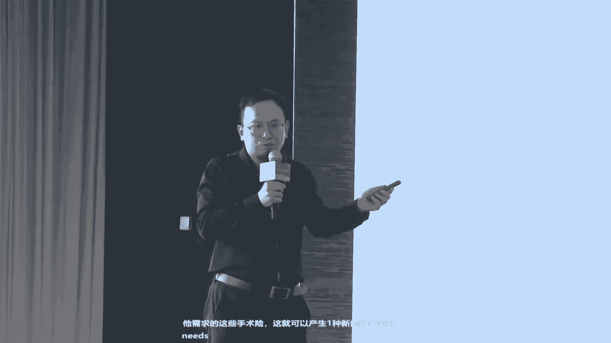
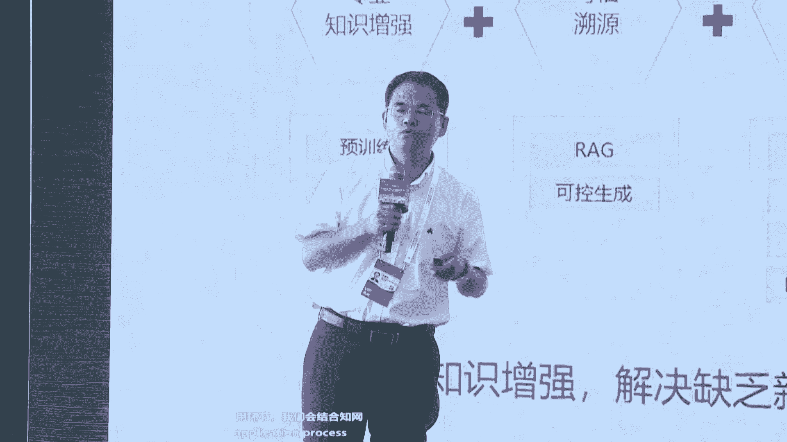

# 37：盘古大模型重塑千行万业 🚀

## 概述
在本节课中，我们将学习华为云盘古大模型5.0的核心能力、技术创新及其在多个行业（如自动驾驶、工业设计、医疗、钢铁、气象等）中的实际应用案例。课程将深入探讨大模型如何解决行业难题，并介绍其技术架构、开发平台及生态合作。

---

## 一、盘古大模型5.0：全栈能力与行业赋能

尊敬的各位嘉宾，欢迎来到2024世界人工智能大会华为云盘古大模型论坛。本次论坛旨在探讨在AI大模型新时代，企业如何拥抱人工智能，基于大模型突破行业关键技术瓶颈，实现提质、增效、降本、节能，构建智慧未来的新商业蓝图。

华为云盘古大模型5.0于近期发布，带来了一系列升级和突破。它具备以下核心特点：

1.  **全系列参数规格**：包含从**10亿、百亿、千亿到万亿**系列参数规格的模型。
2.  **多模态能力**：支持文字、视频、图片、卫星遥感、红外等多种模态数据的训练与理解。
3.  **强思维能力**：结合思维链和策略搜索技术，增强模型在数学、物理等理科领域的推理能力。

---

## 二、多模态生成：解决物理世界难题

上一节我们介绍了盘古大模型5.0的概览，本节中我们来看看其多模态生成能力如何解决物理世界的具体难题。

### 1. 自动驾驶场景生成
在自动驾驶模型训练中，需要大量符合真实物理规律的场景数据。传统生成内容可能违反物理规律（如车辆驶入人行道），无法用于训练。

盘古大模型通过**可控时空生成技术**，生成符合物理规律的连贯多视角视频。例如，它能生成一辆汽车从正前方、左前方、左后方、后方等6个摄像头视角的连贯行驶视频，且车辆状态、行驶轨迹、速度方向均符合真实驾驶规律。

**核心公式/概念**：
```
可控生成 = 基础生成模型 + 物理规律约束（轨迹、速度、状态一致性）
```
这使得生成的视频可用于自动驾驶模型的训练，大幅降低真实数据采集成本。

### 2. 工业设计与建筑设计
在工业领域，设计周期长是普遍难题。例如，汽车设计从图纸到3D模型再到油泥模型，通常需要1-2年。

盘古大模型能够通过自然语言描述或草图，直接生成符合要求的3D模型，并输出为工业设计软件（如CAD）所需格式，实现“所想即所见，所见即所得”。

在建筑领域，以著名的圣家族大教堂为例，传统设计耗时极长。盘古大模型与华南理工大学合作，能够将建筑草图直接转化为3D模型，极大提升设计效率，让设计师的灵感快速实现。

---

## 三、深入核心行业：视觉与预测求解的应用

多模态能力不仅限于生成，更在于对复杂场景的理解与优化。以下是其在核心行业中的应用。

### 1. 高铁安全检测
中国高铁的安全依赖于夜间检修。传统人工检测耗时耗力（每辆车约40分钟），且环境艰苦。

通过盘古大模型的多模态能力，可以训练出**“分割一切、检测一切”**的故障识别模型。该模型能分析高铁底部图像，自动识别故障点。在实际测试中，模型检测故障的准确率已达到90%，未来提升至95%或99%后，将比人工检测更安全、高效。

### 2. 钢铁制造工艺优化
钢铁制造流程复杂，工艺参数调优困难。例如，在热轧环节，需在几分钟内将260毫米厚的钢坯压至1点几毫米，且厚度误差需控制在0.01-0.05毫米。

盘古大模型能够学习海量的工艺参数表格、图像等多模态数据，寻找生产过程中的最优解。目前，该技术已应用于轧钢工艺优化，未来有望进一步用于高炉炼铁等“黑箱”过程的优化，推动制造行业能力升级。

### 3. 气象预测
传统气象预报依赖数千行数学方程计算。盘古气象大模型改变了这一范式。

去年，盘古大模型已实现全球台风预报。今年，通过与深圳、香港等地气象局合作，融入本地区域气象数据，能够实现**1公里、3公里、5公里**精度的天气预报，让“天有可测风云”。

---

## 四、技术架构与创新：如何炼成盘古大模型

了解了应用场景后，我们来看看支撑这些能力的底层技术创新。盘古大模型采用三层解耦架构。

### 1. 三层架构
*   **L0：基础大模型**：华为聚焦于打造包括自然语言、计算机视觉、预测与科学计算在内的多模态基础大模型。
*   **L1：行业大模型**：基于基础大模型，与客户和伙伴合作，注入行业知识，打造金融、工业、医疗等行业大模型。
*   **L2：场景模型**：客户可直接使用或基于行业大模型微调，得到最终部署的场景化模型。

### 2. 关键技术创新
以下是盘古大模型5.0背后的部分核心技术：

*   **数据工程与合成数据**：约30%的训练数据来自模型合成或AI改写，用于增强模型能力（如长文本理解）。采用课程学习策略，让模型像孩子一样循序渐进地学习不同难度的数据。
*   **模型架构创新（盘古π架构）**：
    *   改进自注意力机制，缓解深层网络中的**特征坍塌**问题。
    *   增强FFN层，采用**极数激活函数**组合提升非线性能力，在昇腾芯片上推理速度提升约25%。
*   **高效大集群训练**：通过多维度并行计算、通信流水线等技术，优化万卡集群的训练效率，保持高算力利用率。
*   **统一视觉编码器**：训练一个统一的编码器，使其能同时理解自然图像、文档、图表等多种视觉信息，并支持动态分辨率输入。
*   **强化复杂推理（STaR技术）**：通过**多步生成、策略搜索、过程监督**等技术，让模型进行“慢思考”，在多步推理任务（如数学、几何）上获得显著提升，等效于使用更大参数模型的能力。

**核心公式/概念**：
```
STaR = 思维链 (Chain-of-Thought) + 策略搜索 (Strategy Search) + 过程奖励模型 (Process Reward Model)
```



---

## 五、行业实践案例精选



### 案例一：医疗大模型（润达医疗）
**目标**：解决优质医疗资源不足与分布不均的问题。
**解决方案**：
1.  **“良医”智能体**：辅助医生进行病情判断、病历撰写、科研与患者全周期管理。在临床测评中，其综合得分已超过人类医生平均水平，实现医疗同质化。
2.  **“小慧”健康智能体**：为个人提供健康档案管理、千人千面的健康咨询与计划。通过拍照上传化验单等，自动生成结构化健康档案。
3.  **数据要素化**：利用大模型对海量非结构化医疗数据进行治理（结构化、标准化），使其成为可在合规前提下流通、配置的数据要素，赋能药企研发、保险精算等。

### 案例二：知识服务大模型（中国知网）
**目标**：将专业知识与大模型结合，提供可信、专业、可回溯的知识服务。
**解决方案**：打造“华智大模型”（中华知识大模型）。
*   **三次知识增强**：预训练加入知网高质量数据；应用时结合向量数据库；关键领域（如医疗）引入专家知识。
*   **应用场景**：
    *   **AI科研助手**：对话式文献检索与研读。
    *   **长文本生成**：快速生成调研报告、综述。
    *   **专利分析**：自动抽取技术要点、生成技术交底书。
    *   **AIGC检测**：识别AI生成内容。
    *   **专科专病模型**：如与北京儿童医院合作的模型，结合大模型与专家知识图谱，辅助诊疗与医生培训。

### 案例三：钢铁行业大模型（华为矿山军团）
**核心理念**：人工智能应像Excel一样，成为深入工作流的工具。
**落地关键**：
1.  **解决五大问题**：针对算法精度低、通用性差、负样本无穷尽、数据安全、人才短缺等行业痛点。
2.  **部署架构**：采用“集团私有云训练开发 + 边缘侧推理 + 云边协同”的模式，确保数据不出园区，安全可控。
3.  **核心应用**：
    *   **视觉质检**：皮带机撕裂、钢板表面缺陷检测（如汽车板），替代人工巡检，提升质量与效率。
    *   **预测求解**：优化热轧工艺参数，提高成材率，降低能耗。

---

## 六、开发者生态：华为开发者大赛

为推动AI应用创新，华为云每年举办华为开发者大赛。
*   **2024大赛亮点**：
    *   **双赛道**：“应用创新”赛道聚焦现代化应用开发；“算法”赛道与中国气象局合作，聚焦防灾减灾。
    *   **丰厚资源**：提供昇腾、鲲鹏等算力资源，ModelArts等开发平台，以及总额200万的奖金池。
    *   **创业扶持**：引入VC投资对接，优秀项目可获得最高100万云资源扶持。
*   **参与价值**：获得技术赋能、奖金激励、品牌曝光及投融资机会。

---

## 总结
本节课中，我们一起学习了华为云盘古大模型5.0如何通过其全栈能力、多模态生成与理解、强大的行业模型以及持续的技术创新，深入千行万业“解难题、做难事”。从自动驾驶的数字孪生，到工业制造的工艺优化，再到医疗普惠的知识赋能，盘古大模型正与合作伙伴共同构建AI时代的行业智能底座。华为云也通过开发者大赛等生态活动，持续赋能广大开发者，共同加速各行各业的智能化进程。