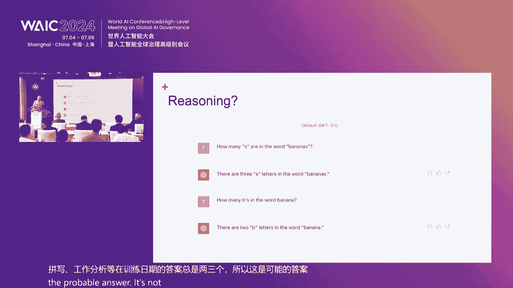
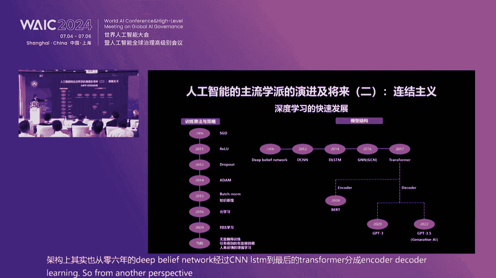
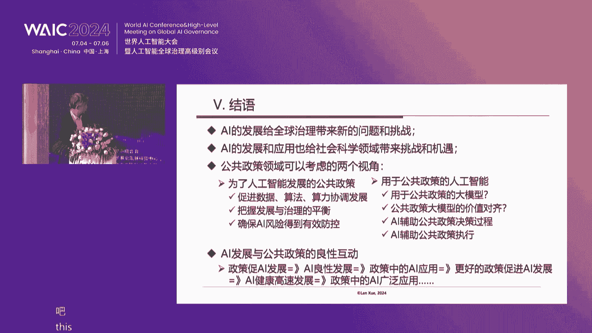
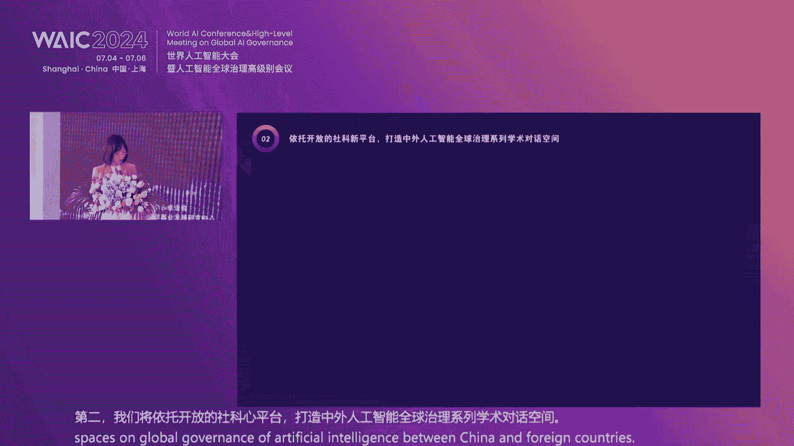

# 38：人工智能新进展与社会科学的未来论坛（P38）🎓

## 概述
在本节课中，我们将学习2024年世界人工智能大会“人工智能新进展与社会科学的未来”论坛的核心内容。课程将涵盖人工智能技术发展、其对社会科学的深远影响、相关的法律与伦理框架，以及全球治理与合作等关键议题。我们将以简洁直白的方式，整理并翻译论坛主旨报告与圆桌讨论的精华，帮助初学者理解这一交叉领域的前沿动态。

---

## 论坛开幕与致辞 🌟

尊敬的各位嘉宾、各位专家学者、女士们、先生们、朋友们，下午好。欢迎大家来到本次论坛。

当今世界，新一轮科技革命和产业变革深入发展，技术创新进入了前所未有的密集活跃区。人工智能是新一轮科技革命和产业变革的重要驱动力量，将对全球经济社会发展和人类文明进步产生深远影响。中国愿同世界各国一道，把握数字化、网络化、智能化的发展机遇，深化人工智能发展和治理国际合作。

2024年世界人工智能大会以“共商促共享，以善治促善智”为主题，突出反映了对人工智能发展中社会规范、科技伦理议题的高度关注。本次论坛旨在探索人工智能与社会科学的双向赋能路径，推进两者的融合发展，为人工智能的健康良性发展提供有力的社科支撑。

本次论坛由上海市社会科学界联合会主办，多家高校及研究机构承办，并得到了相关企业的特别支持。

---

## 主旨报告一：促进人工智能发展创新的法治框架 ⚖️

上一节我们介绍了论坛的背景与目标，本节中我们来看看法律框架在人工智能发展中的关键作用。

报告人首先阐述了构建人工智能法治框架的七个必要性理由：
1.  人工智能是解放人、塑造人，使人真正成其为人的最前沿、最重要的功绩之一。
2.  人工智能是当今世界竞争最为激烈的领域之一。
3.  人工智能在带给人类福祉的同时，也带来了诸多风险。
4.  人工智能在带来确定性好处的同时间，也带来了诸多不确定性。
5.  法治是最稳定、最可预期、最具有效力的治理工具。
6.  速度最快的机器或动力装置，无一不配有良好的安全阀和制动阀。
7.  当今全球的科技竞争，不仅是新型智能基础设施的角逐，更是数字文明和创新制度生态的比拼。

接着，报告人从三个方面提出了构建法治框架的思路：

**1. 治理理念：六个统一**
*   坚持以人为本与尊重客观规律相统一。
*   做到防风险与谋发展、保创新相统一。
*   做到防止垄断和数字鸿沟与促进公平竞争相统一。
*   维护个人权利与促进数据流通和应用相统一。
*   确保国家安全与促进国际交流合作相统一。
*   维护数字产权与谋求社会共生、互信、普惠相统一。

**2. 治理内容：四个“既要又要”**
*   既要构建完备的人工智能法律规范体系，又要完善法治实施体系。
*   既要规范设计者、制造者，又要规范平台建造者、传播者和使用者。
*   既要对数据进行规制，又要对算法和算力进行规制。
*   既要为所有相关主体配置权利，也要为其设定义务和明确责任。

**3. 治理策略：十二个结合**
以下是治理策略中需要关注的若干结合点：
*   立规与立德相结合。
*   赋权与课责相结合。
*   设置底线与包容审慎监管相结合。
*   统制与分类相结合。
*   他治与自治相结合。
*   政府治理与社会组织治理相结合。
*   硬治理与软治理相结合。
*   规制治理与技术治理相结合。
*   事后救济与事前预防相结合。
*   敏捷治理与前周期治理相结合。
*   系统治理与重点治理相结合。
*   “批发”与“零售”（即系统性立法与个案司法积累）相结合。

总之，人工智能治理是一个系统工程和长期过程，需要逐步总结经验，形成体系化的法律治理体系。

---

## 主旨报告二：科技创新与科技伦理 🔬

上一节我们探讨了法律框架，本节我们将关注科技创新背后的伦理维度。

报告人基于自身四十年的科技政策研究经历，分享了四点认识：

**1. 科技发展的规律性**
从工业革命到信息技术革命，再到即将到来的人工智能革命，技术发展是人的功能延伸：工业革命延伸了人的肢体，信息技术革命延伸了人的神经系统，而人工智能革命将延伸人的大脑（内脑技术）。

**2. 科技的进步性取决于科技伦理**
科技本身不一定是进步的，也可能是反动的。其进步性取决于是否遵循良好的科技伦理。例如，信息技术革命催生了严重的电信诈骗问题；人工智能在围棋领域击败人类顶尖选手，可能消解人类文化活动的乐趣；无人机在农业中的应用造福社会，但在军事冲突中的应用则带来破坏。因此，必须为人工智能设定伦理边界和负面清单。

**3. 从科技革命到产业革命具有选择性**
一次科技革命具有选择性，并非所有发明都能转化为产业革命。例如，历史上晶体管战胜了激光，数字技术战胜了模拟技术。当前对元宇宙的过度热衷可能是一种误判。新科技革命必然集中在一个关键领域突破，并形成产业群和供应链。

**4. 中国如何在人工智能新科技革命中走在前列**
报告人提出了一个金字塔框架来认识人工智能：
*   **顶层（原创与伦理）：** 狠抓原创技术（如芯片、操作系统）和科技伦理建设。
*   **中层（新基础设施）：** 建设数字时代的新基础设施，如区块链、量子通信、5G/6G、算力算法、云计算与大数据。
*   **底层（应用场景）：** 大力发展人工智能应用场景产业。

此外，需要清晰认识新质生产力的本质是**人工智能赋能各种业态**。在原创上要紧追国际先进水平。对于上海而言，应集中优势寻求突破，例如利用其在临床医疗和数据方面的优势，重点突破**生物医药**领域的人工智能应用。

---

## 主旨报告三：人类世界中的人工智能 🤖

上一节我们讨论了科技伦理，本节我们从计算机科学家的视角审视人工智能在人类世界中的融入。

报告人指出，人工智能革命正以史无前例的速度到来，其普及速度远超互联网和工业革命。以ChatGPT为例，其用户增长和公司收入增长速度创造了历史记录。

人工智能早已潜移默化地融入生活：
*   **导航系统：** 智能手机或车载导航中寻找最短路径的算法（A*搜索）源于20世纪70年代的机器人研究。
*   **流媒体推荐：** 如Netflix，其内容排列、推荐甚至展示图片都由人工智能决定，超过80%的观看内容来自AI推荐，这意味着我们的“世界观”正被AI中介化。

然而，当前的人工智能（如大语言模型）仍有明显缺陷，它们基于概率预测而非真正理解，有时会犯低级错误。

关于人工智能对就业的影响，报告人认为一些预测（如英国央行行长预测50%的英国工作面临风险）过于悲观。这些分析忽略了新岗位的创造、人口结构变化和工作时长缩短等因素。自动化的影响因工作而异：
*   **可能被自动化的工作：** 出租车司机、卡车司机（因成本驱动）。
*   **不太可能被自动化的工作：** 自行车修理工（经济上不合理，且其社交功能无法替代）、时装模特（已被生成式AI部分替代）、飞行员（技术上可行，但心理上人类仍需“在环”）。

**人类在人工智能时代的机遇三角**
报告人提出了一个“机遇三角”模型，指出人类应专注于三个机器不擅长的角落：
1.  **发明未来：** 从事创造性和研发工作。
2.  **社交与情感智能：** 从事需要领导力、同理心、人际交流的职业，如CEO、销售、医生、政治家。
3.  **创造力与艺术：** 从事与人类独特体验（如爱、失去、死亡）深刻共鸣的艺术创作，即使机器能创作，其作品也缺乏这种人类情感的联结。

---

## 主旨报告四：人工智能与未来社会 🚀

上一节我们看到了人工智能与人类的互补性，本节我们将深入技术路径，探讨人工智能的真正潜力与局限。

报告人从技术史角度分析，指出当前主流的人工智能研究有两条脉络：一是维纳的控制论（强调反馈与调节），二是图灵、冯·诺依曼的符号计算与架构。当前火热的大语言模型（如基于Transformer架构的GPT）属于“知识智能”，它通过阅读人类总结的文本知识进行学习，获得了语言知识、百科知识和部分常识。

然而，这种路径存在根本局限：
*   **缺乏验证机制：** 人脑采用“预测-验证”机制，而Transformer只有预测，不知道自己不知道。
*   **无法产生意识与情感：** 其结构与人脑中产生意识的神经结构不同。
*   **只能学习显性知识：** 无法学习人类大脑中未被文字化的“隐知识”和“活知识”。
*   **能耗极高：** 超大规模数据中心的建设面临电力瓶颈。

通往通用人工智能（AGI）可能需要其他路径，例如：
*   **构建世界模型：** 在四维时空场中通过强化学习获得常识和经验。
*   **显性逻辑推导：** 结合人类的第一性原理和哲学思维。
*   **运用数学进行高维验证：** 利用数学工具进行后验概率计算。

**人工智能对商业生态系统的影响**
互联网和移动互联网时代催生了“交易平台”巨头（如电商、社交平台），它们通过网络效应实现赢者通吃。AIoT时代，交互方式将变为以语言为核心。这将催生代表消费者利益的AI代理，改变消费者与厂商的关系，传统交易平台可能被重塑。

**人工智能对社会与全球化的影响**
技术替代职业的速度可能快于人类职业转换和退休的节奏，导致社会动荡，需要政策干预。对于美国，AI和机器人可能使其重振制造业。中国的优势在于技术实现、应用开发和设备制造，而美国强于科学探索与原始创新。

全球化3.0可能不再是单一的全球产业链分工，而是趋向于区域性、内聚性的技术-生产-消费循环，例如中国“胖东来”式的、注重员工福祉与社区价值的模式可能提供另一种范式。

---

## 主旨报告五：人工智能的全球治理与合作 🌍

上一节我们展望了人工智能对社会结构的可能重塑，本节我们聚焦于如何在全球层面治理这一强大技术。

人工智能的迅猛发展带来了技术系统、伦理安全、社会应用和国家治理四个层面的风险，使得全球治理变得至关重要。过去一年，从联合国专家组到英美人工智能安全峰会，再到欧盟人工智能法案，全球各方已积极行动起来。

然而，人工智能全球治理面临诸多挑战：

**1. 地缘政治**
中美科技合作空间因所谓的“小院高墙”策略而被极度压缩，从基础研究、商用技术到前沿技术，合作几乎停滞。缺乏基本信任和安全感，严重阻碍了在人工智能安全等关键技术领域的实质性对话与合作。

**2. 技术路径依赖**
对“规模定律”的盲目信仰可能是片面的，需要探索多元化的技术发展路径。

**3. 治理步调失调**
技术发展快，而法律法规和制度变革慢，存在“步调不一致”问题。

**4. 机制复合体困境**
多个国际机制、组织、标准同时涉及人工智能治理，彼此缺乏协调，导致规则碎片化，令企业和从业者无所适从。

**5. 监督执行困难**
与核技术不同，人工智能研发隐蔽性强，难以像监控核设施那样进行有效监督。

为应对挑战，报告人提出以下建议：
*   **分层分类治理：** 对治理问题进行分类，分工协作，自下而上推进。
*   **推动全球公共产品：** 将人工智能治理与安全作为全球公共产品，而非小圈子俱乐部产品。
*   **促进中美有限合作：** 在人工智能安全等共同关切领域重启对话与合作。
*   **拓展多层次交流：** 加强双边、多边、二轨等多渠道的学术与政策对话。
*   **开展大科学研究：** 各国科学家合作，共同研究制定应对人工智能失控等极端情况的应急预案。

**社会科学的两大使命**
对于社会科学而言，在人工智能时代肩负两大使命：
1.  **为人工智能发展的公共政策：** 研究如何推动AI发展、防控其风险。
2.  **用于公共政策的人工智能：** 研究如何利用AI工具改进公共政策的制定、执行与评估。

---

## 论坛总结与展望 ✨

在本节课中，我们一起学习了“人工智能新进展与社会科学的未来”论坛的核心内容。我们从开幕致辞中了解了论坛召开的背景与意义，随后深入探讨了五个主旨报告：从构建促进人工智能创新的**法治框架**，到审视**科技伦理**对技术方向的根本约束；从计算机科学家眼中**人工智能融入人类世界**的现实与机遇，到技术专家对**人工智能发展路径与未来社会**的深刻剖析，最后上升到**全球治理与合作**面临的挑战与出路。

两场圆桌讨论进一步丰富了这些议题，学者们从政治学、哲学、金融学、公共管理学等多学科视角，探讨了人工智能对社会结构、就业、金融风险、哲学思考以及跨学科研究方法的深刻影响。共识在于，人工智能不仅是工具，更是正在重塑社会的基本力量；社会科学必须深度介入，通过跨学科合作，在伦理、法律、治理等方面引导其健康发展。

本次论坛标志着社会科学界有组织地系统回应人工智能时代挑战的开始。未来，相关研究、对话与国际合作将持续推进，旨在以“善治”促“善智”，让人工智能更好地造福人类社会。

---
**总结：**
本节课系统梳理了人工智能与社会科学交叉领域的前沿讨论，涵盖了技术、法律、伦理、经济、全球治理等多个维度。核心在于认识到人工智能发展的复杂性和深远社会影响，并强调必须通过健全的法治、坚实的伦理、有效的全球合作以及社会科学的深度赋能，共同引导其向有利于人类福祉的方向发展。