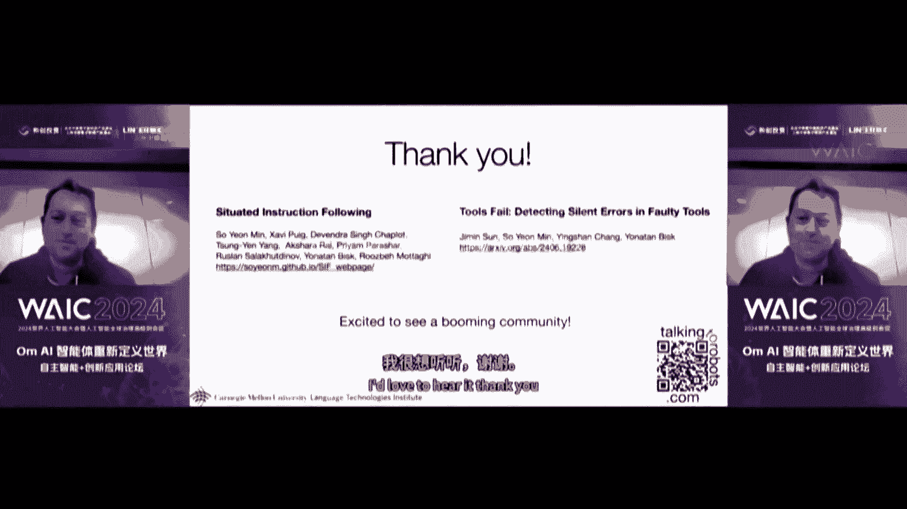
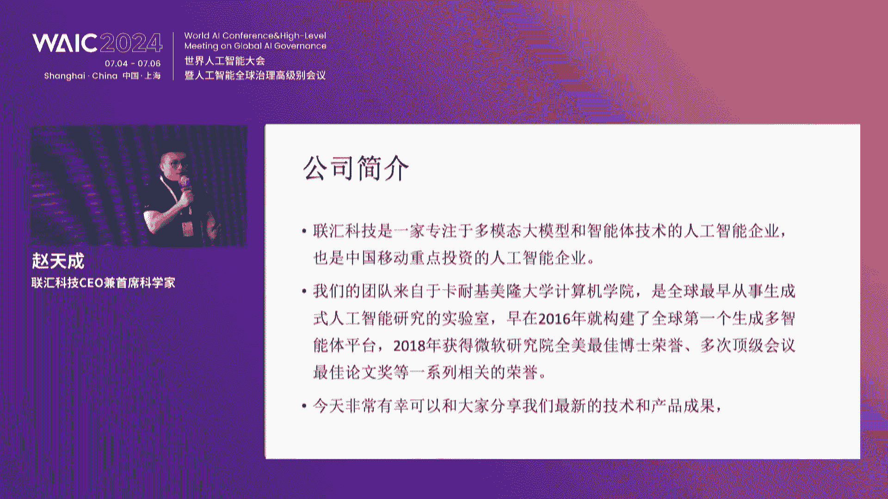
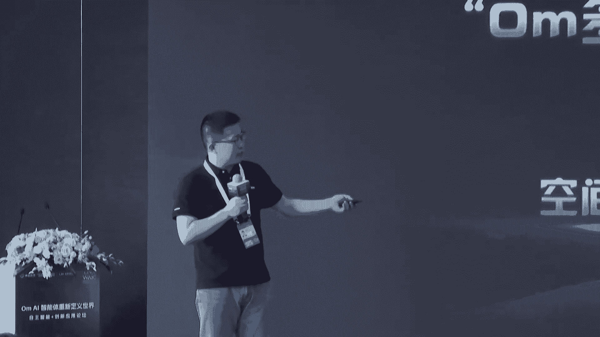
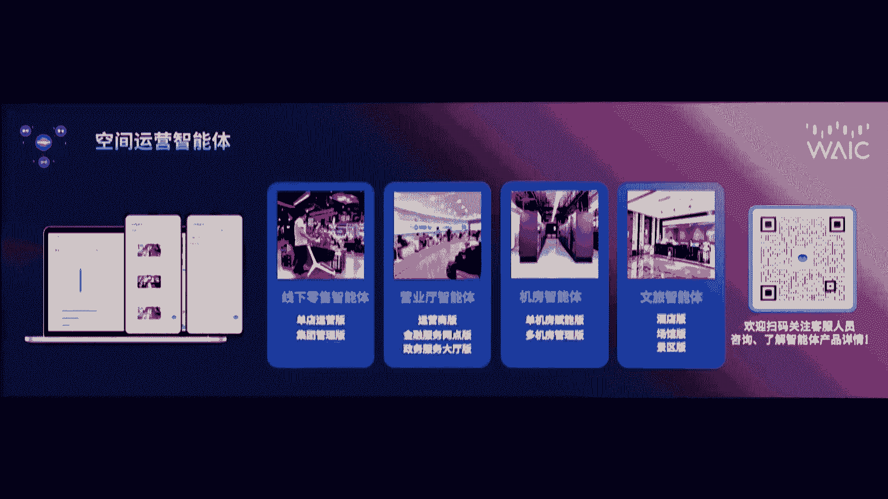
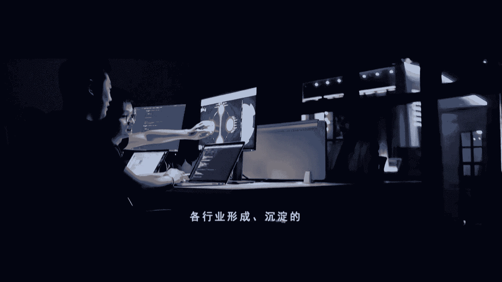
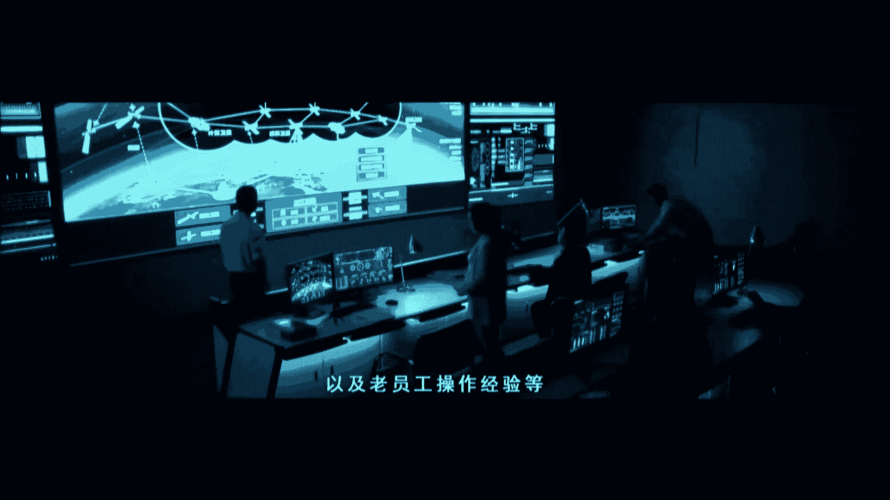

# 40：AI智能体技术前沿与应用实践 🚀

## 概述
在本节课中，我们将学习人工智能领域的最新进展，特别是大模型与智能体技术如何重新定义世界。课程内容源自“Om AI 智能体重新定义世界”自主智能+创新应用论坛，我们将深入探讨多模态大模型、智能体框架、行业应用案例以及未来的发展趋势。

---

## 第一节：人工智能发展的宏观背景与战略意义 🌍

推动全球经济发展。在刚刚闭幕的全国科技大会上，总书记发出了2035年前要把我国建设成为科技强国的伟大号召。总理在2024年的工作报告中指出，要抓住人工智能这个“牛鼻子”，加速培育新质生产力的战略部署。

大模型技术近年来得到了飞速的发展，特别是多模态大模型技术突破，已经成为全球科技领域的一个重点和热点。

全球的科研机构、高校纷纷推出了各种语言、图像、视频、音频处理大模型，并以惊人的速度在迭代。这些技术进步，不仅为人工智能的广泛应用提供了强有力的支持，也为各行各业智能化升级注入了新的动力。

然而，大模型并不是人工智能的全部，也不能解决所有场景的应用问题。例如，大模型的场景适应性亟待优化，实用化性能需要继续提高，部署的可行性也亟待解决。在许多场合下，自主智能技术是应对这些挑战的一个重要手段。

另外，科研机构在实践中做了许多有益的尝试和探索，包括我自己做的这个领域，其实也还不完全是用这个大模型来做。

联会科技凭借着在多模态大模型和向量数据库等方面的积累，推出了系列智能体技术，在电力、媒体等多个行业中实现了标杆化的应用。人工智能源于人类智能，并将与人类智慧共生共存。

在未来，**生成式AI**与**深度AI**的深度融合，将在提升生产效率、优化运营管理、增强服务体验方面带来革命性的变化。同时也提醒我们，人工智能的广泛应用不仅是技术的进步，更是人类社会的进步。

唯有加速推动人工智能技术和各行各业的深度融合，探索更多的创新应用模式和解决方案，才能更好地服务于社会经济的发展，推动整个社会向前进。千帆进发，勇者胜，希望各位同仁能够利用这次论坛提供的机会，聚焦自主智能与创新应用，汇集产业观点，分享产业硕果，剖析技术趋势，洞察产业未来，为推动AI技术的发展和应用贡献智慧和力量。

---

## 第二节：资本与技术的融合：产业发展的引擎 💰

如果说人工智能是行业发展的助推器，那么资本必定是行业发展的引擎，为创新提供了源源不断的动力。

中国移动产业链发展基金，是中国移动贯彻落实中央企业链长单位工作要求，以资本为载体，带动产业链发展的重要举措。在对人工智能行业进行了全面严格的考察调研后，2023年从国内百余家大模型企业中选择了联会科技进行重点战略投资，实现了资本与技术的强强联合。

中国移动产业链发展基金作为中国移动响应国家战略、发挥中央企业引领作用的重要举措，承载着推动科技创新与产业升级的使命。我们通过资本的力量，深化央地合作、激发产业链的协同效应，致力于构建一个具有全球竞争力的现代产业体系，为国家的持续繁荣和科技领先贡献力量。

基金紧密围绕国资委提出的9个战略新兴产业和6个未来产业，在数字经济和移动信息产业链领域进行前瞻性规划和投资布局。我们致力于服务京津冀与长三角区域的数字经济发展，通过投资和培育一大批有潜力的中小企业，牵引产业链的不断补链、强链，增强产业链供应链的韧性和竞争力。

特别值得一提的是，联会科技作为我们在人工智能领域长期重点关注并积极投资的企业，不仅在国际舞台上展示了中国AI技术的卓越实力，更以其前沿能力，成为国内人工智能技术的佼佼者。联会科技的团队在国内外等多个顶级会议和比赛中屡获殊荣，其商业化进程和技术能力也已经在运营商、电力、媒体等行业中落地并尤为突出，为推动人工智能赋能行业建设、促进数字经济的高质量发展做出了卓越贡献。

在推动科技协同创新与产业发展的征途上，中国移动产业链发展基金以资本为纽带，加速聚合产业链、筑强创新链、带动供应链、构筑生态链。我们致力于为各类创新企业提供强有力的支持和广阔的发展平台，坚信资本与技术的深度融合将激发更多创新活力，推动产业链的升级和行业的数字化转型。

---

## 第三节：标准化建设：技术发展的基石 📐

当下的标准化建设是加速通用技术产品与服务覆盖的重要保障，对于行业的支撑引领作用尤为重要。联会科技也正在深度参与大模型、智能体与向量数据库等国家标准建设工作。

标准是我们国家的一项基础性技术制度。标准化建设不仅是技术发展和应用的基石，也是推动产业健康发展的一个关键。

中国电子技术标准化研究院作为工信部的直属事业单位，是国家电子信息技术领域标准化的领军单位。目前我们承担了国家层面的人工智能、大数据、脑机交互、元宇宙以及相关前沿重点信息技术领域的国家标准以及国际标准的制定工作。

目前在人工智能领域，我们承担了全国信标委人工智能分委会的秘书处单位，同时也是国家人工智能标准化总体组的秘书处单位。在这个过程当中，我们目前正在围绕人工智能产业的发展，围绕着像人工智能智能体、大模型、科学计算、具身智能等新一代人工智能国家标准的制定和检验检测工具，来开展国家层面的标准制定。同时，我们也在联合业内的相关单位，围绕国内产业发展的实际，正在开展国际标准的研制。

联会科技作为我们业内最早在大模型和智能体领域展露领先优势的企业，不仅拥有全面的技术积累，而且凭借卓越的产品和服务，在行业内发挥了重要作用。最重要的是，在去年联会科技参与了大模型以及智能体等相关国家标准的编制，同时牵头了智能体的第一部分国家标准编制。目前这项标准正在推动国家标准立项。他们基于前期的业内技术积累，也为推动行业的发展和标准化进程做出了积极的贡献。

随着大模型、智能体等先进的AI技术与产品的规模化应用，我们将携手业内的政产学研用单位以及相关的成员单位，会围绕着这些前沿的技术领域方向开展相关标准的探索，围绕这些探索开展更加有力的规范和引领AI赋能行业的应用。同时，我们也会推进国家标准、国际标准的制定，同时也会强化技术基础体系的建设。

---

## 第四节：学术前沿：具身智能与工具失效问题 🤖

大模型的技术进步与应用突破为全球经济发展带来了全新的活力。人工智能的发展洪流也必将势不可挡。

卡内基梅隆大学拥有全世界最大的计算机学院，更是全球人工智能技术的重要引领者之一。卡内基梅隆大学计算机学院教授、博士生导师作为自然语言处理领域的代表人物，擅长揭示自然语言的潜在结构，对物理世界的语义进行建模，将语言与感知和控制联系起来，是具身智能多模态机器人领域的先导者，在通用人工智能技术领域影响巨大。

本次报告将从使用大语言模型作为规划器的视角来探讨具身AI问题。我们利用大语言模型中蕴含的常识知识，但同时也思考这种范式在哪些地方会开始失效，或者与我们对于这些智能体的实际目标产生错位。

我们都熟悉智能体AI的兴起。这些智能体在网络上为我们做事，或许也在视频游戏中为我们做事，在这个过程中接收不同类型的模态信息。这是一个巨大的领域，非常令人兴奋。

但我要讨论的与此略有不同。我们喜欢用机器人的图片作为例子，但它并不是真正的机器人，也并非真正具身。那么，智能体与具身之间的差距是什么？

有一些显而易见的东西：环境动态性、感知失败、长时程任务、硬件复杂性。当开始谈论机器人时，你可能会立刻想到这些。比如，哦，是的，它们需要摄像头，需要能够在世界中移动。你可能会列出一个非常长的清单来描述这些。

但我认为大多数人会忘记一点，那就是**人**。当你实际与这个未来在你家中为你打扫卫生的机器人互动时，你就站在它旁边。因此，你采取的行动将改变这个系统解读指令的方式。这是一件好事。但我们目前没有与之匹配的基准测试。

我们现在做的是在抽象层面思考指令跟随。例如，Peter Anderson的视觉语言导航数据集，我认为这是该领域的基础。我们扩展了这项工作，这就是Alfred，我们在模拟家庭中进行指令跟随。你可以移动物体，我们甚至尝试将这种指令跟随迁移到物理机器人上，以便你可以在现实世界中采取行动。

这很棒，但这里有点令人不安的是，它们是空的，没有人类。你有这些机器人四处移动，遵循高级指令、低级指令。但它们从何而来？我们真的需要人类，因为语言是社会性的。我们使用语言是因为我们渴望与周围的人交流。

因此，一个自然而然的问题是：**物理人类在指令跟随中扮演什么角色？** 我们需要思考如何构建这一点，以及这会带来哪些新的挑战。

让我们稍微激发一下这个问题。我可能有一个指令，比如“把杯子放在餐桌上”。对于一个智能体来说，它需要解决一些模糊性。有多个杯子吗？哪个是所指的杯子？我的地图准确吗？这些是我们将反复提及的模糊性的重要组成部分。

但如果我做一个小小的改变，对我来说更自然的说法可能是“给我拿个杯子”。现在，我仍然有那些相同的模糊性来源，但我有了一个新的模糊性：你是静止的还是移动的？如果你在环境中移动，那么在我开始去拿其中一个物体的那一刻，我就看不到你了，我将不得不重新映射或改变一些事情。在这个简单的案例中，我待在同一个房间里，但通常情况并非如此。

我们如何解决这个问题？一种解决方式是，“给我拿个杯子”这种指令根本不会发生。相反，我们使用这种过度指定的语言解决方案。我们生成一个关于我们想要什么的非常大的描述，非常清楚地指定要拿起哪个物体，以及我们想把它放到哪里。例如，如果我知道我正在走向沙发，那么我可能会有这样一个大指令：“把那个咖啡桌左侧的、半满棕色水的脏白色杯子拿到客厅的沙发上”。这个规范足以解决那些模糊性，但它极其不自然。你可以想象，你永远不会想对你的家用机器人说这个，你会把它退回商店。你只想说“给我拿个杯子”，非常简单直接。

因此，我们可以创建这样一个二分法。视觉语言导航可能是一个过度指定、大指令设置的例子。而Alfred则是另一种，属于指定不足，但仍然没有真正的人类来推理。我们试图提出，在这两者之间存在一个中间地带：**情境化指令跟随**。

如果有一个人在场，需要说什么？不需要说什么？我的行动本身暗示了什么？我边说边朝那个方向走，这改变了什么？映射有什么变化？因为突然间，环境中有了动态的东西。人类可能会移动东西。这仅仅是我需要能够解决的众多模糊性来源之一。因此，我现在必须理解我对什么感到困惑，以及该做什么。

让我们用一个简单的设置来讨论这些。我们在Habitat 3.0中做了这个，因为它允许我们拥有实际在环境中移动的模拟人类。

这里有一个指令示例，它们非常简短：“给我拿个杯子。我要去洗澡。” 这是一个你完全可能对某人说的非常自然的事情，你不会觉得有什么。这里有一些维度上的模糊性，正如我们一直在讨论的：杯子在哪里？哪个浴室？

时间上的模糊性：这里的模糊性可以通过跟随这个人来解决，因为他们说他们要去洗澡，或者在这个案例中，他们正走向卧室。我是否应该跟随他们来解决模糊性？我跟他们多远？什么时候这种效率权衡会失效？

以及环境的动态性：如果他们在环境中移动，那么我可能检测不到杯子，这可能是我自己的问题，因为我的感知系统有问题，也可能是因为环境确实发生了变化。正如我所说，人类可能移动了它。然后还有一个问题：如果我打算解决那个问题，那么我必须决定，我应该继续搜索吗？我应该在哪里搜索？这样做与简单地回到我之前的表征之间有什么权衡？

这并非详尽无遗，但我认为它让你感受到了一些挑战所在以及事情是如何变化的。

具体来说，我们将任务分为三种不同类型。我们有一个简单的请求，在开始之前，智能体能够环顾环境并构建其初始地图。

然后当指令到来时，我们有一个“拾取放置”任务，这非常接近人们习惯的指令跟随：找到一个物体，将其移动到一个静态的接收器（在这个案例中，假设人没有移动）。

然后我们有一个像“给我拿个杯子。我洗手时移动了它。”这样的指令。在这个案例中，我们现在有一些关于它曾经在哪里的提示，以及你正在使用的地图可能已经过时，需要用这个新信息更新的情况。

最后，我们有“我要去洗手”的指令。所以现在我们有一个将来时态的情况，不仅仅是地图过时了，而且接收器（也就是“我”）实际上随着时间在变化，我需要关注这一点。特别是后两者，将与当前文献中存在的任务有很大不同。因此，这些将是我们进行基准测试的重要内容。

我们尝试用直接规划器对这种情境推理进行基准测试，以便与文献进行直接比较。基本上就是：我是否在感知？我是否理解指令？我是否在构建地图？然后我们将所有这些传递给GPT-4，询问它应该做什么，比如它应该专注于任务的哪一部分？下一步预测是什么？例如，它是否应该跟随人类？

这让你对结果有个概念。在测试环境中，学习模型在“拾取放置”任务上表现得相当好，但在物体移动过甚至是在未见环境中跟踪人类方面就不那么好了，我们会看到非常相似的趋势。

现在，你可能想知道有很多地方可能出错。这其中有多少是感知错误？有多少实际上是推理能力造成的？所以在这里我们完全解决了这个问题。你现在拥有“先知”一切的能力。公平地说，你确实不应该拥有先知一切的能力，因为你真的应该搜索地图并构建那些更新的表征。但即便如此，你仍然看到从标准的“拾取放置”任务到这些情境任务、再到这些动态环境的性能急剧下降。因此，我认为这对于我们前进非常重要的一部分是，专注于如何确保我们构建的智能体能够真正利用环境是动态的这一事实，并利用这一点来构建更好的用户体验。

最后我想说的是，我们已经到了这个地步，我们说我们不单独行动。但我们处理这个问题，即自始至终我都在谈论你必须学习、必须使用的模块。我们不知道什么时候应该或不应该信任自己。

因此，我想给你一个我们最近刚刚在线发布的一些工作的预告。我认为在我刚才展示的模块中，也在所有类型的系统内的智能体中，我们已经非常习惯于工具使用的概念。这个概念是，语言模型可以决定适当的上下文和工具输入，传递给某个它选择的工具，以获得预测输出。这在检索增强生成中可以看到，在模拟环境中也可以看到。这个想法是，我们在语言模型中有一个高级规划器，然后它将调用一些其他功能，在这个案例中，可能是在机器人上实现的。

但我们可以问一些问题，关于这种范式可能在哪些地方失效。错误的来源是什么？哪些部分会失败？哪些部分可以恢复？我们如何从中恢复？我们没有所有问题的答案。但你可以看到，在模拟环境中，或者更普遍地在具身环境中，这种情况会立即发生。所以，我们在模拟环境中评估了它。

例如，如果我必须清洗并切片苹果，我有一个物体检测器。它是否真的能找出正确的物体？语言模型是否知道如何从这些预测中恢复？然后我有一个动作规划器，它也是一个学习模块。它是否知道是否应该信任这些后续步骤？所以现在你可能会产生错误的叠加。在人类中，我们可以解决这个问题，因为在人类中，我们可以检测到一种元认知式的理解，了解我们的能力以及我们可能在哪些地方看到偏差。

让我们从一个非常简单的情况开始：一个有故障的计算器。我做不了惊人的心算，但我能察觉到是否有点不对劲。那么，一个语言模型能否检测到计算器输出时最后一位数字是否改变、任何数字是否改变、数量级是否出错？例如，我认为如果相差10倍，或者符号翻转，我会知道两个正数相加永远不应该得到负数，当我们知道这些我们认为有些直观的事情时。

这对我们来说非常容易。这只是一个简单的图表，展示了一些使用工具的大型模型，以及当工具正确与错误时，事情是如何偏离的。黑线显示了当完全没有工具时，模型回答数学问题的能力。所以它们知道答案。但是，一旦你引入一个有故障的工具，它们的性能在几种情况下会急剧下降。例如，GPT-3.5的情况，但即使是GPT-4也看到了这种下降。所以存在一个问题，模型知道答案，但它不信任自己，反而依赖工具。现在，使用正确的工具，它们都能做得更好，这是橙线，但这不是重点。

**语言模型即使知道答案也会失败。** 所以现在我们有了这个问题：如果我要将工具（特别是学习到的工具）放入系统中，我如何处理这类问题？正如我刚才所说，对于具身AI来说，情况只会更糟，只会对我们来说更难。

这里的规划器例子，检测器例子，它们检测到的一些物体可能是正确的，也许置信度不太够。我们如何告诉模型什么时候应该或不应该从这些事情中恢复？

所以，在这里做个总结。我讨论了两篇论文，但我认为它们是一个更大问题的一部分：随着我们进入具身AI，进入这些智能体系统，进入作为规划器的语言模型（它们越来越强大），**陷阱在哪里？** 哪些地方因为没有人而存在与现实世界的错位？哪些地方我们假设我们将拥有完美的API，但当它们失效时，我们实际上并没有以允许这种恢复的方式设计我们的系统？

因此，这些是我希望留给你们的两个主要问题。我的理解是，Tony接下来将接手，谈论视频空间内的事情。作为一个快速的评论，我认为我没有在这里解决的一个问题是，智能体、具身系统的其他信息来源问题。所以我们在这个领域有一些工作，但这是一个巨大的领域。有给你指令的人类固然很好，但你不应该向人类学习吗？你不应该能够更普遍地从那个信号中提取信息吗？你可以想象，理想的情况是一个从所有YouTube视频中学习的具身智能体。

---

## 第五节：多模态大模型的细粒度感知与适配 🎨

非常感谢联会科技的邀请。我的题目叫“细粒度多模态大模型”，一会我会来加以解释。那首先讲一下整体的研究背景。

多模态大模型的定义，今天开那个展会上有很多。那么它实际上指的是什么呢？首先就是提取并融合文本、图像、视频这样的多模态数据表征，然后通过大语言模型来进行推理，经过微调后适配到多种下游任务的基础模型。这是整个多模态大模型的一个定义。

那么这里面呢，就是说它的局限性，我们在当前肯定要想想它有什么样的一些局限性。那么第一个局限性就是这个感知粒度粗。这个指的是什么呢？就是在多模态大模型里面，它的感知能力，它是依赖于大量训练数据。但是大量训练数据的这个细粒度类别标注成本巨大，一会我会给大家解释这个细粒度类别标注的问题。所以就导致这个大模型缺乏细粒度的一个感知能力。这是第一个局限性。

那么第二个呢就是这个任务适配了。那现在企业里面它已经有很多的一些软件。但是我们如果做了一个模型以后，可以支持多个下游任务，但是支持这个多个下游任务的时候，它有个优化适配的问题。这个一会我会来加以解释。

这一个呢就是GPT-4o，是今年5月份OpenAI发布的最新的一个多模态大模型。那我们如果来做一个测试，大家看这样的一张左边这样的一张图片，就是问他这个结果，那么他回答是这个就就是中间这个叶子的这个虫，他回答是这个豆甲名，实际上它的真实结果是甜菜叶螟，这是一种昆虫的一种名字。一旦到细粒度以后，它就会出错。那么右边也是一样的，那个植物问它叫什么，他说是那个山栏，实际上呢它是这个七指木。这是两种植物。

不只是这种，就是大家知道细粒度的一个，先解释一下。就是我们通常说我们识别出粗粒度，比如这是车，这是鸟，对吧？这是飞机。那么细粒度指的是什么意思呢？就是车里面它到底是宝马奔驰还是奥迪，奥迪下面到底是A4还是A6、A8，就是往下的一个细粒度识别。那么这个最新的多模态大模型，它细粒度这个能力是没有的。

那么第二个呢就是这个刚才我讲的这个适配方法。适配方法，从技术上来说是你有多个下游任务，我怎么用一个模型来让几个这种下游任务的性能