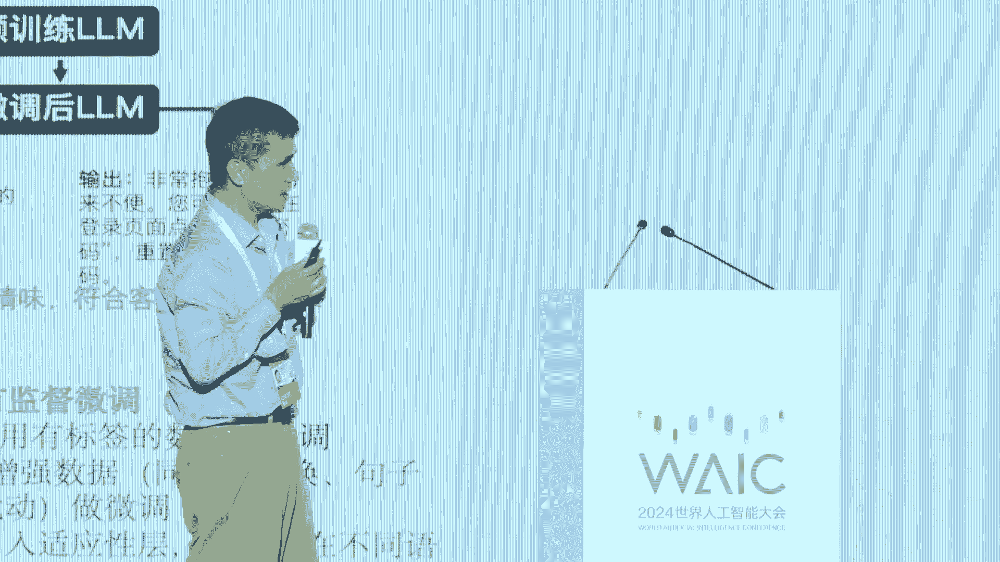
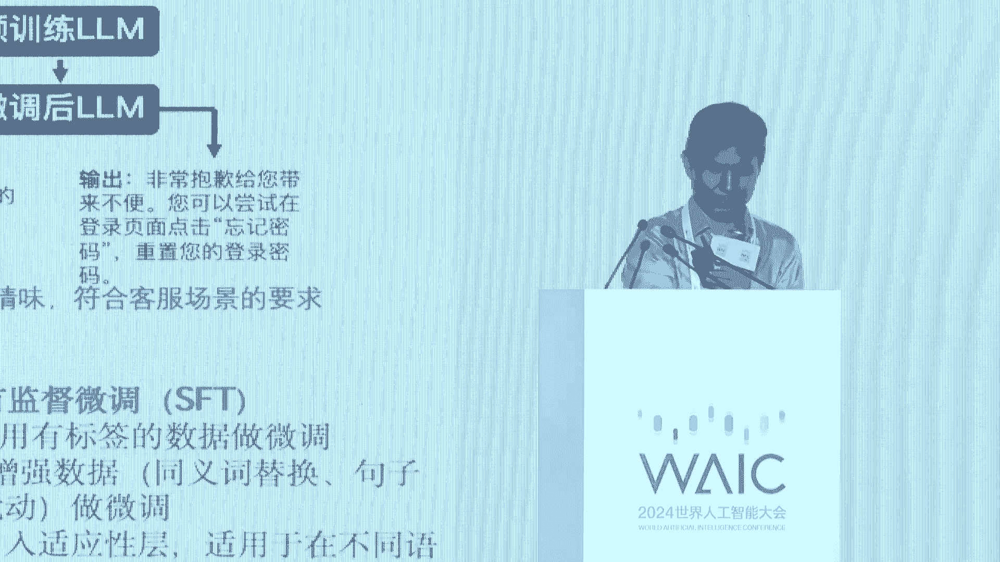
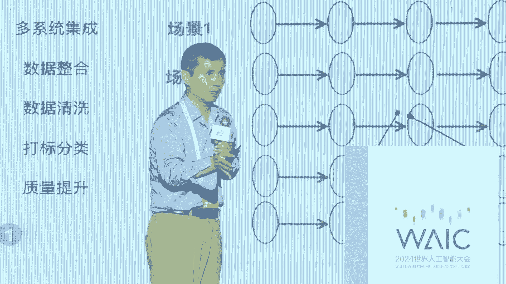
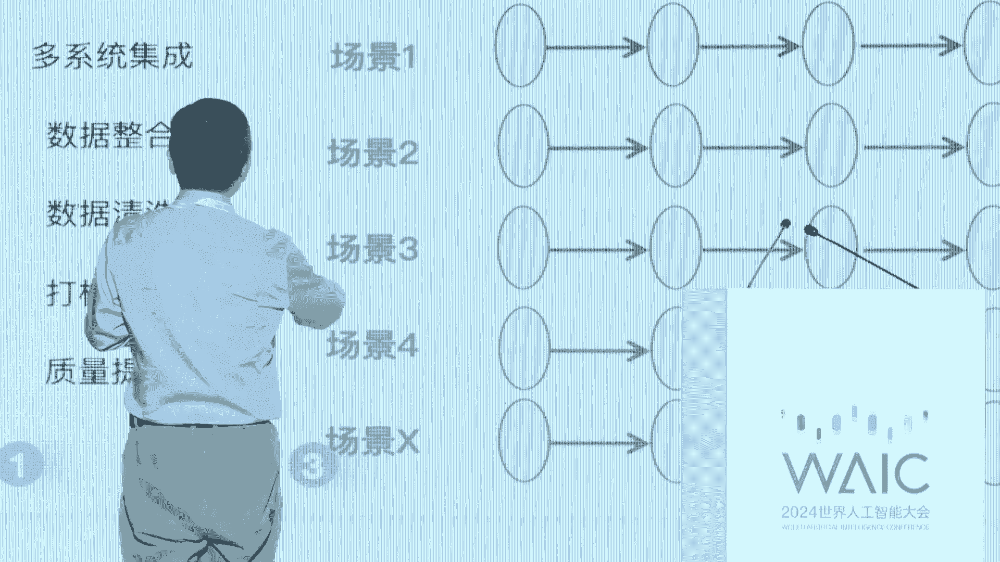
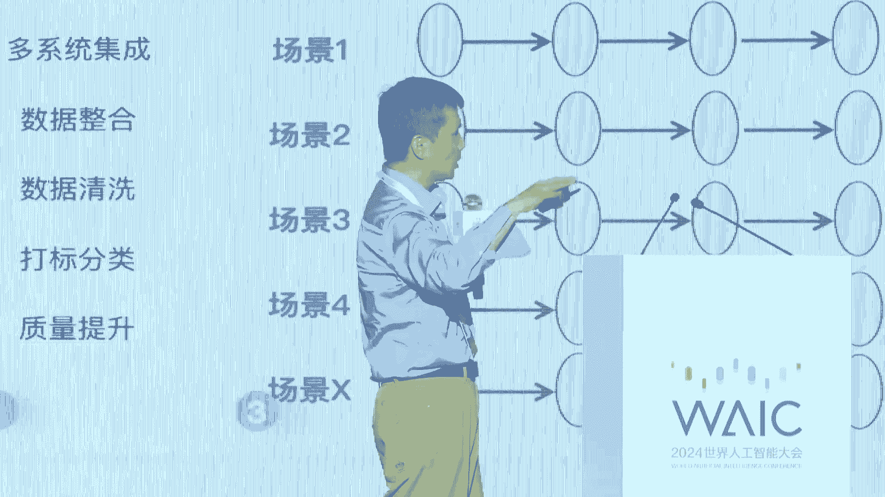
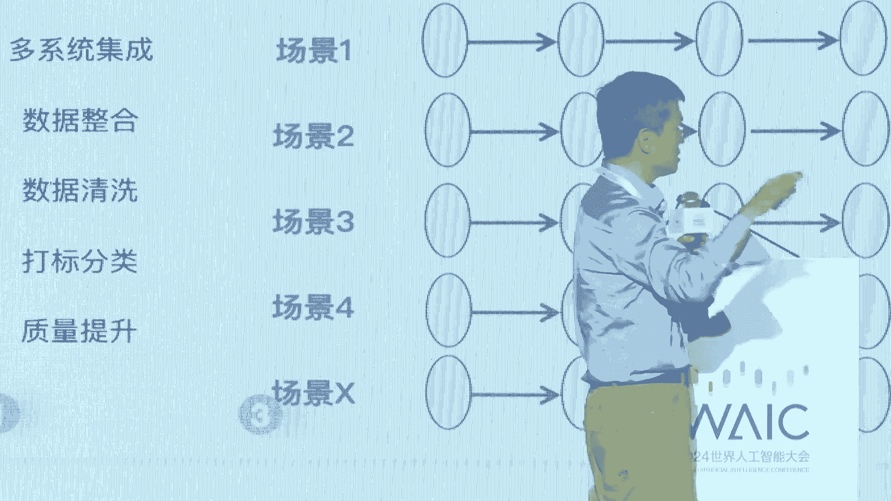

# 41：AI驱动新质生产力落地实践教程 🚀

## 概述
在本节课中，我们将学习人工智能（AI）如何驱动新质生产力的发展，并探讨其在不同行业中的落地实践。课程内容基于“向新而行 智驱未来——AI驱动新质生产力落地实践探讨”论坛的专家分享，涵盖AI技术、应用场景、挑战与机遇等方面。

---

## 一、论坛背景与嘉宾介绍 🎤
本次论坛由东浩兰生集团有限公司主办，旨在探讨人工智能如何赋能千行百业，推动新质生产力发展。论坛汇聚了智能制造、智慧城市、大数据等领域的专家、学者和科技企业代表。

以下是出席论坛的嘉宾：
- 吴志强：中国工程院院士、德国国家科学与工程院院士、瑞典皇家工程科学院院士、世界规划教育组织主席。
- 周宁：新华社新媒体中心党委委员、副总编辑。
- 裘浩明：东浩兰生会展集团副总裁。
- 安晓鹏：阿里云智能集团副总裁。
- 殷宇辉：360集团副总裁、数字化集团CEO、人工智能研究院院长。
- 李飞：新华三集团副总裁、人工智能研究院院长。
- 刘慧福：软通动力信息技术集团股份有限公司执行副总裁兼CTO。
- 崔静怡：建委软件副总裁、中国区总经理。
- 陆鑫：蚂蚁集团财富保险事业群智能服务部总经理。
- 付坤：游族网络首席战略官。

---

## 二、新质生产力的核心概念 🏭
新质生产力以创新为主导，具有高科技、高效能、高质量的特征。人工智能作为其重要引擎，正在改变生产方式、生活方式，并引领全新的经济增长周期。













### 核心公式
新质生产力 = **创新** × **高科技** × **高效能** × **高质量**

---

## 三、AI大模型与数据要素的关系 📊
AI大模型是数据要素实现价值的最短路径。数据通过大模型被激活，从而在智能硬件、软件系统和各行业场景中创造价值。

### 核心代码示例
```python
# 数据要素通过大模型激活价值的简化示例
def activate_data_with_ai(data, model):
    processed_data = model.process(data)
    value = model.extract_value(processed_data)
    return value
```

---

## 四、AI大模型的应用场景 🌐
AI大模型的应用场景广泛，主要体现在以下三个方面：

### 1. 智能硬件驱动
未来一切智能硬件（如手机、汽车、机器人）将被AI大模型驱动。例如，摄像头可以通过AI分析会议参与者的专注度。

### 2. 软件系统重构
一切软件系统（如办公软件、企业管理软件）将被AI大模型重构。例如，通过自然语言交互替代传统菜单操作。

### 3. 数据要素激活
一切数据将被AI大模型激活，实现从数据到价值的直接转化。例如，企业通过大模型分析数据，优化生产流程。

---

## 五、AI在行业中的落地实践 🏢
以下是AI在不同行业中的具体应用案例：

### 1. 制造业
- **案例**：阿里云与广东拓斯达合作，通过大模型调试机器人生产线，将调试时间从3000小时压缩到8分钟。
- **核心价值**：提升生产效率，降低人力成本。

### 2. 金融行业
- **案例**：蚂蚁集团通过大模型提供金融助理服务，帮助用户分析理财和保险问题。
- **核心价值**：提供高质量的金融服务，降低服务门槛。

### 3. 医疗行业
- **案例**：新华三与医疗机构合作，通过大模型辅助脑血管疾病的临床诊断。
- **核心价值**：提升基层医疗水平，缓解专家资源紧张问题。

### 4. 教育行业
- **案例**：通过AI辅助教学，帮助学生快速理解知识点背景和上下文。
- **核心价值**：提升教学效率，增强学习体验。

### 5. 游戏行业
- **案例**：游族网络通过AI生成游戏内容，提升开发效率。
- **核心价值**：降低内容创作成本，增强用户体验。

---

## 六、AI落地的挑战与解决方案 ⚙️
在AI落地过程中，企业面临数据、算力、人才等多方面的挑战。以下是常见的解决方案：

### 1. 数据挑战
- **问题**：数据质量低、标注成本高。
- **解决方案**：通过大模型自动标注数据，提升数据治理效率。

### 2. 算力挑战
- **问题**：算力成本高，资源紧张。
- **解决方案**：采用多元算力架构，优化资源调度。

### 3. 人才挑战
- **问题**：AI人才短缺。
- **解决方案**：通过校企合作培养人才，提升企业内部培训。

---

## 七、开源与闭源模型的比较 🔄
开源和闭源模型各有优劣，企业需根据自身需求选择：

### 开源模型
- **优势**：成本低，灵活性高，适合技术能力强的企业。
- **劣势**：需要自行维护和优化。

### 闭源模型
- **优势**：稳定性高，服务支持完善，适合传统企业。
- **劣势**：成本较高，定制化能力有限。

---

## 八、未来展望 🌟
AI技术将继续推动新质生产力的发展，未来可能在以下方向取得突破：
1. **具身智能**：机器人通过AI实现更复杂的物理交互。
2. **多模态融合**：文本、图像、视频等多模态数据的深度融合。
3. **行业深度应用**：AI在更多垂直行业中实现规模化落地。

---

## 总结
本节课中，我们一起学习了AI如何驱动新质生产力的发展，探讨了其在各行业中的落地实践，并分析了面临的挑战与解决方案。AI大模型作为数据要素价值实现的最短路径，正在重塑生产方式和生活方式，为社会发展注入新的动力。

---

**注意**：本教程内容基于论坛嘉宾分享整理，仅供参考学习。实际应用中需结合具体场景和需求进行调整。