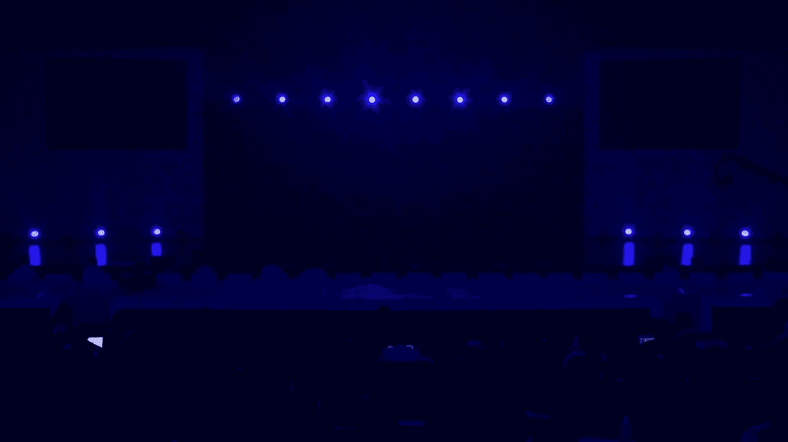
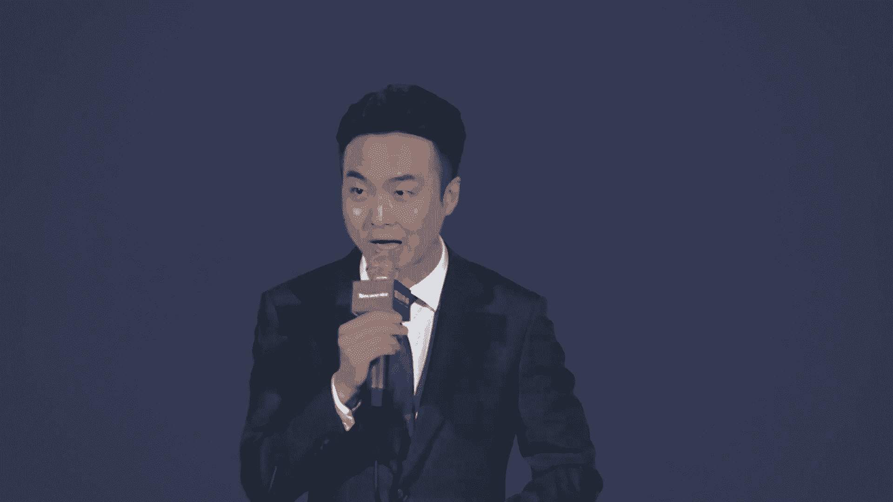
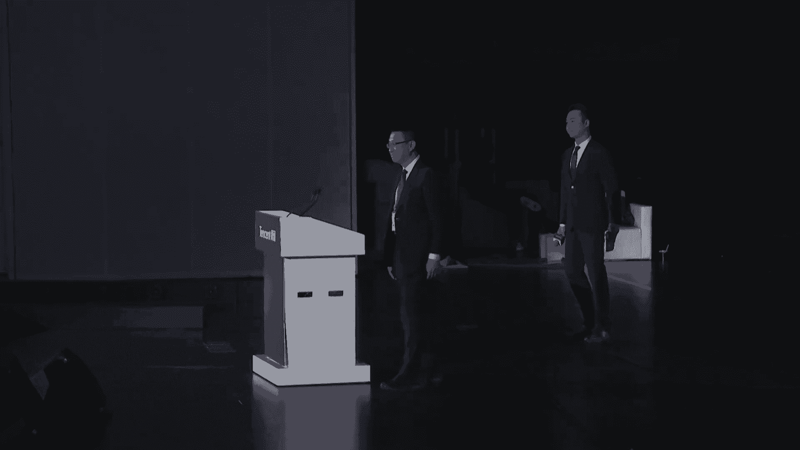
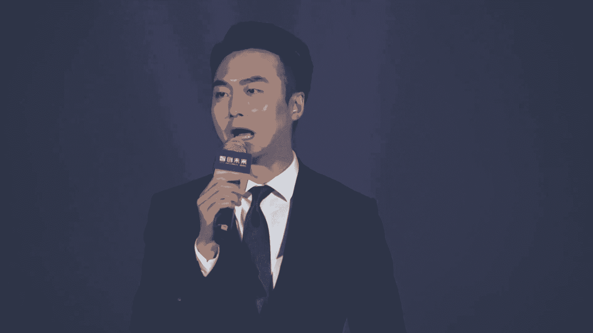
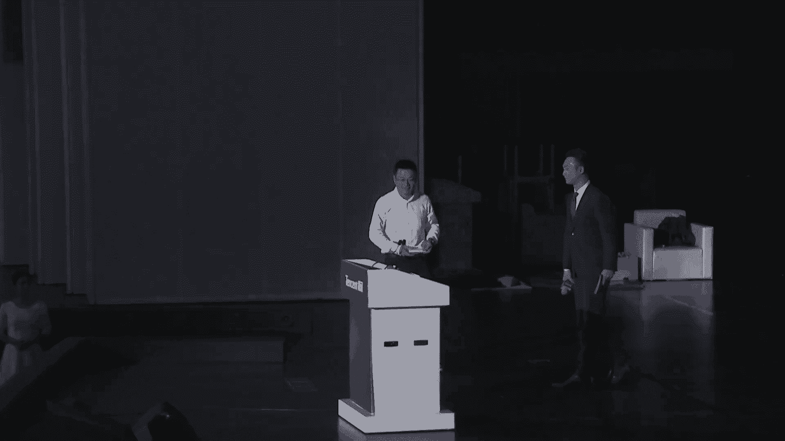
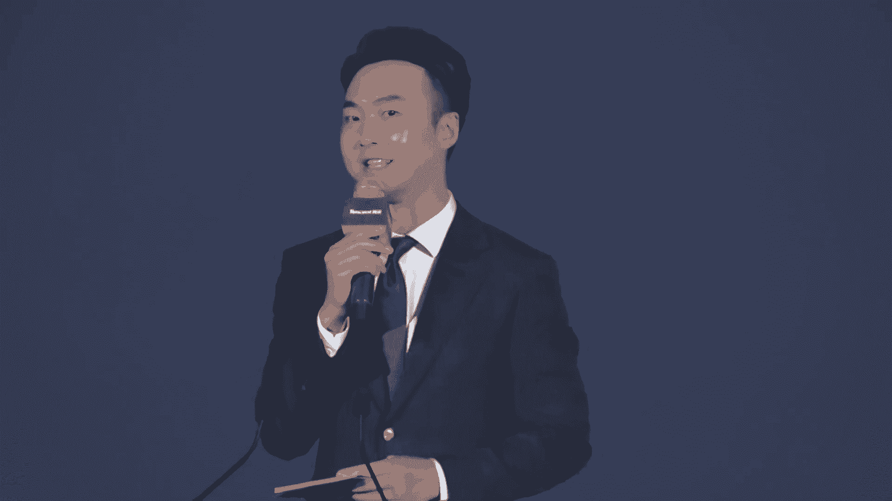
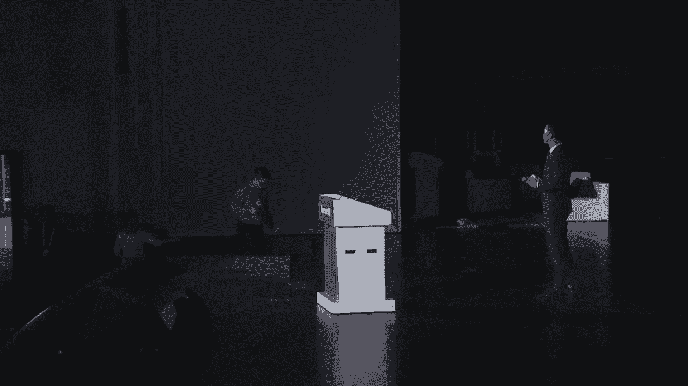
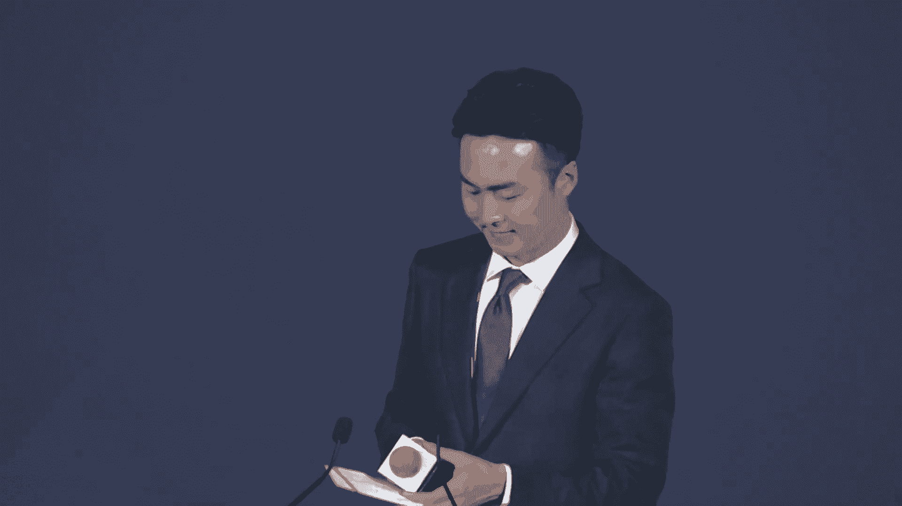

# 42：人工智能前沿技术与产业应用 🚀

## 课程概述
在本节课中，我们将学习2024年世界人工智能大会上，来自学界、产业界专家关于大模型技术发展、产业落地、文化遗产保护等前沿议题的深度探讨。课程将涵盖技术趋势、应用案例、产业挑战与未来展望，旨在为初学者提供一个全面、直观的人工智能发展图景。

---

## 一、 开场与致辞

尊敬的各位领导、各位来宾，现场以及正在通过网络收看直播的朋友们，下午好。欢迎来到2024世界人工智能大会腾讯智创未来论坛。

当今世界最炙手可热的话题之一是人工智能。在技术飞速发展、算法和数据资源日益丰富的当下，AI在各行各业的应用场景不断拓展。从制造业到文化产业，从科技创新前沿到文化遗产保护，AI正在掀起新一轮的技术变革。

首先，介绍出席今天论坛的各位领导和嘉宾。

在全球技术变革的浪潮中，上海以其特有的创新资源和人才优势，正在建设高水准、高规格的人工智能上海高地，不断推动人工智能技术在各行业的应用和发展。

**上海市经济和信息化委员会副主任张洪涛先生致辞要点：**
*   人工智能发展日新月异，热度长盛不衰。
*   上海人工智能产业起步早、基础好，企业数量众多，技术创新活跃。
*   下一步将营造人工智能产业发展的最优生态，夯实基础底座，开展“人工智能+”行动，推动与各领域深度融合。
*   探索人工智能的治理规范，完善标准、伦理和安全体系。
*   期待腾讯等龙头企业发挥更大作用，打造标杆性应用项目。

**腾讯集团副总裁蒋杰先生致辞要点：**
*   大模型已成为行业焦点，中国已推出超过300个大模型。
*   实现大模型全链路自主研发意义重大。腾讯始终坚持自主创新，结合场景推动AI研究和落地。
*   **腾讯混元大模型**已采用MoE架构，参数量达万亿，预训练语料超过7万亿token，位居国内第一梯队。
*   未来趋势观察：
    1.  **模型基础设施化**：通用模型像水电煤一样成为基础设施，会出现不同尺寸的模型协同。
    2.  **从多模态到全模态**：多模态是通往通用人工智能的必经之路。
    3.  **应用场景是关键**：大模型落地的主战场在应用场景。腾讯内部已有近700个业务和场景接入混元大模型。

---

## 二、 技术演进与产业落地

上一节我们了解了人工智能发展的宏观背景与战略方向，本节中我们来看看大模型技术如何具体演进并服务于千行百业。

**腾讯云副总裁吴运生演讲要点：走向大模型普惠时代**

吴运生从技术发展、模型迭代、工具优化和场景落地四个方面分享了思考与实践。

**1. 技术发展趋势**
*   **多模态能力扩展**：结合视觉和语言理解，实现更精准的语义分析和更全面的交互体验，尤其在汽车助手、企业知识服务等领域。
*   **学习范式进化**：通过零样本或小样本学习，简化研发流程，加速AI落地。例如，一张照片即可生成数字人；通过缺陷提示实现工业质检。
*   **内容呈现沉浸化**：3D生成和视频生成技术为用户带来更生动真实的沉浸式体验。例如，3D头像生成、与《人民日报》联合打造的“真爱地球”原创视频。

**2. 模型能力升级**
腾讯混元大模型已完成从稠密模型到MoE模型的升级，参数达万亿级别，综合能力稳居国内第一梯队。生图、生视频、生3D等能力处于业界领先地位。

**3. 工具产品进展**
腾讯云推出了三大模型PaaS产品，并进行了能力升级：
*   **知识引擎**：基于LLM和RAG框架，升级多模态检索（图文互搜、以图搜图）、对话式数据问答，支持复杂表格分析与数据库对接。
*   **图像创作引擎**：基于混元底座，提供领先的AI图像生成/编辑能力，新增33种风格、头像生成、商品背景生成、模特换装等功能。
*   **视频创作引擎**：新增20多种热门舞蹈动作（支持多人舞蹈）、视频风格化（面部细节增强）、视频配音（提升音质自然度）。

**4. 产业落地实践**
*   **企业内部提效**：知识引擎应用于腾讯客服大模型，配置成本降低50%以上；腾讯乐享平台结合大模型实现智能写作、智能问答，提升知识管理效率。
*   **医疗行业**：与瑞金医院上海市数字医学创新中心合作研发医学大模型，实现体检报告自动生成（为医生节约超50%时间）。
*   **文娱行业**：与阅文集团合作，应用大模型辅助写作（描写、灵感、大纲提取）和插图制作。
*   **科学文化探索**：
    *   **“探星计划”**：与国家天文台合作，通过AI技术助力发现3例快速射电暴和41颗脉冲星。
    *   **甲骨文研究**：综合应用文字检测、摹本生成、字形匹配等AI算法。**宣布全球最大的甲骨文多模态数据集开源**，包含1万片甲骨的拓片、摹本及对应数据，助推甲骨文研究数字化、智能化。

---

## 三、 人工智能赋能文化遗产与IP创新

上一节我们看到了AI在工业和科技领域的强大赋能，本节我们将聚焦AI如何与人文领域结合，守护历史并激发新的创造力。

**腾讯SSV数字文化实验室负责人舒展演讲要点：人工智能+文化遗产数字化**

用最前沿的技术探寻最古老的文明，是一种独特的浪漫。AI在文化遗产保护中主要解决以下问题：
1.  **古文字破译难**：如甲骨文4500字中仅试读约1500字。
2.  **文物修复任务重**：中国有1500-2000万件待修复文物，传统修复耗时极长。
3.  **博物馆体验待提升**：参观需求旺盛，但优质讲解资源有限。
4.  **文物资源开放共享**：如何让库房文物通过数字化服务更多人。

**实践与探索：**
*   **甲骨文研究**：推出“殷契文渊2.0”AI协同研究平台，实现甲骨文全信息数字采集、字形匹配、缀合，并发布数据集。**启动“甲骨文AI破译定向课题”**，征集利用该平台和数据集进行破译的方案，优秀方案奖励20万元。
*   **文物修复**：与三星堆博物馆合作，探索AI辅助文物修复，已完成“青铜骑兽顶尊人像”的虚拟拼接与实物复原，正在研究2号神树，并开发裂纹检测、碎片补全等算法工具。
*   **博物馆体验**：与国家博物馆联合打造AI数智人“艾雯雯”，具备文物知识学习与讲解能力，未来将在线下场馆提供伴随式讲解服务。
*   **文创与传播**：发起“繁星计划”助力中小博物馆，利用AI设计文创产品、生成数智人形象，通过直播等方式扩大文化影响力。

**阅文集团副总裁黄岩演讲要点：AI+IP，打开网文IP商业价值新空间**

阅文发布了网文领域专有大模型“阅文妙笔”，懂场景、懂作家、懂角色、懂网文梗。

**三大落地实践：**
1.  **赋能创作者**：AI功能集成于“作家助手妙笔版”，使用率超30%，提供大纲提炼、角色一致性检验、文字插图生成等功能。
2.  **规模化出海**：AI翻译极大降低了成本与周期，使中国网文“一键出海”成为可能。但面临独特挑战：
    *   **网文写作习惯独特**：需预处理解决错别字、主语缺失、网络用语、过度分段等问题。
    *   **专业术语翻译**：需翻译得“信达雅”（如“清心诀”译为 `Heart Soothing Technique`）。
    *   **新世界观涌现**：需建立机制，让读者参与翻译评分，联动专家快速识别和处理新术语。
3.  **沉浸式互动**：打造“筑梦岛”产品，用户可与故事角色（如《庆余年》范闲）对话互动，延伸IP体验。

目前，阅文海外翻译质量显著提升，成本下降九成，超30%海外内容来自大模型翻译，并开始拓展西班牙语、葡萄牙语等小语种市场。

---

## 四、 垂直领域的深度应用：医疗与数据基础设施

技术最终要服务于人，特别是在医疗这样的民生关键领域。同时，大模型的广泛应用离不开底层数据基础设施的支撑。

**瑞金医院黄飞跃演讲要点：医学AI大模型实战**

医学AI面临数据稀缺、精准度要求高、功能不全、数据安全严格等挑战。大模型预训练范式提供了新解决方案。

**瑞金医院的实践：**
*   **基座大模型**：基于瑞金20多年积累的超过8000万条高质量电子病历记录（预训练总量240B Token）进行预训练加强，并构建医学智能体群组协同工作。
*   **应用大模型**：从症状识别和医学建议切入，可识别数十万异常症状，推荐科室，在头部科室技术指标达95%以上。
*   **多模态影像大模型**：通过解剖树、异常树组合推理实现影像信息结构化，利用多模态思维链提升模型泛化性与可解释性。
*   **应用系统**：
    *   **体检报告生成系统**：自动分析报告、识别风险、生成建议，已在瑞金体检中心全量上线，提升医生效率。
    *   **电子病历生成系统**：自动整合数十种住院文书，生成出院小结、随访建议等，实现医疗文档智能化。
*   **发布“瑞金AI医生”**：具备“见多识广”（学习海量案例）和“望闻问切”（多模态交互）能力，支持疾病诊断、用药建议、视觉体征检测（无接触测心率、血氧等），旨在成为用户24小时健康助手。

**腾讯云罗云演讲要点：向量数据库——大模型的最佳CP**

大模型可视为“智能CPU”，其发展使得数据在企业竞争中的重要性空前提升。企业80%的数据是非结构化的，向量化是管理和利用这些数据的关键。

**腾讯云向量数据库的设计理念：**
1.  **企业级能力**：继承传统数据库的分布式、高性能、高可靠性。
2.  **智能计算**：将AI能力（如语义重排序 `Rerank`）沉淀到数据库中。

**腾讯云向量数据库的实践：**
*   **架构演进**：从1.0版本基于Raft协议的分布式集群，演进到2.0版本计算存储分离架构，便于独立扩展索引与查询节点。
*   **易用性提升**：
    *   内置向量化模型，并可基于客户数据微调。
    *   推出向量数据工场，打通从数据源到向量入库的全流程，减少客户开发工作量。
    *   提供一站式解决方案，可快速构建召回率超80%的文本检索系统。
*   **应用规模**：服务腾讯内部40+业务（如腾讯会议、腾讯文档），日均请求量近4000亿次；外部服务销售易、搜狐、好未来等数千家客户。

---

## 五、 未来趋势展望与圆桌讨论

在了解了众多具体应用后，我们需要站在更高视角审视未来。腾讯联合上海交通大学发布了《2024大模型十大趋势观察》。

**腾讯研究院徐思彦解读要点：走进机器外脑时代**

新一代AI在推理分析、创意生成、情绪智能三方面实现飞跃，正成为人类的“智力外挂”。十大趋势包括：
1.  **算力底座**：训练集群步入万卡规模，算力是AGI可行路径及重要生产要素。
2.  **推理分析**：大模型具备复杂推理能力，催生“智力即服务”新模式，可按任务调用云端智力。
3.  **创意生成**：文生视频、音乐生成等技术降低艺术创作门槛，AI已能生成长篇电影。
4.  **情绪感知**：多模态交互让AI更具情感，打开人机陪伴市场，让端侧设备更“可爱”。
5.  **工业制造**：大模型与小模型互补，通过少量数据适配即可优化生产流程。
6.  **AI智能体与游戏**：游戏环境是训练AI智能体的绝佳沙盒，可提升其复杂决策能力。
7.  **移动革命**：端侧智能（如Apple Intelligence）拉开序幕，改变人机交互方式，迈向“千脑智能”。
8.  **具身智能**：大模型为机器人注入“大脑”，提升学习速度与操作精度，成为AI的物理载体。
9.  **开源共创**：开源大模型从“可用”向“好用”演进，开源社区促进技术与知识迭代。
10. **人机对齐**：确保AI与人类意图一致，成为AI模型与产品的核心竞争力。

这十大趋势共同指向一个由机器外脑驱动的未来，带来智力资源的平权化，让低成本创新创业成为可能。

**圆桌讨论精华：大模型离大规模产业应用还有多远？**

与会专家（胡事民院士、马利庄教授、苏炜杰教授、吴永坚）就产学研如何迎接AI时代展开讨论：

*   **胡事民院士**：
    *   **呼吁原始创新**：不应只拼算力，应探索将知识工程、知识图谱与大模型结合的新思路，以提升模型严谨性、克服幻觉。
    *   **重视推理优化**：推理侧与设备结合，是大学和研究机构可以发挥作用的重点。
    *   **给政府的建议**：通过减税等宏观政策引导，而非直接下场投资。**给高校的建议**：承担社会责任，鼓励师生使用国产软硬件进行AI研发。
*   **马利庄教授**：
    *   **研究方向转变**：从NLP等成熟领域转向大模型应用落地及高效低耗算法研究。
    *   **展望“主动式智能”**：未来AI需像人一样理解上下文与意图，提供主动服务（如递纸巾、盖瓶盖）。
    *   **呼吁合作共赢**：避免“百模大战”下的资源浪费，企业、高校应通力合作，善用资源。
*   **苏炜杰教授**：
    *   **对齐是核心挑战**：GPT-5未发布，主因是对齐难度随模型能力指数级增长，涉及技术、社会、经济等多维度问题。
    *   **人才培养需变革**：AI是交叉学科，需要培养像冯·诺依曼那样的复合型人才，打破学科壁垒。
    *   **海外观察**：硅谷产学研生态在闭源趋势下有所削弱，中国可抓住机会。
*   **吴永坚**：
    *   **产业落地难点**：安全合规、训练推理成本、严肃场景（如客服）对准确率要求极高。
    *   **应用路径**：To C（情感互动、容错率高）先行，To B（严肃场景）更谨慎。商业化爆发仍需时间。
    *   **企业护城河**：生态分层明显（基础架构、预训练、垂直微调、应用调用），不同层次需要不同人才。腾讯需要兼具技术深度与产品洞察的复合型人才。
*   **给年轻人的建议**：
    *   **胡事民**：计算机学生不能只编程，要提升系统架构能力；非计算机学生要懂一点AI编程。
    *   **马利庄**：成为复合型人才，面向国家重大需求，保持对产业方向的预见性。
    *   **苏炜杰**：拥抱AI领域，保护好奇心和兴趣，驱动颠覆性创新。

---

## 课程总结
本节课中，我们一起学习了人工智能领域的最新动态与深度思考：
1.  **技术核心**：大模型正向多模态/全模态、MoE架构、不同尺寸协同的方向发展，开源与对齐是关键议题。
2.  **产业融合**：AI已深入医疗、工业、文娱、文化遗产保护等千行百业，核心价值在于提质增效与创造新体验。
3.  **基础设施**：向量数据库等底层技术是管理和挖掘非结构化数据、支撑大模型应用的关键。
4.  **未来已来**：“机器外脑”时代正在开启，将在算力、推理、创意、情感、具身智能等方面深刻改变社会。
5.  **产学研协同**：需要原始创新、复合型人才培养、以及良性的生态合作，共同应对算力、成本、安全等挑战，让AI技术更好地造福于人。

这是一个充满变化与机遇的时代，拥抱技术、保持学习、专注价值，是应对未来的不变法则。