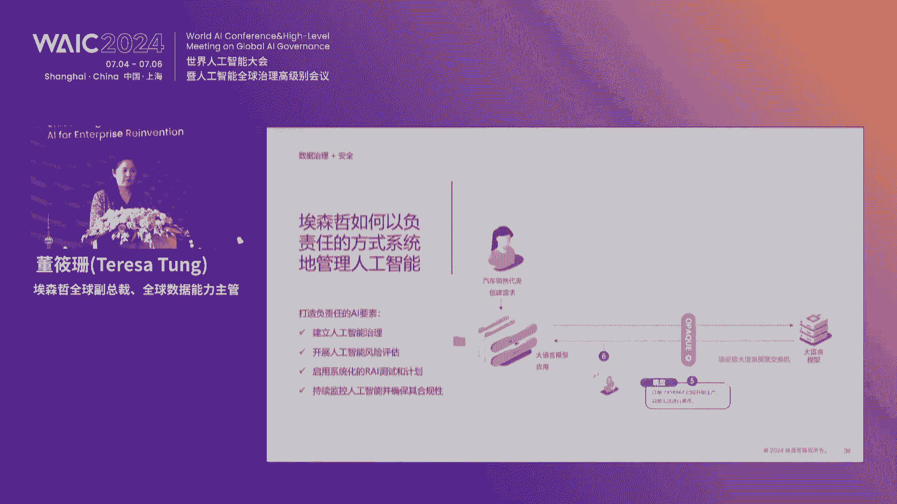

# 43：重塑生产力：AI开创增长前沿论坛精华解读 🚀

在本课程中，我们将系统性地学习“重塑生产力：AI开创增长前沿”论坛的核心内容。课程将涵盖人工智能的全球治理、企业应用实践、数据战略、人才培养及工业智能化等关键议题，旨在为初学者提供清晰、全面的AI赋能商业的认知框架。

---

## 论坛开幕与背景介绍 🎤

本次论坛在世界人工智能大会组委会办公室指导下，由埃森哲中国有限公司主办，第一财经支持，线上线下同步举行。人工智能作为推动未来发展的战略性通用技术，已被认定为形成新质生产力的重要引擎。

埃森哲特别筹办本场专题论坛，旨在开启一场AI赋能千行百业的智航之旅，共同探索AI重塑商业模式的无限可能。

---

## 主旨演讲：人工智能的治理与国际合作 🌍

上一节我们介绍了论坛的背景，本节中我们来看看人工智能发展中的治理挑战与国际合作必要性。

世界经济论坛大中华区主席陈黎明先生回顾了人工智能波浪式的发展历程。他指出，科技发展常是双刃剑，历史经验（如蒸汽机、农药、核能）表明，技术应用可能带来长期未预见的后果。

人工智能的崛起同样需要警惕。其潜在风险包括但不限于：
*   **隐私与真实性危机**：Deepfake等技术挑战“眼见为实”，可能助长新闻造假、网络诈骗。
*   **能源消耗**：AI模型运行需消耗巨大电能。
*   **职业再平衡**：AI会替代部分岗位，同时创造新岗位，但对个体而言可能是职业生涯的重大挑战。
*   **未知风险（Unknown Unknowns）**：我们可能因认知局限，在“科技向善”的初衷下无意造成损害。

因此，在人工智能的开发与应用中：
*   **政府**需在立法方面有所作为。
*   **企业**需在科技伦理方面承担责任。
*   **开发者**必须具备底线思维。

发展创新与可持续发展需取得微妙平衡。我们不应因噎废食，但必须认识到并管理其中风险。


---

## 核心洞察：生成式AI重塑企业生产力 🔄

在了解了宏观治理框架后，我们聚焦到企业层面：生成式AI如何具体重塑生产力？

埃森哲全球副总裁、大中华区技术服务事业部总裁俞毅博士指出，当前企业拥抱AI的态势正在加速。与往年相比，企业更关注“做什么”和“怎么做”，而不仅是“为什么做”；落地项目更具深度和端到端整合性；在某些领域（如企业出海）已成为刚需。

**公式**: 企业AI应用价值 ≈ 技术可行性 × 业务刚需强度

然而，将技术转化为可持续增长动力，企业需系统化构建五大关键能力：
1.  **价值为先**：从单点场景优化转向梳理整体价值链的价值基线与回报。
2.  **打造数字核心**：评估并升级企业的数据、技术架构基础，以支持结构化与非结构化数据的处理。
3.  **重塑人才与组织**：AI不是简单替代岗位，而是改变工作方式。需重新设计组织、绩效考核与培训机制。**投资比例参考**：在人员赋能上的投入可能需达到技术投入的2倍。
4.  **践行负责任AI**：建立跨法务、技术、业务的治理架构或委员会，系统化管理合规、隐私与伦理风险。
5.  **保持动态演进**：技术环境快速变化，需保持学习与迭代能力。



生成式AI是一个过程，而非终点。其与空间计算等技术的结合，将解锁更复杂的应用场景。

---

## 基石要素：数据——AI竞争的新前沿 💎

技术落地离不开燃料，数据就是AI时代的核心燃料。本节我们探讨数据战略的六大新规则。

埃森哲全球副总裁、全球数据能力主管董小山博士强调，**准备好数据是企业安全应用生成式AI并赢得竞争的关键**。

1.  **专有数据是竞争优势**：大模型通用知识对具体业务场景的准确性可能不足30%。融入企业专有数据后，效率可提升至85%以上。数据应被视为产品，进行相应投资与管理。
2.  **解锁非结构化数据潜力**：企业70%的数据是非结构化的（文档、音视频）。生成式AI擅长从中提取信息，但需为此类数据建立与结构化数据同等的治理流程。
3.  **利用合成数据填补空白**：在数据缺失或获取成本高时，可结合数字孪生、专家知识与生成式AI创建合成数据，用于模型训练与模拟，从而创造价值（例如提升仓库运营效率）。
4.  **AI使数据更易跨域使用**：生成式AI降低了数据映射和情境化的难度，使得同一份数据（如IT系统代码）能被轻松用于不同业务目的（如客户服务与销售支持）。
5.  **AI也加速了数据风险**：使用的便利性意味着更多人可能无意中泄露敏感数据。企业需为全员提供培训、指南和工具（如模型网关/交换板），在数据发送至外部模型前脱敏，以保护机密信息。
6.  **AI能加速数据就绪过程**：生成式AI本身可用于加速数据准备任务，如编写数据迁移脚本、生成测试用例、创建数据产品文档等，从而反哺数据战略。

**核心代码逻辑（模型网关示例）**:
```python
# 伪代码：模型网关的数据脱敏与回填
def secure_query_with_gateway(user_query, sensitive_data_dict):
    # 1. 脱敏：将敏感信息替换为泛化标识符
    generic_query, token_map = sanitize_query(user_query, sensitive_data_dict)
    
    # 2. 将脱敏后的查询发送给外部大模型
    generic_response = call_external_llm(generic_query)
    
    # 3. 回填：将泛化标识符恢复为原始敏感信息
    secure_response = repopulate_response(generic_response, token_map)
    
    return secure_response
```

---

## 圆桌对话（一）：解锁数据潜力的实践 🛠️

基于前面的数据战略，我们通过对话看看中美市场的异同与数据价值挖掘。

俞毅博士与董小山博士的讨论揭示了：
*   **中美市场差异**：美国企业早期多使用Azure OpenAI等成熟模型，对模型比较关注较少；中国企业因模型选择多，更早开始关注模型对比、成本验证和小型化语言模型（更适合垂直场景、成本更低）。
*   **数据价值悖论与破解**：大模型需要数据，但企业数据又是其差异化所在。破解之道包括：
    *   通过技术手段（如网关）在共享前剥离敏感数据。
    *   利用生成式AI进行知识蒸馏，创建用于行业模型微调的合成数据或知识范例，而非共享原始专有数据。
    *   将数据视为可内部衡量（效率、创新）或外部货币化（直接销售、赋能新商业模式）的产品。
*   **人才与治理**：释放数据价值需要**领域教练**这样的新角色，他们负责指导AI在业务中的准确应用、内容调性和质量。数据治理必须是业务部门的职责，需将**数据确权、问责制**和**单一事实来源**等原则程序化地融入日常流程。

**给初学者的建议**：立即开始。选择已验证的用例，获取初步生产力收益，并用这些收益为更战略性的数据项目提供资金。

---

## 圆桌对话（二）：变革的力量——重塑运营与人才 📈

数据和技术最终服务于业务运营和人才。本节探讨AI如何重塑运营模式与未来人才需求。

联想集团高级副总裁高岚分享了联想的“AI for All”（人工智能普惠）战略，其核心是 **“人本智能”**：
*   **人本底线**：AI须促进社会发展，杜绝负面影响。
*   **人本技术**：产品与服务须为人带来便利、安全与效益。
*   **人本理念**：致力于可持续发展与社会福祉。

在AI时代，企业运营需紧密联动**数据、技术、人才**三大引擎。这意味着：
*   **业务模式**：需审视AI带来的影响，转向混合AI模型（大小模型结合）。
*   **管理模式**：高管需提升在不确定性中的决策与迭代能力。
*   **人才规划**：从人力资源规划转向 **“AI+人”的规划**，思考人机协作的最佳方式。

对于员工而言，应对AI时代的关键在于：
*   **培养批判性思维与创造力**（区别于机器的核心能力）。
*   **践行终身学习**。
*   **以积极开放的心态拥抱变化**。


在生态合作上，企业应遵循 **“共建、互利、共生”** 原则，明确自身优势，与合作伙伴在规则（如负责任AI）基础上共同成长。

---

## 圆桌对话（三）：解锁增长新动力——服务业中的AI实践 ✈️

让我们将视角转向服务业，看AI如何提升客户体验与企业收益。

国泰航空数码部总经理邹明诺先生分享了AI在航空业的实践：
*   **应用场景**：
    1.  **机器学习**：如基于乘务员收集的数据预测餐食需求，优化菜单设计与备餐量。
    2.  **生成式AI客服**：用于处理行李查询等常见问题，提升准确率与效率。
    3.  **机器人流程自动化**：将重复性高、复杂的工作自动化，充当“数字化员工”。
*   **提升体验**：利用“客户360度”数据模型提供个性化推荐与服务；大力推广自助服务，简化旅客流程。
*   **大湾区布局**：视大湾区为“延伸的本土市场”，通过海空联运、人才计划（如IT培训生项目）、创新活动（编程马拉松）等方式进行深度布局与技术融合。

AI正在改变与客户的沟通方式，并大幅提升内部开发效率。成功的行业应用依赖于**数据基础、清晰的业务场景、生态合作**以及推动组织变革的领导力。

---

## 圆桌对话（四）：工业企业的智慧脉动 🏭

最后，我们深入实体经济核心，探讨AI在工业企业的突破与实践。

汇川技术副总裁李瑞林先生指出，工业AI面临独特挑战：
*   **数据复杂**：类型多、标准不一、涉及漫长价值链。
*   **多物理学科耦合**：纯数据驱动AI需与光机电液气磁等物理控制过程结合。
*   **知识产权保护**：如何在使用AI时保护客户的生产诀窍。

汇川的应对措施包括：由一把手挂帅的**数据治理变革**、专门的**工业AI研究所**以及跨业务单元的**AI技术管理委员会**。

目前，在工业领域已产生商业价值的六大AI方向包括：
1.  预测性维护与故障诊断
2.  质量控制（机器视觉）
3.  能源管理
4.  研发数字孪生与虚拟仿真
5.  产品设计与创新
6.  客户服务与知识管理

AI将深刻改变工业企业的未来：
*   **商业模式**：通过预测性维护盘活存量资产；推动真正的大规模柔性定制化生产。
*   **生产运营模式**：实现研产销一体化的数字化；深化智能制造自动化；实现能源高效化；组织架构将更加矩阵化，AI辅助决策变得至关重要。

生态合作对于工业AI至关重要，需要**专业咨询公司**（厘清商业模型）、**技术伙伴**（互补能力）以及**行业数据协调组织**（解决数据量与质的问题）共同参与。

---

## 总结与展望 🌟

在本课程中，我们一起学习了人工智能重塑生产力的多维图景：

1.  **治理先行**：AI的健康发展需要全球合作、政府立法、企业伦理与开发者底线思维的共同保障。
2.  **价值驱动**：企业应用AI需从战略出发，系统化构建价值、数据、人才、治理与动态演进五大能力。
3.  **数据为基**：专有数据是核心竞争力，必须通过有效治理、利用非结构与合成数据、管理风险，并借助AI加速数据就绪。
4.  **运营与人才重塑**：AI改变业务模式，企业需规划“AI+人”的协作，员工需强化批判性思维、学习力与应变力。
5.  **行业深化**：无论是服务业还是工业，AI的落地都始于具体场景，成于数据、技术与生态的融合，最终指向更高效、智能、绿色的未来。

生成式AI与人工智能的浪潮已至，它不仅是技术工具，更是重塑商业模式、提升核心竞争力的关键驱动力。对于所有组织和个人而言，主动学习、积极拥抱、负责任地利用这一变革力量，是通往未来的必由之路。