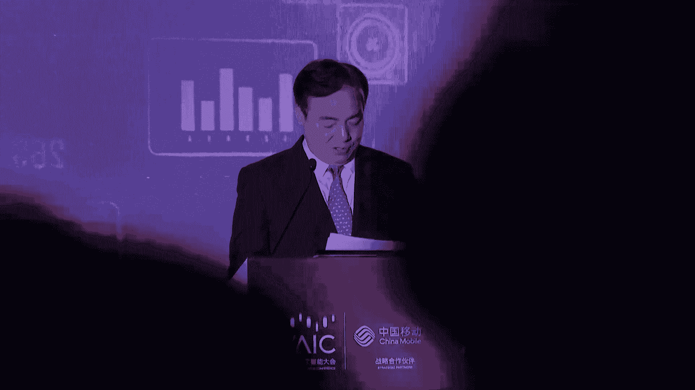
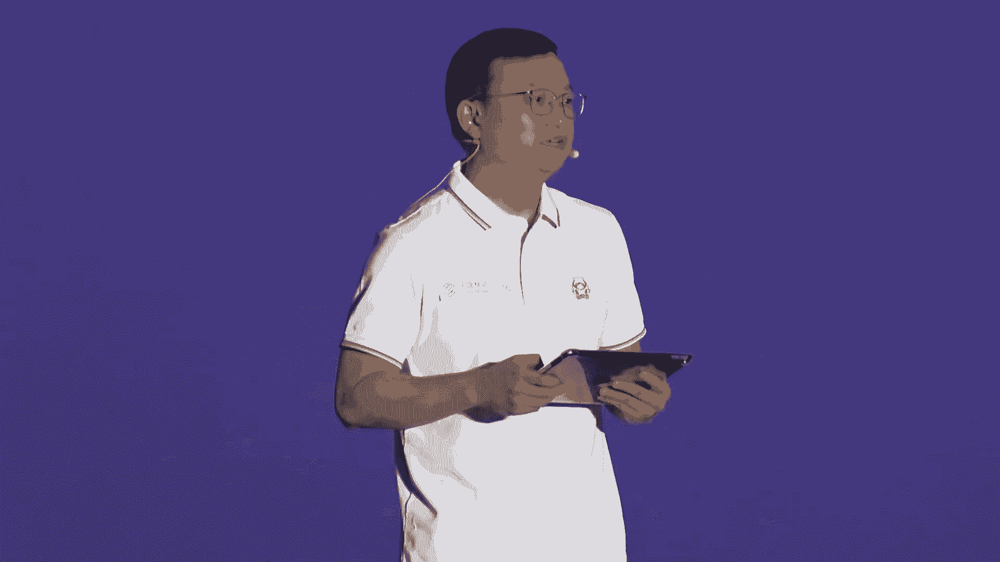

# 44：中国移动“AI赋能 创见未来”生态论坛解读教程 🚀

在本节课中，我们将学习中国移动“AI赋能 创见未来”生态论坛的核心内容。我们将了解人工智能如何赋能千行百业，以及中国移动在AI领域的战略布局、技术成果与生态计划。课程内容将涵盖AI在农业、工业、城市管理、政务等领域的应用案例，并深入解析中国移动的“九天”人工智能基座与“5个100”生态计划。

---

## 一、AI赋能产业：应用案例解析 🌾

人工智能正成为推动社会各领域现代化的重要力量。通过精准高效的专用AI解决方案，能够帮助实现智能决策与精准作业。

上一节我们概述了AI的广泛影响力，本节中我们来看看几个具体的行业应用案例。

以下是AI在不同行业中的赋能场景：

*   **农业现代化**：通过农业专用AI解决方案，打造“田间智脑”，推出农技问答AI助手，帮助农事智能决策与精准作业。
*   **工业质检**：在纺织车间等场景中，针对花型繁复、检测难度高的问题，依托**瑕疵AI视觉检测系统**，实现精准、实时、高效的智能质检。
*   **智慧交通**：在智能网联示范区，综合运用AI模型与**5G-A**网联通信技术，打造创新性的车路协同应用示范路线，赋能智慧城市与自动驾驶。
*   **能源行业**：面对光伏面板检测难题，依托**OnePower工业质检平台**，构建“5G+AI光伏质检”应用，打造智慧组件产线，提升检测效率。
*   **智慧政务**：政务服务进入数字化时代，依托**九天海算政务大模型**，实现“一网通办、一网统管、一网协同”，构建高效政务生态。

---

## 二、中国移动的AI战略与“九天”基座 🏗️

从文明发展到信息时代，我们见证了生产力的重塑。如今，以大模型为代表的人工智能技术正在引领世界进入通用智能时代。

上一节我们看到了AI的具体应用，本节中我们来深入了解提供这些能力的技术基座与战略规划。

中国移动始终将人工智能作为公司核心战略，致力于打造世界一流的信息服务科技创新公司。

以下是其战略与实践的核心要点：

*   **战略定位**：勇担人工智能“国家队”使命，建设一流的“九天”人工智能团队，承担国家重大科创任务。
*   **技术内核**：以体系化人工智能构建原创技术内核，加快在基础理论、底层技术、机制框架上的突破。
*   **核心基座——九天大模型**：打造新型智能化能力基座。
    *   **目标**：致力于成为国内最值得信赖、最懂行业的全栈自主可控大模型。
    *   **特点**：具备“做事”能力，首创行业定向增强技术，深度匹配国产算力，安全可信度领先。
    *   **体系**：包含通用大模型（如千亿、两千亿参数多模态模型）和超过40款行业大模型（如交通、民航客服大模型）。
*   **网络智能化**：以先进的网络智能化技术推进通信网络领先发展，让网络运维效率倍增、运行绿色节能、优化虚实结合。
*   **赋能用户与服务**：以智能化能力为10亿用户创造智慧生活，如智能5G新通话、家庭数字内容服务；以大模型重新定义客户服务模式，让服务更贴心。

---

## 三、“5个100”人工智能生态计划与未来展望 🤝

通用人工智能是时代赋予的新机遇。中国移动立志做好通用智能时代的**供给者、汇聚者、运营者**。

上一节我们了解了技术基座，本节中我们来看看中国移动如何构建开放生态，与产业界共创未来。

为加速AI与产业融合，中国移动全新启动了“5个100”人工智能生态计划。

以下是该计划的具体内容：

*   **开放百大AI+场景**：聚焦通信、家庭等重点领域，开放内容搜索、家庭看护等百大场景，深化产业赋能。
*   **集结百大合作伙伴**：依托联创+实验室、应用商城等载体，共研新技术，共育新产品，加速产业势能。
*   **设立百亿权益扶持**：通过算力支持、资本投资、市场共享、品牌共建等方式，设立百亿权益，升级产业动能。例如，提供**1亿元级的算力支持**，鼓励生态伙伴发展。
*   **开放百大技术要素**：通过九天生态汇聚平台，开放百大模型、百大数据集和百大工具链，强化产业效能。
*   **打造百万智能体**：聚焦车联网、新型工业化等十大赛道，联合生态伙伴创新，让个人和行业都拥有专属智能体，激发产业潜能。

此外，中国移动还致力于推动**AI与5G-A的融合**（称为“AI×5G-A”），在低空经济、数据交通、数据工厂、数智能源、数字轨交、数智商圈六大行业打造示范应用，激发乘数效应。

---

### 课程总结 📚

本节课中，我们一起学习了中国移动人工智能生态论坛的核心内容。
1.  **应用层面**：我们看到了AI在农业、工业、交通、政务等千行百业中的具体赋能案例，解决实际痛点。
2.  **技术层面**：我们深入了解了中国移动以“九天”大模型为核心的AI技术基座战略，其特点是自主可控、擅长做事、深耕行业。
3.  **生态层面**：我们解析了“5个100”生态计划，它通过开放场景、集结伙伴、设立扶持、共享技术、共创智能体，构建了一个繁荣的AI产业共同体。
4.  **未来展望**：AI与5G-A的深度融合，将为经济社会发展注入新质生产力，开启一个万物感知、万物互联、万物智能的新时代。

中国移动正以开放的心态，携手产业界，共同担负起推动人工智能健康发展的责任与使命。