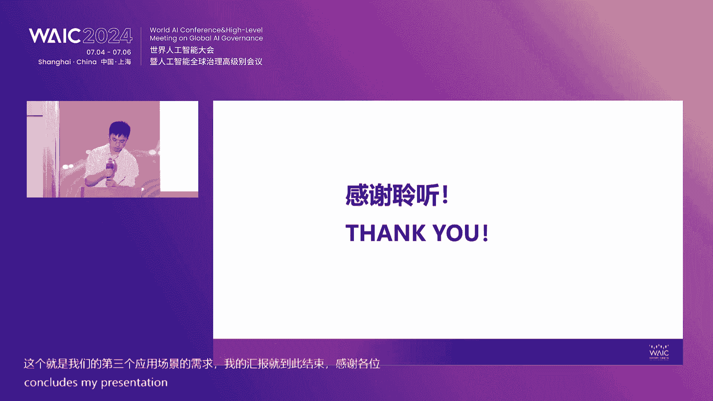

# 45：人工智能赋能产业融通发展论坛精华解读 🚀

在本课程中，我们将学习2024世界人工智能大会“人工智能赋能产业融通发展论坛”的核心内容。课程将涵盖人工智能在新型工业化、电力能源、油气产业及企业应用中的关键实践与前沿思考，并整理成一篇结构清晰的教程。

---

## 概述：人工智能的时代使命

中国科学院外籍院士、图灵奖获得者赫伯特·西蒙曾指出，人工智能是计算机科学家的目标、数学家的梦想、哲学家的希望、心理学家的挑战，也是自然科学家的敬仰。我国政府高度重视人工智能发展，旨在通过科技创新引领产业融合驱动。本次论坛汇聚了政、产、学、研各界专家，共同探讨人工智能赋能产业发展的路径与经验。

---

## 第一节：人工智能赋能新型工业化的核心路径 🏭

上一节我们概述了论坛的背景与意义，本节中我们来看看中国电子信息产业发展研究院院长张立致辞中提出的，人工智能赋能新型工业化的四个核心方向。

张立院长指出，人工智能赋能新型工业化是一项系统工程，需要抓住关键环节。

以下是四个核心落脚点：

1.  **首要在产品**：我国是消费电子和科技产品大国。随着AI技术成熟，**语音识别与合成、物体检测、动作规划、实时推荐**等已成为手机、电脑、汽车等产品的核心功能。新型工业化将催生新产品、新服务、新体验。
2.  **落脚在产业**：工业具有规范化、规模化、互换性要求。AI能高效处理大规模实时数据，**优化生产调度（`optimize production scheduling`）、提升产品良率、辅助经营决策**，在效果、效率、效益上实现三重提升。
3.  **未来在融通**：AI具有提升产业融通发展水平的潜力。在企业层面，AI能成为资产价值溯源工具，实现产业链贡献的精准核算；在个人层面，掌握AI技能的劳动者能拓展自身能力，获得更广泛的工作机会。
4.  **检验在场景**：应用效果要以实际场景为准。研究院建设“人工智能场景应用与智能系统测评实验室”，正是以解决产业实际问题为抓手，提升应用实效。

---

## 第二节：决策智能在电力能源领域的应用 ⚡

上一节我们介绍了AI赋能工业化的宏观框架，本节中我们来看看达摩院决策智能实验室总经理刘乐分享的，AI在电力能源这一具体领域的深度应用。

刘乐总经理介绍，其团队致力于研究决策智能前沿技术，以提升业务运营效率与收益，降低成本。在电力能源领域，他们构建了“绿色能源AI”解决方案。

以下是该方案的三大支柱：

*   **预测**：针对新能源“看天吃饭”的特性，开发**新能源发电功率预测**和**用户侧负荷预测**模型，以应对电网供需平衡的挑战。
*   **调度**：基于安全约束，利用AI进行**电网优化调度（`grid optimization dispatch`）**，确定不同时间、不同发电机组的发电量，保障大电网稳定运行。
*   **交易**：针对各省不同的电力市场规则，利用AI进行市场仿真与优化，辅助发电侧进行**报量报价决策**。

在大模型时代，他们取得了新进展：
*   **全球区域联合气象预报**：训练**全球AI气象大模型**，结合局部地形、卫星数据，实现更高精度、更长预见期的天气预报，为下游电力预测提供更优输入。
*   **可解释性AI（XAI）**：提升AI决策的透明度和可信度，让业务专家能够理解并信任AI的结论。
*   **AI工程师与智能体**：探索结合大模型与决策智能技术，开发能自动建模、规划并使用工具的**类人决策智能体**，处理复杂工业场景任务。

---

## 第三节：数字化赋能传统油气产业转型 🛢️

上一节我们探讨了AI在电力系统的应用，本节中我们转向另一个传统重工业——油气领域，看中国石化胜利油田的数字化转型实践。

胜利油田数字化管理服务中心主任段宏杰提出，老油田需要发展“新质生产力”，其核心是**人、工具、生产资料**三要素的智能化变革。

以下是其转型路径的核心要点：

*   **智能油田1.0向2.0演进**：
    *   **1.0（当前）**：以自动化为核心，实现全业务异常管控。目标是“管异常而非管正常”，让机器处理常规，人聚焦异常。
    *   **2.0（未来）**：以智能化为特征，实现全链条智能决策与一体化协同。推动研究方式、工程工艺、劳动组织、管理模式四大变革。
*   **人工智能大模型实践——“胜小利”**：为解决知识管理难、交互效率低等问题，胜利油田研发了行业大模型虚拟助手“胜小利”。
    *   **基础**：学习了115万条油气勘探开发专业语料。
    *   **能力**：接入511项企业数据、143个功能组件，可实现专业知识问答、生产数据查询、制度流程解答、安全标准检索等。
    *   **愿景**：最终建成“**一个工业智能平台、N个业务模型、一个服务平台**”的人工智能赋能油气勘探开发体系。

---

## 第四节：企业大模型应用的落地生根 🌱

上一节我们看到了AI在具体工业场景的垂直深化，本节中我们来看看百度智能云副总裁喻友平分享的，大模型在企业端通用场景的落地经验。

喻友平认为，2024年是大模型应用元年，企业应用大模型的核心价值在于**增收、提效、降本、合规**。

以下是三个最具价值的通用落地场景：

1.  **超级知识库——知识管理**：大模型能彻底重构企业知识管理平台。
    *   **传统痛点**：知识孤岛、应用效率低（仅为搜索）。
    *   **大模型解决方案**：快速接入多源知识，实现**对话式、推理式知识问答**，相当于为每位员工配备专家助手。例如，帮助泰康保险整合多个系统知识，赋能全国保险代理人。
2.  **超级客服——智能服务**：大模型能显著提升智能客服的拟人度和复杂问题解决能力。
    *   **关键点**：直接使用通用大模型，客服可用性仅约50%。需针对客服场景进行**强约束优化和低容错设计**，才能将可用性提升至90%以上。例如，解决“携带行李额度”这种依赖多因素推理的复杂问题。
3.  **超级主播——数字人**：大模型为数字人注入“灵魂”。
    *   **价值**：数字人形象能极大增强大模型交互的亲切感和表现力。
    *   **进展**：技术已能实现“一句话生成3D数字人”、“分钟级生成2D高清分身”，大幅降低制作成本与周期，让数字人广泛应用于营销、销售、服务等场景。

他总结，企业应用大模型需把握三点：**围绕业务场景、驱动数据与知识、实现人格化交互**。

---

## 第五节：人工智能推动电力智能化运维 🔌

上一节我们关注了大模型在企业内部的应用，本节中我们聚焦到电力行业的具体运维环节，看中电誉创专家孙成分享的AI落地实践。

孙成指出，传统电力运维面临数据处理不足、故障预测定位困难、人力成本攀升三大痛点。智能化运维是必由之路，但也面临规模化部署、人员技能转型、场景多样化等挑战。

中电誉创的解决方案是“**边端结合**”的智能化体系：

*   **智能前端**：针对输煤系统、升压站、配电房等不同场景，研发了巡检、清洗、作业、监护等系列机器人，形成“机器人大家族”。
*   **AI后端平台**：构建三级管理平台。
    *   **一级（全局管控）**：集团级统筹平台。
    *   **二级（区域管理）**：单场站或区域管理平台。
    *   **三级（设备协同）**：基于物联网的机器人管理平台，实现协同调度。
*   **未来展望**：依赖于**底层算力革新**与**AI理论发展**（从深度学习到大模型）。发展方向包括预测性维护广泛应用、自动化水平提高、数字化转型深化，以及建立**行业标准**以促进解决方案泛化。

---

## 第六节：央国企人工智能场景需求发布 🎯

上一节我们了解了科技企业提供的解决方案，本节中我们来看看需求方——央国企的具体诉求。南方电网数字集团技术专家郭杨运发布了其AI需求。

项目名称：**人工智能驱动的电能量数据创新应用技术研究**。

以下是三大核心应用场景与AI需求：

1.  **场景一：AI赋能电能计量运维**
    *   **需求**：利用**多模态大模型、深度学习**，研究基于多模态数据融合与知识学习的智能运维方案，实现从安装检测、状态感知、故障根因分析到现场辅助的全流程智能化，提升运维效率20%-30%。
2.  **场景二：AI赋能负荷精细化管理**
    *   **需求**：应用**机器学习算法**分析用户用电行为，结合**AIoT技术**融合物理世界与数字孪生，实现用户侧灵活资源（如楼宇、储能、电动汽车）的评估、预测、聚合与协同调度，提升负荷预测精度至90%以上，响应效率提升25%。
3.  **场景三：AI赋能“电力看经济”**
    *   **需求**：整合大数据与**生成式人工智能**，研究基于电能量数据的产业态势感知与分析报告自动生成方法。构建**多智能体（Multi-Agent）协同**系统，自动完成数据检索、处理、分析到报告撰写的全流程，为政府与企业提供定制化能源消费与产业趋势分析。

合作模式：采用“政府引导+企业主导+高校科研+用户参与”的多元协同创新模式。

---

## 第七节：中国移动的智能算力与大模型实践 📡

上一节我们聆听了来自电网的需求声音，本节中我们来看看作为基础设施提供者的中国移动，在AI算力与模型方面的战略与实践。

中国移动研究院副院长段晓东介绍，中国移动将自身定位为AI领域的**供给者、汇聚者、运营者**。

以下是其三大核心实践：

1.  **构建领先的智能算力万卡集群**：已在呼和浩特、哈尔滨、贵阳等地建设并交付万卡智算集群，支持千亿参数大模型训练。攻克了**断点续训**等关键技术，保障集群长期高效运行。并正研究超万卡时代的CCCC（新型算力中心）技术。
2.  **研发“九天”系列大模型**：打造全自研、通专结合的千亿级大模型，已通过国家双备案。基于“九天”底座，已衍生出**客服大模型**（应用于10086）、**网络大模型**（优化5G网络运营）等20多个行业模型。
3.  **建立“启衡”大模型评测体系**：针对行业“百模大战”中模型质量参差不齐的问题，建立了自主的评测体系。已完成40余款主流模型评测，发现：国内外模型差距在缩小；国内千亿模型准确率已达较高水平（约80%以上）；**数据质量成为关键因素**；行业存在不少无法提供服务的“虚标”模型。中国移动正联合产、学、研各方，发起大模型评测联盟，旨在建立中国自主的AI评测话语权。

---

## 圆桌论坛：人工智能赋能新型工业化的经验与展望 💡

在最后的圆桌论坛环节，各位专家就AI赋能新型工业化的初步经验、大模型“涌现”机制在工业领域的价值、以及高质量工业数据集建设等议题进行了深入探讨。

**核心观点摘要：**

*   **初步经验与融合场景**：
    *   **中电誉创 樊绍胜**：AI与机器人技术结合，在电力、钢铁等行业的**安全运维**中提升效率与安全水平。关键技术包括感知技术、机器人控制技术及行业大模型。
    *   **创新奇智 张发恩**：AI本质是从数据中寻找知识的范式。工业视觉质检、动态调度等已是成熟应用。大模型让**自动化走向智能化**，使生产更柔性、空间利用更高效。
    *   **达摩院 刘乐**：**精准天气预报**是新型工业化（尤其是能源领域）的刚需；AI的**可解释性（XAI）** 是落地关键；探索结合大模型与决策智能技术，开发**类人决策智能体**作为辅助工具。
    *   **南方电网 郭杨运**：AI在电网已应用于智能客服、无人机巡检、安全规范检测、负荷预测等多个场景，正朝着运维智能化、调度精细化深度发展。

*   **大模型的“涌现”与工业应用**：
    *   **张发恩**：“涌现”背后是**Scaling Law（规模定律）**，即参数、数据、算力增长带来智能质变。这将使自动化设备从“盲目的快”变为“有眼的智能”，实现自主规划。
    *   **刘乐**：“涌现”机制尚不明确，如同人脑仍是黑箱。当前重点是通过**可解释性AI**和**安全校验机制**，确保AI作为可靠工具辅助人类决策，而非完全替代。
    *   **樊绍胜**：通过**人机交互、人机融合**，如自然语言指令、强化学习训练机器人运动等，实现人与机器的协同工作。
    *   **郭杨运**：“涌现”能力让智能客服回复更拟人、更个性化，能更好地服务用户。

*   **高质量工业数据集建设**：
    *   **樊绍胜**：需解决**数据来源少、样本不均衡**问题。通过自动化装备、无人机等获取数据，并推动**行业数据共享**。
    *   **郭杨运**：需联合行业构建**具体场景的高质量数据集**。同时探索在保障数据安全下的**联邦学习**等去中心化联合训练方式。
    *   **刘乐**：呼吁更多**场景开放与数据共享**，例如通过行业竞赛等形式，共同打磨技术。
    *   **张发恩**：提出**三层数据体系**建设思路：
        1.  **通用数据层**：赋予模型常识。
        2.  **行业数据层**：赋予模型专业知识，形成行业大模型。
        3.  **企业专属数据层**：与上述两层结合，通过微调形成企业专属大模型。同时，**数据质量**至关重要，高质量数据可大幅减少训练所需数据量。

---

## 总结

本节课中，我们一起学习了2024世界人工智能大会产业论坛的精华内容。我们从宏观战略（人工智能赋能新型工业化的四个路径），深入到具体行业实践（电力、油气），再到企业通用场景应用（知识管理、客服、数字人），并聆听了来自央国企的需求发布与基础设施提供者的能力构建。最后，通过圆桌论坛，我们探讨了技术融合、智能涌现、数据建设等关键议题。

核心共识在于：人工智能赋能产业，必须**紧扣业务场景**，以解决实际问题、创造实际价值为根本；需要**技术与数据的双轮驱动**，特别是高质量、场景化的数据积累与开放协作；同时，应注重**人机协同**，让AI成为人类专家可靠、可信的辅助工具，共同推动产业智能化升级与融通发展。