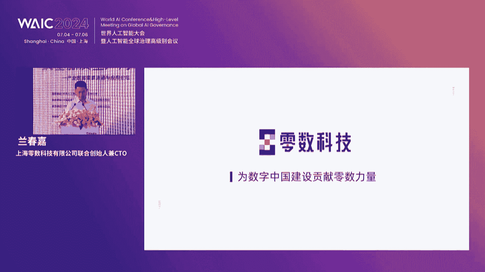

# 46：产业数据要素流通与应用论坛精华解读 🎤


## 课程概述
在本节课中，我们将学习2024世界人工智能大会“产业数据要素流通与应用论坛”的核心内容。课程将聚焦数据作为新型生产要素的价值、流通挑战、技术解决方案及产业应用实践，帮助初学者理解数据要素市场的现状与未来。

---

## 一、论坛开幕与致辞 🌟

本次论坛以“激活数据要素，乘数新质生产力”为主题，汇聚了政、产、学、研各界的领导与专家。数据已成为驱动数字经济发展的核心引擎，培育新质生产力的关键力量。


上海市相关领导在致辞中指出，上海正加快培育数据要素市场，力求到2025年基本建成数据要素市场体系。产业数据要素的流通与应用，是推动高质量发展的重要抓手。

---

## 二、数据要素的价值与挑战 ⚖️

上一节我们介绍了论坛的宏观背景，本节中我们来看看数据要素本身的特点及其面临的挑战。

数据作为一种新型生产要素，具有易复制、需复用、含隐私、强时效等特点。其价值释放面临三大核心矛盾：
1.  **制度与技术的协同**：顶层制度（如“数据二十条”）已出台，但与之匹配的基础技术（如确权、定价、流通）尚不完善。
2.  **流通与安全的平衡**：数据不流动没价值，但流动又可能引发安全与隐私泄露风险。
3.  **供给与需求的错配**：存在大量数据，但高质量供给不足，且中小企业“不会用、不敢用、不愿用”数据的情况普遍。

核心概念可以用一个简单公式描述数据价值的释放逻辑：
`数据价值 = f(数据质量， 流通效率， 应用场景)`
其中，流通效率和应用场景的丰富度是关键变量。


---

## 三、关键技术：构建可信流通基础设施 🔐




要解决上述挑战，必须依靠技术创新来构建安全可信的数据流通基础设施。以下是当前重点发展的几项关键技术：

**1. 区块链技术**
区块链通过分布式账本、不可篡改、可追溯等特性，为数据流通提供“存证”和“确权”的基础。
```python
# 概念性代码：区块链存证
block = {
    'timestamp': '2024-07-06 14:30:00',
    'data_hash': '0xabc123...', # 数据指纹
    'previous_hash': '0xdef456...', # 构成链式结构
    'owner': 'Company_A'
}
```

**2. 隐私计算技术**
隐私计算（如联邦学习、安全多方计算）能在不暴露原始数据的前提下进行协同计算，实现“数据可用不可见”。

**3. 数据元件与数据空间**
“数据元件”是原始数据经脱敏、加工后形成的标准化、可封装、可计量的中间态产品，是流通的理想标的物。“可信数据空间”则是基于分布式技术，连接数据供需双方，提供可控、可追溯流通环境的基础设施平台。

---

## 四、产业应用场景实践 🚗⚡️🐟

技术必须与产业结合才能创造价值。以下是数据要素在几个典型领域的应用案例：

**汽车交通领域**
*   **场景**：智能网联汽车自动驾驶算法训练。
*   **痛点**：单一车企数据有限，数据孤岛严重。
*   **解决方案**：通过可信数据空间，链接车企、路侧设备等多方数据，在保护各方权益的前提下，形成合规的大型数据集，共同训练算法，加速自动驾驶技术研发。

**能源电力领域**
*   **场景**：虚拟电厂调度与碳资产管理。
*   **痛点**：发电方、用电方、电网等多主体间数据信任与清结算问题。
*   **解决方案**：利用区块链技术对发电、用电、交易等数据进行可信存证与自动清分结算，提升调度效率与透明度，并服务于碳资产的精准核算与交易。

**智慧农业领域**
*   **场景**：设施渔业养殖与农产品溯源。
*   **痛点**：养殖过程不透明，品质不可控，补贴发放不精准。
*   **解决方案**：通过物联网采集养殖环境数据，结合区块链进行全流程溯源。消费者可查证产品来源，政府可基于可信数据实现精准补贴。

---

## 五、前沿探索：从产业数据空间到金融数据空间 💰

数据在产业内部流动产生价值（记为1），当它进一步流向金融领域时，可能创造十倍甚至百倍的价值（10或100）。这就是“产融结合”的巨大潜力。

以下是两个延伸场景：
*   **汽车数据 → 保险**：基于可信的车辆行驶数据，保险公司可以开发更精准的UBI（基于使用行为的保险）或自动驾驶责任险。
*   **能源数据 → 绿色金融**：基于可信的新能源发电站运营数据，金融机构可以更准确地进行资产评估，为新能源项目提供融资支持。

通过**产业数据空间**推动产业数字化，再通过**金融数据空间**激活金融价值，构成了数据要素价值释放的“第二曲线”。

---

## 六、总结与展望 🔮

本节课中我们一起学习了：
1.  **数据要素的核心地位**：数据是数字经济的核心生产要素，其流通与应用关乎新质生产力的发展。
2.  **流通的核心挑战**：主要集中在制度与技术协同、安全与效率平衡、供给与需求匹配等方面。
3.  **关键的技术支柱**：区块链、隐私计算、数据元件与可信数据空间是构建流通基础设施的基石。
4.  **丰富的应用场景**：在汽车、能源、农业、政务、金融等领域，数据要素正在通过技术解决具体痛点，创造真实价值。
5.  **未来的融合方向**：产业数据与金融数据的结合，将释放更大的乘数效应。

展望未来，数据要素市场的繁荣需要政策、技术、产业、资本的共同推动。业界应少一些浮躁与空谈，多一些踏实与务实，共同将数据的梦想照进现实。正如论坛所言：“春天来了”，数据要素的价值释放正迎来广阔天地。