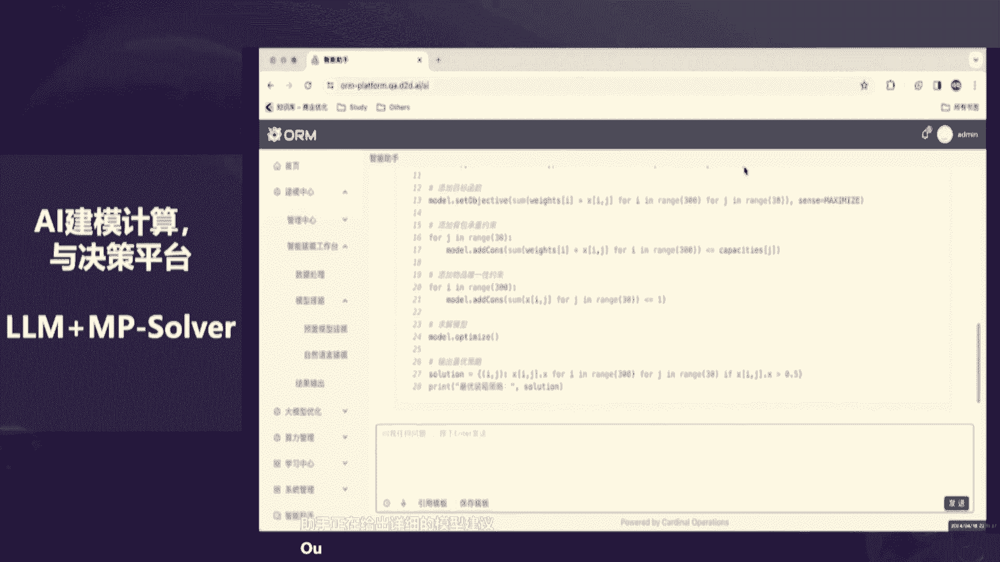
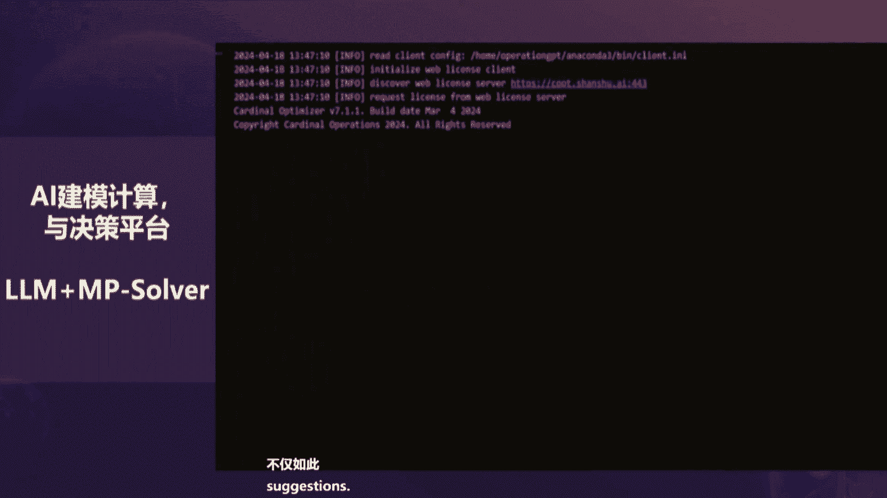
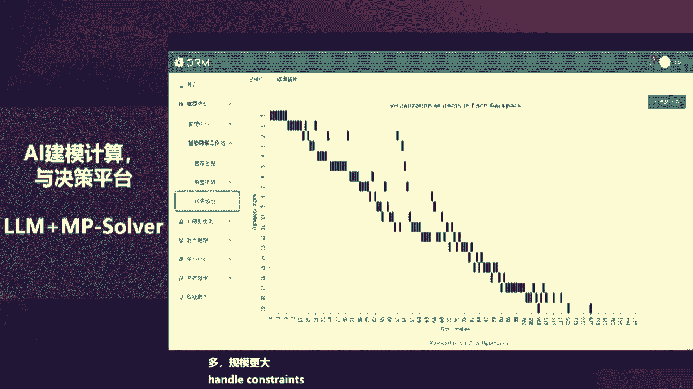
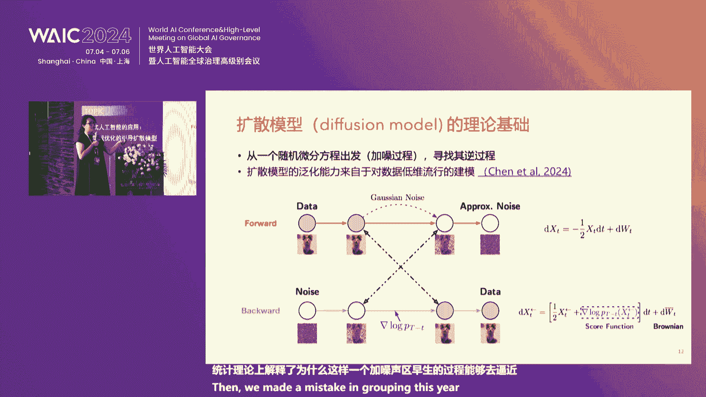

# 47：AI与数学优化：从理论到应用 🧠➡️⚙️

在本节课中，我们将学习数学优化（或称数学规划）的核心概念、其与人工智能（特别是大模型）的关系，以及它在解决现实世界复杂问题（如电网调度、生产排程）中的关键作用。我们将看到，基于科学和逻辑的优化方法如何与基于数据和经验的人工智能方法互补结合，共同推动技术进步。

---

## 1. 数学优化：定义与核心要素 🔍

上一节我们介绍了课程概述，本节中我们来看看什么是数学优化。数学规划，有时也称为优化，其核心是寻找最佳决策方案。

一个数学规划问题主要由三个要素构成：
1.  **数据**：问题中已知的固定信息。
2.  **变量**：决策者可以控制或改变的未知量。
3.  **目标函数**：需要最大化或最小化的性能指标。

此外，决策通常还需要满足**约束条件**，这些条件代表了物理规律、经济限制或政策要求，不能随意违背。

其通用形式可以用以下公式描述：
```
优化目标： 最大化或最小化 f(x)
约束条件： 满足 g_i(x) ≤ 0, i=1,...,m
                 h_j(x) = 0, j=1,...,p
```
其中 `x` 是决策变量向量。







---

## 2. 一个经典案例：背包问题 🎒

为了理解数学优化如何工作，让我们看一个简单例子：经典的背包问题。

假设你有一个最大承重为5公斤的背包，面前有5件物品，每件物品有自己的重量和价值。目标是选择放入背包的物品，在不超过总重量的前提下，使背包内物品的总价值最大。

以下是解决此问题的关键步骤：
*   **定义变量**：为每个物品定义一个二进制变量 `x_i`，`x_i = 1` 表示放入背包，`x_i = 0` 表示不放入。
*   **建立目标函数**：总价值 = 各物品价值乘以对应变量后的总和，目标是最大化这个总和。
*   **添加约束**：各物品重量乘以对应变量后的总和必须小于等于背包承重。

当物品数量很少时，可以手动枚举所有可能性（`2^5 = 32`种）。但在现实中，问题规模可能极其庞大（例如数万物品、多个背包），可能性将是天文数字，必须依靠数学优化算法来高效求解。

---

## 3. 数学优化 vs. 生成式AI：逻辑与经验的对比 ⚖️

上一节我们通过背包问题看到了优化问题的复杂性，本节中我们来看看数学优化方法与当前流行的生成式AI（如ChatGPT）在解决问题上的根本区别。

我们曾用早期版本的ChatGPT尝试求解上述背包问题。它正确地识别出这是一个背包问题，并给出了建模建议，但最终推荐的解决方案（放入第1、3、5件物品）总重量为6公斤，**违反了5公斤的约束**。这揭示了一个关键点：

*   **数学优化**：追求基于科学、逻辑和数学规律的**精确解**。它要求结果100%正确，适用于航空、电网调度等不容出错的领域。
*   **生成式AI（大模型）**：主要基于大量数据训练，给出的是**近似或经验性的答案**。它可能犯错，适用于容错率较高的创造性或辅助性任务。

两者并非对立，而是**互补关系**。有些问题需要严格的数学规律，有些则需要融入人的经验。更妙的是，我们可以结合两者：用大模型帮助将复杂的现实问题描述转化为数学模型（建模），再用专业的优化求解器进行精确求解。

---

## 4. 优化是大模型训练的核心 🔄

我们探讨了优化与AI的区别，但有趣的是，人工智能本身也深深依赖着优化技术。

大模型（如神经网络）的训练过程，本质上就是一个庞大的**优化问题**：
*   **变量**：神经网络中数以亿计的连接参数。
*   **目标函数**：损失函数，用于衡量模型预测与真实数据之间的差距。
*   **目标**：通过调整参数，最小化损失函数。

目前最常用的训练算法是 **Adam**。训练一个像Llama-7B这样的模型，需要处理海量数据，耗时数月并消耗巨大电力。优化领域的专家通过分析训练目标函数的数学特性（如梯度、海森矩阵的结构），对Adam算法进行了改进，提出了 **Adam-mini** 等新算法，成功将训练时间减少了约三分之一，同时节省了内存。这证明了高效的优化算法对AI发展至关重要。

---

## 5. 优化求解器：速度与精度的追求 ⚡

既然优化如此重要，我们如何高效求解这些复杂模型呢？这就要依靠**优化求解器**——一种专门用于求解数学规划问题的软件。

求解器的核心追求是：
1.  **准确性**：保证找到的解是数学上的最优解或高质量可行解。
2.  **速度**：求解时间越短，就能越频繁地重新规划，以应对现实世界的变化。

其发展历程如下：
*   **1979年**：首个商业求解器出现。
*   **2011年**：开源求解器开始发展。
*   **2019年**：中国诞生了首个自主的商业求解器（如COPT），打破了国外垄断。在多项国际公开测试中，国产求解器已达到世界第一或第二的水平。

现实问题的复杂性不断增长，对求解速度提出了更高要求。传统基于CPU的求解方式遇到瓶颈。现在，研究前沿是将求解器移植到 **GPU** 上，利用其并行计算能力。例如，某个曾需要59400秒（约16.5小时）求解的欧洲物流问题，通过GPU加速的求解器仅需916秒即可解决，提速超过60倍。

---

## 6. 硬件与软件的协同进化：CPU+GPU混合架构 🖥️➕🎮

上一节我们看到了GPU带来的巨大提速，本节中我们深入探讨这种硬件变革背后的计算范式转变。

长期以来，高精度科学计算（包括传统优化求解器）主要依赖CPU。GPU因其高并行性但在双精度浮点计算上存在局限，被认为不适合此类任务。然而，这一观念正在被打破。

**范式转变正在发生**：优化求解的核心算法（如一阶/二阶算法、整数规划）正在被重新设计，以适应 **CPU+GPU的混合架构**。这带来了突破性进展：
*   **线性规划**：万秒级问题降至百秒级。
*   **半定规划**：可求解问题的规模从万维提升到亿维。
*   **二次约束规划**：曾经内存溢出或无解的大规模问题，现在几十秒即可求解。

英伟达等硬件厂商也积极跟进，发布了新的函数库（如用于矩阵分解的`tensorly`函数）和硬件架构（如Grace Hopper），旨在降低CPU与GPU间的通信延迟。未来的计算趋势必然是软硬件协同设计。

对于中国而言，机遇与挑战并存。机遇在于参与并引领这场计算架构的范式变革。挑战在于，国产GPU在底层**数值计算库函数**（如矩阵运算）的成熟度上与国外存在较大差距，这比硬件本身的差距更为关键，需要重点投入建设。

---

## 7. 让AI学会建模：大模型与优化的结合 🤝

我们拥有了强大的求解器，但解决现实问题的第一步——**将业务问题转化为数学模型（建模）**——仍然高度依赖专家经验，耗时费力。这正是大模型可以发挥作用的舞台。

然而，直接让通用大模型（如GPT-4）进行复杂业务建模仍面临挑战：
*   **幻觉问题**：可能生成看似合理但数学上错误的模型。
*   **领域知识缺乏**：对特定行业的复杂约束理解不深。
*   **求解能力不足**：即使建对模型，也可能无法调用或有效利用专业求解器。

为此，研究者开发了**领域专用的智能建模系统**。这类系统通常：
1.  采用高质量的行业历史数据与合成数据进行训练。
2.  利用思维链等技术将复杂建模任务分解。
3.  与优化求解器（如COPT）深度集成，实现“建模-求解”一体化。

初步实践表明，这类系统能显著提升建模效率，将原本需要数周人工完成的工作，缩短到几天甚至更短。这预示着，大模型有望率先改变高技术工种的工作模式，实现知识经验的沉淀与高效复用。

---

## 8. 生成式AI的挑战与金融应用实例 💹

数学优化与AI的结合前景广阔，而生成式AI本身也面临诸多挑战，并在其他领域如金融量化交易中产生革命性影响。

**生成式AI的三大挑战**：
1.  **情感沟通与隐私**：当前模型多为说教式交互，缺乏真正的情感理解与共情能力，且在对话中可能存在隐私泄露风险。
2.  **幻觉问题**：模型会“自信地”编造不存在的信息。缓解方法之一是**检索增强生成**，即让模型在回答前先联网搜索相关信息作为依据。
3.  **去中心化训练的验证**：当利用分布式算力市场训练或微调模型时，如何验证任务提供方确实完成了约定工作、未篡改数据或偷工减料？区块链技术与基于AI训练过程本身设计的**可验证计算**机制可能是解决方案。



**在量化金融中的应用**：
生成式AI，特别是大语言模型，正在改变量化投资：
*   **另类数据分析**：传统量化依赖价格、财报等结构化数据。现在，大模型可以深度分析新闻文本、社交媒体情绪，甚至解析卫星图片（如通过停车场车辆数预测零售商业绩），从中提取影响市场的“新因子”。
*   **策略生成与优化**：对冲基金如**XTX Markets** 率先大规模使用GPU和深度学习进行高频交易，开启了量化交易的新范式。AI可以处理更复杂的非线性关系，自动发现交易策略。

---

## 9. 可控的生成式AI：对齐与扩散模型 🎨

生成式AI不仅能生成内容，其底层思想（如扩散模型）还能用于解决更广泛的优化与设计问题。但前提是，我们必须让AI**可控**。

**对齐问题**：如何确保比人类更强大的AI（超智能）始终符合人类意图与价值观？主流方法是**基于人类反馈的强化学习**（RLHF）。通过人类对模型输出的偏好反馈来训练一个“奖励模型”，再用强化学习微调大模型，使其输出更符合人类喜好。

**扩散模型作为优化引擎**：
扩散模型不仅是图像生成工具，其本质是一个**受控的随机过程**（从噪声逐步生成数据）。我们可以引导这个过程，使其服务于特定优化目标：
*   **原理**：在预训练好的扩散模型采样（去噪）过程中，加入额外的控制信号，引导生成结果同时满足数据分布和自定义的目标函数（如蛋白质的某种生物活性）。
*   **应用**：这实现了“指哪打哪”的智能设计，可用于生成新的**蛋白质结构**、**材料晶体**、**机器人控制轨迹**等，远超艺术创作范畴，在科研与工程中潜力巨大。

---

## 10. 人工智能的经济展望与数据定价 📈

最后，我们从更宏观的经济学视角审视人工智能的影响。

**AI对经济与就业的冲击**：
影响可能超出传统认知。AI首先替代的未必是体力劳动，而是那些**信息处理完备**、环境交互少的认知工作（如编程、会计、分析）。甚至最高端的科研工作也可能受到冲击。这可能导致社会结构两极化，威胁中产阶级。

**AI发展的两种世界观**：
1.  **可预测的**：遵循**缩放定律**，模型能力随算力、数据量增长可预测地提升。
2.  **不可预测的**：存在**涌现能力**，能力在某个临界点突然出现，难以预测。
这两种可能性预示着截然不同的未来社会发展路径。

**用经济学方法设计更好的AI**：
*   **考虑多样性偏好**：在RLHF中，不仅要学习大多数人的偏好，还应通过正则化等技术保护少数群体的偏好分布，使AI输出更公平、更具经济代表性。
*   **数据定价与版权**：数据是AI时代的“石油”。未经授权使用版权数据训练模型引发诸多纠纷。完全封锁或完全放开都非良策。一个经济学解决方案是引入**沙普利值**：通过衡量每个数据贡献者（或组合）对模型性能提升的边际贡献，来公平地分配模型收益，从而在激励创新与保护产权间取得平衡。

---

## 总结 📚

本节课中我们一起学习了：
1.  数学优化的基本要素及其对求解复杂决策问题的必要性。
2.  数学优化（追求精确）与生成式AI（基于经验）的根本区别与互补关系。
3.  优化算法本身就是大模型训练的核心，其改进能直接推动AI发展。
4.  高性能优化求解器的发展，以及向CPU+GPU混合架构演进的趋势。
5.  如何利用大模型辅助解决建模难题，实现智能决策。
6.  生成式AI在金融量化等领域的应用实例及其面临的幻觉、验证等挑战。
7.  通过对齐技术使AI可控，以及扩散模型在科学设计中的潜力。
8.  从经济学视角看待AI对就业、社会结构的影响，以及用市场机制解决数据版权问题的思路。

智能计算的时代已经到来，数学优化与人工智能的深度融合，正在为各行各业带来前所未有的精准决策能力和创新活力。