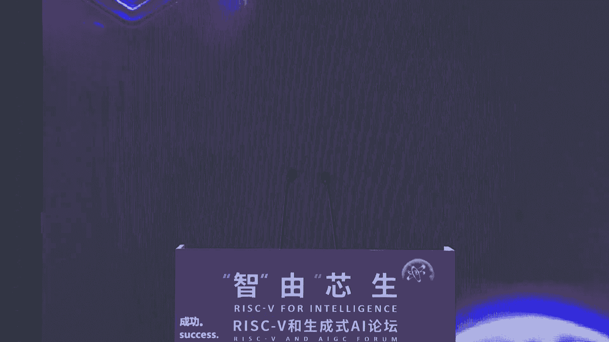
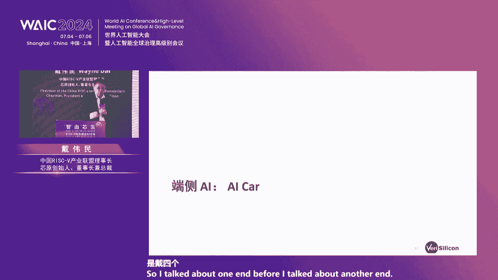
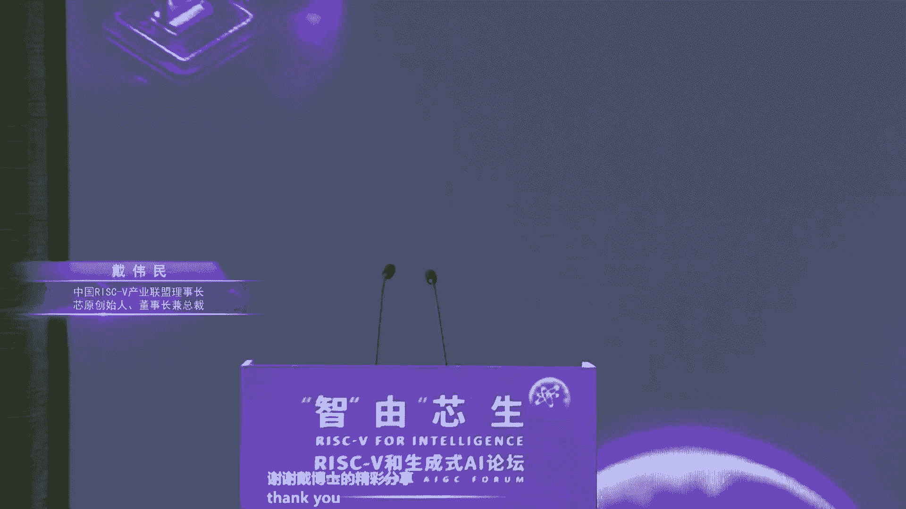

# 48：RISC-V与生成式AI融合创新教程

## 概述
在本节课中，我们将学习RISC-V指令集架构如何与生成式人工智能（AI）技术相结合，共同应对当前AI发展面临的算力、能耗和定制化挑战。课程内容整理自行业论坛中多位专家的核心观点，我们将深入探讨其技术原理、市场机遇与未来趋势。



---

## 一、 论坛开幕与行业背景

本次论坛聚焦于生成式AI的快速发展及其带来的巨大算力需求。AI模型通常在云端进行训练，在终端设备进行推理和微调，这对计算架构提出了新的要求。

RISC-V作为一种开放的指令集架构，因其微架构的灵活性和可扩展性，为AI芯片的创新提供了广阔的技术空间和产业化自由度。论坛旨在探讨两者融合发展的技术难点与市场机遇。

---


## 二、 领导致辞：上海在RISC-V生态中的角色

上一节我们介绍了论坛的背景，本节中我们来看看产业政策层面的支持。上海市相关领导在致辞中概述了上海在拥抱和推动RISC-V发展方面的成果与规划。

上海是中国最早推动RISC-V发展的区域之一，自2015年起便有企业参与国际基金会的组建。经过近十年发展，上海已成为RISC-V企业、产业和人才最集聚的地区。

取得的成果主要体现在以下三个方面：
*   **培育领军企业**：在IP、芯片设计等领域涌现出一批具有国际竞争力的企业。
*   **构建产业生态**：形成了从EDA工具、芯片设计到晶圆制造和流片验证的完整产业链。
*   **汇聚专业人才**：多所高校开设相关课程，培养的人才占全国比重较高。

未来，上海计划从三个方面继续推动产业发展：
1.  成立产业赋能中心，构建统一硬件平台，形成全栈解决方案。
2.  做强产业联盟，加快专利池建设，推动共建共享。
3.  加强前沿技术研究和人才培养，将RISC-V纳入紧缺人才培训计划。



生成式AI的快速发展为RISC-V提供了巨大的发展空间。



---

## 三、 主题分享一：大语言模型的原理与发展

上一节我们了解了产业生态的布局，本节我们将深入技术核心，探讨大语言模型的基础原理。演讲者从“第一性原理”角度，阐释了大语言模型为何能够工作。

**原理一：邱奇-图灵论题**
该论题指出，所有已知的计算装置都等价于图灵机。这为理解计算和智能提供了基础起点。用公式化的理解即：
`所有计算装置 ≈ 图灵机`

**原理二：学习的定义**
学习可以被定义为“图灵机的逆问题”。即，给定一系列输出，去反推产生这些输出的机器（程序）。这恰好对应了大模型的训练过程：用海量数据训练，得到一个能够产生这些数据的模型（机器）。

**原理三：神经网络的通用性**
三层以上的神经网络可以无限逼近任意连续函数，这意味着它可以作为一个通用的函数逼近器。这为神经网络处理复杂任务奠定了理论基础。

**原理四：算力与能耗的物理极限**
信息处理存在理论上的能耗下限，即兰道尔极限。随着AI算力需求指数级增长，如何应对巨大的能耗挑战，是未来必须面对的问题。

当前，大模型的发展速度极快，但巨大的算力需求也带来了能耗和可及性的挑战，这为硬件创新留下了空间。

---

## 四、 主题分享二：AIGC芯片的机遇与挑战

上一节我们从原理层面理解了AI，本节我们来看看支撑AI发展的硬件——芯片所面临的机遇与挑战。生成式AI（AIGC）正推动一场深刻的智能革命。

从弱智能到强智能，再到可能出现的超越人类的超级智能，其发展速度可能远超预期。这迫使我们必须积极拥抱这项技术。

**巨大的算力需求与能耗挑战**
随着模型参数量的增加，所需的算力呈指数级增长。例如，训练未来可能的超级智能模型，可能需要千万张H100级别的加速卡，能耗相当于十座大型水电站。这带来了巨大的挑战。

**端侧AI的广阔前景**
AI算力需求将分布在云、边、端各个层面。除了云端的训练，在终端设备（如PC、手机、AR眼镜）上进行模型的微调和推理，将是一个更庞大的市场。未来的设备若不具备AI能力，可能失去竞争力。

**芯片架构的创新：Chiplet与先进封装**
为了提升算力和能效，芯片架构正在革新。Chiplet（芯粒）技术通过将大芯片分解为多个小芯片进行异构集成，再通过先进封装（如2.5D、3D）连接成一个系统，是应对摩尔定律放缓、提升性能功耗比的关键路径。

**汽车电子成为重要赛道**
智能汽车对芯片算力、安全性和可靠性的要求极高，且其供应链相对集中，为新型芯片架构（如基于Chiplet和RISC-V）提供了良好的落地场景。

---

## 五、 主题分享三：RISC-V——AI的理想选择

上一节我们看到了AI对芯片的驱动，本节我们聚焦于为何RISC-V架构特别适合AI。RISC-V是一种开放、国际化的标准指令集架构（ISA）。

与x86和ARM相比，RISC-V具有以下核心优势，使其与AI需求高度契合：
1.  **开放性**：完全开放，无需授权费用，降低了创新门槛，有助于防止AI算力被垄断。
2.  **模块化与可定制性**：其指令集采用模块化设计，允许开发者添加自定义指令扩展。这对于AI应用至关重要，因为不同公司或垂直领域可能希望拥有自己独特的、安全的加速特性。
    *   **公式化理解**：`RISC-V SoC = 标准基础指令集 (Base ISA) + 可选标准扩展 (如V向量扩展) + 自定义指令扩展 (Custom Extension)`
3.  **新兴且持续发展**：作为较新的架构，可以更好地融入AI等新需求。
4.  **活跃的生态系统与人才储备**：拥有充满热情的开发者社区和学术界的大力支持，有利于软硬件生态的繁荣。

市场预测显示，在AI加速器领域，RISC-V的占比预计将显著高于其在整体处理器市场中的份额。

---

## 六、 主题分享四：多功能RISC-V处理器赋能AI创新

上一节我们讨论了RISC-V的特性优势，本节我们通过一个具体案例，看企业如何利用RISC-V构建AI算力解决方案。公司利用RISC-V的“多才多艺”特性来应对AI算力挑战。

**无处不在的AI算力需求**
AI算力需求遍布云端数据中心、边缘和终端设备。公司提供从IP授权到芯片，再到服务器的全栈解决方案，以满足不同场景的需求。

**RISC-V在AI加速器中的关键角色**
在其AI加速器芯片中，集成了多个小型、高效的RISC-V核心。这些核心并非用于通用计算，而是各司其职，专门负责指挥数据搬运、向量/矩阵运算单元等任务，实现了高效的并行处理。
```c
// 概念性代码：描述AI加速器中RISC-V核心的分工协作
RISC-V_Core_1: 负责从外部搬运数据到本地存储；
RISC-V_Core_2: 指挥向量计算单元执行运算；
RISC-V_Core_3: 将结果从寄存器写回存储并发送给下一个处理单元；
```
这种设计充分利用了RISC-V可定制、高效率的特点。

**高性能RISC-V CPU的作用**
除了在加速器中作为“管理者”，高性能的RISC-V CPU也旨在数据中心场景中，逐步替代x86作为主机处理器，负责虚拟化、安全管理和任务调度等。同时，它也能作为AI计算图的一部分，处理那些不适合用加速器执行的通用计算任务。

RISC-V的可扩展性、高能效和丰富的IP生态，使其在AI算力硬件中扮演着越来越重要的角色。

---

## 七、 主题分享五：生成式AI的释放与RISC-V的变革力量

上一节我们看了具体的设计实例，本节我们将视角拉回宏观，探讨如何通过架构创新来满足AI算力增长。AI将深刻改变各行各业，但当前硬件算力的增长已跟不上AI软件的需求。

**算力供需的巨大缺口**
计算能力的供应增长缓慢（受限于物理定律），而AI对算力的需求却在爆发式增长，形成了巨大缺口。这既是挑战，也是通过新架构进行创新的机会。

**数据中心架构的演进方向**
为了提升效率和灵活性，数据中心架构正向以下方向演进：
*   **Chiplet**：实现异构集成，混合匹配不同工艺、功能的芯粒。
*   **解耦**：将计算、内存、存储资源池化，通过DPU（数据处理器）互联，按需分配。
*   **动态可重构**：处理器能够根据实时工作负载动态调整资源配置（如整数/浮点寄存器），以提升能效。

**RISC-V的核心价值**
RISC-V的可定制指令集特性，正是实现上述动态可重构等高级架构创新的理想基础。它允许厂商在保持软件兼容的前提下，进行深度的硬件优化。推动RISC-V开放标准的持续演进和生态系统建设，对于释放AI潜力至关重要。

---

## 八、 圆桌讨论：生成式AI的融合与创新

前面的演讲分别从技术、产业、硬件等角度进行了阐述，本节我们通过圆桌讨论，汇总一些前沿的交叉议题。

**议题一：AI的安全与治理**
生成式AI的快速发展可能带来失业、信息失序（如幻觉问题）乃至系统失控（超级智能）的风险。治理方案可能包括：
*   **分级管控**：对超级大模型采取类似核武器的严格国际管控。
*   **技术平衡**：在消除有害“幻觉”和保留创造性之间取得平衡。
*   **经济调节**：探索征收“AI税”或建立补偿机制，用以应对社会冲击和促进公平。

**议题二：大模型生态：专制还是民主？**
未来可能形成少数几个“超级大模型”垄断，也可能出现众多“主权大模型”共存的局面。前者可能导致知识生产单一化，后者则面临效率与资源分散的挑战。这需要全球在发展与安全、集中与分散之间寻找平衡。

**议题三：AI芯片架构的演进**
AI驱动计算架构进入创新活跃期。专用集成电路（ASIC）能获得极致性能，但灵活性差；通用GPU（GPGPU）生态强大，但能效有优化空间。趋势是在专用与通用之间寻找最佳平衡点，而RISC-V因其可定制性，能很好地支撑各种DSA（领域专用架构）创新。

**议题四：RISC-V的突围之路**
在x86和ARM主导的市场上，RISC-V如何突破？其机会在于：
*   **新兴AI市场**：AI领域尚无绝对垄断的硬件生态，RISC-V凭借能效和定制化优势有望切入。
*   **增量市场**：智能汽车等对芯片有定制化、高安全、实时性要求的新兴领域，是RISC-V的理想落地场景。
*   **生态共建**：通过推动接口标准（如Chiplet的UCIe）、共享基础平台，降低创新成本，壮大生态。

**议题五：DPU——数据中心的新枢纽**
DPU正在成为数据中心的核心，负责网络、存储虚拟化和安全。专注于数据处理的厂商（如MIPS）正将其在数据移动方面的传统优势与RISC-V的可定制性结合，致力于在这一新兴领域取得突破。

---

## 总结
在本节课中，我们一起学习了RISC-V与生成式AI融合发展的全景图。我们从大语言模型的第一性原理出发，认识到AI对算力的巨大需求与能耗挑战。进而，我们探讨了RISC-V如何凭借其开放性、模块化、可定制性和高能效特性，成为应对这些挑战的理想硬件基础。通过具体的芯片设计案例和产业分析，我们看到了RISC-V在云端AI加速器、高性能CPU以及汽车电子等关键领域的应用潜力。最后，圆桌讨论揭示了AI发展伴随的治理、生态和架构选择等深层问题。总体而言，RISC-V与AI的结合，正为计算产业带来一场深刻的变革，为全球创新者提供了新的机遇。