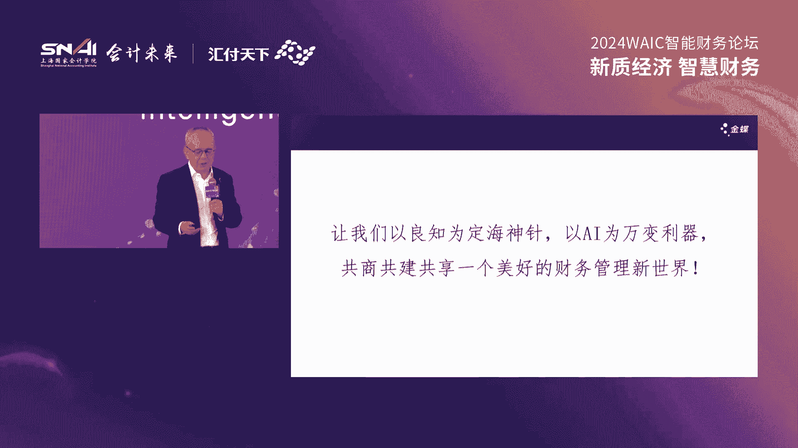
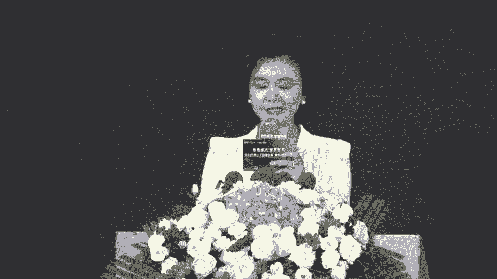

# 49：2024世界人工智能大会智能财务论坛精华解读 📊🤖

## 概述

在本课程中，我们将系统性地学习2024世界人工智能大会智能财务论坛的核心内容。本次论坛以“新质经济，智慧财务”为主题，汇聚了政界、学界、产业界的众多专家，共同探讨人工智能技术与财务领域深度融合的前沿趋势、实践案例与未来挑战。我们将对论坛的致辞、主旨演讲、研究报告发布及圆桌讨论进行梳理和解读，旨在为初学者提供一个清晰、全面的智能财务入门指南。

---

## 第一节：论坛开幕与领导致辞 🎤

智能财务论坛在庄重的氛围中拉开帷幕。主持人强调了人工智能、机器学习、大数据分析等技术在财会领域的成功应用，为智能财务开创了崭新领域。本次论坛由上海国家会计学院与汇付天下有限公司联合主办，并得到了多家战略合作与支持单位的协助。

以下是出席论坛的主要领导和嘉宾名单：
*   财政部会计司副司长 王东
*   财政部会计司制度三处处长 杨海峰
*   上海市经信委软件与信息服务业处处长 裘薇
*   中国科学院院士、复旦大学光电研究院院长 褚君浩
*   ACCCA政策与洞察总监 Mike Sfield
*   上海国家会计学院院长、党委副书记 卢文斌
*   汇付天下董事长兼CEO 周晔
*   金蝶集团董事会主席兼CEO 徐少春
*   中信银行上海分行党委书记、行长 赵元新

**王东副司长**在致辞中指出，人工智能是新一轮科技革命和产业变革的重要驱动力。财政部高度重视会计信息化与智能财务发展，新修订的《会计法》专门增加了加强会计信息化建设的条款，为相关工作提供了法律保障。目前，财政部正积极推进会计信息化标准建设，并联合多部委开展电子凭证会计数据标准试点，为会计工作数字化转型奠定基础。

**裘薇处长**代表上海市经信委致辞，她强调人工智能技术正在催生新的应用场景和业态。市经信委正积极推动人工智能与实体经济深度融合，打好包括“产业赋能升级攻坚战”在内的六大攻坚战。她认为，智能财务是企业数字化转型的必由之路，需要技术创新、行业协同共同推动。

**卢文斌院长**作为主办方代表致辞。他指出，发展新质生产力的核心在于创新，以大数据、人工智能为代表的科技创新正在深刻变革财务管理。上海国家会计学院作为国家级财经人才培养基地，已开设智能财务系列课程，并依托智能财务研究院搭建了政产学研平台，未来将继续深化智能财务的理论研究和应用探索。

**单振雷行长助理**代表中信银行致辞。他介绍了中信银行在智能科技方面的努力，包括构建“AI+BI”双轮驱动的技术生态、落地超千个AI应用场景、打造“天元司库”系统等，展现了金融领域智能财务的前瞻性和创新能力。

---

## 第二节：主旨演讲精要（上）—— 宏观趋势与技术基石 🧠

上一节我们了解了论坛的概况与政策导向，本节中我们将聚焦两位专家从宏观趋势和信息技术角度带来的深刻洞察。

### 褚君浩院士：智能时代与管理科学

褚院士的分享围绕三个核心问题展开。

**1. 智能时代的大趋势**
我们正从信息化时代迈向智能时代，其特征是智慧（人工智能）融入物理系统和各产业，包括管理科学。新事物、新技术（如文生视频、人形机器人、脑机接口）将快速涌现。**智能化系统**的三大支柱是：**动态感知、智慧识别、自动反应**。

**2. 信息的获取与认知**
这是实现智能化的两个关键技术。
*   **实时感知（传感器技术）**：如同人类的五官，用于收集各类数据。褚院士以红外传感器为例，展示了其在安防（检测危险物品）、农业（识别坏果）、医疗（热成像诊断）等领域的广泛应用。其原理是物质运动形态的相互转化（如光电效应）。
*   **智慧分析（大数据分析）**：对感知到的大数据进行处理与分析，以构建智慧城市、实现智慧管理。其思想对管理科学同样适用：**收集信息 -> 分析信息 -> 判断决策**。

**3. 人工智能与管理**
人工智能（如图像识别、语言处理）可以高效管理海量数据、挖掘有效信息、避免工作失误、提高效率、完成重复性工作，并通过数据分析预警潜在风险。褚院士总结道，**“实时感知、大脑分析、采取措施”** 的思想是自然科学、技术科学与管理科学的共同内核。迎接智能时代，需要积极发展人工智能并融入实体世界。

### Mike Sfield先生：人工智能在会计与金融中的价值解锁

ACCA的Mike Sfield先生分享了其对AI在财会领域应用的观察与反思。

**1. 广阔背景下的AI**
必须将技术变革置于更广阔的地缘政治、经济和ESG趋势背景下来理解，才能把握其机遇与局限。会计行业必须持续创新，会计师将在组织转型和可持续价值创造中扮演核心角色，而技术（尤其是AI）是赋能的关键。

**2. AI在财务中的应用现状与机遇**
ACCA的研究将AI分为几类：用于预测的**机器学习**、用于数据提取的**计算机视觉**、用于文本分析的**自然语言处理**以及**生成式AI**。核心在于**增强**而非仅仅自动化。初步调查显示，全球范围内AI在财务规划与分析、数据分析和交易性财务任务中应用最广，而中国企业在将AI作为生产力工具方面 adoption 更快。

**3. 如何起步：四大关键要素**
*   **数据**：AI本质是数据转换。需评估数据质量、类型和治理。
*   **战略与创新**：需平衡自上而下的战略与自下而上的创新，数字领导力至关重要。
*   **灵活性与耐心**：AI项目需要实验、时间和持续改进。
*   **协作**：鼓励跨组织知识共享和最佳实践交流。

**4. 技能提升与风险管理**
调查显示，会计师对AI普遍乐观，但也对岗位影响和技能更新感到担忧。需要提升**AI素养**，对不同角色（如数据分析师与财务领导者）的技能要求应有所侧重。同时，必须管理AI的风险，如算法的**可解释性**、数据**偏见**以及生成式AI的**幻觉**问题。人类判断和明确的责任线必须嵌入任何AI应用。

**5. 生成式AI的挑战与潜力**
生成式AI投资巨大，但尚未进入“生产力高原”。需区分其**现有能力**（如翻译）、**能力前沿**（复杂、模糊任务）和**未来潜力**。必须认识其**根本局限**（如无法保证100%准确），并在理解错误成因的基础上进行负责任实验。

---

## 第三节：主旨演讲精要（下）—— 产业实践与未来展望 🚀

上一节我们探讨了智能时代的宏观图景和AI赋能财务的框架，本节我们将深入产业实践，看看领先企业如何布局，并展望财务管理的未来形态。

### 周晔董事长：财务——从数据原生到智能跃迁

周晔先生以一个“外行”的视角，提出了两个核心观察：
1.  财务是现代商业的基础，决定公司经营管理质量。
2.  财务从诞生起就是充满科技感的行业。

**1. 财务的数据原生基因**
1494年，数学家帕乔利在《数学大全》中阐述了**复式记账法**，首次系统性地用数据记录经营行为，用货币度量世界，建立了物理世界在数字世界的映射模型。这甚至早于现代科学定量观察世界的方法。因此，财务人员本质上是**原生的数据工作者**。

**2. 数字化与智能化的新挑战**
然而，从“数据工作者”到实现“数字化”和“智能化”并非易事。现代数字化需要处理**海量、高速、连接**的云端生态数据，并建立**数据模型**以支持多维度观察。这需要**数据连接器**（如API）和**数据中台**，对大多数企业而言是一项耗时数年的系统工程。

**3. 从流程自动化到超级自动化**
传统上，企业通过梳理专家经验，建立人和人协同的**工作流程**。下一步是利用低代码/无代码工具实现**流程自动化**。而当前以**大语言模型**为代表的AI突破，结合**RAG**（检索增强生成）和**Agent**（智能体）技术，使得机器不仅能调用知识，还能自动进行**任务编排**，迈向**超级自动化**。未来可能是一个由智能体而非软件构成的世界。

**4. 实践案例**
*   **对账**：某餐饮企业每日自动处理20万条跨平台数据对账并生成凭证。
*   **合券核销**：某冷饮企业通过自动化对账，避免每年超千万损失。
*   **报表生成**与**智能开票**也已实现自动化。

### 张少峰总会计师：中国石化的智能财务实践与思考

张总分享了中国石化在智能财务建设中的实践、应用与冷思考。

**1. 信息化建设历程**
中国石化历经**业务财务一体化**、**财务管理体系化**、**数据管理集中化**、**财务管理高效化**和**数据应用生态化**五个阶段，以ERP系统建设为抓手，实现了全集团业财一体化管理。

**2. 智能财务应用**
*   **流程自动化**：推出“响当当”RPA机器人，月省人工3.5万小时。
*   **风险识别**：构建信用风险管理系统，监控超36万家交易对手；建立异常贸易识别模型，扫描千万笔业务。
*   **合规审查**：利用OCR和规则库实现财务单据自动化审核。
*   **经营决策**：运用一体化产业链优化模型和智能加油站经营决策模型。

**3. 实践中的思考**
张总提出了五个亟待解决的问题：
*   **理论构建**：需要一套可参考的智能财务管理方法论。
*   **职责边界**：数据融合应用下，财务部门的职责如何界定？
*   **数据治理**：传统会计数据与刻画管理场景所需的事项数据如何标准化与融合？
*   **技术匹配**：大模型的**不可解释性**与财务规则的**精确性**存在矛盾。
*   **人才培养**：如何培养兼具专业财务知识、业务知识、数据分析与智能技术的通才？现有人员断层问题如何解决？

### 徐少春主席：AI时代财务管理的“变”与“不变”

徐少春先生结合30余年行业经验，畅谈AI对财务管理的深刻影响。

**1. 七大变化**
1.  **价值模型之变**：从“陀螺型”（核算运营占比大）转向“**沙漏型**”（核算被AI替代，战略与支撑体系价值放大）。
2.  **预测能力之变**：从经验预测到**AI精准预测**，如兵棋推演。
3.  **信息获取之变**：从数据专享到**信息普惠**，人人皆可借助AI助手进行数据分析。
4.  **专家服务之变**：从个人精英到“**AI天团**”，拥有跨领域综合技能。
5.  **报告范畴之变**：从财务指标到包含ESG等的**发展能力综合评价**。
6.  **系统形态之变**：从复杂菜单到**极简前端+智能后台**的交互模式。
7.  **财务人员之变**：从观望者到**拥抱者**，需具备**AI思维**处理海量数据。

**2. 核心不变**
在诸多变化中，财务创造价值的目标、合规性原则、伦理道德以及**人类的良知、想象与梦想**不会改变。徐主席强调，应以**良知为定海神针**，以**AI为万变利器**，拥抱财务管理新世界。

---

## 第四节：研究报告发布与圆桌讨论精华 💡

上一节我们领略了企业家的实践与哲思，本节我们将关注行业研究的成果，并聆听来自不同领域专家关于落地挑战的圆桌讨论。

### 刘勤院长：《2024中国企业财务智能化现状调查报告》发布与解读

上海国家会计学院智能财务研究院院长刘勤发布了年度白皮书，并分享了关键发现。

**1. 智能财务发展回顾**
中国财务信息化始于1979年，历经电算化、信息化走向智能化。智能财务研究在2018年后进入扩散期。研究院从基础研究、关键技术跟踪、最佳实践评选等多方面推动行业发展。

**2. 调查报告核心发现**
*   **建设动机**：首要驱动力是**财务转型内在需要**和**支撑战略与价值创造**。
*   **关键因素**：**组织因素**（如领导力、文化）被认为比技术因素更重要。
*   **管理方式**：**人机协同**仍是主流预期，但认为AI将“取代人力专家”的比例在上升。
*   **技术应用**：**电子发票、移动互联网、移动支付**采用度最高；**会计核算、费用报销**智能化需求最迫切。
*   **主要收益**：主要体现在**业务流程标准化/智能化**和**提升管理控制水平**，而非单纯的降本增效。
*   **人员担忧**：最大的担忧是**安全性、就业影响和数据处理能力**。

**3. 未来趋势与挑战**
未来趋势包括：智能财务理论突破、人机协同模式成熟、流程处理智能化、虚拟员工涌现、信息安全凸显、通用智能产品出现、专业人才短缺。智能财务研究院将继续在这些领域深化研究。

**随后，在现场嘉宾的见证下，智能财务生态联盟成功扩容，更多企业、金融机构、科技公司加入，共同致力于构建开放、协同的智能财务生态体系。**

### 圆桌讨论：智能财务助力企业开启数字时代

圆桌讨论由汇付天下金源先生主持，五位嘉宾分享了宝贵见解。

**1. 业财融合与体系建设**
*   **杨珊华**（国药集团）：业财融合概念因信息技术而生。构建智能财务体系需要理念、组织、技术、运营四大体系变革，推动财务边界向业务前端延伸。
*   **李晓宇**（东方航空）：财务共享建设始于统一标准、优化流程。通过打破信息孤岛、建设数据中台（如智慧加油系统），实现数据自动流转，支撑精细化决策（如最优航路规划）。
*   **宋志鹏**（中国化学工程）：智能财务建设是系统工程。中国化学通过“134”平台架构、“393”实施步骤和“5到N”成果体系，实现了职能清晰、组织科学、流程畅通、作业高效、决策有力的目标。

**2. 数据：标准、治理与应用**
*   **周建军**（上海市第一人民医院）：数据标准化是基础。医院通过疾病编码、手术编码、人员资质、资产编码等多维度标准化，打通业务与财务数据，实现预算细化、成本精准、流程提速。
*   **曾超**（久其软件）：数据标准是软件基石。财政部推动的**电子凭证数据标准**是重要基础，实现了原始凭证数字化。高质量的数据能支撑合并报表、往来监控、关联交易核查乃至供应链金融等复杂应用。
*   **宋志鹏**（补充）：中国化学通过数据架构（治理层、建模层、应用层）、主数据平台和三大数据产品（**导航仪、仪表盘、报告库**），分层分级地服务战略、决策、业务、价值创造和风险防控。

**3. 新质生产力、技术与人才**
*   **杨珊华**：新质生产力=科学技术革命性突破 × (生产要素创新性配置 + 产业深度转型升级) × (劳动力素质提升 + 生产资料优化组合)。智能财务建设既能推动新质生产力发展，也受其推动。
*   **曾超**：影响会计行业的十大信息技术趋势显示：1）财务越来越**数据驱动**；2）**数电发票**等公共基础服务推动力巨大；3）**AIGC**潜力巨大，但需关注风险，财务垂直大模型是务实方向。
*   **李晓宇**：财务人员需向**共享财务、业务财务、战略财务**分流。未来更需要懂业务、懂IT、懂数据分析的复合型人才，财务人员需走进业务一线。
*   **周建军**：复合型人才培养需融合**财务核心知识、信息技术能力、所在行业业务知识**。从业人员需保持学习，在实践中以问题和项目为导向，将知识转化为技能，同时坚守职业道德，保持自驱力。

---

## 总结

本节课中，我们一起学习了2024世界人工智能大会智能财务论坛的核心内容。我们从政策导向、宏观趋势、技术原理、产业实践、行业研究等多个维度，全面了解了智能财务的发展现状与未来方向。

关键共识包括：
1.  **政策与法律**层面已为智能财务发展提供支持与保障。
2.  **技术驱动**：AI，特别是大模型和智能体技术，正在推动财务从自动化向超级自动化演进。
3.  **数据核心**：数据是智能化的基石，其标准化、治理与应用能力决定智能财务的成败。
4.  **价值重塑**：财务的价值创造重心正从核算记录转向战略支撑、业务服务和风险预警，模型向“沙漏型”转变。
5.  **人机协同**：AI并非简单替代人力，而是增强财务人员能力，未来主流模式是人机协同共生。
6.  **生态共建**：智能财务发展需要产学研用各方协同，构建开放融合的生态体系。
7.  **人才挑战**：培养兼具财务专业、业务洞察、数据技术和AI思维的复合型人才是当务之急。

智能财务的变革不仅是技术的进步，更是管理理念、组织模式和人员能力的全面升级。拥抱变化，持续学习，方能在数字时代把握财务管理的未来。