# 50：2024世界人工智能大会启明创投创业与投资论坛精华解读

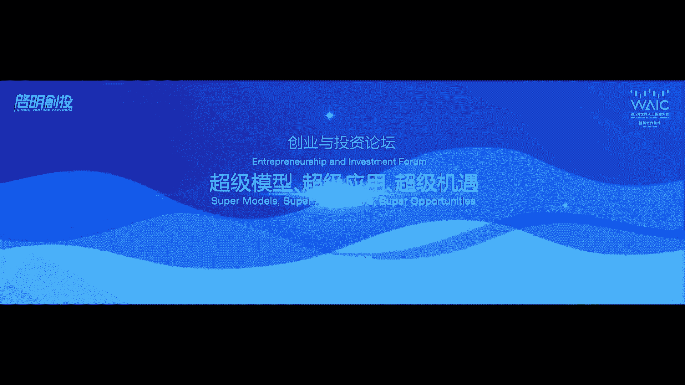

## 课程概述
在本节课中，我们将学习2024世界人工智能大会启明创投创业与投资论坛的核心内容。本次论坛主题为“超级模型、超级应用、超级机遇”，汇聚了众多行业领袖、企业家和学者，共同探讨生成式人工智能（AI）的技术进展、商业应用前景及创业投资生态。我们将对论坛的致辞、主题演讲及圆桌讨论进行梳理，提炼关键观点，帮助初学者理解当前AI领域的发展脉络与未来机遇。

---

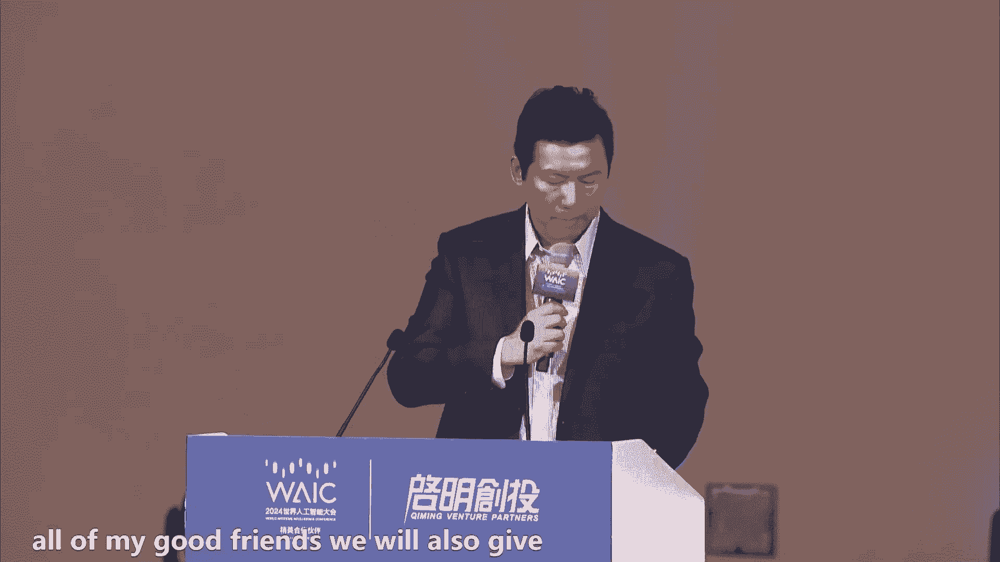

## 一、论坛开幕与领导致辞

论坛在上海开幕，汇聚了来自全国的人工智能创业企业、投资人、合作伙伴及媒体代表。

上海市徐汇区委副书记、代理区长王华先生首先致辞。他代表徐汇区人民政府对论坛召开表示祝贺。本次论坛是世界人工智能大会唯一一场由创业投资机构发起的分论坛，旨在从创投视角探讨生成式AI的时代机遇。启明创投作为国内领先的投资机构，在人工智能和大模型领域布局广泛，投资了多家优秀创新企业，为徐汇的经济发展做出了积极贡献。

徐汇区是上海国际科创中心的重要承载区，科技创新资源丰富。人工智能产业作为上海三大先导产业之一，主要集聚在徐汇区。区内拥有众多国家级、市级高校院所、科研机构及一流研究机构。徐汇区的人工智能产业入选全国首批战略性新兴产业集群，打造了中国首个大模型创新生态社区“模速空间”。目前，徐汇区已集聚170家大模型企业，其中22个大模型通过上线备案，占上海总量的三分之二。在金融服务方面，徐汇区成立了200亿规模的区级国资投资平台和科创投基金，并集聚了大量社会化标杆投资机构，正在打造上海首批股权投资集聚区。徐汇区是人工智能产业发展的沃土和投资的蓝海，欢迎各位嘉宾、投资人、企业家和创业者来到徐汇，共同书写人工智能创新创业的新篇章。

接下来，上海市经济和信息化委员会副主任张洪涛先生致辞。他指出，人工智能正以前所未有的速度和深度改变着各个产业，以大模型、人形机器人为代表的前沿技术正与社会经济广泛融合，成为发展新质生产力的重要引擎。李强总理在大会开幕式上指出，上海在人工智能领域起步早、基础好，企业数量众多，技术创新活跃，并希望上海继续巩固优势，打造人工智能的上海高地。

过去几年，上海人工智能产业规模持续扩大，规上企业和产业规模实现倍增，创新成果不断涌现。已有34款大模型通过备案，产业创新生态日趋完善。上海拥有国际金融中心建设的条件，以及像启明创投这样独具慧眼的创投机构。上海市也设立了总规模达1000亿元的三大先导产业投资母基金，为未来发展创造了新条件。

下一步，上海将着力推进人工智能科技与产业创新融合，支持多模态大模型、智能芯片、具身智能等技术攻关突破，加速人工智能新技术、新业态、新模式在垂直领域的应用，培育开放活跃、有韧性的产业生态。同时，将着力促进产业金融互动，发挥基金的引导作用，鼓励社会资本创新金融产品和服务模式，以更大力度支持关键技术研发和产业创新发展。上海将持续营造国际一流的营商环境和投资环境，深化与国内外人工智能企业、科研院所、投资机构的合作，共享人工智能时代发展的新机遇。

---

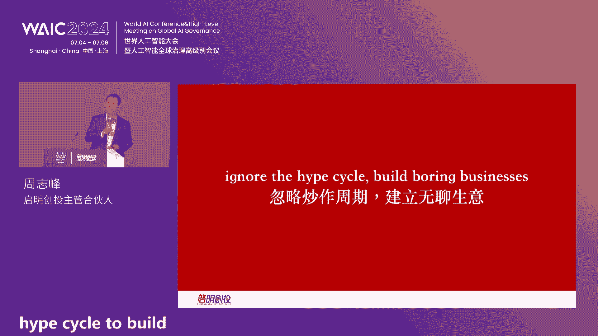

## 二、主题演讲：技术突破到应用变革——AI发展的新篇章

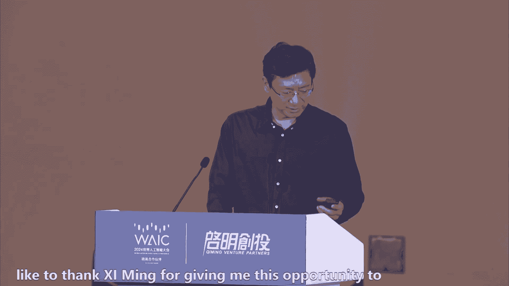

启明创投主管合伙人周志峰先生发表了主题演讲。他分享了启明创投在AI领域的投资观察与策略。

启明创投是中国人工智能领域最活跃的创投机构之一，其特点在于投资早、布局丰富。公司自2006年成立起，就采用专业化团队的投资方法。2012年，团队识别到AlexNet带来的深度学习技术突破信号，从2013年开始系统布局人工智能。2020年，基于OpenAI的GPT-3论文，团队意识到生成式AI的新信号，并于2021年投资了多家大模型企业。

过去十年，启明创投在AI领域投资了近70亿元人民币，拥有五六十家强人工智能投资企业，其中约20家已上市或成为独角兽。通过与这些大模型企业的合作，启明创投能够更清晰地把握技术发展方向和应用落地脉络。

2024年，启明创投管理了一支100亿人民币规模的人工智能产业投资基金，能够接触到中国几乎所有优秀的AI企业。生成式人工智能依然是启明科技投资最重要的核心领域，团队对此信心更足，并增强了团队配置，将其视为一种横向能力进行布局。

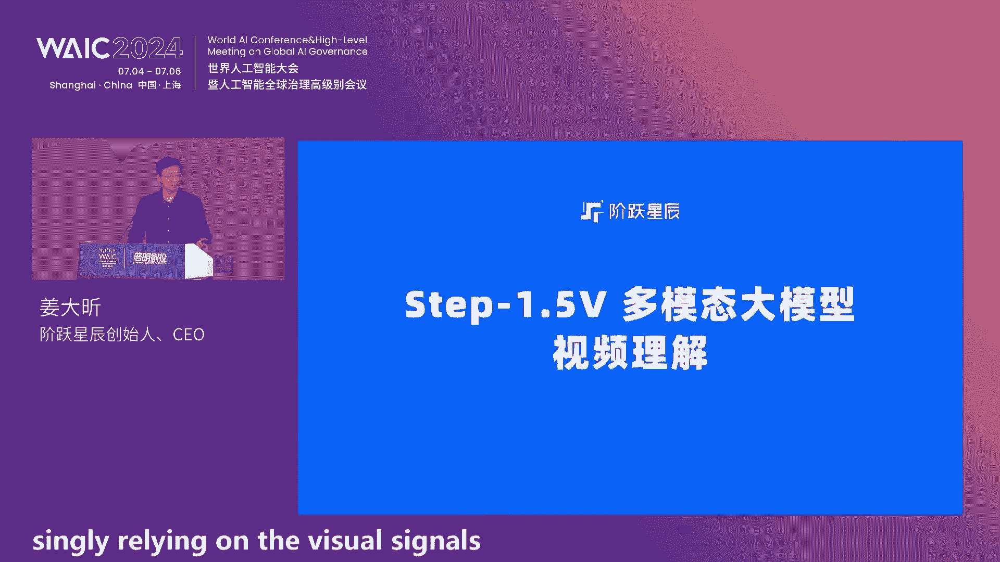

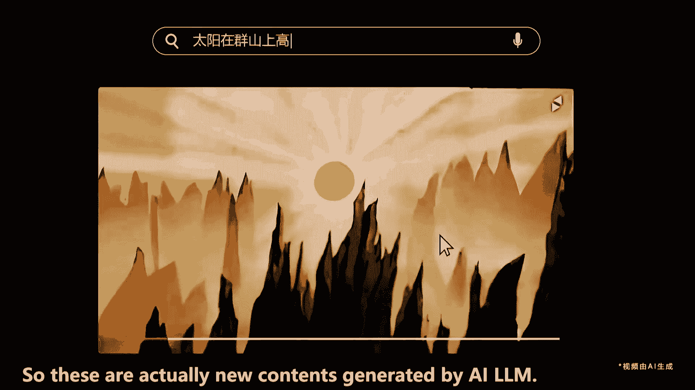

周志峰先生分享了对AI乐观的原因。从资本角度看，2023年全球AI领域投资达224亿美元，超过过去十年总和，其中70%-80%投向了开发大模型的企业。他预计未来两三年，将有更多资金投向模型落地应用的企业。目前，生成式AI应用已在生产力工具、创意和陪伴三个领域初具规模。

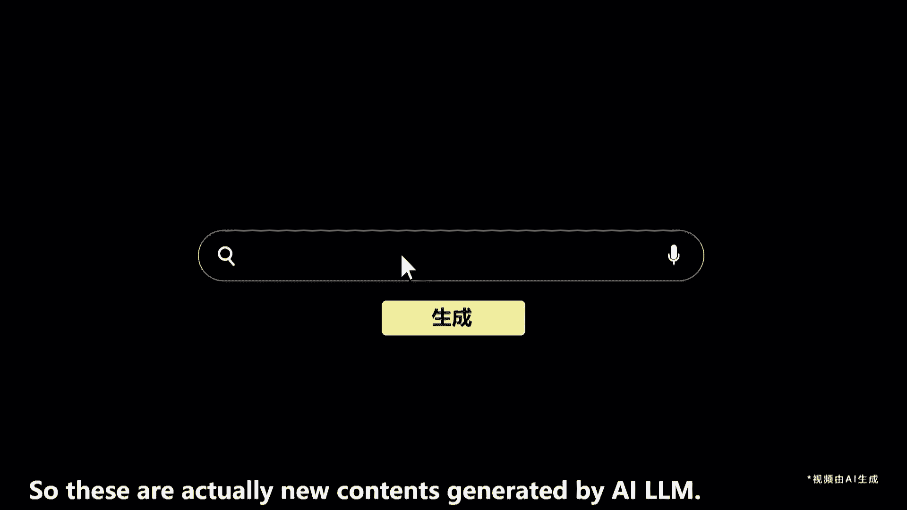

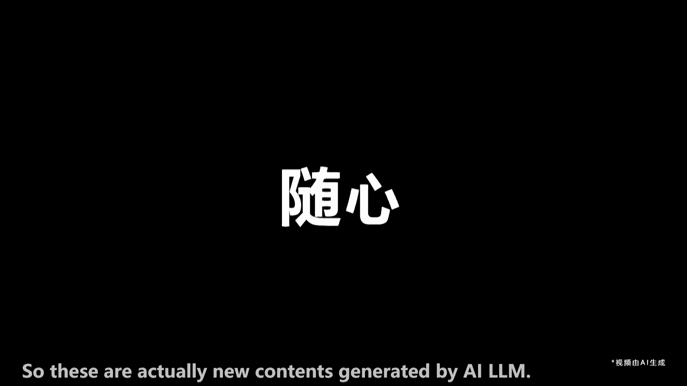

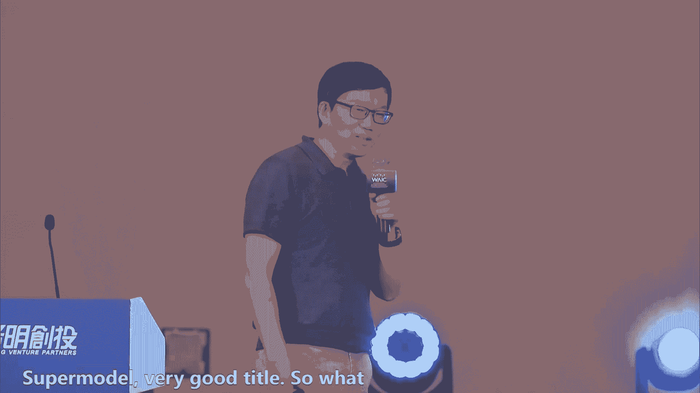

他认为，AI与微处理器、互联网并列，是过去50年科技发展史上最大的三个浪潮，其核心是将数字化内容的创造制作成本降至近乎为零。中国在发展生成式AI方面拥有巨大市场优势，任何重大科技变革都需要巨大的资本投入，而巨大的市场是保证足够投入的前提。中国在打造超级应用方面经验丰富，自2010年以来，中国团队打造了三十多月活超5000万的应用，而美国团队仅打造了7个。

2024年，生成式AI的底层技术底座仍在高速动态发展，技术更加多样化。应用层面也涌现出更多品类。启明创投将重点关注七类生成式AI应用：垂直行业AI、企业AI、AI内容交互平台、AI工具、AI游戏、AI硬件和AI生成社区。

基于对400多家企业的调研统计，周志峰先生指出，过去一年生成式AI创业领域显著扩展：语言类应用占比下降，多模态应用占比上升至48%；出现了基于大模型技术的新应用领域，如AI搜索、AI游戏、AI社交和新的内容平台；更多创业公司深入到具体行业和场景；底层技术创业公司方向更加多元化。

从创始人画像看，主要有三类人群：顶级AI科学家、行业专家及产品运营资深人士、95后甚至00后的新锐创业者。目前，AI科学家创始人占比约三分之一，预计未来两年，第二类和第三类创始人的占比将持续显著上升。

在AI应用落地时，面临三个明显问题：成本、效果和留存。大模型调用成本在过去一年下降了1000多倍，未来仍有巨大下降空间。效果方面，除了“幻觉”问题，还需解决用户提出误导性问题时的回答策略，以及在细分场景中回答的准确性问题。目前第一波AI应用的留存率相对较低，如何让用户真正将AI产品融入生活是接下来应用发展的重要问题。

最后，周志峰先生分享了启明创投对AI发展的十大展望，并强调在AI热潮中需要保持耐心，踏踏实实干事，静待超级应用的出现。

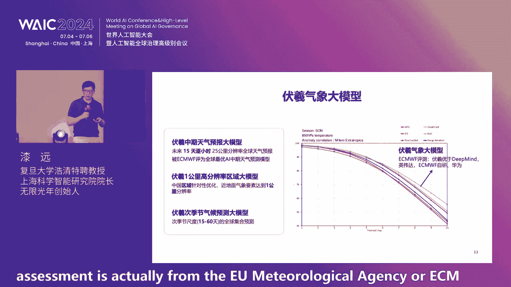

---

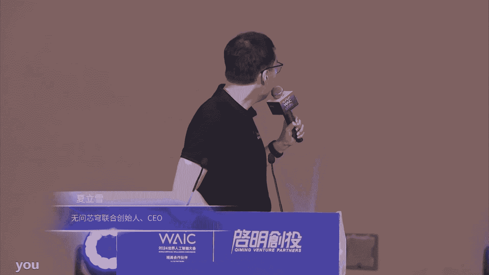

## 三、主题演讲：攀登AGI的路径与实践——万亿参数与多模融合

阶跃星辰创始人兼CEO姜大昕先生分享了公司在通用大模型研发方面的探索与实践。

阶跃星辰成立于2023年4月，定位为研发多模态基础大模型的创业公司，目标是探索实现通用人工智能（AGI）的道路。公司成立一年多来进展迅速，汇集了计算机视觉、自然语言处理、搜索引擎、高性能并行计算等领域的顶尖人才。

公司首次亮相于2024年3月的全球开发者先锋大会，发布了Step系列大模型。在本次世界人工智能大会上，公司发布了万亿参数MOE大模型Step-2的正式版、升级版多模态理解大模型Step-1.5V（支持视频理解）以及多模态生成大模型Step-EX。

姜大昕先生认为，攀登AGI的路径有两个重要方向：**Scaling Law**（模型规模定律）和**世界模型**。Scaling Law指出模型性能随参数量、数据量和计算量呈幂次增长，OpenAI的发展已验证其有效性。从GPT-1到GPT-4，参数量增长超万倍，模型能力实现了本质飞跃。他认为Scaling Law在达到万亿参数后，可能还能再向上走两个数量级，达到百万亿量级。国外科技巨头投入巨资购买算力的行为，也表达了对Scaling Law的信仰。未来发展的限制可能在于数据、能源和投资回报率。

基于此认知，阶跃星辰在训练千亿参数模型Step-1后，于年底启动了万亿参数模型Step-2的训练。从千亿到万亿，训练难度提升不止十倍。团队在算力、系统、数据、算法“铁人四项”上加大投入并创新，最终成功训练出万亿参数混合专家模型。在多个权威评测集上，Step-2模型的得分已全面接近国际主流模型，并在某些测试集上实现超越。该模型仍有继续训练提升的空间。

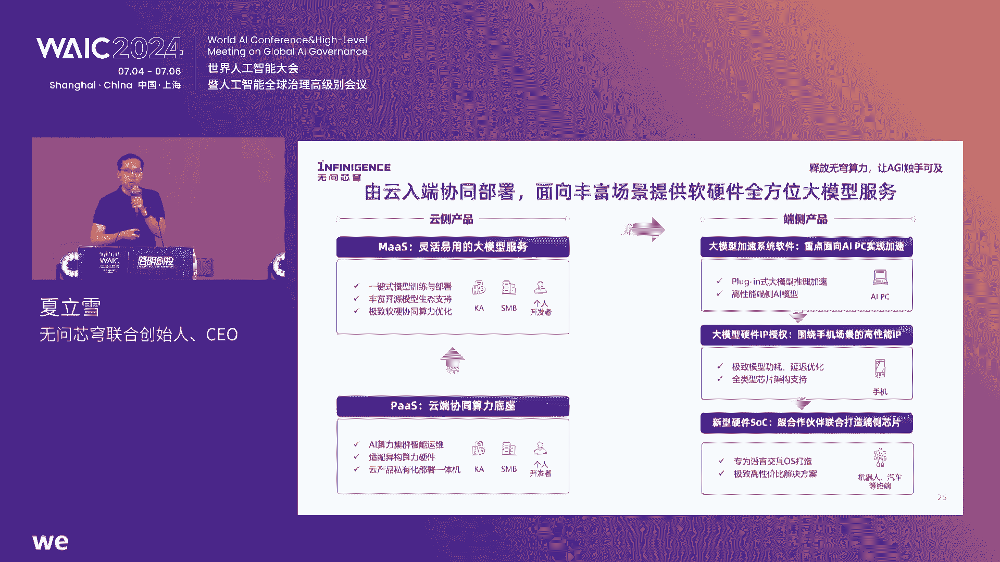

多模态是构建世界模型的基础能力，也是通向AGI的必经之路。世界模型的演化可分为三个阶段：模拟世界（灌输人类数据与知识）、探索世界（与物理世界交互）、归纳世界（总结物理世界规律）。这三个阶段可以并行发展，但进化速度不同，越到后期越困难。目前多模态处于融合阶段，但视觉理解与生成模型仍是分开发展的，理解模型理解能力强但生成能力弱，生成模型则相反。将视觉生成和理解统一在一个模型内，是阶跃星辰下一阶段的重要探索方向。

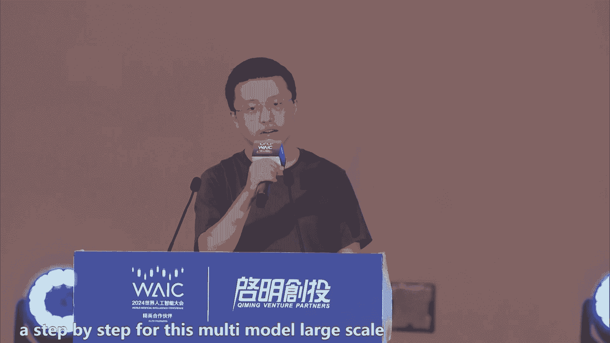

阶跃星辰还展示了两款to C产品：效率工具“阶跃问答”和开放世界类应用“冒泡鸭”。同时，公司也在金融、财经、内容创作等领域与头部企业及政府部门展开深度合作，探索大模型落地经验。

---

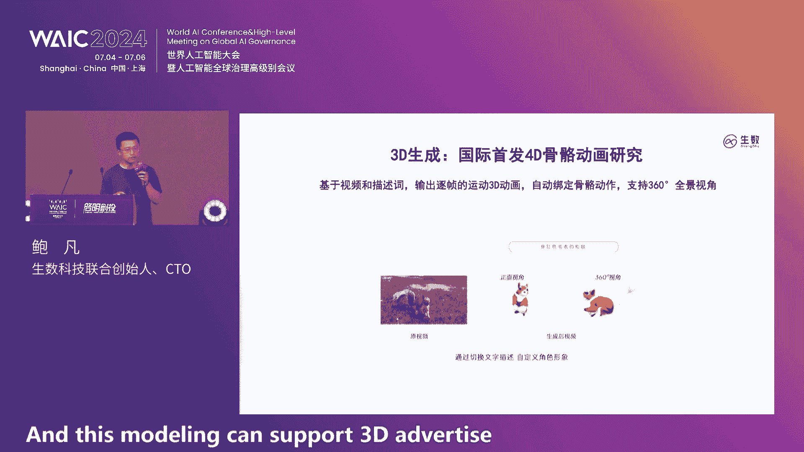

## 四、主题演讲：灰盒可信技术释放大模型生产力

复旦大学浩清特聘教授、上海科学智能研究院院长、无限光年创始人漆远先生分享了在可信大模型方面的思考与实践。

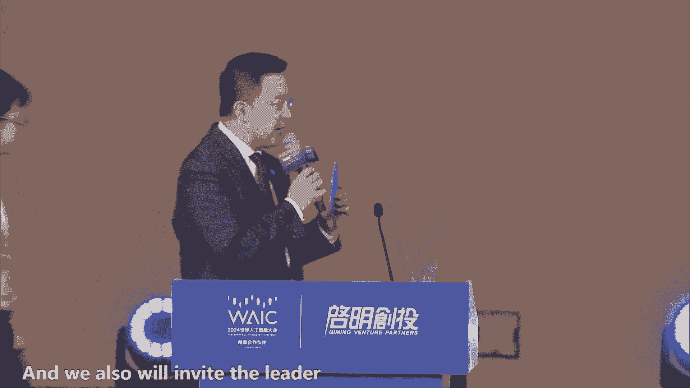

他从技术和市场两个视角展开。技术视角上，他探讨了Scaling Law的红利与挑战。人脑约有百万亿级连接，但通常只有少量神经元被激活，工作方式稀疏。而当前大模型推理时全部激活，导致海量计算和能耗。他提出结合“快思考”（基于海量数据的黑盒模型，类似深度学习）和“慢思考”（逻辑推理，白盒模型）的“灰盒大模型”方向。

语言是交流工具，但未必是思考工具。逻辑推理和思考能力同样重要。将基于海量数据的黑盒神经网络与基于规则的逻辑推理白盒系统结合，形成灰盒大模型，是重要方向。数据决定了模型内部拟合的能力，而规则可以实现数据之外的推演（外插），发现未知规律。规则本身也需要在数据的支持下调整和进化。他认为，AGI在理性巅峰上的体现，是人工智能能像爱因斯坦一样，发现复杂世界的未知规律。

市场视角上，要将大模型作为生产力工具在金融、医疗、制造等领域落地，需解决幻觉问题、成本效能问题和高质量数据获取问题。底层技术必须与业务需求匹配，同时产品要深耕场景，实现技术与市场的结合。

无限光年专注于打造“神经符号”基础模型，即灰盒可信大模型，关心逻辑推理与海量数据处理的结合，以降低幻觉，解决专业性问题。公司打造的“金砖”模型规模并非最大，但在推理和理解能力上表现突出。在金融和医疗领域的权威评测中，其模型在多项指标上超越GPT-4。

公司坚持“模型一体”，深入金融、医疗等场景，打造真正能解决问题的应用。例如，与头部券商合作，利用金融大模型自动生成有观点、有思路的财报分析点评。公司也致力于将平台能力沉淀，赋能千行百业，提供从模型部署、数据工程到应用搭建的全套工具。

作为上海科学智能研究院院长，漆远先生还介绍了在科学智能领域的探索，如“伏羲”气象大模型，在全球气象预测中取得了领先的准确率。公司希望通过深耕场景、灰盒可信的技术，赋能千行百业。

---

## 五、主题演讲：构建AI Native基础设施

无问芯穹联合创始人兼CEO夏立雪先生分享了在AI基础设施层面的工作与思考。

AI大模型时代对基础设施的需求和挑战巨大。回顾AI发展历史，算力与算法互相迭代、互相补足。在大模型时代，支撑下一代模型的算力基础设施仍在构建中，这是超级机遇也是超级挑战。

大模型落地需考虑性价比。市场上有三类核心力量在推动落地：行业解决方案公司（有行业经验但AI能力不足）、行业互联网公司（有稳定业务需结合AI）、大模型公司（挑战模型能力上限）。这三类公司都面临算力成本高、获取难、使用门槛高的问题。

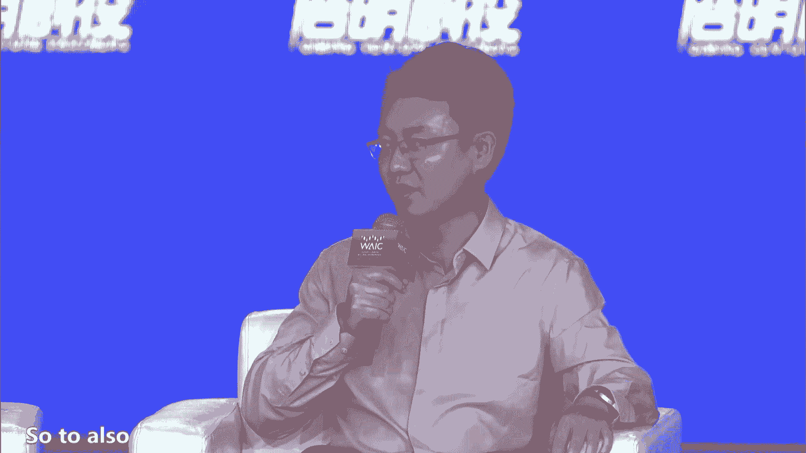

无问芯穹从技术层面将问题拆解为四个关键点：唤醒多元芯片算力、提升效率、提升易用性、调动端侧算力。公司的核心定位是解决M种模型到N种算力之间的连接（MxN），通过中间层连接体系，释放多元芯片潜能，打造高效整合多元异构算力的平台。

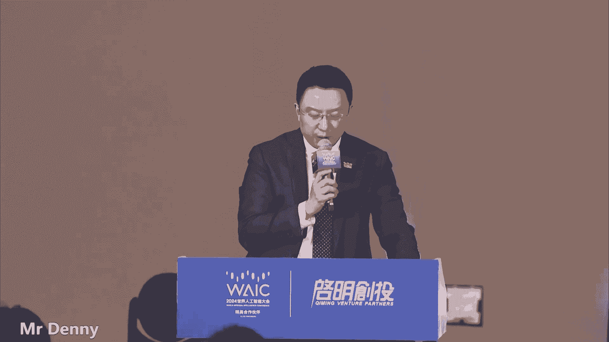

公司联合清华、上交发布了适用于大规模模型的异构分布式混合训练系统，首次实现在6种不同芯片品牌间进行交叉混合训练，千卡集群算力利用率达97.6%。该能力已集成到云平台，支持大模型一键混训。在推理方面，平台支持多种模型与计算卡的组合，用户可像组合套餐一样部署服务。

除了用起来，还需帮助大模型快速落地。公司在计算优化、系统性优化方面做了大量工作，提供全栈优化能力，并在十多种芯片上实现了世界领先的优化水平。在集群调度方面，构建了万卡级算力系统，调度延迟达毫秒级，资源利用率超90%。在端侧，公司也将云上软件开发经验迁移，推出了大模型加速的软硬件IP体系。

总结来说，无问芯穹通过四个层面的优化，持续降低大模型应用落地的成本。基础设施的作用是让成本下降到临界点，使更多人能拥抱新技术，未来使用AI时无需关心背后的算力来源。

---

## 六、主题演讲：U-ViT多模态大模型的变革与未来

生数科技联合创始人兼CTO鲍凡先生分享了公司在多模态大模型，特别是基于U-ViT架构的探索与实践。

生数科技基于U-ViT（一种扩散模型与Transformer的融合架构）构建多模态大模型技术栈。该工作早于OpenAI的DiT，并在2023年初验证了其强大的可扩展性。U-ViT架构简单，可将所有输入（图像、视频、文本条件等）统一为序列，充分利用大语言模型的工程和调参经验。

基于U-ViT架构，公司开发了UniDiffuser多模态扩散模型，能完成图文间所有分布的建模。大规模训练表明，该架构性能不逊于传统卷积架构，且随着参数量和数据量增大，能展现出更好性能，在生成中国元素、理解复杂语义等方面表现优异。

公司将U-ViT架构进一步拓展到3D生成、3D场景编辑等领域，并支持接入游戏等3D管线，方便落地。在视频生成方面，公司发布了Vidu模型，并进一步拓展生成长视频、加入音频能力及4D生成能力。视频生成可配合自然音效，提升体验。公司还能从单个视频中提取4D表示（3D+时间），并对其进行高精度编辑。

生数科技坚持全链路自主研发，从底层算法、训练分布式系统、数据获取到模型部署和工程化，具备完整体系。模型能力覆盖图像、视频、3D及即将投入的语音等模态，并从底层概率建模框架开始自研。

---

## 七、圆桌讨论一：具身智能——从技术突破到产业落地

本场圆桌由启明创投科技团队投资人周孝飞主持，嘉宾包括北京大学助理教授王贺、清华大学助理教授陈建宇、上海交通大学教授卢策吾。

**1. 嘉宾介绍与创业契机**
*   **王贺**：北京大学助理教授，银河通用联合实验室主任。自2017年在斯坦福攻读博士时开始结合计算机视觉、图形学、自然语言和机器人技术研究具身智能。认为当前是将大模型的通用感知决策能力与机器人身体执行能力结合的绝佳机会。
*   **卢策吾**：上海交通大学教授，穹彻智能联合创始人。2016年左右开始探索人工智能与机器人结合。提出“PIE”框架，希望让各种技能在各种产业场景下泛化。于去年创立公司，已推出第一代产品“穹彻具身大脑”。
*   **陈建宇**：清华大学助理教授，心动纪元创始人。早期从事传统机器人研究，后关注强化学习与机器人的结合。2022年因看到特斯拉、小米等入局人形机器人，预判产业将快速聚焦，于是创立公司，专注人形机器人与具身智能。

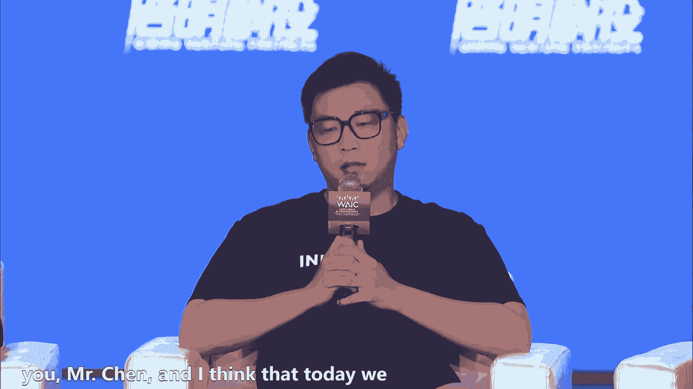

**2. 什么是具身智能的最优身体形态？**
*   **陈建宇**：最优形态取决于应用场景。人形机器人在操作（双手）和移动（双腿）能力上限更高，且类人形态便于通过遥操作或人类数据获取训练数据。
*   **卢策吾**：终局形态由商业结果迭代决定。人形机器人是重要载体，但不同场景可能需要不同形态。关键在于智能内核，公司可服务于各种机械形态。
*   **王贺**：人形机器人目标是通用性，未来可能是通用机器人市场的最大公约数。但从现在到终局需要可行路径，需每一步都有健康商业模式。银河通用采取务实方案：上半身拟人（双臂），下半身采用轮式底盘+单腿结构，以较低成本实现从地面到2.4米高度的全空间操作，未来会拥抱全腿方案。

**3. 技术范式、进步与瓶颈**
*   **王贺**：关注“小脑”技能的泛化与通用性。当前很多操作技能依赖遥操作，数据采集成本高。银河通用发力合成数据，用十亿级合成数据训练抓取技能，实现了对透明、金属、柔性等各类物体的泛化抓取。
*   **卢策吾**：抓住两个要素：对世界的理解（世界模型）和鲁棒的决策。引入力位融合的触觉反馈机制，可大幅提高鲁棒性并降低训练数据需求。公司演示的叠衣服等任务展示了其通用性与鲁棒性。
*   **陈建宇**：大脑与小脑的架构未必是最终形态，值得探索端到端大小脑融合。物理世界的数据应反馈给大语言模型，但目前让物理数据有效反馈至大模型层面仍存在挑战，这是一个有趣的研究方向。

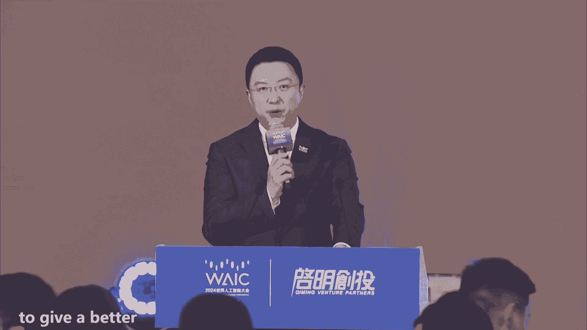

**4. 产业化的拐点与挑战**
*   **陈建宇**：具身智能的“GPT时刻”尚未到来。判断拐点可参考两个标准：一是机器人能否接受所有人公开挑战；二是能否通过机器人的图灵测试（用户无法区分是自主还是遥操作）。
*   **卢策吾**：具身智能的发展是逐步、分批的。无穷任务可分解为有限基本技能的组合。发展模式是一批技能达到“GPT时刻”，商业飞轮就能转起来。他提议明年大会可设置公开挑战环节。
*   **王贺**：机器人需在场景中有胜任力才能落地。银河通用聚焦于移动抓取