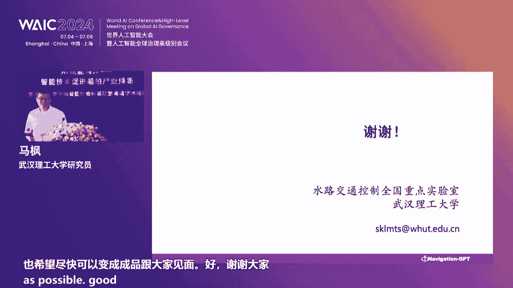
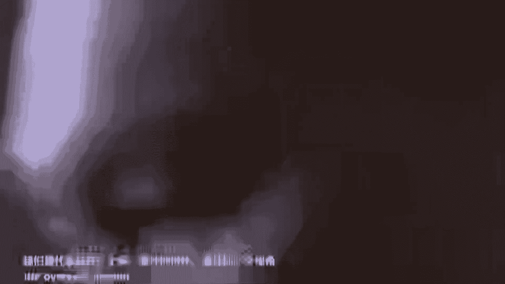
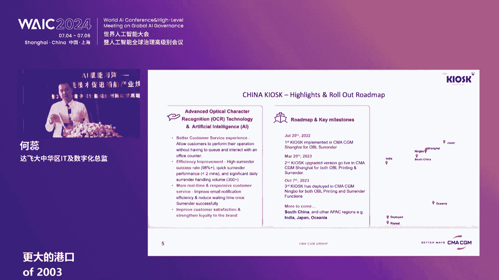

# 51：AI赋能海洋——智能技术促进船舶产业焕新 🚢

在本课程中，我们将学习人工智能技术如何赋能海洋产业，特别是其在推动船舶工业智能化、数字化转型方面的关键作用。课程内容整理自一场高端学术论坛，涵盖了行业现状、技术挑战、创新案例及未来展望。

---

## 论坛开幕与嘉宾介绍 🎤

论坛正式开始。主持人李璐代表上海船舶研究设计院欢迎各位嘉宾莅临“AI赋能海洋——智能技术促进船舶产业焕新暨2024年度中国智能船舶创新联盟高端学术论坛”。该论坛是世界人工智能大会中唯一面向船舶产业的分论坛，已连续举办三年，在业内形成了广泛影响力。

本届论坛以“智能技术促进船舶产业换新”为主题，邀请了来自十多个国家和地区的专家学者与技术实践者，旨在共同探讨人工智能技术创新如何促进船舶产业发展。

以下是莅临本次论坛的主要领导与嘉宾名单：
*   中国工程院院士吴有生
*   葡萄牙工程院院士 Carlo Guedes Soares
*   中国船舶集团科技与信息化部主任赵同斌
*   中国船舶集团科技与信息化专务夏良胜
*   上海市海洋局副局长金宏松
*   浦东新区商务委员会副主任董晓玲
*   中国船级社副总裁赵晏
*   璞跃中国首席执行官徐洁平
*   招商局能源运输股份有限公司总轮机长吴建移
*   上海交通大学党委宣传部部长吴浩
*   中国智能船舶创新联盟专家委员会委员、江南造船集团有限责任公司科技委主任胡可一
*   江苏省船舶工业行业协会主任委员吴仁贵
*   中船动力集团有限公司集团首席专家朝辉
*   北京海兰信数据科技股份有限公司总工程师李常伟
*   上海船舶研究设计院科技委主任、中国船舶集团学科带头人王刚毅
*   中国智能船舶创新联盟成员单位代表、中国船级社上海规范所所长崔玉伟
*   上海船舶设备研究所副所长季建刚
*   大连船舶重工集团有限公司副总工程师关英华
*   上海船舶运输科学研究所有限公司副总裁吴宗岱
*   武汉理工大学教授刘祖源
*   主办单位代表：上海船舶研究设计院院长吕智勇、党委书记王麟、上海张江集团有限公司董事长袁涛

此外，现场还有来自政府机构、国内外企业、行业联盟及媒体的众多代表。

---

## 主办方致辞与论坛主旨 🤝

上一节我们介绍了与会嘉宾，本节中我们来看看论坛主办方代表的致辞，他们阐述了举办本次论坛的背景与核心目标。

### 上海船舶研究设计院院长吕智勇致辞

吕智勇院长首先对各方支持表示感谢。他指出，人工智能是推动经济社会高质量发展的重要引擎，而船舶工业是其创新与落地的最佳场景之一。发展智能船舶，推动行业数字化升级与智能化转型，是实现造船强国目标的重要途径。本次论坛旨在搭建沟通协作的桥梁，探索AI技术创新，促进船舶工业新质生产力发展。

### 上海张江集团有限公司董事长袁涛致辞

袁涛董事长表示，张江集团已连续四年与上海船舶设计院联合主办该论坛。在“向海图强”战略下，智慧海洋与智能船舶是上海落实海洋强国战略的重要抓手。张江科学城正积极开辟海洋产业新赛道，并通过“AI+海洋科创中心”这一创新载体，共同推动海洋创新生态建设。

### 上海市海洋局副局长金宏松致辞

金宏松副局长指出，上海正大力发展海洋经济，人工智能已覆盖海洋装备制造、海上风电、海洋监测等领域。未来，上海将从三方面激发海洋发展活力：营造良好创新生态、培育海洋新质生产力、推动“卡脖子”难题协同攻关，让智能技术成为驱动海洋产业升级的强大引擎。

### 中国船舶集团科技与信息化部主任赵同斌致辞

赵同斌主任强调，人工智能是推动科技和产业发展的关键驱动力。中国船舶集团将以AI赋能产业换新为主线，在智能海洋装备、智能配套、智能生产等领域积极布局，打造船舶领域人工智能生态，为落实海洋强国战略提供新质生产力。

---

## 主旨演讲：智能船舶技术研发与产业化落地 💡

在听取了主办方的宏观展望后，本节我们将深入技术层面，关注智能船舶具体的研发进展与产业化思考。

### 演讲嘉宾：李鑫（上海船舶研究设计院副院长）

李鑫副院长分享了关于智能船舶技术研发及产业化落地的思考。他提出，当前智能船舶主要沿两个技术方向发展：**数字化**（已有大量商业应用）和**自主化**（处于测试与数据积累阶段）。

在研发思考方面，他强调了三点：
1.  **场景与需求至关重要**：AI软硬件系统的落地与客户场景紧密相关，直接影响算法应用与数据训练。
2.  **数据共享与治理是挑战**：数据作为资产，其使用、治理和标准制定是行业面临的新课题。
3.  **服务模式需创新**：船舶行业参与方众多，需探索适应不同需求的服务模式。

对于自主系统，他分析了**感知、决策、控制**三大核心环节的技术难点。产业化落地则需关注**测试验证**（基于海量数据）、**商业模式**（产业链协同）以及**技术标准与数据分享机制**的建立。

### 演讲嘉宾：Carlo Guedes Soares（葡萄牙工程院院士）

Soares院士分享了无人自主水面船舶的研发进展。他提出，航运业正在经历由数字化和人工智能驱动的第四次革命（Shipping 4.0）。智能技术是实现向自主航运过渡的工具。

他详细阐述了智能导航系统的关键功能：**船舶监控与信息系统**、**避碰系统**和**自主导航系统**。人工智能能在信息处理速度和决策质量上提升这些算法的性能。

然而，推动智能船舶发展不仅需要技术，还需要组织措施，如改变操作员角色、增强远程控制潜力等。尽管自主航运在安全、经济等方面存在驱动力，但也面临成本增加、设备故障、网络安全以及需要新的法律框架和岸基监控系统等挑战。国际海事组织（IMO）已定义了四个自主化等级，目前行业正处于第1级和第2级之间。

---

## 行业报告发布与人工智能趋势分析 📈

了解了具体技术挑战后，我们需要把握行业的整体发展脉络。本节将发布最新的智能船舶行业报告，并分析全球人工智能的总体发展趋势。

### 《2024中国智能船舶行业发展报告》发布

报告主创代表顾一清女士介绍了《2024中国智能船舶行业发展报告》。本年报告主要包括两大部分：
1.  **远洋船舶篇更新**：更新了MASS最新进程、智能船舶发展现状、国内外技术对比分析，并增加了大模型技术的关键技术路线图。
2.  **全新内河船舶篇发布**：该篇由武汉理工大学主编，梳理了我国内河智能船舶技术与产业现状，分析了内河与远洋航运场景的差异，提出了面向内河船舶的五个智能化分级（增强驾驶、辅助驾驶、远程驾驶、有条件自主航行、完全自主航行），并梳理了关键技术的发展路径与目标。

### 演讲嘉宾：胡坚波（中国信息通信研究院副院长）

胡坚波副院长分享了全球及中国人工智能的总体发展趋势。他指出，人工智能发展已进入**大模型阶段**，其特点是遵循规模定律、支持多任务、能力可塑性强。发展路径有两条：横向追求更大规模的通用智能，纵向与行业结合实现快速工程化落地。

在中国，政府高度重视AI发展，并提出“人工智能+”行动。中国拥有市场、场景、数据量的优势。大模型在企业侧的应用探索不断深入，但在工业领域仍处于初级阶段，面临场景选择、时效性、可信度及工程化等挑战。

未来，AI将迈向更开放的智能体，与垂直行业的结合是实现工程化、构建商业闭环的关键。这需要模型平台、数据治理、运维管理和风险管控等方面的支撑。

---

## 创新实践：多模态大模型与国内外案例 🚀

理论趋势需要实践验证。本节我们将看到人工智能技术在船舶领域的前沿应用实践，包括多模态大模型的研发以及来自国内外的创新案例。

### 演讲嘉宾：马枫（武汉理工大学智能交通系统研究中心）

马枫教授分享了面向新一代航运系统的多模态大模型研发实践。团队最初研发的“航新脑1.0”采用规则化建模，但韧性不足。之后转向模仿船员思维，利用深度强化学习，并最终研发了多模态大模型 **NavigationGPT**。

该模型的核心价值在于利用**潜空间**实现泛化能力，使其能够处理未见过的场景。目前，该模型已在航道理解、视觉到控制直接链接等方面取得进展，并初步具备模仿船员思考的能力。对于航运企业应用，他建议采用“内核使用、部署开发、个性提示”的分层策略，将大模型作为引擎进行适配。

### 2023年度AI赋能海洋创新实践案例发布

#### 国外案例（由璞跃中国首席执行官徐洁平发布）
以下是五个具有代表性的国外创新案例：
1.  **达飞集团（CMA CGM）**：基于OCR和AI技术的提单自助服务系统。
2.  **Orca AI（以色列）**：利用热成像和低光摄像头，在低能见度下进行目标识别与风险预警的系统。
3.  **MARITIME AI（韩国）**：利用卫星传感和全球数据构建海洋大数据平台，用于天气预测等。
4.  **Dexter（德国）**：端到端的船舶碳排放监测、预测与ETS交易平台。
5.  **Sea Machines（美国）**：专注于自主航行解决方案的公司。

#### 国内案例（由AI+海洋科创中心常务副主任赵辉发布）
以下是五个具有代表性的国内创新案例：
1.  **上海交通大学**：绿色智能校园水上无人物流配送系统，打造校园水陆空协同物流。
2.  **哈尔滨工程大学**：数字孪生智能科研试验船“海豚一号”，装备我国首套船舶数字孪生系统。
3.  **云遥宇航**：计划构建90颗卫星组成的气象星座，为全球航运提供精准气象数据服务。
4.  **南方海洋实验室**：智能型无人系统母船“珠海云”，具备远程遥控和自主航行能力，已完成超千海里自主航行实验。
5.  **中国船级社与项目方**：高智能自主伴航拖轮“青港拖36”，全球首艘具备自主伴航功能的智能化拖轮，旨在解决大型船舶靠离泊时的安全与效率痛点。

---

## 院士访谈：深度洞察与未来展望 🧠

在了解了大量技术案例后，我们更需要顶尖专家的深度洞察。本节通过院士访谈，探讨智能船舶发展的核心挑战、跨界融合及人才培养等战略问题。

主持人李鑫与两位院士展开了对话。

*   **关于智能技术试验船**：吴有生院士介绍了正在建造的智能技术试验船。该船旨在作为海上实验室，解决智能航行软件考核、全船设备智能控制可靠性验证等关键问题，为全国智能船舶技术研发提供公共测试平台。
*   **关于自主航行的主要挑战**：Carlo Guedes Soares院士认为，当前主要挑战不在导航技术本身，而在法律框架、故障应对机制、远程通信可靠性以及岸基支持系统等非技术层面。
*   **关于AI落地场景与产业变革**：吴有生院士指出，AI将在研究、设计、制造、运行四个层面带动船舶产业发展。他举例说明了AI在螺旋桨优化设计中的应用，并强调需重点关注**智能制造**和**配套设备智能化**。
*   **关于与汽车行业的差异**：Soares院士指出，船舶控制更复杂（惯性大）、定位精度要求不同、故障后果更严重，因此实现自主航行比汽车面临更大挑战。
*   **关于跨界融合**：吴有生院士强调，船舶行业需与信息技术、电子技术等领域优势力量结合，尤其在智能制造和航行智能优化方面。
*   **关于人才培养**：Soares院士认为，在高级教育中应引入AI相关课程和实践，让学生具备开发应用的能力；对于操作员，重点在于使其熟悉最终产品。

---

## 圆桌对话：聚焦船舶网络安全 🔒

随着船舶智能化，网络安全成为重中之重。本节围绕刚刚强制实施的国际船舶网络安全规范，邀请全球主要船级社专家进行圆桌讨论。

主持人顾玉清与五位船级社专家探讨了船舶网络安全的实施与挑战。

*   **与陆地行业的差异**：DNV的宋炜仲认为，主要是实施时间线的不同，船舶业正逐步跟上网络安全管理的步伐。
*   **为何需要规范**：CCS的蔡玉良指出，船舶智能化与系统互联互通带来了固有的网络安全风险，IMO规范旨在建立通用的最低网络安全韧性要求。
*   **基于目标的方法**：BV的Polo Shao解释，规范采用基于目标的方法，允许根据不同船型、项目和管理体系来实施，更具灵活性。
*   **对各相关方的挑战**：LR的李林分析了船东（需建立管理体系）、船厂/集成商（设备准备与成本评估）、船级社（人员培训）及设备商面临的挑战，并指出船舶长生命周期与网络技术快速迭代的矛盾。
*   **关键保护措施建议**：NK的Shingo Kumai详细阐述了规范中七个方面保障措施的实施要点，并特别建议采用**白名单机制**和部署**网络监控与入侵检测系统**以增强防护。

---

## 论坛总结与实验室揭牌 🎉

在论坛的最后，进行了两项重要活动。

首先，为应对船舶数字化带来的网络安全新挑战，**上海船舶研究设计院**与**船舶信息研究中心**联合建设的 **“海洋装备数字安全实验室”** 正式揭牌。该实验室将致力于船舶网络韧性安全、数据治理与安全等创新技术研究。

随后，主持人宣布本届论坛圆满结束。智能技术的融入正引领船海产业进入全新时代，随着技术进步与应用深化，产业将迎来更广阔的发展空间。

---

## 课程总结 📚

在本节课中，我们一起学习了人工智能赋能海洋船舶产业的全面图景。我们从论坛的宏观背景出发，深入探讨了智能船舶的技术研发难点、产业化落地思考，分析了行业发展趋势与创新实践案例，并聆听了院士对发展路径的深刻洞察。最后，我们聚焦于伴随智能化而来的关键挑战——船舶网络安全。通过本课程，我们可以看到，AI技术正从研发、设计、制造、运营等多维度驱动船舶产业进行深刻变革，而应对技术、标准、安全、人才等方面的挑战，需要产学研用全产业链的协同努力。