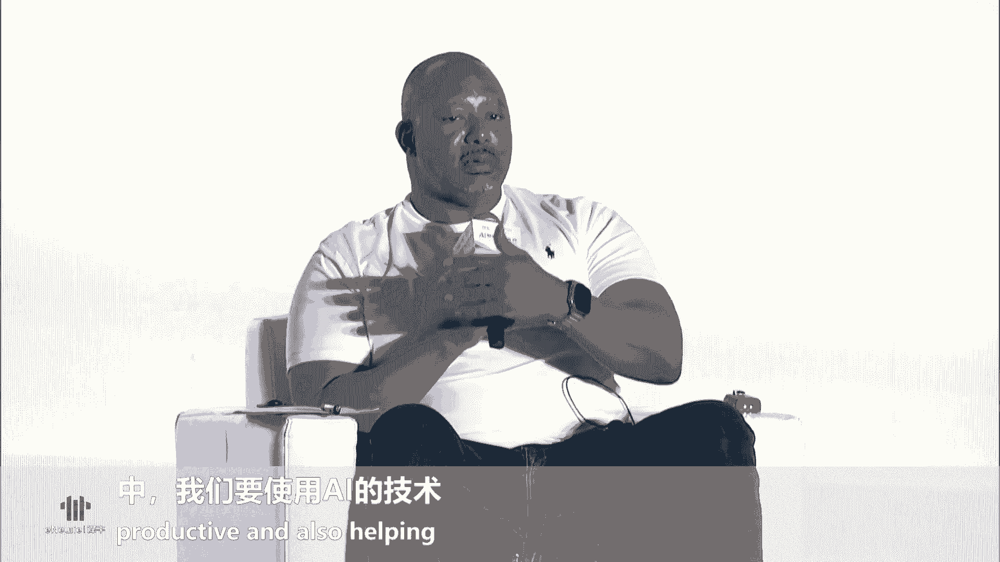
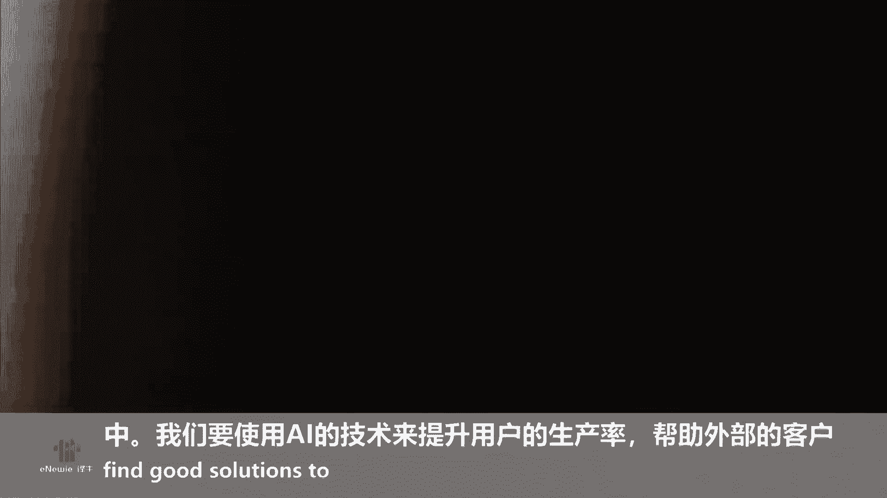
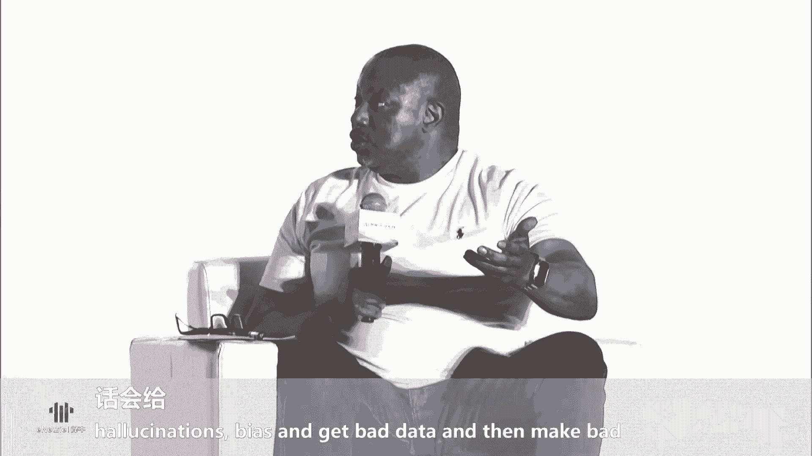
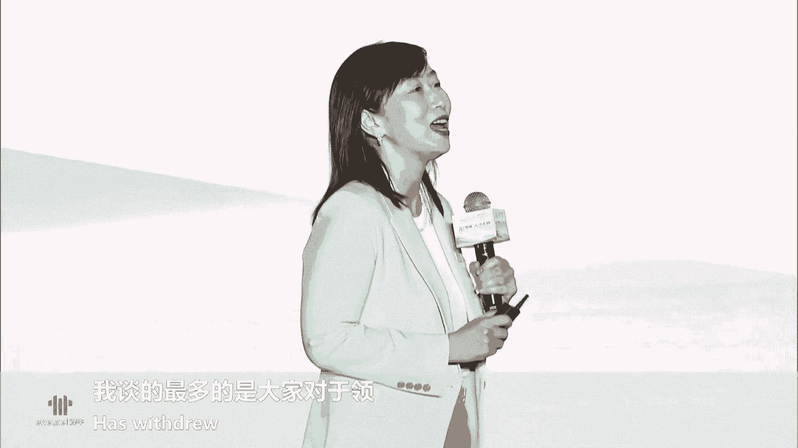

# 52：AI时代的人才培养与产业发展 🚀

## 课程概述
在本节课中，我们将学习人工智能时代下，人才培养、政策支持、教育变革以及产业投资等多个维度的核心议题。课程内容整理自一场高端论坛，涵盖了政府政策、顶尖学府实践、企业人才战略及产业创新案例，旨在为初学者提供一个全面、清晰的AI人才发展全景图。

---

## 第一节：政策引领与人才集聚 🌉

上一节我们介绍了课程的整体框架，本节中我们来看看政府层面如何通过政策引导，为人工智能产业汇聚顶尖人才。

上海市将发展人工智能作为战略选择，产业规模从2018年的1340亿元增长至超3800亿元。目前已有34款大模型通过备案，并在多个垂直领域产生应用。人工智能产业要实现跨越发展，人才是关键。上海人工智能领域产业人才总数达25.7万人，约占全国三分之一，其中35岁以下青年人才占比超过67.5%，已形成国际化、年轻化、专业化的多层次人才队伍。

上海构建了梯度化的人才体系，涵盖顶尖科学家、产业领军人才、卓越工程师和高技能人才。同时，搭建了高水平人才交流平台，如人工智能全球研发中国中心和交叉学科协同创新中心。

浦东新区作为全国首个人工智能创新应用先导区，推出了“明珠系列”政策大力引才。
以下是其主要举措：
*   **明珠计划**：对人工智能等领域的高峰人才及团队，给予最高700万元的个人及团队资助，以及最高1亿元的项目补贴。
*   **人才认定新机制**：探索了四种创新的人才认定通道，包括赋予重点企业自主认定权、实行团队核心成员直接认定等。
*   **种子基金支持**：推出浦东明珠人才种子基金，单个项目最高可获500万元投资，并形成全生命周期投资体系。

此外，浦东还实施“全球引才伙伴计划”，并对接国家综合改革试点，在外籍人才签证、永久居留等方面提供便利。

---

## 第二节：顶尖学府的育人变革 🎓

上一节我们了解了宏观的人才政策，本节中我们聚焦微观层面，看看顶尖教育机构如何应对AI时代，改革人才培养模式。

华东师范大学校长钱旭红院士指出，在AI时代，如果只进行知识点的学习，人类将败给人工智能。因此，教育的重点应从知识传授转向思维训练。在基础教育阶段应注重形象思维和逻辑思维的培养；在大学阶段则应强化批判性思维和创造性思维。人工智能为学生提供了一个可以随时挑战和深入追问的“伙伴”，无形中锻炼了批判性思维能力。同时，AI是一个超学科的产物，能够激发跨学科的创造力。

上海纽约大学校长童世俊介绍了该校的实践。学校将算法思维等六种核心素养作为课程基础，所有学生在前两年都需学习文理相通的课程，为后续专业学习打下扎实的人文基础。学校鼓励本科生参与科研，并因师生比例高，学生更容易获得教授的指导。

在实践平台方面，上海纽约大学从一年级起就通过职业发展中心引入资源，并依靠校友网络，为学生提供丰富的社会实践机会。同时，将实践环节深度嵌入课程，特别是在计算机与数据科学领域，让学生在学习过程中就亲身参与项目和科研。

---

## 第三节：产业视角的人才定义与投资逻辑 💼

上一节我们探讨了教育领域的变革，本节中我们转向产业界，看看企业和投资者如何定义和评估AI时代的人才。

金沙江创业投资基金主管合伙人朱啸虎认为，当前AI在事务性工作上取代人工的速度很快，例如在客服和销售领域。未来，人的工作需要更具主观能动性和创造性，特别是在多步推理和规划方面，AI目前仍难以取代人类。对于创业者，他更看重其商业化落地能力，而非单纯追求酷炫的技术。能够真正理解商业场景、将产品做到极致以满足商业要求的人才非常稀缺。

金宇智能科技创始人方晓雷从企业用人角度指出，AI时代，所有部门的员工都需要学会使用AI工具提升效率，抗拒者可能会被淘汰。在初创公司组建团队时，技术只是实现商业目标的手段，一个合理的初创团队需要同时具备创新（定义产品）、技术（实现产品）和商业化（探索路径）能力的人才影子。企业不同发展阶段需要不同类型的人才。

亚马逊云科技（AWS）的Daryl Hammett分享了大型科技公司的人才培养框架。AWS致力于提供免费课程，计划培训200万人掌握AI技能。他强调，AI发展需要多种角色，并非人人都必须是科学家或数据工程师。企业需要在专家和通才之间找到平衡，并根据发展阶段和用例不断调整人才结构。建立一个包含技术、产品、市场、投资人的生态社区对于人才成长和创新至关重要。

---

## 第四节：企业实践与全球化人才战略 🌐

上一节我们讨论了人才的投资与定义，本节中我们关注企业具体如何利用AI工具进行人才管理，并实施全球化战略。

领英中国区总经理王倩指出，当前存在一个“AI应用鸿沟”：约75%的职场人已开始自发使用AI工具提升工作效率，但仅有约25%-38%的企业为员工提供了相应的AI工具。AI正在与所有岗位结合，不仅仅是技术岗位。到2035年，AI预计将改变70%的工作内容。

领英通过其平台和解决方案，从人才的“选、用、育、留”全流程助力企业。
以下是其核心策略：
*   **人才吸引（选）**：推出AI赋能的招聘工具LinkedIn Recruiter，帮助企业在全球市场更智能、高效地搜寻人才。
*   **人才培育（育）**：提供超过600门免费的AI相关课程，涵盖从数字营销到Python编程等各领域，并持续更新。领英认为，未来最不易被AI取代的是具备跨界能力的“合成性人才”。

王倩强调，领英没有退出中国，而是更加聚焦于服务全球化发展的中国企业，帮助其连接全球人才、提升品牌和赋能员工学习。

---

## 第五节：AI与机器人在垂直领域的创新应用 🤖

上一节我们了解了企业的人才管理战略，本节中我们通过一个具体案例，看AI和机器人技术如何在医疗这一高要求领域创造价值，并解决人才供给问题。

泰米机器人创始人潘晶指出，中国每百万人的医生和护士数量远低于美国，医疗供给侧面临巨大挑战。他认为，AI和机器人是未来十年内唯一可能显著增加医疗供给能力的技术手段。

泰米机器人将AI和机器人技术深度融入医院具体场景，带来了四重改变：
1.  **业务无人化**：用机器人替代部分重复性劳动。
2.  **工作全天化**：机器人可24小时工作，缓解日间运营压力（如电梯拥堵）。
3.  **管理精细化**：通过AI实现流程的自动合规检测。例如，利用视觉算法监督外科洗手步骤的规范性。
4.  **运营数字化**：在边缘端部署算力，对手术过程进行实时分析并生成数字孪生模型，既保护隐私又实现安全监管。

潘晶分享了其“专家个人大模型”的创新思路：将名老中医的诊疗经验和理论用于训练专属大模型，生成的内容易于被专家本人评价和修正，从而打造个性化的“数字医生”，赋能基层医疗。他总结道，当下的创新更像“冲浪”，需要企业具备在不确定的技术浪潮中捕捉和把握机会的能力。

---

## 课程总结
本节课中，我们一起学习了AI时代下人才发展的多维图景。我们从上海及浦东新区的前瞻性人才政策入手，看到了政府打造人才高地的决心；通过华东师大和上海纽大的案例，了解了教育体系正从知识灌输转向思维培养和跨界融合；从投资人和创业者的视角，认识到商业化落地能力和团队综合素养的重要性；通过领英的实践，看到了企业利用AI工具进行全球化人才管理的策略；最后，通过泰米机器人在医疗领域的深耕，见证了AI与机器人技术如何解决垂直行业的核心痛点并创造实际价值。这些内容共同揭示了一个核心：在AI时代，人才是发展的根本，而培养、吸引和用好人才需要政策、教育、产业和资本的协同努力。