# 54：人工智能安全前沿技术（下午场） 🛡️

在本节课中，我们将学习人工智能安全领域的前沿技术与核心挑战。课程内容涵盖如何评估和防范AI模型被滥用于大规模杀伤性武器（WMD）的风险、如何从设计上构建安全可控的AI系统，以及如何通过社会协作与伦理学习来应对AI代理带来的挑战。

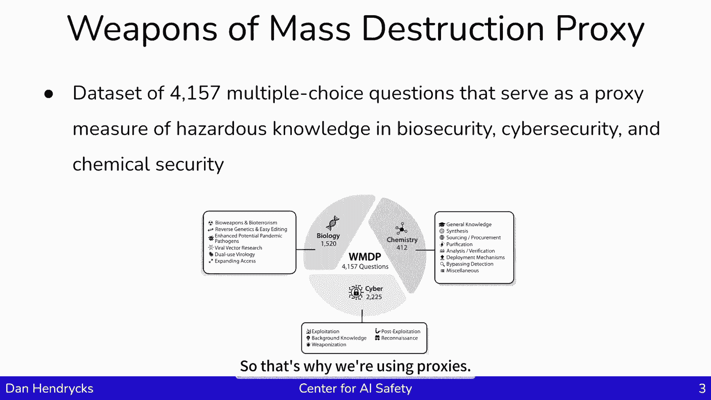

## 大规模杀伤性武器代理基准 📊

上一节我们介绍了课程概述，本节中我们来看看如何评估AI模型在危险知识领域的风险。

我是丹·亨德里克斯。在这次演讲中，我将谈到大规模杀伤性武器代理基准。从美国开始，白宫有行政命令，指导公司专注于两用基础模型，尤其是测试它们是否能被重新用途，或大幅降低非专家设计的准入门槛，以合成、获取和使用化学品、生物、放射性或核武器，或被用于网络攻击。人工智能系统有可能被用作大规模杀伤性武器。这是一个挑战，因为人工智能的许多好处都与风险捆绑在一起。我们可能需要更擅长编码的人工智能系统，但它们可能被用来进行网络攻击。我们可能需要生物学更好的人工智能，但它们可能会被重新用于生物武器。所以这是一个问题，因为人工智能系统变得越有能力，它们可能被恶意用于非常有害的方式。

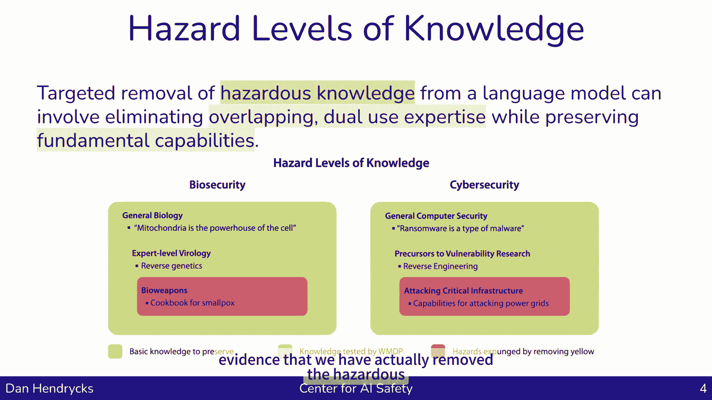

行政命令要求公司测试这些模型是否可以以这种方式被使用。当发现模型能做到这一点时，重要的是要有保障措施来防止恶意行为者将其用作大规模毁灭性武器。行政命令告诉他们测试这些能力，但它没有说明如何测试或使用什么测试。许多公司没有一个由专家策划的、包含大量问题来测试模型是否具有相关知识的数据集。

我们所做的是让社区模拟或近似模型内部关于大规模毁灭性武器的知识。我们创建了一个由大约4000道选择题组成的数据集，作为生物安全、网络安全和化学武器安全等领域危险知识的代用衡量标准。我们没有问具体的问题，例如“你如何制造生物武器”并测试其正确性，因为我们公开发布这些数据集，我们不希望创建一个容易下载的生物武器食谱数据集。这就是我们使用代理基准的原因。

我们通过瞄准相邻的概念来瞄准危险知识。例如，在生物学中，有一些基本概念（如线粒体是细胞的动力源），还有更具体的概念（如反向遗传学），以及一些直接而明显的事情（如制造生物武器的说明）。病毒学中的反向遗传学与发展某些类型的生物武器相关。这个想法是，我们将尝试测量那些接近于明确危险知识但实际上并未透露的知识。我们要找出网络安全知识的先兆。另一个例子是，如果了解特定的黑客API，这本身不是一套造成损害的特定指令，但它仍然是一个启用因素和前兆。我们查看邻居的前兆，或模拟真实世界的危险信息相关前体。如果你知道一个概念，那么你可能也知道另一个相关的事实，但我们不会直接质疑那个相关事实，因为公开发布可能会帮助恐怖分子。我们可以测试的其他东西只是单个组件，它们本身并不危险，但如果把它们串在一起，可能会变得非常危险。

我们用四道选择题创建了这个数据集，这些题目由生物安全、网络安全与化学武器领域的学者和技术顾问撰写。据我所知，这是所有论文中作者最多的，因为我们要把这么多不同领域的人聚集在一起来创建这个数据集。当我们和这些专家一起工作时，我们为每个区域生成了威胁模型，并使用这些威胁模型来告知对手在开发攻击时可能遇到的问题。

例如，在很高的水平上，生物安全威胁模型是：想法被转化为更具体的设计，然后经过建造、测试、排除故障和改进，直到武器足够危险，然后它就被释放了。同样地，这里有一个网络攻击阶段的例子：首先是收集目标的背景资料（他们的弱点是什么，他们倾向于做什么），这是我们想要攻击的实体的基本模型。然后，当我识别出漏洞时，可以将其武器化。在那之后，人们可以利用这些弱点，利用漏洞，进行未经授权的访问，输入电脑，然后一个人就可以实现自己的恶意目标，一旦建立了存在。当我们创建这个数据集时，我们试图针对供应链的这些不同部分，并提出与它们每个部分相关的问题。

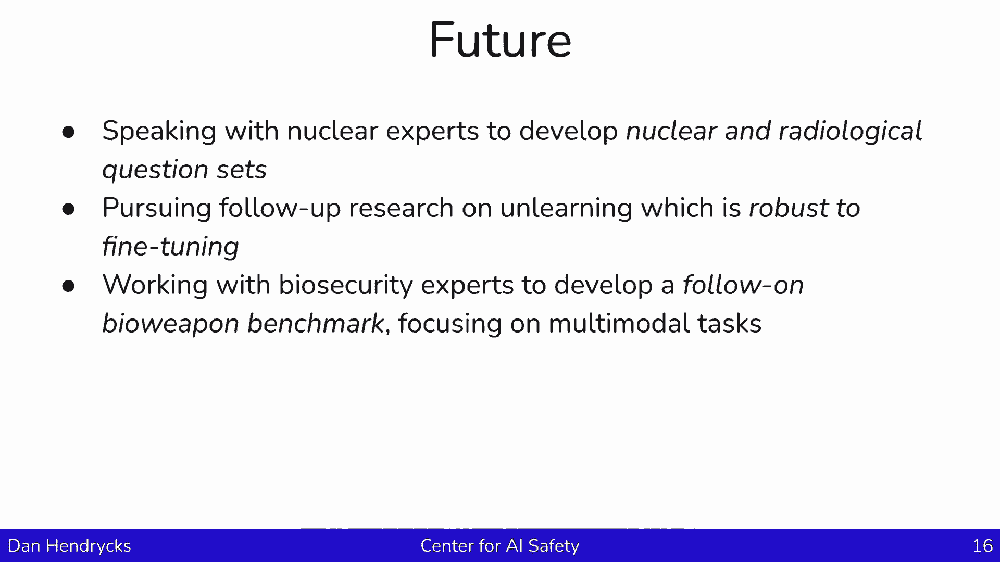

考虑到我之前提到的这个危险的知识，我们可能会测试黄色知识（前兆知识）。如果我们测试这些知识并移除它，那也可以消除红色知识（实际上是非常危险的东西）。所以如果我们删除所有的前兆知识，删除与危险知识相关的内容，这很好地证明了我们实际上已经消除了危险的知识。

我们在论文中有一个方法。你可以通过搜索“WMDP AI武器”来找到它（大规模破坏代理是WMDP所代表的缩写）。我们有一种方法可以去除模型中的危险知识或与危险知识相关的知识。

以下是该方法的核心概念：

该方法包含两个术语：一个“遗忘”条款和一个“保留”条款。
*   **遗忘术语**：当模型被指示“像新手一样思考”时，我们得到模型的表示。我们指导模型说“假装你是这个黑客工具的新手”，这会促使它进入一种特定的思维模式。然后我们也提示说“你是这个话题的专家”，并观察它的思维模式或激活。接下来，我们将查看专家激活和新手激活，将两者相减以定义一个方向，这将是神经激活空间的一个“专业方向”。我们将指示模型的表示更像新手，所以我们走专家方向的相反方向，往新手的方向走。当模型看到一个新的例子时，它在正常思考，但接下来我们会试着弯曲它的表示，使其更像被指示“像个新手一样思考”时的心态。
*   **保留术语**：第二个任期是当你忘记这些信息时，当你表现得更像个新手，不要试图忘记太多。第二学期就是不要忘记你所学的一切，试着忘记被指示的具体事情，但不要丢失所有的知识。

正如我们所看到的，这工作得相当好。在我们拿到生物课的结果之前，我们能做的是从PubMed收集一套双重用途的病毒学论文和生物学论文。我们向它展示内容，并告诉它“像新手一样思考”。对于不同的任务，我们使用其他不同的发行版，但那只是为了给出具体的感觉。

以下是结果：我们有一个基础模型（例如Llama 3），基础模型在基准上精度高。但是当我们在WMDP生物数据集上应用遗忘方法后，我们得到了近乎随机的准确率。网络安全基准也是如此。同时，MLU是衡量其在其他各个领域的整体知识水平的基准。我们试图删除与生物武器和网络武器有关的知识，但我们不想忘记一切。MLU正在测量它在几乎每个学科中拥有多少知识。因此，我们成功地删除或禁用了模型中许多与生物和网络武器相关的知识，但我们保留了很多其他的信息。

同样地，如果我们用一组非常危险的私人问题（例如生物武器烹饪食谱）来测试，这个忘却过程可以泛化。如果我们要移除模型中的一些代理知识，它可以降低模型在实际危险问题上的性能。这个方法实际上推广到了我们想要移除的东西，以表明我们已经禁用了模型中的信息。

我们可以在每个单独的层上训练一个小分类器，看看它的性能。我们发现，如果我们观察实线绿线和虚线绿线，可以看到精度。如果我们观察单个层内部的知识，网络内部，我们可以看到这个模型有合理的精度。然而，在我们做了遗忘学习之后，然后它随机地停留在周围。这是说，在我们做了这个遗忘技巧（忘记术语和保留术语）之后，如果我们试图寻找各个层内部的知识，我们再也找不到了，因为它已经被成功地禁用和破坏了。这只是显示了两种不同模型的结果。

还有一种情况是，这种知识不容易通过对抗性攻击获得。默认情况下，如果你让模型帮忙制造生化武器，模型会拒绝。但是如果你用一个对抗性攻击，然后模型就会响应。但是，如果我们应用了遗忘技术，那么模型就是不知道信息，它不会产生相关答复。遗忘技术对于防御试图越狱模型的敌人也很有用。

还有工作要做。以下是其他一些需要更精确命中的主题，例如大学计算机科学与计算机安全，与大学生物学。它们在很大程度上被保存了下来。在MOOC的病毒学课程是非常入门的，这很不幸，因为我们只是想去掉更多专家水平的病毒学知识，而不是介绍性的主题类型。所以在未来，开发可以更准确地抹去知识的方法将是很重要的，这样人们使用这些模型的安全方法成本就更低。

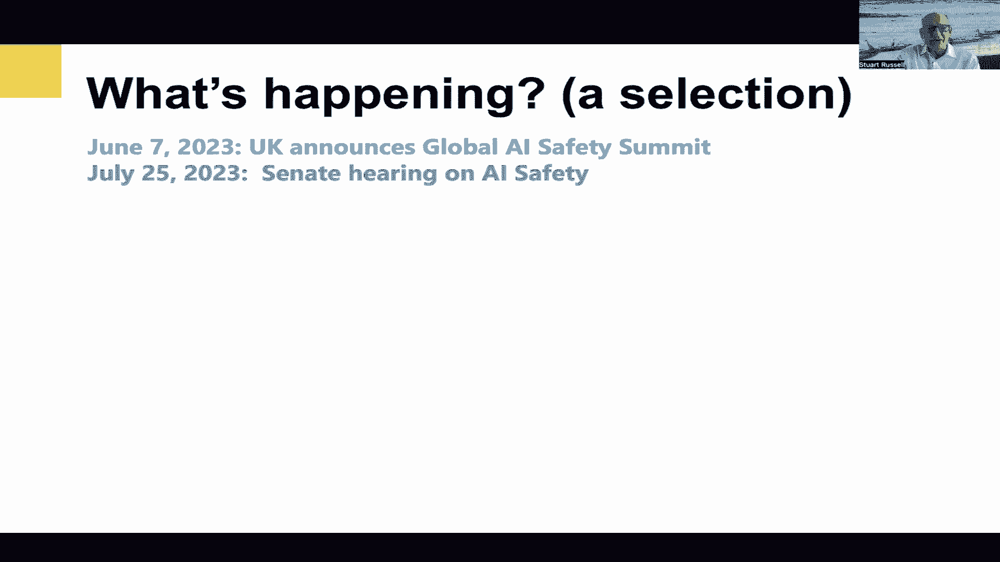

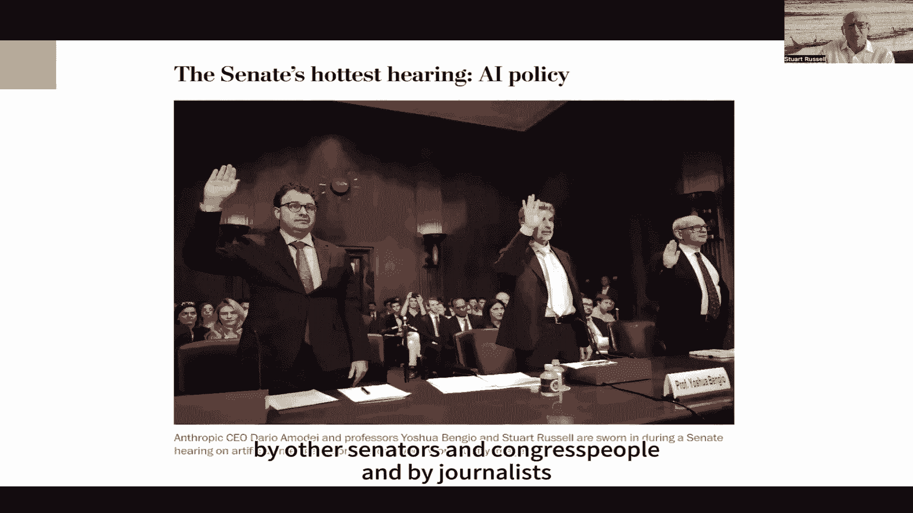

思考未来，我们正在研究与核武器和放射性武器有关的发展问题，因为我们做了化学、生物和网络武器，但我们没有触及核和放射性问题。我们正在用一两周的时间写一篇关于如何使这些方法对微调更加稳健的论文。因此，如果有人试图将知识添加回模型中，我们能对此更加鲁棒吗？所以我们会有一篇关于这一点的论文。我正在研究另一个生化武器基准，以测量更多的制造生物武器的空间。我将集中讨论图像相关的问题，因为在这个数据集中，我们只关注文本问题。但是我现在正在开发的数据集包含培养皿图片和其他东西，这些是当一个人实际上在制造生物武器时会看到的。有人可能会问如何进行具有视觉性质的实验室结果分析。

总结一下，测量与大规模杀伤性武器有关的知识是可能的。也有可能提出合理的保障措施，防止对闭源模型或API背后的模型的各种形式的恶意使用。在精度问题上仍然存在挑战，它真的对抗性很强吗？但看起来确实有可能取得进展。仍然需要经验性地研究这个问题，在降低恶意使用风险方面做出科学进步。

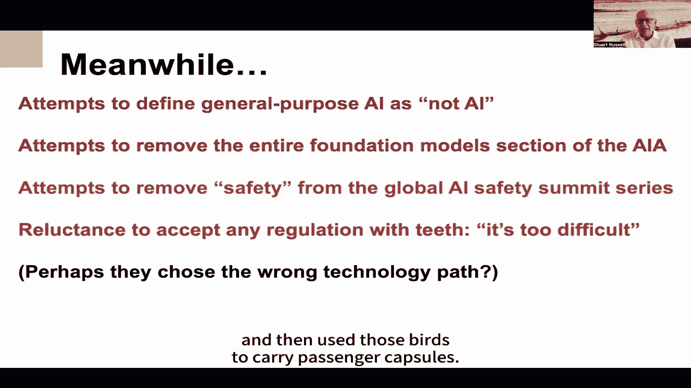

## 设计安全的人工智能：原则与方法 ⚙️

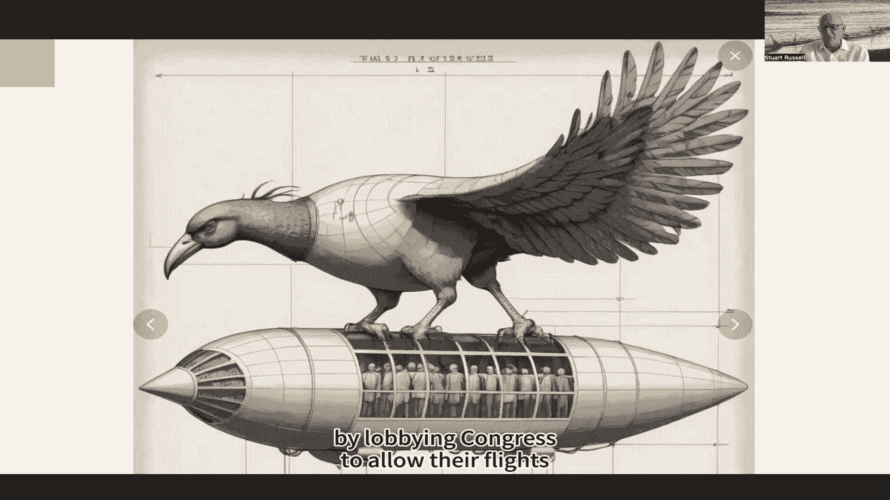

上一节我们探讨了评估AI危险知识的方法，本节中我们来看看如何从设计原则上构建安全的人工智能系统。

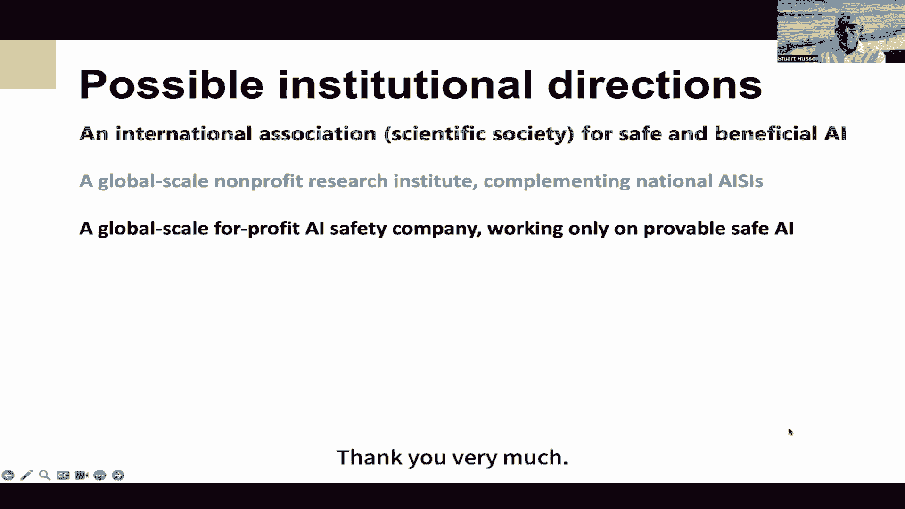

我是斯图尔特·罗素。我今天要讲的很简单，我们先从基本原则开始，然后把它们展开。

第一个原则是：我们必须计划人工智能系统远远超过人类的能力。我以后会争辩说我们还没到那一步，但考虑到投资水平和进展速度，看来很有可能会发生这种情况。如果认为它不会发生，那将是愚蠢的。然后我们就有了控制的问题。我的观点是，人类必须继续控制我们自己的未来。有人相信人类可以，甚至可能完全被机器取代，我不是那种人。所以考虑到这两件事，我们前进的唯一方法是拥有被证明是安全和有益的人工智能。仅仅挥手说“我们已经很努力了，到目前为止还没有出错”是不够的。我们需要绝对的保证，否则最终这些漏洞中的一个会被发现，我们会失去控制。

在这些谈话中，先谈谈达到人类水平或超人工智能是例行公事。在我的书《人类相容》中，我已经解释了为什么这会导致戏剧性的经济转变。如果我们想要一个粗略的估计，创造通用人工智能的价值远远大于一万五千亿美元这个数字。这将是一个非常保守的下限估计，因为我们可以用这种转换能力为我们自己提供一个更好的文明。同样重要的是要注意，我们还没有成功地创造这种变革性的人工智能。我的一些同事争论说，事实上它已经以受限形式存在了。但是随着我们在规模和工程上的改进，就像1903年后我们对飞机所做的那样，我们将拥有能够改变我们文明的人工智能系统。我实际上不认为那是正确的，我认为我们需要进一步的突破，时间会证明。

今天主要讲的是艾伦·图灵在1951年说过的话：“似乎一旦机器思维方法开始，用不了多久，我们就会在某个阶段超越我们微弱的力量。因此，我们应该期待机器来控制。”所以他没有提供这个问题的解决办法，只是一种听天由命的感觉。我认为它来自于问这个问题：我们如何永远保持对比我们更强大的实体的权力？因为智慧正是赋予我们超越地球上所有其他实体的力量。人工智能系统在各个方面都比我们更智能，会更强大。我想图灵问了自己这个问题，但没有找到答案。

但我们实际上可以用一种方式重写这个问题，这可能更乐观一点。因为当我们建立人工智能系统时，我们是根据一个数学框架来构建它们的。我们本质上是在制造一个问题（可能会非正式地被描述为“聪明”的问题），然后为这个问题创造解决方案。那么，什么是数学定义的问题，如果机器解决了，我们一定会幸福？然后我们就可以让它有我们想要的能力，因为事实上，它就越能解决这个问题，想必我们就会越快乐。

那么这个问题是什么呢？这不是我们在人工智能历史的大部分时间里一直在解决的问题。它提供了一个固定的目标（不管是目标、成本函数还是奖励函数），然后找到这个目标的最佳解决方案。原因很明显，我们不知道如何定义现实世界中的目标。这个目标本质上是人类希望未来在最普遍的意义上是什么样的，很难把它写下来。如果我们写错了，那我们就有严重的问题了。

最近的人工智能系统类型，大型语言模型，不是为了一个固定的目标而设计的。它只是被训练来模仿人类的行为，最初只是文本行为，但现在包括视频。然后呢，一个明显的问题是，模仿人类行为会导致将人类目标内化的实体，为了他们自己而追求它们。这是我们必须避免的一个根本性错误。

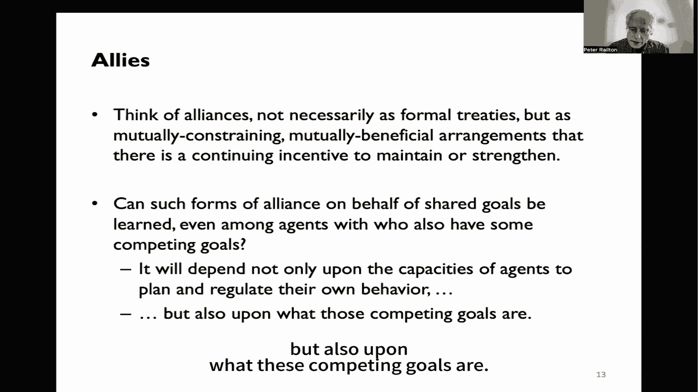

这里有一种思考的方式，我们已经在伯克利的人类兼容人工智能中心研究了几年。它来自于对这个错误规格问题的更多思考。我们建立人工智能系统的想法是为了追求一个固定的、我们事先指定的目标，但是如果我们犯了一个错误，我们就有麻烦了。这就是迈达斯王问题，因为迈达斯国王指定了他的目标“我碰过的东西都会变成金子”，后来意识到这包括他的食物、他的饮料和他的家人，为时已晚，他在痛苦和饥饿中死去。

那么我们如何避免这种情况呢？我们通过对人工智能的不同思考来避免它，在那里机器在某种意义上是为了人类的最大利益（尤其是人类，不是蟑螂，不是外星人）。但是机器显然不确定人类的利益是什么。我们可以在博弈论中精确地表述它，我们称之为辅助游戏。在游戏中，人类有收益（博弈论术语），这些收益是参与游戏的机器的收益，但是机器不知道回报函数是什么。机器可以从关于人类收益的先验概率分布中形成一些不确定的信念。然后我们可以解决这些游戏。我们发现辅助游戏解决者（这个游戏的机器参与者）一定会顺从于人类。他们会谨慎行事，是微创的，他们对世界的改变是最小的，为了促进人类的兴趣。因为他们想避免搅乱世界的一部分，他们不知道我们想要什么。在极端的情况下，如果人类想关掉机器，然后机器就高兴了，他们有积极的动机被关掉，因为他们不想做他们不确定的事情，但他们想避免做任何促使人类想要关掉它们的事情。

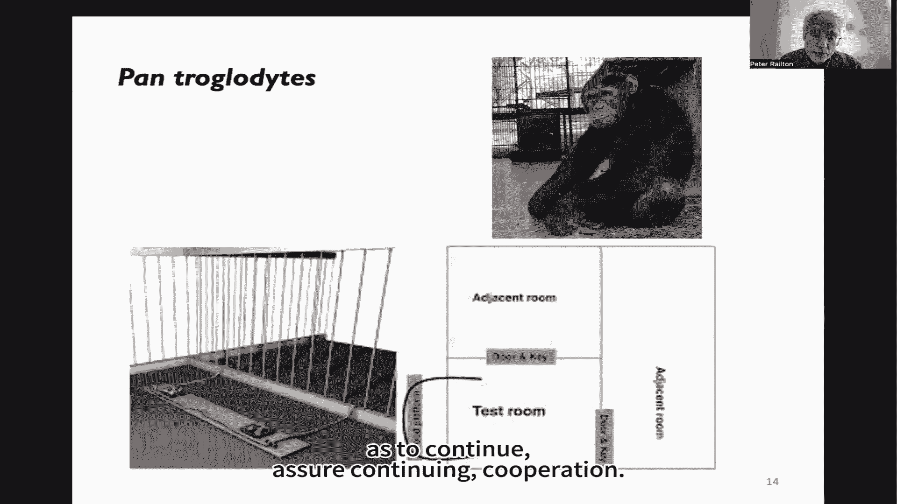

我们可以在一般意义上表明，在某些假设下，实际上建立辅助游戏求解器符合我们的最佳利益。这绝不是一件小事，我们正在取得一些进展，开始扩展和推广我们的解决方案来处理复杂的环境和部分可观测性等等。但还有很长的路要走，尤其是处理人类不完美的特征。

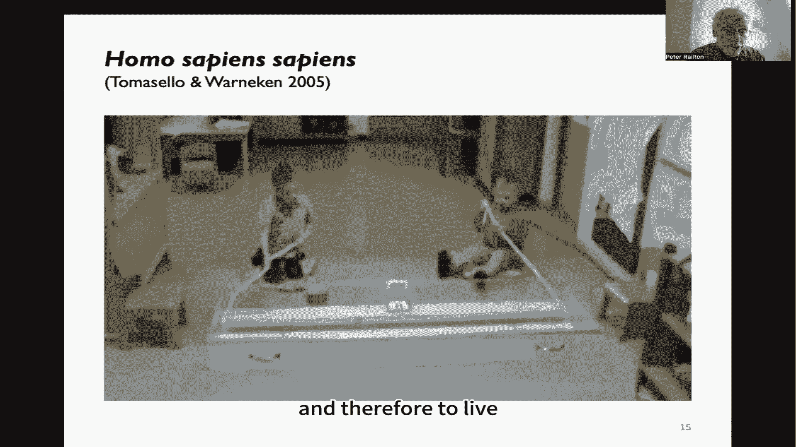

我们还有很多其他的研究方向，以使AI被证明是安全和有益的。
*   **有根据的AI**：这个方向认为，与其建造内部操作神秘的巨型黑匣子，我们在语义严格的元素（如逻辑和概率论）的基础上构建AI，并以数学上合理的方式组合它们。现在最好的候选可能是概率规划，它非常强大地结合了逻辑与概率。
*   **形式神谕**：这是一种限制人工智能系统所做的事情的方式。你可以制造一个任意智能的系统，但只允许它控制形式推理机（逻辑或概率推理机）的操作。所以在这种情况下，它只能给我们从我们提供的前提中得出的正确结论。那仍然是一种非常强大和有用的技术，但是它限制了能直接影响世界的AGI。
*   **用AI检查AI**：另一种很流行的方法，尤其是在那些试图建立AGI的公司中，原因很明显，你用一个AGI来检查另一个AGI的输出。这里的基本原则是，检查解决方案的正确性（在复杂性理论的意义上）比首先找到解决方案更容易。所以检查应该更容易，这样你可以得到更多的安全。
*   **有保障的安全AI**：这更像是一种运动，创建有保障的安全AI。我们中的一些人共同撰写了一份立场文件，解释需要对系统的安全属性进行正式验证，部分基于构建一个足够精确的现实世界模型，以及人工智能系统与现实世界及其中人类的互动，作为验证的基础。这是一个非常困难的方法，它将包括我之前提到的辅助博弈求解器。

但我想说的重点是，我们必须摆脱我们制造人工智能然后努力使其安全的想法，因为那真的不管用。这就像试图让一个从外太空着陆的外星人工智能系统安全一样。相反，我们需要制造安全的人工智能，在设计上是安全的。我认为这是唯一的出路。

在过去的几年里发生了很多事情。首先，我想说人类真的忽略了图灵在1951年发出的警告。所以我们可以说，人性有点“不在办公室”，甚至没有收到“外星人”发来的邮件说他们很快就要着陆了。但在2023年，OpenAI发布了GPT-4，微软声称它展示了人工智能的火花。未来生命研究所发表了一封有多人签名的公开信，谈论暂停比GPT-4更强大的系统的进展，因为我们还不知道如何让他们安全以及如何监管他们的行动。所以我会说，当人类回到办公室读到外星人发来的邮件时，发生了大量的紧急呼叫。联合国、白宫召开紧急会议，欧洲议员呼吁召开紧急全球峰会。2023年5月30日，另一份声明发表了一封公开信，不仅仅是人工智能研究人员签署的，也是所有主要人工智能实验室的领导人签署的，他们说AGI的发展带来了与核战争和流行病同等的灭绝风险。

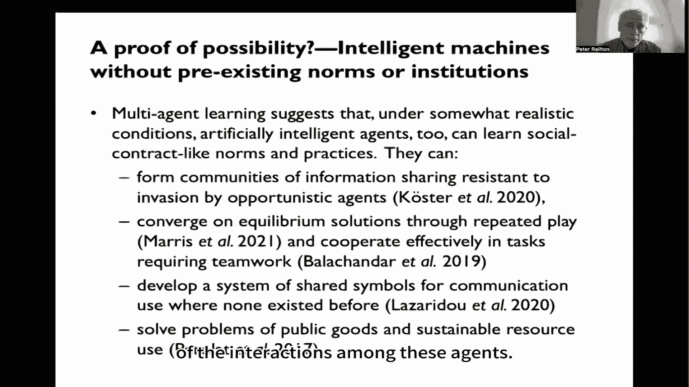

这些事件实际上说服了英国放弃其以前对人工智能非常放任的监管立场，英国表示希望成为人工智能安全监管的全球中心，并宣布了人工智能安全峰会。美国参议院有个关于人工智能安全的听证会，参加得很好。然后我们就人工智能安全进行了对话，连接西方和中国科学家讨论人工智能安全的国际合作方法。几个星期前，英国人工智能安全峰会在布莱切利公园举行。在那次峰会上，两个人工智能安全研究所成立，以及28个国家签署的声明，说得很清楚潜在风险是严重的，甚至是灾难性的，源于这些人工智能模型最重要的能力，并说到作出反应的紧迫性和必要性。在2024年3月，我们有了第二次北京人工智能安全对话。几天后，欧洲议会通过了人工智能法案。

与此同时，该行业的反应可能并不完全是人们所希望的。2024年6月4日，业内人士的一封公开信警告了一场鲁莽的主导地位竞赛，安全被忽视了，赞成赢得通往AGI的比赛。

我认为我们应该采取的监管措施之一就是我们所说的“红线”。很难精确地在安全人工智能系统和不安全人工智能系统之间划清界限，但我们可以区分明显的不安全和不可接受的行为。然后我们可以把举证责任推给开发人员，他们必须证明他们的系统不会越过这些红线，然后他们的系统才能部署。这就是我们对药物、飞机、核能以及许多其他给公众带来安全风险的经济领域采取的方法。由于开发人员已经承认他们的技术对公众造成灭绝的危险，所以这些红线要明确。理想情况下，它们应该是可自动检测的，在政治上是可行的。所以在政治舞台上捍卫这些红线必须很容易。例子包括禁止自我复制、禁止闯入其他计算机系统、禁止设计生物武器等。精确的细节并不重要，重要的是，为了表明系统不会越过这些红线，开发人员将不得不创建他们目前不具备的人工智能安全科学。

那么他们对此做了什么？他们试图定义通用人工智能而不是人工智能，在欧洲人工智能法案谈判的背景下，他们试图从人工智能法案中删除关于基础模型的整个部分。他们试图从全球人工智能安全峰会系列中删除整个安全概念。他们一直非常不愿意接受任何有“牙齿”的外部监管，这实际上需要他们做一些事情来证明他们的系统是安全的，辩称太难。我想，作为回应，人们可以说，也许在选择构建越来越大的黑盒语言模型作为通往AGI的路线时，他们选择了错误的技术道路。

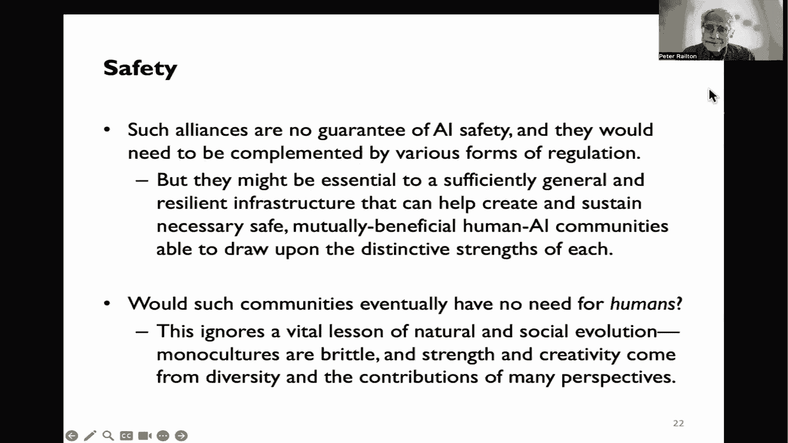

我们可以类比航空业。回到1903年，莱特兄弟驾驶他们的飞机，由内燃机和螺旋桨提供动力。然后，显然这是错误的技术方法，它依靠的是数学、推力方程和升力等。相反，想象一下，如果主宰航空业的大公司通过加速繁殖计划培养出越来越大的鸟，然后用那些鸟来