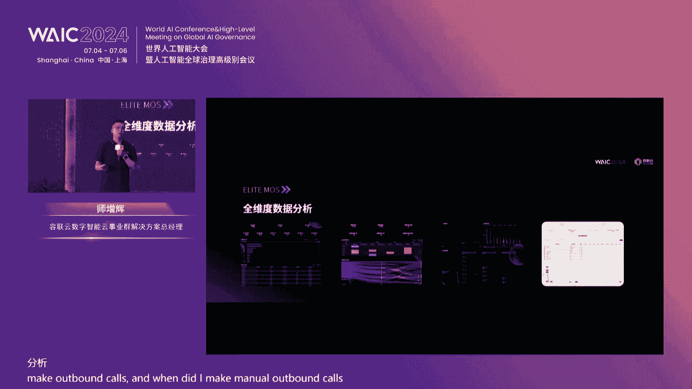
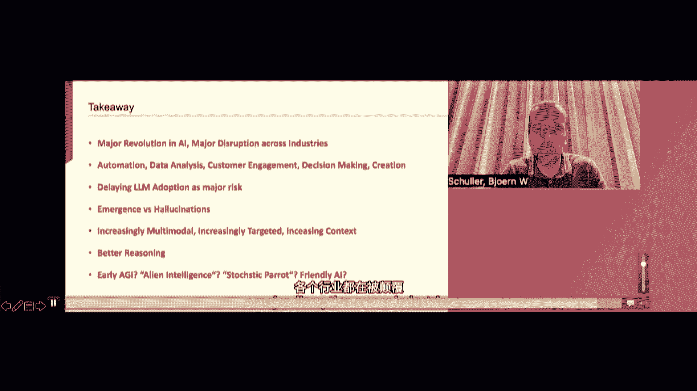

# 57：容联云生成式应用与大模型商业化实践论坛教程

## 概述
在本课程中，我们将学习容联云在2024年世界人工智能大会上举办的“数智聚合 产业向上”论坛的核心内容。课程将涵盖大模型在金融、制造、汽车等行业的商业化实践，探讨生成式AI如何驱动企业数字化转型，并解析容联云发布的多款大模型应用产品。

---

## 第一节：论坛开场与政策背景 🌐

论坛现场提示各位嘉宾将手机调至静音或震动状态。论坛开始前，与会嘉宾共同观看了一段介绍视频。

主持人白杨代表容联云对到场嘉宾表示欢迎。他回顾了一年前容联云在世界人工智能大会上首次发布“赤兔”大模型，并深入探讨了垂直行业大模型的应用。时隔一年，容联云加深了对大模型的理解，在金融、零售、制造、汽车等多个行业实现了应用的实质性突破，助力了关键业务场景的重塑与业务模式的革新。

本次论坛旨在进行行业实战分享、基于真实洞察的产品发布，以及关于大模型应用与实践场景的深度对话，共同探索实践的聚合、创新的聚合与趋势的聚合。

**过渡**：在了解了论坛的整体背景后，我们首先进入金融科技领域的探索。

---

## 第二节：可信计算驱动金融数字化转型 🏦

本节由中电云计算技术有限公司金融事业部技术负责人孙鑫先生分享，主题为“可信计算驱动金融行业数字化转型的新引擎”。

国家高度重视人工智能产业发展，从2018年起将其置于科技革命和产业变革的战略高度。相关政策文件，如《新一代人工智能标准体系建设指南》和“十四五”规划，均强调了人工智能的重要性。2023年，生成式AI概念兴起，国家鼓励各行业创新应用，并重视算法备案制度和行业规范发展。

中国电子云作为中国电子集团旗下的云计算公司，秉承国家人工智能发展战略，发布了“可信计算”战略。该战略聚焦于算法、数据和算力层面，服务人工智能产业创新。

在计算层面，中国电子云提供了“可信计算底座”，具备异构多元计算能力和统一管理平台。在存储层面，自研了高性能并发存储，填补了国产化领域的空白。数据供给安全可靠，通过安全可信的交换区，从数据供给方流转至需求方，支撑大模型应用与创新场景。

聚焦金融行业，应用场景可分为内部与外部两类：
*   **内部场景**：优化内部流程，提高效率，主要涉及研发、运营、资管和合规等环节。
*   **外部场景**：实现更多创新，如金融机构与客户的直接互动，包括智能营销、智能销售和智能客服等，加速了金融科技核心价值的发掘。

基于以上需求，中国电子云提出了三层服务体系：
1.  **计算中心服务**：包括通用大模型预训练服务和金融客户化大模型服务。
2.  **大模型集成服务**：提供数据预处理、微调等“最后一公里”服务。

展望未来，基于数据、创新和场景，可以在底层构建产业评价体系、企业评价体系等，横向拉通数据，与更多生态伙伴合作，丰富应用。最终形成大数据集成服务、丰富的模型体系和安全领域能力。

中国电子云愿与容联云在三个方向合作：
1.  共同推动人工智能国产化生态。
2.  基于容联云的技术能力，共同创新生成式人工智能技术，服务千行百业。
3.  强化人工智能技术的自主安全可控，减少对外部技术的依赖。

**总结**：本节介绍了国家政策对AI的推动，以及中国电子云如何通过可信计算战略和三层服务体系，助力金融行业的数字化转型，并展望了未来的合作方向。

**过渡**：了解了金融行业的宏观布局后，我们接下来看看容联云如何具体落地大模型应用，重塑企业营销服务场景。

---

## 第三节：企业营销服务场景重塑与产品发布 🚀

本节由容联云产业数字云VP兼诸葛智能创始人孔淼先生分享，主题为“企业营销服务场景重塑：容犀智能大模型应用升级发布”。

自GPT发布以来，大语言模型带来了技术革命。容联云在去年发布了“赤兔”大模型，并开始与行业客户探索落地场景。在实践中发现，大模型直接颠覆企业客服和营销场景存在挑战，如真实沟通场景的幻觉控制、算力成本以及融入企业业务流程的改造和管理成本。

因此，容联云更关注如何利用新技术做好应用落地，帮助企业实现价值提升。去年年底，容联云推出了“容犀Copilot”，采用大小模型结合的方式解决幻觉和算力问题，应用于知识流转、话术挖掘和会话洞察。

随着与更多客户的互动和智能体技术的成熟，容联云今年全新升级并发布了容犀智能的大模型应用。首先回顾企业营销服务场景的工作流程：客户通过多渠道接入，先由智能对话（如IVR、外呼机器人）处理，复杂问题转人工，过程中有AI知识库辅助、智能陪练和服务管理（CRM）。

尽管客服领域智能化应用较早，但过去没有大语言模型，很多复杂开放式业务场景仍需大量人工进行知识管理和训练，难以做到包容和兼容。

基于大模型技术的发展，容联云提出了可行的产品与解决方案，将原有的Copilot升级，发布以下五款产品：

以下是本次发布的五款核心产品：
1.  **容犀KP（Knowledge Pilot）**：大模型知识助理。改变复杂的知识管理，通过大模型运营知识，提供企业级产品管理体验。
2.  **容犀IA（Insight Agent）**：大模型洞察代理。引入智能体技术，利用大模型智能化地理解分析会话，挖掘潜在需求，诊断服务流程，推荐营销策略。
3.  **容犀CA（Coaching Agent）**：大模型陪练代理。利用智能体能力，让大模型学习真实会话生成陪练任务，实现个性化陪练。
4.  **容犀AC（Agent Copilot）**：大模型坐席助理。通过大模型辅助坐席，实现智能流程导航、话术推荐和快速会话小结，提升坐席效率。
5.  **容犀VA（Virtual Agent）**：大模型虚拟代理。通过大模型构建对话，理解和阅读用户服务流程，自动化构建文本机器人任务流程。

这些产品基于完整的模型底座，采用大小模型结合，并兼容多种主流模型。底层技术包括Prompt工程、RAG（检索增强生成）、微调工具等，通过数据飞轮实现效果自学习和优化，通过向量库和推理加速提升性能与降低成本。

**总结**：本节详细介绍了容联云如何针对企业营销服务场景的痛点，升级发布五款大模型应用产品，旨在通过大小模型结合与智能体技术，切实提升运营效率、服务质量和客户体验。

**过渡**：产品发布后，其实际效果如何？接下来我们将通过具体案例，看看容犀智能大模型在多行业的实践成果。

---

## 第四节：容犀智能大模型的多行业实践案例 📊

本节由容联云大模型产品负责人唐新才先生分享，主题为“真正懂行业的企业级AI领航员：容犀智能大模型应用多行业实践”。

基于与150多家客户的沟通，总结出客户关心的核心问题包括：落地场景、模型区别、落地周期、维护调优以及与现有系统结合。

在选择落地场景时，容联云围绕**技术可行性**和**业务价值**两个维度，从最擅长的客服中心领域起步，并同步探索更深业务链的应用。本节分享了四个场景案例：

以下是四个具体的行业实践案例：
1.  **保险服务场景**：处理每日大量的电话录音。传统方式难以挖掘海量录音中的潜在价值（如客户需求、潜在客诉、流程断点）。大模型可以高效发现这些点，例如识别客户对“保单无法续期但未提前告知”的不满，并提取优秀坐席的安抚策略给出建议。实践采用1张A100显卡和14B参数模型，处理效率提升20倍，预计可降低潜在投诉10%。
2.  **制造业电器上门维修场景**：解决上门检修工单填写不规范、总部难以快速统计和预警批量故障的问题。传统关键词检索准确率约40%。大模型通过语义理解，能准确对工单内容进行分类（如区分“压缩机故障”和“检修压缩机正常”），准确率提升至80%，预警周期从天/周级缩短。采用4张V100显卡和7B模型，可处理约1万张工单。
3.  **寿险服务场景**：优化寿险售后（如保全变更、服务咨询）的自动化流程。传统方式靠经验决定优化起点。通过分析半年服务数据，发现“保全变更”和“交费账号信息变更”占比最高（超70%）。大模型可提取人工服务流程并构建自动化流程，在指定目标下能进行多轮问答和意图识别，并通过数据飞轮优化。最终将相关业务的自动化程度从30%多提升至75%。
4.  **银行网点业务场景**：解决网点授信人员办理业务时，需记忆大量政策法规和产品文件，导致服务响应慢、体验差的问题。传统文件检索（关键字）难以使用。通过容犀KP将文档拆解理解，形成业务助手，能快速给出准确答案并注明政策依据。估计可覆盖70%的查询，大幅降低检索时间和咨询上级的频率。采用8张A40显卡和72B参数模型（实际可优化至更小模型）。

**总结**：本节通过保险、制造、寿险、银行四个行业的真实案例，展示了容犀智能大模型在提升效率、降低成本、发现潜在价值、优化业务流程等方面的具体成效和资源投入情况。

**过渡**：看过了服务商的实践案例，我们再来听听来自客户方——中国邮政储蓄银行的一线应用经验。

---

## 第五节：邮储银行的大模型探索与应用实践 💳

本节由中国邮政储蓄银行副处长、大模型技术负责人李培女士分享，主题为“中国邮政储蓄银行大模型探索与应用实践”。

邮储银行的科技战略布局围绕“智慧邮储（Smart）”、“生态邮储（System）”、“数字邮储（Digital）”和“协同邮储（Synergy）”。在生成式AI时代，银行的企业级创新平台正从“邮储大脑1.0”向“2.0”升级，从感知洞察转向生成创作。

“邮储大脑2.0”以大模型平台和多元算力调度为基础，新建了文本生成、图像生成、语音生成、多模态理解、对话等生成式能力，支撑数字员工、虚拟营业厅、智能流程自动化、卡面纹身图、智能问答等创新应用。

面对八大业务领域（研发测试、零售、公司金融、资管金融、客户服务、风险信贷、综合办公、运营）的超过100个场景，邮储银行构建了大模型应用架构，并抽象出“智能中枢+应用范式”的概念，以规模化推进场景落地。

**智能中枢**在传统渠道上增加语义识别和知识增强，基于语义进行智能调度和分发，并对后端应用范式进行会话控制、组合编排和运营统计，从而实现各应用间的“赛马”和优化淘汰。

以下是邮储银行在各领域的应用范式举例：
*   **研发测试闭环**：包含智能生成UI设计图、代码生成、单元测试、系统测试、研发安全、体验提升6步，全面赋能研发领域。
*   **零售领域**：大模型伴随个人客户的一天，从早晨的文案推荐到智能客服、外呼营销、用户画像等。
*   **公司领域**：伴随小微客户成长，从预约开户到信贷受理、营销赋能。
*   **资管领域**：伴随同业客户旅程，辅助智能投研和交易监测。
*   **客户服务**：全面升级坐席工作模式，从智能派单、坐席助手到智能陪练，形成闭环。
*   **风险信贷**：从贷款审批到报告生成、合同审查，由大模型全面赋能。
*   **综合办公**：大模型伴随员工一天，从“邮小办”助手处理代办、会议纪要、文档摘要等。

邮储银行分享了几个案例：
1.  **移动金融APP**：利用研发大模型全面赋能产品设计、开发测试、客户服务等全流程，提升用户体验。
2.  **“小邮助手”**：自研的基于检索增强的智能问答系统，已在全国推广超8000个网点，提升答案准确率和解决效率。
3.  **企业微信“灵动智库”**：辅助理财经理营销，赋能获客、活客、粘客全流程。
4.  **智能审查助手**：在风险领域，基于法律大模型实现合同审查，已覆盖36类法审风险，准确率达75%。

基于以上实践，邮储银行正在打造企业级的知识问答应用范式和陪伴助手范式，并总结了推进大模型规模化落地需要的“四力”：爆发式的单点突破能力、条件反射式的技术判断力、体系化的创新落地能力、全局性的统筹协同能力。

**总结**：本节系统介绍了邮储银行如何通过构建“智能中枢+应用范式”的体系，在八大业务领域规模化落地大模型应用，并分享了具体案例和宝贵的实施经验。

**过渡**：从银行的宏观实践回到具体的产品平台，接下来我们看看容联云如何通过升级其核心平台，赋能以客户为中心的运营。

---

## 第六节：未来已来——CC平台全面升级 🛠️

本节由容联云数字智能云事业群解决方案总经理施增辉先生分享，主题为“未来已来：CC平台全面升级，大模型赋能以客户为中心的运营中台”。

容联云CC平台（中文名：过河兵）在行业已有20年沉淀。基于大模型，平台在客服和营销场景实现了升级，旨在降本增效并提升客户体验。

**在客服场景**，传统方式存在知识库构建维护成本高、多轮会话体验差、智能质检投入大、人工兜底成本高等痛点。解决方案是引入**智能体（Agent）**概念，为不同场景（如社保查询、投诉安抚）创建专属智能体及其知识库。平台提供三种赋能模式：
1.  **直接对话**：客户直接与智能体沟通。
2.  **一键托管**：客户进入人工坐席后，系统默认由智能体交互，无法回复时转人工，人工回复后可再次开启托管，大幅提升坐席并发服务量。
3.  **辅助模式**：坐席点击“生成”按钮，一键生成回复话术，并可优化或重新生成。

此外，利用大模型能力实现：
*   **智能小结**：通话结束后自动总结客户意向、标签，坐席一键填单。
*   **智能创单**：触发工作流时，自动生成工单类型、内容及处理意见。
*   **历史会话总结**：快速了解客户历史交互内容，无需重听录音或看聊天记录。
*   **AI建议**：处理工单时，自动总结历史记录和客户诉求，给出处理建议。
*   **智能质检**：用自然语言描述质检规则（如“是否有辱骂客户”），大模型自动总结和命中，简化规则配置。

**在营销场景**，解决系统分散、数据分散、运营困难的问题。容联云平台可实现数据整合与精准营销：
*   **统一平台**：集成短信、人工外呼、自动外呼等系统，数据全部打通。
*   **全触点营销**：通过流程画布配置统一任务（如贷款营销），串联发短信、激活额度、自动外呼、人工跟进等环节，实现客户全旅程监控。
*   **智能外呼监管**：坐席可同时监管多个AI外呼，当识别到客户高意向时，一键接入转为人工沟通，实现高效人机协同。
*   **旅程监控与优化**：监控客户从点击短信到完成贷款的整个旅程，对断点（如只看额度不贷款）自动触发外呼询问原因，并可下发优惠券等策略进行挽回。

所有营销任务均可在统一平台进行构建和统计分析，通过数据看板直观展示效果。

**总结**：本节展示了容联云CC平台如何通过集成大模型和智能体技术，在客服和营销两大核心场景实现智能化升级，通过一键托管、智能辅助、全旅程营销管理等功能，切实提升运营效率和客户体验。

**过渡**：了解了国内企业的实践后，让我们拓宽视野，从全球视角看看大语言模型的工业应用趋势。

---

## 第七节：大语言模型工业应用的全球视角 🌍

本节由帝国理工学院计算机系终身教授通过视频分享，主题为“基于大语言模型的应用使用与发展趋势：全球视角”。

**大语言模型基础**：经典机器学习针对特定任务训练模型。而**基础模型（Foundation Models）**，即大语言模型，是在海量数据上训练的通用模型，可通过微调适配多种任务。2017年《Attention Is All You Need》论文提出的Transformer架构是起点，导致了重大的社会影响。基础模型定义为在大规模数据上通过自监督训练，并能通过微调广泛适应下游任务的模型。

训练方式包括预测下一个词（自回归）或掩码随机词。模型规模不断增长（从GPT-3的1750亿参数到万亿参数），同时也有小型化趋势。多模态能力扩展至视觉、音频等领域，训练原理相似。

**使用与发展趋势**：
*   **性能与影响**：AI生成文本已难以与人类文本区分，是增长最快的技术趋势之一。全球投资巨大，预计将影响3亿个工作岗位，同时推动全球GDP增长。
*   **成本**：训练成本高昂但正在下降，推理成本相对较低。
*   **行业应用**：已广泛渗透至各行各业，如：
    *   **营销广告**：内容创作、个性化营销、情感分析。
    *   **零售电商**：个性化推荐、产品描述、库存管理。
    *   **医疗健康**：辅助诊断、电子病历处理、药物发现。
    *   **金融**：个性化理财、欺诈检测、风险评估。
    *   **教育**：个性化辅导、语言学习、实时评估。
    *   此外还包括制造、网络安全、法律、软件研发等。
*   **前沿机遇**：
    *   **多模态**：生成和管理连贯的多模态（文本、音频、视频）内容。
    *   **更快的处理与推理**：模型变得更精简，推理能力增强。
    *   **多语言与长上下文**：支持更多语言，输入上下文窗口增长（可达百万tokens）。
*   **局限与挑战**：
    *   计算资源需求大。
    *   需要人类监督以避免偏见和确保合规。
    *   存在“记忆”问题（输出训练数据原文）。
    *   依赖高质量数据，而互联网中AI生成内容增多。
    *   存在数据泄露、后门（“沉睡特工”）等安全风险。
*   **技术趋势**：
    *   **涌现能力**：模型规模达到一定程度后，出现未被专门训练的能力。
    *   **检索增强生成（RAG）**：结合外部知识库。
    *   **人类反馈强化学习（RLHF）**：大幅提升模型对齐效果。
    *   **智能体（