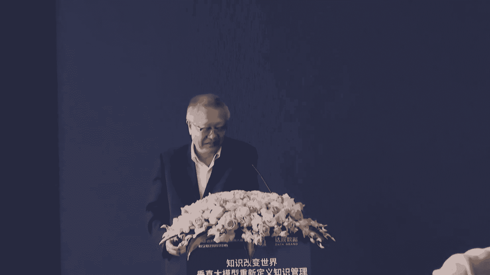
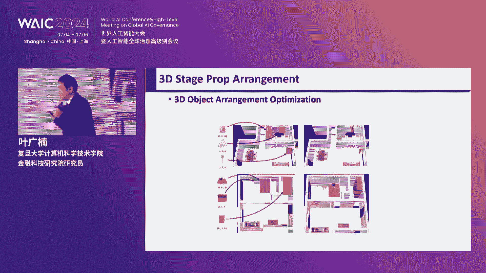
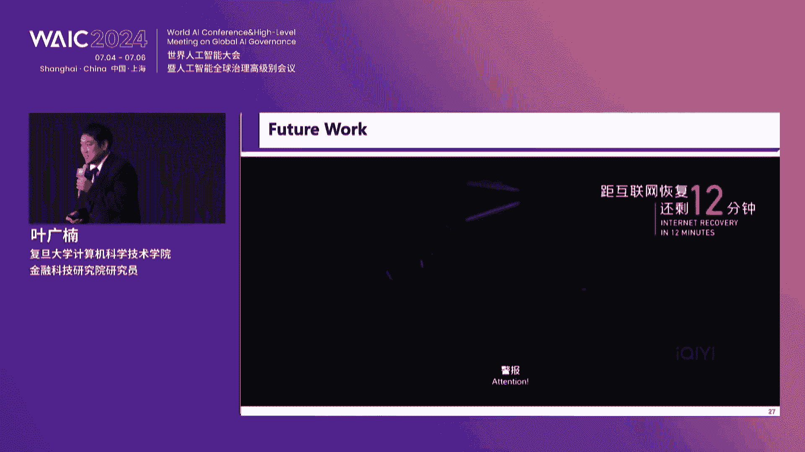
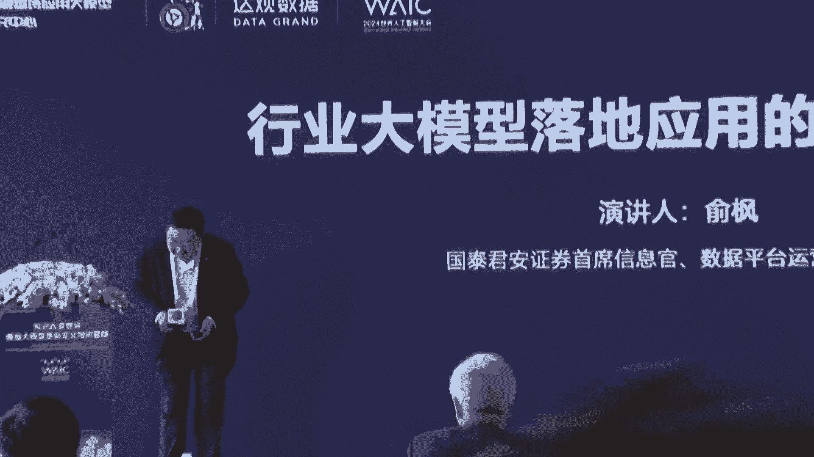
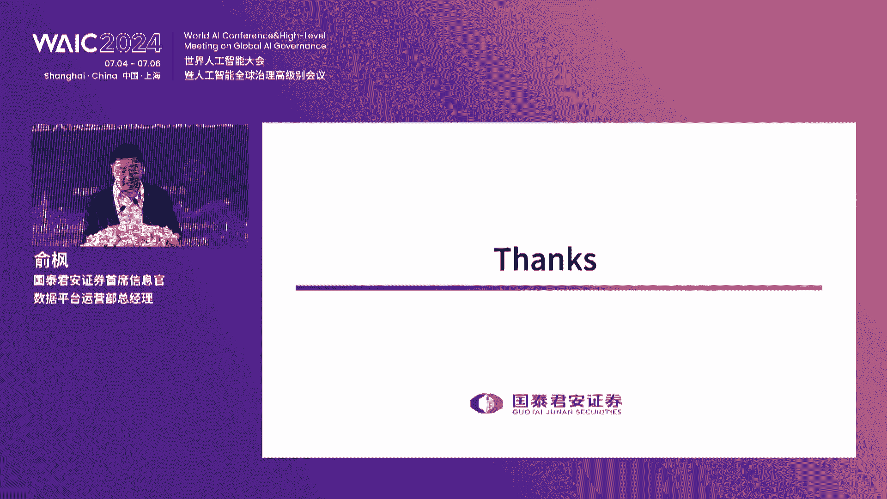
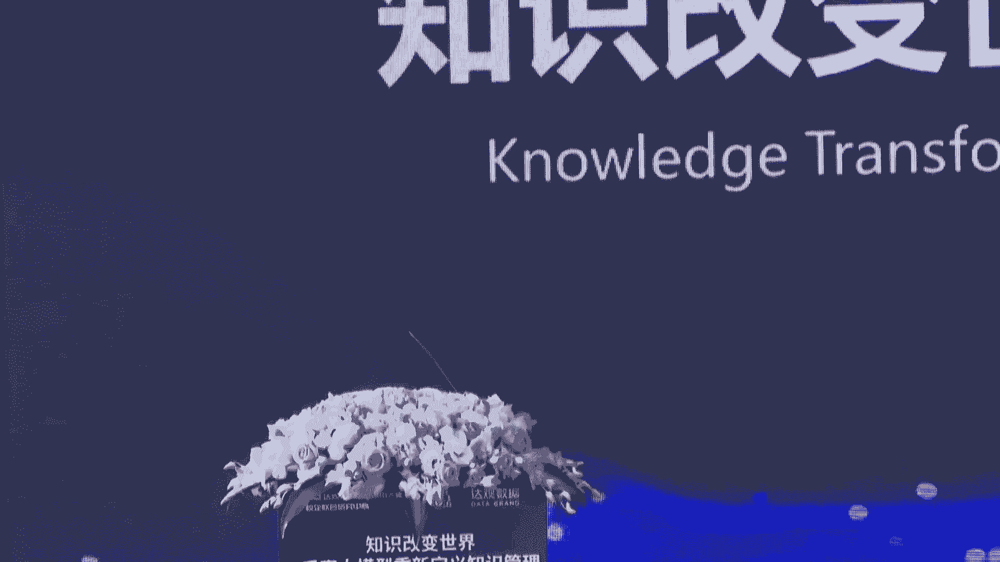
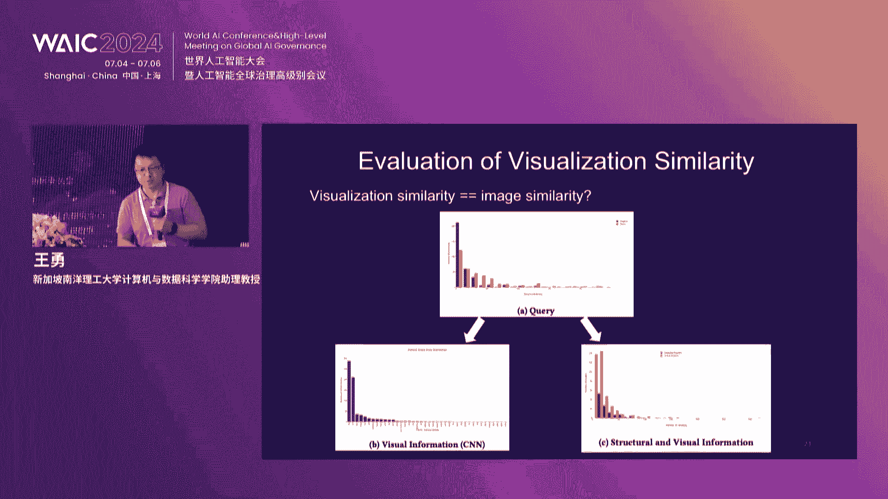
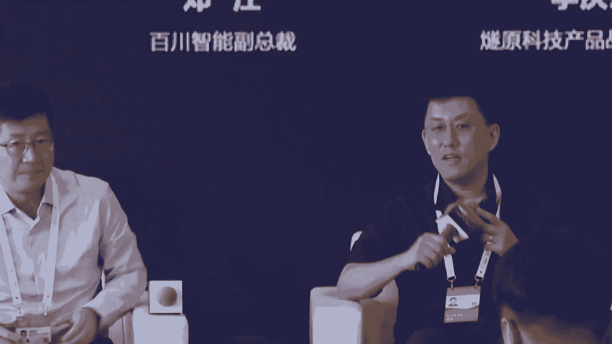

# 58：垂直大模型与知识管理应用教程 🧠

在本节课中，我们将学习垂直大模型如何重新定义知识管理。我们将探讨达观数据公司的产品矩阵、知识管理系统的核心功能，以及大模型在金融、档案管理等垂直领域的应用实践。

---

## 一、 公司背景与产品矩阵

达观数据是一家为企业提供各类场景智能知识管理的国家高新技术企业，是行业首家国家级专精特新“小巨人”企业，于2015年在上海张江成立。

公司在北京、苏州、深圳、成都、长沙等地相继成立子公司，业务和品牌向全国全面推进。达观核心管理团队由业界知名技术和业务专家组成。

凭借研发团队丰富的技术积累和深厚的行业经验，公司成功研发出国内最全的智能文本处理产品矩阵。

以下是达观数据的主要产品线：

*   **智能文档处理（IDP）**：可以进行文档的抽取、审核与比对。
*   **知识库管理系统（KMS）**：可以进行文档的管理、知识库问答、写作与搜索。
*   **智能推荐系统**：可为企业做各种内容的个性化推荐。
*   **智能数字员工（RPA）**：可做跨系统之间的数据自动同步、抓取、填报等。

目前，这些产品已成功应用于制造、政务、金融等领域，并受到客户的一致认可。

---

## 二、 荣誉资质与产学研合作

上一节我们介绍了达观数据的产品矩阵，本节中我们来看看公司获得的认可和其产学研布局。

达观数据多年来屡次获得国内外权威机构颁发的荣誉和奖项。

以下是部分重要荣誉：

*   获得中国人工智能领域最高奖“吴文俊人工智能奖”。
*   获得全球顶级技术竞赛ACM世界算法竞赛冠军。
*   多次荣登福布斯中国、胡润百富人工智能五十强榜单。

公司资质齐全，赢得多方权威认证，全面兼容信创体系，同时申请了200余项发明专利。

达观数据与北京大学、复旦大学、上海交通大学等知名高校建立了产学研合作。其中，与中国工程院柴洪峰院士、复旦大学建立了“金融垂直应用大模型联合实验室”，专注金融垂直大模型的研发与应用。

达观高度重视产品交付质量，建立健全客户服务和质量管理体系，提供重点客户服务权益包，定期进行客户满意度调查。

---

## 三、 企业愿景与社会责任

达观数据积极践行企业社会责任，数年来赴云贵川等地山区小学捐赠爱心图书室，多年组织员工无偿献血，开展科技助残、关爱弱势群体等活动。

达观数据一直秉承着“务实求真、通达乐观”的价值观，以“成为中国第一的智能文本处理企业”为愿景，致力于通过知识赋能，帮助企业实现管控、降本、增效。

达观数据，智能文本处理专家。

---

## 四、 智能知识管理系统概述

上一节我们了解了公司的整体情况，本节我们将深入其核心产品——智能知识管理系统。

达观智能知识管理系统对组织里每位成员的知识进行采集、积累、挖掘、运用，让知识可以传承，工作更加高效。

组织内部的各类报告、资料、制度、档案、邮件，以及外部的资讯、文档等都蕴含着丰富的知识。将这些信息汇集起来并加以利用非常重要。

达观知识管理系统运用大模型和人工智能技术，对组织内外部的各类信息进行存储、管理、萃取、挖掘和运用，帮助每个组织实现知识驱动的智能化工作。

---

## 五、 知识管理系统的核心模块

以下是达观知识管理系统（KMS）的核心功能模块：

*   **知识空间**：提供文档资料的分类、存储管理功能，具备可靠的权限管理和备份存储功能，支持图片、音视频、表格数据等各类多媒体内容的多人编辑和内容管理。
*   **知识百科**：积累专业词条的权威释义，并将各类百科词条相互链接在一起，形成组织自己的“维基”百科系统。
*   **知识问答**：提供FAQ常见问题、权威问答库、专家解答、社区互助问答、AI智能问答等多种问答形式。
*   **知识培训**：包含专家培训资料、岗位技能地图、在线知识评测等模块，帮助各岗位员工快速学习成长。

达观KMS与包括“曹植”大模型在内的国内外各类大模型充分结合，实现了对知识的深度加工和组织的创新应用能力。

---

## 六、 智能化功能详解

上一节我们介绍了系统的核心模块，本节中我们来看看这些模块如何通过AI技术实现智能化。

系统实现了各类自动化的文档审核、协作、问答、分析等智慧能力。

**智能搜索与问答**运用检索增强（RAG）技术，精准获取知识：
*   **列表式搜索**：提供多种条件筛选功能，支持全文模糊搜索。
*   **问答式搜索**：提供知识溯源，并有官方权威问答、专家问答、社区问答等多种细分类型的标记。
*   **高级功能**：包括数据问答（NL2SQL）、结果动态图表生成等。
*   **创新功能**：达观还创新性提供知识脑图式搜索，自动生成有层次、有条理的脑图式结果，用于对问题的深度回答。

除了“人找知识”，还能让“知识找人”。**智能推荐功能**可以根据用户兴趣偏好，主动推荐相关知识，提升知识传递效率。

**智能写作**提供上下文自动续写、大纲扩写、文字润色、配图生成、文档翻译等组件，大幅度改善写作效率。尤其为各行业提供专属的专业文档仿写模块，针对标书、报告、公文、方案等实现专业化AI写作，并有插件模块无缝对接WPS和Word。

**智能知识分析**可对各类资料的关键字段进行提炼和分析，实现自动归档、逻辑版本比对、审核提醒、分类归档、自动填报等高级功能，以及数据资产评价、外部数据导入和交易等创新模块。

---

## 七、 配套服务与行业应用

围绕知识管理产品，达观还提供配套服务体系，包括组织内部文件梳理和导入服务、外部情报采集服务、知识体系构建服务、存储备份服务、访问安全监测服务等。

达观将AI技术和知识库相结合，为每个组织量身定制专属的“知识大脑”，为工业、金融、能源、医药、政务等各行业的技术研发、项目管理、营销客服、人事行政、法律合规、档案管理等各方面提供行业领先的产品和服务，为每个组织的知识传承和效率提升提供科技力量。

---

## 八、 垂直大模型在金融领域的应用与思考（专家观点）

本节我们将视角转向行业应用，特别是金融领域。中国工程院院士柴洪峰指出，金融业是数字化、智能化的先行者，在大模型应用实践方面，已经探索了与实体经济相融合的多种场景。

金融大模型的应用流程通常包括：明确需求与评估、场景测试、模型训练、模型优化、测试上线等环节。

应用场景主要集中在业务支持、市场营销、客户服务、产品运营和风险管理五大方面。例如，在业务支持方面，大模型可以辅助代码生成、运维问题定位、金融研报写作等；在风险管理方面，可用于反欺诈、合规审查等。

然而，金融大模型发展也面临四大问题：
1.  金融应用规范及指南需继续完善。
2.  大模型的应用范式不够丰富。
3.  高质量的金融训练数据欠缺。
4.  训练算力资源普遍不足。

柴院士认为，突破的关键在于在垂直领域定义有限界限，打造高质量的金融数据底座，结合知识图谱，实现“有限效应”的突破，即机器的智力结合人的智力，在特定领域产生超越性的认知。

---

## 九、 达观“曹植”大模型与知识管理5.0

达观数据创始人陈运文分享了公司对“知识”的新解读：“知”代表文档资料的汇集与分析，形成知识库；“识”代表运用大模型技术对数据进行辨识、理解和应用。

达观的定位聚焦于**垂直大模型**、**行业知识**和**场景化的文档处理**。

“曹植”大模型在过去一年持续发展，参数规模达到700亿，采用垂直语料与通用语料混合训练，并构建了包含通用指令、NLP任务指令和垂直领域指令的百万级微调数据集。该模型已通过国家网信办备案。

达观强调多模型混合，兼容多种基座模型，采用混合专家架构，针对不同任务融合不同模型或知识图谱。

**达观知识管理系统5.0**基于垂直大模型和行业知识开发，其核心在于：有多少垂直的专业知识和业务能力，就能开发出多优秀的垂直大模型应用系统。

---

## 十、 创新功能与未来展望

达观知识管理系统包含许多创新而实用的功能：
*   **文档自动归类**：为散乱的文档自动打标签并归类。
*   **智能命名**：根据文档内容AI自动重命名文件。
*   **知识提取**：从文档中提取结构化信息形成知识卡片。
*   **文档去重**：自动检测并处理重复知识。
*   **问答对提取**：从文档中自动生成问答知识库。
*   **专业审核**：如银行流水核查、投行文档合规审核等。

达观正在探索智能体（Agent）技术，将RPA（流程自动化）作为“双手”，大模型作为“大脑”，打造智能数字员工，将人从复杂的日常工作中解脱出来。

达观与复旦大学、国泰君安、随源科技形成了“产-学-研-用”的发展链路，共同推动金融垂直大模型的研发与应用。

---

## 十一、 圆桌讨论：跨界共赢的挑战与路径

在论坛的圆桌讨论环节，来自学界和业界的专家探讨了垂直大模型产业应用中的跨界合作。

**核心观点如下：**
*   **认知对齐**：需认识到大模型是“新质生产力”，而不仅仅是优化生产关系的工具。解决“幻觉”等问题需要配套的工程化手段（如RAG）。
*   **价值驱动**：跨界合作需以客户价值为核心，各方联合为客户提供端到端的解决方案。需要帮助客户算清投入产出账，并规划长远愿景。
*   **生态融合**：产业链各环节（算力、算法、模型、应用、咨询）需要打破传统的上下游概念，形成“全连接”的开放合作模式，共同攻克具体场景下的“最后一公里”问题。
*   **打消顾虑**：特别是数据安全与隐私顾虑，需要通过技术手段（如隐私计算）和专业的咨询评估来化解。
*   **教育与人才**：高校正在普及AI教育，并致力于引导学生合理利用大模型。同时，通过开源、合作研究等方式培养人才，推动技术扩散。

---

## 总结

本节课中，我们一起学习了垂直大模型如何重塑知识管理。我们从达观数据的实践出发，了解了智能知识管理系统的核心功能与创新应用。通过专家分享，我们认识到垂直大模型在金融等领域的巨大潜力与当前挑战。最后，圆桌讨论揭示了跨界合作、生态融合是推动大模型落地、实现价值共赢的关键路径。未来，垂直大模型将继续深入千行百业，成为组织智能化转型的核心驱动力。