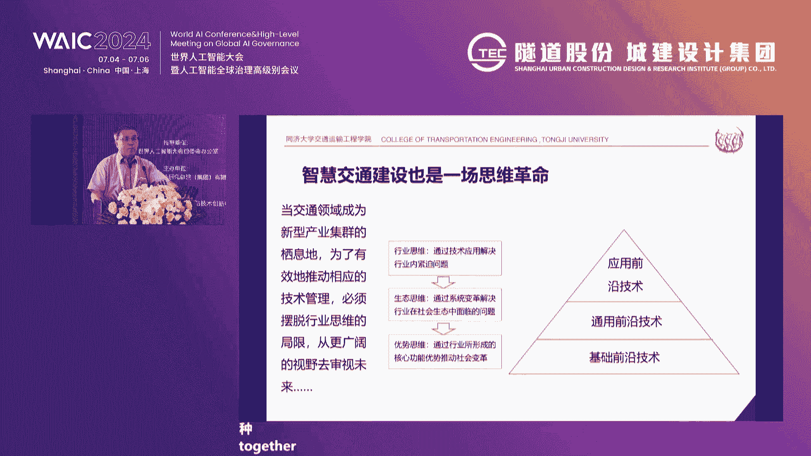
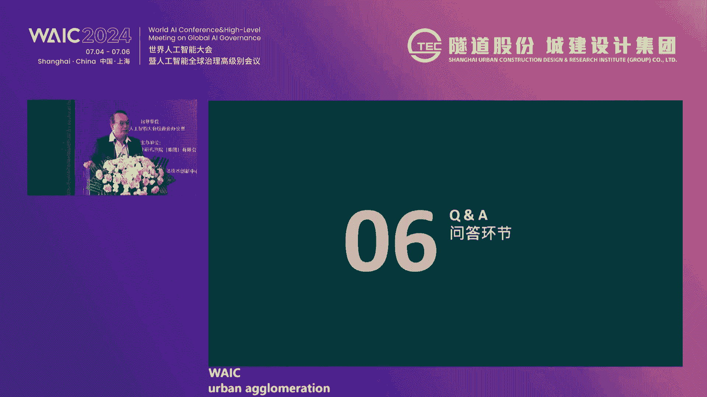
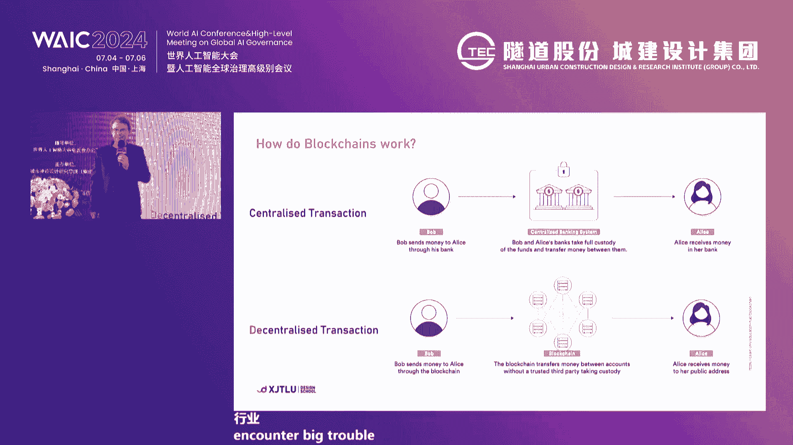
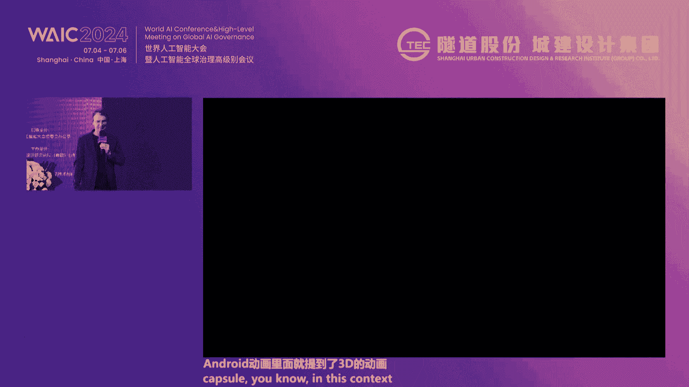
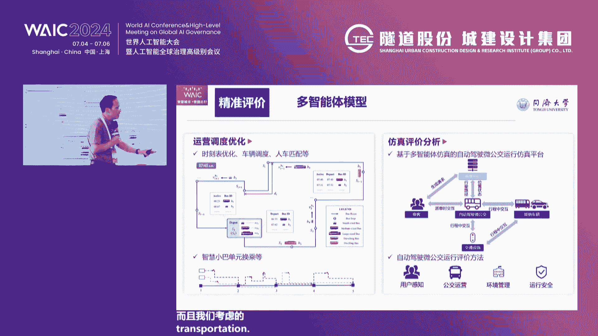
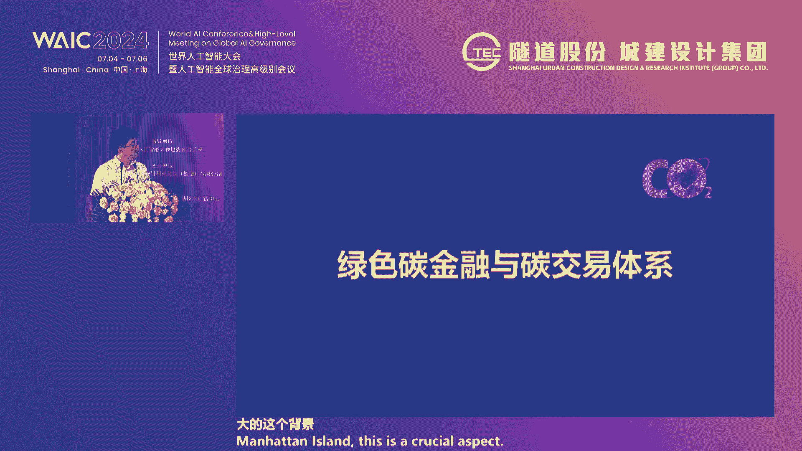

# 59：智慧城市 · 智捷出行 🚀

在本节课中，我们将学习智慧城市背景下，如何利用人工智能等前沿技术解决城市交通“最后一公里”的难题，并探讨从智能交通向智慧交通发展的体系化对策。

---

## 概述

本次课程内容源自“智慧城市·智捷出行”生态论坛。多位来自学术界、产业界和政府的专家，围绕城市交通的挑战与未来，分享了关于自动驾驶微公交、低空经济、交通碳数据模型、需求响应式公交等前沿议题的深刻见解。我们将系统性地梳理这些观点，形成一篇结构清晰的教程。

---

## 一、 论坛背景与致辞

本次论坛由世界人工智能大会组委会办公室指导，上海市城市建设设计研究总院集团有限公司主办。论坛聚焦人工智能在交通领域的创新应用。

上海市交通委员会科技信息处处长指出，上海交通场景广泛、数据资源丰富，已在数字化转型和智能交通建设方面取得基础成就，例如建成出行即服务（MaaS）平台、开放自动驾驶测试道路等。然而，人工智能在传统交通行业的创新应用仍相对较少，行业亟需智能技术加持，以支撑交通强国建设。

上海市城市建设设计研究总院集团董事长强调，智慧城市是城市治理和生活方式的深刻转变。交通作为城市血脉，其智慧化至关重要。该集团利用AI技术打造了“智捷出行”需求响应式智慧巴士解决方案，旨在解决城市交通“最后一公里”问题。

上一节我们介绍了论坛的背景与领导致辞，本节中我们来看看学术界对智慧交通发展的宏观思考。

---

## 二、 从智能走向智慧：应对城市交通高维化的体系对策

同济大学杨东援教授指出，当前交通行业面临研究对象从单一物理系统向复杂社会系统转变的挑战。交通问题已“高维化”，涉及公共政策、市场设计、社会公平等多重维度。

### 核心概念区分：智能交通 vs. 智慧交通
*   **智能交通**：简单引入信息和控制技术产生的**技术解决方案**，主要服从物理规律。
*   **智慧交通**：采取技术和政策手段解决**综合性社会问题**的**人机混合系统**。

智慧交通包含三个控制层级：
1.  **智能控制层**：解决如自动驾驶等物理规律层面的问题。
2.  **智能服务层**：应对市场精细化服务与多样性需求匹配的挑战。
3.  **智能治理层**：涉及公共政策制定，需解决AI决策的**可解释性**与公平性瓶颈。

### 当前紧迫议题
以下是构建智慧交通信息空间需解决的几个关键问题：
*   **可信数据的有效流通**：提高数据要素市场上交通数据的可信度，通过多源数据校核来反映真实问题。
*   **知识网络的构建**：建立对知识产生过程的分享机制，促进面向未来的共同创造。
*   **循证分析与AI结合**：在公共政策制定中，像侦探一样汇集间接证据形成证据链，以突破当前AI的局限。

交通的未来在于突破行业思维局限，以生态思维促进相关领域协同进化。

上一节我们探讨了智慧交通的宏观框架与核心挑战，本节中我们将视角转向立体空间，看看低空经济如何拓展智慧出行的维度。

---

## 三、 低空经济的发展与趋势

低空经济将智慧出行从平面扩展到立体空间（0-3000米空域），主要包括载人空中出租车和物流无人机两大应用方向。

### 发展现状与挑战
*   **技术发展**：电动垂直起降飞行器（eVTOL）技术不断进步，例如国内企业的产品已实现试飞，续航里程不断提升。
*   **核心瓶颈**：低空经济发展的最大挑战在于**空域管理**、适航认证、法律法规及保险体系的建立。
*   **应用场景**：适用于大湾区、长三角等城市群间的快速通勤与物流，能有效加强城市群间的交通联系。

### 基础设施与规划
需要规划建设专门的垂直起降机场（Vertiport），并参考国际（如FAA）和国内（中国民航局）标准进行设计。同时，需开发空域管理软件，对低空空域进行合理划分与管理。

上一节我们了解了立体空间出行的可能性，本节中我们将学习如何利用数字技术设计和优化我们的城市与交通系统。

---

## 四、 智慧城市设计与仿真

数字设计技术不仅是工具，更是一种思维方式。未来趋势是让虚拟数字环境影响和优化现实物理世界，而非简单复制现实。

### 技术演进：从Web2.0到Web4.0
*   **Web3.0（去中心化）**：基于**区块链**技术，信息不由单一实体掌控，而是由用户共享和拥有，这为智慧城市中多元交互奠定了基础。
*   **Web4.0（人工智能融合）**：结合数字孪生、元宇宙、物联网及区块链，实现多种技术的协同互动。

### AI在设计中的应用
AI可以自动生成建筑图纸中的复杂细节，并直接对接制造流程，极大提升设计效率。例如，在连接件设计中，AI能根据指定材料自动完成结构设计和出图。

### 仿真优化城市与交通
通过仿真技术，可以在项目落地前进行验证和优化：
*   **城市环境模拟**：评估街道宽度、绿化布局对人流的影响，或模拟周末封路等不同场景。
*   **热环境分析**：利用无人机热成像数据，模拟新建筑或立面材料对热舒适度的影响，缓解城市热岛效应。
*   **交通系统测试**：仿真自动驾驶汽车的安全跟车距离、火车站的人群管控方案及灾难发生时的疏散路径。

仿真技术为多维度、多智能体的城市与交通系统评价提供了可能。

上一节我们看到了仿真技术如何优化系统设计，本节中我们将聚焦于一个具体的落地解决方案：自动驾驶微公交系统。

---

## 五、 可持续自动驾驶微公交系统

常规地面公交面临客流下降困境，其核心在于“无固定”模式（固定线路、站点、时刻、车型）难以匹配灵活、个性化的“最后一公里”出行需求。

### 系统理念：从“无固定”到“五灵活”
自动驾驶微公交系统旨在实现**站点灵活、线路灵活、时刻灵活、车型灵活、成本灵活**，以乘客需求为中心进行动态响应。

### 五大重点任务
实现上述目标需攻克以下任务：
1.  **自动驾驶技术**：确保技术成熟可靠，上海已通过立法、示范运营等方式推进。
2.  **精准需求预测**：利用**动态图嵌入**、**流式时空图神经网络**等AI技术，实现分钟级、百米级的出行需求精准预测。
3.  **精准用户画像**：考虑不同人群（如残障人士、老年人）的出行偏好，提供无障碍设施等差异化服务。
4.  **智能动态调度**：基于实时需求，利用算法进行多车型的智能调度和路径规划。
5.  **精准系统评价**：建立多智能体仿真框架，从乘客体验、运营效率、环境影响（如碳排放）等多维度进行综合评价。

该系统有望通过提升服务可靠性（如将乘客到达可靠性约束从50-80%提升至90%以上），显著提高公交分担率。

上一节我们讨论了如何通过技术提升交通系统的效率与服务，本节中我们将关注交通发展的另一个关键维度：可持续性与碳排放。

---

## 六、 城市交通碳数据模型应用展望

在“双碳”目标下，交通行业的绿色低碳发展需要精准的碳数据支撑。

### 政策与市场驱动
*   **政策要求**：政府投资项目需新增碳数据分析章节。
*   **碳交易市场**：全国碳市场交易额增长迅速，碳价上升，对交通减排形成倒逼。
*   **碳普惠机制**：以上海为例，已发布的碳普惠方法学中多数与交通相关，需精准核算不同交通方式的基准碳排放量。

### 碳数据模型技术
通过“天地一体化”监测体系构建高分辨率碳数据模型：
*   **卫星监测**：我国已发射百米级精度的碳监测卫星，可动态观测区域碳排放。
*   **模型同化**：建立从全球到城市尺度的嵌套式碳同化模型，精准刻画碳排放空间分布。
*   **数据应用**：支撑交通结构优化、绿色交通模式推广、以及交通与能源网络融合的碳评估。

### 展望
碳数据模型未来可支撑：
1.  不同交通方式通道资源的优化利用。
2.  交通与能源网络的基础设施整合。
3.  形成交通碳资产，接入碳交易与绿色金融体系。

上一节我们从宏观层面探讨了交通的可持续性，本节最后，我们将回归到一个具体的产品解决方案，看如何利用AI即时响应市民的出行需求。

---

## 七、 “智捷出行”需求响应式智慧巴士解决方案

“最后一公里”出行存在“步行远、打车贵、骑车不便、公交难等”的痛点。“智捷出行”旨在利用AI破解这一难题。

### 解决方案核心
1.  **模式升级**：从固定/定制公交模式升级为**需求响应式**模式，实现“车找人”。
2.  **理念创新**：从“交通运输”转向“出行服务”，将出行视为可预约的服务商品。
3.  **多目标优化**：通过AI算法协同平衡**乘客**（等待时间短、步行距离近）、**企业**（运营效率高）、**社会**（绿色低碳、少占路权）的多方利益，确保模式可持续。

### 技术实现
*   **出行链大模型**：融合多源数据，训练并预判区域潜在出行需求。
*   **实时动态规划**：根据实时预约订单，自动生成最优线路、站点和排班方案。
*   **软件产品体系**：包括乘客预约小程序、后台AI调度系统、车端接收终端，并可集成智慧屏、智慧站台等硬件。

### 应用场景
该方案适用于**产业园区**、**大型社区**、**大学校园**、**会展中心**等片区内部的短驳出行场景，实现“随需而动，智捷出行”。

---

## 总结

在本节课中，我们一起学习了智慧城市背景下交通出行的前沿发展与解决方案。我们从宏观上理解了交通问题向高维化、体系化发展的趋势，以及从智能到智慧的跨越所面临的挑战（如数据可信度、AI可解释性）。同时，我们也探讨了低空经济、数字仿真、碳数据模型等拓展维度与支撑技术。最后，聚焦于“最后一公里”这一具体痛点，深入分析了自动驾驶微公交和需求响应式巴士这两种以AI为核心、以乘客需求为中心的创新解决方案。这些探索共同描绘了一个更便捷、高效、绿色、包容的未来智慧出行图景。