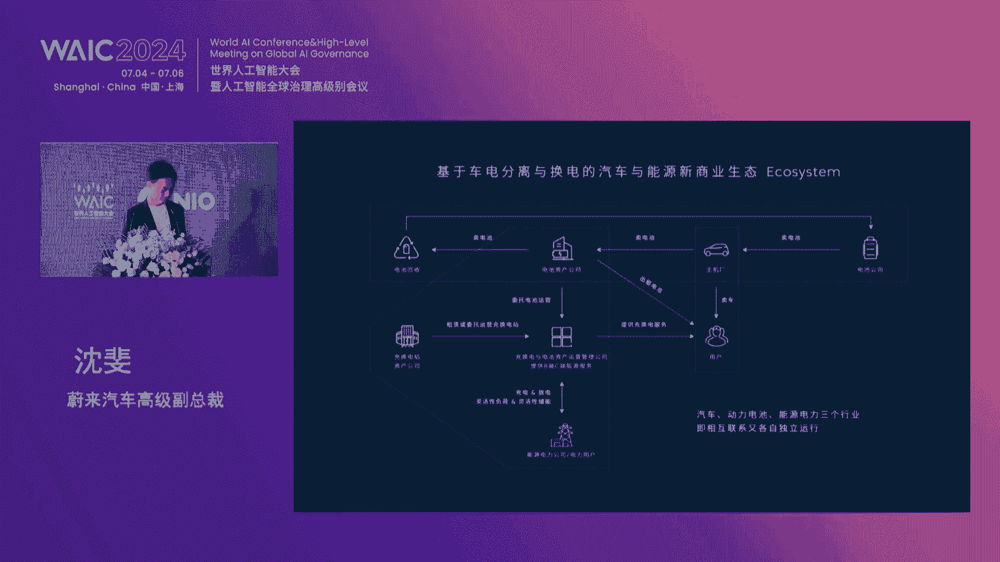
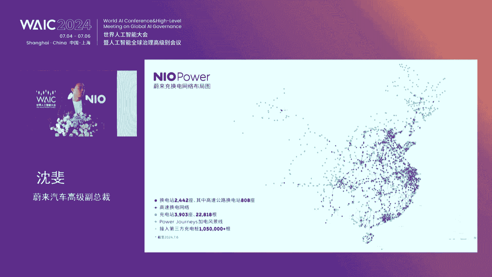
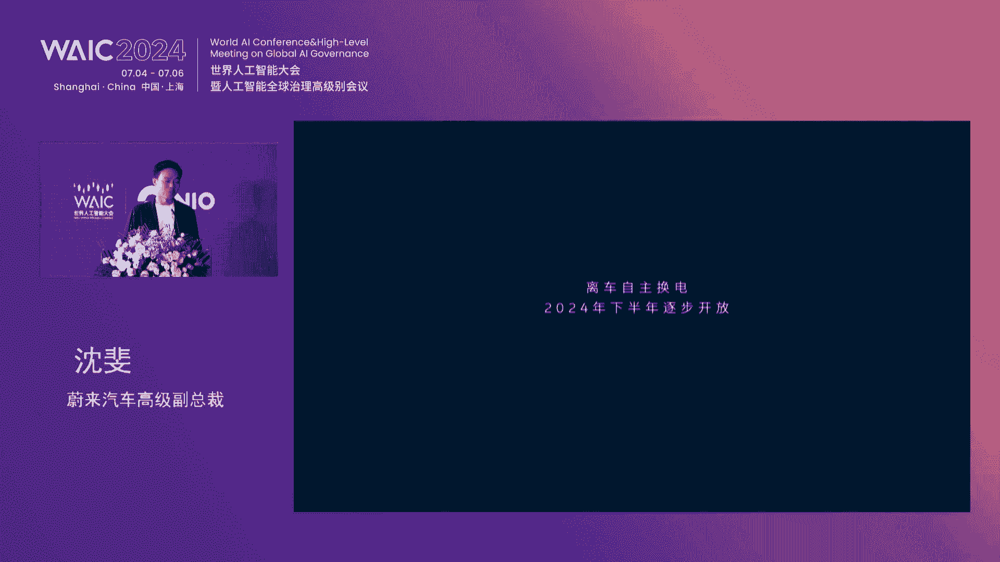
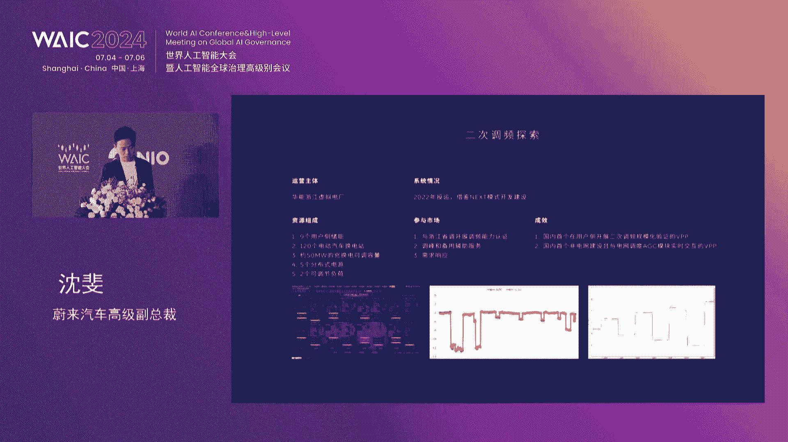
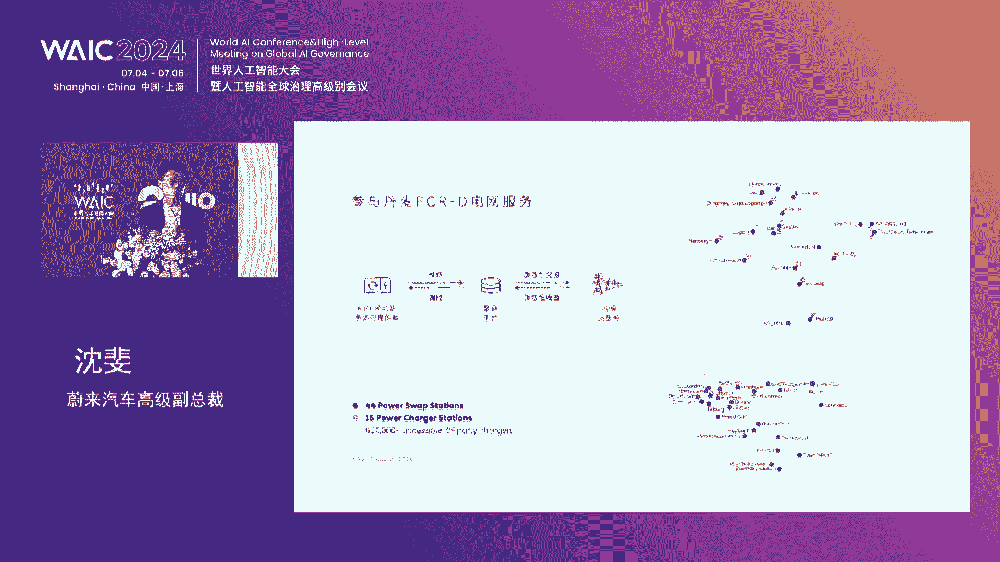
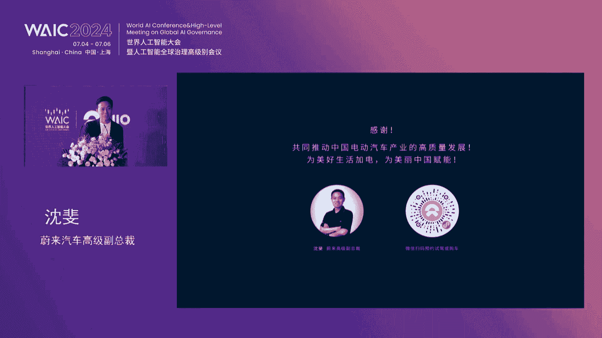
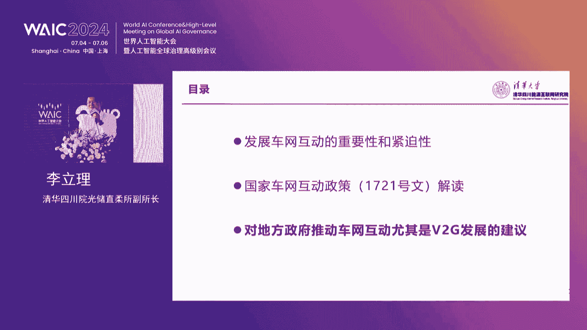

# 60：智能化助力交能融合与车网互动论坛精华解读 🚗⚡️🤖

## 课程概述
在本节课中，我们将学习2024年上海世界人工智能大会上“智能化助力交能融合与车网互动”论坛的核心内容。课程将聚焦于未来能源云、车网互动（V2G）、车路协同（V2X）等前沿概念，探讨智能化技术如何驱动交通与能源的深度融合，并分析其商业化路径与挑战。内容经过翻译、整理与提炼，力求简单直白，让初学者能够看懂。

---

## 一、 未来能源云：全方位智能能源服务 ☁️

未来能源云是一个全球首创的全方位能源服务系统。它接入了所有的未来车辆、电池、换电站、移动充电车、充电桩、服务专员等各类补能资源。





该系统通过海量数据运算，整合调度资源，并对未来情况做出预判，从而满足每一位用户发出的实时需求，帮助用户节省时间。




它旨在带来懂用户、令人安心、充满自由感和极致应用体验的能源服务。





**核心运作流程如下：**
1.  **用户发起服务**：当用户发起一键加电服务时，未来能源云会实时计算补能资源。
2.  **资源调度**：系统调度服务专员上门，并利用移动充电车、换电站、充电桩为用户提供补能服务。
3.  **服务理念**：实现“让电来找你”，告别补能焦虑。



此外，未来能源云能根据用户当下车辆电量、补能习惯、资源情况等进行个性化智能推荐。

当用户需要规划长途路线时，它还能根据实时路况信息、车辆电量、补能资源状况等，结合路程时间，预判并规划个性化的长途补能路线方案，让用户无需再为长途补能担忧。

在电池管理方面，未来能源云能够实时连接所有的电池数据，保证每一块电池处于最佳状态。换电时，换电站还能够通过图像识别技术检测电池壳体是否有磕碰痕迹，排除电池潜在隐患，保证用户换到的每一块电池都处于理想状态。

通过整体协调调度，电池能够始终维持在应力均衡状态，从而延缓衰减。

对于基础设施，未来能源云连接的换电站与充电桩，可以通过云端进行升级。同时它还使用了数字孪生技术，对各项设备进行监控，在故障发生之前，就能对设备状态实行预判。

---

上一节我们介绍了未来能源云的宏观构想，本节中我们来看看论坛上各位专家对具体实践与挑战的深入探讨。

## 二、 领导致辞与行业背景 🌐

论坛主持人、中国电力企业联合会的刘永东秘书长开场指出，智能化概念已融入各个行业，为发展提供新助力。交能融合与车网互动作为绿色交通体系及新型电力系统发展中的重要方向，受到广泛关注。

上海市经济和信息化委员会副主任汤文海先生在致辞中介绍了上海在新能源汽车和能源装备产业取得的成果，并指出下一步将重点聚焦三个方面的工作。

以下是上海未来的重点发展方向：
*   **推动智能网联汽车产业链高质量发展**：以单车智能为核心，车路云协同为关键支撑，支持端到端自动驾驶大模型研发，推动芯片装车应用，加强车用操作系统、智能底盘等核心产品研制。
*   **加强新型基础设施建设**：搭建虚拟电厂交易市场、一体化管理调度平台，推动智能充电桩更新改造和配电网智能化改造，有效聚合充电桩负荷调节能力，构建支撑智能网联技术发展的关键要素。
*   **强化应用场景建设**：打造智能出租、智能重卡等场景，引导光伏、储能、氢能等产品进入设备更新周期，通过智能工厂建设推进产品加速应用。

---

## 三、 主旨演讲核心观点 💡

### 3.1 未来汽车的创新实践
未来汽车高级副总裁沈飞博士指出，电动化是推动交能融合与车网互动的核心。他将电动汽车称为“配网侧灵活性调节资源的压舱石”，原因如下：
*   **容量足够大**：预计到2030年，全国近1亿辆电动汽车，即使仅以7千瓦功率接入，调节功率也达3.5亿千瓦。
*   **调节响应快且灵活**：结合智能化与大数据，每辆车的行为可预测，可精准参与调节。

未来汽车围绕“车电分离、可充可换可升级、车网互动”的策略进行实践。**车电分离**的逻辑在于电池与整车寿命不一致，分离后可大幅提升资源使用效率。**换电**是车电分离的物理基础，能提升用户体验、降低购车门槛，并提升电网容量利用率。

沈博士展示了未来在智能化方面的具体实践：
*   **智能驾驶**：全域领航辅助已覆盖726座城市，并推出“领航换电”功能，车辆可自动驶入服务区换电站。未来将实现“离车自主换电”。
*   **车网互动（V2G）**：通过虚拟电厂聚合换电站、充电桩参与电网调峰、调频，在国内及欧洲（如丹麦）均有成功实践，相关收益可覆盖换电站建设成本的相当一部分。
*   **本地能源管理**：通过换电站参与错峰充电，并建设“光储充换放”一体化综合能源站。

他总结认为，交能融合与车网互动是可见的巨大变革，并展望了三个阶段：未来汽车生态内尝试 -> 换电网络开放给产业，价值被认可 -> 建立通用换电网络，标准化与智能化广泛应用。

### 3.2 德国视角：挑战与机遇
德国能源署前署长安德利亚斯·库尔曼先生分享了德国能源转型的情况。德国目标实现80%的电能由可再生能源发出，这给电网平衡带来巨大挑战，因为电网增长速度赶不上太阳能、电动汽车、热泵等新资产接入的速度。

他认为，这种冲突给人工智能（AI）和数字化带来了机会。在电动汽车方面，他看好其作为灵活性调节资源的潜力，并分享了三个案例：
1.  **Mobility House**：利用电力市场价格波动，通过智能充电为电动汽车用户创造收益。
2.  **换电模式**：肯定其速度快、灵活性高的优点，认为在德国市场有巨大潜力。
3.  **3ti**：该公司结合高端硬件与能源管理系统，在电价为负时鼓励用户充电。

库尔曼先生也提到，欧盟的《人工智能法案》要求对AI系统进行分类管理，并确保数据质量与安全，这对能源领域的AI应用提出了规范要求。

### 3.3 车路协同（V2X）与能源效率
清华大学姚丹亚教授介绍了V2X技术的起源是解决交通安全问题（如盲区、恶劣天气导致的事故），后来发展为支撑自动驾驶的关键技术。

V2X的综合应用不仅提升驾驶安全和交通效率，也能与能源协同。他举例说明了V2X如何优化城市交叉路口信号控制：
*   **传统控制**：基于固定配时或有限实时信息。
*   **V2X加持后**：车辆提供实时位置，可更精准计算到达时间；甚至可协同控制车辆速度，实现“绿波通行”，从而降低整体能耗。

公式示例（简化）：优化目标函数可包含 **最小化总油耗/电耗** 或 **最小化总排队延误**。
```python
# 伪代码示例：优化目标（最小化总能耗）
def optimization_objective(signal_plan, vehicle_speeds):
    total_energy_consumption = calculate_energy(signal_plan, vehicle_speeds)
    return total_energy_consumption
```
此外，V2X也能提升像未来“自主换电”这类复杂场景的安全性。

### 3.4 人工智能与储能充电系统
复旦大学孙耀杰教授探讨了AI在储充联合系统中的应用。面对分布式电源、电动汽车等构成的“去中心化”能源系统，传统的集中调度模式难以高效管理成千上万的智能终端。

他对比了通用大模型与垂直行业大模型：
*   **通用大模型**：可能给出泛化信息，但缺乏精准性和安全性约束。
*   **行业大模型**：结合专业知识图谱，能给出聚焦、可靠的解决方案（如预测设备寿命、提供运维建议）。

其团队致力于构建基于多智能体（Multi-Agent）和AI大模型的系统，实现储充系统的多目标优化、自适应场景切换和智能运维。



### 3.5 智能网联技术架构
上海智能汽车创新发展平台首席架构师梁健先生提出了智能网联的六大技术体系架构，旨在实现“单车智能+网联赋能”的中国路线。

以下是六大技术体系：
1.  **多元数据汇聚技术**：构建超大型城市级数据平台。
2.  **以车带路的车路协同技术**：实现端到端能力标准化。
3.  **跨域共用的云控技术**：实现分层分域建设和共享。
4.  **人工智能与大模型技术**：挖掘应用服务价值。
5.  **区块链和隐私计算技术**：实现数据资产沉淀和商品化。
6.  **全方位安全技术**：提供可靠安全保护。

在节能方面，测试表明，使用云控车路协同巡航相比传统定速巡航，节油效果可达1.3%到5.3%。通过数据与算力共享，也能提升计算资源使用效率，减少能耗。

### 3.6 腾讯的“车云一体”AI驱动
腾讯智慧出行副总裁钟学丹先生提出，汽车行业的数字化正在向“智数化”转变，AI大模型驱动全场景业务变革。

腾讯通过“车云一体”的全栈架构能力助力汽车行业：
*   **在车端**：提升座舱交互智能（如场景化主动服务、用车知识问答），并助力智能驾驶研发（提供合规专有云、高精地图服务）。
*   **在企业端**：应用于研、产、销、服、管全场景，例如代码助手提升研发效率，AI节能方案降低工厂能耗10%-15%，数字人客服和营销工具提升服务与营销效率。

### 3.7 车网互动政策解读与建议
清华大学李立丽博士对国家四部委发布的《关于加强新能源汽车与电网融合互动的实施意见》进行了解读。这是中国车网互动的首个顶层设计文件，设定了2025年（试点突破）和2030年（规模化应用）的目标。

政策从技术攻关、标准体系、电价市场机制、V2G示范、充电设施互动化、电网升级六个方面部署任务。李博士特别指出，**私人V2G**是启动市场的优先场景，因其政策难度低、用户积极性高。

她对地方政府落实政策提出建议：
*   **启动私人V2G试点**：核心是建立“峰谷分时上网电价+电网并网结算服务+消费者权益保障”的政策组合拳。
*   **超前部署有序充放电体系**：应对未来大规模V2G带来的局部电网压力。
*   **创新市场化机制**：推动车网互动资源全量进入电力市场。

---

## 四、 圆桌讨论：商业化路径的挑战与机遇 💬

在圆桌讨论环节，各位专家聚焦商业化路径，进行了深入交流。

**沈飞博士（未来汽车）** 认为，企业端需找到用户体验与投资回报的平衡点。当前车网互动规模已到“等风来”的状态，企业应聚焦细分场景（如价差大的省份、特定合作项目）小步快跑，实现商业化。

**库尔曼先生（德国）** 指出，欧洲市场对新想法准备度更高，但规模化需要耐心。他观察到许多创新来自初创公司，而非传统巨头，需要政策和规则来释放潜力。

**武斌主任（国家电网）** 强调，电网侧当前重点是推动 **有序充电** 全面铺开，这对电网、社会、车主三方均有利。对于V2G，仍需通过示范项目验证技术、探索规律，为规模化商用奠定基础。

**张海涛副院长（中国电动汽车百人会）** 从交通绿色转型角度，指出电池寿命、低温性能等仍是短板，需因地制宜发展。能源作为基础设施，应积极与“车路云”融合，找到自身定位。

**姚丹亚教授（清华大学）** 类比车路协同发展经验，认为车网互动也面临“先有车还是先有网”的协同难题。他建议寻找细分领域深耕（如农村、别墅场景），或打造像“永不闯红灯”这样的独特卖点，实现单点突破。

**主持人刘永东秘书长总结**认为，车能路云是系统工程，需各方协同；核心驱动力应围绕 **服务车主**，让车主感受到便利与实惠；发展路径应 **分场景、小步快走**，逐步推动。

---

## 课程总结
本节课中，我们一起学习了智能化技术在交能融合与车网互动领域的应用与展望。我们从未来能源云的构想出发，深入探讨了车电分离、换电模式、V2G、V2X等核心概念，并了解了AI大模型在能源管理与汽车全链条中的应用。同时，通过对国家政策的解读和圆桌讨论，我们认识到这是一项涉及技术、标准、商业模式和市场机制的系统工程，其商业化路径需要聚焦细分场景，以服务车主为核心，通过小步快跑的方式逐步推进。智能化正在为交通与能源的深度融合开启无限可能。