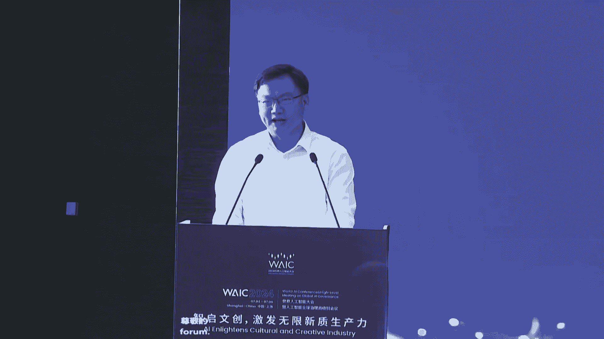
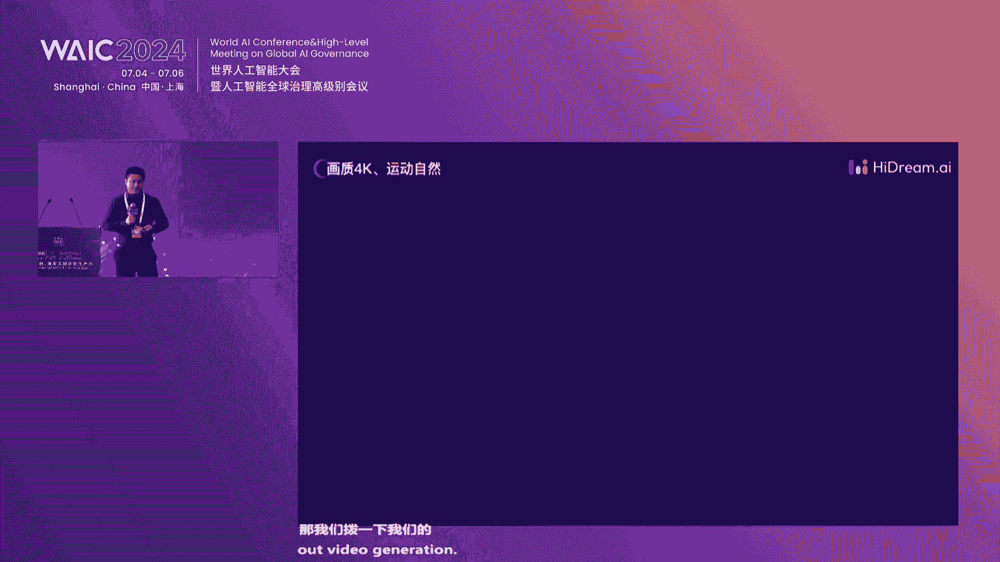
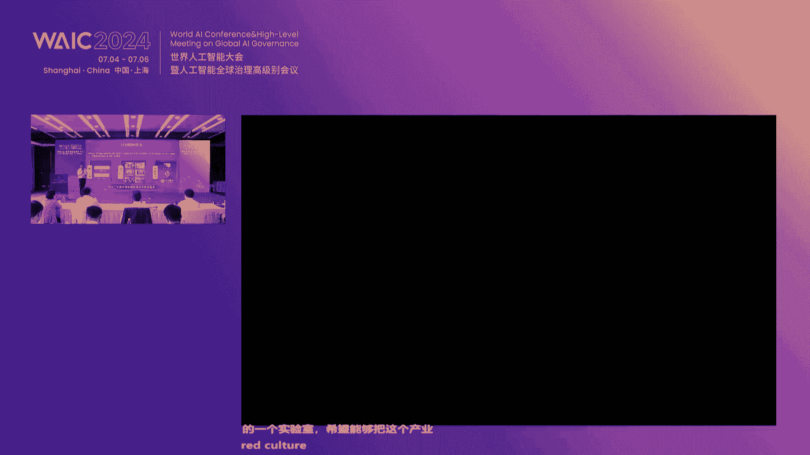
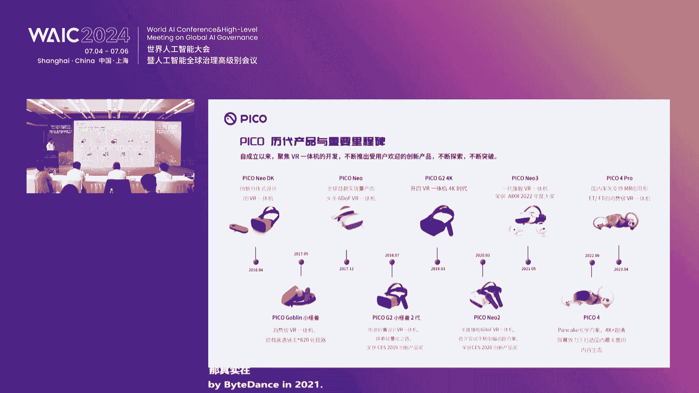

# 61：AI赋能文创产业核心技术与应用实践 🚀



在本课程中，我们将学习人工智能（AI）技术，特别是多模态大模型和AIGC（人工智能生成内容），如何为文化创意产业带来革命性变化，并激发新的生产力。课程内容基于“智启文创，激发无限新质生产力”论坛的核心演讲整理而成，涵盖了技术趋势、行业应用案例及未来展望。

---

## 一、 人工智能与文创产业的融合机遇 🤝

近年来，人工智能技术飞速发展，为文化创意产业带来了革命性变化，注入了新的活力。AI与文创结合所培育的新质生产力，为落实数字中国建设、加强数字文创和元宇宙新赛道的顶层设计与战略布局提供了新机遇。这有助于打造文创产业新的发展核心与爆发点。

上海市文化创意产业促进会等单位共同主办了相关论坛，汇聚了政府领导、院士学者及企业代表，共同探讨AI赋能文创的路径。

**核心公式：**
`新质生产力 = AI技术 + 文创产业`

---

## 二、 政策支持与上海的发展成果 📈

上一节我们介绍了AI与文创融合的宏观机遇。本节中我们来看看具体的政策环境与阶段性成果。上海在人工智能领域起步早、基础好、企业多、创新活跃，并围绕AI发展与治理进行了许多有益探索。

上海高度重视人工智能发展，全力推动AI赋能千行百业，在文创领域已形成一系列成果：

以下是三个突出的表现方面：
1.  **顶层设计与政策创新**：出台了大模型发展“政策11条”，实施算力补贴以降低企业创新成本，并通过市场化机制加速智算资源建设，同时引进培育各类大模型企业。
2.  **新兴动能不断增强**：建成了全国首个大模型创新生态社区，已吸引近80家企业在影视创作、数字文创、广告创意、电竞互动等领域集聚，形成了典型的场景与应用。
3.  **产业规模持续扩大**：在建设全球影视制作中心、创意设计高地、亚洲演艺之都、全球电竞之都等方面成效显著，产业增速位居全国前列。

面向未来，上海将把握通用人工智能发展机遇，持续开展核心技术攻关，培育开放优质生态，并建设典型示范应用，以高水平赋能文化创意产业。

---

## 三、 多模态行业大模型：AI产业化的新引擎 🏭

在政策与产业基础的支持下，技术本身正在快速演进。本节我们将深入探讨推动AI产业化的核心技术——多模态行业大模型。



大模型的发展在技术与产业层面呈现新变化：开源模型爆发、多模态成为标配、智能体（Agent）潜力释放；企业级AI应用向纵深发展，并与硬件结合带来新产业革命。

大模型之所以重要，在于它拓展了人工智能应用的深度和广度，主要源于其三大特性：**强大的泛化性**、**广泛的通用性**和**高效的实用性**。

大模型发展有三大趋势：
1.  **从单一模态向多模态演进**。
2.  **从通用大模型向行业大模型演变**。行业大模型基于基座模型，结合行业知识，能真正赋能产业数字化转型。
3.  **从模型到工具链的完善**。只有配备高效的工具链，模型才能解决具体的客户问题。



**核心概念（行业大模型构建）：**
```python
# 示意：行业大模型的生成逻辑
行业大模型 = 预训练基座模型 + 微调(行业高质量数据 + 行业知识规则 + 具体场景功能需求)
```



以“悠然多模态大模型体系”为例，其架构分为三层：
*   **模型层**：包含产业通用大模型和各种行业大模型。
*   **平台层**：即“Magic OS”人工智能操作系统，作为连接客户与模型的工具链。
*   **应用层**：将生成的模型落地到具体场景。

该体系已成功应用于多个行业：
*   **工业检测**：实现人机交互、知识管理及视觉检测的闭环。
*   **烟草行业**：实现数据统一管理、安全生产监测与内容生成。
*   **交通治理**：实现多元感知、智能识别与事件处理闭环。
*   **城市治理**：实现多设备接入、大小模型协同与事件协同处理。

---

## 四、 AIGC技术的演进、突破与产品化 🎬

除了理解大模型，内容生成技术本身也在飞速进步。本节我们来看看AIGC（人工智能生成内容）的技术演进与产品化现状。

多模态生成技术（如图像、视频生成）正沿着一条独立于语言模型的曲线快速发展。目前，视频生成技术大致可分为L1到L5五个能力等级，当前行业普遍处于**L2阶段**，致力于生成可靠、精细的单镜头内容。终极目标是L5——输入小说，输出电影。

然而，技术落地必须考虑产品化与商业化的核心三角：**成本、效率、体验**。目前，生成一秒钟视频的成本仍较高，渲染等待时间较长，且用户使用门槛有待降低。

未来，赋能行业需要**大模型与小模型、专家模型结合**的路径。例如，“志向未来”基于底层基础模型，结合行业小模型服务客户，并发布了全球首个商用的Diffusion Transformer模型。

其“志向大模型2.0”在以下方面实现突破：
*   **图像生成**：追求艺术感（美）、逻辑精准（准）、文字嵌入能力强（长）。
*   **视频生成**：实现4K画质、运动自然、用户可定制时长，并能直出分钟级视频。
*   **3D生成**：支持从文本生成3D模型，并可在VR/AR设备中交互。

**核心代码（示意视频生成）：**
```python
# 示意：基于提示词生成视频
video_output = generate_video(prompt="海底世界，从海面建筑沉入海洋", duration="60s", aspect_ratio="16:9")
```

---

## 五、 技术落地案例：红色文化的元宇宙探索 🏛️

理论和技术最终需要场景来承载。本节我们将目光投向一个具体的垂直应用场景——红色文化的数字化与元宇宙化。

“数字一大”元宇宙项目是上海市元宇宙重大应用场景之一，利用5G、AI、XR等技术，打造线上数字孪生空间、线下沉浸式交互空间以及虚实融合空间。

该项目聚焦四大方向：
1.  **文物数字化保护**：实现12.8万件革命文物的全本数字化，并在元宇宙场景中提供可翻阅的文物体验。
2.  **数字展陈**：构建原生元宇宙空间，串联红色故事，形成闭环式游览体验。
3.  **红色服务外延**：开发基于数字资产的大空间应用，并与线下城市打卡、旅游结合。
4.  **数字文创**：发行数字藏品，串联线上数字资产与线下实体文创。

该项目标志着红色文化元宇宙生态圈1.0版本的建成，其服务矩阵通过多元端口（APP、小程序、VR、大屏）触达用户，并期待与更多AI大模型机构合作，探索AI+元宇宙在红色文化传播上的新范式。

---

## 六、 XR与AI：赋能线下文旅新体验 🕶️

数字体验不仅限于线上，也在重塑线下。本节我们探讨扩展现实（XR）技术如何与AI结合，为线下文旅创造新的可能。

XR技术已超越早期的游戏和视频范畴，广泛应用于教育、医疗及线下娱乐。更强的算力、更高的清晰度、MR技术、大空间定位能力以及AI驱动的3D内容生产效率提升，共同使XR技术成为文旅新质生产力的重要引擎。

数字文旅3.0时代以数字化、智能化、虚拟化为趋势。XR线下体验展现出巨大潜力，全球市场已进入“亿元票房”里程碑阶段。

以PICO的实践为例，其通过与文博机构合作（如国家图书馆、敦煌研究院），推出了广受欢迎的VR体验项目。其中，**大空间VR体验**被认为是未来影院、展览和演出的新雏形。PICO提供从定位算法、播控能力到线下服务工具的全面解决方案，助力合作方“拎包开店”。

正在推进的项目包括“数字一大初心之旅”VR大空间、敦煌大空间等，旨在用XR技术讲好中国故事。

---

## 七、 圆桌讨论：AI与未来生活的多元展望 💡

技术的最终目的是服务人与社会。在本节中，我们通过一场圆桌论坛，汇集多位行业领袖，从不同视角展望AI与未来生活的融合。

讨论涵盖了多个前沿领域：
*   **游戏与云渲染**：AI用于游戏原画生成、3D资产创建、数字人生成与驱动，云端协同端侧算力实现实时超分，提升视觉体验。
*   **数字资产与区块链**：在AI时代，企业拥有的数据、内容是核心生产资料。通过区块链技术将其资产化，可与AI形成“生产力与生产资料”的良性互动，并实现价值交换。
*   **视频创作与出海**：AIGC降低了专业视频创作门槛。企业凭借音视频处理技术、海外本地化认知及对短视频平台算法的理解，可为商业客户提供智能剪辑、AI短剧、内容营销等出海服务。
*   **政务与法律服务**：AI在垂直场景（如政务热线、法律咨询）中能高效解决特定问题，创造显著社会效益。同时，AI生成内容的著作权归属等法律问题已有司法实践探索，强调人的创造性投入是关键。
*   **脑机接口与健康**：非侵入式脑机接口设备可精准采集脑电信号，用于睡眠监测、神经退行性疾病筛查，并通过神经反馈机制进行调控，未来在认知、情绪调控方面潜力巨大。
*   **教育咨询与金融信息**：在高考志愿填报等领域，AI基于垂直领域大数据，可提供个性化智能服务。在金融媒体领域，AI极大提升了资讯处理效率，并赋能智能投顾、投研等场景。

**核心观点**：AI不是要替代人，而是与人协同，释放人的创造力。AI应用场景无高低之分，关键在于解决真实问题。同时，在拥抱AI时，需关注数据资产化、标准输出、法律法规等配套建设。

---

## 八、 总结与展望 🌟

在本课程中，我们一起学习了AI赋能文创产业的全景图。

我们从**宏观机遇**与**政策环境**出发，了解了AI与文创融合的巨大潜力。接着，我们深入探讨了核心驱动技术——**多模态行业大模型**和**AIGC**的演进、架构与落地逻辑。通过“数字一大”和“XR文旅”等**具体案例**，我们看到了技术如何在红色文化传承、线下体验升级等垂直场景中创造价值。最后，通过**圆桌讨论**，我们展望了AI在游戏、法律、健康、教育、金融等更广阔领域与未来生活融合的多元可能性。

总结而言，AI技术正深刻改变文创产业的生产方式、体验形式和产业边界。未来，持续的技术创新、开放的产业生态、深度的场景融合以及对伦理、法律、标准的关注，将共同推动AI与文创产业迈向更加无限的新篇章。

---
**课程编号：** P61
**课程来源：** 智启文创，激发无限新质生产力论坛 (20240706)