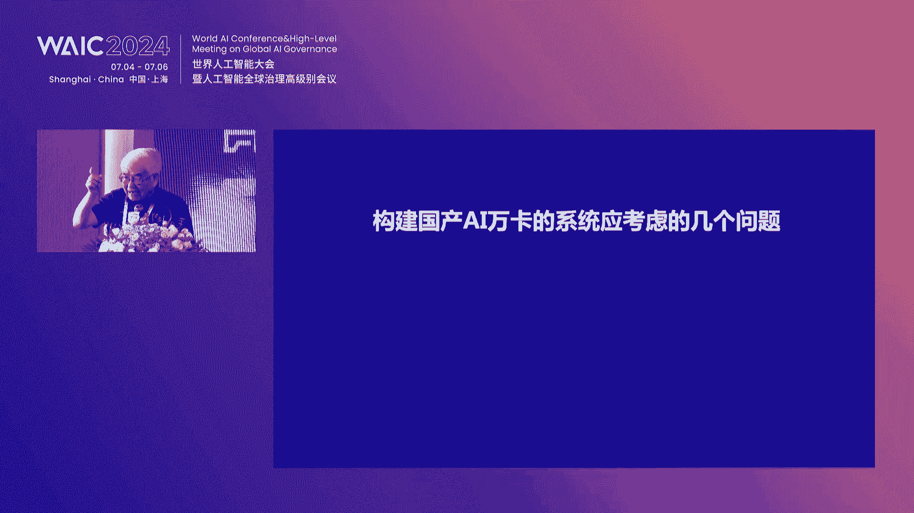
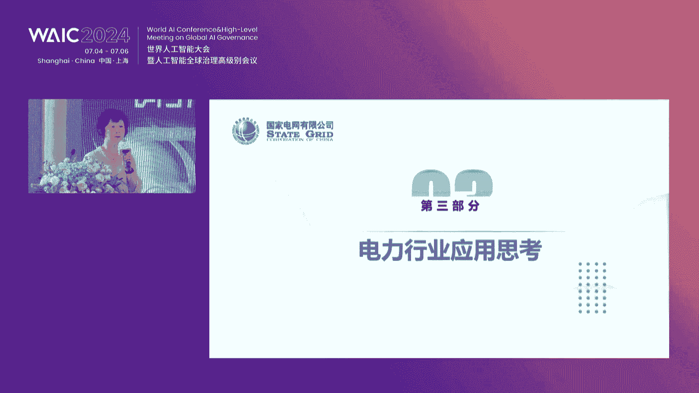

# 62：AI创新生态构建与挑战 🚀

## 概述
在本节课中，我们将学习2024年中兴通讯AI创新生态论坛的核心内容。课程将涵盖AI技术发展趋势、国产算力生态构建的挑战与机遇、大模型在各行业的应用实践，以及如何通过开放合作推动产业繁荣。我们将深入探讨技术细节、产业痛点及解决方案。

---

## 一、开场致辞与行业背景 🌉

🎼 欢迎各位来到中兴通讯AI创新生态论坛。今天我们齐聚上海，共同探讨数字经济发展新机遇、行业数字化转型以及AI数据新纪元。

**核心观点**：AI正从“助手”角色转变为“基础设施”。它代理企业、人类与个人的知识，但当前发展面临生态封闭与供应受限两大问题。解耦是繁荣生态的根本方法。

**中兴通讯的定位**：我们愿做“一根扁担”，连接算力芯片供应商与AI生态需求方。我们凭借在计算互联芯片、IDPU芯片及复杂软硬件集成领域30年的积累，致力于打造开放赋能、自主创新的智算底座。

**公式/代码描述核心能力**：
*   **网络互联能力**：基于多年网络经验，优化算力互联。
*   **软硬件集成能力**：`Complex_System_Integration(Hardware, Software, Platform, Model) -> Deployable_Product`

---

## 二、构建国产AI算力生态的挑战与路径 🏗️

上一节我们介绍了AI作为基础设施的定位，本节我们来看看构建这一基础所面临的具体挑战，特别是国产算力生态的建设。

中国工程院院士指出，构建国产AI万卡系统至关重要但也充满挑战。大模型发展进入多模态、与行业深度结合的新阶段，算力需求贯穿其全生命周期。

### 大模型对算力与存储的需求
以下是模型生命周期各环节对算力与存储的要求：

1.  **研发与训练**：需要大规模算力进行模型训练（如GPT-3使用上万张卡）。数据预处理（占时近半）和训练过程对存储IO性能要求极高。
2.  **模型精调**：针对特定领域（如医疗）在基础大模型上进行再训练，也需要可观算力。
3.  **模型推理**：处理用户实时请求，成本中算力占比高达95%。

### 构建万卡系统的五大关键问题
构建高性能万卡集群需系统化解决以下问题：

1.  **运算精度平衡**：需兼顾FP16/INT8等低精度运算性能与FP64等高精度运算能力，比例需合理（如1:50至1:100）。
2.  **网络平衡设计**：万卡互联拓扑设计是核心挑战。全连接代价过高，需采用分组（如百卡一组）等分层互联策略，权衡成本与通信效率。
3.  **内存平衡设计**：大模型即大数据，需优化内存访问模式，避免拥塞。
4.  **IO子系统平衡设计**：万卡集群平均无故障时间短，必须实现高效的“检查点”机制。需通过SSD缓存、优化文件系统等手段，将检查点保存时间从小时级降至分钟级。
5.  **软件生态建设（国产卡核心）**：国产卡生态相比英伟达仍有差距，关键在于降低用户移植和开发成本。

### 国产算力生态的痛点与破局
**痛点**：国外算力获取难；国产算力使用麻烦、种类多、效率相对低；每家芯片公司需支持众多模型，适配工作量大。

**破局思路**：
*   **使用国产算力**：这是根本方向。
*   **构建统一软件栈**：对接主流生态（如TensorFlow/PyTorch），提供统一并行编程模型，降低不同芯片的优化成本。
*   **并行计算与智能编译**：挖掘国产算力硬件性能。
*   **共建开放生态**：通过广泛使用与反馈，共同改善体验。

**核心软件栈列表**：
以下是构建健康生态必须做好的十个关键软件：
1.  编程框架（如PyTorch）
2.  并行加速库
3.  通信库（如NCCL）
4.  算子库
5.  AI编译器
6.  编程语言
7.  调度器
8.  内存分配系统
9.  容错系统
10. 存储系统

---

## 三、中兴通讯的AI生态实践：开放、强网、训推并举 ⚙️

上一节我们探讨了国产算力生态的宏观挑战，本节中我们来看看企业层面的具体实践方案。

基于对AI生态从1.0（同构同质）向2.0（异构异质）演进趋势的判断，需加速三个转变：从训练竞赛向推理落地转变；从追求极致性能向性价比优先转变；从垂直封闭生态向开放解耦生态转变。

### 四大举措
1.  **开放基座，多元算力灵活供给**：
    *   推出R6965系列AI服务器，兼容多种算力卡（CPU/GPU），支持风冷/液冷，实现“换芯不换座”。
    *   基于TECS云网底座升级，实现通算与智算资源的统一纳管，支持异构算力原生供给和混布训练。
    *   提供集群、轻量化、插件化三种交付模式，与第三方平台集成。

2.  **以网强算，打造高效万卡集群**：
    *   **机内**：采用Olink交换互联架构，替代Mesh互联，降低复杂度，提升单机算力密度。
    *   **机间**：通过DPU卸载和全局流控，实现智能路由，提升吞吐量，降低时延。
    *   **集群**：提供超大容量星云网络，支持无损以太网灵活扩展，最大支撑36000+ GPU卡集群。

3.  **训推并举，加速商业闭环**：
    *   **训练**：探索非张量拆分与异构并行，通过集合通讯库转换，实现跨厂家GPU构建大规模集群。
    *   **迁移**：推出Air Booster迁移工具，实现主流大模型跨平台快速迁移（约1-2周）。
    *   **推理**：推出智能感知分发系统，根据算力配置、内存、精度等，为不同应用分配合适的推理平台。

4.  **多方合作，催熟AI产业生态**：
    *   建立Cloud AI开放算力实验室，构建多厂家芯片、服务器、平台、模型的互联测试平台。
    *   推出开放一体机，集成业界主流大模型与AI应用，开箱即用。
    *   倡导软硬解耦、训推解耦、模型与应用解耦的开放共赢生态。

---

## 四、行业应用实践：电力、企业级大模型与艺术创新 🎯

技术与生态的最终价值在于应用。本节我们聚焦AI在电力、企业服务及文化艺术等领域的实践与思考。

### 国家电网：AI在新型电力系统中的应用
*   **应用现状**：将AI规模化应用于电网生产、运维、客服等环节，处于起步阶段。成熟场景包括输电通道智能巡检、变电站智能巡视（CV领域）及声纹分析（在电磁干扰环境中更具优势）。
*   **核心挑战**：
    *   **可靠性要求极高**：电力系统控制需绝对可靠，AI决策必须可解释、可控。
    *   **大模型应用谨慎**：大模型的黑盒特性使其暂不适合调度控制等精准决策场景，更适合辅助决策、缺陷识别。
    *   **算力与成本**：大模型训练算力需求是传统的数十倍，推理也达数倍。
    *   **多模态需求**：故障诊断需融合图像、声音、历史数据等多维信息。
*   **未来方向**：探索基于图计算、神经网络重写电力系统计算软件；发展可解释AI；统筹分布式算力，训练百亿级行业模型。

### 阿里云：企业级大模型与RAG场景应用
企业级大模型落地需保证准确性、安全性与低延迟。RAG是关键技术路径。

**RAG系统构建的七大阶段**：
1.  **数据接入**：支持多格式、多语言、非结构化数据接入。
2.  **文档拆分**：正确切分文档是结果准确的基础。
3.  **索引构建与存储**：结合传统搜索索引与向量嵌入索引，平衡效果与稳定性。
4.  **生成**：提供模型微调、长上下文缓存与一致性校验。
5.  **检索（预/中/后）**：
    *   **预检索**：Query路由、改写与扩展。
    *   **检索**：多重检索器，支持微调迭代。
    *   **后检索**：结果重排、压缩，供大模型高效处理。
6.  **评估与调试**：提供可观测系统，支持单步调试，快速定位优化点。
7.  **部署与开源**：提供一键部署产品，并将整套系统开源，共建社区。

### 智谱AI：打破企业智能边界
企业智能边界可通过技术不断外延。大模型应被视为**能力集合**，而非功能API。

**企业大模型就绪度阶段**：
1.  **M-Ready**：调整业务、数据、团队以适应大模型。
2.  **AI-Native应用开发**：开发AI原生的应用。
3.  **企业M化**：调整组织结构与工作流程。
4.  **AI驱动创新**：以AI驱动企业全流程创新。

**就绪度检查清单**：
*   **技术**：评估驱动开发、API能力化。
*   **团队**：技能重组、流程变革。
*   **基础设施**：算力规模升级。
*   **产品**：重新思考产品定义，从用户故事出发端到端重构。

### 上海戏剧学院：AI时代的线下大空间沉浸演绎
AI在艺术创作中助力概念生成，但高质量落地仍需复杂工程。

*   **实践**：开发大型多人空间沉浸式演绎项目，结合空间定位、实时渲染、神经技术。
*   **挑战**：
    *   超高分辨率渲染（如球幕LED）算力需求巨大。
    *   多用户并发下的实时渲染与数据传输（如VR设备）面临算力、延迟、信号干扰挑战。
*   **合作价值**：与中兴等厂商合作，将算力与传输优化等工程难题剥离，让艺术家聚焦创作。AI目前是强大的辅助工具，未来目标是实现自然语言驱动完整创作流程。

---

## 五、算力基础设施与生态合作实践 💻

上一节我们看到了AI的多元化应用，本节我们回归底层，看看支撑这些应用的算力基础设施厂商如何应对挑战并推动合作。

### 壁仞科技：国产大算力GPU的落地实践
大模型落地是算法与工程的协同创新。壁仞从三个维度构建解决方案：

1.  **硬件集群算力**：采用Chiplet等先进封装技术，提供从板卡到集群的全栈产品。
2.  **软件有效算力**：
    *   **并行扩展**：创新ZeRO优化、自动混合并行策略搜索，降低使用门槛。
    *   **调度效率**：拓扑感知调度、3D异步检查点（降低开销）、动态资源迁移与弹性伸缩，提升资源利用率。
3.  **异构聚合算力**：通过抽象通信层、流式并行等策略，实现与英伟达GPU等异构集群协同训练，效率可达99%。
4.  **生态策略**：坚持开源开放，通过代码定向开源赋能深度合作伙伴；提供完善迁移工具降低用户成本；与高校合作培养生态人才。

### 中国移动：大规模超万卡新型智算集群的展望
AI进入“超万卡集群”新时代。中国移动在构建万卡集群基础上，开展前沿技术研究：

1.  **全调度以太网**：原创GSE网络技术，从报文级分发、主动拥塞控制、全局调度等方面提升网络性能，正推进芯片研发与试点。
2.  **卡间互联协议**：针对国内开放交换互联空白，提出“欧拉”全向智联开放协议，旨在通过IP授权推动产业闭环。
3.  **跨集群分布式训练**：研究园区（<10km）、同城（<100km）、跨省（>1000km）三级场景的算力池化技术，分阶段解决网络与电力问题。
4.  **跨架构平台迁移**：算原生平台已实现异构芯片推理统一调度，正探索面向异构的混训技术。

---

## 六、圆桌论坛：挑战、风险与开放生态共建 🤝

在最后的圆桌讨论环节，来自芯片、模型、应用、研究机构的专家共议AI推广的困难与生态共建。

### 主要困难与风险
*   **商飞智能**：严肃行业面临AI“幻觉”与可解释性问题；数据安全敏感；人机决策权转移困难；终端用户提示工程能力不足。
*   **上海人工智能研究院**：政策法规滞后于技术；芯片研发成本高、商业化不明；大模型落地难、算力成本高；行业用户AI能力有差距；存在隐私侵犯、信息造假等道德风险。
*   **百川智能**：基座大模型缺乏领域数据；人模交互成本高（提示词撰写难）。
*   **寒武纪/摩尔线程**：用户对芯片要求“既要又要还要”（高性能、低价格）；模型技术路线未收敛，芯片适配碎片化；万卡集群是超级系统工程，挑战巨大。
*   **中国电子云**：需解决多元芯片统一调度、模型与芯片解耦、数据要素资产化与安全使用等问题。

### 开放合作生态的构建
*   **芯片厂商**：
    *   **寒武纪**：硬件接口标准化以降低成本；软件开源开放，参与社区共建。
    *   **摩尔线程**：兼容CUDA生态；与国内同行协作拓展本土生态；参与开源社区与联盟。
*   **大模型厂商**：
    *   **百川智能**：明确“不做场景应用、不做总集”的定位，通过两种模式合作共赢：1）与行业客户共创，快速落地并练兵；2）与有客群和技术的ISV合作，由ISV交付。
*   **行业应用方**：
    *   **商飞智能**：定位为“系统集成商”，探索点（单点场景）、线（业务流程）、面（多智能体协同）的AI应用路径，最终构建企业级“机械文明”。
    *   **中国电子云**：作为“国家队”，聚焦算力调度、数据要素资产化、行业大模型应用，整合生态产品面向关键行业输出。
*   **研究机构**：
    *   **上海人工智能研究院**：促进芯片商、科研团队、行业用户多方交流，形成应用闭环，实质性推动产业发展。

---

## 总结
本节课中，我们一起学习了AI创新生态的全景图。我们从**宏观趋势**认识到AI成为基础设施以及国产算力生态建设的必要性与复杂性；从**技术实践**层面了解了中兴通讯等企业如何通过开放基座、以网强算、训推并举来构建解决方案；从**行业应用**视角看到了AI在电力、企业服务、文化艺术等领域的价值与挑战；最后，通过**圆桌讨论**，我们深刻体会到，面对算力、数据、安全、成本等多重挑战，唯有打破壁垒、坚持**开放合作**，才能汇聚产业力量，共创智慧未来。预测未来最好的方式，就是共同创造未来。