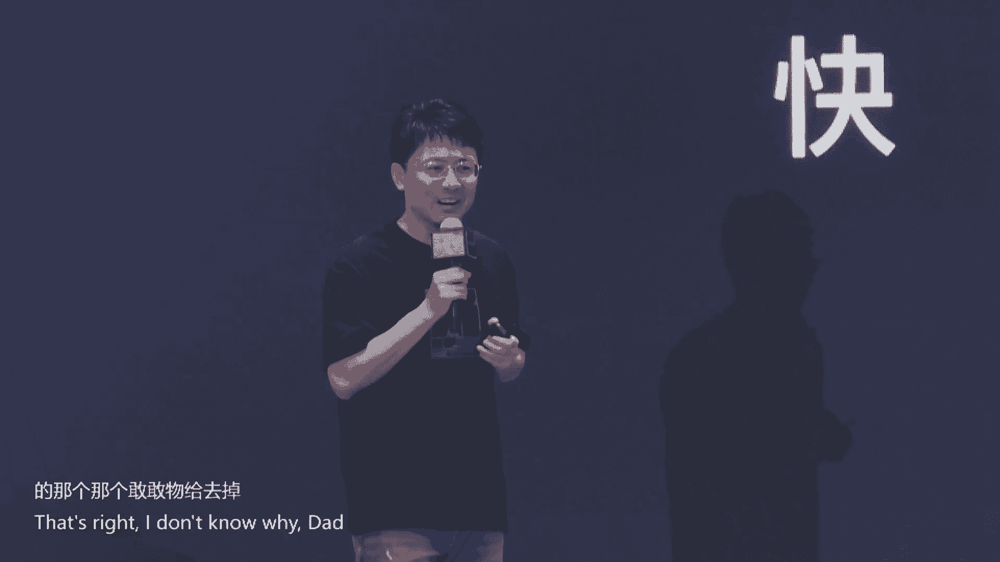
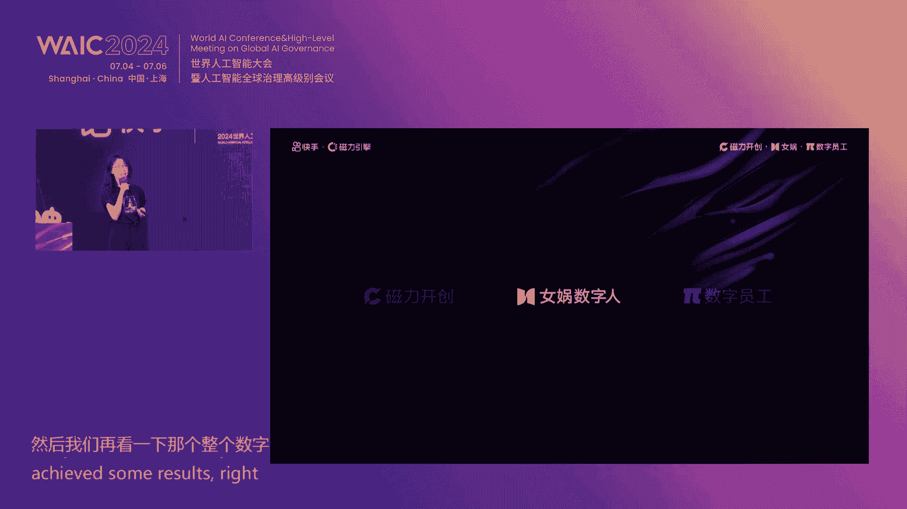
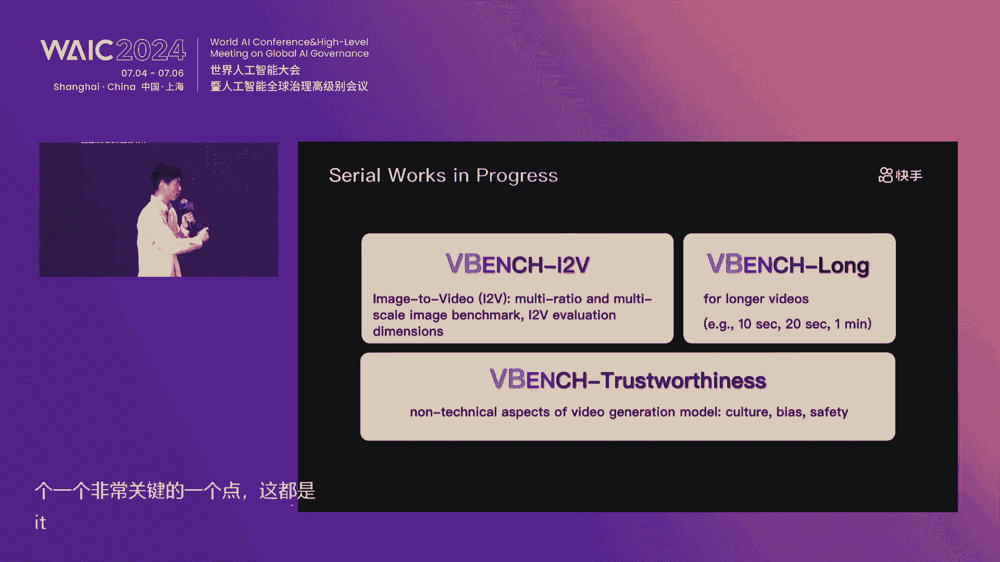

# 63：快手大模型技术与应用战略全解析 🚀

在本节课中，我们将全面学习快手在2024世界人工智能大会上分享的大模型技术全景、核心产品发布及其商业化应用战略。我们将深入探讨快手的语言大模型、推荐大模型、视觉生成模型，并了解这些技术如何驱动其核心业务与商业化增长。

## 概述：快手与AI的深度融合

快手是一家真正以AI为核心的短视频直播平台。如果没有以机器学习为代表的AI技术，快手的短视频推荐业务将无法成立。AI技术贯穿于快手业务的三大核心环节：**内容推荐**、**内容理解**和**内容生产**。

随着大模型时代的到来，快手正致力于用新技术改造和创新这三大AI模块，构建了包括推荐大模型、语言大模型（快意）、多模态理解模型以及视频生成大模型（可灵）在内的完整技术体系。

---

## 一、 快手大模型技术全景

上一节我们概述了AI对快手业务的核心价值，本节中我们来看看快手大模型家族的具体构成与技术路线。

快手已经构建了支持万亿参数大模型训练和推理的基础设施。在此之上，研发了领先的三大类模型：

1.  **语言大模型 - 快意**：用于文本理解、生成与交互。
2.  **推荐大模型**：用于核心的短视频内容分发。
3.  **视觉大模型**：包括文生图模型**可图**和视频生成模型**可灵**，用于内容生产。

这些模型通过统一的应用服务平台，支撑着快手包括短视频、直播、广告、电商、本地生活在内的所有重要业务。

---

## 二、 语言大模型：快意的能力与商业落地

快手自研的语言大模型“快意”经过多个版本迭代，在内部盲测中，其中文综合能力已达到GPT-4的水平。

面对行业“百模大战”，快手交出了一份清晰的商业答卷。快意大模型已深度应用于商业化领域：

*   **视频脚本生成**：为广告主自动生成短视频广告脚本。
*   **直播实时脚本**：辅助直播带货，生成实时话术。
*   **智能客服**：用于广告线索的承接与初步沟通，结合数字人技术。

**应用成果**：基于AIGC的广告消耗从年初近乎为零，快速增长至**日均消耗近2000万**，峰值日消耗远超2000万。这验证了大模型在快手平台上的明确商业路径与应用价值。

---

## 三、 推荐大模型：驱动业务增长的引擎

推荐是快手最传统也最核心的AI技术。快手构建了全球领先的推荐大模型技术。

**技术亮点**：
*   **模型规模**：线上版本参数达**10万亿量级**，远超当前主流语言大模型的参数量级。
*   **序列处理**：可对每个用户处理长达**百万级**的行为序列，充分挖掘用户兴趣。

**业务影响**：该技术已助力快手过去3-4年的用户时长、留存和DAU持续增长。

**下一代技术**：快手正在研发基于Transformer架构的下一代推荐大模型——**Action Transformer**。它能近乎无损地对用户全生命周期行为序列建模，单次上线即为快手APP带来**每天超4亿分钟**的用户时长增长。

---

## 四、 视觉生成大模型：可图与可灵

视觉生成是当前AI领域最受关注的方向之一，快手在此领域发布了两个重磅产品。

### 4.1 文生图模型：可图 🖼️

可图是一款面向全部用户开放的文生图产品，其特点如下：

*   **效果领先**：在内部与全球知名产品的盲测对比中名列前茅，是全球顶尖的文生图产品之一。
*   **核心能力**：
    *   **强大的语义理解与指令跟随**：能精确还原复杂文本描述中的细节。
    *   **电影级画质**：通过渐进式训练和强化学习对齐人类审美，生成具有摄影质感的图像。
    *   **出色的控制生成**：支持多种风格、人像保持、轮廓保持，并拥有独特的“写字”能力。
*   **重磅发布**：可图模型于大会当天正式**开源**，成为可用的最佳开源文生图产品之一。

### 4.2 视频生成模型：可灵 🎬

可灵是快手发布的影像级视频生成大模型，自6月6日发布后在全球范围内引起广泛关注。

**核心能力亮点**：
1.  **大幅度合理运动**：生成符合物理规律、运动幅度真实的视频。
2.  **分钟级长视频生成**：支持生成及续写最长3分钟的视频。新版模型单次生成长度从5秒提升至10秒。
3.  **复杂物理仿真**：能精细模拟如“吃面”、“给猫洗澡”等复杂交互场景的物理特性。
4.  **强大的概念组合**：基于跨模态理解，生成充满想象力的视频内容。
5.  **电影级高清画质**：新版“高画质版”在细节、构图、光影上实现质的飞跃。
6.  **领先的图生视频**：支持首帧、首尾帧控制，实现精确的镜头转场和一镜到底效果。
7.  **丰富的可控性**：提供多种预设及可调参数的镜头运动控制（如推、拉、摇、移）。

**发布成果**：申请用户超50万，已开放近30万内测资格，用户累计生成视频超700万条。

**本次大会重磅发布**：
*   **基础模型升级**：发布“高画质版”，画质显著提升。
*   **控制能力增强**：上线“首尾帧控制”和“镜头控制”功能。
*   **易用性提升**：推出**Web端一站式创作平台**，集成文生图、文生视频、图生视频功能。
*   **启动创作大赛**：设立30万奖金池，与六所高校合作，优胜者可加入“星芒短剧创作者孵化计划”，获得百万现金和千万流量扶持。

**技术方案**：可灵采用基于Transformer架构的扩散模型（DiT），通过自研的3D VAE对视频进行高效压缩，使用时序空3D注意力机制充分建模信息，并依赖海量高质量数据与自动化处理平台进行训练。

---

## 五、 大模型的商业化应用实践

本节我们来看看快手如何将大模型技术转化为实际的商业增长。商业化应用主要围绕三个产品展开，取得了显著成效。

以下是三大商业化产品的核心数据与应用场景：

| 产品名称 | 核心功能 | 关键数据/成果 | 主要应用场景 |
| :--- | :--- | :--- | :--- |
| **磁力开悟** | AI生成广告素材 | 峰值支持单客户单日生产10万条；视频成本从200元/条降至约0.47元/条；三秒播放率、点击率显著提升。 | 为广告主提供一站式视频素材生成，大幅降低创意成本，提升投放效率。 |
| **女娲数字人** | AI数字人直播 | 日均广告消耗约1700万；直播间搭建成本极低，可实现24小时直播；在ROI中等区间表现优于真人直播尾部梯队。 | 替代部分真人直播，尤其在冲量、日常店播等场景，实现降本增效。 |
| **派（营销Bot）** | 智能线索承接与互动 | 日接待用户约22万；5分钟回复率提升30%，开口率提升11.6%，有效线索获取率提升39%。 | 作为“数字员工”承接广告线索，进行智能客服与互动，提升线索转化效率。 |

**演进路径**：商业应用的成功并非一蹴而就。初期版本效果粗糙，通过坚持“人在回路”（Human-in-the-loop）的迭代模式，紧密洞察用户需求，使产品从“不可用”逐步演进至“可用”甚至“好用”。

**未来方向**：
1.  探索**图生视频**在小说等内容领域的应用。
2.  开发数字人2.0，实现**数字人与真人连麦互动**。
3.  将“派”从数字员工升级为行业**专家顾问**，更深度解决用户问题。
4.  在广告投放端，利用大模型优化冷启动和商品理解，实现更智能的投放。

---

## 六、 产学研合作与未来展望

为推动大模型技术发展，快手与**中国计算机学会（CCF）** 联合发布了 **“CCF-快手大模型探索者基金”**。该基金旨在连接产业实践与学术科研，在代码大模型、视频处理、多模态理解与生成等12个课题上提供资金、算力、场景和数据支持，促进成果转化。

**对视频生成技术的展望**：
*   **效果快速提升**：生成质量正逼近图形渲染与实拍，将为游戏、动画、影视产业带来新机遇。
*   **生产消费界限模糊**：极大降低视频创作门槛，促进内容生态繁荣。
*   **作为世界模拟器**：为具身智能提供仿真训练环境。
*   **技术持续演进**：未来将向多模态统一模型发展，推理成本和延时将持续降低，加速行业落地。

---

## 总结

本节课中我们一起学习了快手大模型技术与应用战略的全貌。我们了解到：

1.  **技术体系**：快手构建了覆盖语言、推荐、视觉生成的完整大模型家族，并拥有强大的底层基础设施。
2.  **核心产品**：语言模型“快意”已实现规模化商业应用；推荐大模型持续驱动业务增长；视觉模型“可图”和“可灵”在效果上达到全球领先水平，并持续快速迭代。
3.  **商业闭环**：通过“磁力开悟”、“女娲数字人”、“派”等产品，快手已将大模型能力深度融入广告、电商等商业化场景，形成了清晰的增长路径。
4.  **开放生态**：通过开源可图模型、发布产学研基金，快手正积极与学术界、产业界合作，共同推动大模型技术发展。

快手正以其深厚的技术积累、丰富的业务场景和务实的应用策略，在大模型时代坚定地探索着“新AI、新应用、新生态”的未来。