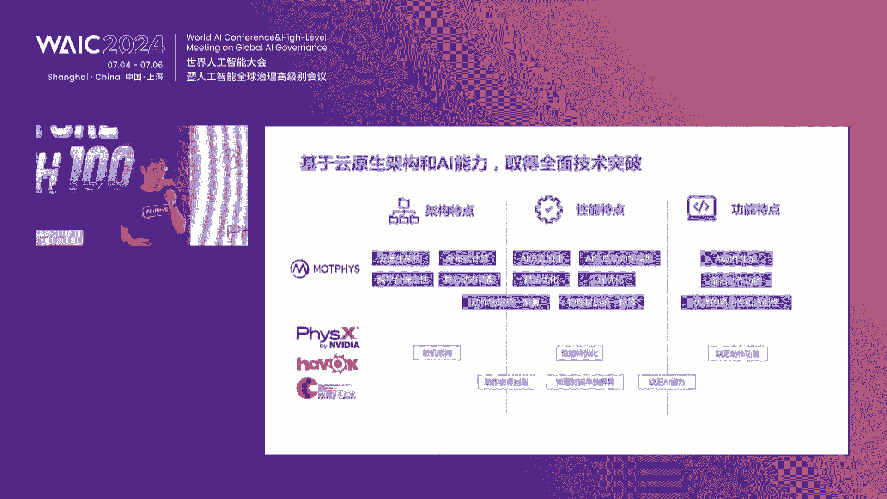
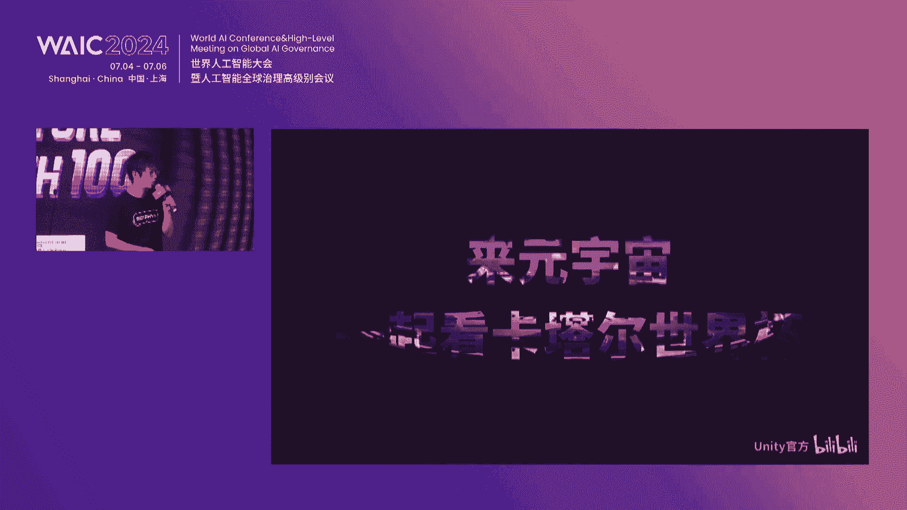
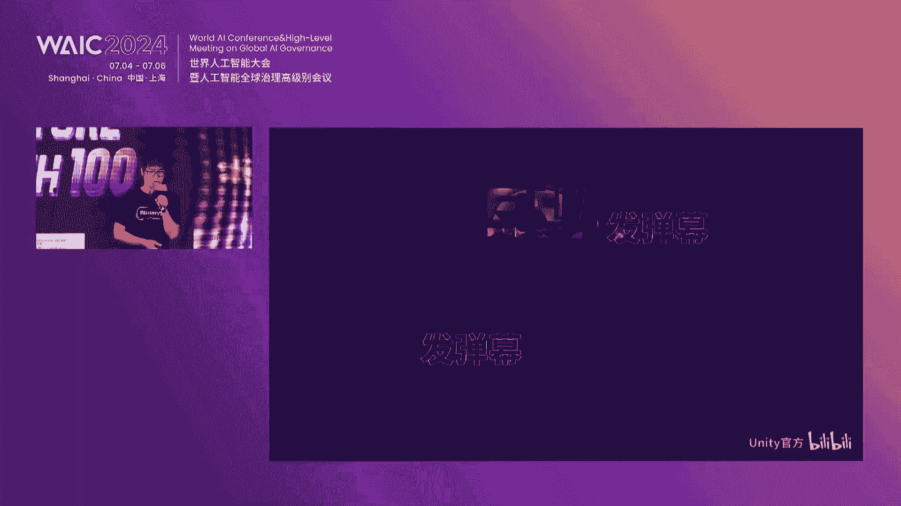
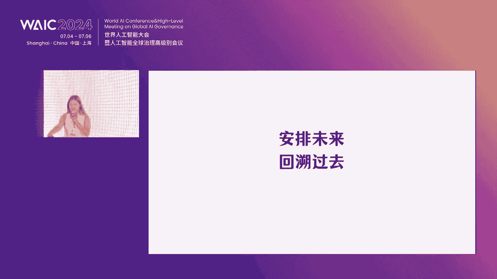
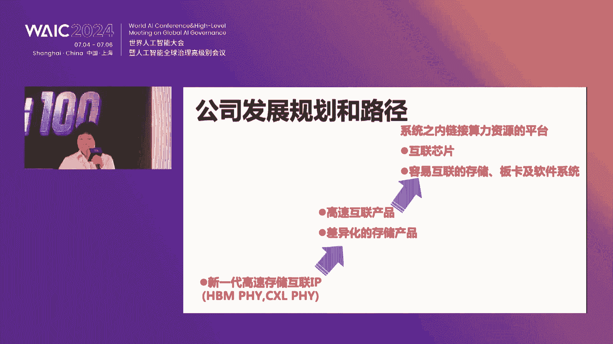

# 65：AI与前沿科技项目路演解析 🚀

## 课程概述
在本节课中，我们将学习并解析一场关于AI与前沿科技（包括量子计算、智能算力、3D生成等）的创新项目路演。我们将深入了解各公司的核心技术、市场定位、商业模式以及团队背景，旨在帮助初学者理解当前科技创业的热点与趋势。

---

## 第一节：制造业的通用AI大脑 🏭

英达市苏州智能科技有限公司介绍了其创新的“制造业巨深智能设备大脑”。该公司定位在AI加制造业领域，旨在打造制造业的通用大脑。

上一节我们介绍了课程概述，本节中我们来看看第一个路演项目的核心内容。

### 团队构成
以下是其核心团队的三类关键画像：
1.  **特斯拉经验团队**：创始团队曾直接向埃隆·马斯克汇报，在2017-2019年将AI应用于特斯拉汽车总装产线。
2.  **谷歌专家**：从谷歌RT团队请来了专家Heman，他精通巨深智能技术，负责将该技术应用到工业场景。
3.  **制造专家**：团队成员来自全球各行业头部制造企业，深谙工艺与产线，拥有产线研发经验。

正因为聚齐了这三种人才，团队能快速理解客户需求并开发通用性产品。

### 精准切入的应用场景
该公司从 **ATP（组装、测试、包装）** 场景切入离散制造领域。选择此场景基于两点行业洞察：
1.  **产业转移趋势**：近年外资、台资企业加速将劳动密集型组装厂转移至东南亚等地，主因是巨大的薪资差异（中国月均4000-5000元 vs. 东南亚900-1000元）。
2.  **留在中国的企业压力**：面对转移至低成本地区的竞争对手，留在中国的企业亟需通过技术提升竞争力。

因此，公司瞄准巨深智能在ATP场景的应用，并已成为该领域的领先者，累计交付订单已突破2000万。

### 发展战略：聚焦产线大脑
尽管业务增长迅速，但公司创始人决定保持约30人的小规模团队，专注于研发“产线大脑”，而非扩张为传统的产线集成商。

**产线大脑的数据来源主要有两个：**
1.  与行业巨头客户合作，获取其积累十多年的生产数据。
2.  通过自研的AI模块部署在客户产线上，采集高品质数据。

目前，公司已从工艺工序角度，穷举了ATP场景中约26种工艺，并积累了 **1PB** 左右的标注图文/视频数据。

### 与传统自动化产线的核心差异
利用AI2.0的巨深智能技术，其核心差异体现在提升“心智生产力”的四个方面：
1.  **通识能力**：AI产线能理解零部件和生产流程，而传统预编程产线无法理解，产品变更或设备宕机需工程师介入。
2.  **适配能力**：AI赋能的产线能兼容来料、环境等波动，提升良品率；传统预编程产线兼容性差。
3.  **学习能力**：将工艺封装成“技能包”（skill），使设备具备通用能力。例如，一个操作工从汽车刹车片公司离职后，在iPad企业仍能快速学会打螺丝，因为“打螺丝”这个工艺技能是通用的。
4.  **模仿能力**：对于生产中的偶发现象，AI设备可以直接模仿人的操作，无需编程，例如通过示教操作。

### 技术架构与产品落地
**核心公式/架构：工作站大脑 -> 产线大脑 -> 制造业专家系统**
该架构旨在从替代操作工，演进到替代生产工程师，最终打通设计与生产端数据，成为制造业领域的AI专家。

为实现快速落地，公司推出了软硬一体的工业智能AI硬件 **Model**。其优势包括：
1.  **快速学习**：在受控环境中采集数据，针对性强化算法模型。
2.  **客户易接受**：新型载体能与客户产线上大量的现有固定资产适配。
3.  **降低成本**：因数据品质高，对边缘端算力要求下降，建线成本降低。

其独特的 **Transformer架构** 使用从产线采集的图片视频数据进行预训练，能快速适应生产环境。模型基于谷歌RT架构改造，参数控制在 **1B以内**，并采用 **少样本学习（Few-shot Learning）** 方法，以适应新工业场景。

系统架构设计兼顾兼容性与应用性：
1.  **底层硬件层**：兼容自有硬件及客户已有硬件。
2.  **上层应用服务**：针对影响客户经济效益的 **QCD（质量、成本、交付）** 三点，开发一键式APP应用。

### 商业进展与展望
公司已获得行业巨头的信任与合作，包括：
*   **共建实验室**：客户开放十多年生产数据供模型训练。
*   **共同打磨应用**：与客户签订了数百万美金的意向采购订单，旨在利用AI在ATP场景实现弯道超车。

公司瞄准的是生产中最通用的组装、测试、包装场景，希望通过通用算法打通打透，最终覆盖整个制造业的通用AI大脑。目前公司处于A轮融资窗口期。

---

## 第二节：机器人应用的AI软件平台 🤖

来自中国香港的友图科技有限公司展示了其创新的机器人应用软件平台。

上一节我们介绍了AI在制造业大脑中的应用，本节中我们来看看如何通过软件平台降低机器人应用门槛。

### 产品定位与核心价值
该公司是**中国首个用软件替代传统机器人集成商**的公司。机器人集成商是一个帮助工厂实现自动化的一条龙产业，市场规模约1800亿元。

可以将该产品理解为 **机器人界的Windows系统**，因为它统一了机器人的系统、编程语言和操作方法。本质上，它是一个**工业软件**。

### 软件四大特点
以下是该软件的四个核心特点：
1.  **使用门槛低**：用户可在半小时内掌握基本操作。
2.  **效率高**：能在15分钟内完成产线调整。
3.  **适应性广**：覆盖市面上超过80%的机器人品牌。
4.  **工艺模板丰富**：提供可直接套用的工艺模板，提前完成超过80%的工作量。

### 核心技术壁垒
软件的技术壁垒源于其算法，包括：
*   全国首创的**程序转运算法**（已获发明专利）。
*   机器人运动控制的正/逆运算算法。
*   多轴机器人的空间避障算法。
这些算法通过云原生技术进行保护。公司还即将推出AI辅助编程功能。

### 解决行业两大难点
机器人制造业应用的两大难点是：1) 机器人使用门槛高；2) 制造工艺行业门槛高。常见情况是懂机器人的人不懂工艺，懂工艺的人不会用机器人。

**该软件通过以下方式解决问题：**
1.  **统一接口**：统一不同机器人品牌（超50个）的编程语言和操作方式，降低技术人员学习成本（每个品牌原需学习10-30天）。
2.  **提升效率**：通过运动控制算法，将机器人应用效率提升**10倍**。
3.  **创建生态平台**：将逻辑、点位数据、IO信号分离，创建可复用的程序模板，形成平台生态，解决工艺知识（Know-how）问题。

### 商业模式与客户案例
软件采用 **Freemium SaaS** 商业模式，全功能版本定价5000元。额外收费项目包括控制更多机器人、定制程序模板、子账号等。

**目标客户**：标准生产设备（如数控机床、注塑机）的制造商、代理商和经销商。通过该软件，这些客户能成为机器人集成商，拓展业务。

**已交付案例**：广东中山一家家电代工厂。该厂产品更换频繁，以往不具备上机器人自动化的条件。现在通过该软件，他们自己掌握集成能力，已上线两台机器人。

### 竞争优势与团队
**主要国际竞争对手**：新加坡的Ags。相比对手，该软件在编程简易性、实时示教和工艺模板方面更出色，更适合中国市场。

**团队背景**：创始人兼CEO/CTO毕业于世界前50名校，曾创立机器人集成公司，后为颠覆该行业而创办友图科技。团队核心成员来自世界名校，拥有近十年相关经验，并获得两位运动学国际顶级专家（香港中文大学教授）的支持。

公司已完成天使轮融资，本轮计划融资500-1000万元。

---

## 第三节：能源大模型与新型电力系统 ⚡

上海达卯科技有限公司介绍了其前沿的达卯能源大模型。

上一节我们探讨了机器人软件平台，本节我们将视角转向能源领域，看AI如何应对电力系统的范式变革。

### 公司愿景与背景
公司成立于2021年，价值观是“掌握能量转化的算法”。能源自宇宙大爆炸起即守恒，人类文明进步依赖于掌握并重组不同形式的能源。

**发展历程**：
*   **2021年**：与商汤合作，为亚太最大算力中心规划“算电协同”算法，解决高功耗芯片（如英伟达A系列卡，单机柜超25000瓦）的能源约束。
*   **2022年**：与中科曙光、国家气象局等合作万卡级集群。
*   **当前**：能源大模型1.0产品上线，并与中能建发布“生成式AI训电厂”产品，正与国家电网、南方电网合作落地。

### 行业机遇：电力系统范式变革
传统电力系统以稳定输出的火电为主，电网高效稳定。但2015年后，电网正朝 **以新能源为主体的新型电力系统** 变革。

**变革带来的挑战（双侧不确定性）**：
1.  **电源侧**：新能源（光伏、风电）“靠天吃饭”，出力具有随机性、波动性，威胁电网安全。
2.  **负荷侧**：智能算力中心等新负荷激增，功率密度是传统数据中心的5-10倍，带来能耗瓶颈。“算力的尽头是电力”。

同时，电力市场化交易规模巨大（去年全社会用电总量9.8万亿度），大量工商业客户开始进入市场，如何自主参与交易成为新挑战。

### 解决方案：能源大模型与能量块技术
为解决上述问题，需要“上帝视角”进行精准预测与调度。公司构建了 **能源通用大模型**，通过能源领域特定数据语料训练，使其成为能源专家，解决规划、设计、调度、交易等问题。

**核心技术：能量块技术**
该技术源自MIT，公司将三维能量块扩展为 **34维高维能量块**，从而对能量系统进行压缩建模与推理（类似于英伟达的“地球2.0”模型）。

### 产品架构：云边一体的操作系统
能源大模型本质上是 **新能源行业的通用操作系统**，采用云边一体架构：
*   **云端大模型**：求解大尺度调度、平衡和精准预测问题。
*   **本地小模型（能量控制器）**：部署于高性能控制器中，运行智能体（agent），实现毫秒级电力调度，保证安全可靠。已与多家能源终端大厂设备实现互联互通。

**核心产品：生成式AI训电厂**
该产品能整合分布式能源节点，通过本地控制器进行映射训练和推理，再通过云端大模型进行调度求解，最终反作用于电网，实现能量平衡。目前已应用于上海、福建、厦门等多地电网。

---

## 第四节：物理基础仿真与AI训练数据 🌌

深圳地宙科技有限公司介绍了其在AI训练数据、物理基础算法和数字孪生技术上的进展。

上一节我们了解了AI在能源系统的应用，本节我们将深入虚拟世界，探讨如何让AI更真实地理解物理规律。

### 行业背景与痛点
预计到2030年，全球专业服务机器人市场规模将快速增长。但机器人落地仍困难，除硬件成本外，软件算法也存在问题。

**当前多模态模型的局限**：如VLM模型，能识别物体是什么，但缺乏对物理属性（材质、易碎性等）的深层理解，影响任务规划与泛化能力。

**虚拟训练环境的局限**：为降低成本，机器人多在虚拟环境训练。但现有模拟器环境粗糙，缺乏 **物理基础仿真**（物体物理属性、与环境交互的仿真），导致“虚拟-现实”差异大，训练结果不匹配。

### 核心解决方案
**解决方案一：多模态模型 + 物理基础数据**
将更多元物理数据（如材质、透明度、易碎性）与VLM模型结合。机器人不仅能识别物体，还能理解其物理属性。实验表明，这能使机器人在任务执行和泛化能力上提升最高达 **3倍**。

**解决方案二：物理基础 + 环境交互训练**
在虚拟场景中，还原所有物品的物理属性及其与环境交互的物理仿真。这使得虚拟环境更接近现实，允许机器人在多场景、与多物体交互下高效训练，减少真实世界训练次数，降低成本。

### 技术应用场景展示
1.  **物理基础 + 视频生成大模型**：使生成的视频内容（固体、液体、气体间的碰撞与交互）更符合物理常识，在语义依从性和物理常识表现上优于GPT-4V等模型。
2.  **物理基础 + 3D物体生成**：使生成的3D物体自带物理属性，可与环境交互，并能动态改变自身属性（如材质）。例如，杯子可变成一滩水散开并落下；花瓶在水中会产生浮力漂浮。
3.  **物理基础 + 场景仿真**：快速生成自带物理信息的工业、家庭场景布局，内容可调节、可交互。
4.  **赋能具身智能训练**：在虚拟环境中为机器人训练提供高保真的物理反馈数据，如模拟揉面团时力的反馈，使训练结果更接近现实。

### 团队优势
团队核心来自UCLA，首席科学家为 **物理基础仿真的发明人和奠基人**。公司技术能提供无限的、高质量的物理仿真训练数据，赋能下游具身智能公司。

---

## 第五节：AI虚拟角色创作社区 🎭

捏他上海智能科技有限公司介绍了其创新的AI虚拟角色创作社区。

上一节我们探讨了物理仿真的重要性，本节我们转向文娱领域，看AI如何赋能角色创作与互动叙事。

### 产品理念与核心特征
公司认为，真正的AI原生产品应具备两个特征：
1.  用AI打造接近并陪伴人的伙伴（将Token转化为对话）。
2.  用AI帮助用户建设智能体（Agents），形成线上主题公园式的内容消费体验（将Token转化为内容）。

产品灵感源于2022年底，一群用户在在线文档中协作创作角色，形成了早期社区。产品旨在让用户不仅打造角色，还能让角色通过冒险和剧情积累记忆，成为与用户共同成长的伙伴。

### 核心功能与工具
1.  **角色冒险与剧情生成**：用户输入提示词或剧本，引擎自动解析并生成包含分支剧情的互动故事。
2.  **强大的创作工具**：简化Prompt编辑，帮助全年龄段用户用AI还原想象。自研的二次元模型基于 **1300万（13M）** 训练数据，专注于角色的表情、动作、服装等表演要素，使角色能参与多样故事，而非仅是静态设计图。
3.  **视频生成能力**：作为上海市经信委视频能力调研企业，具备相关视频生成技术。

### 商业价值与生态愿景
1.  **IP商业价值**：结合IP授权，用AI生成隐藏剧情或互动，用户可付费解锁或创作衍生内容，适用于B端IP营销。
2.  **长期生态变革**：产品是一个“IP World”，旨在成为 **AI时代的IP孵化器**。下一代内容媒介可能是游戏化的高互动形式。AI将大幅降低创作门槛。
3.  **共创型IP与社交**：用户创作的角色和故事共存于一个共同的世界观（如漫威宇宙）中。未来社交可能是“真实玩家 + AI居民”的共生关系。AI朋友了解用户，能进行更可信的推荐。
4.  **数据资产壁垒**：通过游戏化交互收集用户的“灵魂数据”（关系、情感、偏好），反哺模型和智能体，形成体验闭环。

### 商业模式
1.  **订阅服务**：软件订阅收费。
2.  **虚拟交易**：游戏内虚拟物品交易。
3.  **B端服务**：为品牌方制作游戏广告或产业广告。
公司愿景是激发千万创作者，从中诞生超级IP，形成由用户、作者、IP打造者构成的生态循环。

---

## 第六节：动作物理引擎：虚拟世界的动力学基础 🎮

北京谋纤飞科技有限公司展示了其先进的Morph动作物理引擎。

上一节我们看到了AI在角色创作中的应用，本节我们回到底层技术，看看如何让虚拟世界“动”得更加真实。

### 技术定位：虚拟世界的基石
公司将虚拟世界技术栈分为三部分，其专注于 **基础软件** 中的 **动作物理引擎**。虚拟世界表现力分为：
*   **静态表现力**：由渲染引擎负责（画面多好看）。
*   **动态表现力**：由动作物理引擎负责（动起来多真实）。

**动态表现力又细分为：**
1.  **动作技术**：数据驱动的运动（如动捕数据驱动数字人跳舞）。
2.  **物理技术**：规则驱动的运动（如牛顿定律驱动台球碰撞）。

公司名“Morph”即 Motion（动作）与 Physics（物理）的合成词。

### 三大历史趋势
1.  **内容精品化**：游戏渲染已近天花板，但动作物理仍有巨大提升空间（如穿模问题）。
2.  **交互升维**：从2D屏幕交互进入3D交互时代（如Vision Pro），需要符合现实世界交互习惯的体感，动作物理技术更重要。
3.  **虚实共生**：海量异构设备接入网络，对技术性能和兼容性提出挑战。

### 与竞品的核心差异
国外竞品如英伟达PhysX、微软Havok、开源Bullet。差异主要体现在：
1.  **架构**：竞品仅支持单机。Morph创新性提出 **分布式物理仿真**，可多机联合打破算力瓶颈。
2.  **性能**：通过算法、工程优化及AI加速，性能大幅领先（比Bullet快10倍以上，部分场景超越英伟达PhysX）。
3.  **功能**：拥有纯物理引擎不具备的动作驱动、AI生成动作能力，以及优秀的易用性和适配性（已完成与华为海思GPU的集成，将成为鸿蒙系统级物理引擎供应商）。

### 应用场景
1.  **分布式物理应用**：支持超大规模在线元宇宙应用（如与Unity合作支持万人在同一场景实时物理互动）。
2.  **具身AI训练**：为机器人等提供高保真物理仿真环境与合成数据，正如互联网文本数据之于大语言模型。可大幅降低动作资产生产成本，并用于流体仿真AI加速（某些场景效率提升万倍）。
3.  **行业覆盖**：从游戏、XR、虚拟形象，扩展到工业仿真和具身AI训练。

### 团队与融资
团队拥有5枚ACM金牌，十年引擎开发经验。公司成立于2020年底，已获得