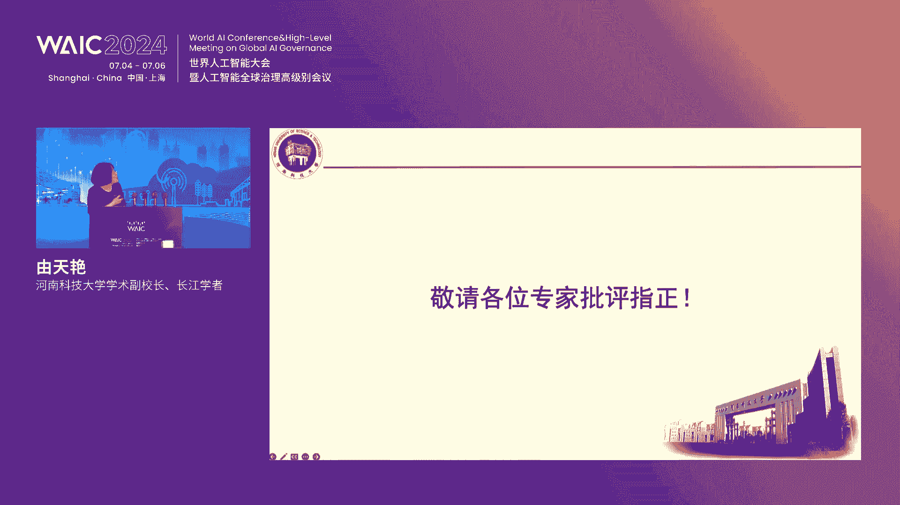
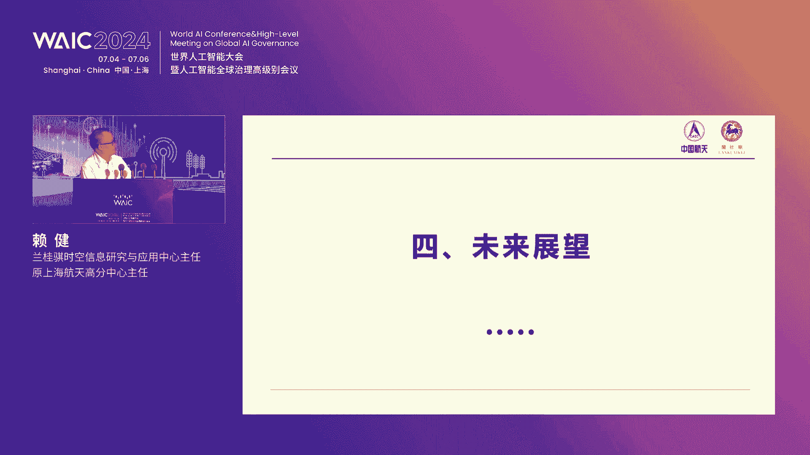

# 66：共建中国智慧农业产业新生态论坛精华教程 🚜

在本课程中，我们将学习2024世界人工智能大会“共建中国智慧农业产业新生态”论坛的核心内容。课程将涵盖智慧农业的政策背景、关键技术、实践案例及未来展望，旨在为初学者提供一个清晰、全面的智慧农业入门指南。

---

## 概述：智慧农业的时代背景与战略意义 🌱

智慧农业是现代农业的发展方向，是实现农业现代化的重要途径。近年来，在国家政策与社会环境的大力推动下，智慧农业行业蓬勃发展，产业链逐步完善。本次论坛汇聚了政府领导、院士专家、企业代表，共同探讨如何共建中国智慧农业产业新生态。

上一节我们介绍了论坛的背景，本节中我们来看看论坛的具体议程与核心报告。

---

## 第一部分：领导致辞与政策解读 📜

### 1.1 论坛开幕与嘉宾介绍
论坛由兰桂旗集团主办，得到了上海市农委、浦东新区政府、临港新片区管委会、上海航天技术研究院等单位的指导。出席嘉宾包括中国工程院罗锡文院士等多位领导与专家学者。

### 1.2 领导致辞要点
以下是几位领导致辞的核心观点：

*   **临港新片区管委会副主任 彭世全**：临港作为国家战略承载区，正着力发展人工智能产业，并积极打造“AI+农业”应用场景，支持智慧农业企业在临港发展。
*   **浦东新区副区长 李雪成**：浦东在打造社会主义现代化建设引领区的过程中，高度重视农业现代化。浦东拥有城乡融合的独特优势，正大力推动智慧农业装备的试点应用和高标准无人农场建设。
*   **浦东新区农委主任 苏锦山**：智慧农业是推动农业现代化的新质生产力，其发展只有起点没有终点。浦东已构建了多层次创新体系，并成立了智慧农业产业联盟和研究院，推动产学研用深度融合。
*   **上海市农委产业发展处处长 康潜**：上海农业虽空间有限，但创新资源丰富、消费市场优质。上海重点发展农业总部经济、特色种源、生物制造、现代设施农业、数字智慧农业等七大方向，并配套了有力的土地、人才、资金政策。


**核心公式/代码示例：政策支持框架**
```plaintext
智慧农业发展 = 政策引导 + 科技引领 + 跨界思维 + 市场运作
```

---

## 第二部分：无人农场——智慧农业的核心实践 🚀

上一节我们了解了宏观政策，本节中我们深入探讨无人农场这一具体实践。中国工程院罗锡文院士为我们带来了《无人农场的探索与实践》的精彩报告。

### 2.1 无人农场的定义
罗院士团队将无人农场定义为具备以下五个特征的农业生产系统：
1.  **耕种管收生产环节全覆盖**
2.  **机库田间转移作业全自动**
3.  **自动避障异况停车保安全**
4.  **作物生长过程实时全监控**
5.  **智能决策精准作业全无人**

### 2.2 无人农场的四大关键技术
建设无人农场需要突破以下四大关键技术：

**以下是关键技术列表：**
*   **数字化感知**：利用卫星、无人机、地面传感器（“星-机-地”技术）精准获取农田信息（如土壤、作物长势、病虫害）。
*   **智能化决策**：基于大数据和模型，智能决策土地整治、耕作、种植、田管、收获等方案。
*   **精准化作业**：依靠自动导航技术，实现耕、种、管、收全环节的无人化、精准化作业。
*   **智慧化管理**：通过物联网和平台，实现对作物、农机、农场的远程监控与智慧调度。

**核心公式/代码示例：精准施肥决策**
```python
# 伪代码：基于无人机影像的变量施肥处方图生成
输入：无人机获取的作物多光谱影像
过程：
    1. 分析影像，计算植被指数（如NDVI）
    2. 根据NDVI值划分长势区域（好、中、差）
    3. 结合土壤养分数据，生成不同区域的施肥量处方
输出：变量施肥处方图
```
*应用效果：在广东水稻生产中，该方法节省氮肥20%以上。*

### 2.3 无人农场的实践成果
罗院士团队已在广东、湖南等地成功实践无人农场，并取得了显著成效：
*   **增产增效**：在广东增城的水稻无人农场，优质丝苗米产量达662.29公斤/亩，比当地平均产量高32%。
*   **模式创新**：在湖南探索“再生稻”模式，种一季收两季，亩产高达1241.7公斤。
*   **解决“谁来种地”**：通过“主机+从机”协同作业等模式，有效缓解农业劳动力短缺问题。

无人农场的愿景是让年轻人可以轻松管理成千上万亩农田，描绘出“喝着冰淇淋，看着机器自动干活”的未来农业图景。

---

## 第三部分：多元技术赋能智慧农业生态 🛠️

上一节我们聚焦于大田无人农场，本节中我们来看看智慧农业在其他场景的应用及支撑技术。

### 3.1 植物工厂：设施农业的高级形态
河南科技大学金鑫教授团队分享了智慧植物工厂的探索。植物工厂通过立体种植、人工光、环境调控，实现作物周年循环生产。

**以下是植物工厂的关键技术列表：**
*   **信息感知**：感知作物长势、环境参数、装备状态。
*   **智能装备**：研发播种、移植、物流、采收、包装等成套自动化装备。
*   **智慧管控**：集成环境、品质、产量管理与装备调度系统。
*   **应用成效**：其示范工厂可替代15人作业，月节省人力成本近6万元，显著提升生产效益。

### 3.2 农业生物传感器：精准信息的“侦察兵”
河南科技大学尤天燕教授介绍了农业生物传感器技术。该技术利用酶、抗体等生物材料作为敏感元件，快速检测农产品中的有害物质（如真菌毒素、重金属）和转基因成分。




**核心公式/代码示例：比率电化学生物传感器原理**
```plaintext
检测信号 = 信号A / 信号B
```
*优势：通过两个信号的比值进行内校准，能有效消除背景干扰，提高检测精准度和可靠性。*

### 3.3 数字技术综合赋能
中国电信赵宇副总裁展示了数字技术如何全面赋能农业农村：
*   **建设基础设施**：完善农村网络与信息服务。
*   **打造应用平台**：涵盖智慧种植、畜牧、冷链、乡村治理等领域。
*   **研发农业大模型**：与中国农科院合作推出“神农一号”大模型，用于生产指导、价格预测等。
*   **创新金融服务**：中国农业银行唐笑总经理介绍了如何通过创新担保方式（如活体质押）、创设专项信贷产品（如“农科贷”）等，解决农业科技企业融资难题。

### 3.4 天空地一体化监测
兰桂旗集团赖健主任发布了时空信息赋能产品。通过集成卫星遥感、无人机、地面物联网数据，构建“天空地”一体化监测网络，可用于：
*   **耕地保护动态监测**：智能识别地块类型，监测违法违规占用耕地行为。
*   **农业保险监管**：精准评估灾情，降低勘察成本和误差。
*   **社会化服务监管**：追踪作业过程，实现补贴资金精准发放。

---

## 第四部分：合作签约与生态共建握手 ✍️

论坛期间举行了重要的合作签约与揭牌仪式，体现了产业生态共建的实质性进展。

**以下是本次论坛达成的关键合作：**
*   **战略签约**：浦东新区张江镇人民政府与兰桂旗集团签署战略合作协议。
*   **平台揭牌**：“张江兰桂旗花卉种业科创中心”正式揭牌。
*   **场景发布**：兰桂旗集团发布了“AI+无人农场”场景平台，旨在联合生态伙伴共同进行技术示范、迭代和推广。
*   **平台共建**：中国农业大学张福锁院士团队与兰桂旗联合发布了“农田养分智慧管控平台”，该平台已在云南洱海流域应用，致力于协同解决面源污染与农民增收难题。

---

## 总结与展望 🌟

本节课中，我们一起学习了2024世界人工智能大会智慧农业论坛的核心内容。我们从宏观政策解读入手，深入剖析了无人农场这一核心场景的五大特征与四大关键技术。接着，我们拓展视野，了解了植物工厂、生物传感器、数字金融、天空地监测等多元技术在智慧农业生态中的应用。最后，我们看到了通过战略合作、平台共建推动产业生态发展的具体行动。

智慧农业的发展正处于关键时期，未来充满了机遇与挑战。它不仅是应对全球粮食安全挑战的利器，更是实现农业现代化、促进乡村振兴的必然选择。让我们携手共进，以科技为引领，以创新为驱动，共同为建设中国智慧农业产业新生态而努力奋斗！



**核心总结公式：**
```plaintext
智慧农业新生态 = (政策 x 科技) + (产业 x 金融) + (数据 x 合作)
```

---