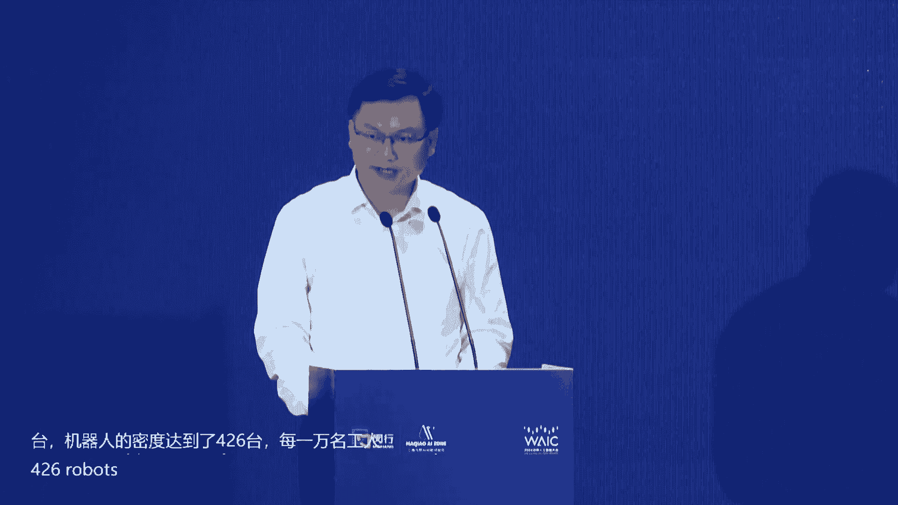
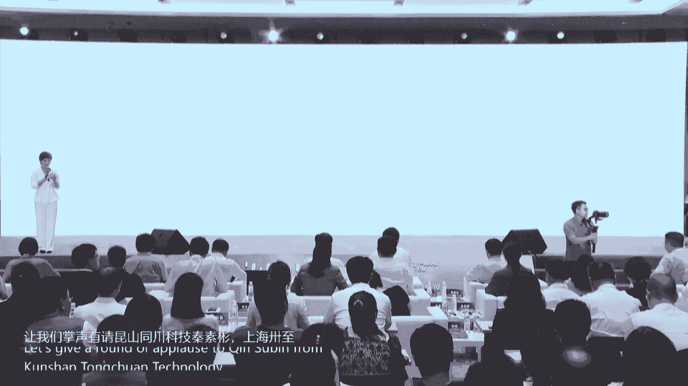
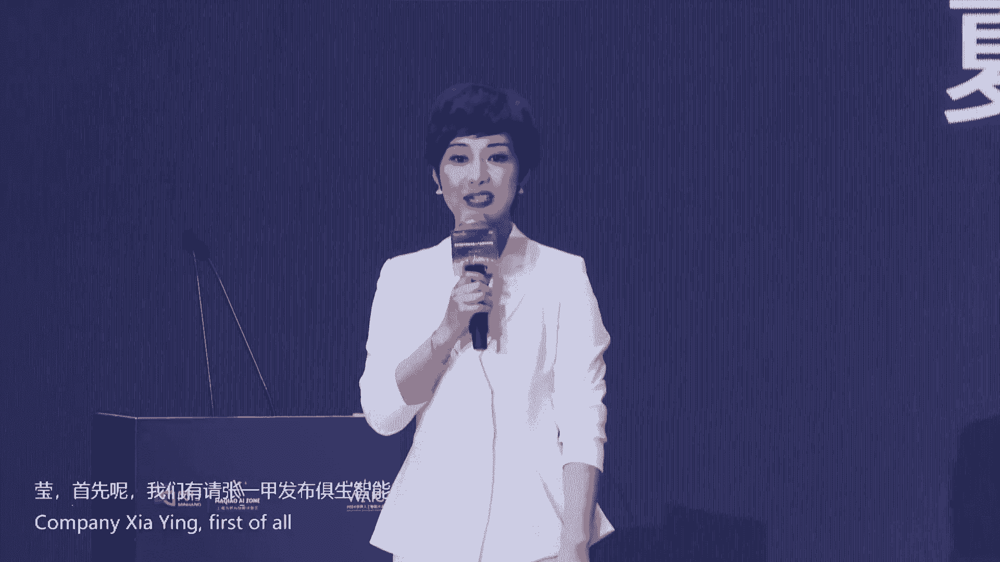
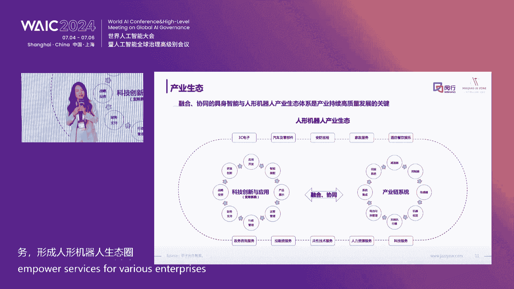
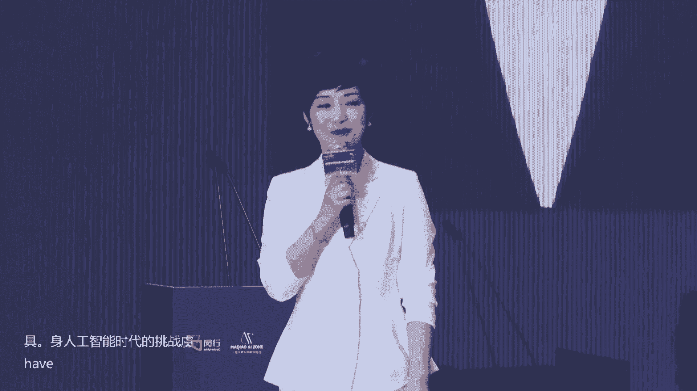
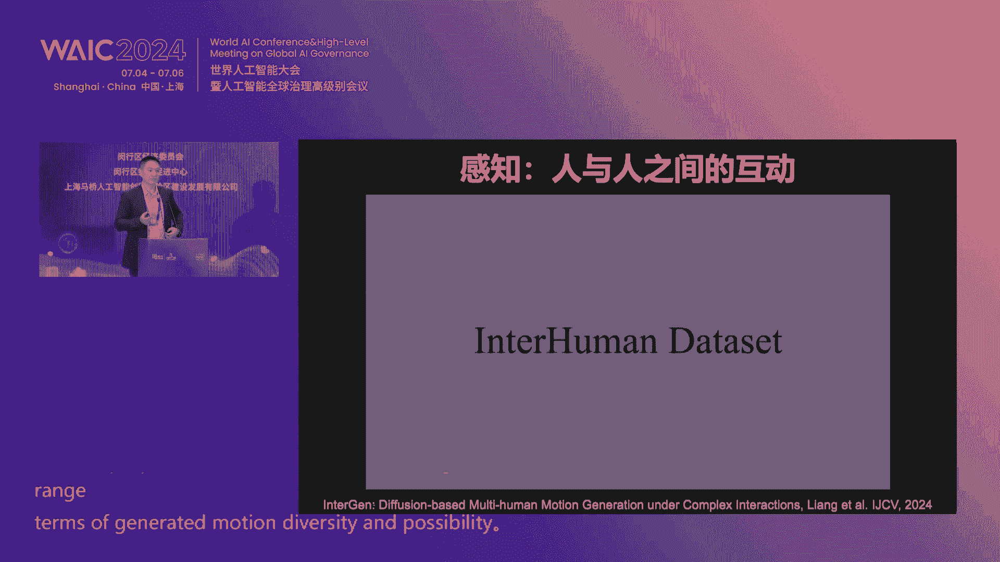
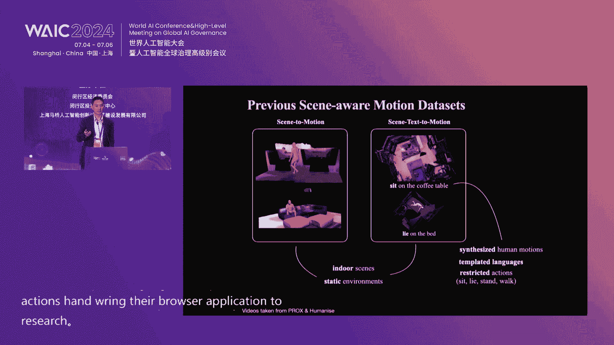
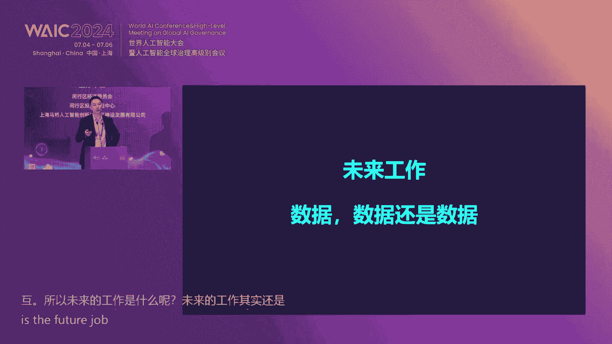
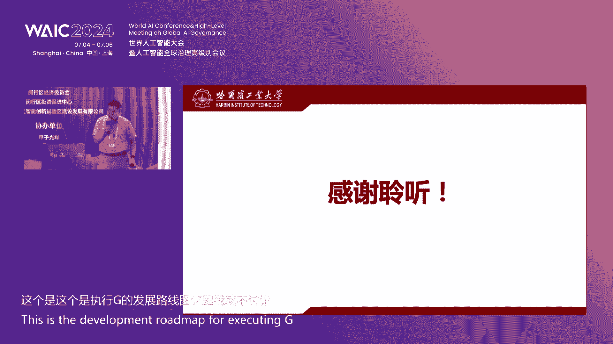
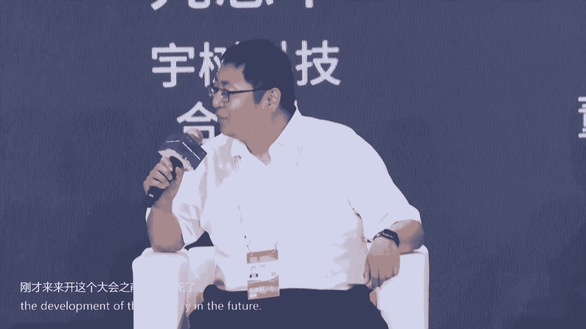

# 67：具身智能与智能机器人产业链生态论坛全记录与解析 🧠🤖

在本节课中，我们将学习2024世界人工智能大会“具身智能与智能机器人产业链生态论坛”的核心内容。我们将把论坛的完整记录翻译、整理并提炼为一篇结构清晰的教程，涵盖政策导向、技术突破、产品发布、产业生态及未来展望。课程将严格遵循指定的格式与要求，确保内容准确、流畅且易于初学者理解。



---

## 概述 📋

本次论坛聚焦于具身智能（Embodied AI）与智能机器人产业的前沿动态与生态构建。与会嘉宾包括政府领导、顶尖学者及企业代表，共同探讨了技术发展趋势、产业链协同、区域营商环境以及具体的产品创新。课程将系统性地梳理这些内容，帮助你快速掌握论坛精华。

---

## 一、 论坛开幕与领导致辞 🎤



论坛伊始，主持人介绍了与会的重要领导和嘉宾，并对大会主题“以共商促共享，以善制促善治”进行了解读。

上一节我们介绍了论坛的基本情况，本节中我们来看看上海市领导对产业发展的宏观指引。

上海市经济和信息化委员会副主任汤文侃先生发表了致辞。他指出：

*   **产业现状**：上海已形成较为完整的机器人产业链，集聚了传统“四大家族”和新兴国产企业。2023年上海工业机器人产值达250亿元，机器人密度为**426台/万名工人**。
*   **发展机遇**：人形机器人是继PC、智能手机、新能源汽车后的重要颠覆性产品。上海已成立全国首个国家地方共建的人形机器人创新中心，并发布了国内首款全尺寸通用人形机器人公版机“轻鸿”。
*   **未来规划**：上海将从**核心技术突破**、**示范应用拓展**（目标3年内规模化应用1000台）、**创新生态培育**三个方面推动人形机器人产业发展。
*   **对闵行区的期望**：希望闵行区作为上海工业重镇，在机器人核心零部件等领域加快布局，为产业高质量发展做出更大贡献。



**核心公式/概念**：
*   机器人密度 = 机器人保有量 / 万名产业工人
*   产业发展路径：**技术攻关 -> 场景应用 -> 生态培育**

---

## 二、 重点产品发布 🚀



在政策引领下，科技企业发挥着创新主体作用。论坛期间，位于上海马桥人工智能创新试验区的三家企业发布了重磅新品。

以下是三款新发布的产品介绍：

1.  **太虎机器人 - 全尺寸人形机器人**
    *   **核心参数**：身高1.7米，自重48公斤，拥有**44个主动自由度**。其关节模组扭矩密度为国内最高，髋关节、膝关节输出扭矩达**490牛·米**，具备单腿跳跃的运动能力。
    *   **特点**：所有关节均为自研，已实现车规级应用，可为各行业提供高性能的硬件开发平台。

2.  **萨志智能 - 移动双臂作业机器人“白猿”**
    *   **功能定位**：在上一代单臂移动作业机器人基础上迭代，旨在将人从复杂、精细或危险的作业环境中解放出来。
    *   **技术亮点**：采用**一体化设计与控制**，通过一个“大脑”实现手、眼、脚的协调。结合视觉、力觉、触觉等多模态感知，实现类人精细操作。移动定位精度达毫米级，双臂作业精度达**0.05毫米**。

3.  **飞析科技（孵化的穷测科技） - 穷测大脑（具身智能通用大脑）**
    *   **定位**：全球首个可适配各类机器人的通用具身智能大脑平台。
    *   **技术突破**：在**物理大模型**（理解世界本质）和**鲁棒行为决策**方面达到国际领先水平。
    *   **产品形态**：提供完整的工具链，用户可在任何机器人上基于该平台快速搭建并完成任务。

**过渡**：这些产品的发布，标志着企业正从技术模仿走向创新创造。那么，优秀的创新产品需要怎样的土壤来培育呢？接下来我们将目光投向区域的产业生态建设。

---

## 三、 产业生态构建：签约与联合体成立 🤝

闵行区以其优质的营商环境吸引着大批人工智能企业。论坛现场举行了多项签约与联合体成立仪式，展现了强大的产业凝聚力。

### 3.1 重点项目签约

共有15个重点人工智能项目分三批与上海马桥人工智能创新试验区及属地镇政府签约。这些企业的落地将加速闵行区人工智能产业的集聚发展，为区域经济增添新动能。



### 3.2 长三角产业链联合体成立

为链接长三角资源，推动产业链协同发展，“长三角具身智能与人形机器人核心零部件产业链联合体”正式启动。联合体由昆山、上海、常州、宁波、苏州等地的十余家核心企业共同发起，旨在打通区域产业链，实现优势互补。

**过渡**：为何众多企业选择落户闵行？这与区域提供的全方位支持密不可分。下面，让我们深入了解闵行区的营商环境。

---

## 四、 闵行区营商环境推介 🌇

闵行区投资促进中心副主任刘翔系统推介了闵行的“六张名片”：

1.  **战略高地**：位于上海地理中心，是虹桥国际开放枢纽核心承载区，享有三大国家战略叠加优势。
2.  **通衢要地**：坐拥虹桥综合交通枢纽，1小时可达长三角主要城市，中欧班列“上海号”从区内始发。
3.  **发展圣地**：工业底蕴雄厚，制造业增加值占比高，集聚了大量外资企业与世界500强。
4.  **科创重地**：拥有上海交大、华东师大两所985高校，研发投入强度（**10.57%**）是上海市平均水平的两倍多。
5.  **生活美地**：教育资源、医疗资源丰富，被评为“中国最具幸福感城区”，宜居宜业。
6.  **投资福地**：营商环境评价名列前茅，针对“一南一北”发展战略（北部现代服务业、南部高端制造业）出台了有力的专项政策，最高扶持资金可达**1000万元**。



**核心代码/政策示例**：
```python
# 模拟政策扶持逻辑（概念性）
if 企业类型 == “重大科技项目” and 落地区域 == “闵行南部”:
    最高扶持资金 = 10000000 # 单位：元
elif 企业类型 == “高成长性企业”:
    最高租房补贴 = 5000000 # 单位：元
```

**过渡**：优越的环境需要具体的产业载体来承接。上海马桥人工智能创新试验区正是这样一个核心平台。





---

## 五、 产业报告发布与试验区介绍 📊

甲子光年创始人张一甲发布了《具身智能与人形机器人产业报告》，核心观点如下：

*   **数字经济是引擎**：数字经济占GDP比重持续提升，是推动产业智能化、绿色化、融合化的关键。
*   **人形机器人是AGI最佳载体**：生成式AI和多模态大模型的技术突破，显著加速了人形机器人产业发展，使其有望成为继新能源汽车后的支柱产业。
*   **硬件先行与成本关键**：行业目前处于硬件先行阶段，核心零部件成本占整机成本**70%** 以上，其技术突破与成本降低是规模商用的关键。
*   **生态体系至关重要**：需构建涵盖产业链协同、科技服务、投融资的良性生态体系。

随后，上海马桥人工智能创新试验区公司副总经理夏寅介绍了试验区的具体情况：

*   **产业集聚**：已集聚200多家人工智能企业，形成了从核心零部件（芯片、控制器、伺服电机）到机器人本体（如萨志、节卡、达闼）再到行业应用的完整产业链。
*   **区位与空间**：地处战略要地，交通便利。总面积15.7平方公里，拥有充裕的产业空间和丰富的商业、居住、人才公寓等配套资源。
*   **发展愿景**：致力于打造“智生产、智生活、智生态”的未来之城，推动人工智能与机器人产业集群化发展。

**过渡**：了解了宏观的产业生态，我们再将视角聚焦回技术本身。接下来，几位顶尖学者将为我们揭示具身智能的技术内核与挑战。



---

## 六、 前沿技术主题演讲 🔬

### 6.1 卢策武教授：具身智能如何重塑人机交互

上海交通大学卢策武教授分享了其团队在穷测科技的技术突破。

*   **核心问题**：具身智能需要海量的“视觉-控制”数据，但这类数据获取成本极高，成为发展瓶颈。
*   **解决方案**：采用**第一性原理**，将任务分解为“理解世界”和“做出决策”。
    *   **物理常识大模型**：将高维的像素空间压缩为描述物体物理属性（如旋转轴）的低维知识空间，极大降低数据需求。
    *   **力位混合决策模型**：传统模型只输出位置指令，而人类操作依赖力觉反馈。团队构建了**力位混合输出模型**，并建立了世界首个大规模力反馈数据收集平台，提升了执行的鲁棒性和泛化能力。
*   **产品化**：基于上述技术，发布了“穷测大脑”平台，可将各种原子技能（如抓取、拧盖）像搭积木一样组合，以解决复杂任务。

### 6.2 虞晶怡教授：感知、认知与行为——挑战与机遇

上海科技大学虞晶怡教授探讨了具身智能时代的挑战。

*   **现状与瓶颈**：当前在3D感知、生成方面进展迅速，但让机器人在自由、非受控的复杂环境中可靠工作仍面临巨大挑战。
*   **缺失的关键**：**交互**。包括人与物、人与机、人与人、机与机之间的交互。当前缺乏高质量的交互数据。
*   **创新数据获取**：
    *   **多模态感知**：提出结合视觉、激光雷达（LiDAR）和惯性测量单元（IMU）的数据采集系统。即使在远距离或暗光环境下，也能通过IMU数据精准捕捉人体动作。
    *   **人与物/人交互数据集**：通过搭建多相机系统，捕获高质量的人-物、人-人交互的3D视频数据，用于训练机器理解交互逻辑。
*   **未来方向**：需要更多模态的数据、更好的仿真到现实（Sim2Real）迁移技术、物理约束的融入以及最终实现安全、协作的多智能体系统。

### 6.3 付宜利教授：人形机器人研制与产业化

哈尔滨工业大学付宜利教授分享了其在液压驱动人形机器人方面的研究。

*   **技术路线**：人形机器人分为电机驱动和液压驱动两大流派。哈工大团队专注于**液压驱动**路线，其优势在于动力集中、扭矩大，更接近人体肌肉骨骼的仿生原理。
*   **关键技术突破**：
    *   **仿生结构设计**：采用“油路-骨骼一体化”设计，将液压管路内置在仿生骨骼中，实现减重和无管化。
    *   **核心部件自研**：突破了高性能伺服阀、一体化关节、高功率密度移动液压源等关键部件。
*   **发展路径**：人形机器人将遵循 **“走进工厂 -> 走出工厂（特殊应用）-> 走进家庭”** 的路径。当前应聚焦**场景牵引**，在工业制造、物流、安防巡逻、灾害救援等专用场景率先落地。

### 6.4 贾奎教授：Sim2Real AI引擎实现通用具身智能

香港中文大学（深圳）贾奎教授提出了通过仿真高效实现具身智能的路径。



*   **数据困境**：真实世界采集机器人交互数据成本高昂、不现实。
*   **核心方案**：研发全自动化的 **“Sim2Real AI引擎”**。
    *   **流程**：自动生成3D数字资产 -> 自动进行物理仿真 -> 自动生成并标注多模态数据 -> 在线训练AI模型 -> 模型在真实世界部署。
    *   **优势**：能以极低成本获取海量、多样化的训练数据，并已在实际工业场景中实现**99.9%以上**的成功率。
*   **技术支撑**：团队在3D生成AI、四维动态表达、纯视觉3D感知大模型等方面有深厚积累，为引擎提供底层支持。
*   **产品展望**：致力于打造软硬一体的机器人“大小脑”系统及下一代机器人控制器（RoPilot），使人机交互像“师傅教徒弟”一样自然。

**过渡**：技术的最终目的是服务于产业与社会。那么，业界一线从业者如何看待当前的机遇与挑战？一场激烈的圆桌对话为我们提供了多元视角。

---

## 七、 巅峰对话：具身智能与人类认知——模仿还是超越？ 💬

圆桌会议由甲子光年首席内容官王博主持，邀请了六位企业界嘉宾。

**核心议题与观点摘要**：

1.  **行业热度观察**：
    *   嘉宾普遍感受到行业异常火热，但认为**技术实质性进步的速度可能低于市场热度**。存在概念重复炒作、产品同质化现象。
    *   **梅卡曼德邵天兰**尖锐指出，需警惕“吹牛通胀”掩盖真实问题，影响行业整体进步速度。

2.  **模仿 vs. 超越**：
    *   **路径选择**：多数嘉宾认为，当前阶段的核心是**找到可行的技术落地路径**，而非空谈模仿或超越。应聚焦特定场景，解决具体问题。
    *   **务实发展**：**萨志智能张建正**强调，产品落地最终要看投资回报率（ROI），通用性可能意味着冗余，需要与场景深度结合。
    *   **长期乐观**：尽管前路艰难，但嘉宾们本质上是**“真正的乐观主义者”**，相信这一代人将见证机器人深刻改变世界，但前提是“少吹牛，多实干”。

3.  **挑战与突破**：
    *   **最大挑战**：技术链条长、客户需求苛刻且分散、商业化路径不清晰、高质量数据获取难。
    *   **欣喜的突破**：硬件性能（如关节模组）持续提升，在工业等**半结构化场景**中，智能机器已经实现大规模、高可靠性的应用，证明了技术的实用价值。

4.  **资本的角色**：
    *   呼吁**专业、有耐心的资本**进入。非专业的狂热投资可能导致资源错配和行业大起大落。

---

## 八、 论坛总结与展望 🌟

论坛在主持人的总结中圆满结束。核心信息归纳如下：

*   **政策明确**：国家和地方层面高度重视，为人形机器人及具身智能产业绘制了清晰的发展蓝图。
*   **技术多元**：多条技术路线（电机/液压、仿真/真机）并行发展，在感知、决策、控制、硬件等关键环节不断突破。
*   **生态成型**：以上海闵行区、马桥人工智能创新试验区为代表的区域，正在构建从研发、生产到应用、服务的完整产业生态。
*   **场景牵引**：共识是产业将遵循从**专用到通用**、从**结构化到非结构化**场景的路径发展，工业制造、特种服务等领域将率先落地。
*   **理性繁荣**：业界呼吁在拥抱热潮的同时保持技术理性与商业务实，通过解决一个个具体问题，稳步迈向智能机器人与人类共生的未来。

---

## 总结 📚

本节课中，我们一起学习了“具身智能与智能机器人产业链生态论坛”的完整内容。我们从**政策导向**出发，了解了上海及闵行区的产业布局与支持；通过**产品发布**，看到了前沿企业的创新实力；借助**产业报告与区域推介**，洞察了完整的生态体系；聆听**顶尖学者的演讲**，深入了技术核心与挑战；最后通过**业界对话**，感受到了市场的热度与理性的思考。

希望本教程能帮助你系统性地理解具身智能与机器人产业的最新动态、核心挑战与未来趋势。记住，这是一个需要**长期主义、脚踏实地**的领域，每一次微小的技术突破和场景落地，都在共同推动着我们向那个充满智慧的未来迈进。