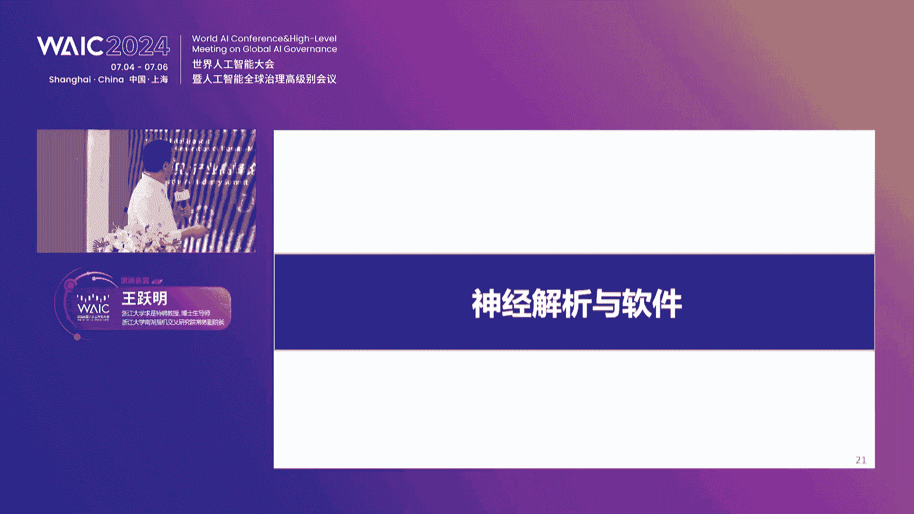
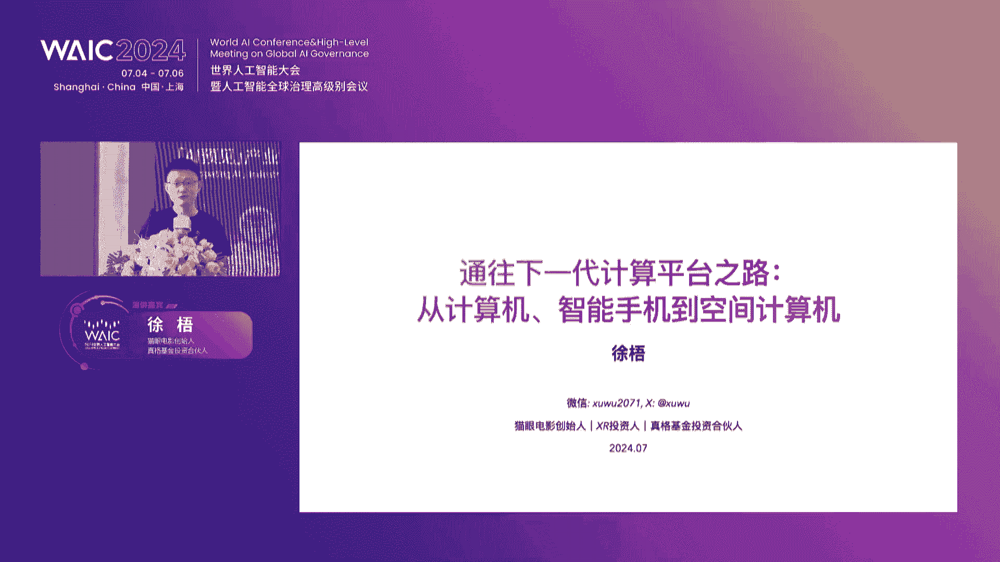
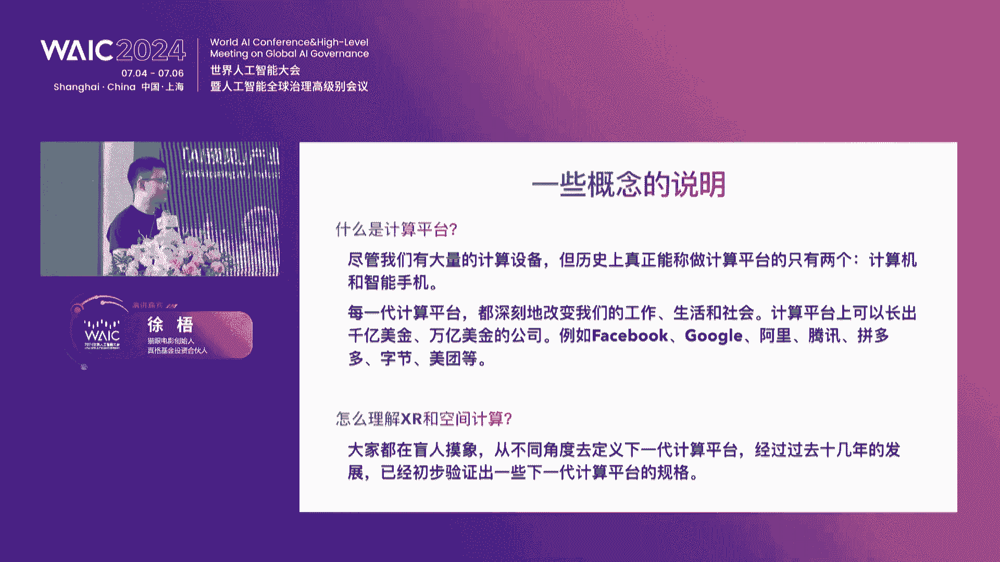
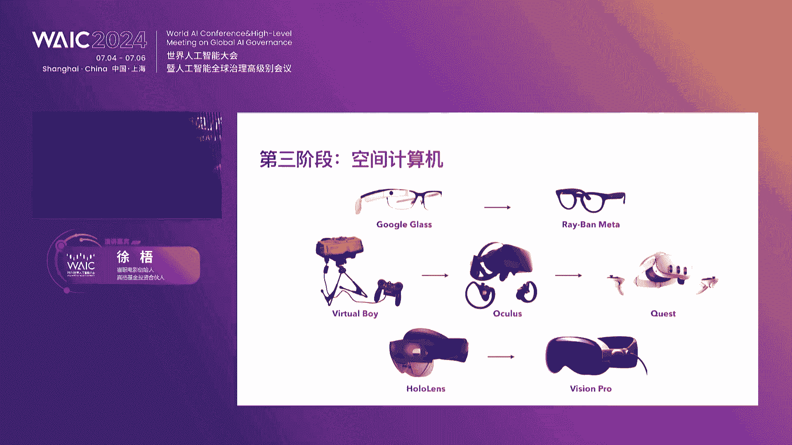
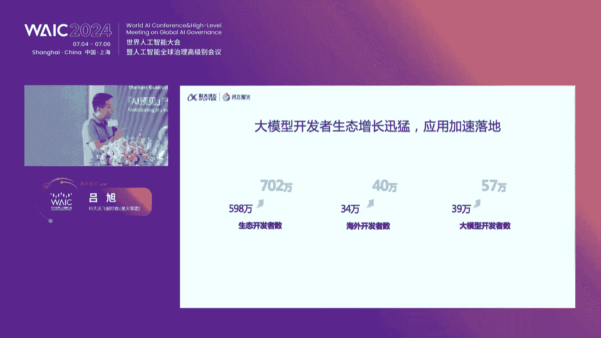
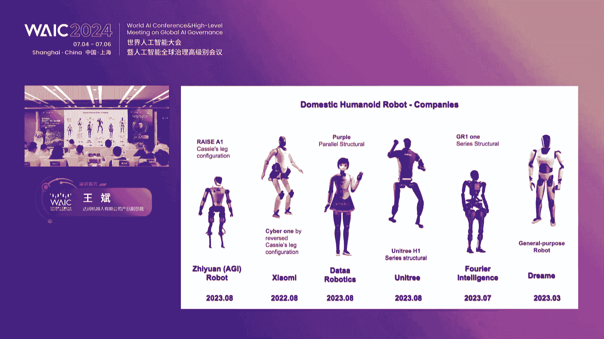
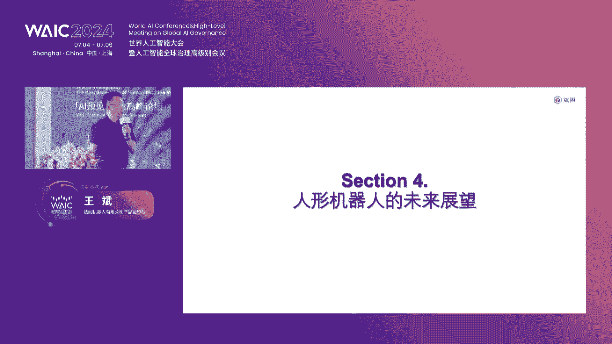

# 68：空间智能：迈向下一代人机共融 🚀

## 概述
在本节课中，我们将学习“空间智能”这一前沿概念，探讨人工智能如何从二维平面迈向三维空间，并与人类实现深度融合。课程内容整理自一场产业高峰论坛，我们将系统性地了解空间智能的技术基础、产业应用及未来展望。

---

## 第一节：论坛开场与核心命题 🎤

本次论坛由复旦大学智慧城市研究中心的邱素川主持。论坛的核心命题“空间智能：迈向下一代人机共融”受到两位重要学者的启发：斯坦福大学李飞飞教授提出的“空间智能”问题，以及科技部部长吴朝辉院士提出的“四元社会”构想。

论坛坚信，人工智能技术的爆发不应仅限于二维互联网的降本增效。人类文明的进步在于对高维度的不断探索，因此提出了“空间智能”这一前沿方向。

以下是参与本次论坛的重要嘉宾名单：
*   东浩兰生会展集团股份有限公司总裁 毕培文
*   浙江大学求是特聘教授、南湖脑机交叉研究院常务副院长 王月明
*   复旦大学教授、博导、智慧城市研究中心主任 林红
*   猫眼电影创始人、真格基金投资合伙人 徐梧
*   科大讯飞星火大模型技术解决方案副总裁 吕旭
*   达闼机器人有限公司副总裁 王斌
*   杭州市人工智能学会副理事长、浙江大学副教授 金小刚
*   nex pin创始人 范哲

此外，还有来自上海市创投协会、上海市服务消费促进会、浙江大学上海高等研究院等多位领导和专家出席。

---

## 第二节：领导致辞与论坛基调 📢

论坛伊始，主办方代表进行了开场致辞，为大会奠定了高远的基调。

**东浩兰生会展集团毕培文总裁**在致辞中表示，作为全球人工智能盛会WAIC的承办方，东浩兰生深刻认识到人工智能与空间智能对产业发展的巨大机遇。集团正在会展业务中探索应用VR、AR和大数据分析等技术，并将继续加大投入，推动创新项目落地。

**浙江大学上海高等研究院娄华良副院长**在致辞中指出，人工智能正在深刻改变生产、生活和思维方式。本次论坛旨在汇聚专家与产业精英，共同探讨人工智能的最新趋势、技术突破与产业应用，促进人工智能技术的创新与产业健康发展。

两位领导的致辞明确了本次论坛的目标：在空间维度中，探讨人工智能未来的产业可能性。

---

## 第三节：主旨演讲——成己成物：迈向人机共融时代 🧠

本节由浙江大学上海高等研究院常务副院长吴飞教授（远程连线）带来主旨演讲《成己成物：迈向人机共融时代》。

上一节我们了解了论坛的宏观背景，本节中我们来看看人工智能发展的本质规律。吴飞教授回顾了人工智能以战胜人类为目标的早期发展，例如“深蓝”战胜国际象棋冠军卡斯帕罗夫，其核心是 **算力之威** 与 **剪枝搜索** 算法之巧的结合。

AlphaGo战胜李世石则依赖于三大技术：**深度卷积神经网络**（感知棋面）、**强化学习**（窥视策略）和**蒙特卡洛树搜索**（采样无穷空间）。然而，人工智能的目标不应是战胜人类，而应是成为人类的好帮手，迈向人机共融。

ChatGPT的出现标志着“人工智能的iPhone时刻”，它通过自然语言交互，为人机共融提供了新手段。GPT（Generative Pre-trained Transformer）的核心是**生成式**内容合成、**预训练**模型以及**Transformer**神经网络架构。其关键机制是**自注意力机制**，让每个单词记住其上下文共生概率，从而实现内容的概率压缩与合成。

GPT的成功依赖于**数据（燃料）、模型（引擎）、算力（加速器）** 的规模法则。Sora等视频生成模型则遵循“书同文，车同轨”的逻辑，将不同模态信息投影到同一语义空间进行关联挖掘。

吴飞教授指出，当前大模型解决通用任务，而垂直领域（如司法、教育、金融）需要专门的领域大模型。将大模型（大脑）与智能体（手和脚）结合，能完成更复杂的任务。

最后，他强调人工智能具有技术与社会双重属性。在人工智能时代，伦理关系扩展至人与自己所创造的人造物之间。浙江大学已开设人工智能通识课程，旨在培养学生的人工智能思维，最终实现“成己成物”——既成就人类自身，也成就人造之物。

---

## 第四节：脑机接口——下一代人机交互之门 🧬

上一节我们探讨了软件层面的人机共融，本节中我们来看看硬件层面最前沿的交互方式——脑机接口。本节由浙江大学王月明教授分享《意识之门？脑机接口与下一代人机交互》。

脑机接口的核心是建立大脑与外部设备之间的直接通路，实现信息的**读出**、**写入**以及**双向协调**。脑机接口主要分为两类：
*   **非侵入式**：在头盖骨外获取信号，分辨率较低（>5毫米），频率较低（<50Hz），但安全无创。
*   **侵入式**：植入颅内，信号质量高，分辨率可达毫米级以下，频率高（可达500Hz乃至更高）。神经元之间传递的**动作电位**频率甚至可达数十KHz。

侵入式脑机接口的发展历经数十年，从早期的粗糙电极到如今的微丝电极，直至马斯克推动该领域进入大众视野。其关键技术环节包括：信号记录、芯片与系统集成、神经信号解析计算以及应用系统。

在**信号记录**方面，目前有**硅基电极**（如Utah阵列，已获FDA批准）和**柔性电极**两条技术路线。柔性电极通道数多、伤害小，但长期稳定性和植入便利性仍是挑战。国内多家机构也在研发柔性电极，但尚未大规模临床使用。

**芯片**方面，侵入式脑机接口芯片的核心要求是**超低功耗**，以避免植入体内产热过高。目前国内科研芯片较多，但达到医疗器械级稳定性和安全性的产品芯片仍需攻关。

**系统集成与微型化**是产品化的关键。马斯克的Neuralink已尝试将微型系统植入人体。国内在此领域与国外仍有差距，反映了高端精密制造工业水平的不足，需要产业链协同突破。

**神经计算**与**应用系统**是脑机接口价值的体现。王教授团队发现了书写汉字特有的神经编码机制，实现了汉字的实时书写。在医疗应用方面，侵入式脑机接口在**脑疾病治疗**（如帕金森、癫痫、重度抑郁）、**运动功能重建**（高位截瘫、中风康复）和**感觉输入**（人工视觉假体）等领域潜力巨大。

王教授团队在重度抑郁症治疗上取得了突破性进展，通过精准定位刺激靶点、个性化调节参数，使一位患者在长期刺激后临床康复，且停刺激后近一年未复发。

总之，脑机接口作为下一代人机交互的潜在路径，在严肃医疗、康复、工业操控乃至军事领域都有广阔的应用前景，但其发展依赖于材料、电子、生物、算法等多学科的深度交叉融合。

---

## 第五节：联盟仪式——汇聚产业力量，共筑未来生态

在聆听了科学家们对本质规律的洞察后，论坛进入产业协同环节。上海人工智能与元宇宙产业联盟举行了多项签约与授牌仪式，旨在汇聚产学研投各方力量，推动空间智能产业发展。

仪式环节由收到科技创始人黄悦主持。主要活动包括：
1.  **战略合作签约**：上海人工智能与元宇宙产业联盟分别与上海市创投协会、东浩兰生元素科技，以及上海市服务消费促进会签署战略合作协议。
2.  **学术指导单位授牌**：联盟为复旦大学智慧城市研究中心、华东电信研究院、浙江大学上海高等研究院等多家在学术研究和技术创新方面做出贡献的单位授牌。
3.  **专委会授牌**：联盟为智慧文创、智慧体育、智慧医疗、金融投资等八个专业委员会授牌。
4.  **成果发布**：智慧体育专委会联合多家单位，正式发布了“全术加体育大模型”。
5.  **示范合作签约**：联盟促成东浩兰生元素科技与日本混合现实竞技项目“HADO”达成合作，宣布HADO中国旗舰店落户上海，并计划于2025年在上海举办HADO世界杯。

联盟学术委员会主席林红教授在发言中阐释了“空间智能”与“人机共融”的内涵。空间智能是对物理三维空间的感知、理解、行动、导航、预测和交互的能力。人机共融则是指人、机器与环境之间的协作与相互适应。她倡议加强基础研究、促进技术交流、推动跨界合作、培育孵化项目，共同推动产业发展。

这些仪式标志着产业生态正在组织化、系统化地形成，为技术组合与化学反应的产生提供了土壤。

---

## 第六节：产业前瞻（一）——通往下一代计算平台之路 📱

从本节开始，论坛进入产业前瞻板块，从感知、认知、行动三个维度探讨空间智能的产业可能性。首先，从“感知”维度，猫眼电影创始人徐梧分享了《通往下一代计算平台之路：从计算机、智能手机到空间计算》。

徐梧首先定义了“计算平台”——能深刻改变工作、生活并催生庞大生态的硬件设备，历史上只有**个人计算机**和**智能手机**两者。他提出核心假设：我们正迎来下一代计算平台，而XR/空间计算是主要候选。

通过回顾过去50年计算设备发展规律，他总结出四点：
1.  **渐进演变**：平台非突变，而是长期技术积累的结果。
2.  **从垂直到通用**：先出现功能性垂直设备（如游戏机），后演变为通用平台。
3.  **技术集合革命**：成为平台的设备集成了当时最先进的显示、交互、性能技术。
4.  **小型化趋势**：设备随时间逐渐变小、变轻、功耗更低。

对照这些规律，XR设备的发展路径清晰可见：
*   **智能眼镜线**：从2012年失败的Google Glass，到2024年Meta Ray-Ban智能眼镜，背后是芯片小型化等技术的十年进步。
*   **VR头显线**：从1990年代任天堂Virtual Boy的失败，到2019年Meta Quest无线一体机的成功，再到Quest 2销量超2000万台，证明了市场存在。
*   **MR头显线**：从微软HoloLens转向企业市场，到2024年苹果Vision Pro发布，定义了“空间计算机”新标准。

目前，XR生态已初步建立。以Meta Quest平台为例，其应用商店总收入已超20亿美元，数百款应用收入超百万美元，表明开发生态已良性运转。XR发展正从“功能设备”走向“平台设备”。

要真正进入空间计算时代，需解决六个关键问题：
1.  **显示**：Vision Pro的Micro OLED显示已接近视网膜分辨率，未来将实现以假乱真的视觉体验。
2.  **交互**：手眼交互将成为主流，需优化延迟和准确性。
3.  **混合现实**：实现数字内容与真实世界的自然交互与融合。
4.  **操作系统**：VisionOS已定义了空间中的窗口、实体等元素，为通用平台奠定了基础。
5.  **芯片**：苹果将桌面级M系列芯片用于头显，带来了强大算力，且迭代路径清晰。
6.  **小型化**：当前设备重量有巨大优化空间，减重是明确的工程目标。

徐梧预测，空间计算平台距离爆发已不远。对于创业者和开发者，**未来2-3年是准备窗口期**，**未来5年将对现有商业生态产生明显影响**。所有现有应用都值得用空间计算的方式重做一遍，结合AI能力，未来充满想象。

---

## 第七节：产业前瞻（二）——大模型：重塑智能产业格局 🧠

上一节我们从硬件和交互层面感知未来，本节我们从“认知”维度，看看驱动变革的核心引擎——大模型。本节由科大讯飞吕旭副总裁分享《智启未来：大模型重塑智能产业格局》。

吕旭指出，ChatGPT的迅速普及标志着技术范式的变革。大模型的“智慧涌现”源于三个基础：
1.  **海量参数与数据**：GPT参数达1750亿，超过人脑神经元数量级。
2.  **Transformer架构与自注意力机制**：使模型能自动学习词语间的上下文关联。
3.  **自监督学习+指令微调**：通过“完形填空”预训练和少量示例微调，让模型获得通用能力。

大模型的能力有边界。写代码、翻译等任务相对容易；专业领域知识问答、企业级智能体应用则技术链条长、需要深度定制，这是“最后一公里”的挑战。

中美在大模型领域存在差距，但技术架构上并未出现代差。Sora等视频模型本质仍是Transformer架构在专业领域的成功实践，依赖大规模算力和数据标注。

讯飞星火大模型是国内首批发布的大模型之一。面对被列入美国实体清单无法获得英伟达芯片的挑战，讯飞与华为深度合作，基于昇腾910国产算力，打造了万亿参数大模型训练平台。经过联合优化，训练效率已达A100的90%。

星火大模型V4.0在医疗、教育、汽车、家居、企业服务等多个垂直领域深度赋能：
*   **医疗**：“智医助理”辅助诊断超8亿次；“讯飞晓医”APP为个人提供健康咨询。
*   **教育**：AI学习机实现个性化精准教学。
*   **汽车/家居**：赋能智能座舱全双工语音交互、家电自然语控。
*   **企业服务**：与交通银行、人保、国家能源集团等合作，在代码生成、合规审查、智能客服、辅助评标等场景落地。

讯飞生态蓬勃发展，开发者数量快速增长。吕旭强调，中国需要自主可控的AI生态，这需要源头技术创新（如讯飞）与行业应用生态（与伙伴合作）共同构建。只有合作，才能赢得中国人工智能的大未来。

---

## 第八节：产业前瞻（三）——人形机器人：灵智焕新的未来蓝图 🤖

有了“感知”（空间计算设备）和“认知”（大模型），本节我们来到“行动”维度，探讨执行终端——人形机器人。本节由达闼机器人副总裁王斌分享《灵智焕新：人形机器人集成应用的未来蓝图》。

王斌指出，“心灵”（大模型）和“手巧”（灵巧手）共同催生了人形机器人热潮。人形机器人的关键技术包括结构、伺服电机、运动控制、环境感知、认知与任务规划。

大模型从三方面赋能人形机器人：
1.  **从互联网到具身智能**：大模型为机器人提供了“大脑”。
2.  **从单模态到多模态**：机器人需融合视觉、听觉、触觉、力觉等。
3.  **从感知智能到认知决策智能**：让机器人理解物理规律并做出行动规划。

他提出“机器人学习”新范式，即像婴儿一样，从零开始在物理世界中学习。机器人的“大脑”将是云端通用模型，通过“感知-认知-决策-执行”的循环工作。

未来人机关系将是：**人类打游戏（在远端管理），机器人在一线干活，人工智能做外挂（自主运行）**。他提出“RobotGPT”概念，强调机器人需理解**Who, What, Where, When, Why, How**，并利用**分形与自相似性**原理，将复杂任务分解为无数个“感知-认知-决策-执行”的小闭环。

达闼构建了云端机器人平台，通过数字孪生技术在虚拟世界训练机器人，再部署到真实世界。他们举办了“机器人大模型与机器人挑战赛”，推动创新。例如，参赛队伍让机器人在咖啡厅场景中实现自主探索、多轮对话、制作咖啡等任务，展示了AI与机器人结合的潜力。

王斌预测，人形机器人将遵循从**教学科研** -> **工业场景** -> **商业场景** -> **家庭场景**的发展路径。达闼已发布售价39.9万元的双足机器人。他断言，**人形机器人将是人类的第三台计算机**（继PC、智能手机之后），未来将出现机器人应用商店，催生新的万亿级市场。

---

## 第九节：圆桌研讨（一）——科技赋能新质生产力：多维度思考 ⚙️

在从“感知、认知、行动”三个维度进行产业前瞻后，论坛进入“看见”板块，通过圆桌讨论探讨具体行动路径。第一场圆桌主题为《科技赋能新质生产力，加速下一代产业变革》，由浙江大学金小刚教授主持。

金教授首先抛出忧虑：在数字化浪潮下，我们是否留下了可运营的工具和可积累的数据？还是仅仅在“运动式”拥抱技术？他引导嘉宾从多角度审视“新质生产力”。

**上海市经济信息中心王晓辉主任**以孩子成长比喻信息化发展：4岁（解决计算问题）、15岁（行业软件成熟）、20岁（人工智能深入各行各业）。未来年轻的人工智能将助力解决如养老等社会问题。

**上海交通大学副总教授**从设计趋势角度提出两点：一是真实与虚拟审美边界融合；二是人机共融中的伦理问题值得深思，例如围棋手李世石败给AlphaGo后退役，技术发展应服务于人，而非使人异化。

**杭州易现先进科技李晓燕博士**分享了身边案例：9岁孩子用ChatGPT做旅行计划、HR用大模型润色文案。她认为，从国家、企业到个人，认知观念都需要被技术推动改变。

**上海贝谱半导体秦宇飞博士**结合自身光芯片领域谈到，大模型已改变其生活（如通勤时与AI对话）。在产业中，他们通过传感器感知人体数据，再结合讯飞大模型生成诊断报告，实现了“感知+认知”的落地场景。

**上海信弘智能科技冯伟文**从企业服务商角度指出，大模型改变了传统IT开发路径，企业面临选择难题。作为解决方案提供方，他们的思路也在被改变。

随后，讨论深入至对“科技”本身的反思。金教授与副总教授指出，不能陷入“唯技术论”和“唯科学论”。科学精神在于质疑与探索未知，而非背诵标准答案。**新质生产力的“新”，关键在于能否创造新的生产力、提升效率，并由市场和用户来定义，而非政府或技术本身**。教育应鼓励“敢犯错”，而非“不犯错”。

嘉宾们一致认为，推动产业发展需要打破思维禁锢，融合科技、人文、设计、商业模式等多维度创新，避免将所有问题都押注于单一技术路径。

---

## 第十节：圆桌研讨（二）——空间计算×文娱行业：创新实践 🎮

第二场圆桌聚焦更具体的应用切口——《空间计算在文娱行业的创新实践与思考》，由nex pin创始人范哲主持，汇聚了XR大空间娱乐领域的领军者。

各位嘉宾首先介绍了各自的项目：
*   **唐一成（博星元宇宙）**：运营现象级线下VR体验《消失的法老