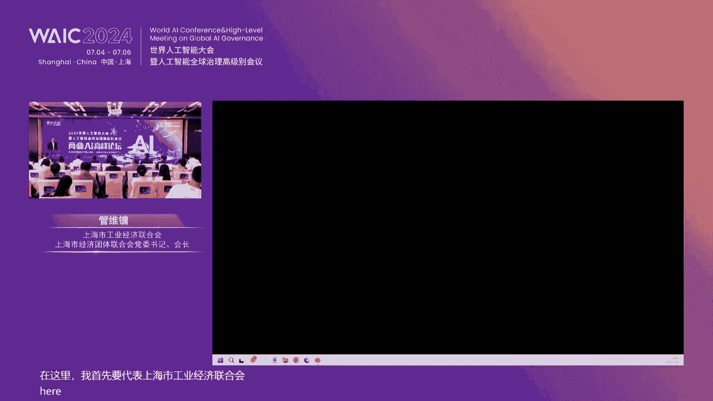
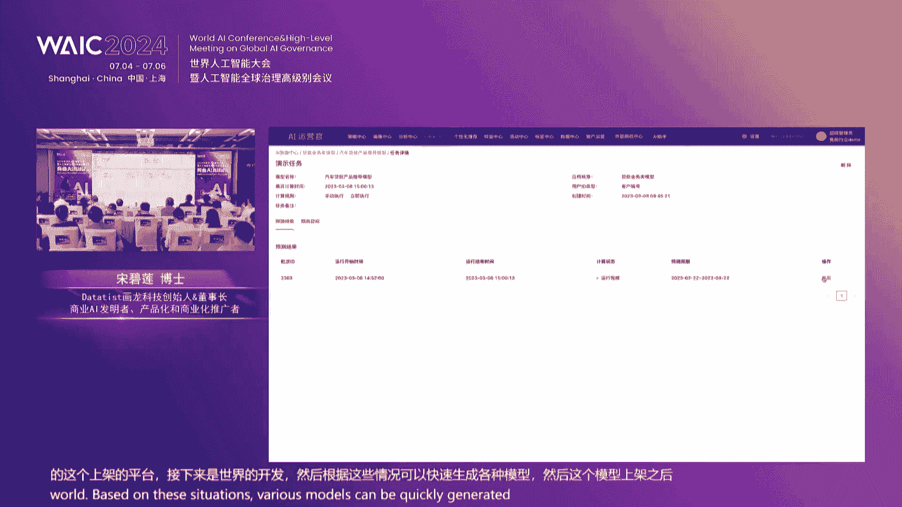
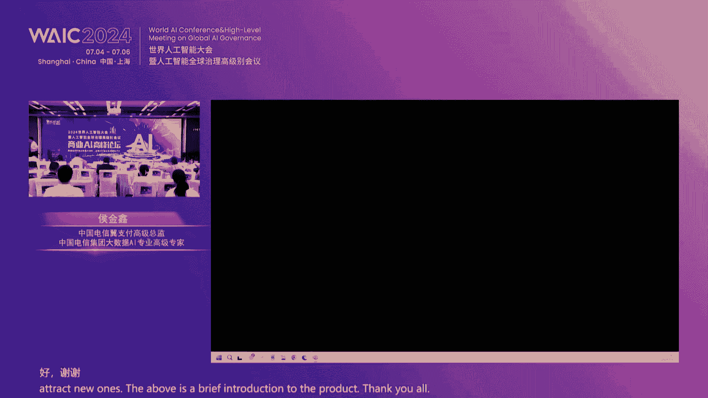

# 69：商业AI高峰论坛精华解读与实战教程 🚀

## 课程概述
在本节课中，我们将系统性地学习2024世界人工智能大会商业AI高峰论坛的核心内容。课程将涵盖数字化转型的系统建设方法论、智能决策AI的应用、一体化运营平台设计以及多个行业的成功落地案例。我们将深入浅出地解析如何利用数据要素和AI技术打造新质生产力，为企业降本增效、提质增效提供清晰的路径。

---

## 第一部分：论坛背景与核心议题 🎯

本次论坛由华龙科技承办，聚焦“数据经济赋能业务降本增效，决策AI打造新质生产力”的核心主题。论坛汇集了金融、科技等领域的专家，共同探讨数据要素如何通过AI发挥经济价值，以及商业决策AI如何成为企业发展的核心驱动力。

数字化转型并非短期工程，而是一个需要长期投入和迭代的持续性过程。其根本目标在于通过数据与智能技术重塑企业内核，引领商业决策与运营进入智能化新时代。

---

## 第二部分：数字化转型的系统方法论 🏗️

上一节我们了解了论坛的宏观背景，本节中我们来看看支撑数字化转型的具体系统建设方法论。成功的数字化运营需要围绕两个永恒的营销目标：**提高效果**与**提高效率**。

*   **提高效果**：依赖于数字化和智能化，即构建“决策大脑”。
*   **提高效率**：依赖于自动化和一体化，即构建“执行发动机”。

阻碍效率提升的主要有三大因素，对应系统的四个设计层面：

1.  **组织效率**：从部门级走向企业级，需要提高跨部门协同效率。
2.  **操作效率**：从手工操作走向自动化，提升运营操作效率。
3.  **数据与决策效率**：从系统碎片化走向一体化，打通数据流与决策流。
4.  **决策效果**：从数字化走向智能化，提升运营决策的精准度。

**核心公式**：`新质生产力 = 数据要素 × AI模型`。只有两者深度耦合，才能产生指数级的价值增长。

---

## 第三部分：数字化系统现状与升级路径 🔄

目前，国内企业在数字化系统建设上普遍面临规划不足、预算有限、系统孤岛、打通困难等挑战。相比之下，国际领先企业通过长期投入和并购整合，已形成较为完整的数字化产品矩阵。

对于主要从事C端零售业务的企业（如银行、券商），全球范围内都普遍缺少两个关键组件：**决策大脑**和**连接器（发动机）**。华龙科技的解决方案正是填补了这两个空白。

以下是企业数字化运营平台从1.0到5.0的典型升级路径：

*   **1.0 半自动化平台**：以活动管理、权益管理为核心，各环节依赖手工串联，跨部门协作效率低。
*   **2.0 自动化营销平台(MA)**：将人群、权益、内容、渠道等营销要素在一个平台内打通，形成自动化闭环。但需注意画布逻辑、并发性能、AB测试功能等关键点的设计。
*   **3.0 数字化营销平台**：在MA基础上，强化数据能力。需建设**营销数据库**（客户、产品、策略360度视图）、**营销特征库/画像平台**（批量生产预测性标签）、**营销分析平台**（前中后全流程实时分析）。
*   **4.0 智能化营销平台**：引入决策AI，分为**企业级大脑**（如预算分配、渠道归因）和**部门级小脑**（如手机银行流量分发、客户经理赋能、智能客服）。重点是实现模型的自动化、规模化生产与应用。
*   **5.0 一体化智能运营平台**：将系统、数据、AI、运营策略四大要素深度融合在一个平台内，实现跨部门、总分联动的企业级智能运营，发挥最大效果与效率优势。

**关键误区澄清**：
*   **大模型 ≠ 万能模型**：金融行业更应关注基于内部合规数据的**决策大模型**（理科生），而非完全依赖外部数据的文本大模型（文科生）。两者结合（决策模型+文本模型）是更佳路径。
*   **模型平台 ≠ 模型训练平台**：完整的模型平台应包括模型训练、特征自动化生产、模型调度、策略形成及业务应用的全流程。

---

## 第四部分：核心AI应用场景详解 🧠

上一节我们梳理了系统演进的框架，本节我们深入看看几个关键的AI应用场景是如何具体落地的。

以下是三个重要的部门级“小脑”应用：

### 1. 线上APP智能流量分发平台
当营销活动数量激增、渠道资源（如APP弹窗、短信）成为瓶颈时，需要智能调度解决“人货场”的精准匹配和竞争问题。
*   **核心问题**：业务部门间资源争夺、用户接收信息千篇一律、通道拥堵。
*   **解决方案**：通过AI算法，根据用户偏好、活动转化率、业务目标（如提升AUM或MAU）等进行实时个性化排序和推荐，实现“千人千面”，提升整体转化效率。

### 2. 线下客户经理赋能平台
与流量分发平台类似，但增加了“客户经理”这个动态变量。需要对客户经理进行精准画像，并结合管户政策，实现“客户-产品-客户经理”的最优匹配，大幅提升线下转化效能。

### 3. 大小模型结合的智能客服/外呼
解决大模型在金融场景落地难、难以直接产生经济价值的问题。
*   **创新模式**：`精准商机挖掘（决策小模型） + 个性化内容生成（文本大模型）`。
*   **流程**：先用决策模型分析内部数据，精准预测客户需求（如理财意向）；再触发虚拟助手，调用大模型生成与之匹配的个性化资讯、话术或产品解读进行触达。这样既合规，又能直接驱动业务转化。

---

## 第五部分：行业落地案例与实战经验 💼

理论需要实践验证，以下是来自不同行业专家的实战经验分享。

### 银行零售数字化运营（以工商银行山东分行为例）
*   **策略**：围绕客户资产全生命周期，先定“全局资产提升”大目标，再拆解到存款、理财等子场景。避免单个产品目标与全局目标冲突。
*   **关键模型**：资产提升模型、资产防流失模型、产品推荐模型。
*   **运营链路**：设计多波次营销（如存款促增、资产达标激励、产品推荐），线上孵化意向，线下客户经理收单。
*   **成效**：通过模型挖掘，使传统运营难以触达的长尾客户资产提及率从0.1%提升至6.2%，实现了显著的增量价值。

### 券商数字化智能运营（以广发证券为例）
*   **核心**：通过可视化的流程画布工具，极大降低运营人员将专家经验转化为实战活动的门槛，激发主动性。
*   **发展**：从自动化运营（MA）向个性化推荐（流量分发）演进，解决内部资源竞争问题。同时，注重数据底座的治理，以支撑实时效果分析。
*   **愿景**：将数字化工具像手机一样，赋能给公司每一个员工，成为基础能力。

### 保险业AI应用实践（以中邮保险为例）
*   **阶段**：从信息化（流程线上化）到数据化（数据驱动），再到智能化（AI深度赋能）。
*   **应用场景**：
    *   **智能质检**：AI初检+人工复检，效率提升4倍。
    *   **智能外呼**：用于新单回访、续期提醒等，呼出效率提升8倍。
    *   **智能营销助手**：为销售人员提供7x24小时知识问答支持。
    *   **智能两核**（核保/核赔）：提升自动化程度与风控能力。
*   **未来探索**：构建行业知识库与大模型，赋能客服与销售；试点AI辅助编程。

---

## 第六部分：生态合作与赋能模式

数字化转型不仅需要企业自身努力，也离不开外部生态的合作。论坛展示了以下几种合作模式：

1.  **数据合规应用**：与运营商（如中国电信易支付）等“国家队”数据源合作，在隐私计算等技术保障下，安全合规地丰富用户画像，用于精准拉新或风险防控。
2.  **场景生态共建**：与维度信息等拥有线下场景（如汽车、家装分期）的公司合作，结合华龙的AI决策能力，共同提升场景金融的转化效果。
3.  **SaaS化赋能中小机构**：与通联金融等服务机构合作，将经过大行验证的AI运营模型和平台以SaaS形式输出，帮助中小银行以更低成本、更快速度实现信用卡、零售等业务的数字化智能运营。

---

## 课程总结 🎓

本节课我们一起学习了商业AI高峰论坛的核心精华。我们认识到：

1.  **数字化转型是系统工程**：需要从战略、组织、数据、工具、流程、人才多方面协同推进，遵循“定战略、改组织、建平台、保效果”的路径。
2.  **决策AI是新质生产力的核心引擎**：能够极大提升运营决策的精度和效率，实现降本增效和提质增效。
3.  **一体化平台是终极方向**：未来竞争是体系化竞争，需要打破系统孤岛和数据壁垒，构建集系统、数据、AI、运营于一体的智能运营平台。
4.  **业务与技术的双轮驱动**：AI的价值必须与业务场景深度结合，由业务目标牵引，技术提供支撑，并在持续运营中闭环优化。
5.  **开放合作共建生态**：通过产业链上下游合作，可以更快补齐能力短板，共同推动商业AI产业的蓬勃发展。

变革往往伴随新的机遇。数字化和智能化为我们提供了前所未有的能力，通过本次课程学习的方法论与案例，希望能助力各位在探索商业AI的道路上方向更清晰，步伐更坚定。

---
**注**：本教程根据公开论坛内容整理，旨在知识分享与学习。文中提及的具体产品、案例及数据均来源于论坛演讲，仅供参考。