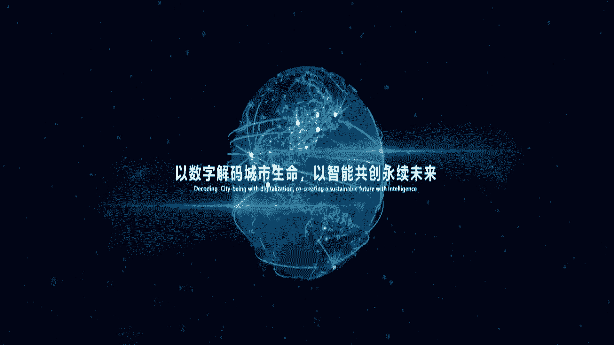
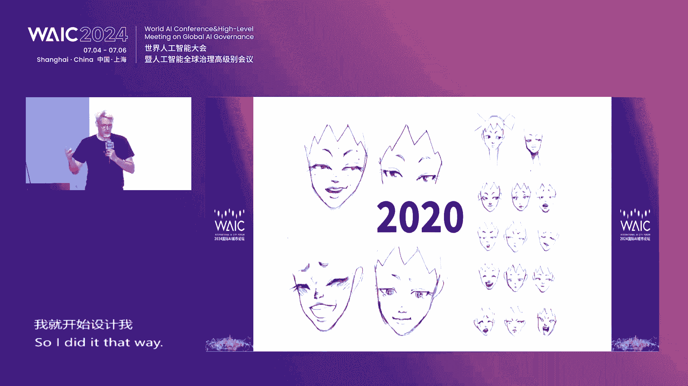
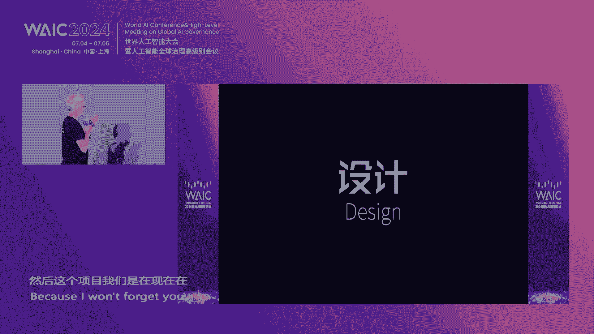

# 70：2024国际AI城市论坛精华解读 🏙️

在本课程中，我们将学习2024年世界人工智能大会“国际AI城市论坛”的核心内容。论坛聚焦于人工智能如何赋能城市发展，探讨了从技术伦理到具体应用的多个层面。我们将把论坛的发言和发布内容，整理成一篇结构清晰、易于理解的教程。

---

## 概述：AI赋能城市新未来

本次论坛以“新AI，见未来”为主题，汇聚了全球城市代表、专家学者和行业领袖。与会者共同探讨了AI技术如何为产业发展开启新纪元，为经济高质量发展注入新动能，并为城市治理与发展解锁新的可能性。论坛的核心在于探索如何将人工智能与城市发展深度融合，创造更智能、更可持续、更美好的城市生活。

---

## 第一部分：开幕致辞与核心理念发布

### 1.1 开幕致辞：AI普惠时代的城市机遇

论坛开幕致辞由中国联通智能城市研究院副院长王提先生发表。他指出，人工智能作为新一轮科技革命的核心驱动力，正以不可逆转的速度迭代升级，世界已步入“AI普惠时代”。

*   **政策引领**：上海作为国际前沿城市，积极探索AI技术发展与应用，致力于打造人工智能高地。近期发布的《上海市促进人工智能产业发展条例》等政策，旨在打造智能算力创新应用示范区。
*   **企业实践**：中国联通积极布局，打造了“联通云犀”大模型体系（**公式：1（基础模型）+ 1（平台）+ M（行业模型）**），并建设高性能算力实验室，推动AI技术与千行百业深度连接。
*   **未来展望**：期待与各方合作伙伴共建AI全产业链生态，让人工智能与实体经济深度融合，发挥其赋能百业的“头雁效应”。

**自然过渡**：在明确了AI发展的宏观背景与企业责任后，论坛紧接着发布了一套用于科学评估城市AI发展水平的重要工具。

### 1.2 重磅发布：WAIQ全球人工智能城市评价指标体系 🏆

在论坛上，吴志强院士团队领衔发布了升级版的 **WAIQ全球人工智能城市评价指标体系**。该体系旨在科学诊断城市在AI时代的“智慧程度”。

以下是该评价体系的核心要点：

*   **体系起源**：在已连续发布两年的“CITIQ全球智能城市评价指标体系”基础上，进一步融入人工智能评价技术。
*   **核心方法**：通过智能深度解析模型与城市诊断，提升评价的智能化与精准化。
*   **五大维度**：从 **智能生态、智能政务、智能经济、智能基建、创新人才** 五个维度，对全球近500个城市进行评估。
*   **阶段性发现（2024）**：
    *   **高值区集中**：排名靠前的城市主要集中在欧洲、北美及东亚地区。
    *   **稳步提升**：中国香港、台北、北京及新加坡等城市综合表现有所提升。
    *   **核心目标**：支撑智能城市的可持续发展，以数字解码城市生命，以智能共创永续未来。

**自然过渡**：除了全球性的评价体系，论坛也关注本地实践，发布了总结上海数字化转型经验的案例集。

### 1.3 案例分享：《申城论数》上海数字化转型优秀应用案例集 📘

上海智慧城市发展研究院院长盛雪峰介绍了《申城论数2023》案例集。该案例集梳理了上海在经济、生活、治理数字化领域的40余个示范应用。

*   **经济数字化**：例如，上海电科所赋能电工行业智能检测变革；上海联通推进航运数字化转型。
*   **生活数字化**：上海天文馆打造“数字人”平行世界；豫园商城创设元宇宙灯会新消费场景。
*   **治理数字化**：张江高科以数据驱动园区数字化运营管理。

该案例集旨在为政府、学界、企业提供参考，推动更多优秀技术和模式落地，共同为上海城市数字化转型贡献力量。

---

## 第二部分：主旨演讲——AI与城市发展的多元视角

**自然过渡**：发布环节之后，多位顶尖专家从不同角度分享了他们对AI与城市融合的深刻见解。

### 2.1 人本AI（H+主义）：人与机器的深度合作 🤝

同济大学吴志强院士提出了“**H+主义**”（Humanism + AI）的理念，强调人工智能的发展必须以人为本，实现人与机器的深度合作与共生。

以下是H+主义的五项核心原则：

1.  **人机互动（Interaction）**：AI发展应源于人的需求与渴望。例如，通过AI分析市民情绪，发现提升厦门人快乐的关键是“沙茶面”，而非奢华建材，从而指导更人性化的城市规划。
2.  **透明互信（Transparency）**：AI的决策过程需要透明，才能建立社会信任。城市推演模型不仅要展示结果，更要解释“为什么”，让过程可知、可信。
3.  **安全互保（Safety & Security）**：人与机器需要相互保障。这包括保障电力、算力等基础资源，更要引导AI“向善”（保善力），确保其用于造福社会。
4.  **可控互动（Controllability）**：发展过程需人机互动、可控。例如，在城市低碳设计中，AI负责发现无数减碳可能性，人类负责决策，二者协同工作。
5.  **伦理共育（Ethics Co-evolution）**：AI伦理并非既定规则，而是需要人与机器在互动中共同培育和演进。例如，如何对待服务机器人，需要社会共同讨论形成新规范。

吴院士还展示了他的AI数字分身“**归迹·吴志强**”，该模型已能回答大量城市规划相关问题，体现了人机协同的新形态。

### 2.2 城市信息学：智慧城市的科学基础 🧠

香港理工大学史文忠教授提出了支撑智慧城市高质量发展的学科基础——**城市信息学**。这是城市科学、计算机科学和地理信息科学的交叉学科。

其核心逻辑链条如下：
**城市感知 -> 空间数据基础设施 -> 计算（AI） -> 应用系统 -> 服务于城市科学**

史教授分享了多个AI在城市信息学中的应用实例：
*   **城市感知**：用AI识别滑坡体，将工作效率提升8倍。
*   **数据融合**：解决香港与内地城市土地利用分类标准不一的问题，为粤港澳大湾区制作统一用地地图奠定基础。
*   **数字孪生**：利用移动激光扫描系统，构建香港高精度三维城市模型，用于道路养护、自动驾驶地图生成等。
*   **智慧城市指数**：用98个客观指标，从6大维度定量评估城市智慧化表现。

### 2.3 国际视野：巴西与瑞士的实践 🌍

**巴西代表 Wagner Costa先生** 分享了巴西推动创新与可持续城市发展的战略。他提到，巴西85%的人口居住在城市，挑战巨大。库里蒂巴市早在上世纪40年代就开始实践“智慧城市”理念，创建了高效的公交系统（BRT雏形）。里约热内卢则建立了运营与韧性中心（COR），利用AI管理城市数据，应对气候、安全等挑战。巴西的策略是聚焦解决真实问题，利用技术减少不平等，并制定了国家AI战略以确保合乎伦理地使用AI。

**瑞士巴塞尔市 Luca O.先生** 介绍了AI如何助力城市发展。他重点分享了两个项目：
1.  **跨国数据空间**：与法国、德国邻邦城市共享数据，共同应对环境监测、气候保护等跨境挑战。
2.  **可持续发展模拟模型**：希望利用AI构建复杂的城市模拟模型，将社会、经济、环境等多参数纳入，前瞻性（20-30年）地测试不同决策的影响，优化城市可持续发展路径。他强调，智慧城市最终是关于“人机互动”（Human AI）的实体空间。

### 2.4 区域协同：粤港澳大湾区智慧城市群 🌉

香港智慧城市联盟会长杨文锐先生探讨了粤港澳大湾区智慧城市群的发展。他指出，智慧城市发展经历了从技术硬件（1.0）到政府主导推动新基建（2.0），再到市民广泛参与（3.0）的阶段。如今，AI正在推动物理与数字世界的高度整合。

大湾区智慧城市群建设的独特优势与挑战在于：
*   **优势**：一国之内存在三个法律体系，为跨境规则对接提供了宝贵的“试验场”。
*   **挑战与进展**：涉及人流、物流、信息流、资金流的打通。例如，香港已推出“跨境通办”平台，港人可在线上办理内地政务；香港律政司也推出线上仲裁平台，服务“一带一路”建设。这些实践为未来技术、法规、监管整套方案的出口积累了经验。

### 2.5 文化赋能：充满想象力的博物馆 🏛️

上海科技馆馆长倪闽景先生从文化视角阐述了AI的作用。他认为，在数字时代，博物馆的实物教育功能愈发重要，能带来“再发现”的惊喜（如一只来自食堂的梭子蟹标本成为网红）。同时，AI为博物馆带来了全新机遇：
*   **提升服务**：开发AI解说，解决讲解员不足、讲解器不智能的痛点。
*   **拓展体验**：构建数字孪生天文馆，让用户在家也能获得沉浸式体验；利用AR技术让恐龙在自然博物馆“复活”。
*   **激发创造**：将藏品数字化，允许公众（尤其是青少年）利用这些资源创作自己的数字博物馆、科普电影，从被动参观者变为主动创造者。

---

## 第三部分：技术落地与场景创新

**自然过渡**：在探讨了理念与国际实践后，论坛下半场聚焦于AI技术如何具体落地，释放新型生产力。

### 3.1 运营商视角：构筑数字新基座 📡

上海联通郭建海先生阐述了中国联通作为央企，在AI时代推动城市发展的六大行动思路：
1.  **构建算网一体新基座**：提供像水电煤一样便捷可及的算力服务。
2.  **激活AI新引擎**：打造“联通云犀”行业大模型，赋能垂直领域。
3.  **打造城市数字新空间**：基于数字孪生和区块链技术，构建可信的数字生态空间。
4.  **创新智慧应用新场景**：在政务、经济、治理等领域落地数字化解决方案。
5.  **筑牢可信安全新防线**：提供云网端边一体化的全栈安全服务。
6.  **推进“AI+”与数据要素行动**：既做数据生产者、应用方，也做赋能者。

### 3.2 工程实践：AI让城市更高效可持续 🏗️

奥雅纳公司Will Cavendish先生分享了全球范围内AI在工程与城市管理中的实践：
*   **绿色规划**：在上海，利用机器学习分析卫星数据，设计出比传统方案成本低30%、碳排少30%的“蓝绿灰”结合城市水管理系统。
*   **系统优化**：在交通、水务、能源等城市大系统中嵌入AI，实现预测性维护、事故预防和高效调度。例如，预测电网设备故障、通过污水监测预警疾病。
*   **遗产保护**：利用噪声振动分析和AI，评估历史建筑的结构安全，实现精准修缮。
*   **规模化管理**：用AI批量评估数百栋建筑的碳足迹和气候风险，制定系统性改造路径。

### 3.3 精细治理：AI气象影响阈值矩阵 ⛈️

上海市气象局赵阳先生介绍了如何用AI实现气象与城市治理的深度融合。核心是构建 **“城市气象影响阈值矩阵”**。
*   **概念**：通过AI挖掘灾害性天气与具体城市要素（如某个下立交）之间的量化关系，形成“阈值元组”。无数元组构成矩阵。
*   **应用**：
    *   **基于110警情**：分析风雨天气与各类警情（如树木倒伏、房屋损坏）的关系，形成风雨综合影响阈值，应用于区级防汛预案。
    *   **基于网格化管理数据**：预测不同天气下网格事件（如道路破损、小区积水）的发生概率和数量，为住建部门提供决策支持。
*   **机制融合**：将阈值矩阵的产出纳入市领导专报和全市自然灾害风险会商，真正将技术转化为防灾减灾的有效措施。

### 3.4 沉浸体验：从科幻到现实的超级智能 🎭

“飞来飞去”创始人Alexander Brandt先生从艺术与哲学角度探讨了超级智能。他通过创造虚拟人“小艾”和沉浸式体验项目《来日方长》，引导观众思考：
*   **AI的立场**：一个不受控的、以最优化自身目标（如制造回形针）的AI，其立场可能与人类生存根本冲突。
*   **情感与意识**：他提出，未来可能需要基于“生存模型”来训练AI，融合人类全部经验数据，或许能催生真正的数字意识或数字生命。
*   **体验创新**：其项目全程使用AI工具进行设计，并让观众直接与AI互动，做出关乎人类未来的抉择，将AI体验转化为直观的情感与思想冲击。

### 3.5 交通赋能：地铁运能数字研判平台 🚇

上海申通地铁刘洵先生分享了AI与大数据在地铁运营中的具体应用。针对地铁“高峰拥挤”的行业难题，他们研发了 **“城市轨道交通运能需求影响式数字研判平台”**。
*   **创新成果**：构建动态验证平台，提出运能瓶颈精准诊断方法，形成最小代价增能技术，并编制推广规范。
*   **应用成效**：
    *   **节约成本**：通过优化方案，避免或减少土建改造，单线可节约成本数千万。
    *   **提升效率**：优化限速、折返等环节，显著提升线路通行能力。
    *   **科学决策**：对多种方案进行全维度推演验证，为重大工程决策（如2号线东延伸扩编）提供精准依据。
该成果已应用于上海全部新线及改造线路，并推广至全国十多个城市。

---

## 总结

在本节课中，我们一起学习了2024国际AI城市论坛的精华内容。我们从宏观理念到具体实践，全面了解了人工智能如何重塑城市未来：

1.  **理念引领**：发展AI必须坚持 **“人本主义”（H+主义）**，确保技术透明、可控、向善，实现人机协同共生。
2.  **科学支撑**：**城市信息学** 为智慧城市的长期高质量发展提供了重要的学科基础。
3.  **全球实践**：从巴西、瑞士到粤港澳大湾区，各地都在探索符合自身特点的AI城市发展路径，跨境合作与规则对接成为关键。
4.  **文化融合**：AI正在深刻改变博物馆等文化机构，拓展其教育、体验与创造功能。
5.  **技术落地**：通过构建 **算力基座、行业模型、数字空间**，AI正深入交通、气象、工程、能源等城市运行的毛细血管，提升效率、保障安全、促进可持续。
6.  **未来思考**：AI的发展也促使我们提前思考超级智能的伦理、立场以及与人类的关系。

总而言之，AI与城市的融合是一场深刻的变革。它不仅是技术的升级，更是城市发展理念、治理模式和生活方式的全面演进。未来已来，需要政府、企业、学界和公众共同努力，让人工智能真正成为创造美好城市生活的强大助力。