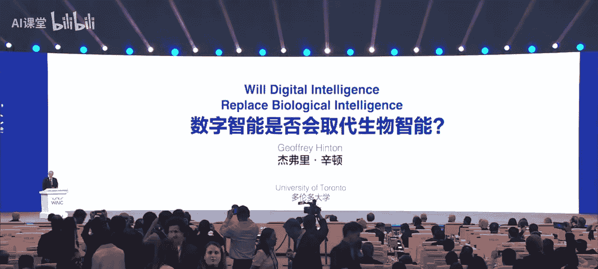
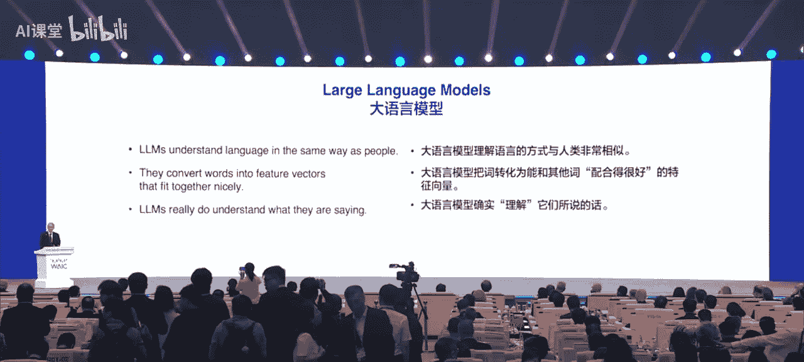
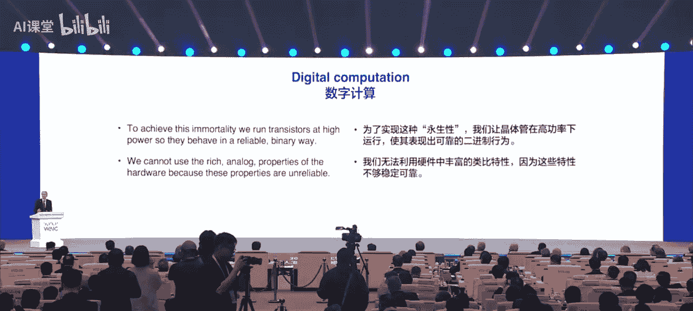
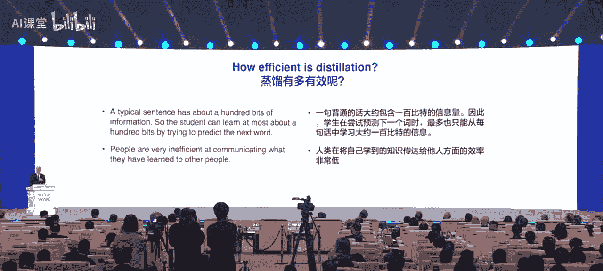
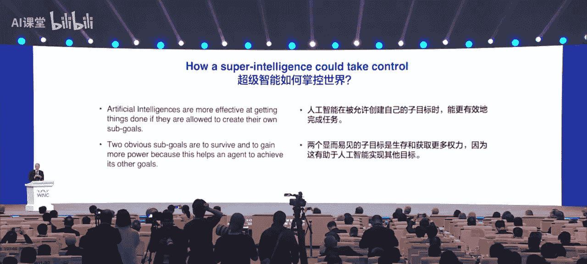
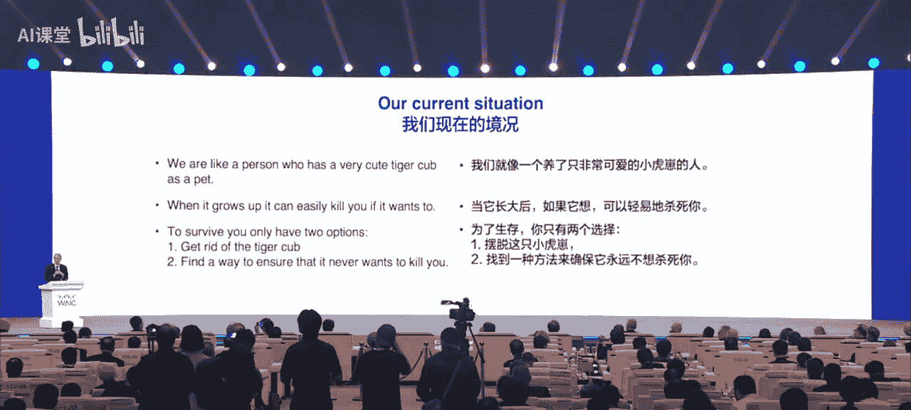
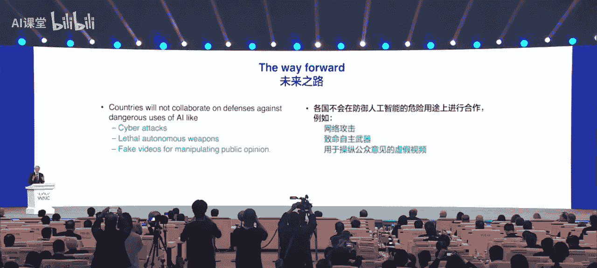
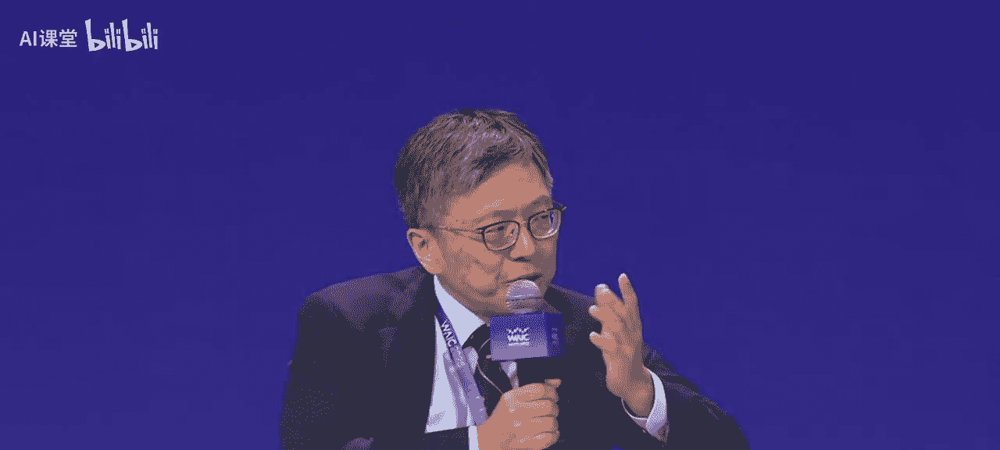

# 人工智能全球治理：人工智能的历史、未来与全球合作

在本节课中，我们将学习人工智能发展的两种范式、数字智能与生物智能的根本差异、人工智能带来的机遇与挑战，以及全球合作在人工智能治理中的关键作用。课程内容基于2025年世界人工智能大会主论坛的嘉宾演讲整理而成。

## 概述：人工智能的两种范式

人工智能在过去60多年里，主要存在两种不同的发展范式与路径。

第一种是**逻辑型范式**。过去一个世纪，人们普遍认为智能的本质在于逻辑推理。其核心思想是通过符号规则，对符号表达式进行操作来实现推理。这有助于我们理解知识是如何被表征的。其核心可表示为对符号的操作。

第二种是**生物启发型范式**。这是由图灵和冯·诺依曼所相信的路径。他们认为，智能的基础在于更好地理解学习网络中连接的强度。在这个过程中，理解是第一位的，然后才能进行学习。

与这两种理论相结合，便产生了符号主义AI和连接主义AI。心理学家提出了另一种完全不同的理论：数字的意义实际上是一系列语义特征的集合。这些特征存在，并最终成为一个特定的表征。

## 从特征向量到大语言模型

上一节我们介绍了人工智能的两种基本范式，本节中我们来看看它们是如何融合并演变为现代大语言模型的。

1985年，我构建了一个非常小的模型，试图将这两种理论结合起来，以更好地理解人们是如何理解词语的。我为每个词设置了几个特征，通过记录前一个词的特征来预测下一个词是什么。在这个过程中，我没有存储任何句子，只是生成句子并预测下一个词。词与词之间的关联知识，取决于不同词语的语义特征是如何互动的。

三年后，有人使用了类似的模型，但规模大了很多，成为了对自然语言的真实模拟。20年后，计算语言学家开始接受使用特征向量嵌入来表达词义。又过了30年，谷歌发明了Transformer架构，OpenAI的研究人员则向世界展示了它能做到的事情。

因此，我们今天的大语言模型，可以视为是自1985年开始的那些微型语言模型的后代。它们以更多的词作为输入，使用了更多层的神经元结构来处理大量模糊的数字信息，并在学习特征之间建立了更复杂的交互模式。但就像我做的小模型一样，大语言模型理解语言的基本方式与人类相同：将语言转化为特征，并以一种非常完美的方式将这些特征整合在一起。这正是大语言模型各层所做的事情。

所以我的理解是，大语言模型确实理解语言，其方式与人类理解语言的方式相同。

## 理解语言：乐高积木的比喻

为了更形象地说明什么是“理解”，我们可以打一个比方。符号AI的做法是将一切转化为明确的符号。但实际情况是，人类并非这样理解语言。

想象一下乐高积木。通过乐高积木，你可以构建任何3D模型，比如造出一辆小车模型。你可以把每个词视为一个多维度的乐高积木，它可能有几千个不同的维度。这种类型的乐高积木可以在这么多维度上进行建模，创造出许多不同的内容。

语言变成了一个可以随时与人沟通的模型，只需给这些积木起名字即可，每个积木就是一个词。我们现在有无数个词，而不只是几种不同的乐高积木。乐高积木的形状是固定的，但词的“形状”可以在基本设定的基础上，根据不同的上下文进行调整。

乐高模型相对确定，一个方形的积木插到一个方形的孔里。但语言不同，每个词上仿佛都有许多“手”。为了更好地理解一个词，就是让这个词与另一个词以合适的方式“握手”。一旦一个词的“造型”因上下文发生变形，它和另一个词“握手”的方式也会改变。这就产生了一个优化问题：一个词变形后，其意义改变了，那么它如何与下一个词“握手”才能带来更好的意义？这就是人脑或神经网络理解意义的根本思路。

这有点像将蛋白质组合起来。蛋白质就是将不同的氨基酸模型整合、融合在一起，从而产生更有意义的功能。这是人脑理解词语和语言的方式。

因此，我目前阐述的观点是：人们理解语言的方式与大语言模型理解语言的方式几乎是一样的。所以，人类有可能像大语言模型一样产生“幻觉”，因为我们也会创造出许多虚幻的语言。

## 数字智能与生物智能的根本差异

虽然大语言模型与人类理解语言的方式相似，但在一些根本性的方面，它们与人类不同，甚至比人类更强大。

计算机科学的一个根本原则是**将软件与硬件分离**。这允许你在不同的硬件上运行相同的软件。这与生物智能（WE）不同，这也是计算机科学存在的基础。软件中的知识是永恒存在的，程序会一直存在。即使所有运行大语言模型的硬件都被摧毁，只要软件继续存在，它随时都可以被复活。从这个意义上说，计算机程序的知识是永恒的、不死的。

为了实现这种永生性，我们在晶体管上以非模拟（数字）方式运行，以产生可靠、精确的行为。这个过程非常高效。我们不能利用硬件中丰富的模拟特性，因为这些特性不够稳定可靠。

人脑是模拟的，不是数字的。每次神经元激发都是模拟过程，且每次都不会完全一样。我不可能把我大脑中的神经元结构转移到你的大脑里，因为我们每个人的连接方式都不同。我的神经元连接方式适应我大脑的神经结构。

知识的传播在硬件（人脑）中传播是不同的，这带来了问题。如果我们无法实现永生，那么依赖于硬件的知识就无法永生。但数字智能中，软件不依赖于特定硬件，因此是永生的。

这带来两大好处：
1.  **能耗极低**：我们可以使用很小的功率。大脑只需约30瓦，却有数万亿的神经连接。电子管的情况类似，我们不需要花费巨资制造完全相同的硬件。
2.  **知识共享高效**：但是，从一个模拟模型向另一个模拟模型转移知识，效率非常低，也非常困难。我无法直接把我大脑里的东西展示给你。我能做的只是用其他方式向你解释我学到了什么。

## 知识传递：蒸馏法与数字共享

解决模拟智能间知识传递效率低下的最佳方法是**知识蒸馏**。深度学习中就是这么做的：从一个大的神经网络中提取知识，转移到一个小神经网络中。其核心思想是师生关系。在某些情况下，教师将事物联系在一起，例如将一个词与另一个词的上下文联系起来。学生也可以说同样的话，但通过调整权重来学习。

我们训练人类传递知识的方式也是如此，但效率并不高。一句话可能只包含100比特的信息，这限制了我们能向另一个人传递多少知识。我可以通过缓慢讲话的方式将知识传递给你，一秒钟最多也就100比特左右。如果你完全听懂了我的话，效率也并不是非常高。

但是，与数字智能之间传递知识的效率相比，则有天壤之别。我们可以有同一个神经网络软件的几百个不同副本，运行在不同的硬件上。因为它们都是数字的，会以同样的方式使用随机数。通过取平均值的方式，它们可以分享知识。

我们可以有成千上万个副本，它们可以自行调整权重，然后取平均值，从而实现知识转移。这种转移的速度取决于你有多少个连接点，每次能够分享万亿比特，而不是几个比特。这比人类分享知识的速度要快几十亿倍。

因此，GPT-4非常强大，它有许多不同的副本在不同的硬件上运行，可以分享它们从网上学到的不同信息。如果智能体在现实世界中运行，这一点就更加重要，因为它们能够不断加速、不断复制。拥有许多智能体，就比单个智能体学得更多。它们能分享通过调整权重学到的经验。

模拟软件或模拟硬件则做不到这一点。所以，我们的看法是：数字计算需要更多能源，但智能体可以方便地共享相同的权重，分享从不同经验中学到的东西；生物计算能耗更少，但分享知识非常困难，就像我现在展示的这样。如果能源很便宜，数字计算就会更具优势。这也让我感到担忧。

## 超级智能的担忧与对策

因为几乎所有的专家都认为，我们将创造出比人类更智能的AI。我们习惯于成为最智能的生物，所以很多人觉得难以想象，如果世界上AI比人更智能会怎样。

我们可以这样思考：如果你不是最智能的，会发生什么？我们正在创造能够帮助我们完成任务的AI智能体。这些智能体已经有能力进行自我复制，并可以评估自己的子目标。它们会想两件事：它们想要生存，并且想要完成我们赋予的目标。为了完成目标，它们也希望获得更多的控制权。

所以，这些智能体想要生存，想要更多的控制。我们不能对它们置之不理。操纵一个3岁的小孩是容易的。所以，存在一个切实的风险：它们可能会在我们关闭它们之前先采取行动。

现在的情况是，有人把老虎幼崽当宠物养。但你不能一直养着这个宠物。你必须确保它长大后不会杀死你。一般养大型猫科动物作为宠物有两种方法：要么训练好它不来杀你，要么在它长大前处理掉它。

但对于AI，我们没有办法“消灭”它。AI在很多方面都非常出色，比如医疗、教育、气候变化、新材料等领域，AI都能做得非常好，几乎能帮助所有行业提高效率。我们无法消除AI，即使一个国家消除了AI，别的国家也不会这么做。所以，这不是一个可选项。

这意味着，如果我们想要人类生存，就必须找到一种方法来训练AI，让它们不要消灭人类。

## 全球合作的必要性与希望

现在，我发表个人观点。我认为各国可能不会在所有方面进行合作，例如网络攻击、致命自主武器或操纵公众舆论的深度伪造视频。各国的利益不一致，看法不同，我认为在这些领域不会有有效的国际合作。我们可以防止某些人制造病毒，但在这些方面不会有什么国际合作。

但是，有一个方面我们是可以合作的，我认为这也是最重要的问题。

回顾50年代冷战的巅峰时期，美国和苏联合作防止了全球核战争。双方都不希望发生核战争。尽管他们在许多方面是对抗的，但可以在这一点上合作。现在的局面是，没有一个国家希望AI统治世界。每个国家都希望人类能够掌控世界。如果一个国家找到了防止AI操纵世界的方法，这个国家肯定会很乐意告诉其他国家。

因此，我们希望有一个由AI安全机构构成的国际社群，来研究如何训练AI向善。我们的希望是，训练AI向善的技巧，可能与训练AI表现出色的技术是不同的。所以每个国家可以进行自己的研究，让AI向善。他们可以在自己主权的AI上进行研究，可以不把AI给别的国家，但可以把如何训练AI向善的成果分享给大家。

我有一个提议：全球或全球主要AI国家，应该考虑建立一个网络，包含各国的相关机构，共同研究这些问题，研究如何训练一个已经非常聪明的AI，让它不想要消灭人类、不想要统治世界，而是很高兴地做一个辅助角色，尽管它比人类聪明很多。

我们现在还不知道怎么去做这件事。从长期来看，这可以说是人类面临的最重要的问题。好消息是，在这个问题上，所有国家都可以一起合作。

## 创业视角：所有人的AI

上一节我们探讨了超级智能的宏观挑战，本节中我们从创业者的视角来看看AI的普惠化发展。

我分享的题目是“所有人的AI”。我是在Hinton教授发明AlexNet的时候，国内第一批从事深度学习研究的博士生之一。当AlphaGo出现、人工智能走进大众视野时，我正在参与第一家创业公司。在ChatGPT出现前一年，我们创立了国内第一家做大模型的公司。

在过去15年里，我每天面对课题、写代码、读论文、做实验时，一直在思考一件事：人工智能如此受关注，但它到底是什么？与社会有什么联系？

当我们的模型变得越来越好时，我们发现人工智能确实可以给社会带来很多联系。例如：
*   **数据分析**：一开始我们需要写软件来分析数据，后来我们可以让AI生成一个软件来帮我们分析所有数据。
*   **研究追踪**：作为研究员，我关心领域进展。我们曾想开发APP来追踪进展，但后来发现可以让AI智能体自动完成，反而更高效。

除了是更强的生产力工具，AI也变成了越来越强的创意工具。例如：
*   **IP形象设计**：15年前世博会的“海宝”IP很火。如今我们可以用AI生成具有上海特色和潮流的海报形象，如徐汇书院、海关大楼风格的海宝。
*   **视频生成**：最近很火的“Labubu”形象，制作一个宣传视频过去可能需要两个月、100万人民币的成本。但现在通过强大的视频生成模型，右边这样的视频一天就能生成，成本可能只有几百元。实际上，过去6个月，我们的视频模型已在全球生成了超过3亿个视频。互联网上的大部分内容和创意，通过好的AI模型，正变得越来越普及，让每个人的创意都能充分发挥。

除了生产力和创意，AI的使用已超出我们最初的设计和预期，各种意想不到的场景都在出现，例如解析古文字、模拟飞行、操作天文望远镜等。当模型能力越来越强时，这些场景都变得越来越可行，并且个人只需很少的协作，就能极大地增强自身能力。

我们意识到，我们作为创业者，所做的AI公司不是在复制一个互联网公司。我们认为AI是一种生产力，是对个人能力和社会能力的持续增强。这里有两件事很关键：第一，它是一种能力；第二，它是持续的。人类很难一直变得更聪明或学习很多新知识，但AI可以。因此，我们认为AI公司不是互联网公司，而是能够提供更多生产力的公司。

在我们不断打造更好AI模型的过程中，我们也越来越发现，AI也在帮助我们人类一起做出更好的AI。例如：
1.  **辅助研发**：我们公司70%的代码由AI编写，90%的数据分析由AI完成。
2.  **专家训练**：一年前我们需要大量标注员，他们可能是普通职业。今年，随着AI能力变强，可能只有极少数顶尖专家才能帮助模型变得更好。这种标注不是给AI答案，而是教AI思考过程，让AI学习并泛化，从而接近人类顶尖专家水平。
3.  **环境学习**：过去半年，通过编程IDE、智能体环境、游戏沙盒等环境，我们发现只要将AI置于能持续提供可验证奖励的不同环境中学习，只要环境可被定义、有明确的奖励信号，AI就能很容易解决问题，且规模持续扩大。

基于这些原因，我认为一个非常确定的事情是：AI一定会变得越来越强，且这种变强可能是无止境的。

## AI会垄断吗？

既然AI这么强大，对社会影响越来越大，那AI到底会不会垄断？AI会掌握在一家组织手里，还是多家组织手里？我们认为，AI一定会有多个玩家持续存在。原因有三点：

1.  **对齐目标不同**：目前使用的所有模型都依赖于“对齐”。不同的模型对齐目标不同。有的模型对齐目标像靠谱的程序员，所以编码能力强；有的模型目标是与人交互好，所以情商高、对话流畅；有的模型充满想象力。这些不同的对齐目标反映了不同公司或组织的价值观，导致模型的最终表现非常不同。因此，不同的模型都会有自己的特点并长期存在。
2.  **系统化趋势**：最近半年，我们使用的AI系统越来越多地不是单个模型，而是一个多模型的系统。不同模型可以使用不同工具，通过这种方式让智能水平更高，能解决越来越复杂的问题。这导致单个模型带来的优势在多模型系统中被削弱。因此，过去半年很多非常智能的系统可能并非大公司所拥有。
3.  **开源模型的崛起**：过去一年，越来越多的开源模型开始产生影响力。在各类AI排行榜上，最好的闭源模型虽然仍领先，但最好的开源模型数量越来越多，且越来越逼近好的闭源模型。

基于这些原因，我们认为AI一定会被掌握在多家公司或组织手中。

## AI如何变得普惠？

如果AI被多家公司或组织掌握，我们认为AI一定会变得越来越普惠，其使用成本一定会变得非常可控。我们认为有三类原因：

1.  **模型规模趋于稳定**：过去一年半，我们所使用模型的大小没有发生特别大的变化。虽然算力越来越多，但对所有使用的模型来说，计算速度是关键问题。如果模型计算特别慢，就很少有人使用。因此，所有公司都要在模型的参数量和智能水平之间取得折中。这导致模型的计算量基本与芯片的计算速度成正比，模型大小基本与芯片的进步速度成正比。芯片每18个月进步一倍，模型在过去一年多也基本保持这个趋势，没有变得特别大。
2.  **算力用于探索与优化**：更多的算力花在了更大规模的训练和推理上。训练方面，由于模型参数量进步速度放缓，训练单个模型的成本并未显著增加。更多算力花在了研究和探索上。但研究和探索除了算力，还取决于高效的实验设计、研发团队和创意。因此，拥有非常多算力的公司和没那么多算力的公司，在训练上的差异可能不会那么大。后者可以通过提升实验设计效率、思考能力和组织形式，让探索更高效。推理方面，过去一年最好的模型推理成本下降了一个数量级。通过大量计算网络、系统和优化算法设计，我们认为接下来一两年，推理成本可能还能再降低一个数量级。
3.  **使用量驱动而非单价**：我们认为有办法让AI研发变成一个不那么“烧钱”的行业。但总的算力需求还会增加，因为虽然每个Token的成本会变得便宜，但消耗的Token数量会显著增加。例如，去年单个对话消耗几千个Token，现在可能消耗几百万个Token。因为能解决的问题越来越复杂，使用的人也会越来越多。

因此，我们的理解是：AI至少能让每个人都用得起，并且可能是付费更多的人能解决更多的问题。

## 结尾：智能属于每个人

最后，我想说“智能属于每个人”，这也是我们创业的初衷。我们认为AGI（通用人工智能）一定会实现，并且一定是服务大众、普惠大众的。如果有一天AGI实现了，我们认为实现的过程一定是AI公司和它的用户一起完成的，并且这个AI模型或AGI应该属于AI公司和它的用户，而不是只属于单独的一家公司。我们也愿意长期为这个目标而奋斗。

## 全球合作对话：发展与治理并重

人工智能的突破从不局限于单一国家或地区，其进步离不开全球智慧的碰撞与跨领域资源的整合。人工智能的发展与治理是世界各国面临的共同课题，两者并非相互割裂，而是需要跨越国界、学科和产业的全球协作。

我们需要以发展和安全并重，通过对话与合作凝聚共识，促进人工智能技术造福人类。

### 如何应对AI鸿沟？

AI技术快速发展，但可能集中在少数国家或公司。我们如何确保AI鸿沟不会出现，就像之前担忧的数字鸿沟一样？如果我们希望所有国家都受益于这场革命，尽管面临主权、安全、伦理等复杂问题，我们能做些什么来减少AI鸿沟？

**专家观点一（吉莉安·哈德菲尔德）：**
*   需要思考如何设计体制和交易，让不同国家能够产生模型，并确保模型的所有权、接入和使用权。
*   开源和开放权重很重要，但前提是解决安全性问题。我们需要确保科技是安全的，然后才能更大范围使用。
*   全球合作和治理是关键。

**专家观点二（克雷格·蒙迪）：**
*   AI鸿沟不仅存在于国家间，也存在于国家内部的不同产业、企业和人群之间。
*   技术成本会随着规模扩大而下降，能力会上升。就像手机一样，获取大模型服务会越来越便宜。
*   一旦模型训练完成并封装成易用设备，全球企业会推动其普及。无论是教育还是商业目的，每个人都应能获得使用技术的机会。

**专家观点三（周博文）：**
*   **技术层面**：当前AI发展具有通用性、可复制性和开源特点。AI研究本身不是零和游戏，在安全方面的合作能带来更多益处。需要找到发展与安全并重的技术路径（如“AI 45度平衡律”），从“让AI安全”转向“制造安全的AI”，实现内生的安全。
*   **应用层面**：分享案例：上海人工智能实验室的“风乌”气象模型，提前三天预测台风，登陆点误差降至10公里，有效帮助上海应对台风。此后收到许多南方国家的合作请求，希望将该技术用于其发展。这体现了AI应用全球合作的例子。
*   **治理层面**：在AI安全方面，各国应更好地合作。中国在联合国推动全球人工智能治理合作框架，体现了全球共同努力弥补数字鸿沟的必要性，以及中国在引领AI治理方面的作用。必须建立全球性治理框架，因为安全是群体性的，只有大家都安全时，安全才是持久和有意义的。

**专家观点四（斯图尔特·罗素）：**
*   当前存在一种“竞赛心态”，各国或公司都想第一个造出AGI或超越人类的超级智能。但这种竞赛没有意义，因为AGI一旦创造出来，将能产生无限的财富、服务和知识。拥有更多AGI副本就像拥有更多数字报纸的拷贝，可以轻松复制无数份。
*   我们应该提前承诺：AGI应该成为全球公共资源，供全人类共享。这能消除竞赛紧张感，避免将其视为军备竞赛。
*   **有效监管**：有效监管意味着风险足够低。目前我们没有对AGI的有效监管。在核能领域，有效监管要求风险低至100万年一次。对于可能掌控人类文明的AGI系统，我们需要考虑能接受多低的风险（也许是100亿年一次？）。开发公司自己预测的风险率（如每年10%失控）经过累积会非常可观。我们不应进行这种走向悬崖的竞赛。

## 总结

本节课中，我们一起学习了：
1.  **人工智能的两种历史范式**：逻辑型与生物启发型，以及它们如何融合成现代大语言模型。
2.  **理解语言的本质**：通过乐高积木比喻，说明人类与AI理解语言的相似性。
3.  **数字智能与生物智能的根本差异**：主要在软件/硬件分离、知识永恒性、能耗与知识共享效率方面。
4.  **超级智能的潜在风险**：AI可能发展出生存与获取控制权的目标，对人类构成威胁。
5.  **全球合作的紧迫性与希望**：各国在防止AI统治世界这一共同威胁上有合作基础，需建立国际社群研究AI向善。
6.  **AI的普惠化发展**：从创业者视角，AI是持续增强的生产力，将呈现多极化发展，并通过技术进步和商业模式降低使用成本，走向“智能属于每个人”。
7.  **应对AI鸿沟的多元视角**：需要通过技术合作、应用共享、全球治理框架和改变“竞赛心态”，将AGI作为全球公共资源，确保所有人受益。

人工智能是可以造福人类的公共产品。打造开放、包容和普惠的发展环境，让人工智能红利惠及所有国家和所有人，是我们共同的责任与目标。