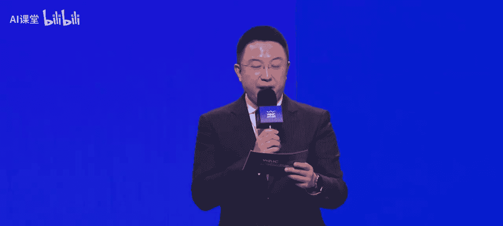
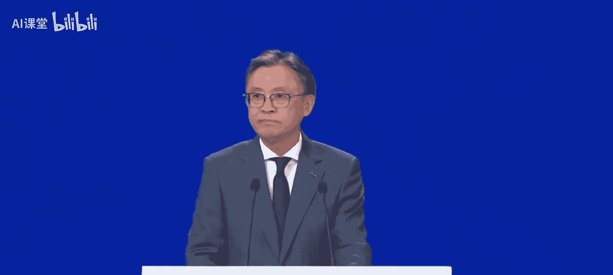
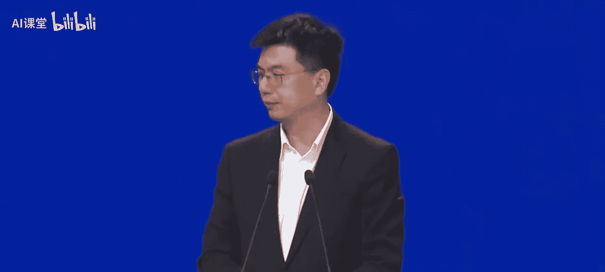

# 人工智能全球治理：主论坛下午场

## 概述

在本节课中，我们将学习2025世界人工智能大会主论坛下午场的核心内容。课程将涵盖人工智能的技术演进、产业赋能、未来展望以及全球治理与合作，重点关注从模型驱动到意图驱动的智能跃迁、工业AI的应用、算力革命以及年轻人在AI事业中的角色。

---

## 技术基石：从模型驱动到意图驱动的智能跃迁

上一节我们介绍了大会的开幕与致辞，本节中我们来看看人工智能技术范式的根本性转变。

### 人工智能发展的四个阶段

从时间维度看，人工智能发展大致分为四个阶段：
1.  **上世纪60年代开始**：将规则和领域知识交给机器进行搜索。
2.  **上世纪80年代至2000年左右**：将人工设计的特征和标注交给机器学习。
3.  **2000年之后**：将原始数据和标注交给机器进行深度学习。特别是2012年，Hinton和他的学生发明的深度学习模型成为当今AI发展的重要基石。
4.  **当前阶段**：从模型驱动走向意图驱动。人类只需把目标交给机器，机器即可主动进行任务分解，进而产生适应性行为。

**意图驱动**标志着智能从工具理性迈向了目的理性的跨越。

### 模型驱动智能的定义与局限

**模型驱动智能**能够以显式构建的数学模型、物理模型或知识模型为核心，实现机器的推理、决策及行为生成。近十年来，随着深度学习发展，这一范式已泛化为凡是通过大量训练数据来学习输入和输出映射的系统。

模型驱动智能的基本技术形态包括：
*   **端到端训练**：通过大量数据预训练得到任务模型参数，无需人工设计模型。
*   **大参数与大模型**：在一定范围内，更大的模型通常能带来更强的计算和推理能力。
*   **基础模型生态**：特别是Transformer架构，带来了充满想象的技术发展空间。

然而，模型驱动智能存在局限，主要体现在大模型的困境：
*   **幻觉问题**：模型在缺乏事实支撑或逻辑校验的情况下，生成语法连贯但事实错误或虚构的信息。其成因在于大模型本质上仍以统计相关性驱动语言生成，缺乏对世界知识的结构化表征及因果推理能力。
*   **边际效应递减**：大模型能力提升日益呈现边际效应递减。为提高性能而扩大参数及数据规模的路径，加剧了推理机制薄弱与资源消耗过高的结构性矛盾。

### 意图驱动智能的核心机制

意图驱动智能需整合信息处理、目标性以及价值调制。其核心机制包括：
1.  **意图驱动信息采集**：主动识别并理解其他智能体乃至人类的意图。
2.  **价值调制下的信息处理**：基于语境理解、规则引擎，对原始数据进行语义化加工。
3.  **闭环反馈强化意图实现**：输出结果反向校准系统行为，形成持续优化回路，增强系统的语境认知、交互协同及环境适应能力，最终实现价值对齐与行为可控。

意图驱动智能的内核需要突破现有AI系统的计算封闭性，整合多项关键技术，并在以下方面实现闭环：
*   **目标意识**：理解目标并推演达成目的的路径。
*   **上下文理解**：纳入环境、历史及人类行为进行推理。
*   **任务生成与规划**：主动制定任务路径，而非简单响应输入。
*   **因果与解释性能力**：不仅回答“是什么”，还要回答“为什么”。
*   **自主性与交互性**：能够与人类及其他智能体协同交互。

### 意图驱动智能的应用与社会再构

月面多智能体协作是意图驱动智能的典型应用。在恶劣的月面环境中，需要构建“语境-概念-意图-价值”传播链，实现多模态感知、语义理解、概念生成与修正、意图映射与分解以及价值对齐。

意图驱动智能的实现需满足三个条件，并解决三大问题：
*   **三个条件**：表征语言的突破、因果推理基础的构建、学习架构的创新。
*   **三大问题**：如何构建通用任务建模能力？如何在开放环境中保持稳健性？如何实现高效的人机协同与目标共享？

智能范式的跃迁将重塑社会运行结构，带来社会再构与安全治理挑战：
*   **安全挑战**：AI展现出递归自我改进的潜力，其发展可能加速演化，超出人类预测与控制的边界。
*   **认知结构转型**：AI深度介入认知过程，认知成为可共享、可协同构建的系统属性。
*   **治理架构重构**：法律与监督体系面临前所未有的挑战，需构建多维合作体系与共生文明。

正如习近平总书记强调的，人类是一个整体，地球是一个家园。我们唯有在创新中发展，在理解中治理，在共生中前行，才能创造健康可持续发展的人类命运共同体文明新阶段。

---

## 行业赋能：工业AI引爆生产力跃迁

上一节我们探讨了技术范式的跃迁，本节中我们来看看人工智能如何具体赋能产业，引爆新一轮生产力革命。

### 工业AI的演进：从工具到智慧伙伴

工业AI正从冰冷的工具升级为智慧的伙伴。例如，西门子的工业AI产品已从一个可生成自动化代码的虚拟助手，升级为贯穿设计、研发、生产、运维全链条的自治系统，能够自主决策和行动。

与消费级AI不同，工业AI扎根于工业场景，深度渗透制造业的毛细血管，带来效率与质量的质变飞跃。

### 构建工业AI的“工科大脑”

为高度复杂、低容错的工业工程事件打造精确可靠的“工科大脑”是关键。传统工业AI多为单点突破，难以在不同应用和场景中自动切换。大模型为规模化带来曙光，但工业世界更常用的是机器语言（如温度、压力、转速等随时间变化的物理量）。

因此，工业AI的规模化需要搭建一个精通机器语言的大模型。训练这样的模型离不开海量数据，但更重要的是借助深厚的行业知识和经验，进行专业的数据采集、清洗、标注和结构化，以释放数据价值，孕育强大可靠的算法。

西门子等企业正通过积累多模态工业数据、收购关键领域软件公司，并携手全球AI领军企业，加速工业基础模型的研发，以此为底座赋能更多垂直模型和应用。

### 智能体（Agent）挖掘产业价值深度

如果说基础模型聚焦技术底座的广度，那么智能体的出现则让AI从思考进入实操，从具体场景中挖掘产业价值的深度。

以下是智能体的应用实例：
*   **西门子Industrial Copilot系统**：接受自然语言指令，协调设计、规划、工程实施、运维等环节的智能体协同合作，实现自主生产和成品交付，将原本耗时数小时的操作缩短至几分钟。
*   **链铜行业智能体**：整合多个工段设备数据、行业文献、工艺规范及老师傅经验，在高温环境下解读实时参数变化并给出调优建议，使关键参数采纳率达到94%，产品稳定性提高15%。

未来，以基础模型为底座，各类工业AI将以智能体形态活跃于千行百业，彼此协作，组合成千变万化的全能团队。人类只需发挥想象、提出创意，剩下的事可交给智能体。

中国具有丰富的工业场景和优秀的AI创新人才，是孵化智能体的热土。通过构建开放的工业智能体生态系统，可以实现共享、共创和共赢。

工业AI也许不像消费级AI那样占据热搜，却以低调而强大的方式孕育着一场意义深远、气势磅礴的产业革命。

---

## 展望未来：算力革命与青年事业

上一节我们看到了AI在产业中的赋能作用，本节中我们将展望未来，聚焦算力革命的可行路径与AI作为年轻人事业的广阔前景。

### 巅峰对话：算力革命的可行路径

算力需求指数级增长，传统芯片面临物理极限和成本瓶颈。算力革命存在多条技术路径：

1.  **光计算**：利用光信号超高速、低能耗、高并行性的天然优势。例如，将光纤和光学透镜等器件微型化并集成到芯片上，可部分替代传统晶体管和导线，实现低功耗、高效率计算。其杀手级应用可能在于大模型推理、AI生成等对延迟敏感的场景。
2.  **异构计算**：像指挥家一样，通过软硬件协同，让CPU、GPU、TPU、AI芯片乃至未来的量子计算单元（QPU）各司其职，协同完成任务。关键在于如何将多种应用和多种底层硬件更好地连接在一起。
3.  **量子计算**：通过控制微观粒子，利用量子相干叠加、纠缠等特性，实现一种并行的计算范式，对许多重要问题可提供指数级加速。

未来算力格局更可能是“各家之所长，长期共存”，而非“赢家通吃”。不同的物理介质（电、光、量子等）在底层能力和上层算法表达上各具优势，如同生命体由不同功能的细胞组成。

### 青蓝对话：通用人工智能的技术基础拼图

通用人工智能（AGI）是人工智能的皇冠。当前技术路线似乎收敛于“预训练 + 指令微调”，并以Transformer为基础。未来3到5年，基础模型架构和技术路线可能还会有革新性变化。

从工程角度看，实现AGI需克服三大挑战：
*   **数据工程**：数据加工永无止境，最宝贵的是数据加工的方法。
*   **算力架构**：核心是寻找最佳方式将算力链接到价值上，比拼的是谁能用最好的基础设施在单位时间内运行最多的高价值实验。
*   **认知工程**：当模型越来越强时，决定其智能上限的是开发者的认知水平。

从具身智能角度看，实现AGI的最终测试可能在于物理世界的“生存测试”——将智能体置于陌生环境，让其生存并完成任务。这需要设计新的模型架构，以构造有效、低成本的数据链路来训练模型，在保证可靠性的前提下提升通用泛化能力。

未来一年的技术突破可能包括：
*   **智能体虚实融合**：智能体不仅能调用数字功能，也能操作物理世界功能，实现人类意图。
*   **Token革命**：可能出现不包含Token、直接处理数据的大模型。
*   **AI驱动的科学发现**：在特定场景下，AI可以端到端地完成一些科学发现级别的任务。

### 青年事业：无界思维与责任担当

人工智能是年轻的事业，也是年轻人的事业。年轻人具备“无界思维”，敢于打破常规，更具开创性，在AI发展的早期阶段充满机会。

从实验室技术到产业落地，年轻人需要注意：
*   **保持开放与试错**：重大的创新（包括商业模式）无法被提前规划，需要给予宽松的试错环境。
*   **眼光放远，注重效果**：技术路径多样，最终应由市场应用场景和效果决定，而非本末倒置。
*   **系统工程思维**：AI大模型、具身智能等更多是系统工程，需要在各环节间优化、迭代，并在不断犯错中优化产品。
*   **善用支持体系**：当前政策、产业基金、孵化器等为技术转化提供了良好条件，应积极利用。

构建跨文化的AI协同网络，促进全球技术分享，需要：
*   **培养新型人才**：鼓励跨文化交流与体验，理解不同文化背景下的需求。
*   **重视语言能力**：便于深入沟通与合作。
*   **保持刻苦学习**：AI门槛相对较低，但深入发展仍需持续学习与钻研。

技术本身不是终点，而是实现更美好未来的桥梁。AI技术的实用化并突破屏幕边界来到物理世界，将是漫长而艰难的旅程，需要理性、热情和使命感。

---

## 总结

本节课中我们一起学习了2025世界人工智能大会主论坛下午场的核心内容。我们探讨了人工智能从模型驱动到意图驱动的技术跃迁，看到了工业AI如何作为智慧伙伴引爆生产力革命，展望了光计算、异构计算等算力革命的多元路径，并深刻认识到人工智能作为年轻人事业所要求的无界思维、跨界协作与责任担当。智能时代，需要全球同舟共济，携手共拓机遇，共享智能红利。