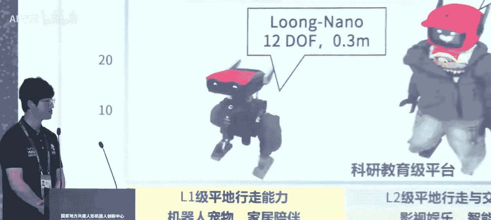

# 人形机器人：人形机器人与具身智能创新发展

在本节课中，我们将学习2025世界人工智能大会主论坛上关于人形机器人与具身智能发展的核心内容。课程将涵盖政策导向、技术布局、产业生态、国际合作以及前沿技术思考，旨在为初学者提供一个全面且清晰的行业概览。

## 概述

本次论坛聚焦于人形机器人与具身智能这一未来产业，探讨了其在技术突破、产业落地、政策支持、生态构建及国际合作等方面的现状与前景。与会嘉宾来自政府、学术界、产业界，共同描绘了该领域的发展蓝图。

---

## 政策引领与产业展望

上一节我们概述了课程内容，本节中我们来看看政策层面如何为人形机器人与具身智能产业锚定方向。

全国政协常委、中国电子学会理事长徐晓兰在致辞中指出，机器人是“制造业皇冠顶端的明珠”。她强调，今年是相关未来产业扬帆起航的关键之年，政府工作报告已明确将培育**具身智能**等未来产业列入日程。

人形机器人是**芯片、传感器、人工智能、机械材料**等诸多技术的集大成者，是具身智能的最佳载体。它有望成为继计算机、智能手机、新能源汽车之后的又一颠覆性产品。

中国电子学会将在以下四个方面持续发力：
*   **强化创新，完善生态**：加快突破**无框力矩电机、六维力传感器、行星滚珠丝杠**等核心技术，推动开源社区建设。
*   **加强对接，开发场景**：深化应用场景图谱研究，挖掘生产制造、仓储物流、教育医疗等领域的典型场景。
*   **完善标准，培养人才**：联合产学研各方落实标准体系，制定实施**具身智能产业人才培养计划**。
*   **深化交流，促进合作**：加强国际科技交流与产业合作，促进新技术、新产品、新场景的全球共创共享。

上海市人民政府副秘书长吴金城介绍了浦东新区作为产业集聚区的实践。浦东已出台产业高质量发展三年行动计划，并布局了**模力社区、张江机器人谷**等产业空间。政府通过设立专项基金、提供低成本创业空间和人才公寓等政策，全力支持产业发展。

工业和信息化部科技司副司长杜广达阐述了未来的发展思路：**智能驱动、场景带动、生态协同**。具体措施包括：
*   **加强技术供给**：围绕**智能决策与控制、核心零部件**等加大支持力度，加快突破**视觉语言动作大模型、高性能一体化关节**等关键技术。
*   **拓展多元场景**：打造高价值应用场景，推动人形机器人“进厂打工、服役上岗”。
*   **做优产业生态**：建设人形机器人开源社区，加快标准体系研究，深化全球合作。

---

## 产业协同与生态共建

在了解了宏观政策后，本节我们将关注产业内部如何通过协作构建发展基座。论坛期间进行了一系列重要的签约与发布。

以下是三项关键的产业协同举措：

1.  **数据采集合作倡议发布**
    中国人形机器人百人会联合国家地方共建具身智能机器人创新中心、人形机器人创新中心，共同发起数据采集合作倡议。目标是共建中国具身智能数据基座，核心包括：
    *   **数据标准互认**：共同推进数据采集规范、数据质量规范等行业标准。
    *   **数据与工具链共享**：开展超过10类实体训练场景的数据合作与开源共享。
    *   **训练场开放赋能**：依托已建训练场定制化采集数据，打造可直接调用的数据产品。

2.  **训练场合作生态签约**
    国家地方共建人形机器人创新中心携手江苏常熟、河南郑州打造分训练场，并联合中国联通、上海人工智能实验室、百度智能云、华为云等7家单位，共同构建人形机器人训练场合作生态。此举旨在利用地方产业优势（如常熟的纺织、高端制造，郑州的智能物流、新能源汽车），加速细分场景数据采集。

3.  **国地中心开放基金签约**
    国家地方共建人形机器人创新中心与浙江大学、复旦大学、上海交通大学等多所高校及科研院所签约，设立开放基金，旨在支持优秀青年学者的前沿探索，催生颠覆性创新成果。

---

## 技术布局与产品创新

产业协作奠定了基础，本节中我们来看看技术研发与产品化取得了哪些具体进展。国家地方共建人形机器人创新中心首席科学家姜磊分享了技术思考。

姜磊认为，中国人形机器人在“走跑跳”等运动能力上已取得世界领先，这是对控制水平与硬件平台的综合考验。当前发展的焦点正从“能走跑”转向“**能干活**”。

他将人形机器人的技术体系概括为 **大脑、小脑、肢体**。其中，“小脑”技术（负责运动控制与协调）是下一个竞争要点。**具身智能**是解决“能干活”痛点的关键，它需要同时赋能大脑（决策）、小脑（控制）和肢体（执行）。

姜磊指出，产业链正在从传统的“老四大件”（感知、控制、驱动、传动）向“新四大件”（高端芯片、动力电池、高性能材料、连接器与标准器）和“新四大组件”（感知头、灵巧手、机械臂、电子皮肤）演进。

随后，创新中心发布了“青龙”系列产品矩阵：

*   **青龙Pro**：面向全场景应用的高性能人形机器人。身高1.85米，38个自由度，具备模块化复用、多模态感知、快拆电池、云端协同算力、时空智能定位五大升级特点。
*   **青龙Light**：面向开源、教育和科研的轻量化平台。身高1.45米，成本目标在10万元以内，旨在推动“百校计划”和开源社区发展。
*   **青龙View**：轮式机器人平台，专为工业场景应用、城市环卫作业、大规模数据采集等打造。

创新中心还介绍了其**格物·致知**具身智能开发平台。该平台旨在为行业提供通用本体与通用具身智能系统的综合性赋能方案，包含：
*   **格物平台**：提供云端训练仿真能力。
*   **致知平台**：将技能通过低代码开发快速部署到异构平台。
*   **智能体平台**：结合多模态AI，满足具身本体工作流的开发需求。

该平台的核心是构建 **“一脑多形”** 的智能体开发范式，通过**机器人上下文协议（CP）** 打通云端智能体与机器人端侧实时数据及技能。

---

## 前沿技术思考与探索

从具体产品回到技术原理，本节我们将聆听学术界与产业界对前沿技术的深度思考。清华大学教授孙富春从“行为学习”的视角进行了分享。

孙富春指出，人形机器人是最具挑战的人工智能验证平台。他提出了**技能-子技能-基元**的知识表达层次。例如，“插孔”任务可分解为“抓取”、“对准”、“插入”三个技能，其中“抓取”又可细分为“接近”、“到点”、“提起”等基元。

他借鉴人类学习过程，提出机器人技能学习的三阶段模型：
1.  **认知阶段（模仿学习）**：通过教练示教或观察进行初步学习，成功率约20%-30%。
2.  **联想阶段（持续学习）**：将运动过程抽象为知识表达，通过反复练习和纠偏，成功率提升至50%-70%。
3.  **自主阶段（迁移学习）**：在大量多样化场景中训练，形成**长时程增强**效应，成功率可达90%-100%。

孙富春认为，**触觉增强的视觉语言模型（VLA）** 可能是实现行为操作的关键。未来的人形机器人设计应借鉴人体肌肉力量分布与神经增强机制。

百度集团副总裁袁佛玉从产业赋能角度提出，百度智能云的定位是 **“技术赋能”与“场景链接”**。
*   在技术赋能上，提供**AI算力平台（百舸）**、数据采集与标注服务，并优化适配了**RT、PaLM、GR00T**等主流具身模型。
*   在场景链接上，将百度成熟的AI行业解决方案与具身机器人平台结合，加速其在物流、制造等场景的落地验证。

心动纪元创始人陈建宇探讨了构建通用机器人的路径。他认为通用机器人等于 **通用大脑 + 通用本体**。
*   **通用大脑（AR42）**：其团队致力于研发端到端的具身大模型，并探索了融合**世界模型**和**强化学习**的训练范式，旨在利用互联网视频等无标注数据，大幅减少对真机数据的需求。
*   **通用本体**：采用模块化设计，以全尺寸人形机器人为基础，通过复用核心模组（如灵巧手、关节）衍生出不同形态的机器人，以平衡通用性与成本。

智诚AI创始人胡鲁辉强调了 **物理智能（世界模型）** 的重要性。他发布了公司的高性能通用人形机器人 **TR5**，其特点是**速度与力量**，并展示了其在不依赖力传感器的情况下完成插拔动作的物理智能能力。他们的目标是打造类似“苹果”级别的机器人产品与生态。

---

## 圆桌讨论：国际化应用展望

技术发展离不开全球视野，本节我们将通过圆桌讨论，了解业界对国际化合作的看法。世界数字科学院国际首席人工智能官杜兰主持了讨论。

与会嘉宾围绕战略、技术、标准分享了观点：

*   **晴朗智能李通**：商业化落地是关键。机器人必须解决客户的实际问题，并有合理的投资回报率。他建议从**岗位化**的刚性需求切入。在国际化中，积极参与并主导国际标准（如UL标准）的制定至关重要。
*   **智诚AI徐明强**：技术发展需双线并行。一是确保机器人在任何表面（**Surface**）都能稳定运动；二是利用**世界模型**让机器人在空间（**Space**）中理解并预测物理变化。他提倡 **“权责公开”** ，即公开验证过程与安全日志，而非单纯开源模型权重。
*   **诺视机器人徐杨**：作为灵巧手核心零部件（行星滚珠丝杠）供应商，她指出硬件精度与一致性是算法训练的基础。她强调 **“泛化”** 能力是机器人真正走进千家万户的核心，即一台机器人能完成多种任务。
*   **东盟智慧产业联盟陈志辉**：在东南亚市场落地，需要 **“本土化”** 合作模式，与当地企业共同开发适用场景，并高度重视**数据安全与独立性**。建立互信的合作伙伴关系是关键。

嘉宾们用关键词描绘了对未来的期待：**透明**（可验证）、**泛化**（多任务）、**信任**（合作）、**真干活**（商业化）。

---

## 总结

本节课中我们一起学习了2025世界人工智能大会上关于人形机器人与具身智能发展的全方位内容。

我们了解到：
1.  **政策层面**：国家与地方战略已清晰布局，从技术创新、场景拓展、标准制定、生态培育等多方面提供支持。
2.  **产业层面**：通过数据共享、训练场共建、基金支持等方式，产学研各界正在构建协同创新的生态体系。
3.  **技术层面**：发展重点从运动能力转向作业能力，“大脑-小脑-肢体”技术体系与“具身智能”是核心方向。模块化机器人平台与一体化开发工具正在降低研发门槛。
4.  **前沿探索**：行为学习、世界模型、通用大脑与本体、物理智能等成为技术突破的关键路径。
5.  **国际合作**：商业化落地、技术标准互认、数据安全、本土化合作是推动全球产业共同发展的主要议题。

人形机器人与具身智能的创新发展是一场跨学科、跨产业、跨国界的长期征程，需要政策、技术、资本、场景的深度融合与持续迭代。