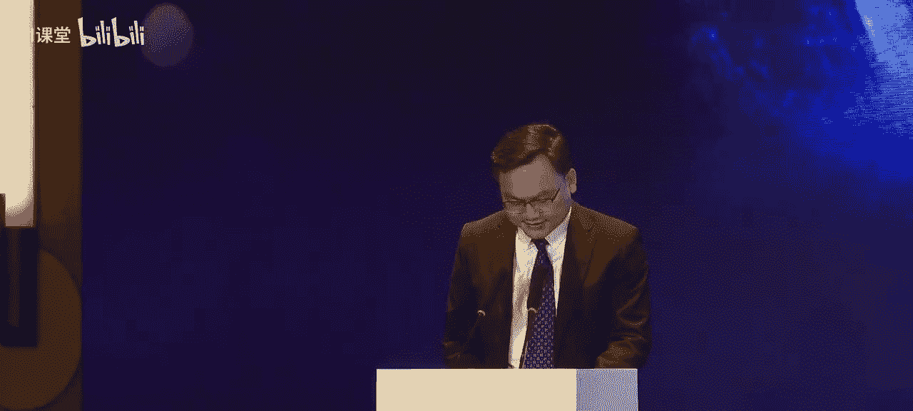

# 自动驾驶技术：AI赋能自动驾驶创新发展

## 概述
在本节课中，我们将学习人工智能如何赋能自动驾驶产业，实现跨越式发展。课程内容基于2025世界人工智能大会主论坛的讨论，涵盖了从政策支持、技术演进到产业生态构建的全过程。我们将了解上海在构建高级别自动驾驶引领区方面的规划与实践，并探讨端到端模型、世界模型等核心技术的现状与未来。

---

## 政策与产业背景

上一节我们概述了课程内容，本节中我们来看看推动自动驾驶发展的宏观政策与产业背景。

智能汽车正经历一场由系统驱动迈向模型驱动、智能进化的过程，以技术创新重新定义全球产业新坐标。上海以十万核级计算中心、七千亿产业规模，为自动驾驶铺设了感知、决策、控制的全栈创新沃土。

本次论坛由世界人工智能大会组委会指导，上海市经济和信息化委员会、上海市交通委员会等多个部门大力支持，并联合多家行业领军企业共同主办。论坛聚焦模型驱动、数据赋能、生态重构三大篇章，全面展示上海在高阶自动驾驶产业生态构建与制度体系建设等方面取得的最新成果。

上海市经济和信息化委员会副主任汤文侃在致辞中指出，上海在推动智能网联新能源汽车产业方面取得了积极进展。

以下是具体的进展成果：
*   **产业规模稳中提质**：去年全市汽车产业规模突破了7000亿元，新能源汽车累计推广量达到164.5万辆，稳居全球城市第一名。
*   **创新动能激活城市**：已形成从上游零部件、中游整车研发制造到下游检测认证服务的完整产业链，集聚了9家整车企业及600余家全球著名零部件企业，汽车领域复合型高端人才已接近15万人。
*   **自动驾驶模型加速迭代**：以单车智能为基础，车路云协同为关键支撑，打造自动驾驶数字孪生训练场。目前已有100辆数据采集车规模化上路运行，累计采集数据量已突破200万个片段。

当前，人工智能正在经历前所未有的飞速发展期。汽车行业作为技术革新的前沿，正在迈向软件定义、智能决策的新时代。下一阶段，上海将紧抓人工智能发展机遇，加快构建全球领先的自动驾驶引领示范区。

以下是上海下一阶段的重点规划方向：
*   **强化政策支撑**：聚焦应用创新、基础设施提升、产业发展和政策突破，编制出台上海高级别自动驾驶引领区行动计划，并修订智能网联汽车测试应用管理办法。
*   **打造应用场景**：在论坛上发布了上海首批无驾驶人智能网联汽车示范运营牌照，共有5个联合体、8家企业的23辆车率先获得。将分步骤推进更多场景的开放工作。
*   **提升自动驾驶水平**：推动软硬协同的高级智驾、智舱及自控芯片的自主开发，建设大规模、多模态、高质量语料库。计划到年底实现500辆数据采集网约车落地运行，数据采集规模达到1000万个片段，并建立自动驾驶大模型评测体系，实现端到端自驾大模型量产上车。

---

## 核心行动计划发布

在了解了宏观背景后，本节我们将深入解读上海为引领自动驾驶发展而制定的具体行动方案。

上海市经济和信息化委员会二级巡视员韩大东先生介绍了《上海市高级别自动驾驶引领区发展行动方案》的主要内容和重点任务。该方案旨在抢抓人工智能发展机遇，破除行业痛点，按照 **“模型驱动引领、应用示范带动、产业协同发展、政策举措支撑”** 的总体思路，推动自动驾驶技术创新向产业竞争力加速转化。

方案的总体目标是：到2027年，上海高级别自动驾驶应用场景实现规模化落地，关键技术和产业规模达到国际领先水平，基本建成全球领先的高级别自动驾驶引领区。

方案计划在以下三大领域重点发力：
*   **应用场景规模化**：探索创新商业运营模式，在智能公交、出租、重卡等场景规模化实行L4级自动驾驶技术，实现载客超600万人次，载货超80万车次。
*   **创新要素体系化**：建成自动驾驶数字孪生训练场等公共服务平台，全市自动驾驶开放面积达2000平方公里，道路长度超5000公里，实现交通枢纽、产业园区及文旅景区的跨域联通。
*   **产业能级高端化**：培育行业领先的自动驾驶大模型，L2级和L3级汽车量产车占新车生产比例90%以上，L4级自动驾驶汽车实现量产，并建立涵盖整车、零部件、数据、地图、安全服务的完整产业链。

方案聚焦应用场景、创新要素构建、产业生态培育三个方面，推进九项重点工作。

以下是具体的重点工作内容：
1.  **推进多样化应用场景**：稳步扩大乘用车应用规模，有序开展L4无人商业化运营；深化商用车示范场景建设；有序推动无人驾驶装备（如配送、巡检车）的应用落地。
2.  **加快构建高能级创新要素**：搭建自动驾驶数字孪生训练场；完善自动驾驶数据监测平台；有序扩大自动驾驶开放区域，实现浦东新区全域开放，并推动区域间联通。
3.  **加速培育创新型产业生态**：组织关键技术攻关，培育优质企业；打造世界级汽车产业集群；加强验证测试能力建设，搭建第三方测试服务平台。

为保障方案实施，上海将加大政策支持、强化金融支撑、深化人才教育引进，并加强区域协同，推进长三角互联互通。

---

## 技术演进路线与实践

上一节我们介绍了官方的行动蓝图，本节中我们来看看企业层面是如何进行技术布局和实践的。

智己汽车副首席技术官郭辉分享了面向量产的L2/L3/L4一体化智能驾驶技术路线。他认为，智能驾驶技术的发展经历了从规则驱动到数据驱动的转变，而 **端到端（End-to-End）** 的全数据驱动方式已成为行业共识。

**端到端模型** 的简化公式可表示为：`驾驶动作 = 模型(传感器输入)`，它直接根据摄像头等原始输入预测方向盘、油门等控制信号。

然而，基于模仿学习的端到端技术仍需解决分布偏移、模态坍塌和因果混淆等问题。行业正在探索从模仿学习向强化学习（Reinforcement Learning）演进。

**强化学习** 的核心是智能体（Agent）通过与环境（Environment）交互，根据奖励（Reward）来学习最优策略（Policy）。在自动驾驶中，世界模型（World Model）可以充当虚拟环境，让端到端模型在其中进行海量试错和进化，从而突破人类驾驶行为的数据上限。

同时，引入视觉-语言-动作模型（VLA）等 **多模态大模型**，可以增强系统在复杂场景下的因果推理能力，解决因果混淆问题。

上汽集团和智己汽车的技术演进分为三个阶段：
1.  **当前阶段**：基于端到端模型，增加多模态大模型，并利用世界模型进行仿真验证。
2.  **下一阶段**：融合多模态大模型与端到端模型，并利用世界模型作为强化学习的环境进行闭环训练。
3.  **未来阶段**：进一步融合世界模型，迈向智能驾驶通用人工智能。

在系统层面，智己采用可扩展的传感器方案和冗余安全系统，打造L2/L3/L4一体化的技术底座，以实现高阶智能驾驶的规模化落地。

吉利控股集团首席智驾科学家陈琦指出，汽车智能化已进入2.0阶段，即各领域横向紧密融合，共同推进汽车向AI智慧生命体蜕变。智能驾驶技术作为一种AI根技术，在赋能自身迈向L3/L4的同时，也在赋能整车其他领域。

例如，通过智驾域与座舱域、底盘域的跨域融合，可以实现 **无感人机共驾**（如语音控车、手势控车）和 **具备自主意识的主动安全与服务**（如车辆自主充电、遇水灾主动驶离）。

博世智能驾控中国区总裁吴永桥则从供应链角度提出了对产业发展的思考。他强调，高阶智驾必须走向收费模式，形成健康的价值创造闭环。在技术路线上，他认为短期内 **一段式端到端** 是实现高度拟人化驾驶体验的关键，而VLA模型的落地还需等待支持大模型部署的专用芯片成熟。

吴永桥还预测，未来自动驾驶将成为像安全带一样的基础标配，而能给用户带来情绪价值的 **智能座舱** 将成为主机厂差异化的竞争焦点，并最终演变为统治整车的“中央大脑”。

---

## 数据、模型与安全基石

在探讨了主机厂和供应商的技术路线后，本节我们聚焦于驱动技术发展的核心要素：数据、模型与安全。

商汤科技联合创始人王小刚深入阐述了世界模型对自动驾驶研发范式的革新。端到端自动驾驶面临海量数据需求和对长尾场景覆盖不足的瓶颈。引入世界模型和强化学习，可以大幅减少对Corner Case（极端案例）数据的依赖，并实现更确定性的安全边界。

**世界模型** 能够学习物理世界和交通规则，生成精准可控的仿真场景。它主要从三个方面推动自动驾驶：
1.  **突破数据瓶颈**：一键生成覆盖各种复杂场景的高保真数据。
2.  **确定安全边界**：在虚拟世界中穷举和测试各种驾驶策略，找到最优解。
3.  **实现自主进化**：通过强化学习，让驾驶模型在虚拟环境中自我迭代，打破人类驾驶行为上限。

华为智能汽车解决方案BU的贾飞强调了构建安全产品与技术体系的重要性。他预测，未来五年L3/L4级自动驾驶将迎来飞跃性发展。华为通过云端 **“世界引擎”** 和车端 **原生智驾模型**，构建了一套完整的安全体系。

华为提出了 **五维安全目标**：全时速、全方向、全目标、全天候、全场景的安全能力。例如，通过固态激光雷达实现负障碍和悬空障碍物检测，通过分布式毫米波雷达提升雨雾天气的穿透探测能力。华为ADS系统已累计行驶35.4亿公里，泊车超过2.3亿次，证明了其系统的可靠性和用户接受度。

同济大学涂辉招教授则从交通系统的角度，探讨了 **交通语料** 对自动驾驶决策的重要性。高质量的交通语料（如交通法规、学术论文、案例库）是驱动自动驾驶理解环境、进行合规交互和加速算法迭代的“燃料”。

涂教授团队提出了数据来源、行业应用、知识体系的三维语料体系。通过将交通规则知识以“模糊系统”等形式嵌入强化学习框架，可以显著提升网联自动驾驶车辆在复杂场景（如高速合流区）下的决策效率和系统稳定性，使其更快地适应环境并避免行为震荡。

---

## 圆桌讨论：技术博弈与生态共建

在了解了各项关键技术后，本节我们通过圆桌讨论的形式，聆听业界专家对技术路线博弈与产业生态共建的深度思考。

圆桌论坛由多位来自学术界、企业界和技术服务机构的嘉宾参与，围绕渐进式（L2++）与跨越式（L4）路线的博弈，以及如何通过生态共建实现商业闭环展开讨论。

**关于规则与AI的博弈**，上海交通大学殷承良教授指出，基于规则的系统和AI大模型将长期并存。规则系统具有可解释、因果明确的优点，是当前必要的安全兜底。而AI模型（VLA、世界模型）负责泛化与提升上限，未来将逐步向通用世界模型演进。复旦大学张丽教授补充道，世界模型通过自监督学习逼近真实数据分布，其“幻觉”问题可通过3D重建、生成与规划统一学习等技术手段提升一致性与可控性。

**关于L4级自动驾驶的商业化前景**，上汽旗下有道智途的尹晓川认为，在港口、矿山等封闭或结构化场景的商用车L4运营，目前商业模式最为清晰。百度自动驾驶吴琼则指出，商业化不仅在于场景选择，更依赖于有效的 **制度供给**。当前主要矛盾已从技术创新转向制度匹配，需要法规、责任界定、保险等配套体系的创新，以论证和推动产业转化。

**关于无人装备与生态诉求**，踏歌智行郝冰冰表示，低速无人驾驶（配送、环卫）在技术上已较为成熟，爆发增长的最大瓶颈在于 **路权开放** 和 **法规标准** 的完善，呼吁建立类似乘用车的车规级准入体系。中国移动华莹分享了通信运营商在生态中的角色：通过打造高可靠网络、车用算力底座以及路侧感知算法，为行业提供共性的连接、算力与车路协同服务，助力解决数据合规、仿真训练等共性难题。

**关于科技企业与整车厂的关系**，嘉宾们普遍认为应是 **“强强联合、开放共赢”** 的生态。全栈自研有助于深度整合与快速迭代，而开放赋能则能最大化技术价值，避免重复投入。未来，自动驾驶系统与车辆平台将呈现更灵活的融合匹配模式。

最后，嘉宾们用一句话总结了对产业未来的展望：
*   **华莹（中国移动）**：技术路径没有最优解，需要行业生态共赢，制度需与技术迭代齐头并进。
*   **郝冰冰（踏歌智行）**：技术已为低速场景做好准备，期待法规完善推动规模应用。
*   **殷承良（上海交大）**：技术路径随需求演进，“懒人”推动社会进步，舒适出行的时代终将到来。
*   **吴琼（百度）**：百花齐放才是春，期待制度供给跟上技术与产业发展步伐。
*   **张丽（复旦大学）**：任何未经过学习而人工设计的组件终将成为系统瓶颈，VLA和世界模型将开启高阶智驾新篇章。
*   **尹晓川（有道智途）**：算法提升上限，安全与冗余守护底线，这对L4至关重要。

---

## 总结
在本节课中，我们一起学习了AI赋能自动驾驶创新发展的全景图。我们从上海的产业政策与行动计划入手，了解了政府构建引领示范区的决心与路径。随后，我们深入探讨了端到端模型、世界模型、多模态大模型等核心技术的演进方向，以及主机厂、供应链企业的不同实践。我们还认识到数据、语料和安全体系是技术发展的基石。最后，通过圆桌讨论，我们看到了技术路线的多样性与生态共建的必要性。自动驾驶的未来，将是技术创新、政策法规、商业模式和产业生态协同共进的结果。