# 智能教育在中国：人工智能赋能教育新篇章

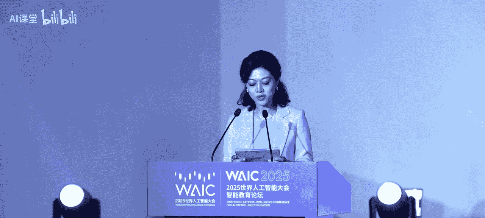

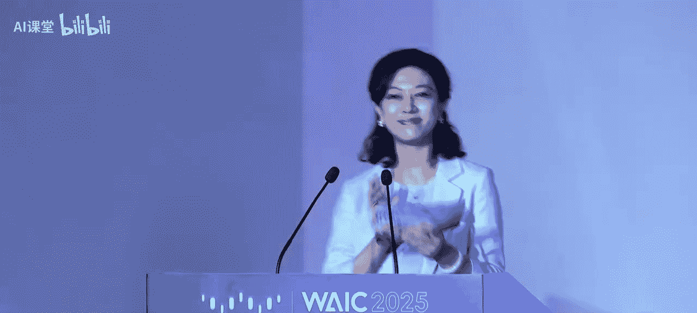

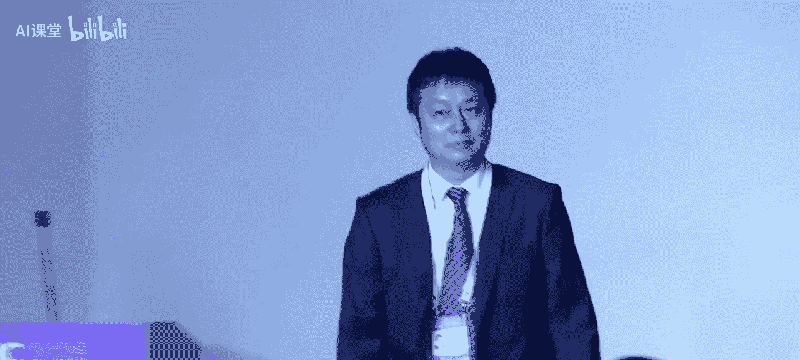

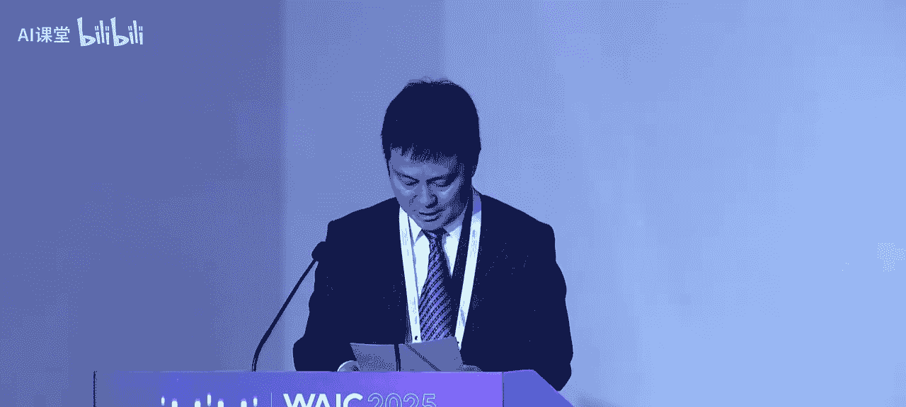

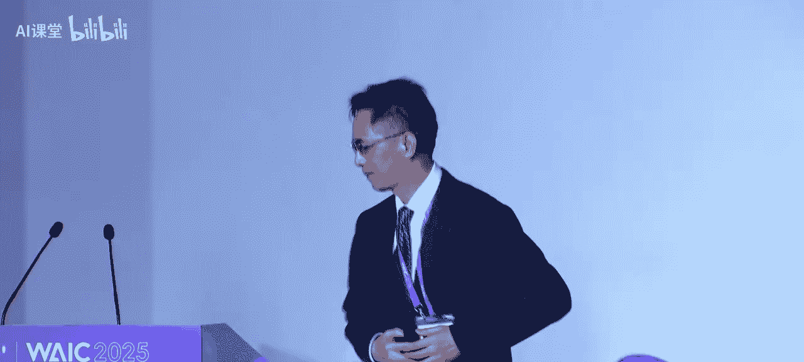

## 概述
在本节课中，我们将学习2025世界人工智能大会智能教育论坛的核心内容。我们将了解人工智能如何与教育深度融合，探讨教育大模型的研发与应用，并分析智能教育在中国的实践热点与未来趋势。课程将涵盖政策解读、技术发布、专家观点及实践案例，旨在为初学者提供一个全面、清晰的智能教育发展图景。

---

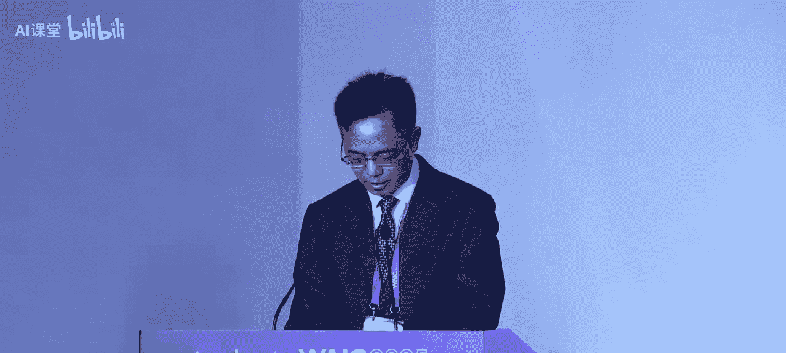

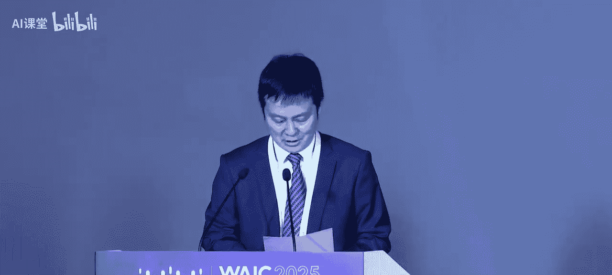

## 论坛开幕与嘉宾致辞

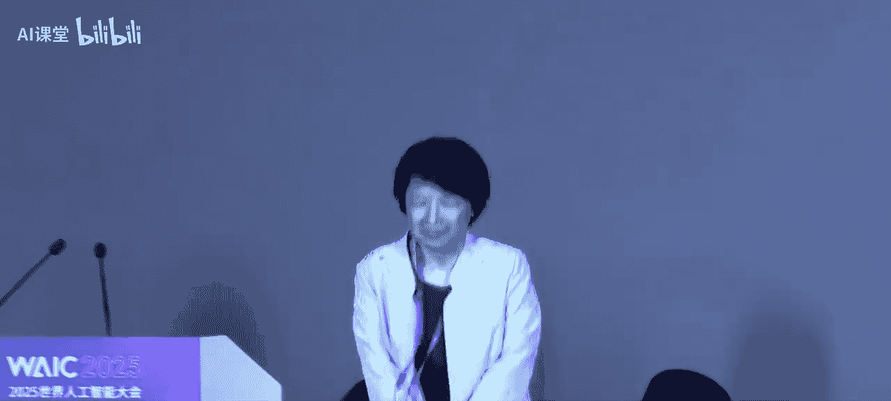

本次论坛由教育部科学技术与信息化司、上海市教育委员会指导，华东师范大学、上海创智学院联合主办，并得到了上海人工智能实验室、经济合作与发展组织教育技能司、剑桥大学未来学习中心等全球顶尖科研机构的大力支持。

论坛现场汇聚了超过1500名与会者，同时开放线上直播，共同关注智能教育的发展。

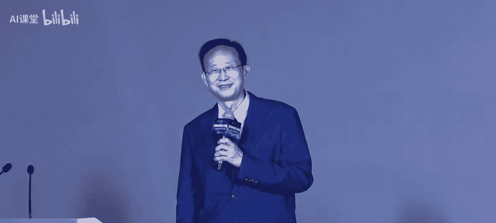

---

## 领导致辞：政策引领与发展蓝图

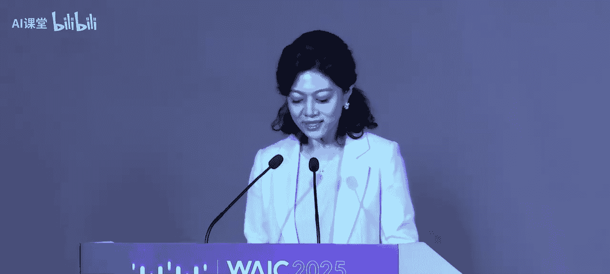

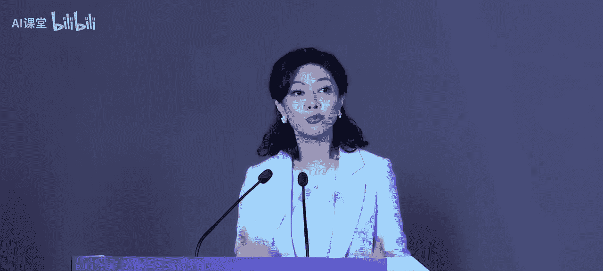

### 教育部科学技术与信息化司司长 周大旺先生致辞
周司长指出，人工智能技术日新月异，深刻改变了知识供给模式和科研创新范式，驱动了教育内容、模式与形态的深度变革。中国高度重视人工智能对教育的深刻影响，积极推动人工智能与教育的深度融合。

教育部已启动实施“人工智能赋能教育行动”，围绕“学AI、用AI、创AI、护AI”主题布局，强化人工智能人才培养、场景应用和规范治理。具体举措包括：
*   **聚合AI学习资源**：打造覆盖广度和深度的精品通识课程体系，目前共开发753门相关课程。
*   **推出AI智能教育工具**：国家智慧教育平台上线系列学科大模型和智慧工具，并配套建设师生人工智能应用能力测评系统。
*   **研发教育专用大模型**：以高密度知识聚合、高质量内容筛选、高阶信息萃取为标准，开展首批教育专用大模型的评定与应用检验。
*   **强调伦理安全保障**：探索建立教育大模型安全评估机制，维护师生切身利益。

未来，教育部将：
1.  **坚持以人为本**：夯实师生AI素养，构建覆盖大中小学和社会学习者的人工智能教育体系。
2.  **深化场景赋能**：探索构建未来课堂、未来学校、未来学习中心，促进AI与教育深度融合。
3.  **恪守智能向善**：构建AI教育伦理规范，加强技术伦理教育。
4.  **拓宽开放格局**：深化AI教育协同发展，共享优质资源，推进全球智能教育生态共建。

### 上海市人民政府副秘书长、市教委主任 钟亚明先生致辞
钟亚明副秘书长表示，上海正在统筹推进人才、科技、教育一体化发展，全力打造人工智能领域高端人才培养平台。具体工作包括：
*   **以人工智能赋能科研高质量发展**：支持高校发展人工智能相关学科，促进跨学科合作、校企合作。
*   **以人工智能赋能教育模式重塑**：承担国家关于人工智能未来领军人才培养实验区改革探索，推进校际课程共建共享。
*   **着力推进人工智能开放合作**：鼓励高校与人工智能企业联合开展技术攻关，实施校企联合培养。

上海将努力推进“人工智能+教育”向纵深发展，引导全市教育工作者持续探索实践。

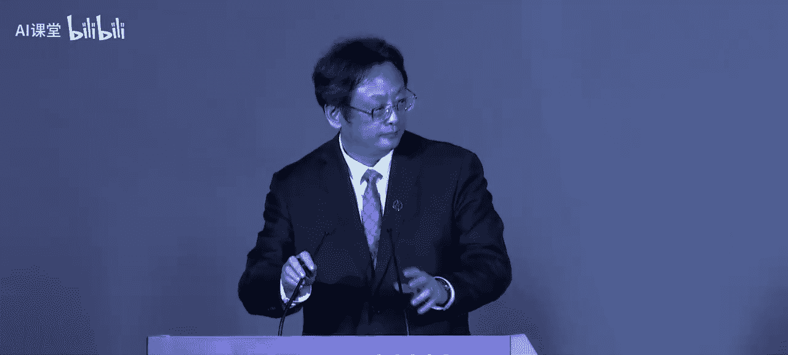

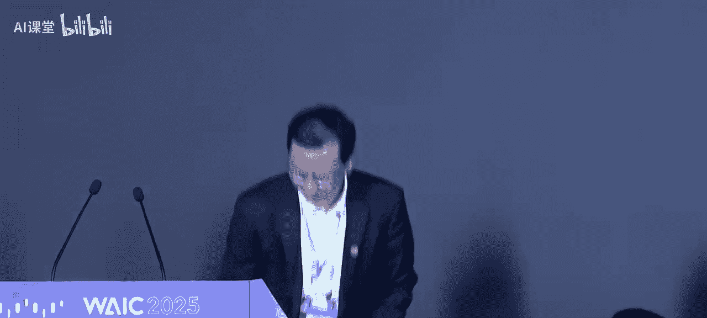

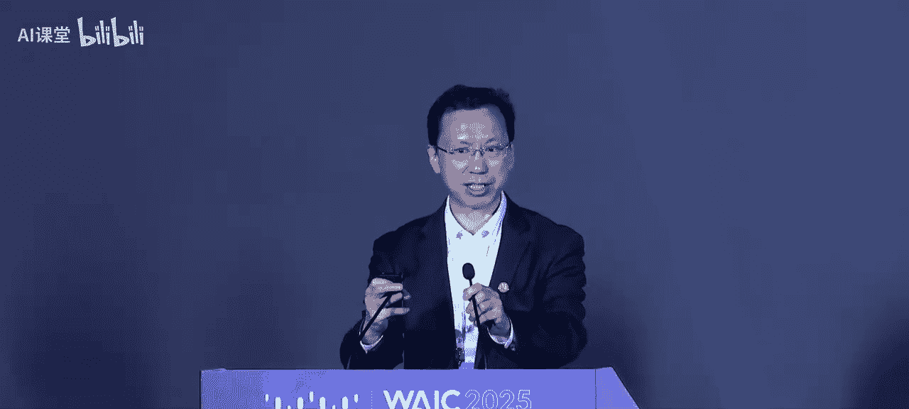

### 华东师范大学党委书记 梅冰女士致辞
梅冰书记指出，教育大模型不仅是技术工具，更是支撑未来教育生态重构的新基座。华东师范大学发挥在教育理论、认知科学、教育技术等领域的深厚积淀，与上海创智学院协同攻关，力求打造一个真正理解教育规律、适配中国教育场景的智能化支撑平台。

华东师范大学未来将：
1.  **深化基础研究与核心技术攻关**。
2.  **构建开放协同的创新生态**。
3.  **推动规模化应用与模式创新**。
4.  **强化人才培养与师资建设**。
5.  **促进国际交流与合作**。

---

## 成果发布：起创InnoSpark教育大模型

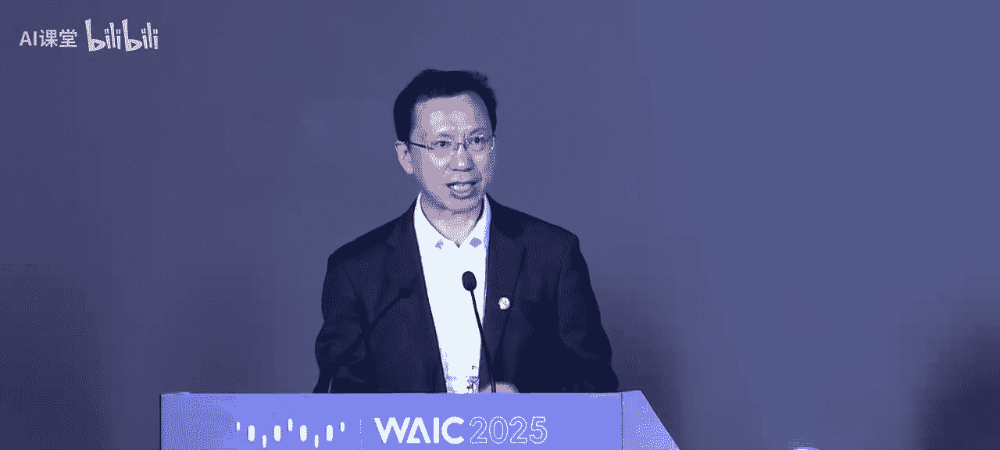

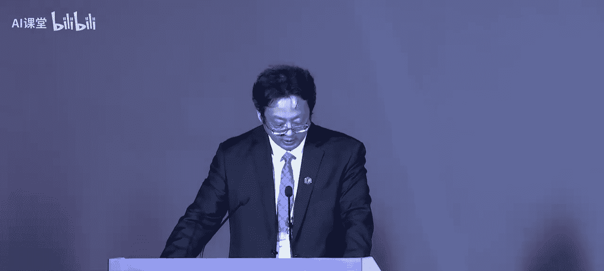

### 模型理念发布（袁振国教授）
华东师范大学终身教授袁振国发布了“起创InnoSpark”教育大模型。该模型致力于实现三个核心原则：
1.  **大规模背景下的个性化**：通过知识图谱构建和学生画像描绘，发现学生的“最近发展区”，实现因材施教。
    *   **公式/概念**：`最近发展区 = 潜在发展水平 - 现有发展水平`
2.  **常规下的创造性**：构建互联互通的知识新体系，打破传统分科界限，激发学生连接不同知识点的创造性。
3.  **立德树人的价值对齐**：打造体现人类基础文明、中华优秀文化传统和社会主义核心价值观的教育大模型。

模型计划于今年9月开源上线，12月发布多模态版本，并于明年12月研发情景智能版本。

### 技术能力呈现（周爱民教授）
华东师范大学上海智能教育研究院院长周爱民详细介绍了大模型的研发管线：
1.  **语料平台构建**：收集并清洗了约22TB的宝贵教育语料，合成4万条场景微调指令，并由超过1000名教育专家进行标注。
2.  **模型训练架构**：基于国产千问基座大模型，在全流程中融入教育语料、场景指令和专家打分知识，通过强化学习迭代优化。
3.  **体系化评测方案**：自主研发评测平台，围绕价值观引领、创造力激发和个性化培养三大目标，构建了系统的评测指标体系。

现场演示了模型在“知识点引导式讲解”和“跨学科教案生成”两个场景中的应用，展现了其作为教师智能伙伴和学生成长助手的潜力。

---

## 主旨演讲：专家视角下的教育变革

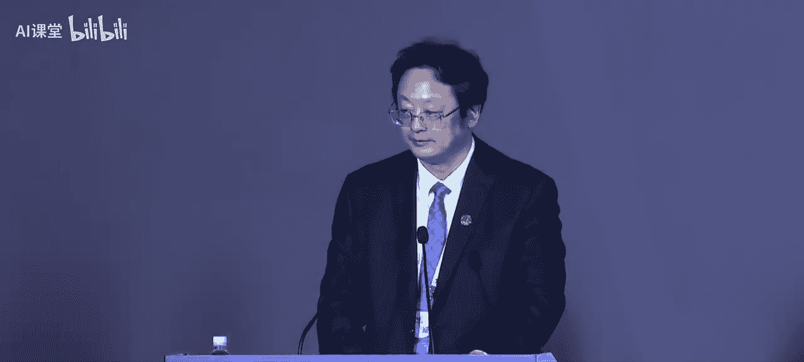

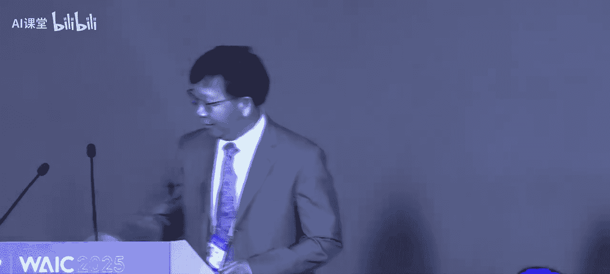

上一节我们见证了教育大模型的发布，本节中我们来看看顶尖学者如何从战略、技术和实践角度解读智能时代的教育变革。

### 同济大学党委书记 郑庆华院士：人工智能赋能未来教育创新
郑院士认为，人工智能正在打造“师-机-生”三元结构的未来教育新形态。大模型将成为智慧教育的新基础设施，改变知识的生产、传播方式及国际话语体系。未来教育将转向“针对性的教、个性化的学、多元化的评和智能化的管”。他提出构建“知识图谱、能力图谱、素质图谱”三谱融合的教育新体系。

### 北京邮电大学校长 徐坤教授：智能技术与教育变革
徐校长介绍了北京邮电大学打造“AI for Education, Management, Science”联动机制，构建“数字北邮”开源平台的实践。学校通过创新教育教学手段、拓展教育教学空间、提升教育教学素养、深化教育教学评价、打造教育教学新生态，积极探索无边界的大学和未来学习模式。

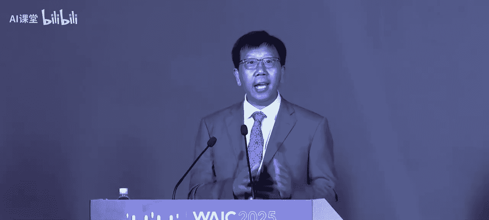

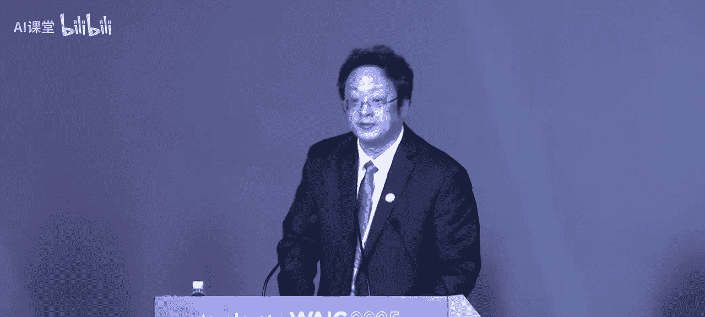

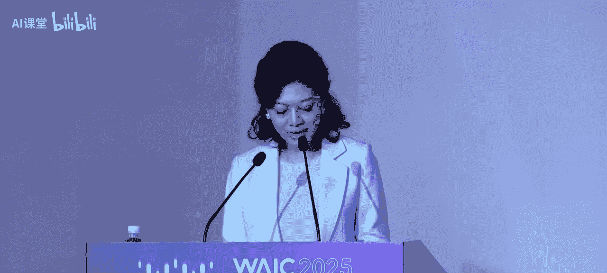

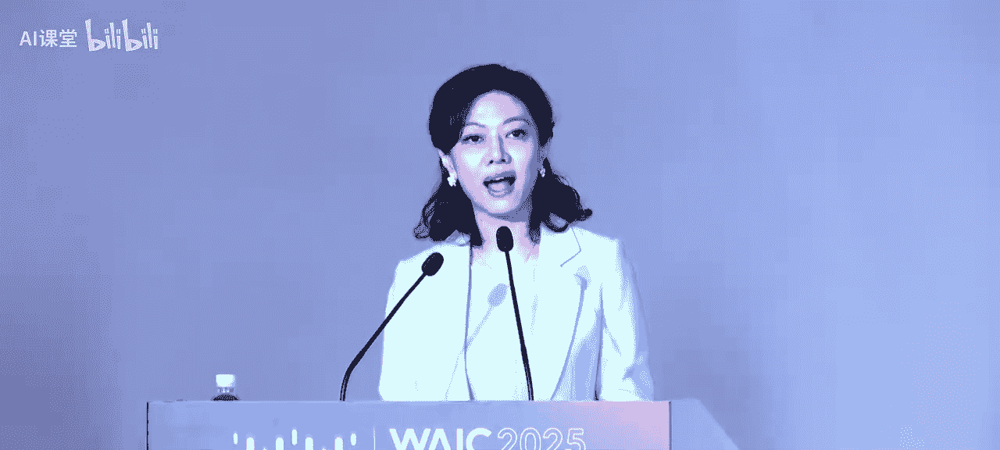

### 华东师范大学校长 钱旭红院士：大道模型与教育创新
钱校长提出了“大道模型”的理念，认为应融合东方整体思维与西方还原论思维，利用人工智能快速迭代的优势，发展有温度、服务于人的自由全面发展的AI模型。他分享了华东师大在AI心理伙伴、家庭教育模型、中医药教育大模型等方面的创新应用。

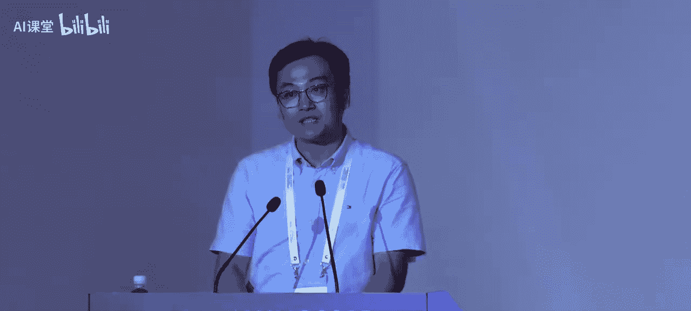

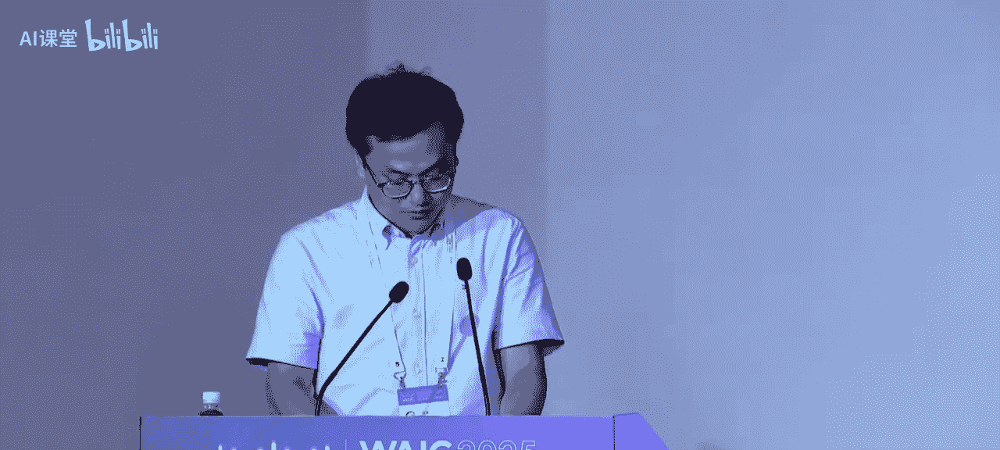

---

## 圆桌论坛：教育大模型与教学重构

在了解了宏观战略后，本节我们将聚焦于实践层面，探讨教育大模型如何真正落地课堂并重构教学。

以下是三位来自教育研究、技术研究和区域管理领域的嘉宾的核心观点：

*   **北京师范大学 黄荣怀教授**：指出人机协同教学将呈现数字人讲师、实体机器人、数字孪生等形态。当前挑战在于教师的行为习惯、技术技能差异以及大模型内容的安全可信性。学校应鼓励一线教师进行“一级变革”，再逐步推广至全校“二级变革”。
*   **上海交通大学 刘鹏飞教授**：强调当前大模型在交互性、多模态方面已有巨大进步，但长上下文和长期记忆仍是挑战。他认为，弥补教师对AI技术前沿能力的“认知差”比技术本身的“能力差”更为关键。未来教育应培养学生“会问问题”的能力和“第一性原理”思维。
*   **上海市虹口区教育局 孙磊局长**：分享了区域推进“教育智能体”矩阵建设的经验。通过“做中学、做中推”，让教师体验AI提升备课、教学效率的魅力，解决“最后一公里”问题。未来路径将从“效率革命”走向“流程再造”，最终实现“模式创新”。

---

## 案例分析与趋势发布

基于全国征集到的1080份优秀案例，华东师范大学智能实验室主任张志教授发布了“智能教育在中国”基础教育案例十大热点与未来趋势。

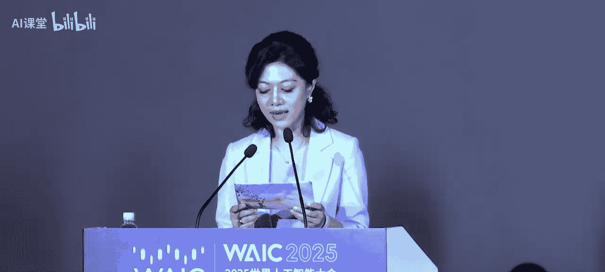

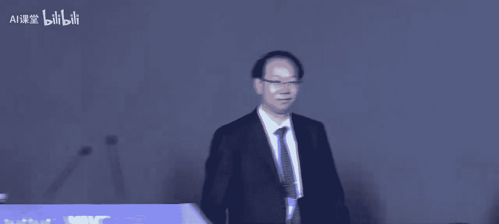

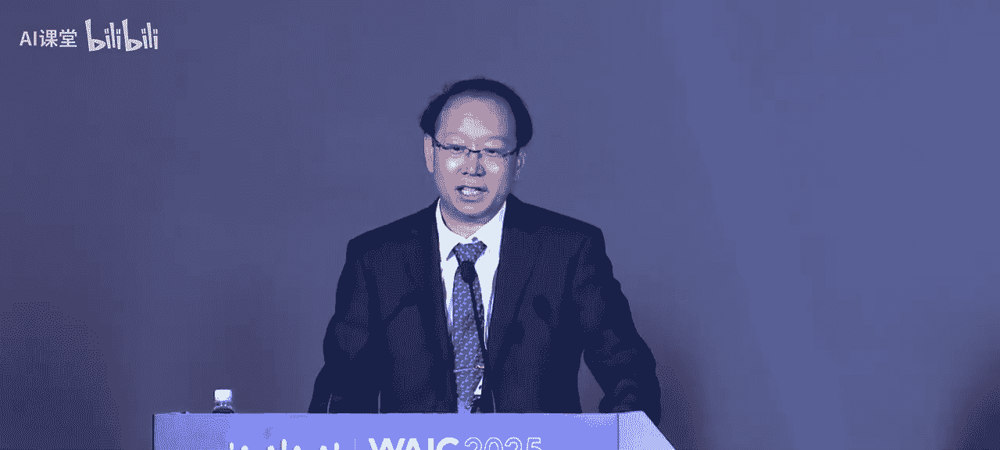

### 十大实践热点
1.  突破传统课堂范式的师生机互动教学。
2.  助力教师发展的智能备课和智慧教研。
3.  重塑育人生态的智慧校园建设和治理。
4.  AI赋能的心智人才培养与跨学科项目化学习。
5.  提升个性化学习效能的智能学练系统。
6.  促进学生具身认知的虚拟/沉浸式教学。
7.  赋能学校特色的智能评价系统研发和应用。
8.  落实中小学人工智能教育的技术与校本实践。
9.  护航学生身心健康发展的智能应用。
10. 支持循证教学的课堂智能分析。

### 六大未来趋势
1.  围绕智能向善的教育治理体系完善。
2.  情感计算与学习陪伴技术。
3.  教育大模型与教育智能体研发。
4.  智能教材的开发和应用。
5.  学习者模型与学习管理系统构建。
6.  支撑智能治理的教育大脑构建。

论坛现场为部分优秀案例代表及推动区域智能教育发展的优秀组织颁发了奖项。

---

## 生态建设与青少年培养

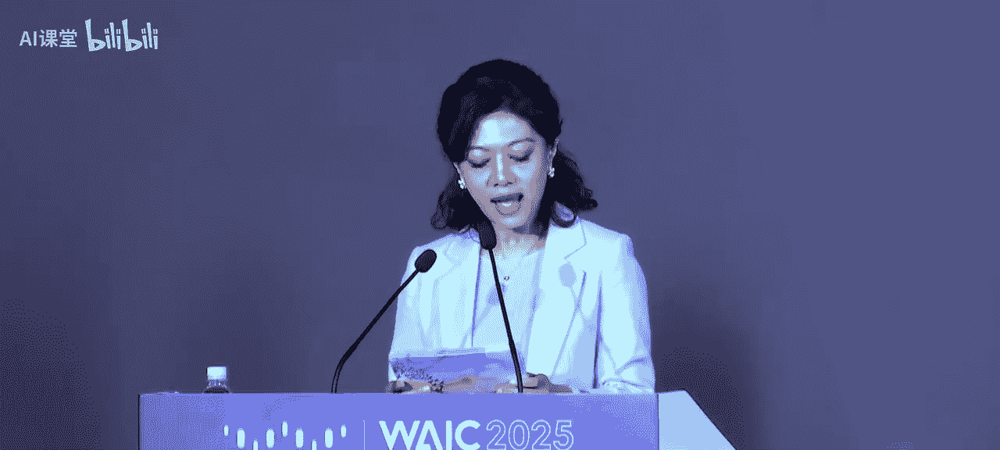

### 大中小一体化人工智能通识教材发布
为构建分层递进的人工智能素养培育体系，华东师范大学策划并发布了大中小一体化人工智能通识教材，旨在填补学段衔接空白，培养兼具创新能力和社会责任感的复合型人才。

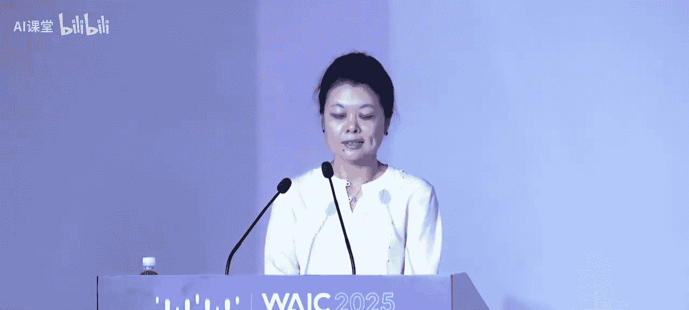

### 青少年AI教育实践分享
*   **上海市科技艺术教育中心 林君秋主任**：分享了通过“长三角青少年人工智能奥林匹克挑战赛”等平台，构建“真实问题驱动、多轨成长机制、资源组织枢纽”的校外科技教育体系，托举青少年在AI时代的创造力。
*   **腾讯青少年学堂 靳楠女士**：介绍了“腾讯青稞实训营”模式，依托腾讯的技术与资源，通过营地教育连接学校、家庭与企业实践，为青少年提供前沿的AI创新学习和深度培养。

---

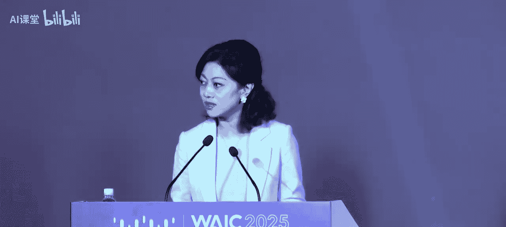

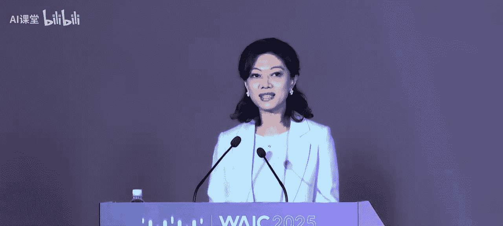

## 总结
本节课中，我们一起学习了2025世界人工智能大会智能教育论坛的核心内容。我们从国家政策与地方规划中看到了智能教育发展的顶层设计；从“起创InnoSpark”教育大模型的发布中了解了技术研发的理念与路径；从各位专家的演讲中洞见了教育变革的方向与挑战；从丰富的实践案例中感受到了智能教育在中国大地上的蓬勃生机。智能教育浪潮已至，它不仅是技术的革新，更是教育理念、模式和生态的重塑，需要政、产、学、研、用各方协同努力，共同迈向更加公平、优质、包容的未来教育图景。