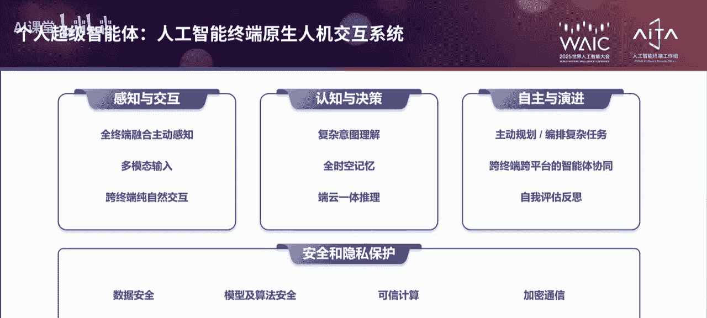
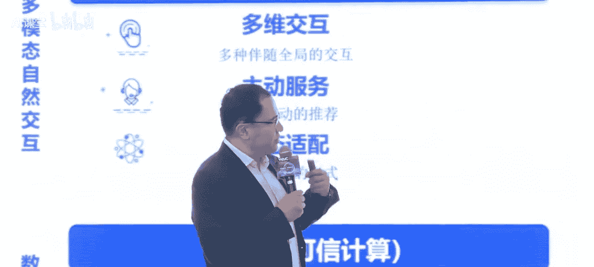
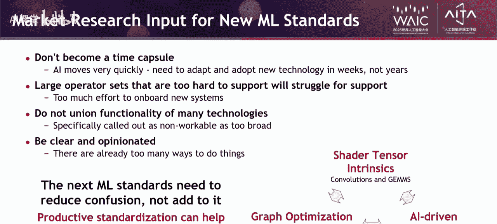

# 人工智能终端产业发展：论坛全记录与核心洞察

在本节课程中，我们将系统性地学习2025年世界人工智能大会“人工智能终端产业发展论坛”的核心内容。课程将涵盖产业趋势、技术应用、生态构建及未来展望，旨在为初学者提供一个清晰、全面的行业认知框架。

---

## 概述：人工智能终端的崛起与变革


2024年以来，人工智能终端产业进入快速发展阶段，成为AI技术工程化落地的重要载体。从AI手机、AIPC到智能眼镜、玩具等创新产品层出不穷，大模型与终端产品的加速融合，不仅启动了消费电子产业的新一轮变革周期，也成为了新的消费增长点。本次论坛汇聚了政府领导、产业专家及企业领袖，共同探讨了产业发展趋势与生态构建路径。

---

## 第一部分：领导致辞与产业宏观指引

### 1.1：王江平委员：人工智能终端产业的现状与方向

上一节我们概述了论坛背景，本节中我们来看看全国政协委员王江平对产业现状的总结与未来发展的指导。

王江平委员指出，当前我国人工智能终端产业呈现“三个加速”的发展态势：

*   **技术迭代加速**：特别是专用大模型的压缩技术、算力智能化升级、芯片高密度封装、端云协同技术以及全链条安全策略等技术的进步，为产业发展奠定了坚实基础。
*   **应用加速落地**：除了AI手机和AIPC，AI眼镜、玩具、电器、学习机等产品不断涌现，预计未来将深入制造业、医疗装备等领域。据统计，2024年上半年已有近20家品牌发布AI眼镜新品，618期间京东平台AI眼镜成交量同比增长高达7倍。
*   **标准加速构建**：为凝聚行业共识，工信部正联合相关部门指导研制人工智能终端分级系列国家标准，涵盖架构、总体要求、移动终端、PC、电视等领域，预计将在年内陆续发布。

基于此，他对产业健康发展提出了四点希望：

*   **促生态发展**：充分发挥人工智能终端工作组的桥梁作用，联合产业链上下游，建立常态化沟通机制，围绕关键技术与部件开展联合研究，打破跨企业、跨平台的技术与生态壁垒。
*   **强创新**：聚焦用户需求，推动高品质、差异化创新。不仅在经典终端发力，也要在工业终端、医疗终端等新兴领域创新。通过发布“高价值场景优秀案例”等赛马机制，形成技术领先、体验优良的产品系列。
*   **稳根基**：加快出台分级标准，通过标准体系牵引行业向规范化、规模化发展。
*   **重应用**：培育消费新认知和新习惯，探索跨行业合作，促进AI终端在智能制造、智慧教育、文旅等领域的示范应用。迫切需要寻找像移动支付那样的“杀手级应用”，以推动AI终端的快速普及和换机潮。

**核心公式/概念**：
*   **产业驱动力**：`产业增长 = 技术迭代 × 应用落地 × 标准构建`
*   **生态构建**：`健康生态 = 上下游协同 + 常态化沟通 - 技术生态壁垒`

---

### 1.2：汤文侃副主任：上海在人工智能终端产业的布局与机遇

上一节我们了解了国家层面的产业指引，本节中我们来看看上海市作为创新之都的具体实践与规划。

上海市经济和信息化委员会副主任汤文侃介绍了上海在智能终端产业链上的坚实基础与未来规划：

*   **产业基础雄厚**：
    *   **芯片**：产业链最完整、产业集中度最高，规模占全国近1/4。
    *   **显示**：车载显示产量全球前列，MicroLED实现全球最小尺寸和最高亮度。
    *   **通信**：5G/6G人才占全国近50%，低轨卫星加快部署，物联网通信模组出货量全球第一。
    *   **终端制造**：每分钟下线4辆汽车、40台计算机、44部智能手机、7.5万块集成电路。拥有全国前三大手机ODM企业，全球约70%的手机代工源于上海。
    *   **人工智能**：AI人才占全国近1/3，规上企业超400家，实现了从前沿研究到垂类应用的全产业链布局。

*   **未来工作重点**：
    *   **全链条加速技术融合**：提升端侧芯片AI处理能力，强化终端软硬件系统，支持超高清视听、下一代通信、汽车电子等重点领域创新。
    *   **全力打造上海品牌**：聚焦AIPC、AI手机、AI新终端、具身智能等领域，打造一批人工智能终端“上海名牌”，实现“换道超车”。
    *   **全方位优化营商环境**：发布新一轮智能终端行动方案，支持企业搭建公共技术服务平台，发挥产业、人才、资本优势，打造上海智能终端“朋友圈”。

**核心概念**：
*   **城市产业竞争力**：`竞争力 = Σ(基础产业实力) + 政策引导力 + 生态聚合力`
*   **品牌打造路径**：`本土品牌崛起 = 技术优势 + 场景创新 + 生态支持`

---

## 第二部分：场景革命：技术驱动下的终端创新

### 2.1：薛向阳教授：大模型驱动的工业智能体研究与实践



上一节我们探讨了宏观产业布局，本节中我们将视角深入工业领域，看大模型如何赋能传统行业。

复旦大学薛向阳教授分享了将大模型与智能体技术应用于传统建筑业（如中铁二十四局）的实践：

*   **工业智能体的构成**：包含智能感知层（接收数据）、决策层（大模型增强）、执行层（机器人等）以及协同层（群体系统）。
*   **具体应用场景**：
    *   **AR智能配料**：优化钢筋切割方案，节省2%-3%的原材料成本。
    *   **工程质量视觉检测**：通过图像识别自动检测钢筋捆扎等工艺是否到位。
    *   **图纸智能解析与三维建模**：利用大模型读取PDF图纸中的关键参数，并自动构建三维模型。
    *   **施工安全监管**：通过视频监控与数字孪生技术，实时反推挖掘机等设备的三维空间位置，确保与运行铁路的安全距离。
    *   **非标件智能焊接**：开发视觉引导的机器人焊接系统，替代人工完成核电、船厂中的非标准化焊接工作。

*   **挑战与展望**：当前大模型在工业领域仍缺乏“物理直觉”。未来需将物理常识融入模型，并完善技术体系。同时，应关注人机协作，利用AI创造新的工作岗位。



**核心代码/概念**：
```python
# 工业智能体决策流程简化示意
class IndustrialAgent:
    def __init__(self):
        self.perception = SensorModule()  # 感知模块
        self.decision = LLM_Reasoning_Module()  # 大模型决策模块
        self.execution = RobotArmModule()  # 执行模块

    def complete_task(self, task_input):
        data = self.perception.collect(task_input)
        plan = self.decision.analyze(data)  # 大模型进行任务规划与推理
        result = self.execution.execute(plan)
        return result
```

---

### 2.2：华为朱勇东：智慧办公，引领未来，共建鸿蒙新世界

上一节我们看到了AI在工业领域的渗透，本节我们回归消费终端，看操作系统如何成为AI落地的核心底座。

华为终端副总裁朱勇东分享了以鸿蒙电脑为载体，构建系统级AI能力的思考与实践：

*   **鸿蒙系统的演进**：从2012年研发，到2019年鸿蒙1.0诞生，再到2024年发布鸿蒙6.0开发者版本，实现了完全自主可控的内核与统一的生态。目前已有超1.3亿设备接入鸿蒙生态。
*   **鸿蒙电脑的AI特性**：
    *   **系统级AI原生**：内置端侧7B大模型与云侧大模型，提供分层分级的AI开放能力。
    *   **全新交互范式**：通过智慧键、语音（小艺）等方式实现直觉式交互。
    *   **核心场景能力**：
        1.  **小艺快记**：端侧离线自动完成会议录音、转写、纪要生成与分发。
        2.  **知识空间**：端侧快速搜索、关联、总结本地文档资料。
        3.  **随行操作**：通过语音指令直接控制系统设置与硬件功能。
    *   **云侧双引擎**：融合盘古与DeepSeek引擎，根据问题自动切换，并联合权威机构进行双重校验，缓解AI幻觉。
*   **开放与协同**：支持第三方模型与智能体接入，通过“鸿蒙智能体框架”实现多智能体协作。首批50多个应用智能体已上架手机，未来将整合到电脑。
*   **产业倡议**：提出终端智能化体验L1-L5分级标准，倡导以人为本，以用户体验定义AI能力。作为人工智能终端工作组组长单位，华为希望团结产业链，共同推动产业健康发展。

**核心公式**：
*   **系统级AI价值**：`用户体验 = (端侧算力 + 云侧算力) × 系统融合度`
*   **生态健康度**：`生态活力 = 原生应用数 × 第三方智能体数 × 跨设备协同能力`

---

### 2.3：联想阿木：开放创新，开启AI人机交互新世纪

上一节我们了解了华为的系统级AI路径，本节我们看看联想如何通过开放架构构建个人超级智能体。

联想集团副总裁阿木阐述了人工智能终端时代的人机交互范式变革：

*   **终端代际革命**：从**功能终端**（本地服务，单机计算）到**互联网终端**（在线服务，分布式计算），再到当前的**人工智能终端**（个人孪生服务，混合异构AI计算）。
*   **个人超级智能体**：作为原生的人机交互系统，需具备四大能力：
    1.  **感知与交互**：全终端主动感知，多模态自然交互。
    2.  **认知与决策**：理解复杂意图，调度端云记忆与推理。
    3.  **自主演进**：主动规划、调度垂直智能体，并自我评估进化。
    4.  **安全可信**：全程可信推理计算，保护隐私。
*   **联想“一体多端”战略**：
    *   **“一体”**：即“天禧个人超级智能体”，坚持**跨平台、跨终端、端云一体、开放互联**四大开放架构。
    *   **“多端”**：将天禧智能体嵌入具备异构AI算力的各类设备（PC、手机、平板等），实现设备升级并打造新物种。
*   **实践与心得**：
    *   **坚持原生技术创新**：如在多模态交互、端侧推理加速（X推理引擎）、数据安全（端云全程可信计算）、个人知识库等领域投入。
    *   **坚定开放协作路线**：与超2000个智能体开发者、主流模型/云平台、算力及操作系统公司合作。
*   **行业倡议**：
    *   **开放协作**：智能体生态开放共建、算力与系统开放兼容、跨品牌终端开放互联。
    *   **创新发展**：聚焦场景体验、产品原生、基础技术长线联合投资。

**核心概念**：
*   **交互范式演进**：`GUI -> VUI -> LUI (Language User Interface)`
*   **开放架构价值**：`生态广度 = 跨平台兼容性 × 开发者参与度`

---

### 2.4：OPPO 万宇龙：大模型时代智能终端的AI进化论

上一节我们探讨了PC等设备的AI进化，本节我们聚焦于最普及的终端——智能手机的AI进化路径。

OPPO助理副总裁万宇龙分享了OPPO对于AI手机的战略思考与技术实践：

*   **战略定位**：成为AI手机时代的贡献者与普及者，从服务、交互、产品三个层面重构用户体验。
*   **AI手机的核心能力**：重构用户三层架构：
    1.  **认知外延**：成为用户的“第二大脑”，辅助决策。
    2.  **创造力增强**：辅助高质量写作、图像视频创作、音视频文档摘要。
    3.  **情感化链接**：推动交互从GUI向VUI、LUI转变，实现拟人化、个性化表达。
*   **核心应用场景**：影像体验（AI消除、去反光）、高效办公学习（通话摘要、日程管理）、生活娱乐（旅行规划、AI代接电话）、系统智慧流畅。
*   **系统级AI理念**：将AI能力深度集成于操作系统底层，成为系统的“神经中枢”，实现跨应用、跨场景的智慧服务。例如“一键问屏”、“一键闪记”功能。
*   **技术架构支撑**：
    *   **端到云技术栈**：包含基础设施、训练框架、端云协同智能体平台、大模型定制等。
    *   **芯端云三维一体**：与芯片厂商深度合作优化，构建端侧高效推理引擎与云端AI服务平台。
    *   **端侧大模型优化**：通过动态量化、内存压缩、并行解码加速等技术，将端侧大模型推理性能提升8倍，支持188K超长上下文。
    *   **深度执行框架**：自研`MarAgent`框架，包含任务规划、深度思考（Chain-of-Thought）、智能体路由等模块，实现复杂意图的理解与执行。

**核心公式**：
*   **AI手机价值**：`用户价值 = 信息获取效率 × 创作提升度 × 情感连接强度`
*   **端侧性能突破**：`端侧模型能力 ∝ (芯片算力 × 算法优化效率)`

---

### 2.5：阿里巴巴 宋刚：自研驱动生态共创，AI眼镜重塑穿戴智能新范式

上一节我们讨论了手机AI，本节我们将目光投向更具未来感的穿戴设备——AI眼镜。

阿里巴巴智能信息事业群宋刚阐述了AI眼镜的战略价值与阿里巴巴的实践：

*   **AI眼镜的战略价值**：处于人体头部生态位，能捕获80%以上感知输入；具有极强的场景穿透力（办公、生活、移动）；是下一代人机交互的感官中枢，有望成为智能手机之后最重要的个人移动入口。
*   **行业痛点与破局**：当前产品存在不够智能、续航短、不舒适美观等问题。阿里巴巴通过整合内部资源（哇哦硬件、夸克大模型与AI能力、夸克个人数据处理）与外部生态，打造实用好用的AI眼镜。
*   **“哇哦眼镜”的创新**：
    *   **美观舒适**：通过小型化器件、超窄一体化设计、仿生曲面、钛合金镜腿等技术，实现轻量化与佩戴稳定。
    *   **超长续航**：采用高通双芯设计（主芯片+协处理器）与安卓+RTOS双系统动态调度，并创新性地推出热插拔换电镜腿与换电仓，实现24小时续航。
    *   **卓越拍摄**：自研Super暗光处理算法，提升暗光画质；通过陀螺仪防抖与云端AI超分插帧算法，输出4K 60帧稳定高清视频。
    *   **智能显示**：基于人因研究确定最佳视场角；采用双光机设计支持合像距可调；定制银辉美学UI与专用字体。
    *   **超级助理**：由夸克AI赋能，实现“听得清”（5麦+骨导阵列）、“听得懂”（自研Master Agent大模型中控）、“答得好”（大语言模型+拟人音色）。在图像问答、导航（联合高德）、支付（联合支付宝）、购物（联合淘宝）等场景深度集成。
*   **生态共建**：联合全球领先眼镜品牌，通过技术、渠道、服务、C2M定制整合，重塑产业价值链。

**核心概念**：
*   **穿戴设备成功要素**：`产品力 = 工业设计 × 续航能力 × 核心场景智能度`
*   **生态破局关键**：`生态突破 = 头部应用场景接入 × 传统行业价值链整合`

---



## 第三部分：生态共建：技术、标准与安全的协同

### 3.1：英伟达 Neil Trevett：开放标准在加速AI部署中的角色

上一节我们关注了具体产品和应用，本节我们将视角提升至产业底层，看开放标准如何促进全球协作与AI部署。

Khronos Group主席（英伟达代表）Neil Trevett 分享了开放标准组织在促进AI终端产业协同中的作用：

*   **行业挑战**：AI产品上市周期过长，需要过多专家工程；将模型充分加速到硬件理论性能的80%-95%面临困难；硬件多样性增加，给机器学习开发者带来更多适配工作；编译器/框架往往落后最新模型6-12个月。
*   **标准的作用**：在技术经过验证、厂商间能达成共识时，标准可以帮助简化堆栈，减少支持负担，加速机器学习部署。Khronos Group专注于底层硬件加速API标准（如Vulkan、OpenCL、SPIR-V）。
*   **当前探索**：研究如何通过标准化硬件能力描述、架构解释，以及利用AI本身进行性能优化（如神经架构搜索）。标准需要保持灵活、可扩展，并致力于简化而非增加复杂性。
*   **邀请参与**：Khronos已成立中国计算顾问小组，欢迎中国产业界参与，共同解决底层优化问题，推动机器学习产业更健康、快速发展。

**核心概念**：
*   **标准化价值**：`产业效率 = 1 / (技术碎片化程度 × 适配成本)`
*   **开放协作**：`全球技术进步速度 ∝ 知识共享与标准统一程度`

---

### 3.2：中兴 倪飞：从GUI到LUI，AI多维自然交互新范式

上一节我们讨论了底层标准，本节我们回到交互层面，看AI如何引发从图形界面到语言界面的范式变迁。

中兴通讯倪飞从交互变革的角度探讨了AI终端的未来：

*   **历史押韵**：如同触控交互颠覆按键交互一样，以大模型为基础的LUI（语言用户界面）因突破了多项体验红线（如意图理解、上下文把控），有望带来新的交互革命。
*   **LUI带来的变化**：
    *   **更加智能贴心**：交互从被动指令变为主动服务、双向互动。例如，对屏操作、自动写好评、行程主动提醒等。
    *   **UI形态变革**：未来可能生成个性化的动态UI界面。
*   **当前技术临界点**：仍需解决**声纹识别**（语音拒识）和**开放声场音频降噪**（嘈杂环境语音打断）两大难题。
*   **未来演进方向**：
    *   **多模态融合**：为AI增加“眼睛”，结合空间智能。
    *   **芯端云协同**：结合端侧实时性与云侧强大算力。
    *   **数据与隐私**：平衡个人数据利用与隐私保护。
    *   **智能体协作**：中兴将推出“星云”系统级智能体，并与端侧垂类智能体（游戏、影像）、云端智能体通过MCP等协议联动。
*   **新硬件机遇**：以场景为中心，多设备联动。智能眼镜、陪伴机器人等新品类不断迭代，虽尚未替代手机，但未来可期。
*   **人文思考**：AI将成为环境智能体，让人从操作中解放，回归创造力本位。

**核心概念**：
*   **交互范式转移**：`革命性交互 = 基础技术突破 × 用户体验红线跨越`
*   **智能体架构**：`系统体验 = 系统级智能体 + Σ(垂类端侧智能体) + 云端通用智能体`

---

### 3.3：科大讯飞 赵翔：大模型赋能人工智能终端发展

上一节我们探讨了交互变革，本节我们关注赋能这些变革的核心引擎——大模型技术的进展与终端落地。

科大讯飞副总裁赵翔分享了大模型技术趋势及在终端场景的落地实践：

*   **技术趋势**：多模态原生、MoE架构、基于强化学习的长思维链推理三大趋势驱动AI能力上限不断提升。
*   **讯飞进展**：基于全国产算力，星火大模型在**降低幻觉**（<10%）、**同传翻译**、**复杂行业任务**（如高考数学）上取得显著进步。
*   **产业阶段**：2025年将是“全民AI”和“全行业AI”元年，正处于从早期尝鲜者向早期大众（实用主义者）跨越鸿沟的阶段。
*   **场景落地实践**：
    *   **智慧教育**：基于“因材施教”理念，通过AI实现学情个性化采集、分析、规划与教学，落地于AI学习机产品。
    *   **智能办公**：离线大模型实现高精度中英文转写、翻译、会议纪要生成，落地于智能办公本、录音笔。
    *   **同声传译**：翻译质量达90分，响应延迟2秒，支持专业术语，应用于冬奥会、WAIC等国际盛会，产品形态为翻译机。
*   **经济提振作用**：AI终端是消费新增长点（2024年非手机/PC/汽车的AI终端同比增长27%），也是出海利器（中国扫地机器人全球份额过半，讯飞办公本在韩国众筹平台成爆款）。

**核心公式**：
*   **技术成熟度**：`大模型实用性 = 基础能力 - 幻觉率 + 专业领域适配度`
*   **产品成功关键**：`产品生命力 = 技术深度 × 场景刚需频率 × 用户体验差值`

---

### 3.4：vivo 鲁京辉：打造可信、可控、可审计的AI终端安全体系

上一节我们畅想了AI的能力与体验，本节我们必须关注其发展的基石——安全。没有安全，信任无从谈起。

vivo首席安全官鲁京辉系统阐述了AI终端时代面临的安全挑战与应对框架：

*   **安全挑战**：
    1.  **硬件与系统安全**：端侧AI算力下沉，传统权限管理不足。
    2.  **模型安全**：面临逆向分析、投毒攻击、对抗样本等风险。
    3.  **数据隐私安全**：用户敏感度高，半数专业人士视隐私为最大挑战。
    4.  **合规监管**：政策快速演进，责任边界变化。
*   **vivo的“新端云数模人”6维安全范式**：
    *   **新（芯片）**：基于TEE等可信执行环境，构建硬件可信根，实现芯片级加密与隔离。
    *   **端（设备）**：推行AI沙箱机制，实现最小权限与链路权限可视化（用户可见、可关）。
    *   **云**：构建云端可信环境，通过PCC（私密计算）、联邦学习等技术实现“数据不出端”。
    *   **数（数据）**：贯彻数据最小化，部署本地加密、敏感数据识别与隐私增强技术。
    *   **模（模型）**：实施模型指纹验证、防投毒机制、可信生成标记（如C2PA），确保模型可控、可追溯。
    *   **人**：保障用户控制权（关闭、回溯、撤销），落实企业履责（清单制、合规评估、高管责任）。
*   **产业协同**：vivo积极参与并主导超过200项国际国内安全与隐私标准制定，倡导通过产业链协同创新提升行业整体安全水位。

**核心框架**：
```
可信AI终端安全体系 = 
   芯片级可信根 (TEE) 
+ 端侧最小权限与可视化 (AI沙箱) 
+ 云端隐私计算 (PCC/联邦学习) 
+ 数据全生命周期保护 
+ 模型安全防护与审计 
+ 用户控制与企业履责
```

---

## 第四部分：圆桌对话：凝聚共识，共绘蓝图

上一节我们构建了安全的框架，本节我们通过行业专家的思想碰撞，共同展望产业的挑战与未来。

在中国信通院黄伟副所长的主持下，五位专家围绕“产品形态与场景创新”及“关键挑战与破局路径”展开了讨论。

**关于创新前景**：
*   **王志凯（上海人工智能研究院）**：看好**医疗**（持续多模态数据用于异常检测）和**教育**（高频互动场景能力训练）两大垂类场景。
*   **曹亚莲（上海六联智能）**：观察到**消费类AIPC爆发**，同时**工业类企业知识平台/智能体**需求旺盛，企业从买硬件转向买“AI一体机解决方案”。
*   **黄荣生（小度科技）**：强调**家庭场景重构**（教育、看护、安防、娱乐）和**多设备协同智慧**的重要性，而非单体智能。
*   **朱晟（人形机器人创新中心）**：认为**人形机器人**是重要的AI终端形态，目前在认知（大模型）和运动（模仿/强化学习）能力上有重大进展，教育科研、导览交互场景已相对成熟，泛工业、家庭场景正在打开。
*   **陈桂峰（中国电信研究院）**：从入口角度看好**AI手机**、家庭**AI中屏**、政企**企业一体机**。体验上关注多模态交互、端侧AI能力增强、智能体向数字伙伴的演进。

**关于挑战与破局**：
*   **王志凯**：指出**功耗**和**端侧模型能力有限**是瓶颈，建议通过**云端蒸馏**提升端侧小模型性能。
*   **曹亚莲**：认为**软硬件云协同**、**算力发展**是瓶颈，需建立包含芯片、算法、客户在内的新生态链，提供场景化解决方案。
*   **黄荣生**：指出最大堵点是**应用/内容/服务生态的割裂**，倡导“共生思维”，并宣布小度开放MCP服务，允许所有智能体操控小度设备。
*   **朱晟**：指出人形机器人的三大瓶颈：**核心零部件成本高**、**模型泛化能力不足（数据采集成本高）**、**软硬件接口与评测体系缺乏标准化**。破局之道在于**开源**，并介绍了其OpenLoong开源社区。
*   **陈桂峰**：对比移动通信升级，指出AI终端产业存在**标准迭代快且不统一**、**场景极度复杂**、**评测体系主观且工具缺失**三大卡点。建议加快凝聚共识形成标准牵引，并分享了电信在AI终端评测（ITmark）方面的实践。

**未来愿景**：
*   **王志凯**：期待产学研用协同，在新通院指导下多做标准。
*   **曹亚莲**：希望AI带来真正的效率革命和第四次工业革命，将中国制造带向全球。
*   **黄荣生**：希望AI终端不再是冷冰冰的机器，而是连接物理世界与服务的人类伙伴。
*   **朱晟**：道阻且长，行则将至，与同仁共勉。
*   **陈桂峰**：AI赋能终端的时代加速到来，终端即服务、终端即体验将成为共识，各方将在新生态中找到位置，共同进化。

---

## 总结与展望

在本节课中，我们一起学习了2025年世界人工智能大会终端产业论坛的核心内容。我们从宏观的产业政策与区域布局（王江平委员、汤文侃副主任），深入到具体的场景革命与技术实践（工业智能体、鸿蒙系统、个人超级智能体、AI手机、AI眼镜），再到底层的支撑体系（开放标准、大模型、安全框架），最后通过圆桌对话凝聚了行业共识。

我们可以清晰地看到一条主线：**人工智能终端产业正从技术驱动的产品创新阶段，迈向以用户体验为核心、生态协同为关键、安全可信为基石的规模化高质量发展新阶段**。未来的竞争，将是技术、生态、标准与安全综合实力的竞争。在各方共同努力下，人工智能终端必将更深度地融入生产生活，成为推动社会进步的重要力量。