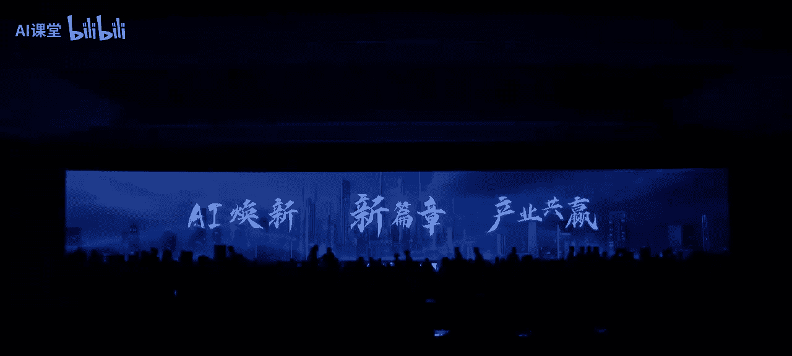
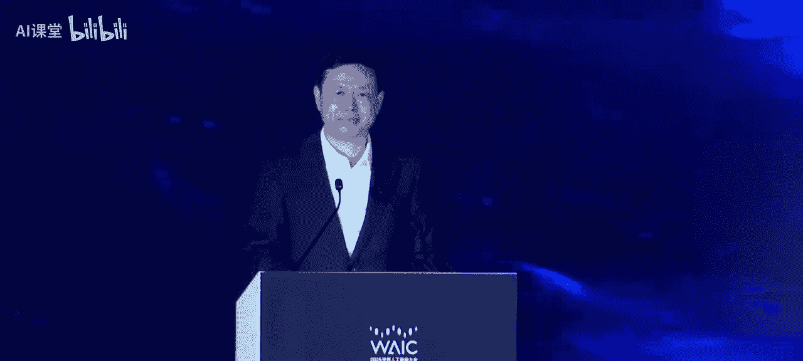
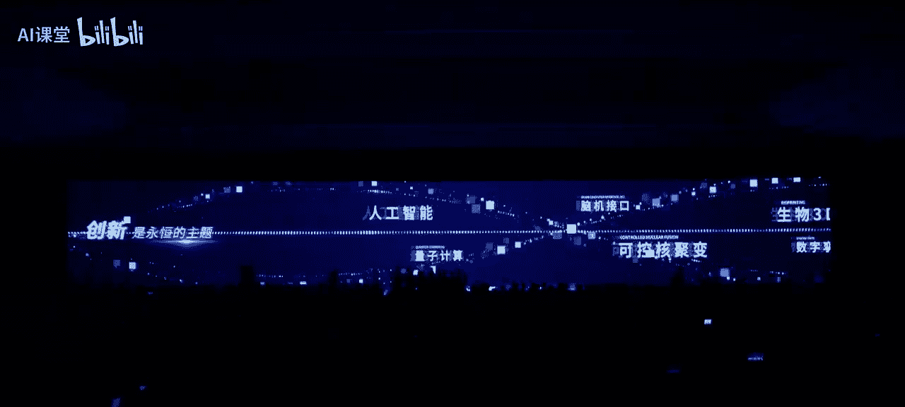
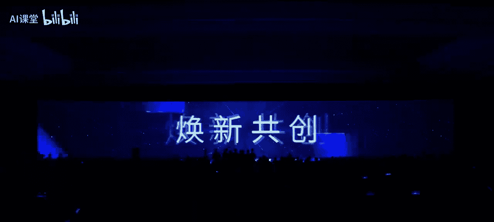
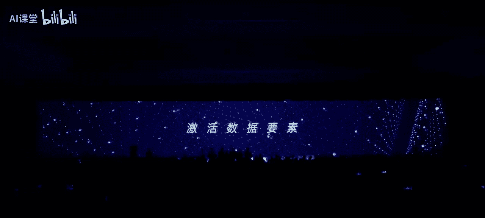
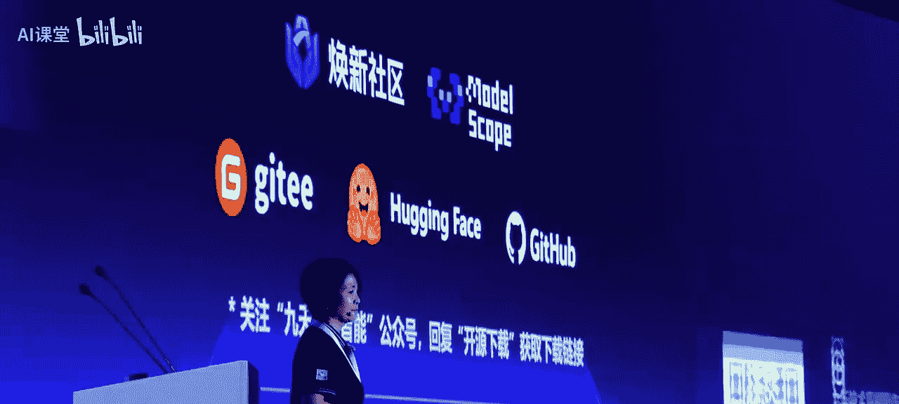
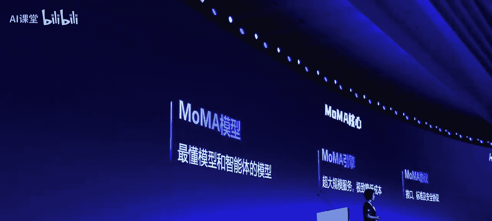

# 人工智能产业发展：企业人工智能产业发展论坛全记录

在本节课中，我们将学习2025年世界人工智能大会主论坛上“AI焕新 产业共赢”企业人工智能产业发展论坛的核心内容。我们将整理并翻译论坛的全程发言，重点关注中央企业在人工智能领域的战略布局、实践成果与未来展望，旨在为初学者提供一份清晰、易懂的行业洞察教程。

---

## 概述：时代使命与央企担当

一个时代有一个时代的使命。一代央企有一代央企的担当。央企血脉中流淌着创新基因，以科技为笔，以创新为墨，共同书写“AI焕新，产业共赢”的新篇章。

通过“焕新”破除界限，致力于赋能万物：以算力突破技术穹顶，用模型跨越科技天堑，让数据点亮价值未来。“唤新”无尽，志启万业。我们深耕国之重器，惠及百业千行；专注国计民生，守护千家万户；重塑科研范式，智启时代新品；秉承开放协同，共建产业生态。

---

## 第一节：开幕致辞与战略指引

本节中，我们将回顾论坛的开幕环节，了解国家部委与地方政府对人工智能产业发展的战略指引与殷切期望。

### 领导致辞：凝聚共识，汇聚合力

国务院国资委党委委员、副主任李振先生在致辞中指出，要深入贯彻落实习近平总书记关于人工智能发展的重要指示精神。中央企业正携手并进，依托各自优势，合力构建开放共享的AI产业生态，推动AI技术在国家关键行业和重要领域的深度融合与规模化应用。

他提出三点希望：
1.  **进一步落地战略性、高价值应用，释放场景乘数效应。** 打造人工智能在科研、生物医药、新材料研发、新型工业化、智能机器人等领域的应用标杆。
2.  **进一步夯实基础底座供给能力，筑牢产业发展基石。** 要建设智算集群，强化核心技术攻关，加速构建自主可控的模型能力矩阵，并破题数据开发利用新范式。
3.  **进一步建设完善开放生态，激发创新源头活水。** 强化开源社区建设运营，深化创新合作，并加快人工智能“走出去”，参与全球治理。

上海市委常委、常务副市长吴伟先生代表上海市委、市政府致辞。他表示，上海将人工智能作为重点发展的先导产业，致力于打造“五地”：人工智能创新策源地、赋能百业大模型垂类应用示范地、开放融通的产业生态集聚地、年轻活跃的创新创业首选地和智能向善的治理合作先行地。上海将持续打造一流营商环境，支持各类主体在人工智能领域取得更大突破。

---

## 第二节：前沿洞察——AI for Life Science

上一节我们了解了宏观的战略指引，本节中我们来看看人工智能在生命科学这一具体前沿领域的应用、前景与挑战。中国科学院院士汤超先生为我们带来了精彩分享。

### AI for Life Science 的现状与前景

AI在过去几年井喷式爆发，开创了新时代。在生命科学领域，最著名的成功案例是**AlphaFold**，它能够根据基因序列预测蛋白质的三维结构。这是一个里程碑，但也是“万里长征的第一步”，因为其数据质量高、任务相对明确。

当前，AI for Life Science 已带来诸多变革：
*   **药物设计**：基于蛋白结构设计靶向药物分子。
*   **脑机接口**：通过解读脑电波，实现意念控制写字、玩游戏等。
*   **临床应用**：在疾病机制发现、新药研发、医学影像诊断（已达专家级水平）等方面广泛应用。

未来前景广阔，例如：
*   **自动化实验室**：AI与实验设备形成闭环，实现全自动化实验与发现。
*   **虚拟细胞**：用AI模拟细胞内的所有生命过程，用于药物生成和毒性预测。
*   **数字孪生人**：整合个人基因组、影像、病史等数据，在数字空间创建一个“数字孪生”，用于健康监测和疾病预警。

### 面临的核心挑战

然而，AI for Life Science 也面临巨大挑战：
1.  **系统复杂性**：生命是一个从分子到人体的多尺度、多层次耦合的复杂动态系统。
2.  **数据整合难题**：生命科学数据多模态、非线性、动态且碎片化，整合对齐困难。
3.  **模型架构局限**：当前主流的Transformer架构在处理高度非线性、动态的生物数据时可能不足，需要针对“生命语言”设计新架构。
4.  **数据共享与质量**：我国数据缺乏共享机制，数据库建设滞后，且数据存在噪声和质量问题。
5.  **基本原理缺失**：我们对生命的基本原理和“语言”缺乏深刻认识，AI模型更多是在学习表象而非底层规律。

### 发展建议

汤超院士提出，发展AI for Life Science需要：
*   **构建新模型架构**：针对生命系统的自组织、层级涌现等特征设计模型。
*   **建设数据生态体系**：整合数据、建立共享机制、生成高质量新数据集。
*   **推动交叉学科融合**：联合AI、生命科学、物理、数学等多领域人才共同攻关。
*   **坚持开源开放与长线布局**：优化人才机制，加强交叉学科人才培养。

---

## 第三节：央企实践——深入实施“AI+”行动

了解了前沿领域的挑战后，本节我们聚焦中央企业如何将AI技术落地，深入实施“AI+”行动。中国移动、中国石油、中国电子分享了他们的实践经验。

### 中国移动：把握变革方向，筑牢数智根基

中国移动董事长杨杰先生指出，AI开启了“碳硅融合”的文明新形态，带来智能、时空、效能“三个倍增”的新机遇。中国移动在“AI+”时代发挥新的“扁担效应”：
*   **牵引科技创新**：自主研发“九天”通专大模型矩阵，建设智算集群，构建高质量数据集。
*   **带动产业创新**：打造“灵犀”智能体，落地超千个行业项目，构建“咪咕”平台赋能社会创新。

未来，中国移动将着力锻造一流的科技创新成果、产业焕新服务、研发创新载体和开放合作生态，特别是牵头建设**人工智能焕新社区**，打造国家级AI开源开放创新载体。

### 中国石油：聚焦赋能主业，打造行业大模型

中国石油总会计师周松先生分享了中国石油以“昆仑”大模型为核心推进“AI+”行动的经验。
*   **战略引领**：明确“1+4+N”架构体系，设计“十域百景千应用”全景视图。
*   **赋能主业**：
    *   **地球物理勘探**：用大模型进行地震解释，断裂识别效率提升10倍以上，缝洞体识别准确率达90%。
    *   **测井处理**：储层关键参数预测精度超85%，工作时效提高30%。
    *   **油气田开发**：储层改造设计效率提升3倍，抽油机井工况诊断准确率达95%以上。
    *   **炼油化工**：优化工艺参数，实现装置节能降耗，单条产线年经济效益超千万元。
*   **未来规划**：持续攻坚行业大模型，构建高质量数据集，深化场景建设与应用。

### 中国电子：建设高质量数据集，释放产业价值

中国电子副总经理王桂荣先生强调了高质量数据对于AI产业发展的关键作用。当前行业大模型发展受制于数据质量、规模和共享难题。
中国电子的实践围绕“1+1+1”体系展开：
1.  **升级基础软硬件**：芯片、服务器、操作系统等全面升级拥抱AI。
2.  **攻坚高质量数据集建设**：
    *   **自动化加工**：将数据处理从“劳动密集型”转为“知识密集型”，效率大幅提升。
    *   **数据合成**：采用知识引导技术生成高质量合成数据，破解数据稀缺难题。
    *   **联合训练**：研发技术，实现多家企业数据“可用不可见”地共建大模型。
3.  **融合AI与信息化**：将AI智能体（Agent）能力融入传统企业信息化系统，提升知识问答与数据分析效率。

---

## 第四节：产业赋能发布——社区、场景与机构揭牌

在学习了央企的具体实践后，本节我们进入论坛的发布环节，见证推动AI产业发展的具体平台、场景和新机构的诞生。

### 发布一：人工智能焕新社区

在国务院国资委统筹推进下，由中国移动牵头，聚合众多央企及产业链伙伴，共同打造了面向全社会的**人工智能焕新社区**。该社区以“汇聚众智，焕新共创”为目标，坚持开放协同、共建共治、中立、安全合规的原则，旨在：
*   **汇算力**：提供普惠国产算力。
*   **绽模型**：优先开放央企行业模型。
*   **聚数据**：开放高质量数据集，激活数据要素。
*   **强产业**：携手国产芯片厂商，加速国产化进程。
*   **拓场景**：开放央企场景，推动供需对接。

### 发布二：首批中央企业人工智能战略性高价值场景

国务院国资委发布了首批40个战略性高价值场景，涵盖能源电力、工业制造等16个重点领域。这些场景战略意义强、经济收益高、民生关联紧，代表了AI技术深度赋能行业转型的标杆。

### 发布三：中移九天人工智能科技有限公司暨研究院揭牌

中国移动为深化AI战略布局，重组成立了研发运营一体的新型专业化机构——**中移九天人工智能科技有限公司**及**九天人工智能研究院**。该机构定位于成为世界一流的AI科技创新公司和国家战略科技力量。

---

## 第五节：技术成果发布与圆桌论坛

本节我们将关注中国移动发布的最新AI技术成果，并聆听产业界专家关于生态共建的深度讨论。

### 九天研究院创新成果发布

中国移动首席科学家冯俊兰博士发布了“九天”系列大模型的最新进展：
*   **全面升级至3.0**：涵盖语言、多模态、结构化数据等多种模型，具备高安全、高可控、全国产、全行业覆盖特征。
*   **核心能力突破**：在语言理解、数学、代码、深度推理、GUI智能体（操作界面）等多个评测榜单上表现优异。重点攻关了**可控生成**技术，以降低大模型“幻觉”，满足行业高可靠需求。
*   **开源三款基座模型**：专门为开源社区发布了结构化数据大模型、代码模型等，并配套开源了评测数据集和体系。
*   **发布“MOMA”引擎**：即模型与智能体聚合服务引擎。它能自动感知、调度各类模型和智能体，实现动态路由和智能规划，旨在降低推理成本、提升效能。演示显示，在数学、代码等场景推理速度提升可达134%。

### 圆桌论坛：汇聚众智，焕新共创

在GTI主席高同庆先生的主持下，四位专家围绕“开源开放”、“生态建设”、“平台运营”等议题展开讨论。

*   **北京智源研究院黄铁军**：强调开源开放是AI发展的必然逻辑，谁封闭谁就会变成小圈子。生态的成功在于良性迭代，应用生态的丰富将带动底层技术体系的发展。
*   **国家人形机器人创新中心熊友军**：认为生态建设需要**互补**、**全产业链协作**和**商业闭环牵引**。应避免同质化内卷，由领军企业串联产业链，并在垂直领域找到商业化落脚点。
*   **燧原科技赵立东**：指出赢得竞争的关键在于赢得生态。生态包括**技术生态**（打通从芯片、超节点、网络到模型的全栈技术）和**商业生态**（实现从技术闭环到商业闭环的跨越）。
*   **深势科技李琴**：认为生态建设需连接供需两端。需求方（如央国企）应开放痛点场景；供给方（AI公司）应躬身入局解决真实问题。**换新社区**是连接生态的关键，其成功重在**运营**，包括线上社区、线下连接以及国际化运营。

**论坛共识**：开源开放是必然逻辑，生态构建是成功法则，丰富场景是中国的关键优势，而**换新社区**等平台的成功重在长期、专业的运营。央企应发挥“链主”作用，携手各方，共创AI赋能高质量发展的新篇章。

---

## 总结

在本节课中，我们一起学习了2025年世界人工智能大会企业论坛的核心内容。我们从国家战略指引出发，探讨了AI在生命科学前沿的机遇与挑战，深入了解了中国移动、中国石油、中国电子等中央企业在“AI+”行动中的具体实践与成果。我们还见证了“人工智能焕新社区”的发布、首批战略性高价值场景的揭晓，以及中移九天公司的成立。最后，通过圆桌论坛，我们认识到开源开放、共建生态、运营好创新平台对于中国人工智能产业赢得未来竞争至关重要。这场论坛充分展现了央企在人工智能时代的使命、担当与创新力量。