# 002：Jukebox音乐生成模型（论文解读）

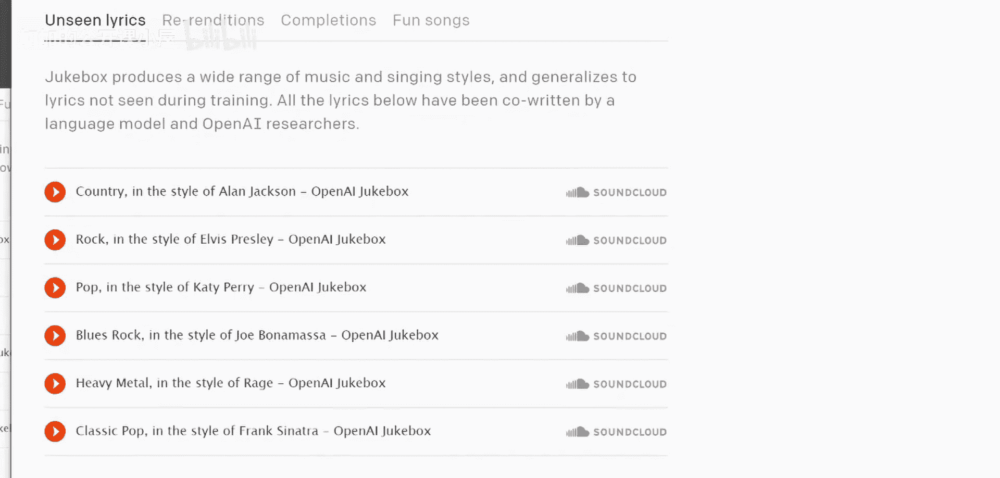

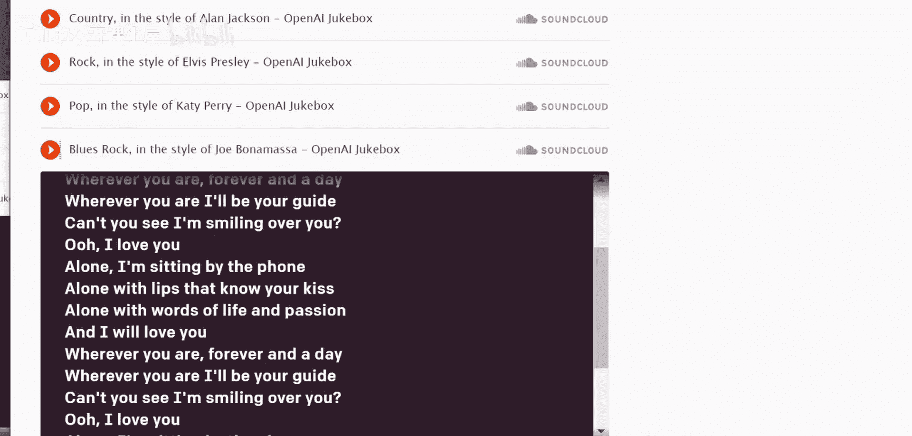

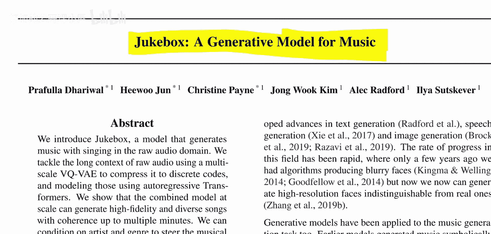

在本节课中，我们将要学习OpenAI提出的Jukebox模型。这是一种能够生成包含人声演唱的音乐的生成模型。其生成音乐的质量和整首歌曲的音乐连贯性都令人印象深刻。我们将解析其核心架构——基于VQ-VAE的层次化模型，并理解其工作原理。

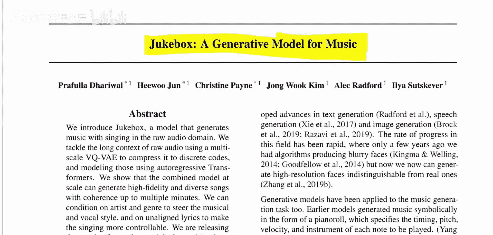

## 模型概述与背景

上一节我们介绍了Jukebox是一个高质量的音乐生成模型。本节中我们来看看论文的基本信息和模型的核心思路。

这篇论文名为《Jukebox: A Generative Model for Music》，作者来自OpenAI。该模型本身在架构上并非完全创新，但其整体设置方式非常合理且有效，能够生成包含歌词演唱的音乐，这是一项新颖的成就。

## 核心组件：VQ-VAE 详解

为了理解Jukebox，我们首先需要了解其基础构建模块：VQ-VAE（矢量量化变分自编码器）。让我们从更基础的自编码器概念开始。

在经典的自编码器中，我们有一个输入（例如一张图片），它通过一个**编码器**网络，被压缩成一个隐藏表示 **Z**。随后，一个**解码器**网络尝试从这个隐藏表示 **Z** 中重建出原始输入。通过训练编码器和解码器最小化重建误差，模型可以学习到数据的有用压缩表示。

变分自编码器（VAE）在此基础上进行了改进。在VAE中，编码器输出的不是单一的向量 **Z**，而是用于参数化一个高斯分布的参数（例如均值和方差）。然后，从这个分布中采样出一个向量，再送给解码器进行重建。这使得潜在空间更连续、更规则。

而VQ-VAE则采用了不同的策略。它同样使用编码器将输入映射为隐藏表示 **H**。关键的不同在于，模型维护了一个可学习的**码本**，这是一个包含 **K** 个向量的列表。编码器输出的 **H** 会被**量化**，即找到码本中与之最接近的向量 **E**，并用这个 **E** 来替代 **H**，随后送给解码器。

以下是VQ-VAE的简化表示：
```
输入 X -> 编码器 -> 隐藏表示 H -> 向量量化（找码本中最接近的 E） -> 量化表示 E -> 解码器 -> 重建输出 X'
```

VQ-VAE的训练包含三个损失函数：
1.  **重建损失**：衡量解码器输出与原始输入的差异。公式为 `L_recon = || X - X' ||^2`。
2.  **码本损失**：用于更新码本向量 **E**，使其更接近对应的编码器输出 **H**。公式为 `L_codebook = || sg[H] - E ||^2`，其中 `sg` 代表停止梯度。
3.  **承诺损失**：用于更新编码器，使其输出 **H** 更接近被选中的码本向量 **E**，以确保信息有效传递。公式为 `L_commit = || H - sg[E] ||^2`。

通过这种设计，VQ-VAE能学习到一个离散的、压缩的潜在表示，这对于后续的生成建模非常有利。

## Jukebox 的层次化架构

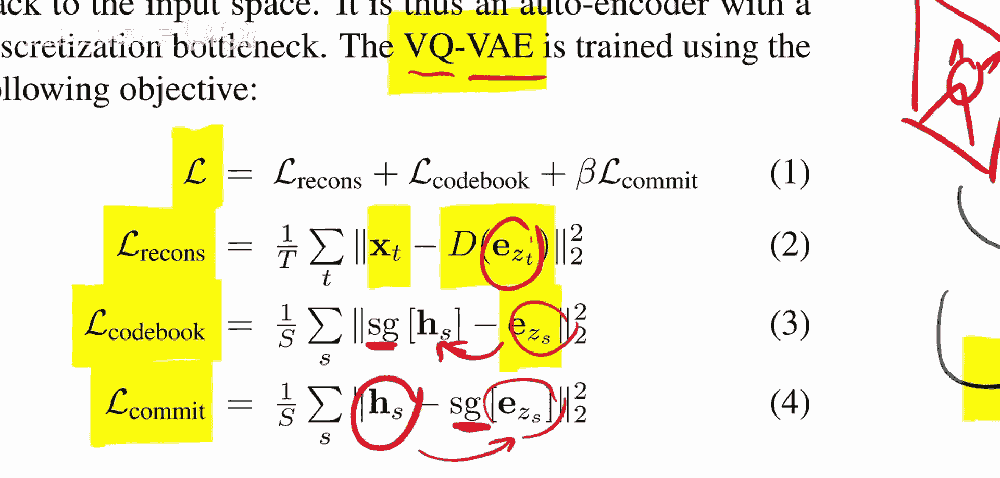

理解了VQ-VAE之后，我们现在可以看看Jukebox如何利用它来生成音乐。

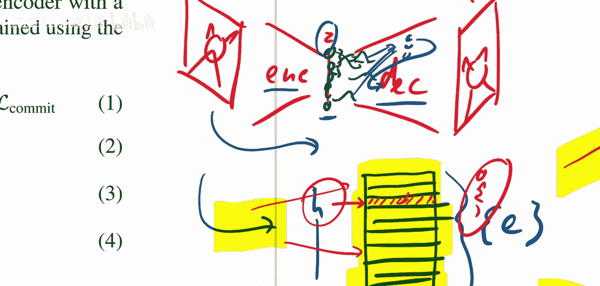

Jukebox采用了一个层次化的自编码器架构。它从原始的音乐样本开始，目标是通过训练重建这个样本。模型的核心是使用了**三个不同尺度**的VQ-VAE，分别处理音乐信号的不同层次信息。

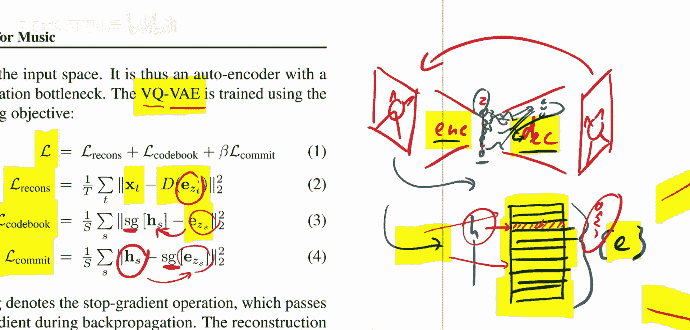

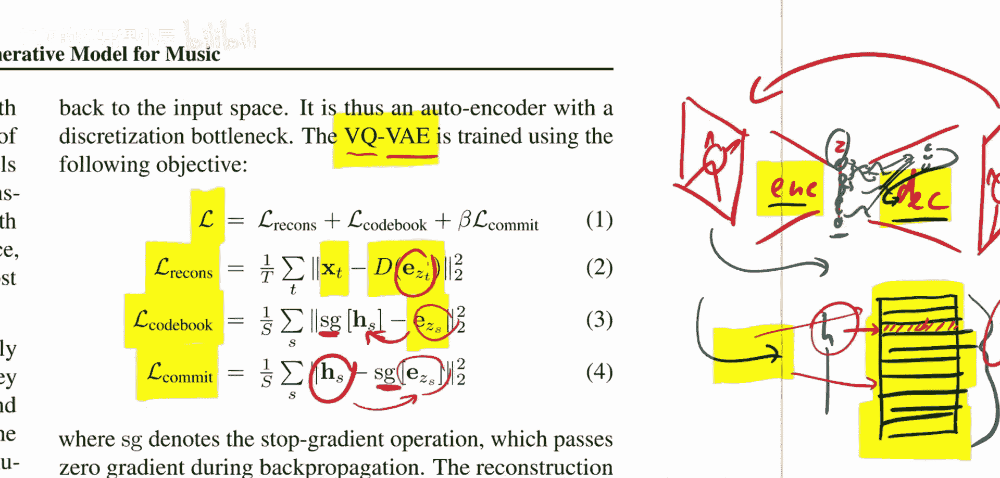

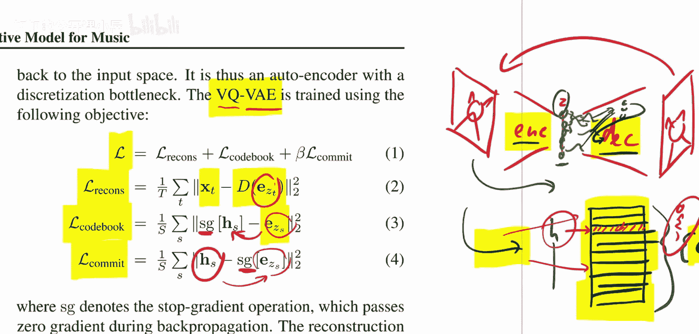

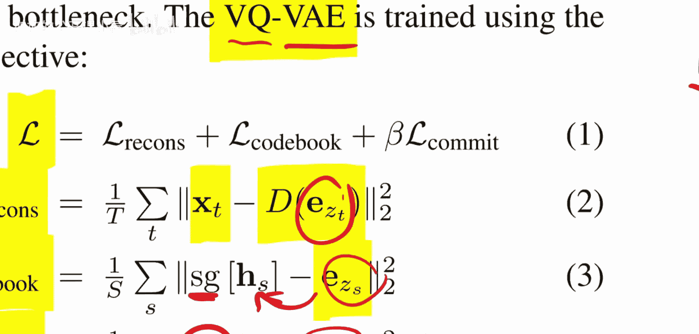

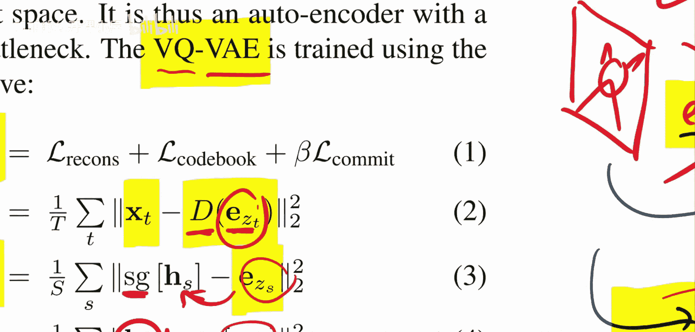

以下是其工作流程的简要说明：
1.  原始音频首先经过一个编码器，被下采样并转换成一系列潜在表示。
2.  这些表示会在三个不同的层次（粗糙、中等、精细）上分别进行**向量量化**。每一层都对应一个独立的VQ-VAE，并拥有自己的码本。
3.  量化后的离散编码被送入对应的解码器，尝试重建原始音频。

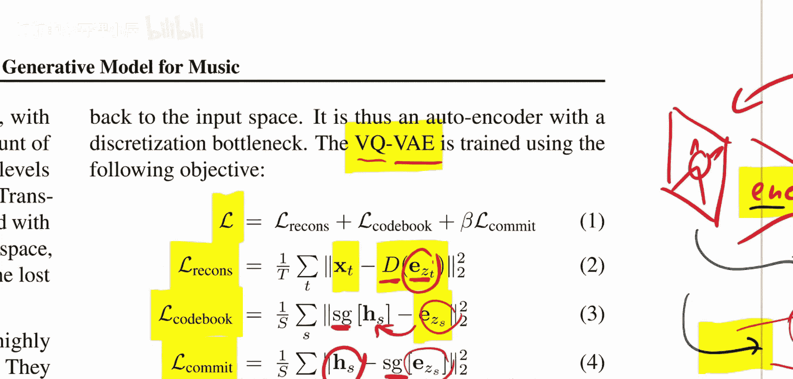

由于音乐是连续的时序信号，不能简单地编码整个片段，因此模型实际上处理的是音频的序列化片段。每一层的VQ-VAE都是独立训练的，分别捕捉音乐中从整体结构（粗糙层）到细节纹理（精细层）的不同特征。

## 总结

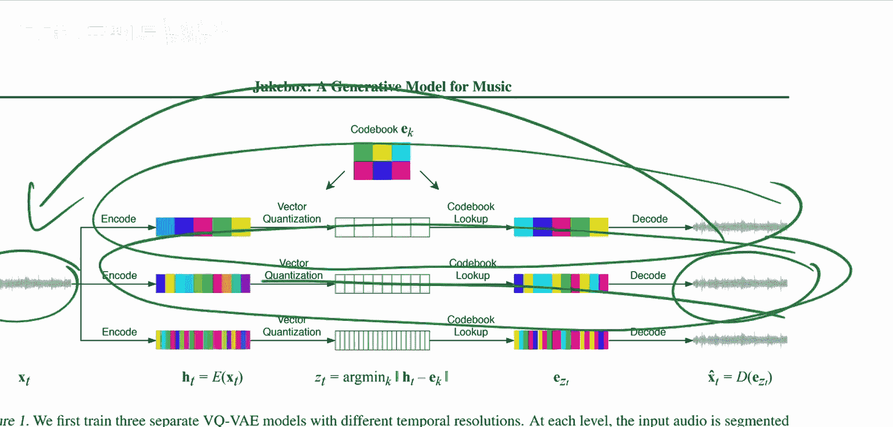

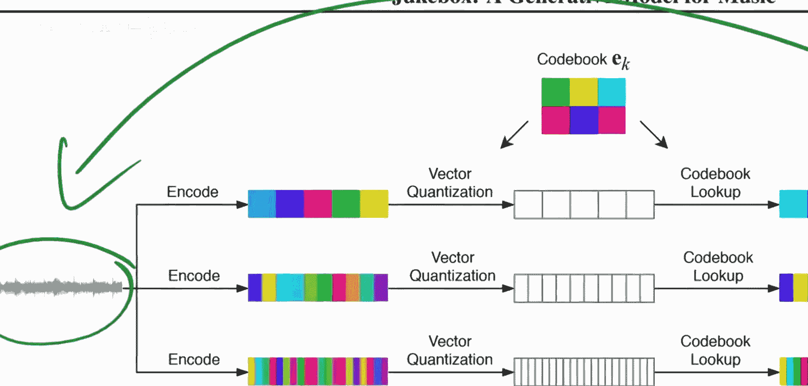

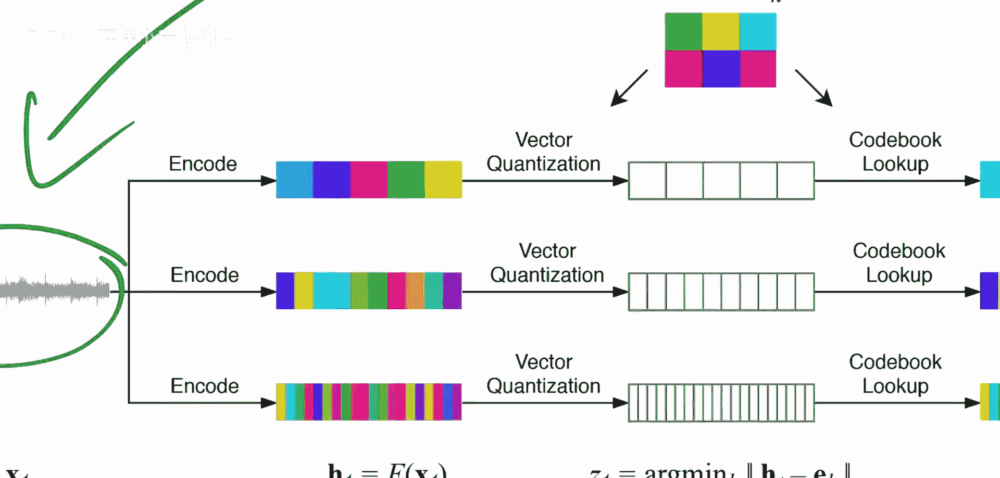

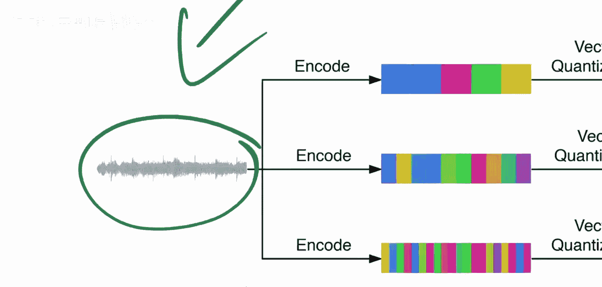

本节课中我们一起学习了OpenAI的Jukebox音乐生成模型。我们首先了解了其能够生成带人声的高质量连贯音乐这一目标。接着，我们深入探讨了其核心组件VQ-VAE的原理，包括其编码、矢量量化和解码过程，以及三个关键损失函数。最后，我们解析了Jukebox如何将多个VQ-VAE以层次化的方式组合起来，分别建模音乐的不同尺度特征，从而实现了复杂音乐内容的生成。这种层次化离散表示的方法为处理长序列、高复杂度的生成任务提供了有力的框架。