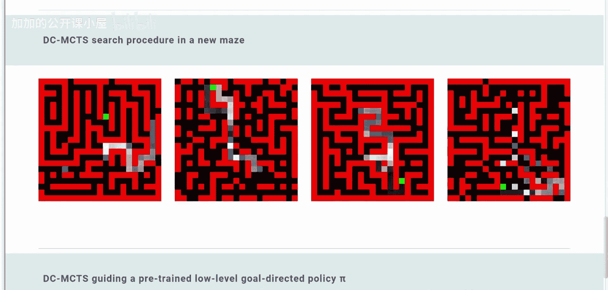
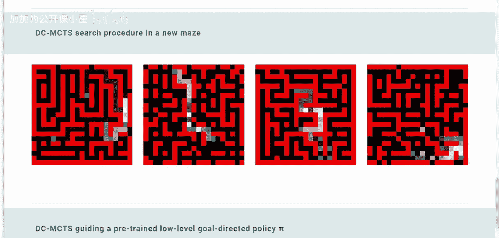
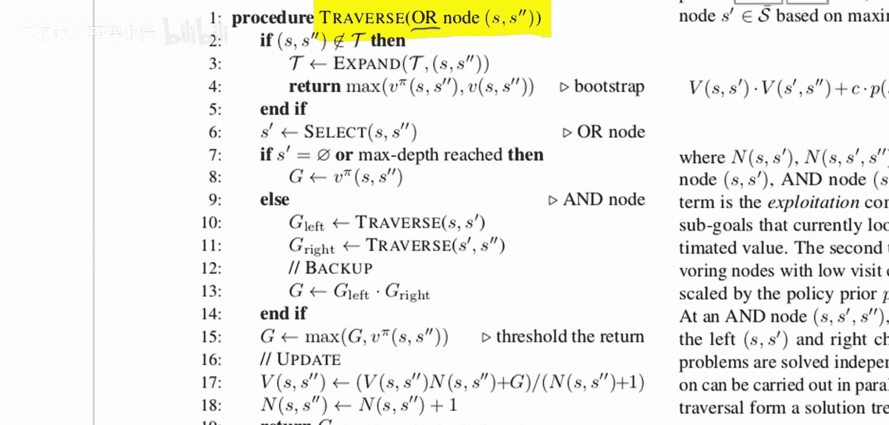

# 005：分治蒙特卡洛树搜索在目标导向规划中的应用





在本节课中，我们将要学习一种名为“分治蒙特卡洛树搜索”的规划算法。该算法以一种非传统的方式进行规划，通过递归地将大问题分解为更小的子问题来高效地寻找从起点到目标的路径。

## 什么是目标导向规划？🎯

上一节我们介绍了本课程的主题，本节中我们来看看什么是目标导向规划。

目标导向规划是指，算法被赋予一个需要达成的具体目标。这个目标在每次运行算法时都可以不同。例如，在一个网格世界中，智能体位于起点，需要找到一条路径到达指定的目标点。

## 什么是规划？🧭

在理解了目标导向后，我们来看看规划的含义。

在传统的强化学习中，智能体通常通过试错来学习：它执行动作，观察结果和奖励，然后调整策略。规划则不同。在规划中，智能体在真正采取行动之前，会先在“脑海”中模拟一系列动作及其后果。这通常要求智能体拥有一个环境模型，能够预测执行某个动作后状态会如何变化。这种“前瞻”能力使得智能体可以评估多条潜在路径，而无需在真实环境中冒险尝试。

## 规划为何是树搜索问题？🌳

既然规划涉及模拟不同动作序列，那么它自然可以表示为一个树搜索问题。

智能体从初始状态开始，每个可能的动作都会引向一个新的状态节点，从这些新节点又可以继续展开更多动作。这就构成了一棵搜索树。其中一条从根节点（起点）到某个叶节点（目标）的路径，就是一个可行的计划。

然而，这里存在一个问题。如果到达目标需要 D 步，并且每个状态有 B 个可选动作，那么这棵搜索树将包含大约 B^D 个节点。对于较长的路径或较多的动作选择，这个数字会变得极其庞大，无法进行完全的枚举搜索。

## 如何改进搜索？高效的算法💡

面对巨大的搜索空间，我们需要更聪明的算法。

为了应对搜索空间爆炸的问题，人们提出了如 A* 搜索等算法。A* 算法使用一个启发式函数来估算从当前节点到目标的代价，从而优先探索更有希望的路径，避免搜索整棵树。类似地，在 AlphaGo 等系统中使用的蒙特卡洛树搜索，也会在搜索到一定程度后，使用一个价值网络来评估局面的优劣，从而指导搜索方向，高效地构建搜索树。

## 分治的核心思想：化整为零⚙️

上一节我们介绍了用于改进搜索的启发式方法，本节中我们来看看本文提出的核心分治思想。

假设我们有一个“先知”，它能保证智能体在从起点到目标的**任何**成功路径上，都必然会经过某个中间状态。那么，原始的“从起点到目标”的规划问题，就可以被分解为两个更简单的子问题：
1.  规划一条从起点到该中间状态的路径。
2.  规划一条从该中间状态到目标的路径。

如果原始路径长度为 D，那么每个子问题的路径长度大约为 D/2。这样，需要搜索的节点总数就从大约 B^D 减少到了大约 2 * B^(D/2)，效率得到了极大提升。

本文的算法将这一思想递归地应用下去。它会自动提议这样的“必经”中间状态，然后将每个子问题继续分解为更小的子问题，直到子问题简单到可以一步解决为止。

## 算法结构与关键概念🔍

理解了分治思想后，我们来看看算法的具体结构。

算法围绕一个核心的 `traverse` 过程展开。文中将规划问题中的节点分为 **AND 节点** 和 **OR 节点**。
*   **OR 节点** 表示一个需要被解决的子规划问题（例如“从状态A到状态B”）。
*   **AND 节点** 表示对一个 OR 节点进行分解后得到的两个子问题。

整个搜索过程可以看作是在一棵 **元搜索树** 上进行。这有一点绕：我们本身就是在为一件事（找路径）做规划，这个规划过程是一棵树搜索。而现在，我们搜索“如何分解问题”的过程本身，又构成了一棵搜索树。元搜索树上的每个节点（OR节点）对应一个待解决的子规划问题。

以下是算法 `traverse` 一个 OR 节点（解决“从状态 S 到 S‘”的子规划）的基本步骤：

1.  **基础情况**：如果 S 和 S‘ 是相邻状态，则直接返回连接它们的动作作为规划结果。
2.  **选择中间状态**：使用一个训练好的提议器网络，预测一个介于 S 和 S‘ 之间的关键状态 S_mid。
3.  **递归分解**：将原问题分解为两个子问题：
    *   子问题1：从 S 到 S_mid (新的 OR 节点)
    *   子问题2：从 S_mid 到 S‘ (新的 OR 节点)
    这创建了一个 AND 节点，包含两个子 OR 节点。
4.  **递归求解**：对这两个新的子 OR 节点递归调用 `traverse` 过程。
5.  **回溯与评估**：当子问题求解完成后，沿着元搜索树回溯，并使用一个评估器网络来更新路径的价值估计，从而指导后续搜索（类似于蒙特卡洛树搜索中的反向传播）。

关键公式与代码描述：
*   **问题分解**：`Plan(S, G) => Plan(S, M) + Plan(M, G)`，其中 M 是提议的中间状态。
*   **递归框架**：算法伪代码结构如下：
    ```python
    def traverse(or_node):
        if or_node.start == or_node.goal:
            return Solution(or_node.start)
        if distance(or_node.start, or_node.goal) == 1:
            return Solution(action_between(start, goal))

        # 1. 提议中间状态
        mid_state = proposer_network(or_node.start, or_node.goal)

        # 2. 创建子问题
        subproblem_1 = ORNode(start=or_node.start, goal=mid_state)
        subproblem_2 = ORNode(start=mid_state, goal=or_node.goal)

        # 3. 递归求解
        solution_1 = traverse(subproblem_1)
        solution_2 = traverse(subproblem_2)

        # 4. 合并解决方案
        combined_solution = combine(solution_1, solution_2)

        # 5. 评估并回溯更新元搜索树节点价值
        value = evaluator_network(combined_solution)
        update_node_value(or_node, value)

        return combined_solution
    ```

## 总结📝

本节课中我们一起学习了《分治蒙特卡洛树搜索在目标导向规划中的应用》这篇论文的核心内容。



我们首先明确了目标导向规划的含义，并解释了为何规划问题可以表示为树搜索。接着，我们指出了穷举搜索的局限性，引出了使用启发式或蒙特卡洛方法进行高效搜索的必要性。本文的核心贡献在于提出了**分治**思想：通过递归地提议并确信一个“必经”的中间状态，将庞大的规划问题分解为规模小得多的子问题，从而极大提升了规划效率。最后，我们概述了算法的递归结构，它通过在元搜索树上进行类似蒙特卡洛树搜索的遍历、扩展、模拟和回溯，来动态地分解和求解问题。这种方法为解决长视野、复杂序列的决策问题提供了一个强有力的新框架。