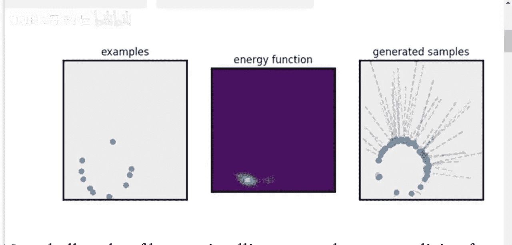
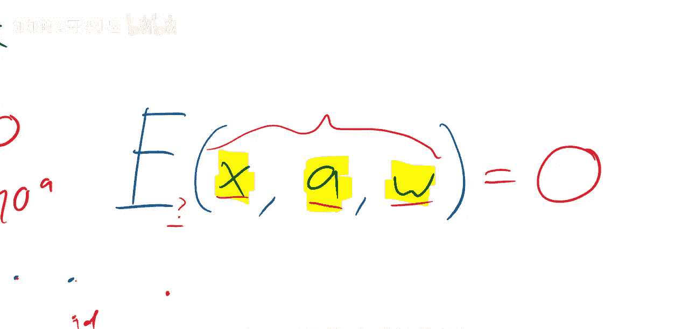

# 007：论文详解

在本节课中，我们将要学习一篇名为《Concept Learning with Energy-Based Models》的论文。这篇论文由OpenAI的Igor Mordatch等人撰写，探讨了如何使用能量函数来学习抽象概念，例如从数据点中学习“圆形”或“方形”的概念。我们将从理解能量函数的基本概念开始，逐步深入到论文的核心思想。

## 概述

能量函数是机器学习中一个强大的框架，它可以将许多问题统一起来。简单来说，一个能量函数 **E(x)** 为“好”的输入 **x** 输出低值（例如0），为“坏”的输入输出高值。本节课我们将看到如何利用这个框架，从少量演示数据中学习一个概念，并生成符合该概念的新数据。

---

## 什么是能量函数？🤔

上一节我们介绍了本课程的目标，本节中我们来看看能量函数这个核心概念。

一个能量函数（有时称为 **E**）是一个具有一个或多个输入（我们称之为 **x**）的函数。如果能量函数“满意”于输入 **x**，它将输出值0；如果它“不满意”，则会输出一个高值（大于0）。因此，低能量（如0）代表“好”，高能量代表“坏”。

我们可以将几乎任何机器学习问题表述为能量函数。以下是几个例子：

*   **分类器**：对于一个分类器，输入可以是图像 **x** 和标签 **y**。如果图像是一只猫，并且标签是“猫”，那么能量函数应该输出低值（例如0）。如果图像是猫但标签是“狗”，能量函数应输出高值（例如一个很大的数）。这里的能量函数可以直接使用损失函数（如负对数似然）来构建。
*   **K-Means聚类**：对于一个K-Means模型，输入是一个数据点 **x**。能量可以定义为该数据点到其最近聚类中心的距离 **d**。当数据点靠近某个聚类中心时，能量低；当数据点远离所有中心时，能量高。这个距离 **d** 就是K-Means成本函数的一种形式。

目前，能量模型通过生成对抗网络（GANs）或噪声对比估计（NCE）等方法变得流行。在GAN中，判别器学习一个能量函数：它在真实数据点处输出低能量（形成“山谷”），在生成的数据点处输出高能量。生成器的目标则是产生位于这些低能量“山谷”中的数据。

## 从能量函数中生成数据 🎯

上一节我们了解了能量函数如何评估输入，本节中我们来看看如何利用它来创造新的数据。

通常，在训练像GAN这样的模型时，我们会训练一个生成器来直接产生位于能量“山谷”中的数据。然而，还有另一种方法：如果我们已经有一个平滑的能量函数 **E(x)**，我们可以从一个随机点 **x** 开始，直接对 **x** 使用梯度下降法来最小化能量 **E(x)**，从而“滑入”最近的低能量山谷。这个过程不需要训练一个独立的生成器网络。

理论上，如果能量函数能完美描述数据分布，这种方法就能生成高质量的数据。但在实践中（例如在标准GAN中），直接对判别器进行梯度下降通常只会产生对抗样本，而不是逼真的数据，因为判别器本身可能不是一个完美的能量函数。然而，这个思想是论文方法的核心。

## 论文的核心思想：推理缺失部分 🔄

上一节我们讨论了利用能量生成数据，本节中我们来看看论文如何将这一思想扩展到概念学习。

在这篇论文中，作者设定了一个场景。假设我们有一个能量函数 **E(x, a, w)**，它接受三个输入：**x**（数据，如图像），**a**（动作或演示），**w**（概念或目标）。当这三个输入相互“兼容”时，能量函数输出低值（0）。

关键思想是：**如果我们已经学习到了一个好的能量函数，并且给定了三个输入中的任意两个，我们就可以通过梯度下降来推断出第三个兼容的输入。** 因为我们的目标是找到使能量 **E** 最小化（接近0）的那个缺失输入。

例如：
*   给定概念 **w**（如“圆形”）和演示 **a**，可以推断出符合该概念的数据 **x**。
*   给定数据 **x** 和概念 **w**，可以推断出产生该数据的动作 **a**。
*   给定数据 **x** 和动作 **a**，可以推断出背后的概念 **w**。

在训练阶段，我们的目标是从训练数据集中学习能量函数 **E** 本身的参数。训练数据提供了多组兼容的 **（x, a, w）** 三元组。通过训练，能量函数学会为这些真实的兼容三元组输出低能量，为不兼容的组合输出高能量。

一旦能量函数训练完成，我们就可以进行上述灵活的推理，实现从演示中学习概念并生成新数据。

---

## 总结

本节课中我们一起学习了基于能量的概念学习模型。我们从能量函数的基本定义出发，了解了它如何为兼容的输入分配低能量。接着，我们探讨了如何通过梯度下降直接在能量函数中“寻找”数据点。最后，我们揭示了论文的核心：训练一个能接受数据、动作和概念三者作为输入的能量函数，从而允许我们在给定任意两个输入的情况下，推理出第三个兼容的输入。这种方法为从少量演示中学习抽象概念并提供了一种灵活而统一的框架。