# 011：自监督的关键分析，或从单张图像中能学到什么

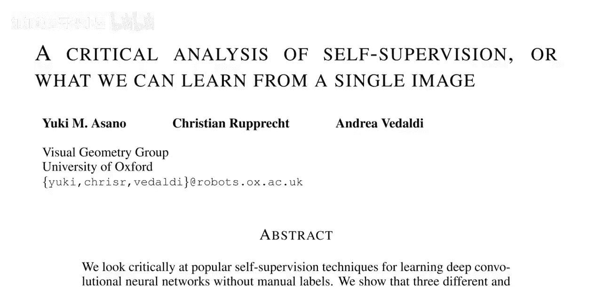

在本节课中，我们将要学习一篇由Yuki M. Asano、Christian Rupprecht和Andrea Vedaldi撰写的论文。这篇论文对自监督学习进行了关键分析，探讨了从单张图像中能学到什么。我们将解析其核心观点、实验方法以及结论。

论文的核心观点是：三种具有代表性的自监督方法（Jigsaw、RotNet和DeepCluster）在使用了强数据增强的前提下，能够仅从单张图像中学习到卷积网络前几层的特征，其效果与使用数百万张带人工标签的图像相当。然而，对于更深的网络层，即使使用数百万张无标签图像进行训练，其性能与有监督学习之间的差距也无法弥合。

## 什么是自监督学习？

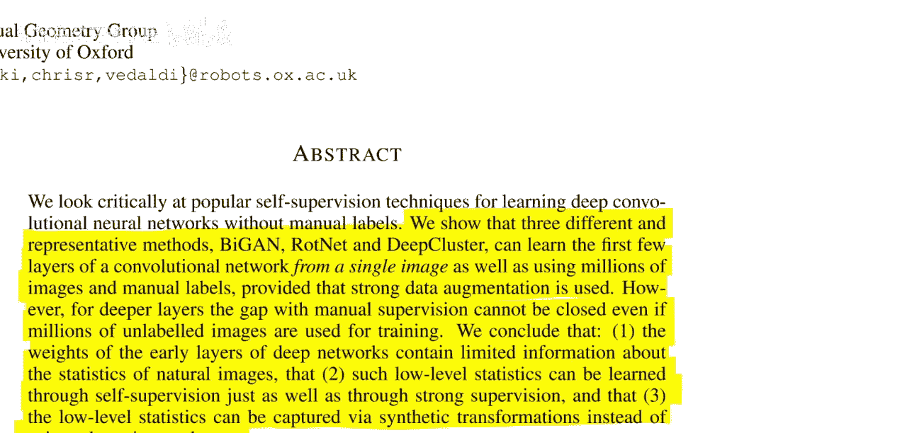

上一节我们介绍了论文的核心结论，本节中我们来看看什么是自监督学习。对于不熟悉的同学，自监督学习是一种技术，当你拥有图像但没有标签，却仍想从中学习时，可以使用它来对网络进行预训练。

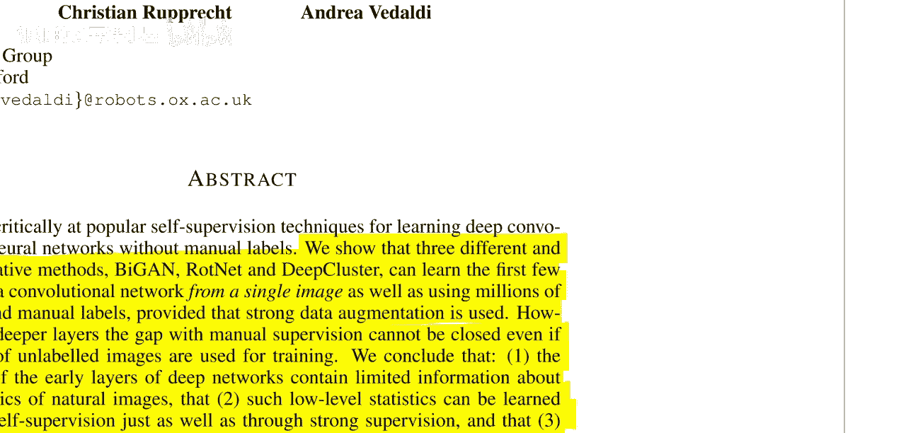

具体来说，你有一个神经网络 **f**，你希望对于训练数据集中的 **(x, y)**，有 **f(x)** 接近 **y**。但如果你有一个更大的、只有 **x** 的数据集，你可以通过自监督学习让网络适应数据。

以下是自监督学习的核心思路：
*   你需要为数据点创建自己的“伪标签”。
*   以RotNet方法为例：输入一张图像（例如手写数字3），然后将其旋转（如翻转、倒置）。
*   接着，要求网络判断图像是原始方向、向右旋转、向左旋转还是倒置。
*   由于旋转操作是你自己执行的，因此你知道正确的“伪标签”。这种方法出人意料地有效。

## 论文的核心主张与“技巧”

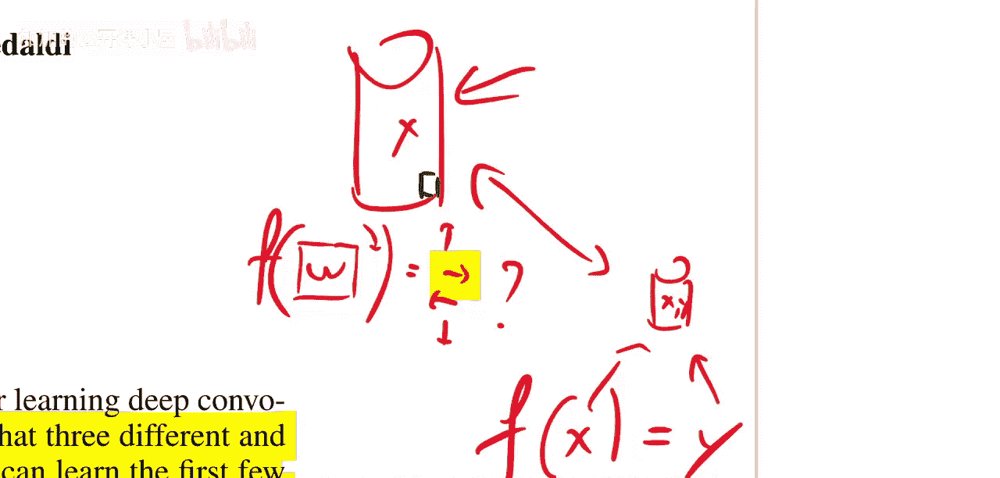

这篇论文进一步指出，你实际上并不需要庞大的数据库。有时，仅在一张图像上进行这种操作就足够了。不过，我必须指出，这个主张有点“取巧”。

论文声称，仅用单张图像就足以学习神经网络浅层的特征，因为这些层通常提取的是低级特征，可以从单张图像中学到。但对于更高级的特征，你确实需要有监督的数据集；仅靠自监督技术，甚至拥有大量自监督样本（即庞大的无标签数据集），对于深层网络来说仍然不够。

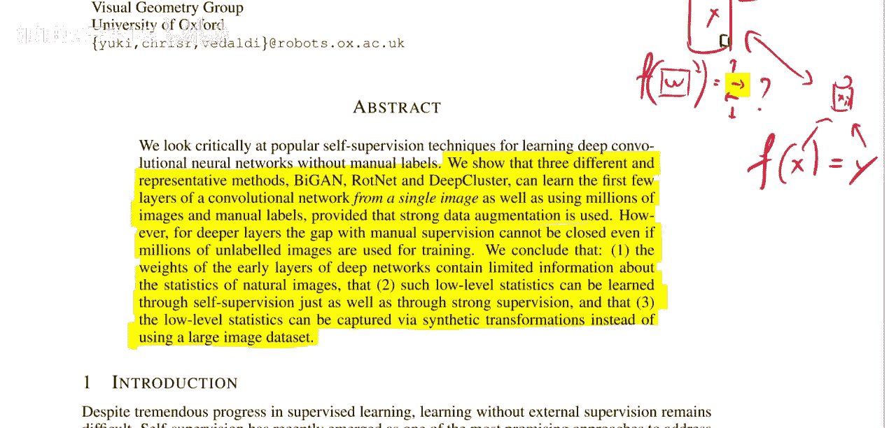

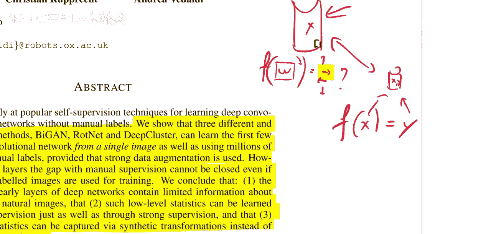

这几乎挑战了一个常见观点，即拥有海量无标签数据就足以学习一切，包括由我本人在内的一些人曾持有的观点。

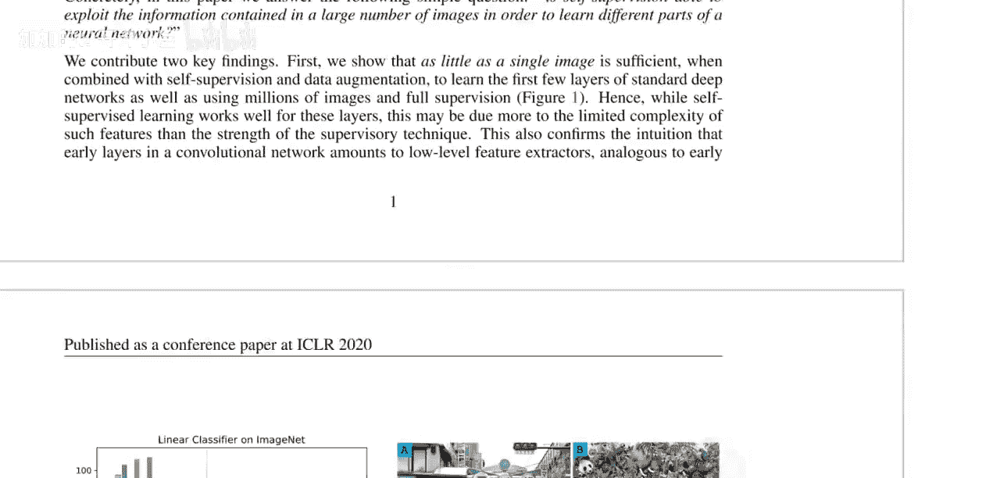

## 实验设置与图像选择

那么他们具体是怎么做的呢？他们使用单张图像或极少数图像进行实验。在单张图像的设置中，他们手动选择了以下三张图像：

*   **图像A**：选择它是因为场景非常拥挤，包含人物、物体、光线、房屋、线条和透视等多种元素。
*   **图像B**：这是一幅绘画图像，同样包含许多内容。他们想研究自然图像与人工图像的效果对比。
*   **图像C**：作为对照图像，因为与图像A和B相比，它的大部分区域没有太多内容。

我说这有点“取巧”，是因为这些图像实际上非常大。对于ImageNet或CIFAR-10数据集来说，这虽然技术上算“单张图像”，但如果你将其分割成多个小块，那在技术上就不成立了。如果能看看对单张图像进行下采样后的结果会怎样，可能会更有趣。

## 研究方法：线性探测

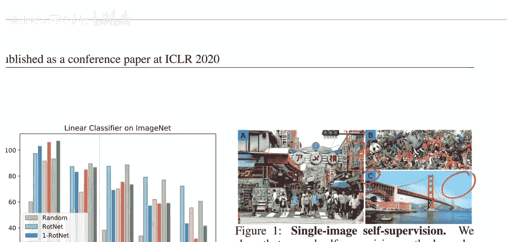

他们使用一个五层卷积网络进行研究。网络包含五个卷积层，每层后可能有批归一化和ReLU激活函数，以及一些最大池化层，最后是一个线性分类器，用于将图像分类到10、100或1000个类别中。

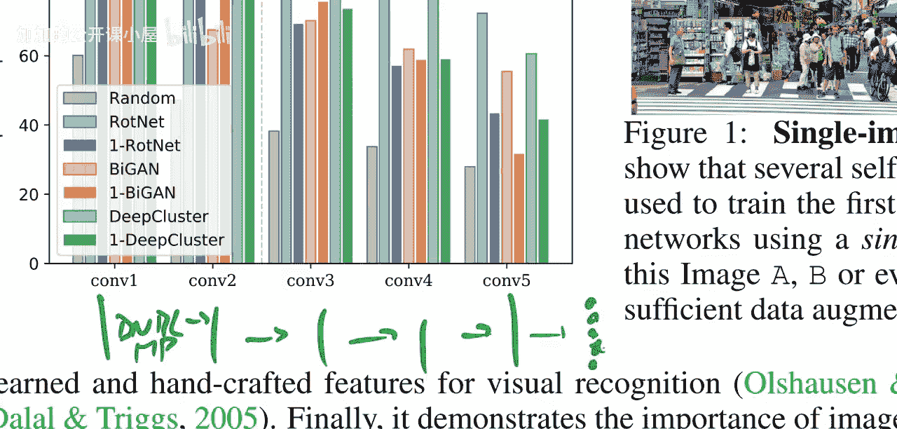

他们通过**线性探测**来研究每一层学到了多少东西。线性探测是一种用于检查网络各层学习效果的技术。

假设我们的网络结构是：输入 **X**，经过隐藏表示 **H1**、**H2**、**H3**，最终输出预测 **Ŷ**，并与数据集中的真实标签 **Y** 比较。

线性探测旨在评估某个隐藏表示对于分类任务的有用程度。具体做法是：取某一层的隐藏表示（例如 **H1**），在其上训练一个**单一的线性分类器**来预测 **Ŷ**。关键在于这个分类器是**线性**的。

你可以在任何隐藏层上构建这样的线性分类器，然后观察基于该层表示训练出的线性分类器的性能如何。这可以用来估计该表示关于目标标签的信息量或优化程度，因为网络的最终输出层本身就是一个线性分类器。

其基本假设是：神经网络的各层会逐步将表示转化为更易于线性分类的形式。这是一个很强的假设，而本论文完全依赖于线性探测方法。

这让我有些担忧，因为我对线性探测方法存有疑虑。“更易于线性分类就更好”这个强假设让我感到不安。我们知道，从一层到下一层，关于标签的信息含量永远不会增加。因此，理论上，如果构建了正确的分类器，从 **H1** 预测应该和从 **H2** 预测一样好。

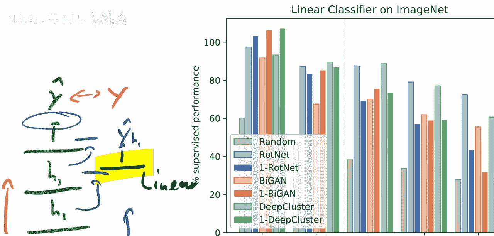

## 总结

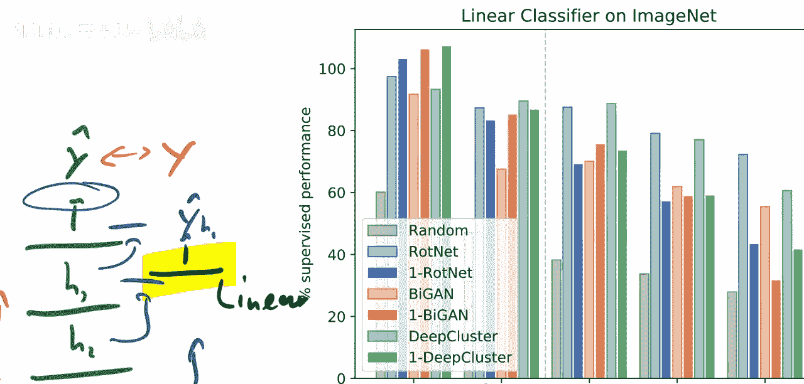

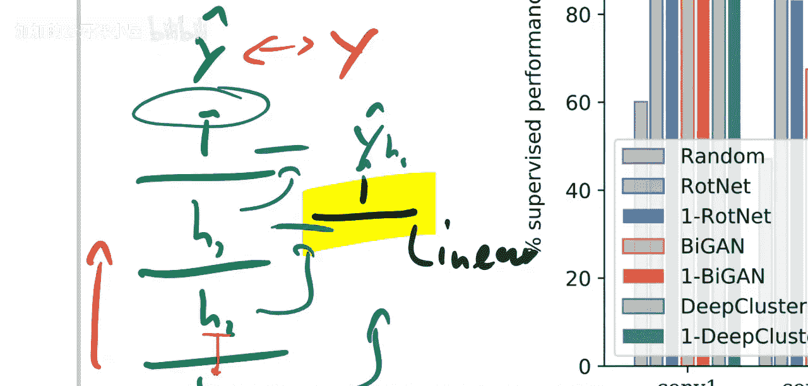

本节课中，我们一起学习了这篇关于自监督学习关键分析的论文。我们了解到，在强数据增强的帮助下，自监督方法能够从单张图像中有效学习卷积网络的低级特征。然而，对于网络更深层的高级特征，自监督学习即使使用海量无标签数据，其性能仍无法与有监督学习相比。论文采用线性探测作为主要评估方法，这一方法基于“表示越容易线性分类就越好”的假设，值得我们进一步思考和审视。