# 012：基于隐式梯度的元学习（IMAML）论文解析 🧠

在本节课中，我们将学习元学习（Meta-Learning）的基本概念，并深入解析一篇名为《基于隐式梯度的元学习》（IMAML）的论文。我们将探讨元学习如何帮助模型从少量数据中快速学习新任务，并理解其与迁移学习、多任务学习的区别。课程的核心将围绕如何使用梯度下降来优化元学习过程，并解释“隐式梯度”这一关键概念。

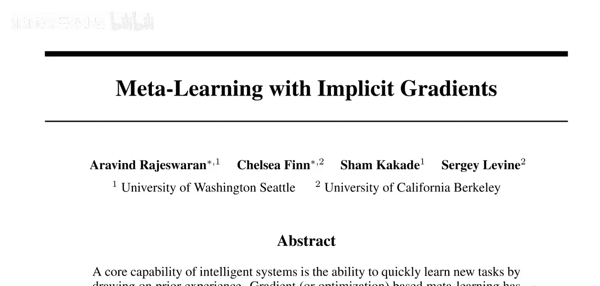

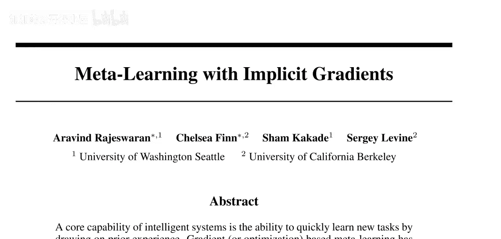

## 什么是元学习？ 🤔

上一节我们介绍了课程概述，本节中我们来看看元学习的基本定义。

元学习假设我们面对一个任务分布。以下是几个任务示例：
*   **任务一**：拥有一个包含猫和狗图像的小型数据集，目标是对它们进行分类。
*   **任务二**：拥有一个不同图像的小型数据集，目标是在图像中定位行人（目标检测）。
*   **任务三**：拥有另一个图像数据集，目标是对图像进行分割（例如，分割出地面）。

这些是独立的图像任务。每个任务的数据集可能非常小，例如在医疗图像领域，获取标注数据成本高昂。因此，直接在这样的小数据集上训练一个先进的模型是困难的。

## 相关方法：迁移学习与多任务学习 🔄

在深入元学习之前，我们先了解两种相关的学习方法：迁移学习和多任务学习。

### 迁移学习

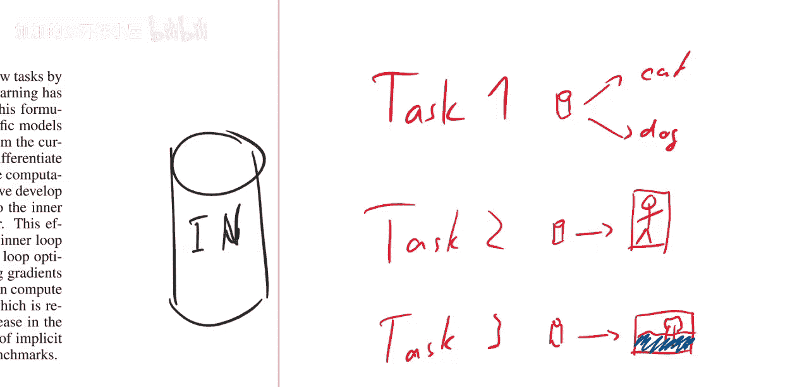

迁移学习的思路是：首先在一个大型数据集（例如ImageNet）上训练一个神经网络，获得一组参数 `θ`。这被称为**预训练阶段**。

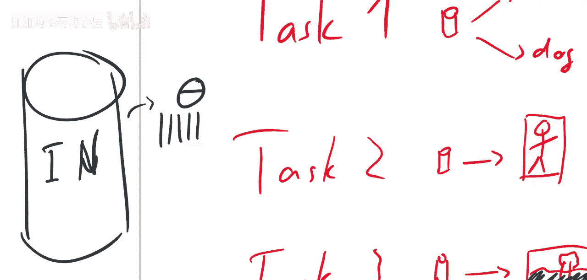

然后，对于每个新任务（如任务一），我们以这些预训练参数 `θ` 作为起点，使用该任务自己的小型训练集进行**微调**，得到任务特定的参数 `φ₁`。

这个过程可以概括为：**预训练 -> 针对每个任务独立微调**。其优势在于利用了大型数据集的通用知识。

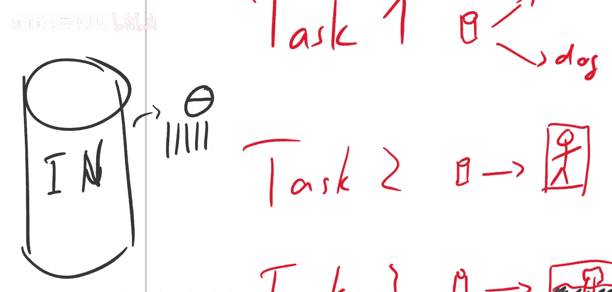

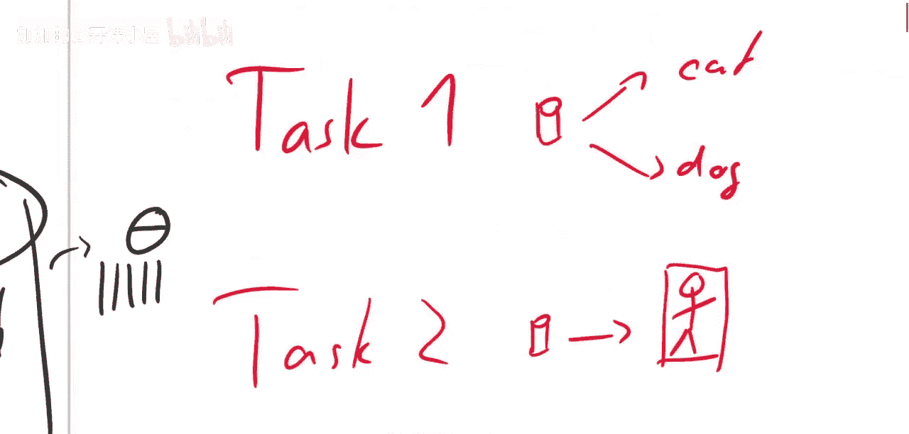

### 多任务学习

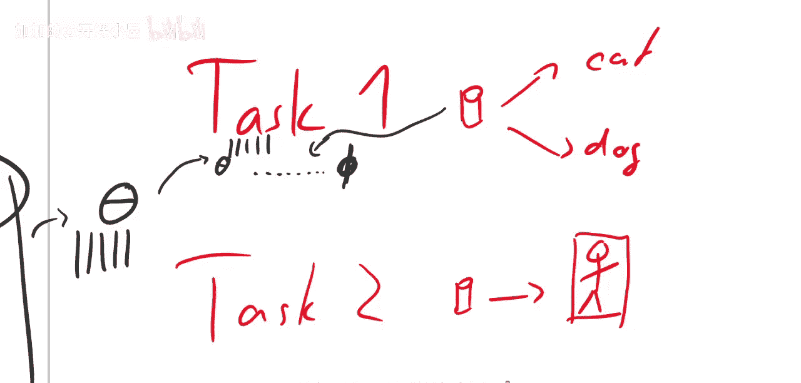

多任务学习采用不同的策略。它将多个任务的数据集合并，训练一个共享的神经网络主干（编码器），但为不同任务配备不同的输出头（例如分类头、检测头）。

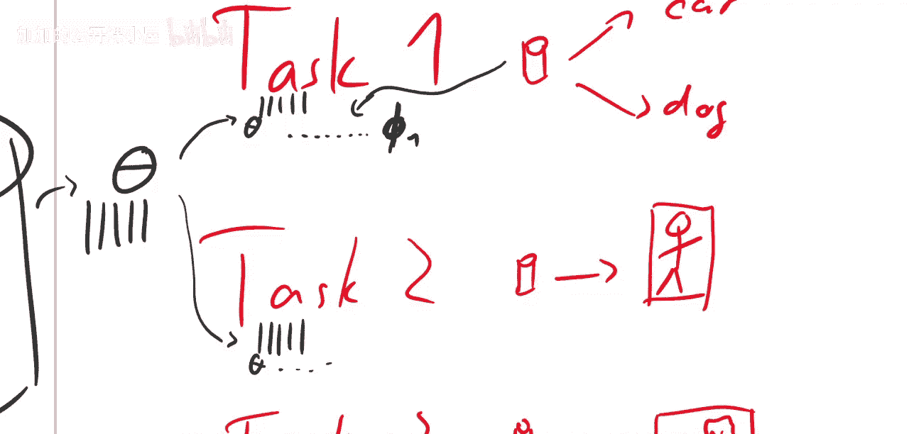

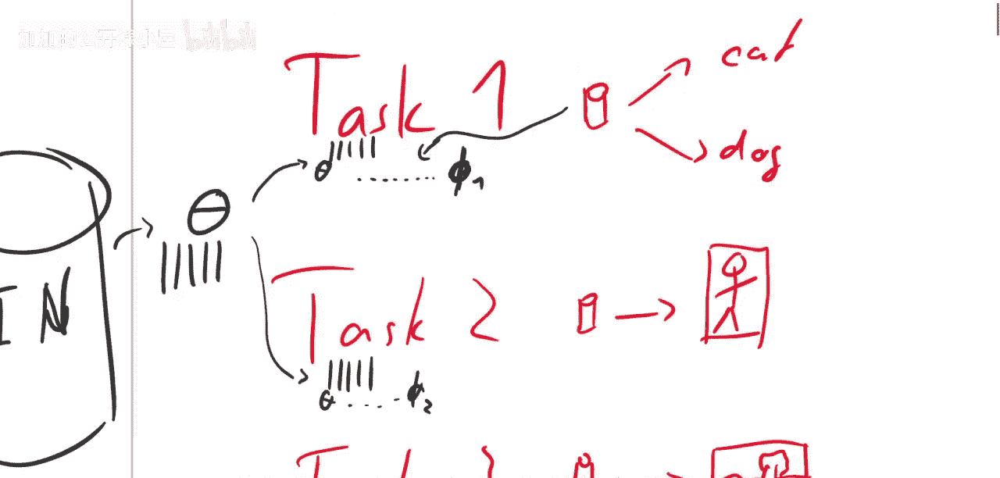

模型在训练时，根据输入图像所属的任务，使用相应的损失函数进行优化。这种方法依赖于一个假设：学习一个任务时获得的知识对另一个任务也有用。

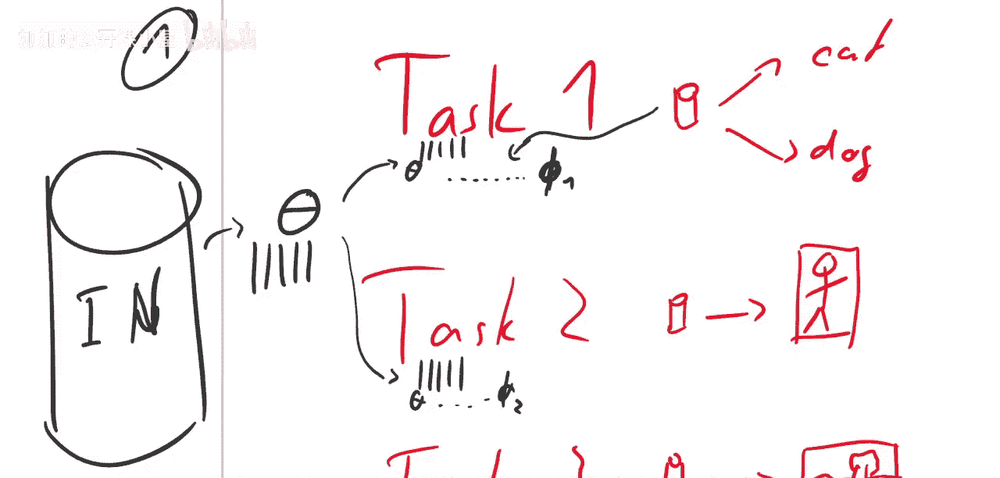

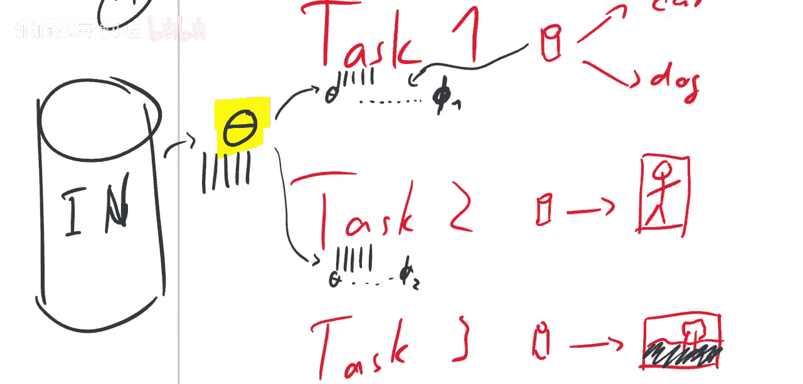

多任务学习能共享跨任务的信息，但其局限性在于，共享的编码器必须在所有任务间做出权衡，可能无法为任一任务达到最优性能，但可能带来正则化效果。

## 元学习的核心思想 🎯

上一节我们介绍了迁移学习和多任务学习，本节中我们来看看元学习有何不同。

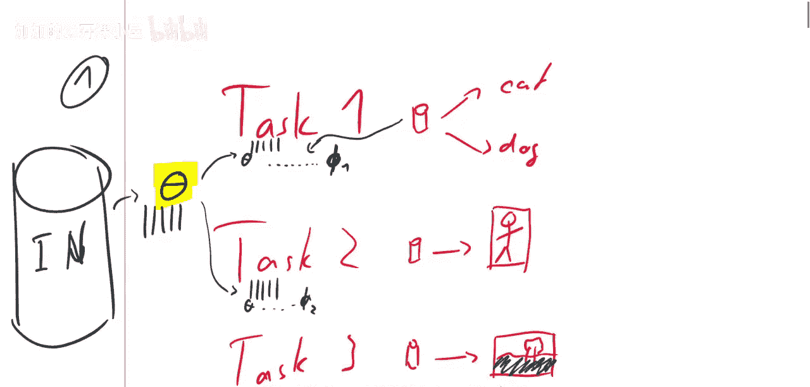

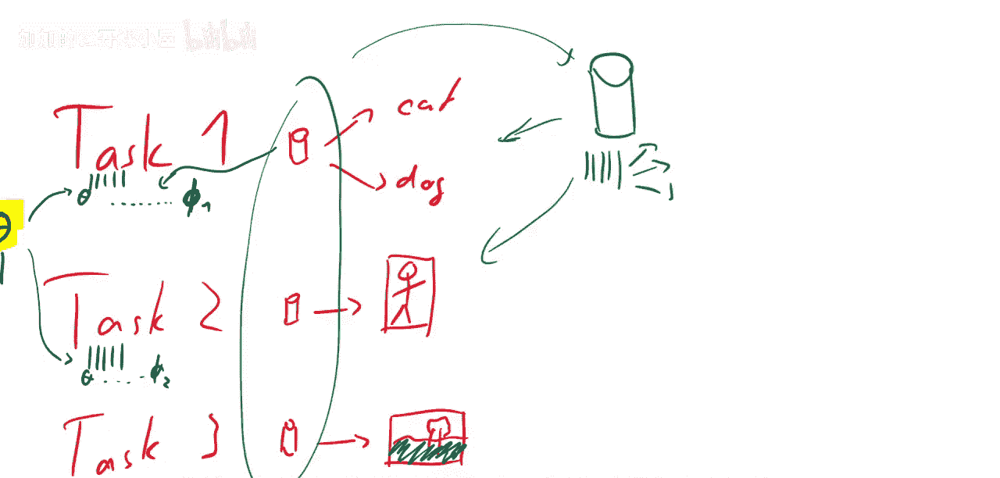

元学习更像是一种“学会学习”的方法。它提出一个问题：如果我们没有那个用于预训练的大型数据集怎么办？

元学习的目标是**学习如何获得一组优秀的初始参数**，使得面对一个全新的、只有少量数据的小任务时，模型能从这个初始点出发，通过极少的调整（几步梯度下降）就达到很好的性能。

其过程可以描述为：
1.  我们从一个初始参数猜测 `θ₀` 开始。
2.  将这个 `θ₀` 提供给多个元训练任务（例如任务一、二、三）。
3.  每个任务以 `θ₀` 为起点，在自己的小训练集上进行微调，得到自己的参数 `φᵢ`。
4.  每个任务在自己的验证集上评估 `φᵢ` 的性能，得到一个损失值（泛化误差）。
5.  收集所有任务的损失，我们就能评估这组初始参数 `θ₀` 的“好坏”——即它是否易于让不同任务快速适配。
6.  基于这个评估，我们通过某种方式更新初始参数，得到 `θ₁`，目标是使所有任务的平均适配性能更好。

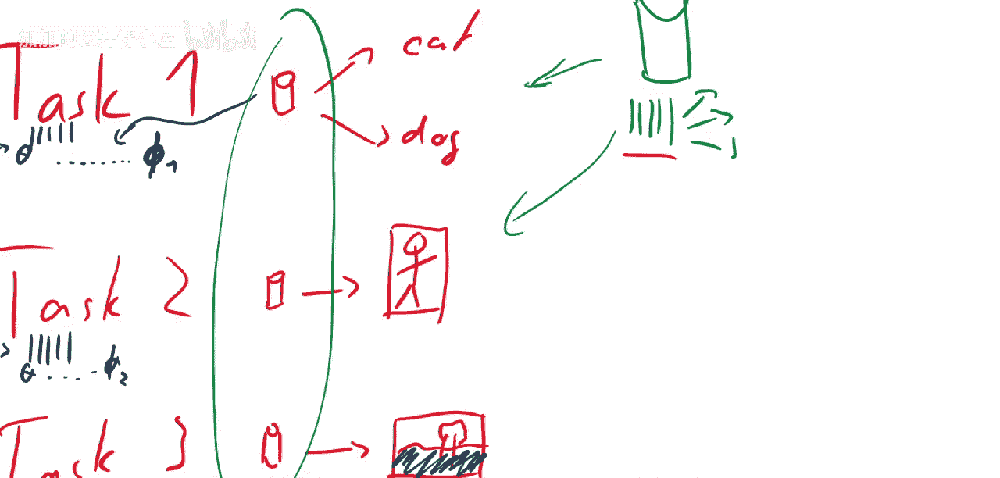

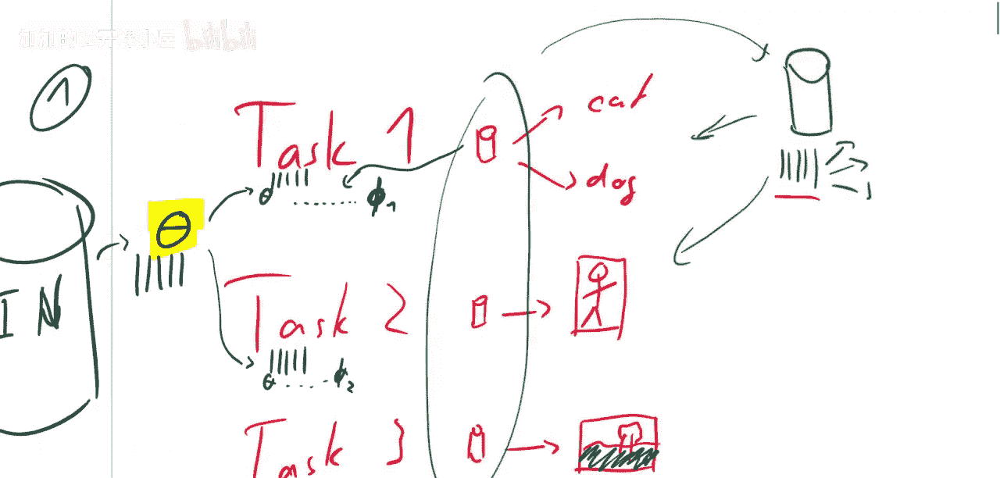

**元学习的最终目标**是学得一组初始参数 `θ*`，使得当遇到一个全新的、未见过的任务四时，从 `θ*` 开始微调，能比从零开始训练获得好得多的模型。

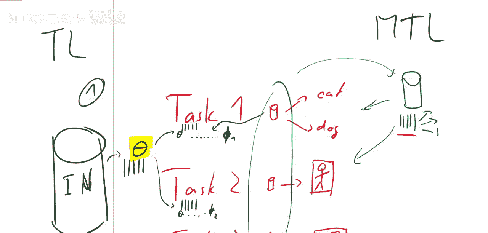

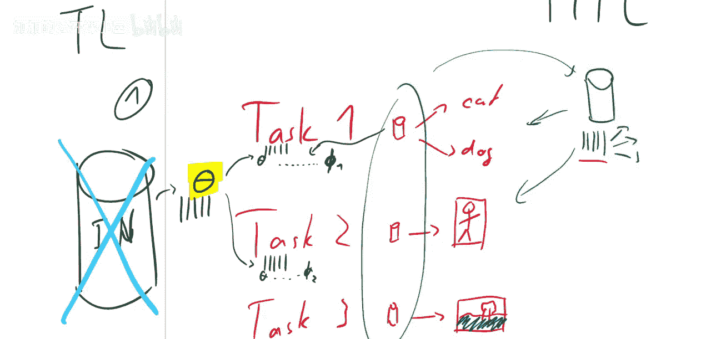

## 使用梯度下降进行元学习 📉

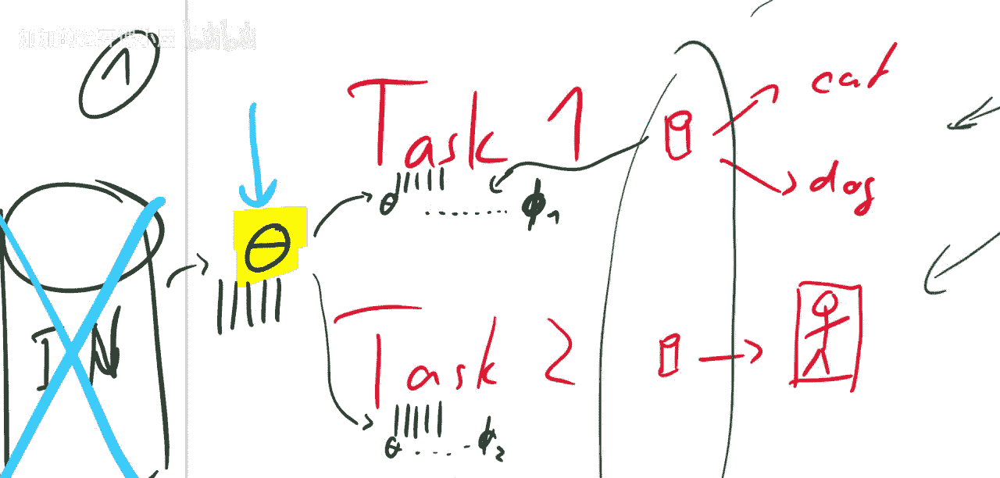

那么，如何迭代地生成越来越好的初始参数呢？最自然的方法是使用**梯度下降**。这也是本篇论文的核心。

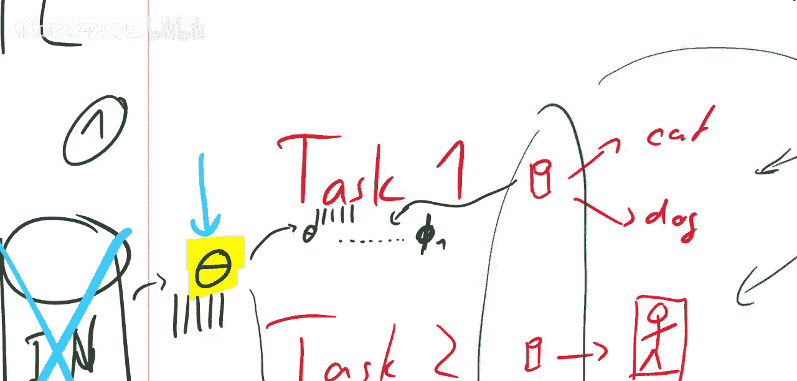

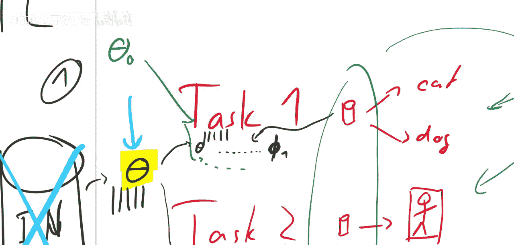

为了使用梯度下降从 `θ₀` 更新到 `θ₁`，我们需要计算元损失函数 `L(θ)` 关于参数 `θ` 的梯度。

**元损失函数 `L(θ)`** 通常是所有任务在各自验证集上损失的平均或总和。公式可以表示为：
`L(θ) = Σᵢ Lᵢ(φᵢ(θ))`
其中，`φᵢ(θ)` 表示任务 `i` 从初始参数 `θ` 开始，经过内部优化（如几步梯度下降）后得到的任务特定参数。

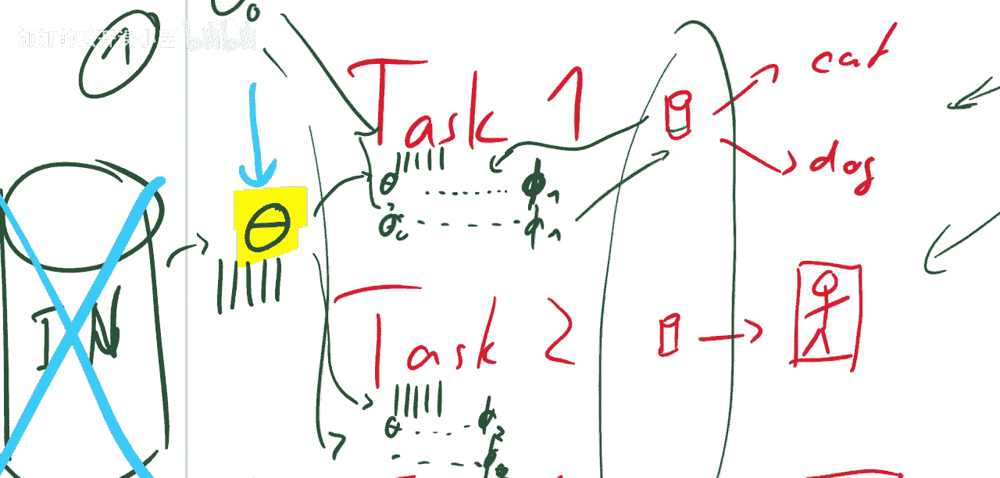

计算这个梯度 `∇L(θ)` 的挑战在于，`φᵢ(θ)` 本身是 `θ` 的一个函数（因为内部优化过程的起点是 `θ`）。这意味着我们需要通过内部优化过程进行反向传播，计算高阶导数，这在计算上可能非常昂贵。

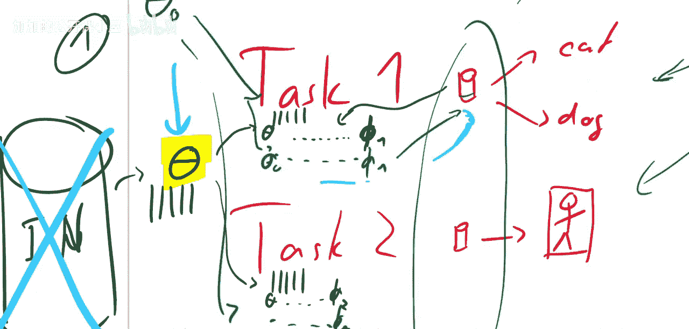

## 隐式梯度：IMAML的解决方案 💡

上一节我们指出了元学习梯度计算的计算挑战，本节中我们来看看IMAML论文提出的巧妙解决方案——**隐式梯度**。

IMAML（Implicit MAML）的核心思想是避免显式地通过内部优化过程进行反向传播。它利用了**隐函数定理**。

思路如下：当每个任务完成其内部优化后，其最优参数 `φᵢ*` 应满足一个条件：任务内部训练损失 `Lᵢ_train(φ)` 在 `φᵢ*` 处的梯度为零（或接近零）。即：
`∇Lᵢ_train(φᵢ*) ≈ 0`

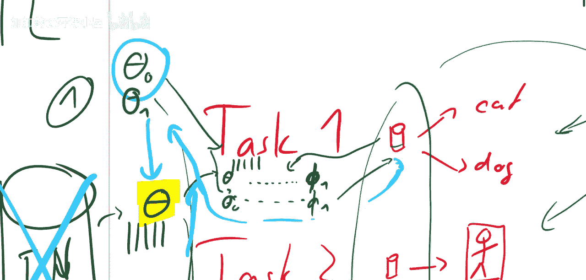

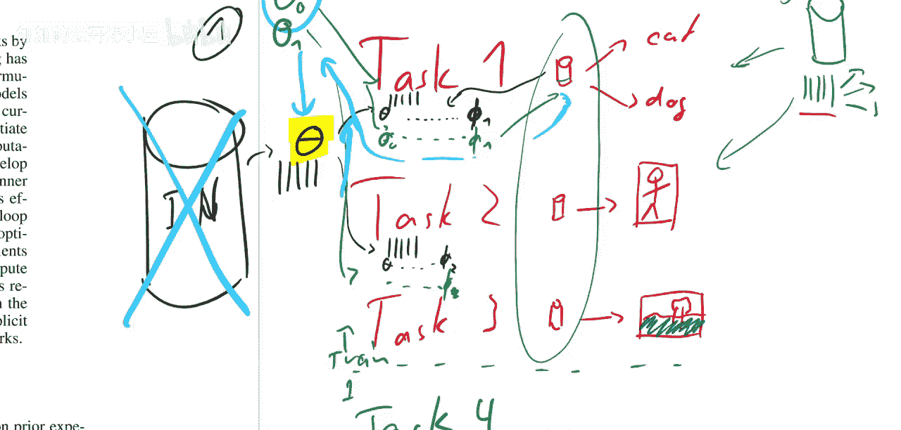

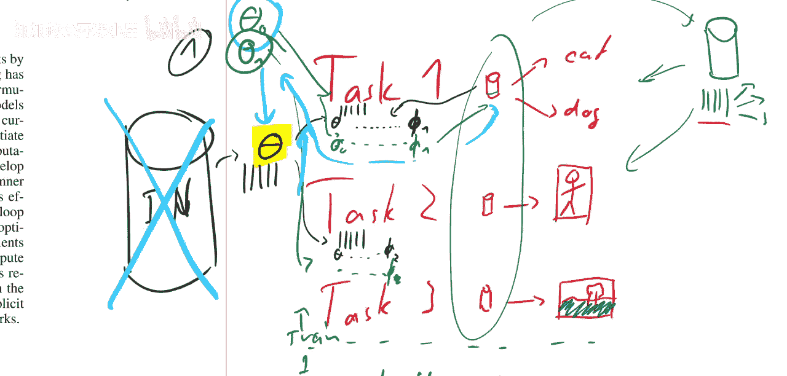

这个条件定义了一个**隐式关系**：`φᵢ*` 是 `θ` 的函数。利用隐函数定理，我们可以直接计算元梯度 `∂L/∂θ`，而无需展开和反向传播内部优化步骤的计算图。

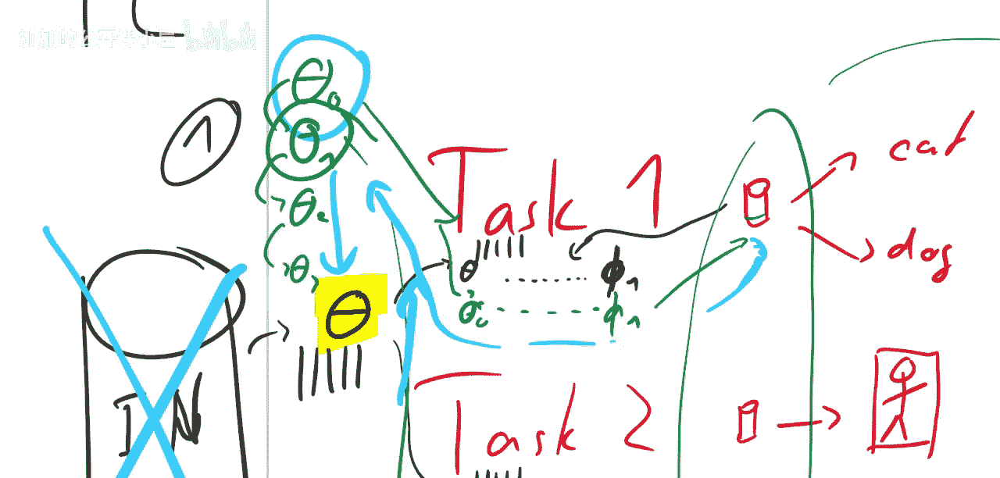

**IMAML的更新步骤**简化描述如下：
1.  对于每个任务 `i`，从当前元参数 `θ` 开始，运行内部优化器（如梯度下降）直到收敛或固定步数，得到 `φᵢ*`。
2.  计算每个任务在验证集上的损失 `Lᵢ_val(φᵢ*)`。
3.  利用隐函数定理给出的公式，直接计算 `φᵢ*` 关于 `θ` 的梯度（隐式梯度）。
4.  聚合所有任务的隐式梯度，更新元参数 `θ`。

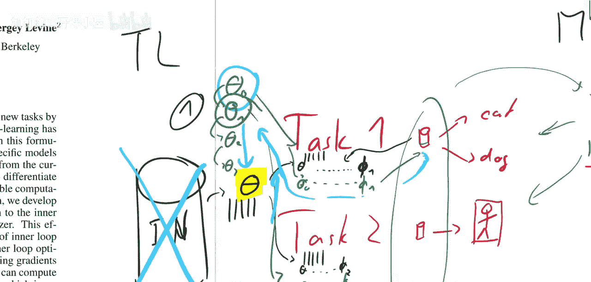

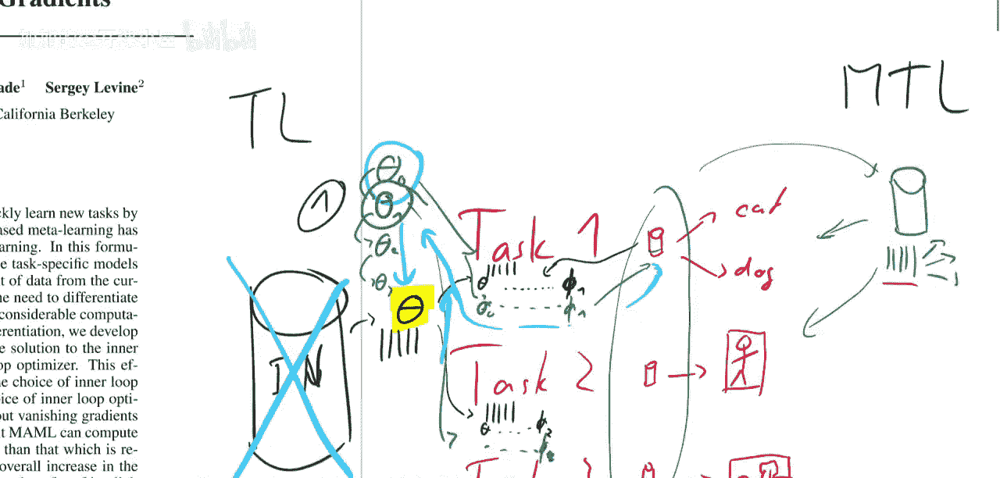

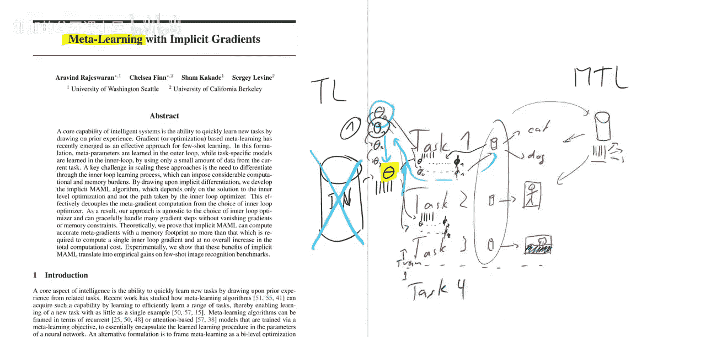

这种方法在计算和内存效率上通常优于需要计算高阶导数的显式方法（如MAML）。

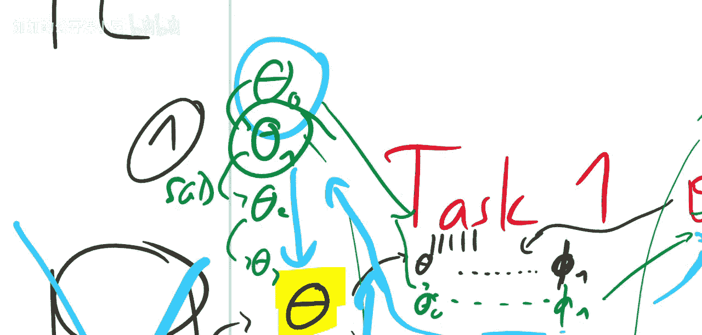

## 总结 📚

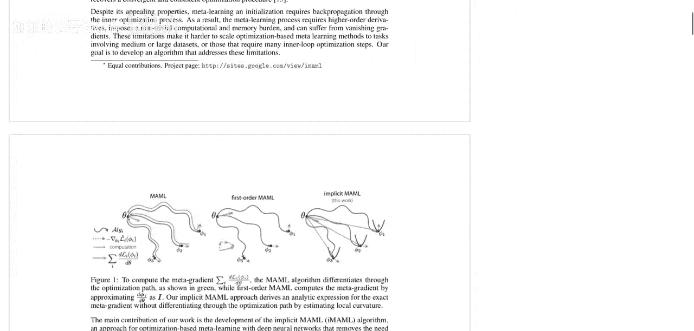

本节课中我们一起学习了元学习的基本框架和IMAML论文的核心贡献。

我们首先了解了元学习旨在让模型“学会学习”，即获得一组能快速适配新任务的初始参数。然后，我们对比了迁移学习和多任务学习这两种相关但不同的范式。

课程的重点是理解使用梯度下降进行元学习时面临的计算挑战：需要计算通过内部优化过程的高阶梯度。IMAML论文通过引入**隐式梯度**，利用隐函数定理绕开了这一复杂计算，提供了一种更高效的元学习优化方法。

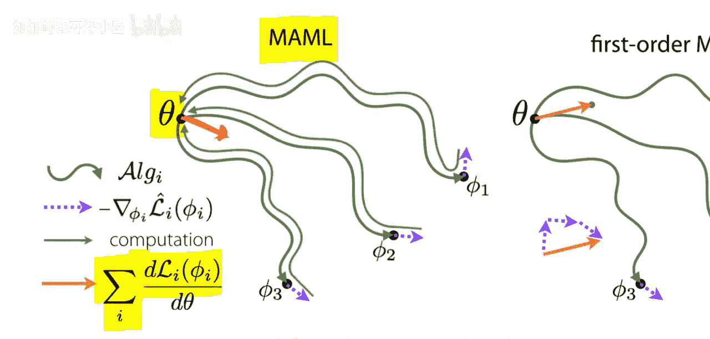

总而言之，IMAML为基于优化的元学习提供了一种理论上优雅、实践上高效的梯度计算方案，使得模型能够更好地从少量样本中快速学习新任务。