# 021：论文解读

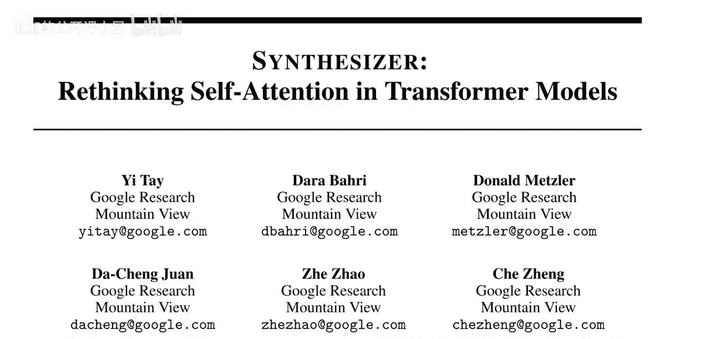

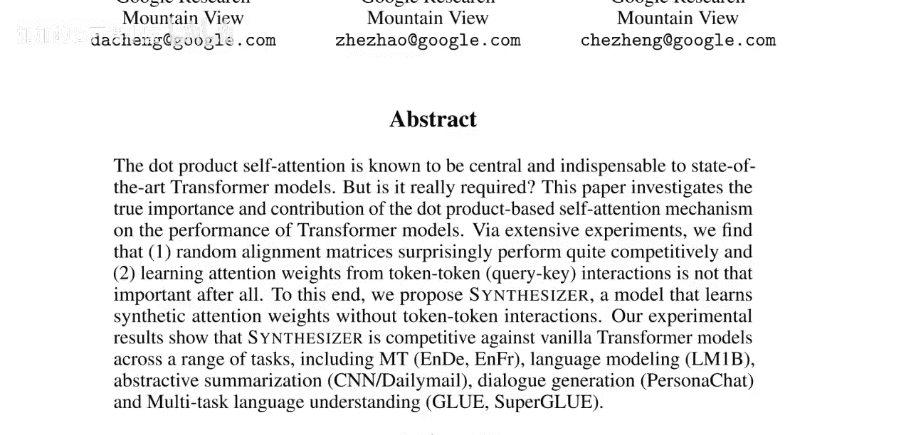

在本节课中，我们将要学习一篇名为《合成器：重新思考Transformer模型中的自注意力机制》的论文。这篇论文由谷歌研究院的团队撰写，其核心思想是尝试用学习到的注意力权重来替代Transformer中基于点积的自注意力机制，从而消除昂贵的点积计算。我们将深入探讨其动机、方法以及实验结果。

## 概述与动机

Transformer模型中的点积自注意力机制被认为是其取得顶尖性能的核心与不可或缺的部分。该机制通过计算查询向量和键向量的点积，来决定序列中不同位置信息的路由方式。

然而，论文作者提出了一个大胆的问题：这种基于词元间交互的点积注意力机制真的是必需的吗？他们通过大量实验发现，即使是随机生成的注意力对齐矩阵，其表现也出人意料地具有竞争力。此外，学习基于词元间交互的注意力权重似乎并没有想象中那么重要。

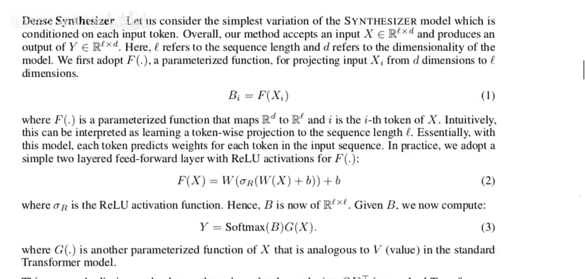

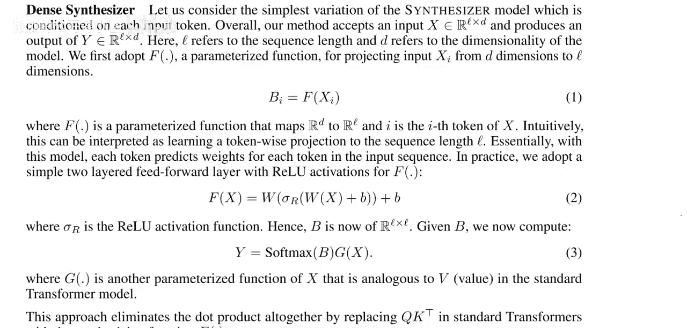

基于这些观察，作者提出了名为“合成器”的新模型。该模型学习合成的注意力权重，而无需依赖词元间的交互。实验结果表明，合成器在一系列任务上，其性能可与标准的Transformer模型相媲美。

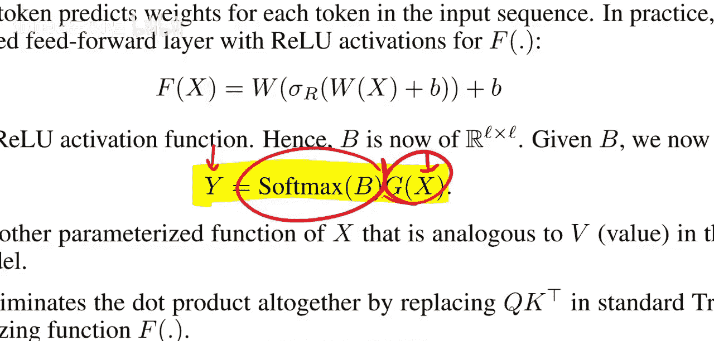

## 传统Transformer的自注意力机制

上一节我们介绍了论文的动机，本节中我们来看看传统的Transformer是如何工作的。理解这一点对于把握合成器的创新至关重要。

在Transformer的每一层中，输入是一个序列 **X**，目标是输出另一个序列 **Y**。其核心操作是信息的路由：每个词元都需要从序列的其他部分获取信息，以更好地理解自身及其上下文。

这个过程通过自注意力机制实现。具体来说，每个输入词元会生成三个向量：
*   **查询向量**：表示该词元“想要”从其他词元获取什么样的信息。
*   **键向量**：表示该词元“拥有”什么样的信息，可供其他词元查询。
*   **值向量**：表示该词元实际要传递给其他词元的信息内容。

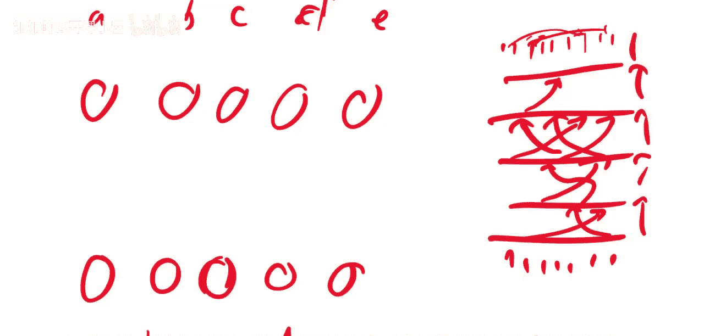


注意力权重矩阵 **A** 通过计算所有查询向量与所有键向量的点积并经过Softmax归一化得到：
```python
# 伪代码表示点积注意力
A = softmax(Q * K^T / sqrt(d_k))
```
其中，**Q** 是查询矩阵，**K** 是键矩阵，`d_k` 是向量的维度。这个矩阵 **A** 决定了每个输出位置应该从哪些输入位置聚合信息。最终输出 **Y** 是注意力权重矩阵 **A** 与值矩阵 **V** 的乘积：
```python
Y = A * V
```
这种机制允许模型动态地关注输入序列的不同部分。例如，在处理句子“Sarah went to the park. She enjoyed the sunshine.”时，代词“She”的查询向量可能会与名词“Sarah”的键向量有较高的点积分数，从而将“Sarah”的信息路由给“She”，帮助模型理解指代关系。

然而，计算所有查询和键之间的点积具有 **O(n²)** 的复杂度（n为序列长度），当序列较长时计算成本很高。

## 合成器模型：一种新思路

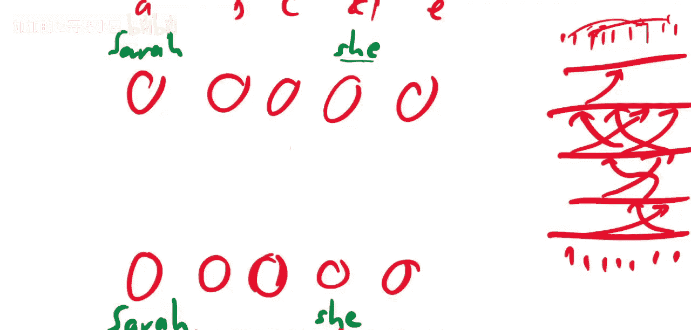

了解了传统方法的计算瓶颈后，本节中我们来看看合成器模型提出的创新方案。它旨在绕过昂贵的点积计算。

合成器模型的核心思想是：**直接学习或生成注意力权重矩阵 A，而无需通过查询和键的点积来计算**。这意味着完全移除了词元间的交互计算。

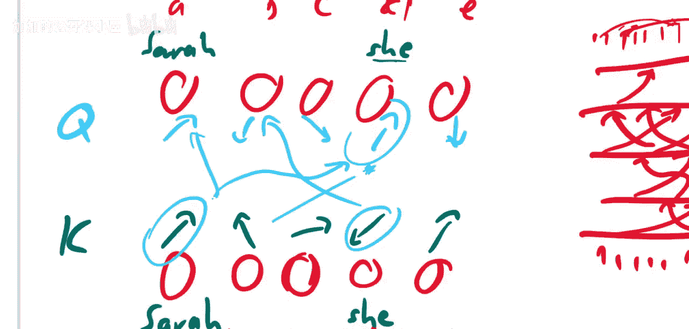

论文主要提出了两种合成器变体：

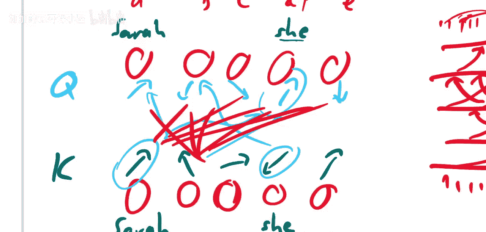

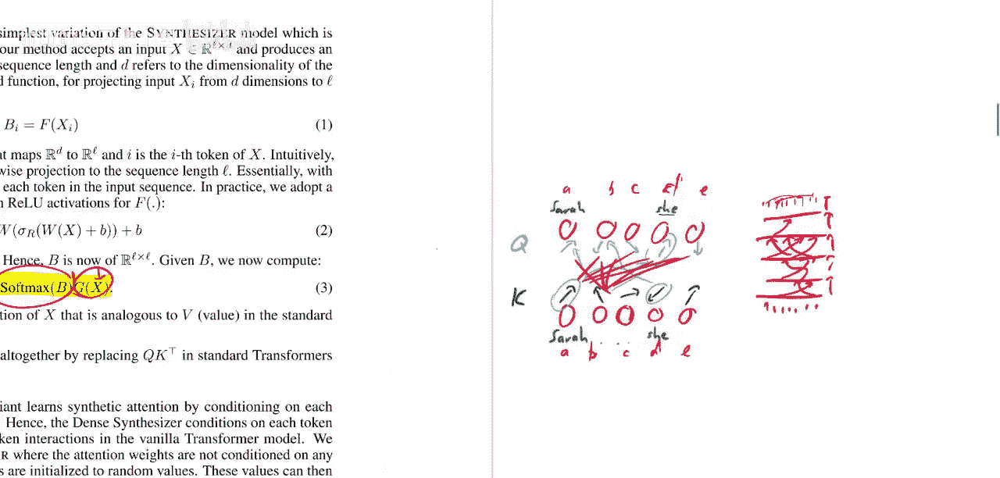

**1. 密集合成器**
在密集合成器中，每个词元独立地生成一个向量，这个向量经过变换后直接成为注意力矩阵 **A** 中的一行。具体来说，对于序列中的第 *i* 个位置，模型通过一个可学习的函数 **F**（如线性变换后接非线性激活）直接生成一个长度为 *n*（序列长度）的向量：
```python
# 伪代码表示密集合成器生成注意力权重
A[i, :] = softmax(F(X[i]))
```
这里，**F** 仅依赖于当前词元 **X[i]** 本身，而不考虑其他任何词元 **X[j]**。生成的向量经过Softmax归一化，表示当前词元要从序列所有位置获取信息的权重分布。

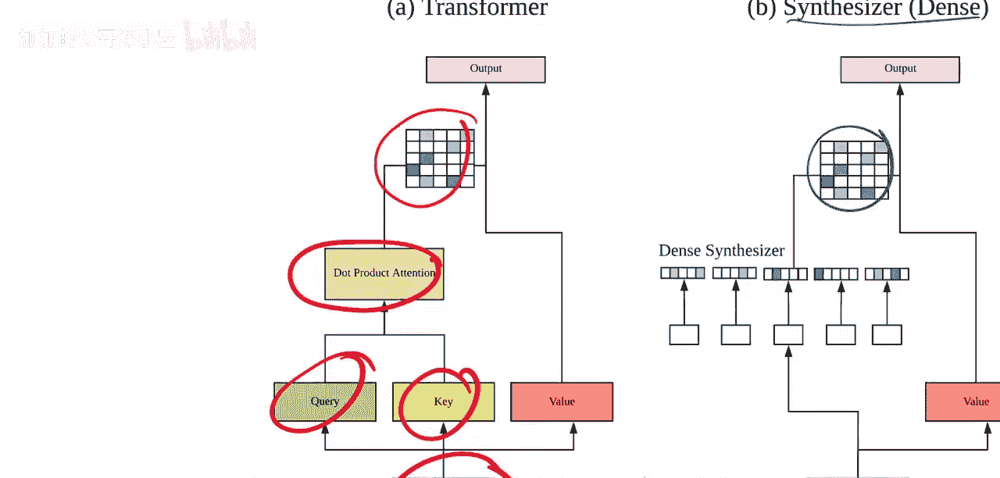

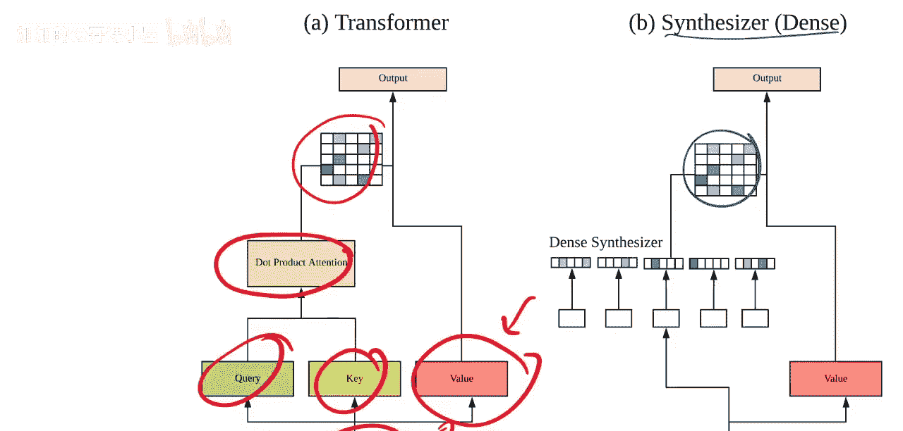

**2. 随机合成器**
随机合成器则更为激进。它使用一个**随机初始化且在所有层和训练步骤中保持固定**的矩阵 **R** 作为注意力权重矩阵的基础。这个随机矩阵可以通过一个可学习的缩放参数进行调整，并同样经过Softmax归一化：
```python
# 伪代码表示随机合成器
A = softmax(R)  # R 是一个随机初始化且固定的矩阵
```
这种方法完全移除了注意力权重对输入数据的依赖性，其性能表现是论文的一个重要发现。

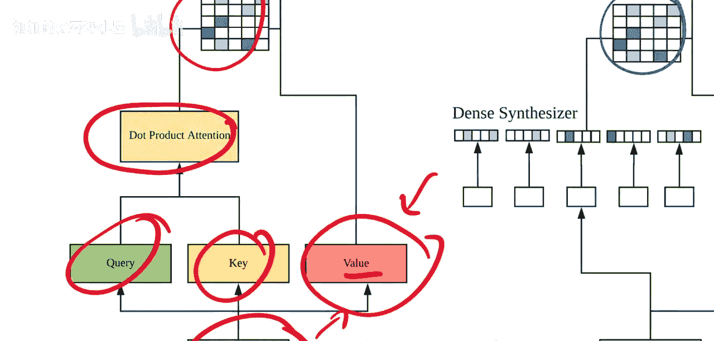

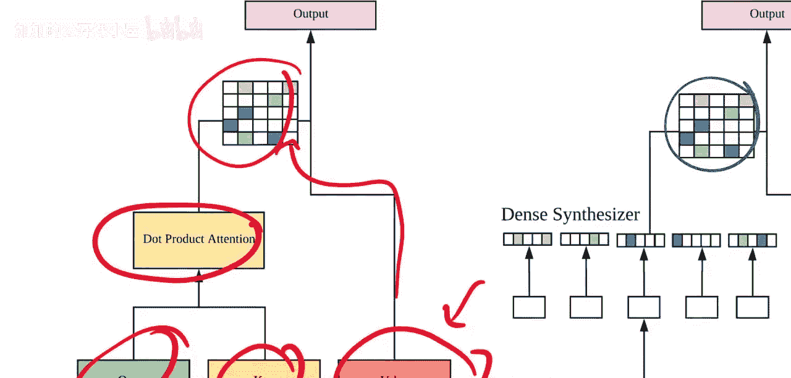

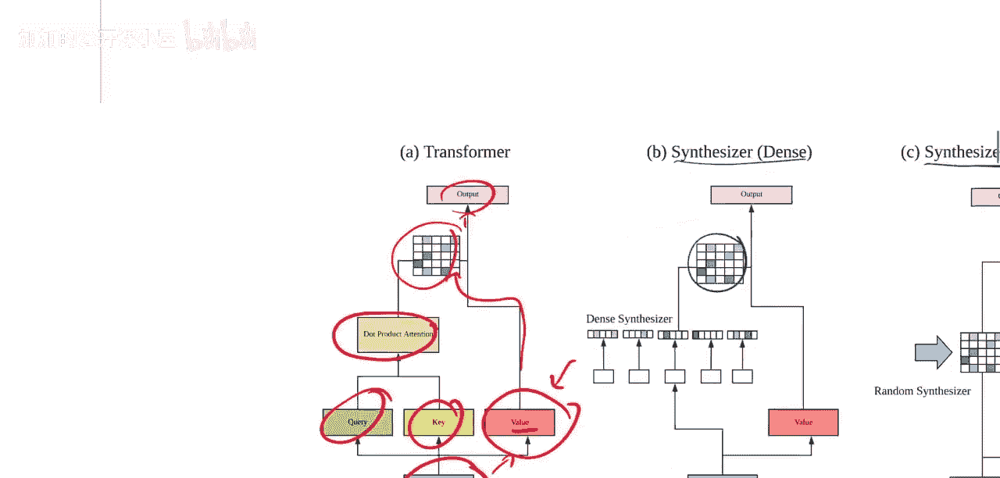

## 模型架构对比与总结

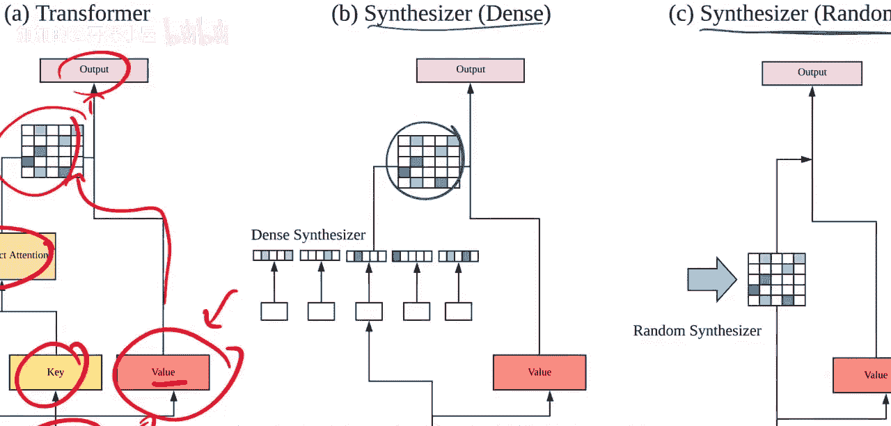

以下是传统Transformer与合成器模型在注意力权重生成方式上的直观对比：

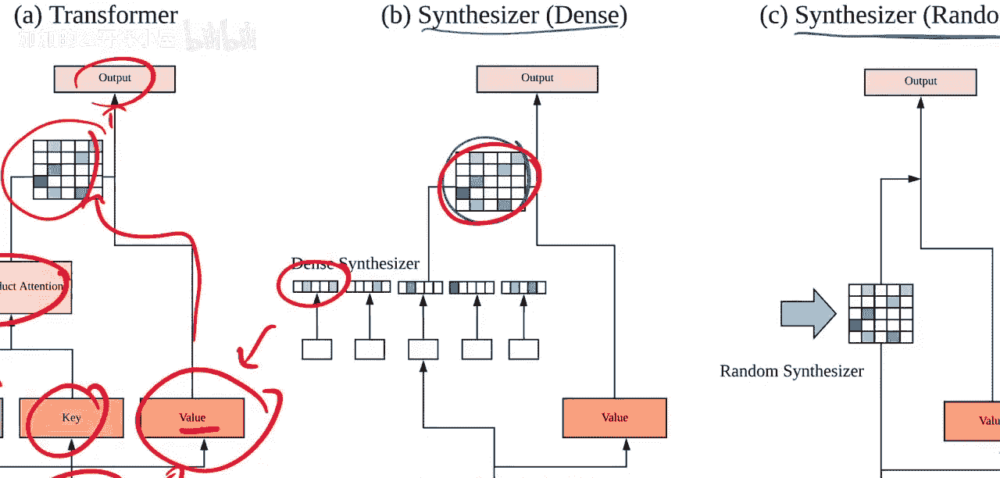

*   **传统Transformer**：`A = softmax( Q * K^T )`，其中 Q、K 由输入 X 经线性变换得到。需要词元间两两点积。
*   **密集合成器**：`A[i, :] = softmax( F(X[i]) )`，其中 F 是前馈网络。仅依赖当前词元。
*   **随机合成器**：`A = softmax( R )`，其中 R 是随机固定矩阵。与输入无关。

合成器模型移除了点积操作，降低了计算复杂度，并挑战了“词元间交互对于学习有效注意力模式至关重要”的固有观念。实验表明，尤其是在一些自然语言理解任务中，合成器模型能够达到与标准Transformer相近的性能，这提示我们Transformer的成功可能更多地依赖于其整体架构（如前馈网络、残差连接、层归一化），而自注意力机制的具体实现形式可能有更大的探索空间。

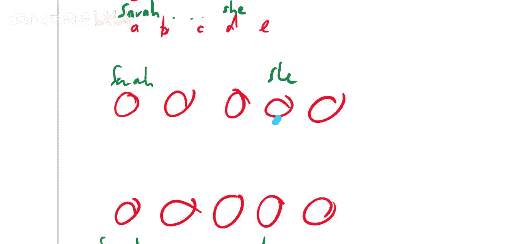

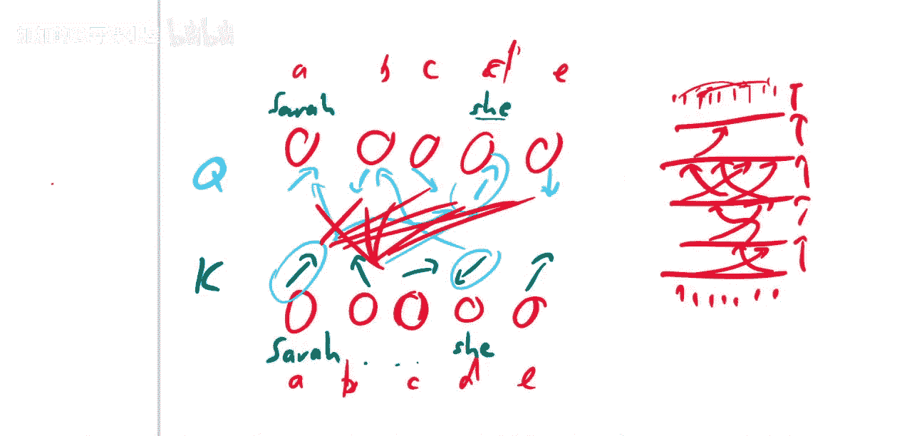

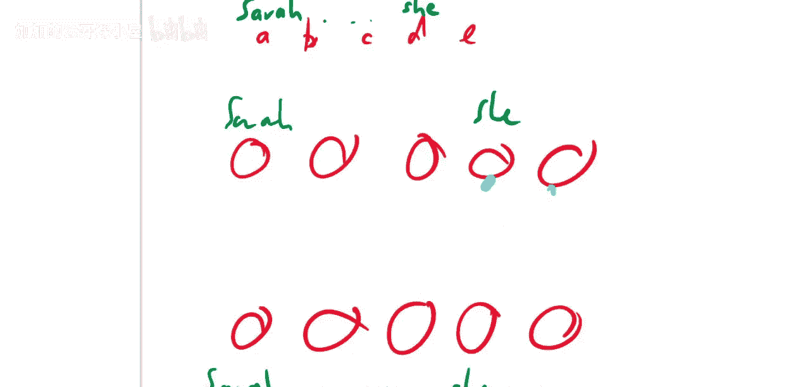

本节课中我们一起学习了《合成器：重新思考Transformer模型中的自注意力机制》这篇论文。我们回顾了传统Transformer点积注意力的工作原理及其计算成本，然后重点探讨了合成器模型如何通过直接学习或使用固定的注意力权重矩阵来替代点积计算。论文的实验结果表明，这种看似简单的注意力机制在某些情况下依然有效，这为Transformer架构的设计提供了新的思路，并促使我们重新思考自注意力机制的本质作用。