# 024：论文解读 🧠

在本节课中，我们将学习一篇名为《Learning to Classify Images Without Labels》的论文。这篇论文提出了一种无需人工标注标签，即可对图像进行自动分类的方法。我们将深入探讨其核心的三步流程，并理解其背后的原理。

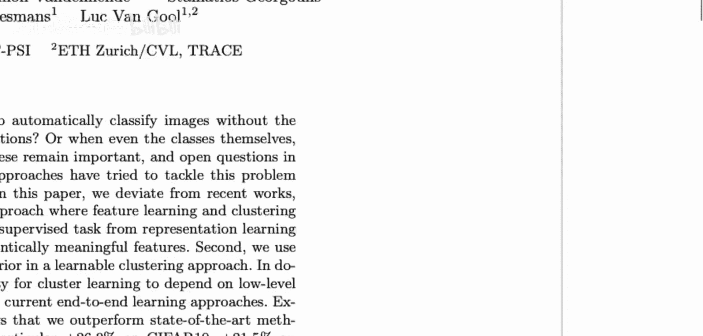

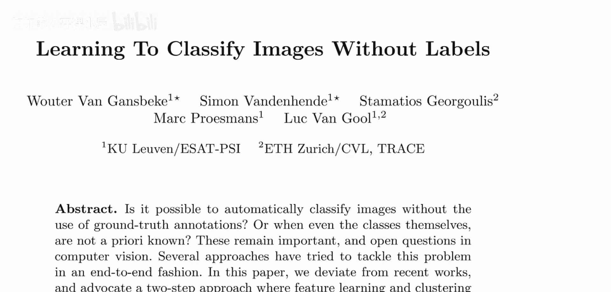

## 概述

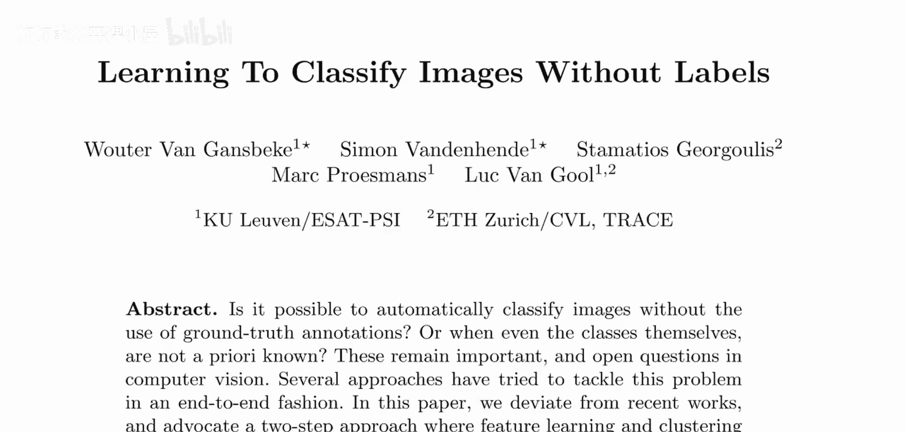

论文的核心问题是：能否在不使用真实标注标签，甚至在不预先知道类别的情况下，自动对图像进行分类？这听起来似乎有些不可思议，但论文通过一个三步流程实现了这一目标。

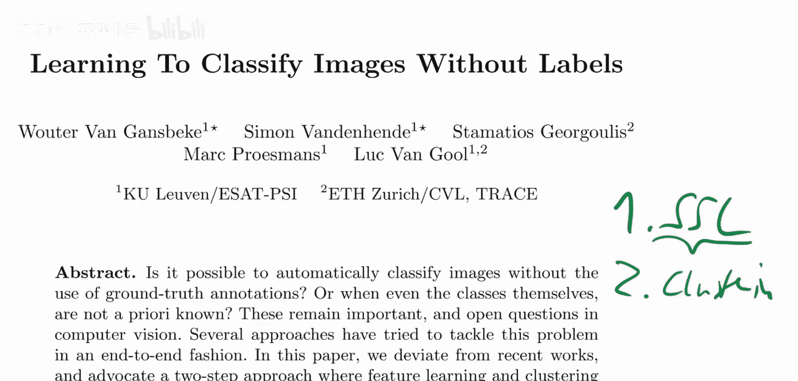

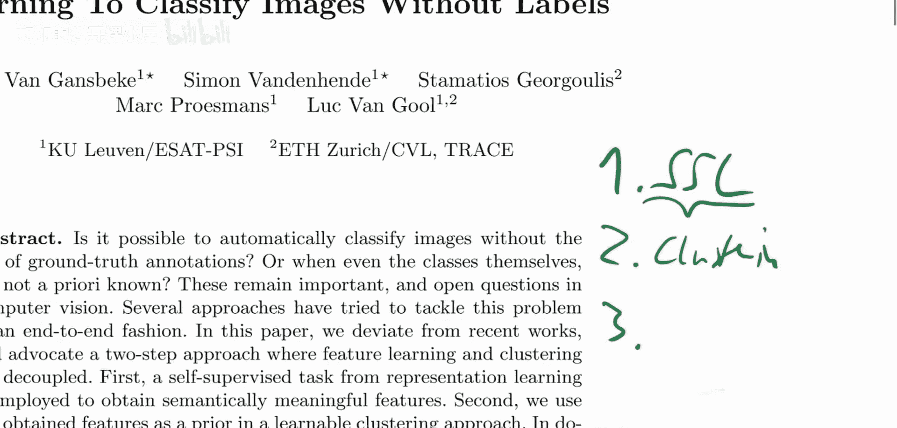

## 问题定义与评估方式

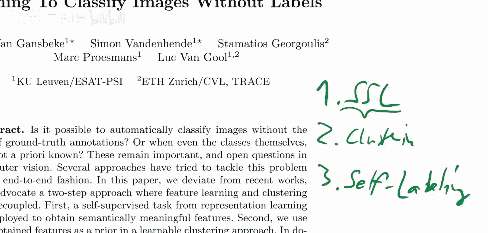

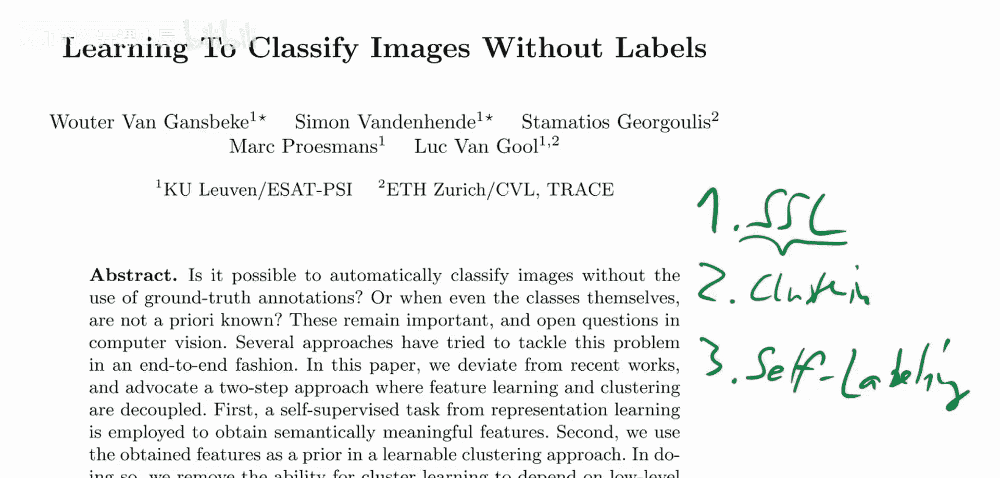

在深入方法之前，我们需要明确如何评估一个无监督分类算法的好坏。假设我们有一个数据集，其真实类别是未知的。我们的算法会生成一个聚类结果，将数据点分配到不同的簇中。

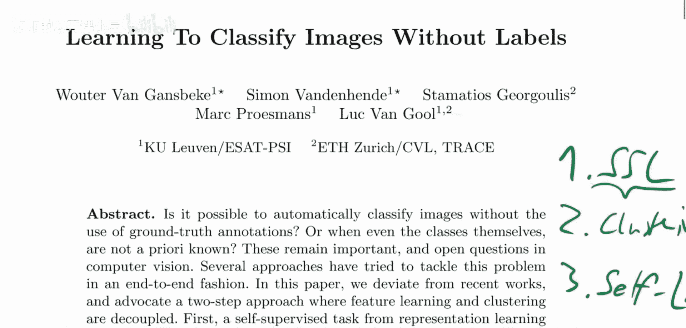

为了评估，我们采用一种“最宽容”的映射方式：将算法生成的每个簇，与真实标签的类别进行最优的一一匹配。然后计算在这种最优匹配下的分类准确率。因此，我们的目标是开发一种算法，使其聚类结果的分区方式尽可能接近真实的数据类别划分。

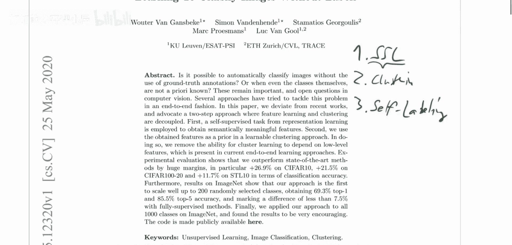

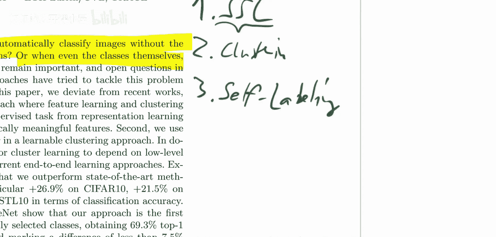

## 三步流程总览

论文提出的方法包含三个主要步骤：
1.  **表征学习**：通过自监督学习获取图像的良好特征表示。
2.  **聚类**：在得到的特征表示上进行一种特殊的聚类。
3.  **自标注精炼**：通过自我标注对聚类结果进行优化和精炼。

接下来，我们将逐一详细解析这三个步骤。

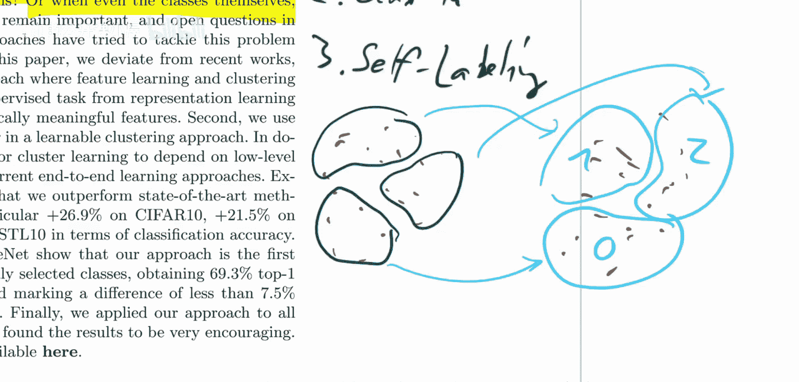

## 第一步：表征学习（自监督学习）

为什么需要单独的表征学习步骤？传统的一些方法（如Deep Cluster）尝试交替进行特征学习和聚类。但这存在一个问题：算法很容易陷入对低级特征（如图像特定位置的像素颜色）的依赖。一旦初始时因巧合将具有相似低级特征的图像聚在一起，后续迭代会强化这种倾向，导致无法学习到与高级语义任务（如图像分类）相关的特征。

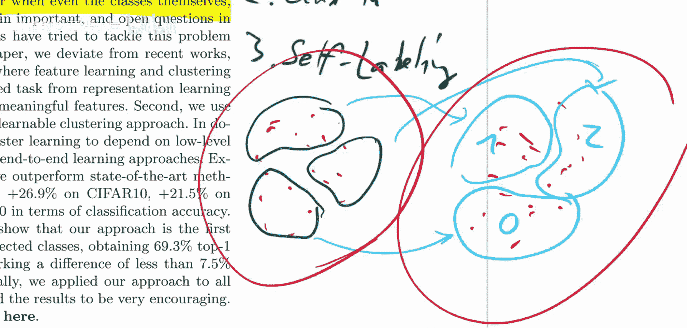

为了解决这个问题，论文将特征学习与聚类**解耦**。首先，使用**自监督学习**来获取高质量的特征表示，而不涉及任何聚类目标。

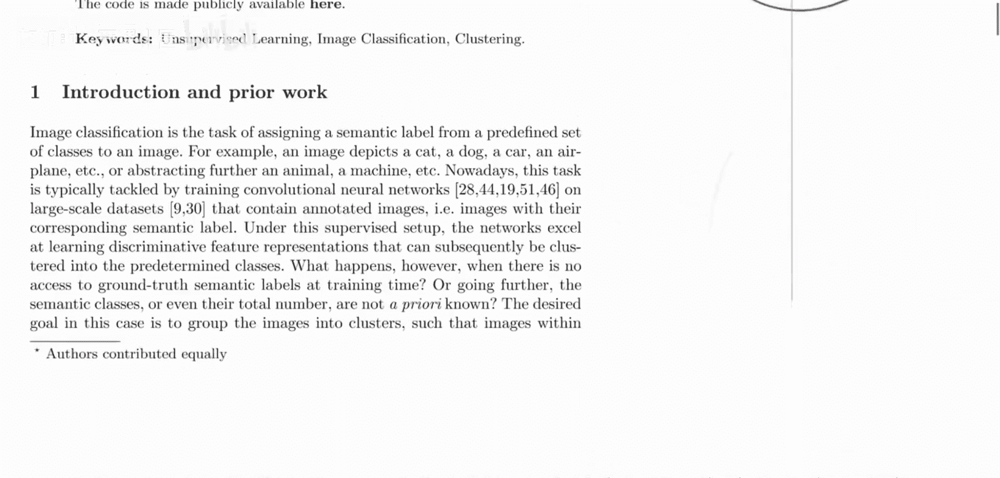

自监督学习是如何工作的呢？其核心思想是：对同一张图像应用不同的数据增强变换（例如随机裁剪、颜色抖动等），生成两个不同的视图。然后训练一个神经网络，使得这两个增强视图在特征空间中的表示尽可能相似，而与其他图像的表示尽可能不同。

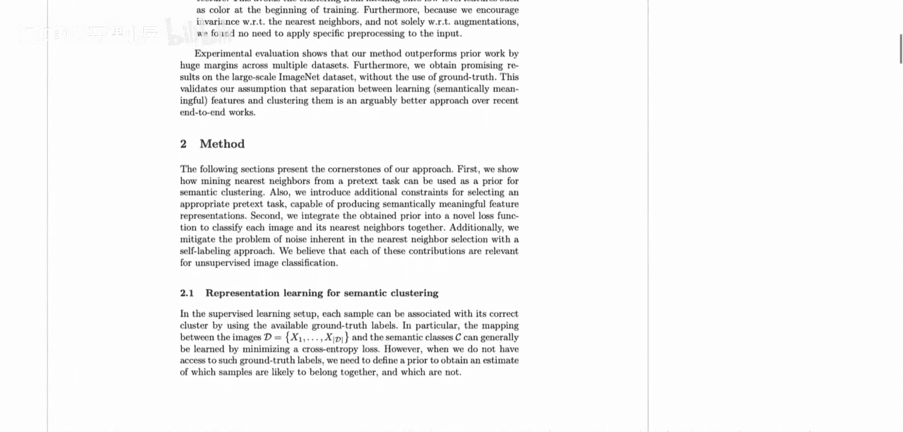

用公式表示，对于一个图像 `x`，我们生成两个增强视图 `v = T(x)` 和 `v‘ = T’(x)`。网络 `f(·)` 将它们映射为特征向量。训练目标是最大化 `v` 和 `v‘` 之间的相似性（如余弦相似度），同时最小化它们与批次中其他图像特征的相似性。这通常通过类似对比损失（如InfoNCE损失）来实现：

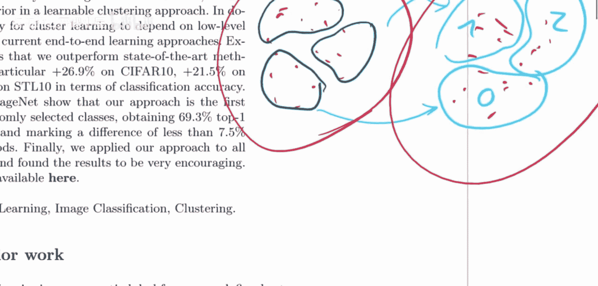

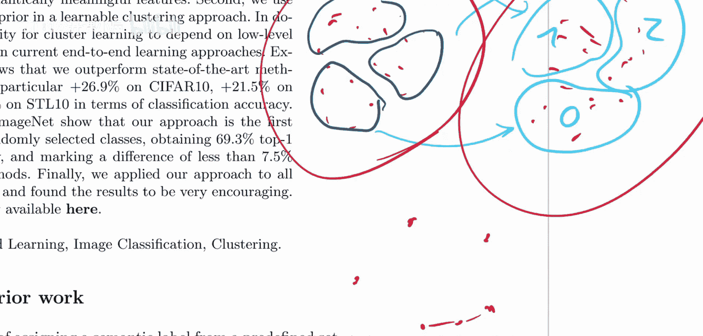

`L = -log[exp(sim(f(v), f(v‘)) / τ) / Σ_{k} exp(sim(f(v), f(v_k)) / τ)]`

其中，`sim` 是相似度函数，`τ` 是温度参数，分母求和包括正样本对和批次内的负样本。

通过这种方式训练出的网络 `f`，能够提取对语义内容敏感、对无关变换鲁棒的特征，为后续聚类奠定了良好基础。

## 第二步：聚类

在获得所有图像的特征表示后，下一步是在这个特征空间中进行聚类。论文没有使用标准的K-Means等算法，而是采用了一种基于**最近邻**的聚类方法，具体步骤如下：

以下是聚类步骤的关键操作：
1.  对每个数据点的特征，计算其在整个数据集中的最近邻。
2.  构建一个相似度图，其中节点是数据点，如果两个点互为最近邻，则在它们之间连接一条边。
3.  在这个图上识别连通分量。每个连通分量形成一个初始的簇。
4.  由于直接最近邻可能产生许多非常小的簇，论文随后会合并一些相似的簇。

这种方法比直接进行K-Means聚类更灵活，因为它不强制指定簇的数量，并且能更好地适应特征空间的几何结构。

## 第三步：自标注精炼

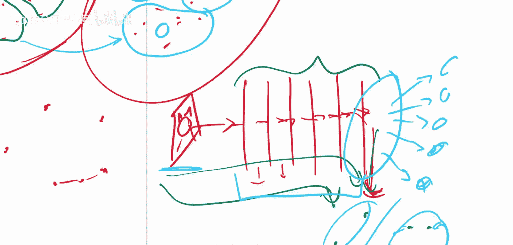

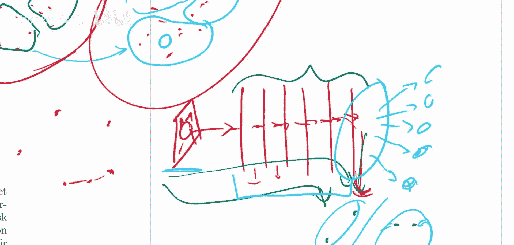

经过前两步，我们得到了初始的聚类结果。第三步的目标是**精炼**这些聚类，并最终训练一个可以用于推理的分类器。

精炼过程通过“自标注”实现。具体来说：
1.  利用当前聚类结果，为每个簇分配一个伪标签。
2.  使用这些伪标签和对应的图像，以**监督学习**的方式训练一个新的神经网络分类器。
3.  用这个新训练的分类器对所有图像重新进行预测，生成新的伪标签。
4.  重复步骤2和3若干次，进行迭代精炼。

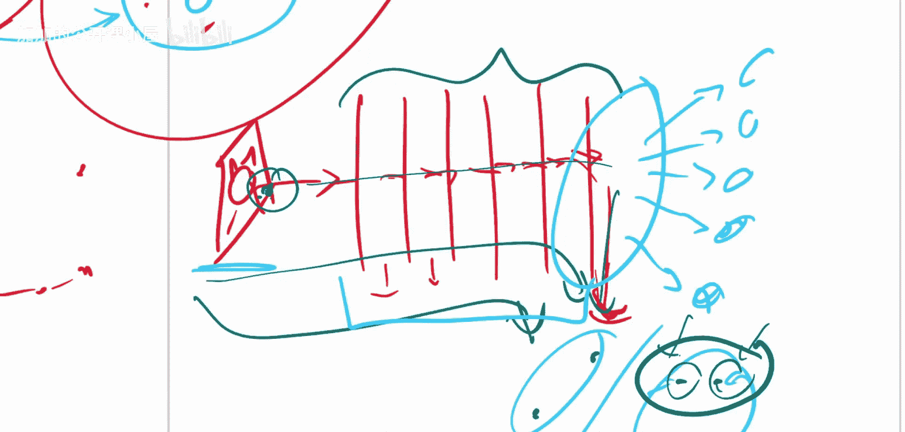

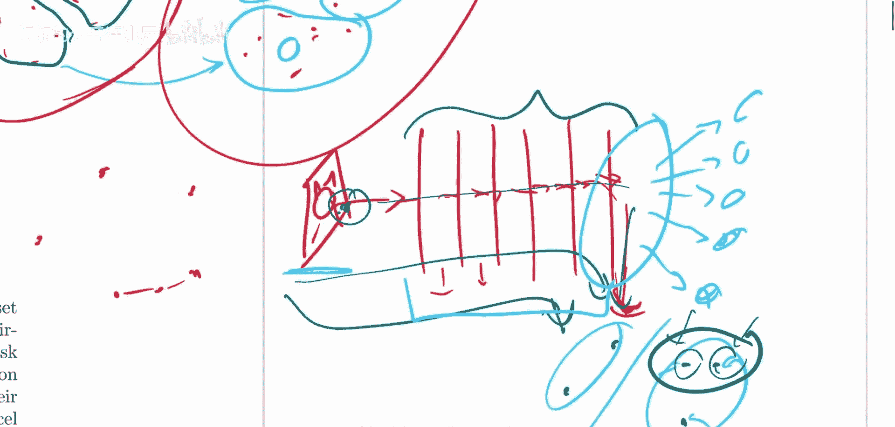

这个过程的关键在于，初始聚类提供了相对干净的伪标签来启动监督训练。随着分类器性能的提升，它会产生更可靠的伪标签，从而进一步改善聚类和分类器本身，形成一个自我增强的循环。

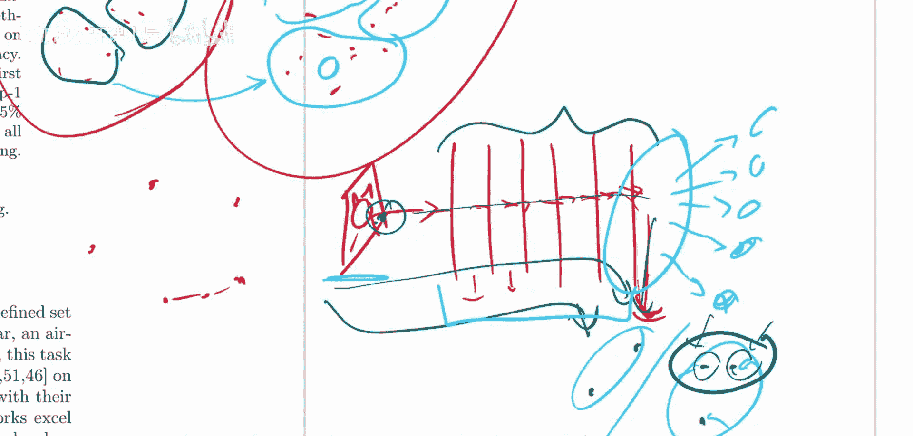

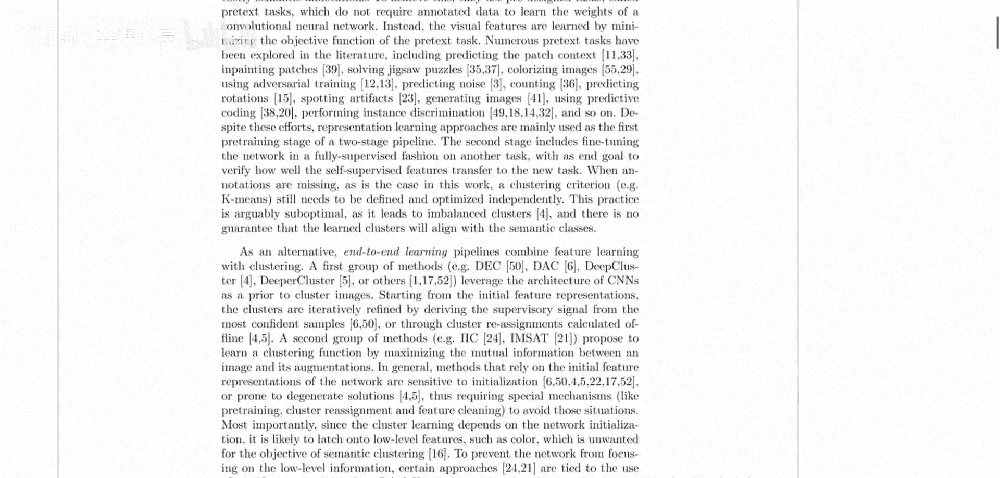

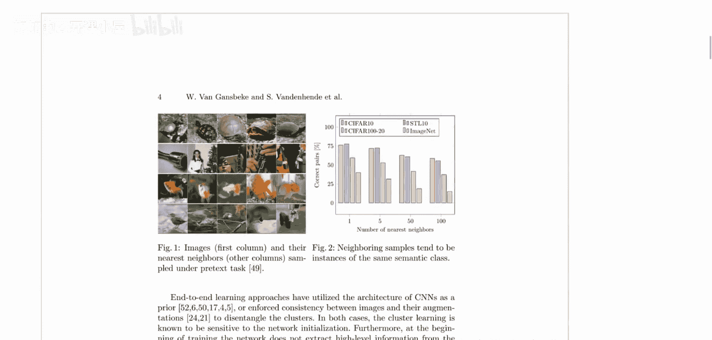

## 总结

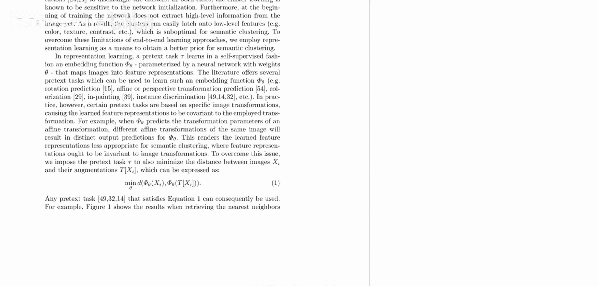

本节课我们一起学习了《Learning to Classify Images Without Labels》这篇论文。我们了解到，通过将流程解耦为三个步骤，可以有效地实现无监督图像分类：
1.  首先，通过**自监督学习**获取不受低级特征干扰的、高质量的图像表征。
2.  然后，在表征空间进行基于**最近邻的聚类**，得到初始类别划分。
3.  最后，通过**自标注精炼**迭代优化聚类结果，并训练出最终的分类器。

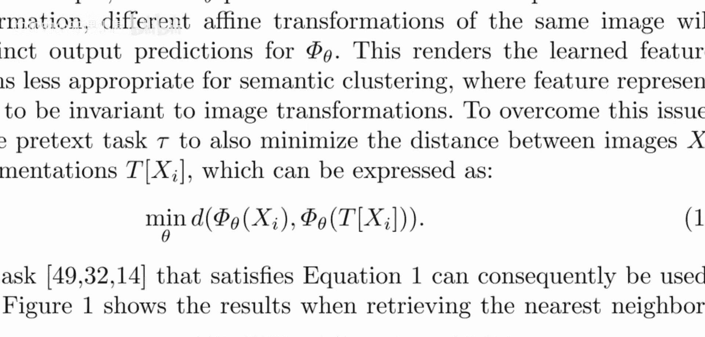

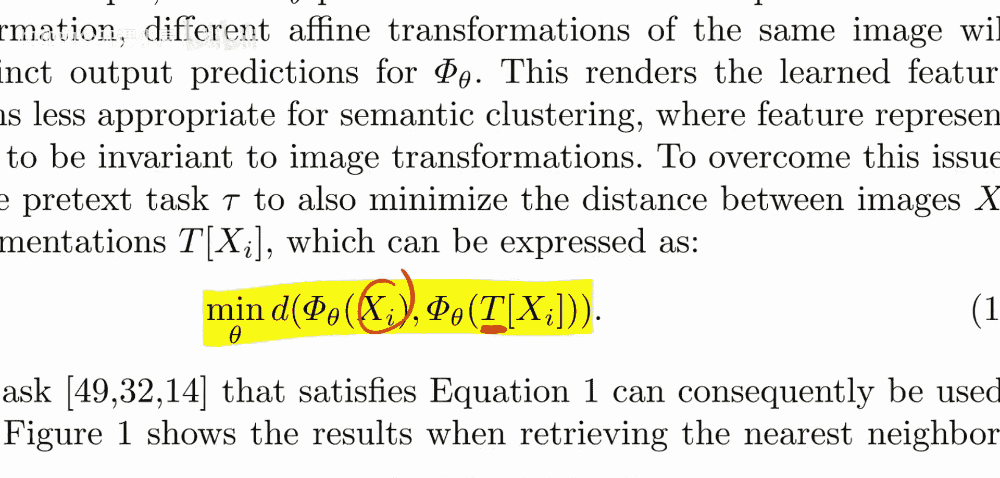

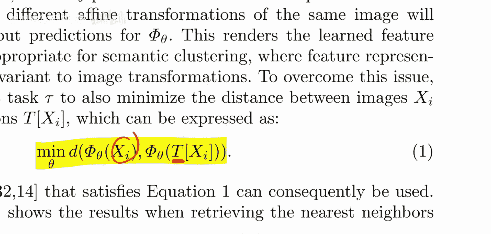

这种方法的核心洞见在于，通过自监督学习获得良好的特征空间是成功聚类的前提，而迭代自标注则能有效提升最终模型的性能。论文展示的结果表明，这种方法可以在完全无标签的情况下，在ImageNet等数据集上学习出有意义的视觉类别。