# 026：一种用于快速架构搜索的新型代理模型（论文详解） 🧪

在本节课中，我们将学习一篇名为《合成培养皿：一种用于快速架构搜索的新型代理模型》的论文。这篇论文由 Adi Tarawal、Joel Lehman、Felipe Petroski Such、Jeff Clune 和 Kenneth O. Stanley 共同撰写。我们将探讨其核心思想：如何通过在一个极小的网络中评估目标组件（如激活函数），来高效预测其在大型网络中的性能，从而加速神经网络架构搜索过程。

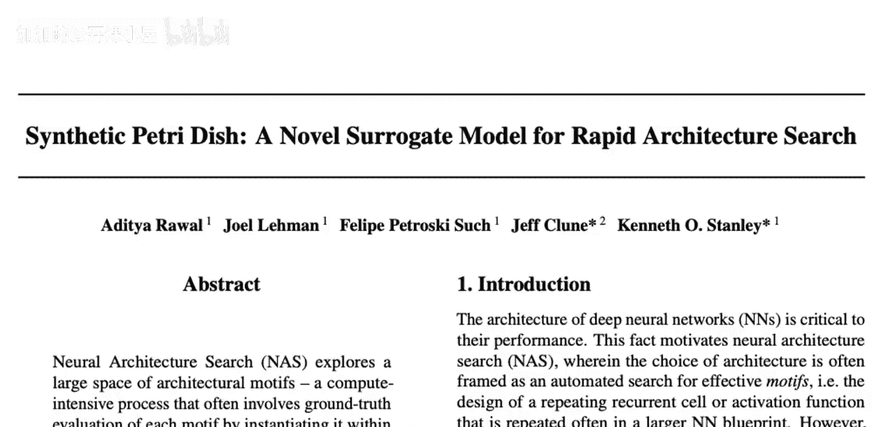

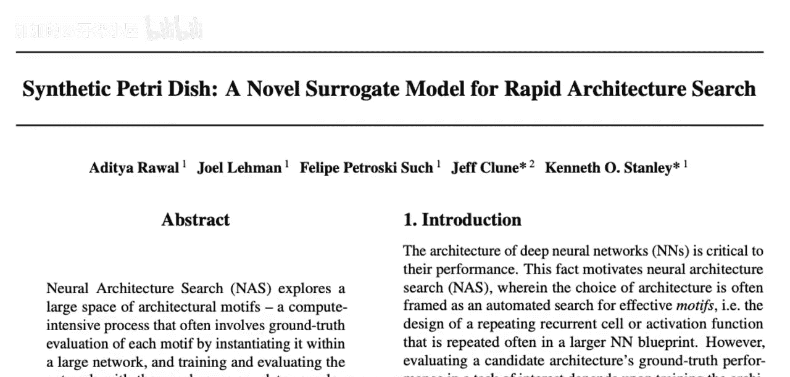

---

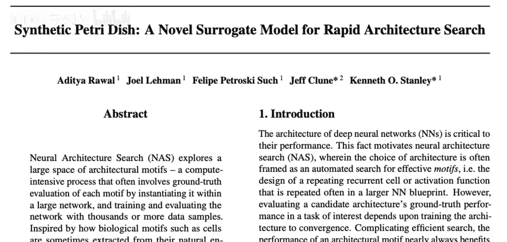

## 概述

神经网络架构搜索旨在探索广阔的架构设计空间。例如，你可能想寻找一个更好的激活函数，或者优化循环神经网络中的单元结构。传统方法需要将候选架构放入完整网络中，在全部训练数据上进行训练和验证，这非常耗时耗力。本论文提出的“合成培养皿”方法，则试图通过构建一个微型的“培养皿”网络来快速评估架构组件的潜力。

上一节我们介绍了架构搜索的基本挑战，本节中我们来看看“合成培养皿”方法是如何解决这个问题的。

## 传统架构搜索的挑战

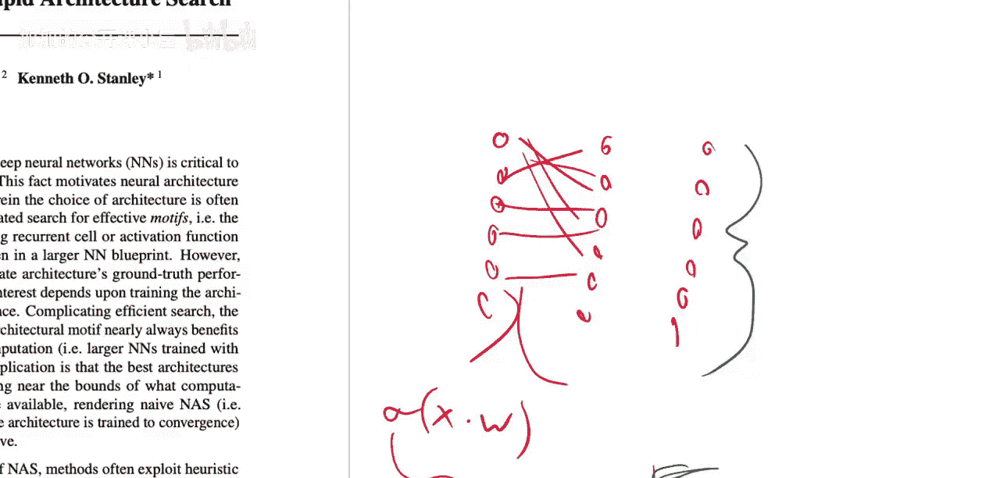

假设你有一个多层感知机，其每一层都包含权重乘法和一个非线性激活函数。例如，Sigmoid 激活函数的形式是：

**公式：** `σ(x) = 1 / (1 + e^{-c*x})`

这里的参数 `c` 就是一个可以调整的超参数，它改变了函数的形状。架构搜索的目标就是找到能使网络整体性能最佳的超参数或组件结构。

然而，评估一个候选架构的传统流程非常繁琐：

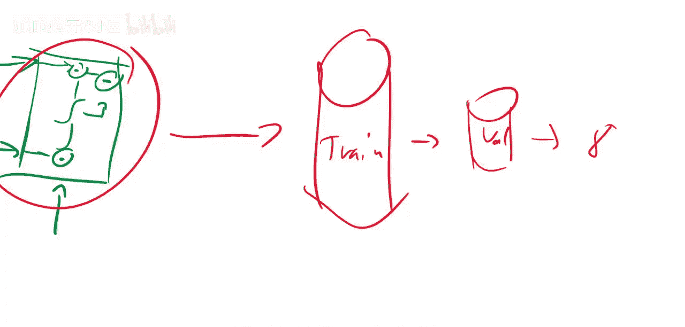

1.  将新设计的组件（如一个RNN单元）放入完整网络中。
2.  在完整的训练数据集上训练这个网络。
3.  在验证集上评估其性能，得到一个分数（例如准确率）。
4.  修改组件设计，重复上述过程。

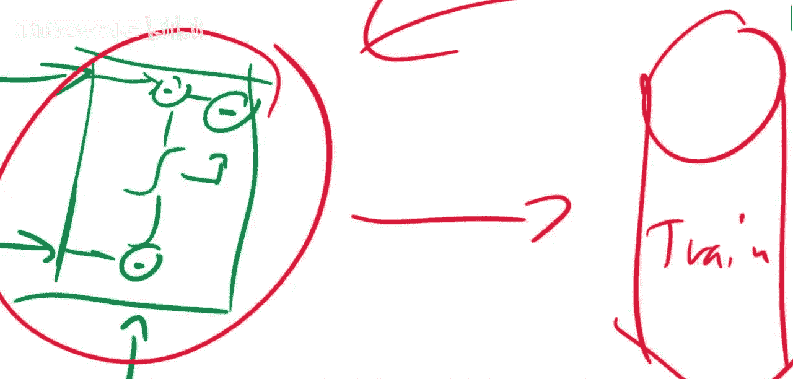

这种方法需要大量的计算资源。为了缓解这个问题，研究者们提出了一些改进方法。

## 现有改进方法：编码与预测

一种思路是将组件的结构（例如，一个RNN单元的数学表达式或计算图）编码成一个连续的向量。

以下是实现这种思路的步骤：

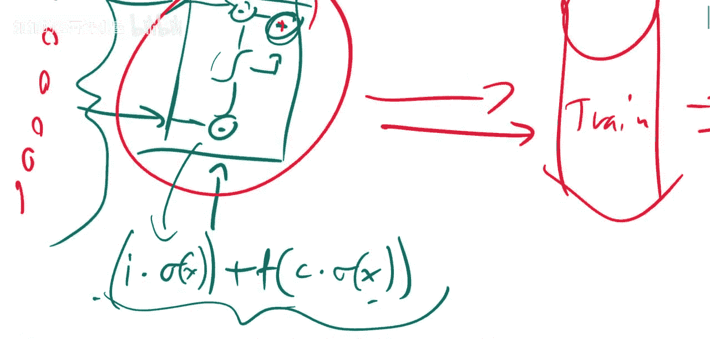

1.  **编码**：使用图神经网络等方法，将组件结构映射为一个固定维度的向量。这样，每个可能的组件都对应嵌入空间中的一个点。
2.  **采样与评估**：在嵌入空间中选取几个点，对应不同的组件，并用传统方法（完整训练）评估它们的性能，得到分数。
3.  **学习预测器**：根据这些“点-分数”对，训练一个回归模型，使其能够根据组件的向量表示直接预测其性能。
4.  **在连续空间中搜索**：由于嵌入空间是连续的，可以使用梯度下降等方法，寻找预测分数更高的区域，并采样新的候选组件。

但这种方法本质上试图仅从“蓝图”（组件结构）预测其运行效果，其难度可能与原始问题相当，并且通常也需要大量计算来训练一个好的预测器。

无论是传统的暴力评估，还是这种编码预测方法，计算成本都很高。接下来，我们将看到“合成培养皿”如何巧妙地结合两者的优点。

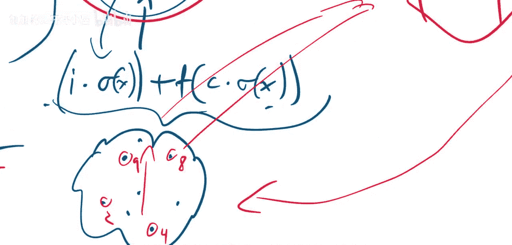

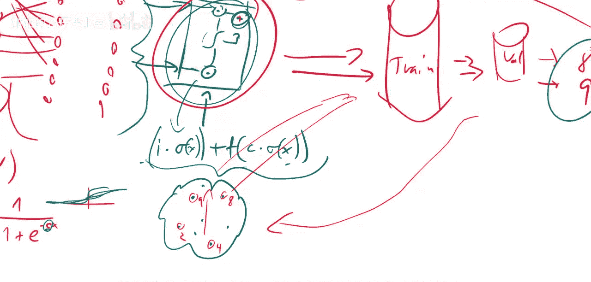

## 合成培养皿的核心思想

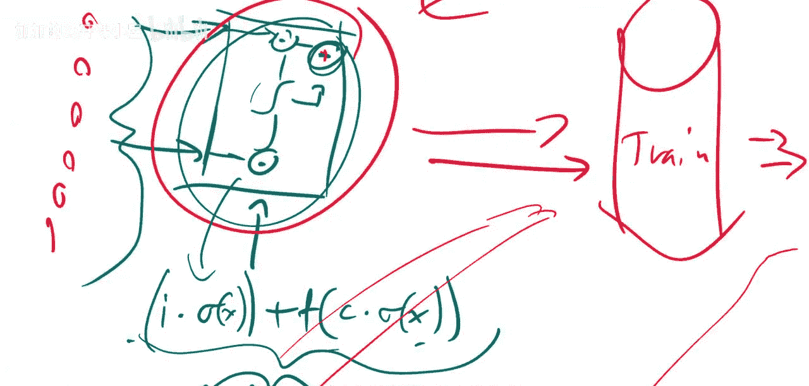

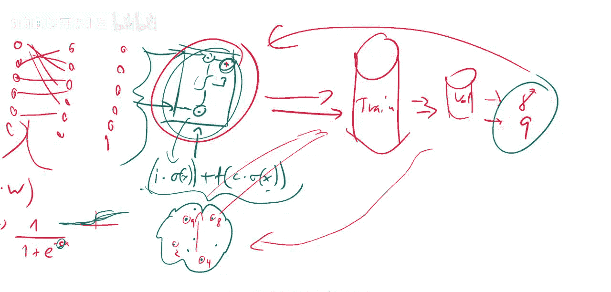

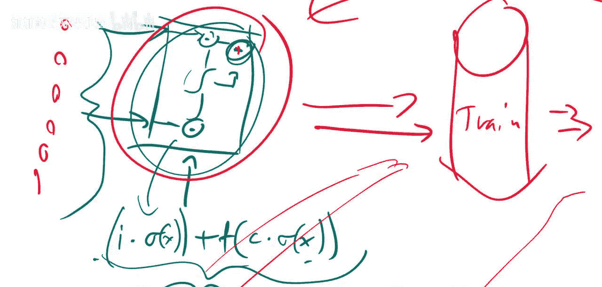

“合成培养皿”方法提出了一种不同的思路：我们不完全抛弃数据，也不在完整网络上运行，而是**提取出我们想要搜索的组件，将其置于一个极简化的微型网络中进行评估**。

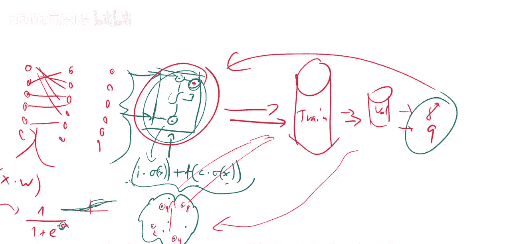

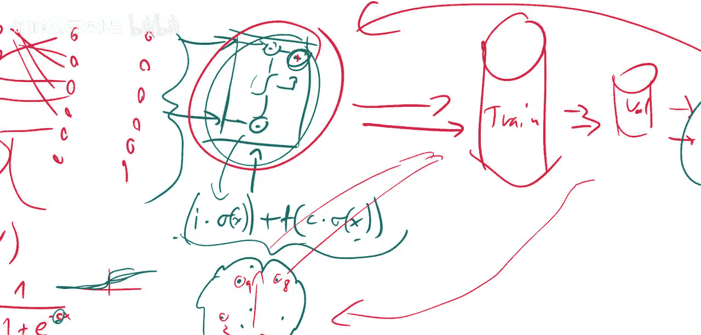

其关键操作是**保持连接模式，但极度缩减网络规模**。具体来说：

*   **缩减宽度**：例如，一个正常RNN单元的隐藏层维度可能是512。在“培养皿”中，我们将其缩减到极小的维度（如1或2），但完全保留单元内部的所有连接和计算逻辑。
*   **缩减深度**：如果原网络有多层，在“培养皿”中可能只保留一层。

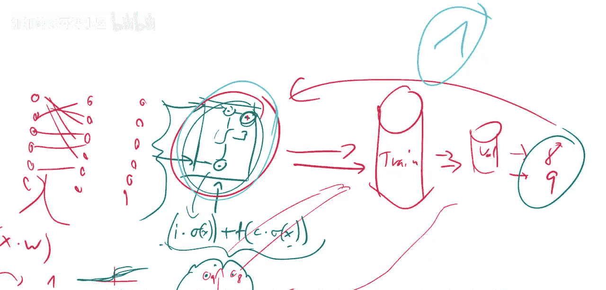

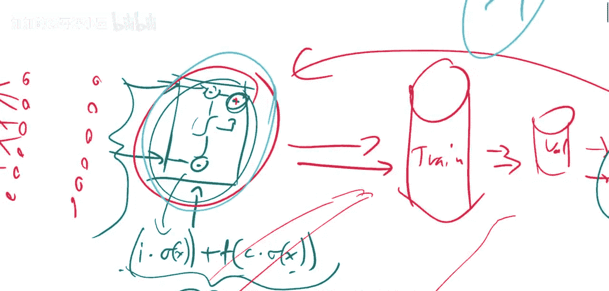

这样，我们就得到了一个微型的“培养皿”网络，它完整保留了目标组件的架构特性，但参数量和计算量极小。论文的核心假设是：**组件在这个微型网络上的表现，与其在完整大型网络中的最终性能是相关的**。

因此，我们可以快速地在大量候选组件上训练和评估这些微型网络，用它们的性能作为代理指标，筛选出最有潜力的少数组件，再放到完整网络中做最终验证，从而极大提升搜索效率。

---

## 总结

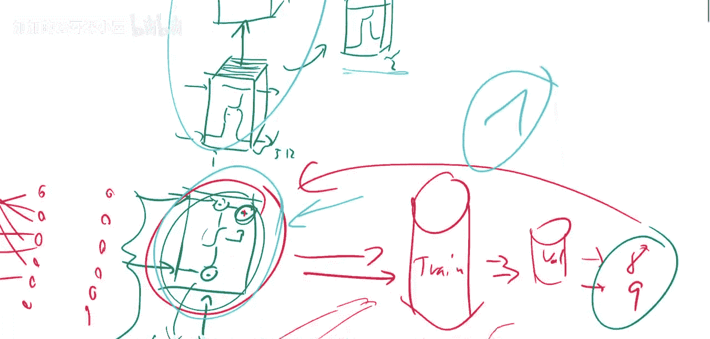

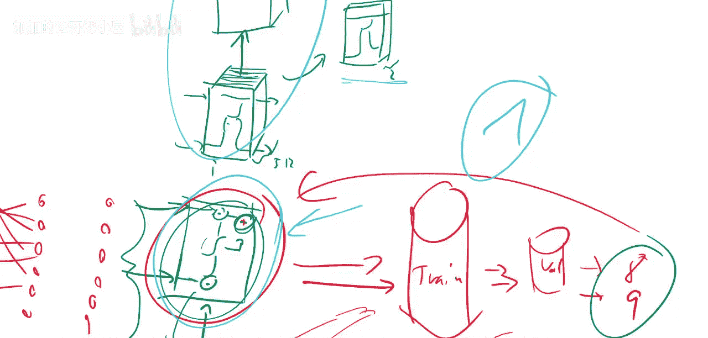

本节课我们一起学习了《合成培养皿》这篇论文。我们首先回顾了神经网络架构搜索的耗时挑战，然后分析了两种现有方法（完整评估和编码预测）的不足。最后，我们重点讲解了“合成培养皿”的创新思想：通过构建并评估一个保持原架构连接模式但规模极小的代理网络，来快速预测组件性能。这种方法在计算效率和评估准确性之间取得了更好的平衡，为高效的架构搜索提供了新思路。