# 028：论文解读

在本节课中，我们将学习一篇名为《Unsupervised translation of programming languages》的论文。这篇论文介绍了一种能够将一种编程语言的源代码（例如Python）自动翻译成另一种编程语言（例如C++）的模型，其核心特点是**无需任何成对的、人工标注的翻译数据**进行训练。我们将探讨其工作原理、面临的挑战以及它如何应用于现实世界的代码迁移问题。

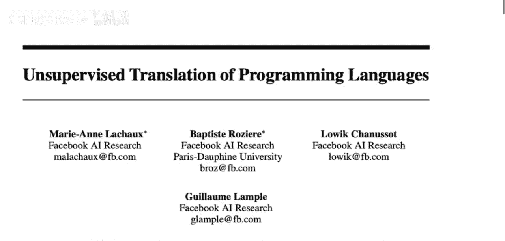

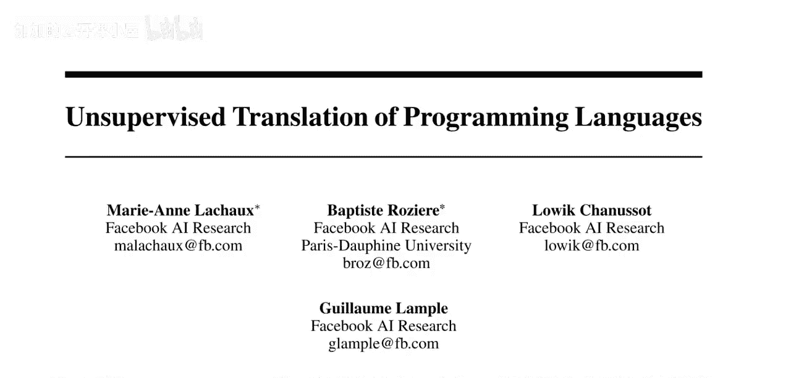

## 概述：从规则翻译到无监督学习

传统的源代码翻译工具（如Python 2到Python 3的转换工具`2to3`）依赖于**手工编写的规则**。这些规则定义了如何将源语言的特定语法结构修改为目标语言的对应结构。然而，这种方法存在几个主要问题：
1.  **规则覆盖有限**：只能翻译规则预先定义好的情况。
2.  **开发成本高**：需要精通两种语言的专家投入大量时间编写和维护规则。
3.  **输出代码质量**：生成的代码可能晦涩难懂，因为规则必须确保功能正确性，有时会牺牲代码的可读性和简洁性。

对于语法差异巨大的语言（例如COBOL到Java），编写这样的规则集变得极其困难且不切实际。因此，我们自然希望有一个能够**自动学习**翻译规则的系统。

## 核心挑战：缺乏并行数据

上一节我们介绍了传统方法的局限性，本节中我们来看看神经网络机器翻译（NMT）为何不能直接应用。NMT模型（如谷歌翻译）在自然语言翻译上取得了巨大成功，但它们严重依赖于**并行语料库**——即大量内容完全相同、但语言不同的成对文本（例如联合国的多语言新闻稿）。

对于编程语言翻译，我们几乎**没有这样的并行数据**。很少有项目会同时用两种语言实现完全相同的功能。即使有（例如PyTorch从Lua迁移到Python），代码在迁移过程中也常常被重构和优化，导致它们并非严格的“翻译”关系。因此，我们无法直接使用需要监督信号的经典NMT模型。

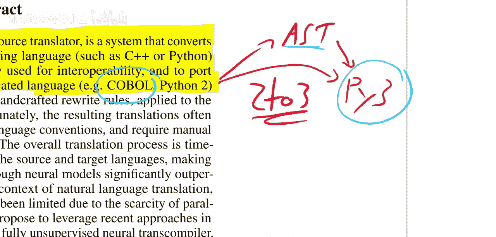

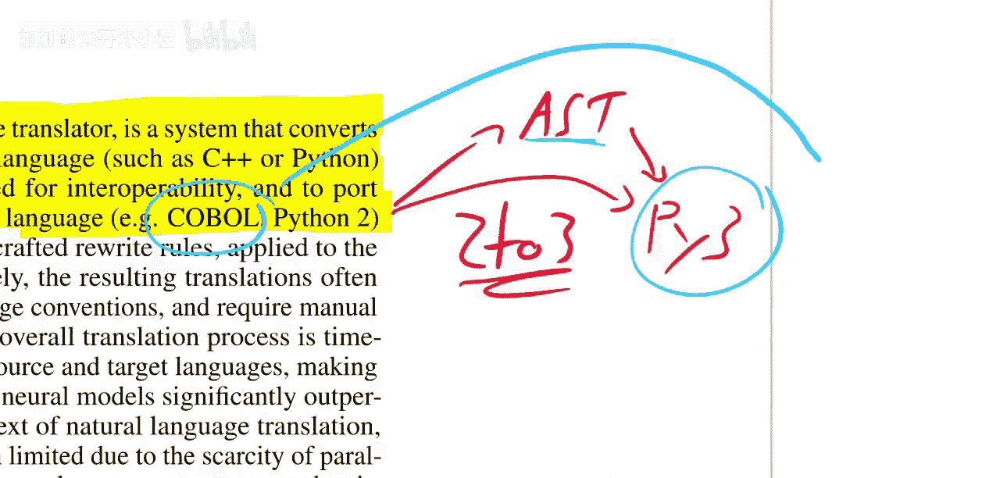

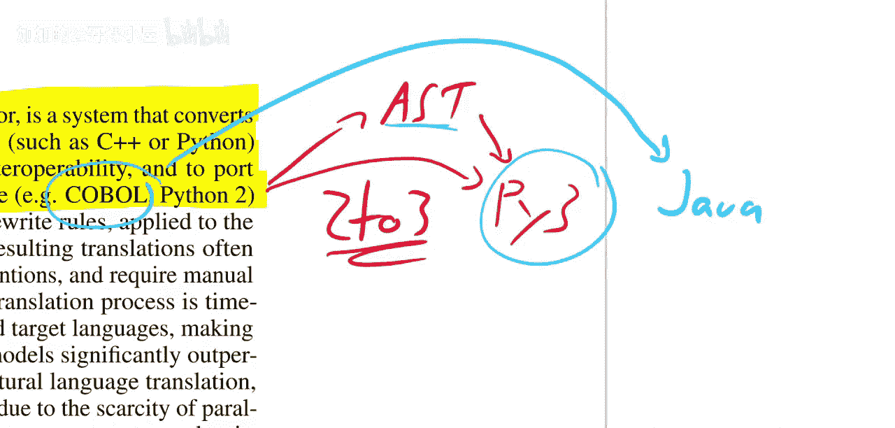

## 解决方案：无监督机器翻译

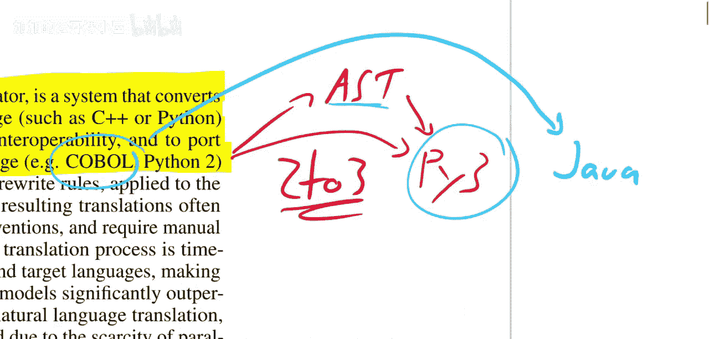

既然没有成对的翻译数据，这篇论文采用了**无监督机器翻译**的思路。其核心思想是：即使没有对齐的句子对，我们也可以学习两种语言的**共享语义空间**。

想象一下，我们有两个独立的文档集合：一个全是英文文档，另一个全是德文文档。我们不知道哪篇英文文档对应哪篇德文文档。无监督翻译模型的目标是训练一个**单一的编码器**，将两种语言的句子都映射到同一个向量空间（共享嵌入空间）。在这个空间里，**语义相似的句子**（无论是什么语言）的位置会彼此接近。

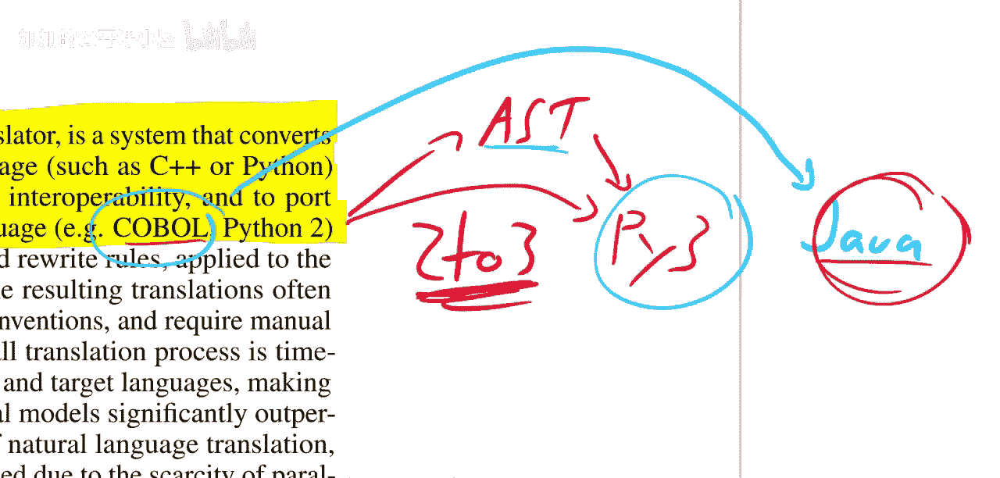

以下是实现这一目标通常涉及的三个关键步骤：
1.  **初始化**：利用单语数据分别训练两种语言的基础语言模型。
2.  **跨语言对齐**：通过一些技术（如回译、对抗训练或跨语言词嵌入）将两种语言的表示空间对齐。
3.  **微调**：使用对齐后的模型进行迭代优化，提升翻译质量。

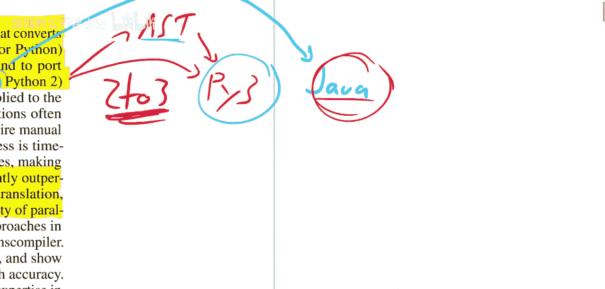

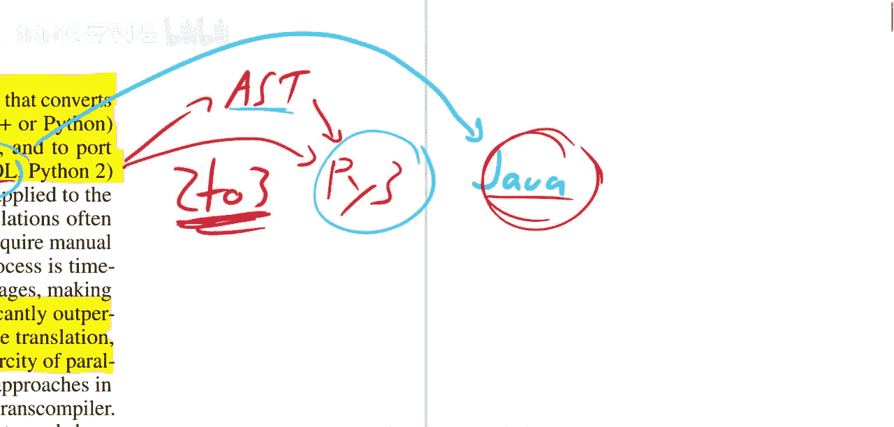

对于源代码，这个“语义”就是程序要执行的**计算逻辑**。模型需要学会理解代码的功能，而不是死记硬背语法替换规则。

## TransCoder 模型设计

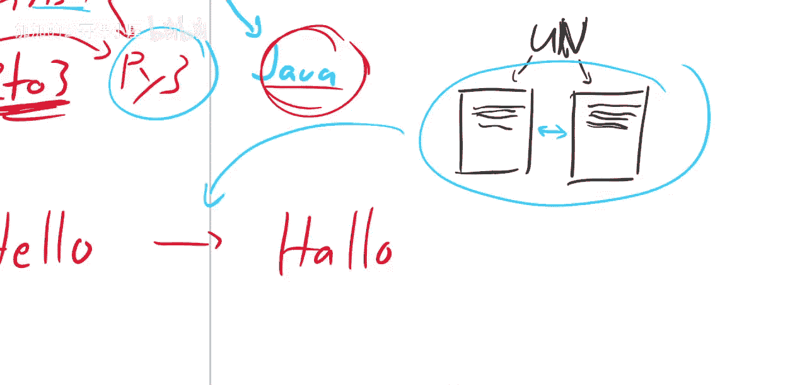

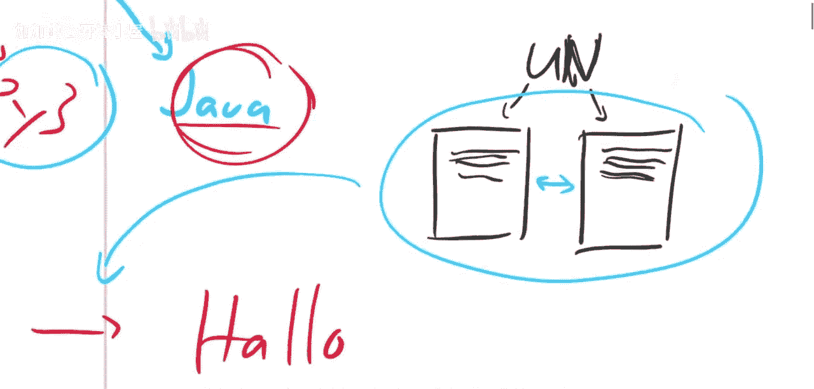

那么，TransCoder是如何将无监督翻译思想应用到代码上的呢？模型基于经典的**序列到序列（Seq2Seq）架构**，使用Transformer作为主干网络。其训练过程主要包含以下几个阶段：

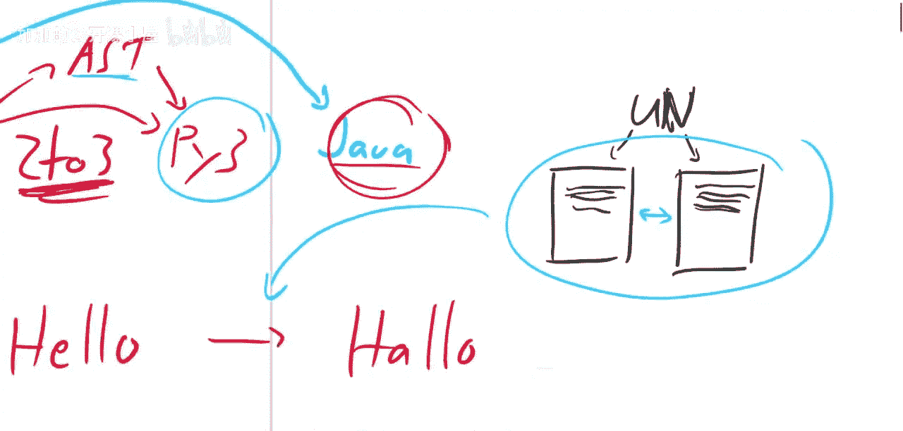

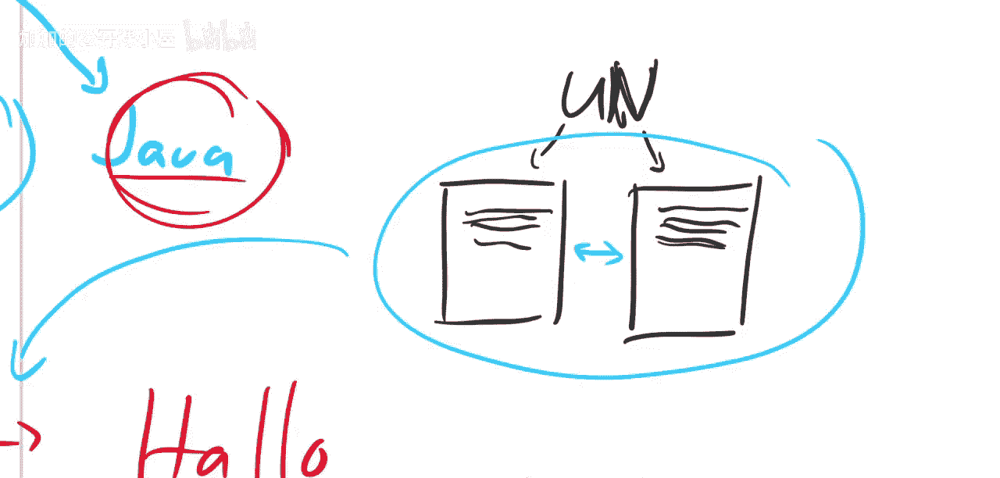

以下是模型训练的核心阶段：
*   **预训练（掩码语言建模）**：模型首先在大量单语源代码数据（分别来自Python、Java、C++）上进行预训练，学习每种语言的语法和常见模式。这通过**掩码语言模型（MLM）** 任务完成，即随机遮盖代码中的一部分token，让模型预测它们。
*   **跨语言建模**：这是实现无监督翻译的关键。模型被训练去处理**跨语言序列**，例如将Python和C++的代码片段拼接在一起，然后进行MLM任务。这迫使模型学习不同语言间共享的、与功能相关的表示，而不仅仅是语法。
*   **回译（Back-Translation）**：这是一个自监督的迭代过程。假设我们想将Python翻译成Java。我们先用当前模型将一批Python代码“翻译”成Java（称为“伪目标”），然后用同一个模型将这批“伪Java代码”再翻译回Python。通过最小化回译后的Python代码与原始Python代码之间的差异，模型在没有真实翻译对的情况下也能自我改进。

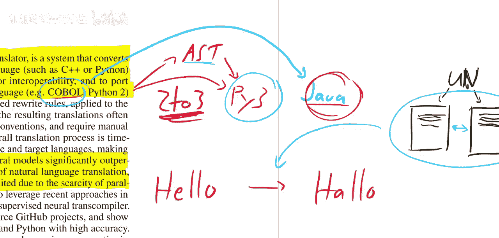

通过结合**跨语言MLM**和**回译**，TransCoder成功地在没有并行数据的情况下，学会了在不同编程语言间保留代码功能的翻译能力。

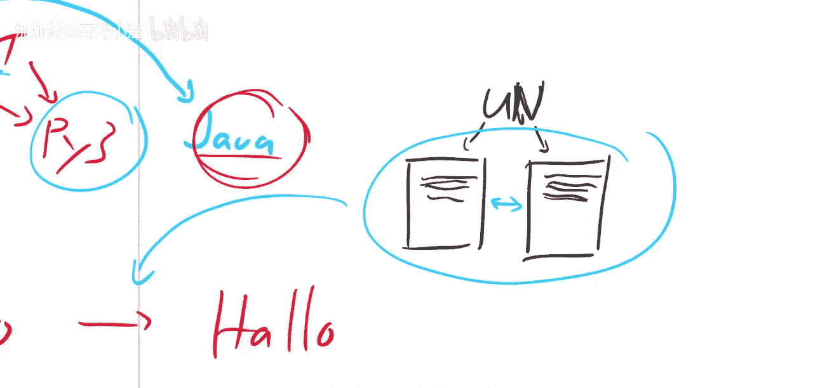

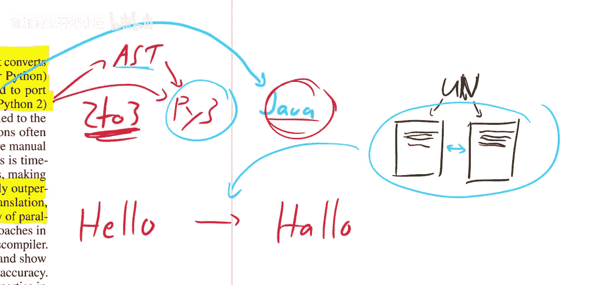

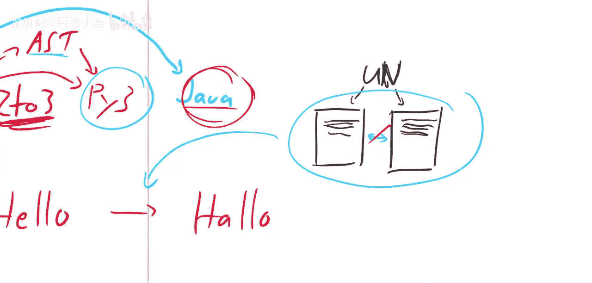

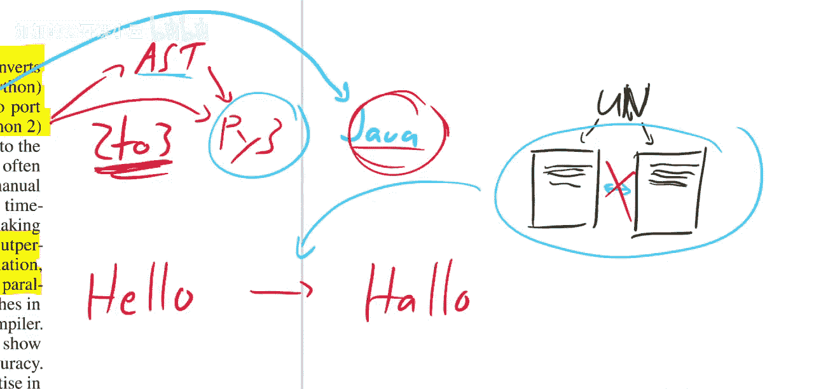

## 总结与意义

本节课中我们一起学习了TransCoder，一种无监督的编程语言翻译模型。它通过**跨语言掩码建模**和**回译**技术，克服了源代码翻译领域缺乏并行数据的核心挑战，实现了在不同编程语言间进行功能保持的代码转换。

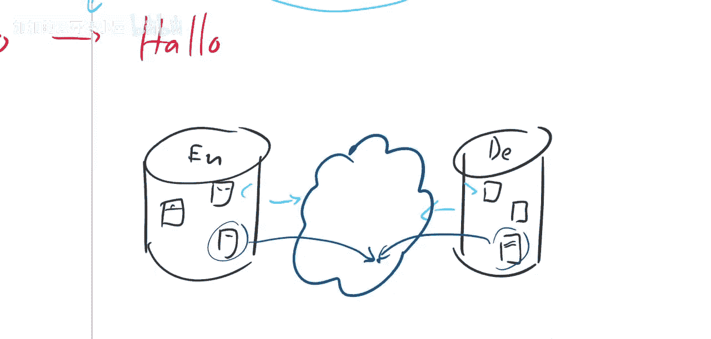

这项工作的意义在于为**遗留系统迁移**（如将COBOL代码库迁移到现代语言）和**代码库互操作性**提供了一种潜在的自动化、低成本解决方案。它展示了无监督学习在高度结构化数据（如代码）上的强大能力，是AI赋能软件开发的一个有趣方向。