# 030：具有线性复杂度的自注意力机制（论文解读）

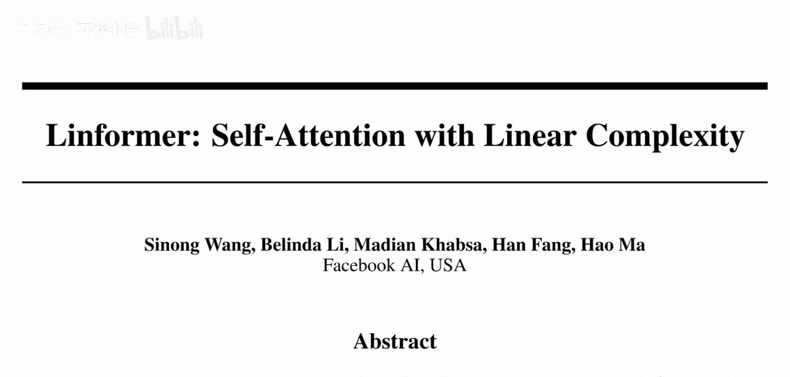

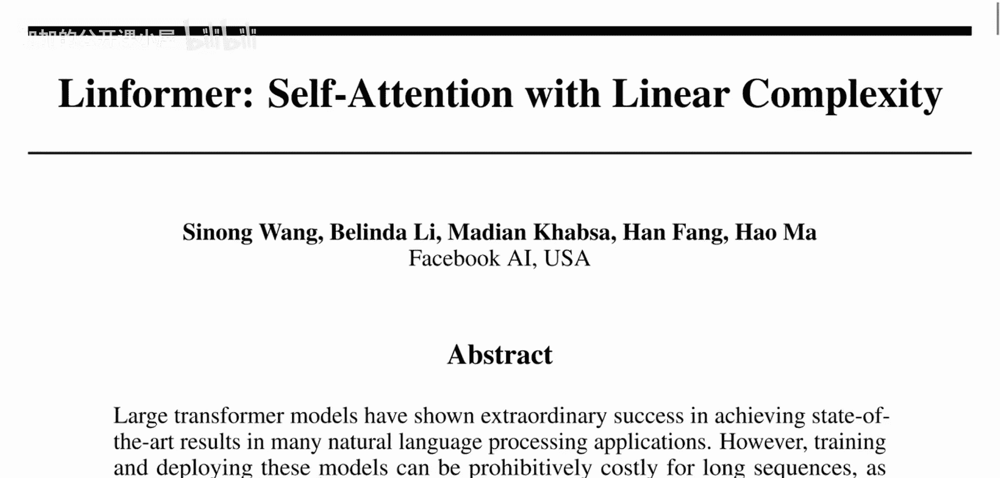

在本节课中，我们将学习一篇来自Facebook AI的论文《Linformer: Self-Attention with Linear Complexity》。这篇论文的核心观点是：Transformer模型中的自注意力矩阵通常是低秩的，因此可以通过将其投影到低维空间来近似计算，从而将计算复杂度从序列长度的平方（O(n²)）降低到线性（O(n)）。我们将详细解析其原理和实现方法。

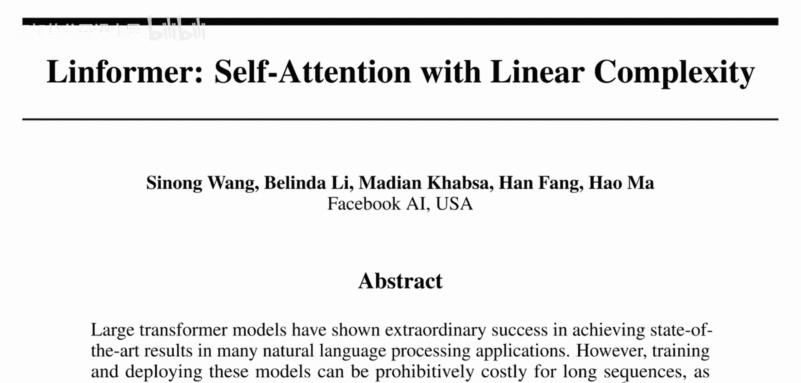

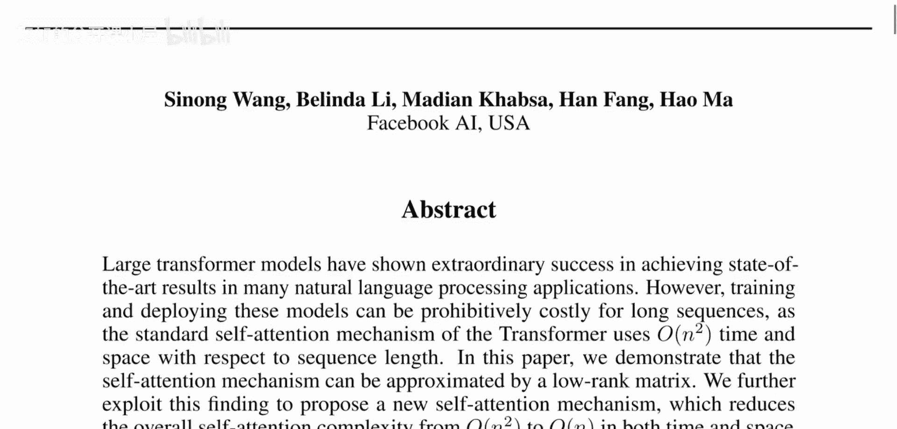

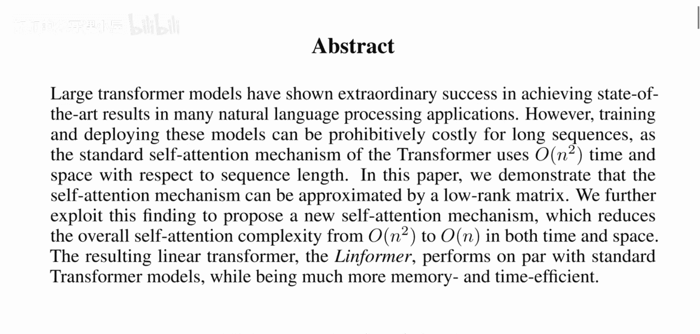

## 概述与背景

上一节我们介绍了Transformer模型的基本概念。本节中，我们来看看如何优化其核心组件——自注意力机制的计算成本。

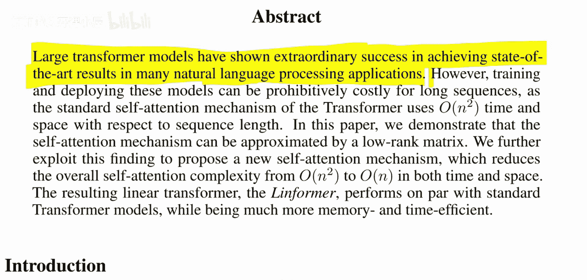

论文指出，大型Transformer模型在自然语言处理任务中取得了巨大成功。然而，对于长序列，标准的自注意力机制在时间和空间上都需要O(n²)的复杂度，这使得模型的训练和部署成本极高。

为了理解这一点，我们需要回顾自注意力机制。它通过查询（Query）、键（Key）和值（Value）来动态地聚合信息。具体来说，需要计算序列中每个位置查询与所有位置键的点积，形成一个n×n的注意力矩阵，其中n是序列长度。这正是O(n²)复杂度的来源。

## 核心洞察：自注意力矩阵是低秩的

现代Transformer通常使用多头注意力机制。这意味着我们将嵌入维度d分割成多个头（例如h个头），每个头在更低的维度（d/h）上独立计算注意力。因此，尽管最终的注意力矩阵大小仍是n×n，但其有效秩被限制在更低的维度（约d/h）。这表明矩阵中的信息存在冗余，可以用一个低秩矩阵来近似。

论文正是利用了这一特性。他们通过实验证明，自注意力矩阵可以通过投影到低维空间（例如维度k，其中k << n）来有效近似，而不会显著损失模型性能。

## Linformer方法详解

上一节我们介绍了自注意力矩阵的低秩特性。本节中，我们来看看Linformer如何具体实现线性复杂度的自注意力。

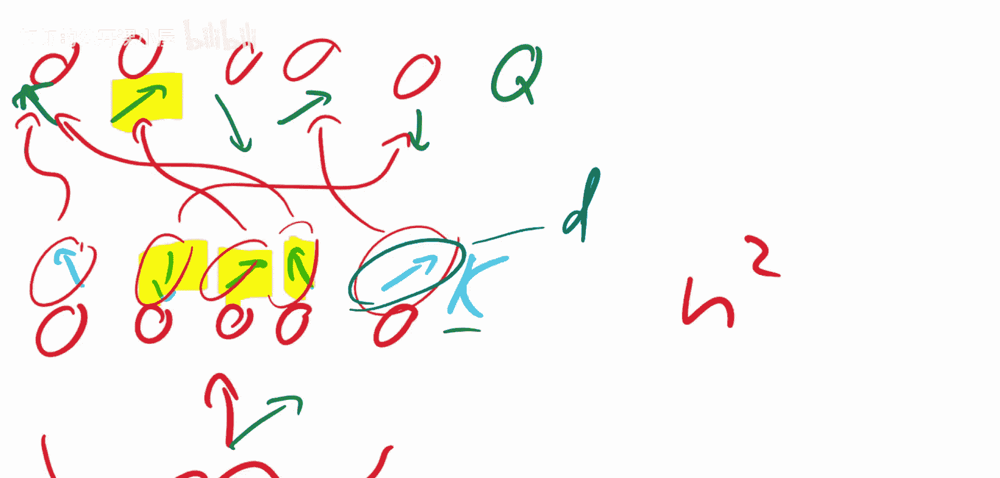

Linformer的核心思想是在计算注意力之前，先使用一个线性投影将键（K）和值（V）矩阵从n×d维压缩到k×d维（其中k是一个固定的、远小于n的维度）。然后，在这个压缩后的低维空间中进行注意力计算。

以下是标准自注意力与Linformer自注意力的公式对比：

**标准自注意力公式：**
`Attention(Q, K, V) = softmax( (Q K^T) / sqrt(d_k) ) V`
其中 `Q, K, V ∈ R^(n×d)`，计算复杂度为O(n²d)。

**Linformer自注意力公式：**
`LinformerAttention(Q, K, V) = softmax( (Q (E K)^T) / sqrt(d_k) ) (F V)`
其中 `E, F ∈ R^(k×n)` 是投影矩阵，将K和V从n维投影到k维。计算过程变为：
1.  投影：`K' = E K`, `V' = F V`， 此时 `K', V' ∈ R^(k×d)`。复杂度为O(nkd)。
2.  计算注意力：`Q K'^T` 得到 `n×k` 矩阵，复杂度为O(nkd)。
3.  与投影后的值相乘：`(n×k) × (k×d)`，复杂度为O(nkd)。

由于k是一个固定常数，总复杂度从O(n²d)降低到了O(nkd)，即与序列长度n成线性关系。

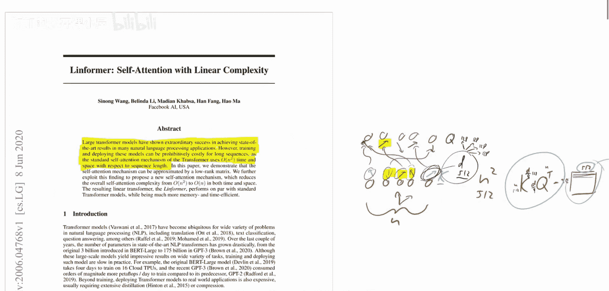

以下是实现这一过程的关键步骤列表：

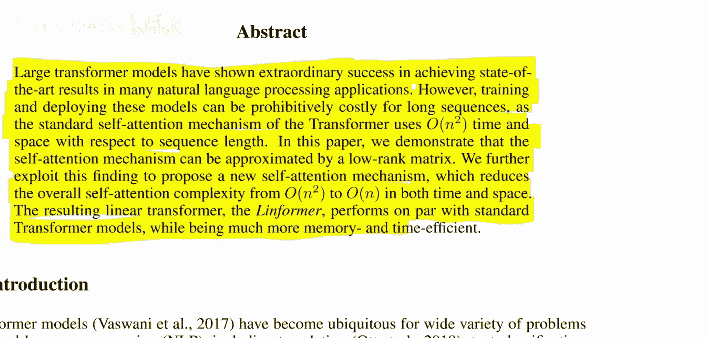

*   **投影键和值**：使用可学习的投影矩阵E和F，将原始的K和V矩阵的序列长度维度从n压缩到k。
*   **在低维空间计算**：计算查询Q与投影后键K‘的相似度，得到n×k的注意力权重矩阵。
*   **聚合信息**：使用该注意力权重与投影后的值V‘相乘，得到最终的输出。

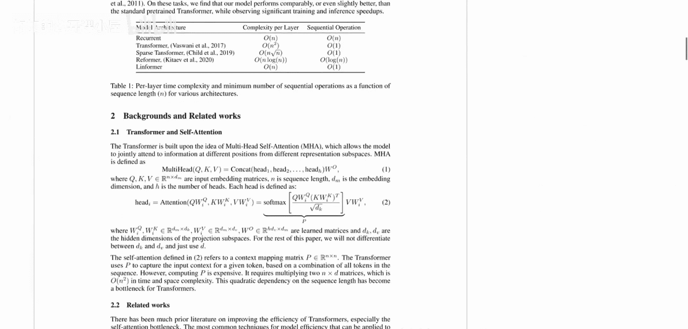

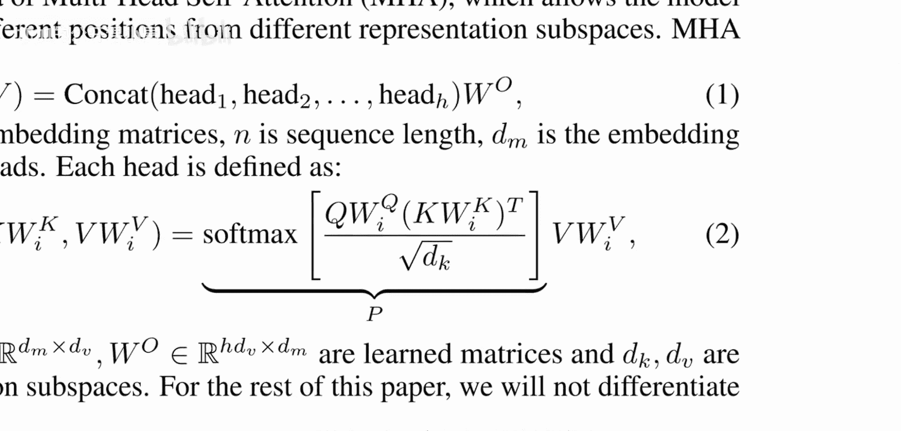

通过这种方式，Linformer避免了构建完整的n×n注意力矩阵，从而大幅降低了内存占用和计算时间。

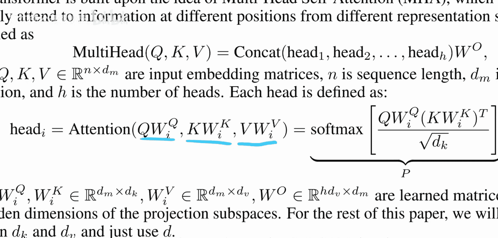

## 总结

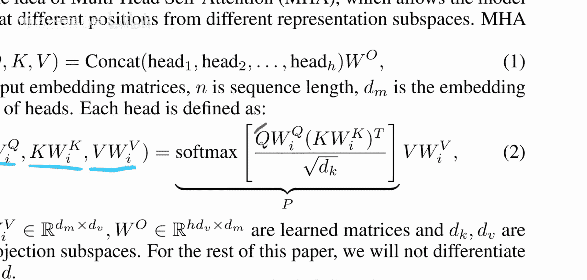

本节课中我们一起学习了Linformer模型。其核心贡献在于发现并利用了自注意力矩阵的低秩特性，通过引入线性投影将键和值压缩到固定低维，从而将自注意力机制的计算和空间复杂度从序列长度的平方级（O(n²)）成功降低到了线性级（O(n)）。这种方法使得Transformer模型能够更高效地处理长序列，同时在多项任务上保持了与原始模型相当的性能。