# 031：通过文本注释学习视觉表示（论文解读） 🖼️📝

## 概述

在本节课中，我们将要学习一篇名为《VirTex：通过文本注释学习视觉表示》的论文。这篇论文由密歇根大学的Karen Deai和Justin Johnson提出，其核心思想是利用图像描述生成任务来预训练一个视觉模型，然后将该模型的视觉编码部分作为“骨干网络”，迁移到其他视觉任务中。这种方法在数据量有限的情况下，表现出了令人惊讶的良好效果。

## 背景：视觉任务与骨干网络

上一节我们介绍了论文的基本目标，本节中我们来看看其背后的动机。视觉任务是指输入为图像的任务，例如图像分类、目标检测或语义分割。这些任务通常共享一个通用的架构：一个用于处理图像的视觉编码器（或称“骨干网络”），以及一个用于执行具体任务的输出头。

如果某个特定任务缺乏足够的标注数据来从头训练整个模型，一个常见的解决方案是“迁移学习”。即，先在一个大型数据集上预训练好一个通用的骨干网络，然后将其应用到新任务上，只训练任务特定的输出头部分。

## 预训练骨干网络的两种途径

那么，如何获得一个好的骨干网络呢？传统上有两种主要途径。

以下是两种预训练途径的对比：
*   **监督预训练**：在拥有高质量标签的大型数据集（如ImageNet）上训练一个分类器。其优点是学习信号明确，但数据标注成本高，且每个图像的信息量（通常只是一个类别标签）相对有限。
*   **自监督预训练**：在更庞大的无标签数据集（如从互联网抓取的图像）上，通过设计代理任务（例如预测图像旋转角度）进行训练。其优点是数据量巨大，但每个图像提供的学习信号较弱。

这两种方法体现了一种权衡：**数据量**与**每个样本的信息密度**之间的权衡。ImageNet数据量中等但信息明确；互联网图像数据量巨大但信息模糊。

## VirTex的核心思想：第三条道路

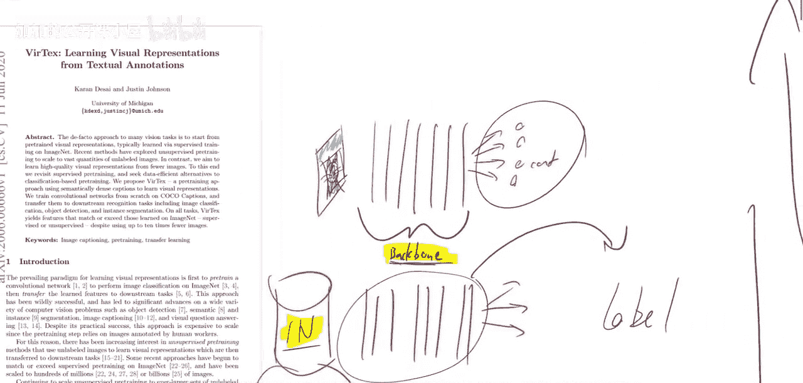

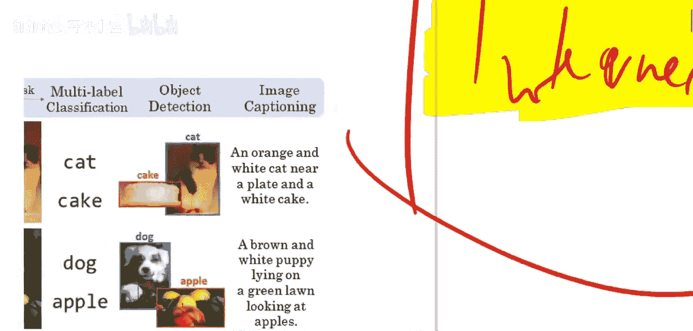

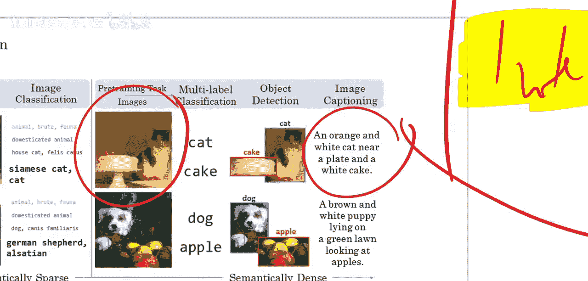

VirTex论文提出了一条不同的道路。他们思考：如果我们不追求极致的数量，而是追求极致的**信息质量**呢？具体来说，他们转向了**图像描述数据集**。

与仅有一个“猫”标签的图像相比，一段描述如“一只橙白相间的猫靠近盘子和白色蛋糕”的文本注释，包含了丰富得多的信息：物体的存在、属性（颜色）、数量以及物体之间的关系。这种“语义密集”的注释为模型学习更全面、更细致的视觉表示提供了可能。

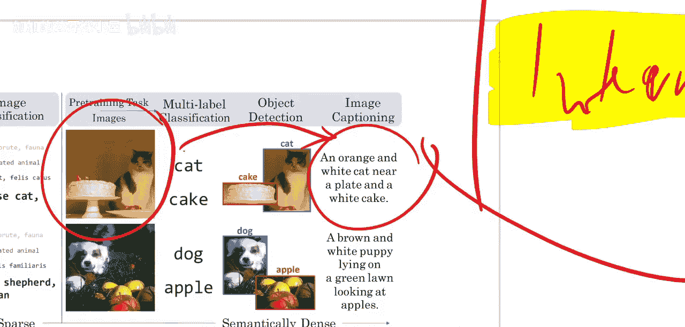

因此，VirTex的核心方法是：在一个高质量的图像-描述对数据集上，训练一个图像描述生成模型，然后将其中的视觉编码器（骨干网络）提取出来，用于其他下游视觉任务的迁移学习。

## VirTex模型架构

上一节我们介绍了VirTex利用高质量文本注释的思路，本节中我们来看看其具体的模型实现。VirTex的模型架构非常简单直接，主要包含两部分：一个视觉编码器和一个语言模型。

以下是模型的主要组成部分：
1.  **视觉骨干网络**：采用标准的ResNet-50卷积神经网络。输入一张图像，输出一组视觉特征，其维度通常为 `7 x 7 x 2048`。
2.  **线性投影层**：将视觉特征投影到与语言模型输入相匹配的维度。
3.  **双向Transformer语言模型**：这里使用了两个自回归的Transformer模型。
    *   一个**前向Transformer**，用于根据视觉特征和已生成的上文，预测下一个描述词，从而从左到右生成描述。
    *   一个**后向Transformer**，其输入是反转后的描述文本，用于从右到左进行预测。这种双向设计有助于模型学习更稳健的表示。

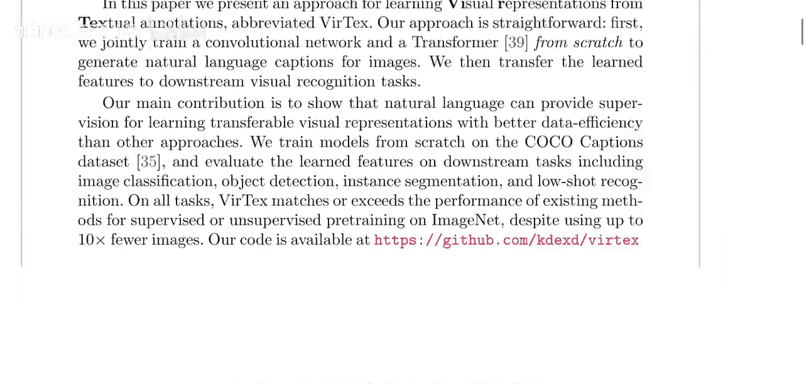

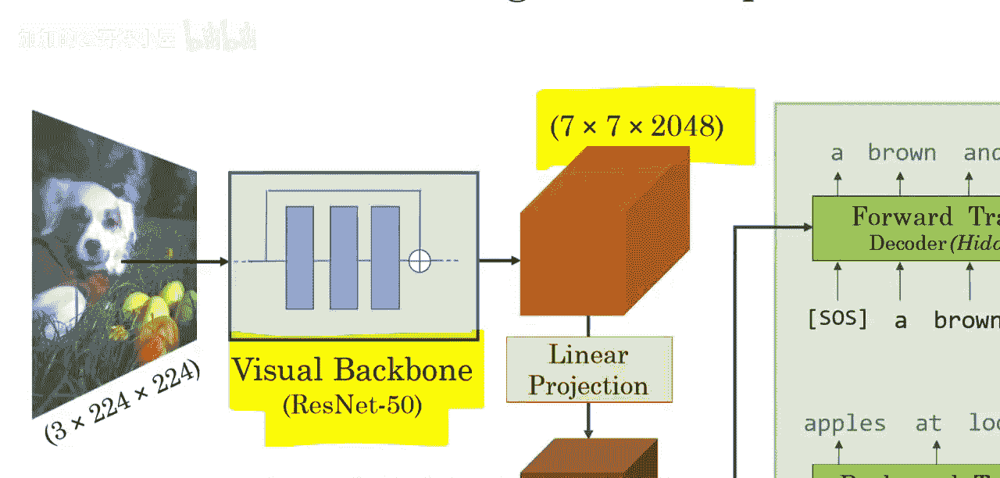

整个模型的训练目标就是最大化生成正确图像描述的概率。在预训练完成后，我们只保留**ResNet-50视觉骨干网络**，将其权重固定或微调，然后接入各种下游任务（如分类、检测）的头部网络进行训练。

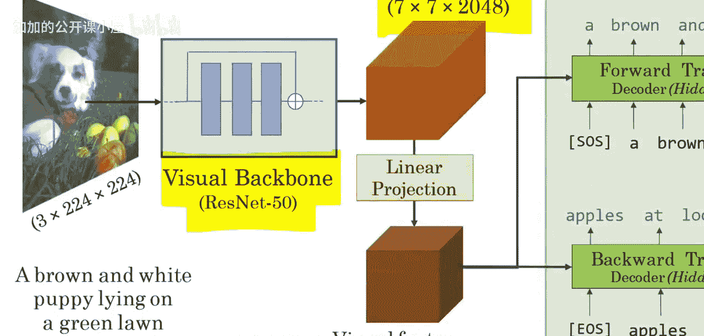

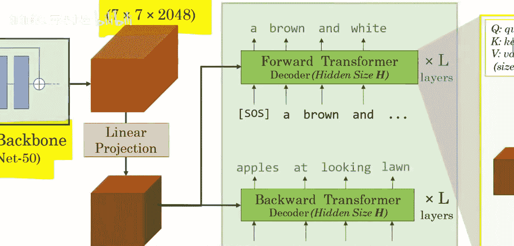

## 总结

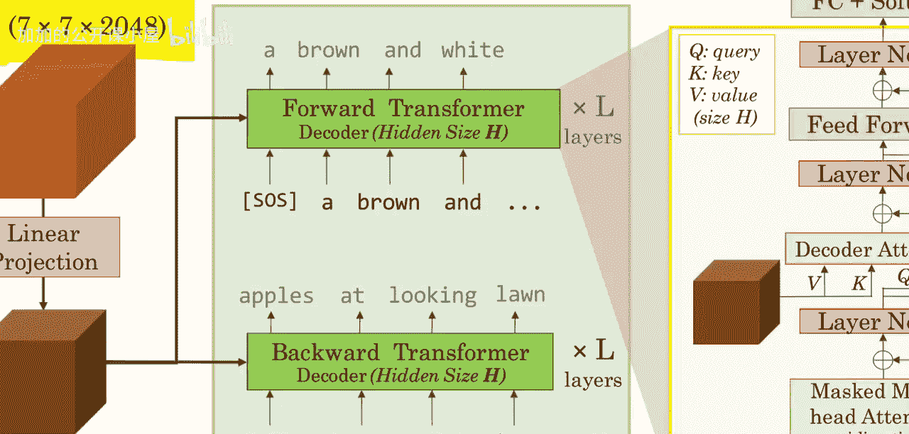

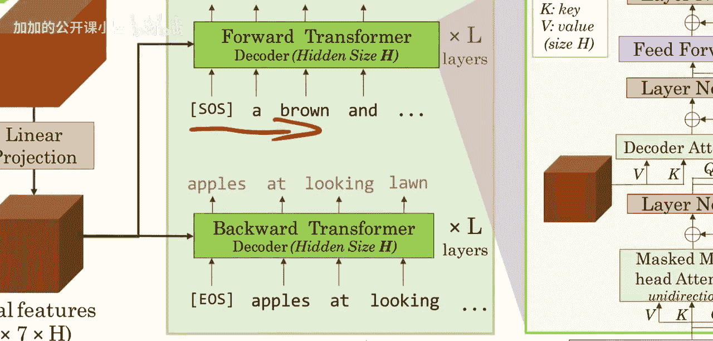

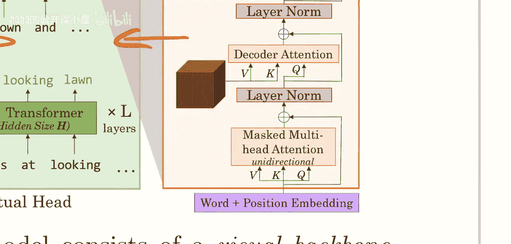

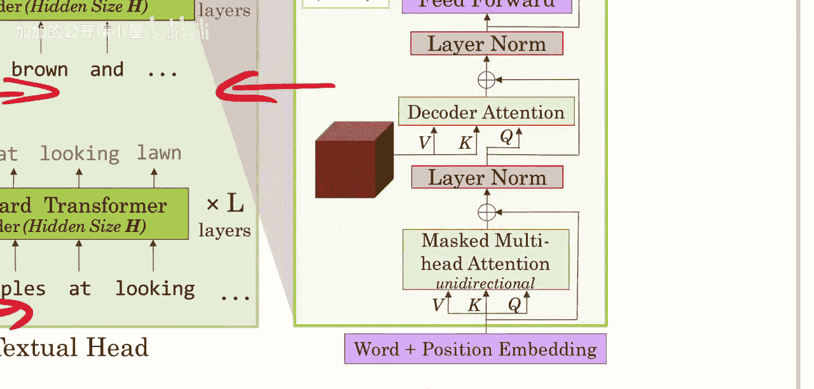

本节课中我们一起学习了VirTex这篇论文。其核心贡献在于探索了视觉表示学习的一条新路径：通过**图像描述生成**这种“语义密集”的任务进行预训练。这种方法用**更少但信息更丰富的标注数据**，换取了学习到高质量视觉表示的潜力，尤其在标注数据稀缺的下游任务中显示出优势。论文通过简单的“预训练描述模型，提取视觉骨干”的流程，验证了这一思路的有效性，为视觉表示学习提供了新的启发。