# 033：ARC挑战赛（论文解析）🎯

在本节课中，我们将学习弗朗索瓦·肖莱论文的最后一部分，重点探讨他提出的ARC挑战赛。我们将了解这个数据集的结构、设计目标，并讨论其作为衡量机器智能基准的意义。

上一节我们讨论了智能比较的公平性条件，本节中我们来看看一个旨在满足这些条件的实际测试——ARC挑战赛。

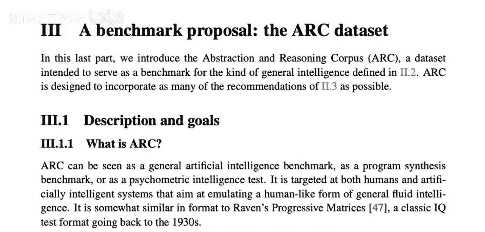

## ARC数据集概述

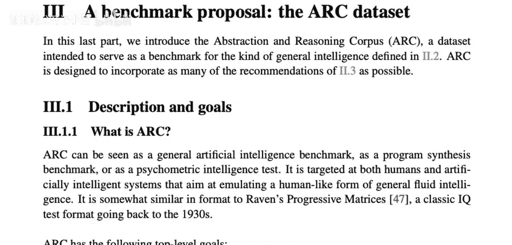

ARC是“抽象与推理语料库”的缩写。它本质上是一个数据集，目前也是一个正在进行的Kaggle挑战赛。

以下是该数据集中一个典型任务的结构：

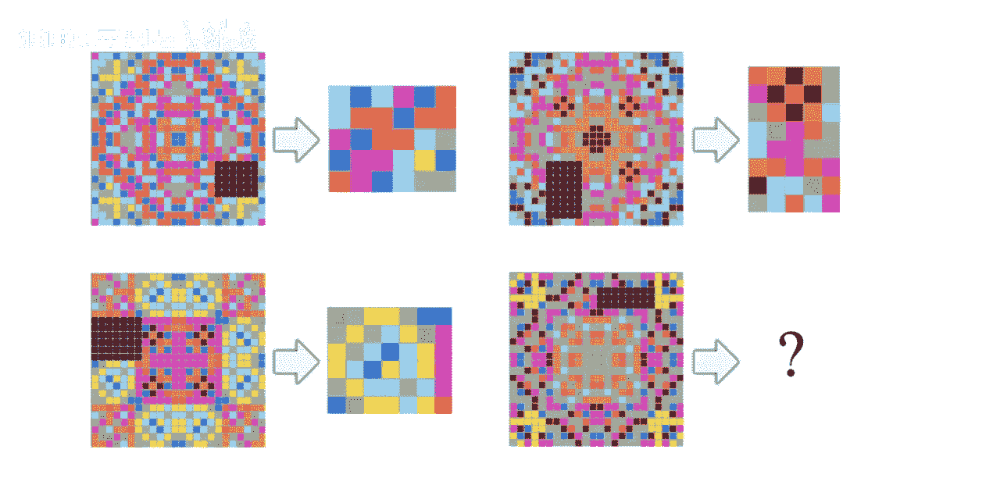

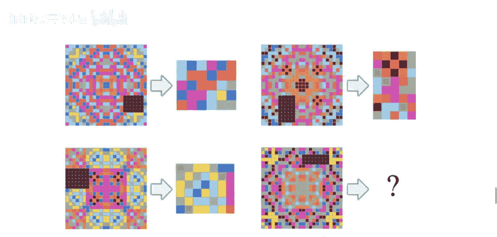

每个任务都以固定形式呈现。你总会看到多个输入输出示例，这些被称为训练示例。然后，你会看到一个测试示例。在上图中，有三个训练示例和一个测试示例。

从机器学习的角度看，整个任务（包括训练示例的输入和测试示例的输入）是你的输入X。而测试示例的正确输出是你的目标Y（标签）。在训练数据集中，这个Y是已知的；但在测试时，它是未知的。

## 任务示例解析

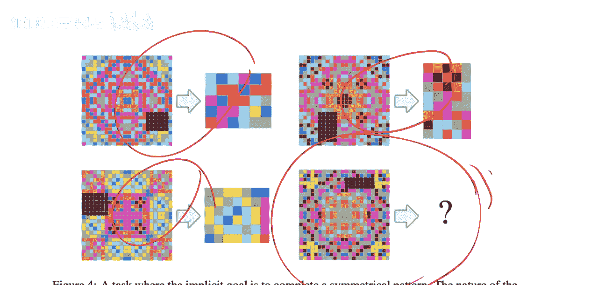

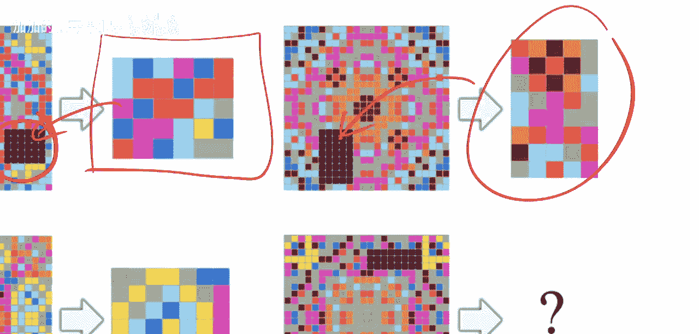

让我们具体看一个任务是如何工作的：

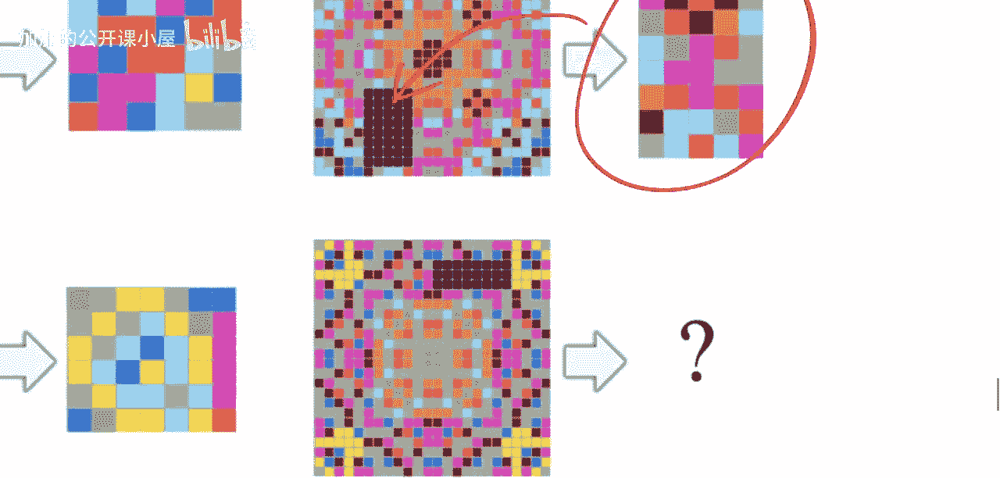

这些是演示（训练）示例。你的目标是从这些演示示例中学习规律，然后将这个规律应用到测试示例上，生成正确的输出。

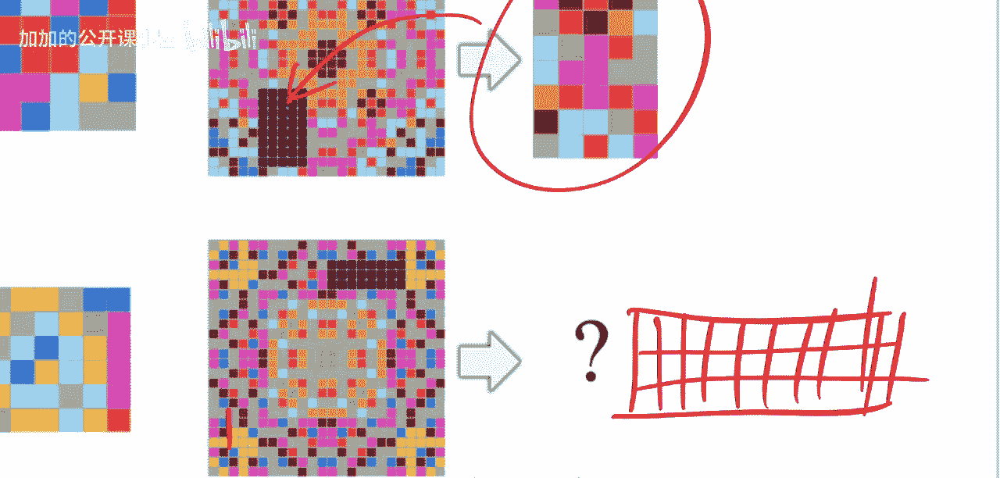

在这个例子中，人类可以相当准确地看出：每个输入图像中都有一些黑色方块。在训练样本中，输出总是精确地填充到这些黑色方块的位置。例如，这里有一个高矩形，它被放置在这里，并且具有相同数量的格子。

你还可以观察到，格子中的颜色似乎是对称图案的延续。例如，下面这个图案和上面那个完全相同，只是旋转了180度。这里存在对称的概念。

因此，从技术上讲，可以这样推理：输出可能有三行，并且很可能与下面这个图案相同，只是上下翻转了。

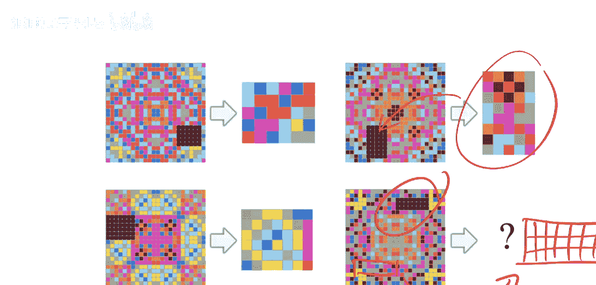

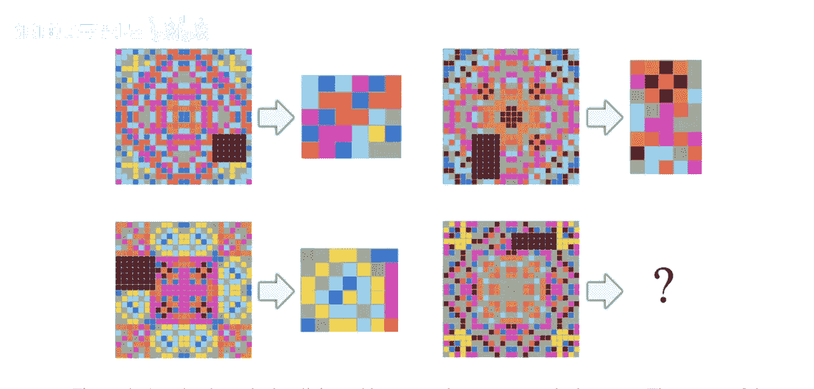

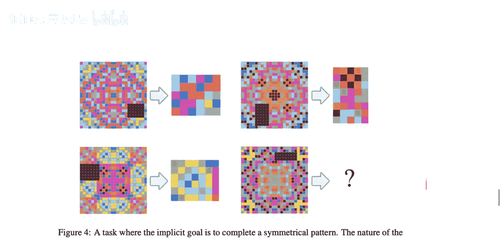

作为人类，你无需描述就能理解：这是一个有规律的对称图案，中间有个洞，而输出总是填充这个洞。三个示例足以确认这个规律。你看到测试输入中也有一个洞，所以你会做同样的事情。

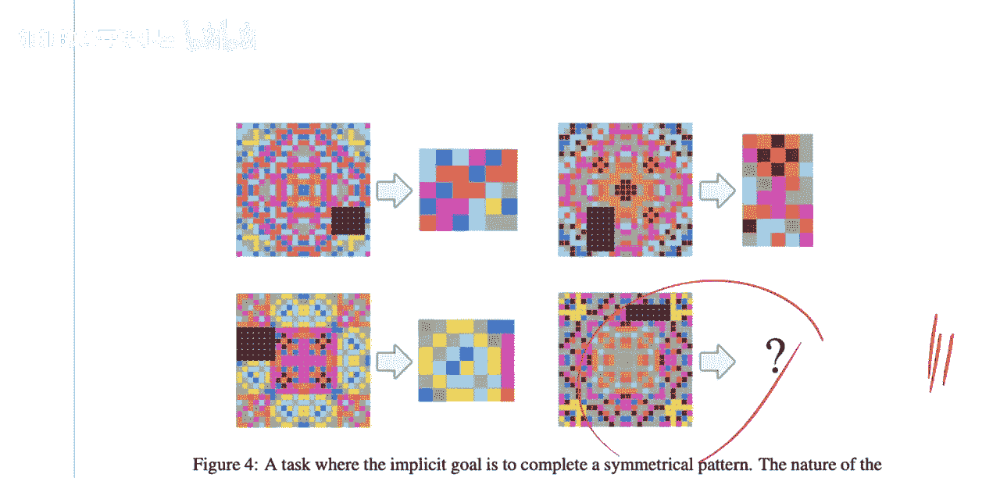

## 数据集的具体规格

需要明确的是，这只是一个任务示例。数据集中有1000个类似性质的任务。

演示示例的数量并不总是三个，可以更多或更少。但不变的是：每个任务都包含若干演示示例和一个测试示例。每个演示示例都包含一个输入网格和一个输出网格。

输入和输出网格的尺寸可以从1x1到30x30不等。

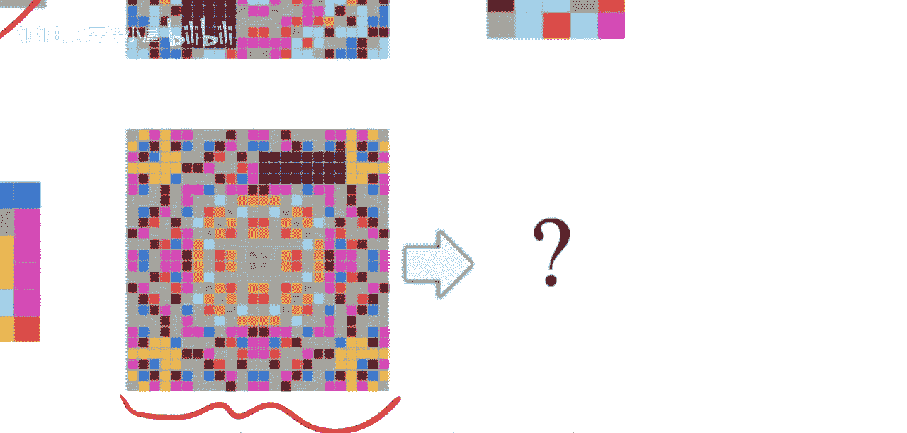

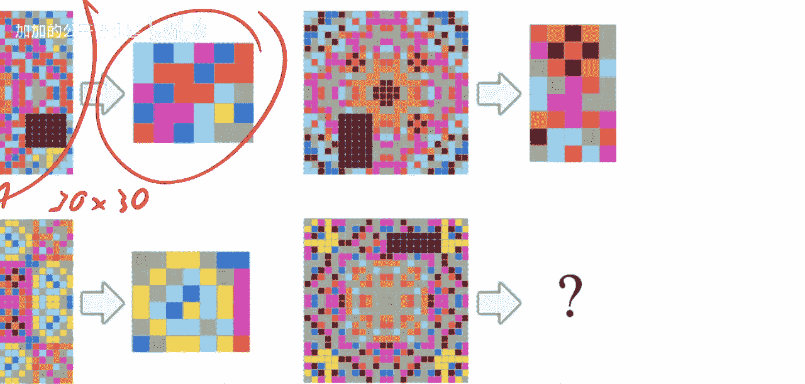

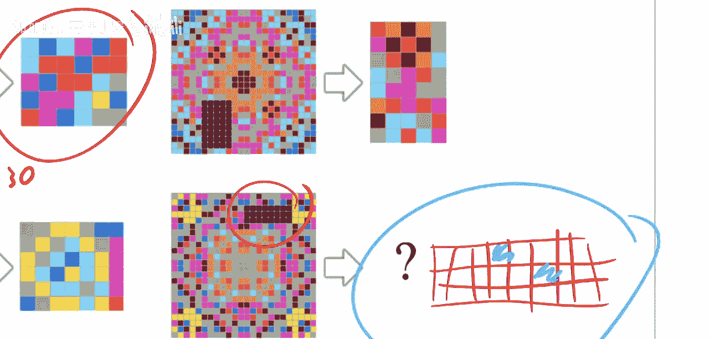

颜色方面，我认为有9种不同的颜色，用9个不同的数字编码。你可以看到黑色、蓝色、橙色、红色、深蓝色等等。输出网格的规格完全相同。

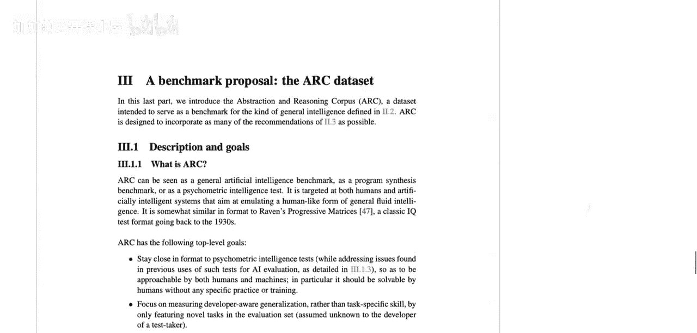

在测试示例中，你只能看到输入网格，看不到输出网格。这意味着你甚至不知道输出应该有多大。如上所示，输出网格的尺寸并不都相同。事实上，输入网格的尺寸也不一定总是相同。

因此，你必须先决定输出网格的尺寸。在这个例子中，我们推断洞有三行，所以输出可能有三行；洞有大约7列，所以输出可能有7列。

接着，你不仅要决定尺寸，还要决定每个单元格中放入什么颜色。只有当你的输出与测试标签完全匹配时，你才能得分。

## 数据集的划分

关于数据划分：
*   训练集包含400个任务。
*   评估集包含600个任务。
*   评估集又进一步划分为：400个任务的公共评估集和200个任务的私有评估集。
*   所有任务都是唯一的，训练任务和测试任务集合是互斥的。

任务数据可在相关链接获取。希望肖莱能在Kaggle挑战赛后继续保密那200个私有任务，这对后来想尝试的人会很有趣。

## ARC挑战赛的设计目标

以下是该数据集的构建目标：

首先，它希望贴近心理测量学中的智力测试。具体来说，它应该能让未经特定练习或训练的人类解决，很可能也不需要任何语言指令。只需让一个人面对任务，他就应该能够解决，或者说大部分人都应该能够解决。理想情况下，这个测试也能区分不同人的能力，但当前的重点是评估机器。

其次，它专注于衡量开发人员未知的泛化能力，而非特定任务的技能。这是通过在评估集中只包含对测试系统开发者未知的新任务来实现的。例如，如果我开发一个系统，我不知道肖莱隐藏的那200个任务是什么。我只需提交代码，系统会在那些任务上自动测试并给出分数。

第三，它要求任务具有高度抽象性，测试者必须能用极少的示例理解任务。正如你所见，你没有大量的训练示例来学习这个任务关乎对称性和填洞，你只有三个。从三个示例中，你需要识别规律并为测试样本生成输出。

第四，通过为每个任务只提供固定数量的训练数据来进行经验质量控制。同时，只包含那些不适合人工生成新数据的任务。这与ImageNet等数据集不同，后者可以从互联网上找到大量图像；也与某些NLP任务不同，后者可以基于整个维基百科和世界上的书籍进行预训练。ARC任务的设计初衷是，外出寻找更多数据或类似数据来预训练模型是没有意义的。

最后，这一点与我们之前看过的章节相关：明确描述任务所假设的完整先验知识集合。通过只要求那些接近人类先天知识的先验，来实现人与机器之间公平的通用智能比较。

这意味着，人类通过进化内置的，或大多数人在生活中习得的先验知识，就是那些必须被明确指出的东西。作为系统开发者，我必须能够将这些先验知识构建到我的系统中，这样比较才是公平的。在之前的章节中我们看到，公平的智能比较只有在两个被比较系统拥有相同经验和相同先验知识时才成立。在这里，我们通过提供固定数量的训练数据来控制经验，并通过列出任务所需的人类先验知识，并允许开发者明确地将它们构建到机器中，来控制先验知识。

---

本节课中，我们一起学习了ARC挑战赛的核心内容。我们了解了其任务格式——通过少量演示示例学习抽象规律并应用于新测试示例。我们探讨了数据集的规格、划分以及其核心设计目标：创建一个能公平衡量机器抽象推理和泛化能力的基准，要求系统仅基于少量示例和明确的人类先验知识来解决问题。ARC挑战赛是肖莱将其智能理论付诸实践的重要尝试，旨在推动人工智能向更通用的方向发展。