# 034：数学原理 📐

在本节课中，我们将学习弗朗索瓦·肖莱提出的智能衡量框架的数学定义。我们将把之前讨论的概念——技能获取效率、任务范围、先验知识、经验和泛化难度——整合成一个可以计算任何系统智能值的正式公式。

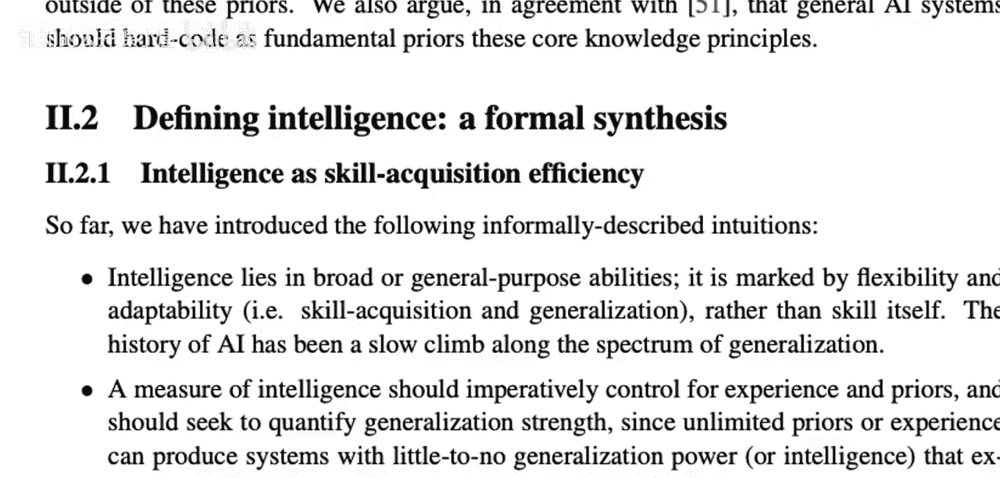

智能的定义可以概括为：**一个系统的智能，是其在特定任务范围内，相对于先验经验和泛化难度而言，获取新技能效率的度量**。

上一节我们介绍了智能衡量的核心思想，本节中我们来看看如何将这些思想形式化。

## 系统概念化 🧠

整个系统的概念化模型如下。我们考虑一个任务（实际上是一系列任务）。对于范围内的一个任务，它会输出一系列“情境”。在机器学习术语中，这些情境类似于训练样本。

在另一边，是智能系统。在纯粹的机器学习场景中，任务会给智能系统一个输入（如训练样本或强化学习中的观察），智能系统则给出一个响应。但在这个框架中，有一个中间步骤。

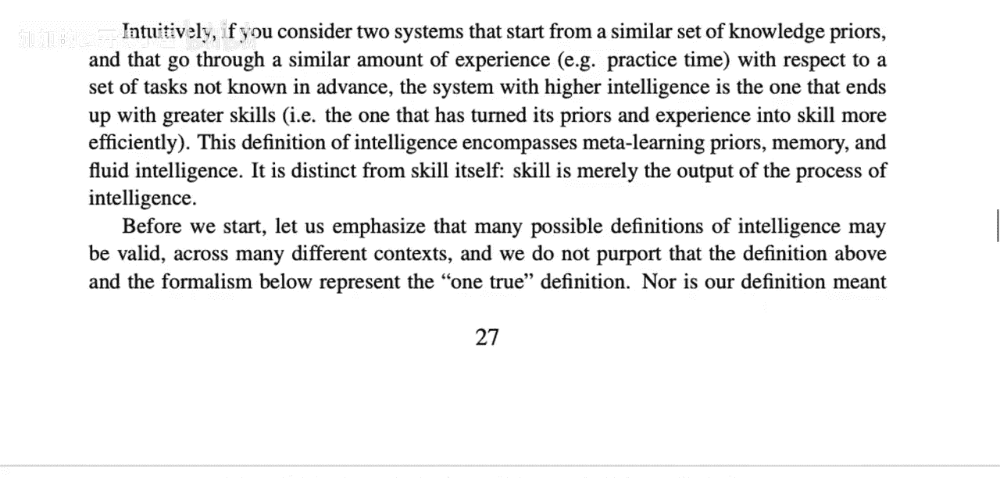

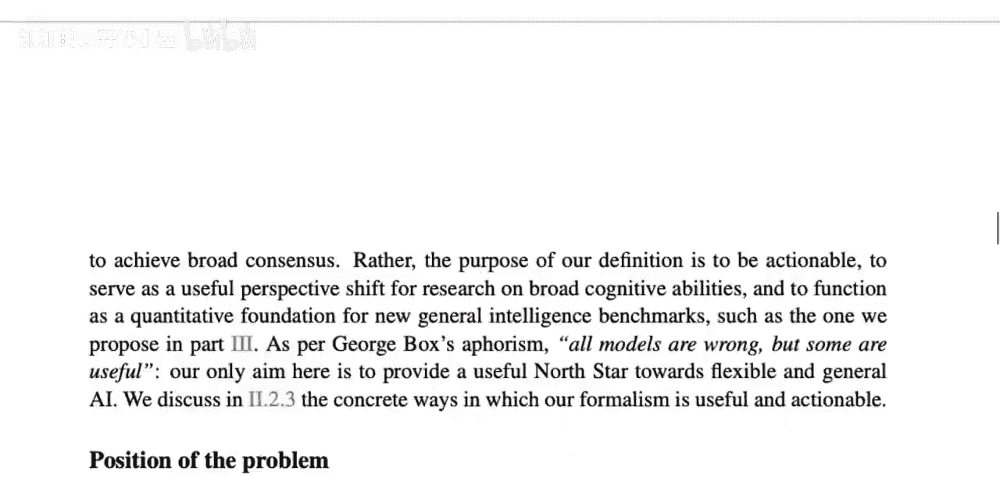

智能系统并不直接对情境做出响应。相反，智能系统会生成一个**技能程序**。这个技能程序能够自行将情境映射到响应。在经典的监督学习例子中：
*   **智能系统**：类似于 ResNet 架构 + SGD 优化算法。
*   **技能程序**：具有特定权重的 ResNet 模型实例。

以下是系统在训练和测试阶段的运作流程。

### 训练阶段 🔄

在训练阶段，智能系统可以干预技能程序。流程形成一个循环：
1.  任务提供一个情境。
2.  技能程序根据当前状态生成一个响应。
3.  任务根据响应给出反馈（分数）。
4.  智能系统接收情境、响应、反馈以及自身的内部状态。
5.  智能系统利用这些信息，通过其**自我更新函数**来更新自身的内部状态，并可能生成一个新的技能程序用于下一步。

这个过程会持续多个步骤。训练阶段输入的情境序列被称为**课程**，类似于训练数据集。

### 测试阶段 🧪

在某个时刻，训练结束。测试阶段开始：
1.  智能系统生成最后一个技能程序。
2.  智能系统与技能程序之间的干预连接被切断。
3.  技能程序必须独立运行，接收情境并产生响应，任务则给出分数。
4.  此循环持续一定步数，所有分数被累计。

最终得分越高，表明智能系统生成的最终技能程序性能越好，从而间接反映了智能系统本身的效率。

## 核心公式与定义 📝

基于上述概念，肖莱给出了智能的正式定义。以下是其核心组成部分。

首先，我们需要定义智能系统在单个任务上的表现。设：
*   `π` 代表智能系统。
*   `T` 代表一个任务。
*   `C` 代表训练课程（情境序列）。
*   `m` 代表训练步数（经验量）。
*   `n` 代表测试步数。

智能系统 `π` 在任务 `T` 上，经过课程 `C` 训练 `m` 步后，在 `n` 步测试中获得的**性能**记为 `V(π, T, C, m, n)`。这个值就是测试阶段获得的总分。

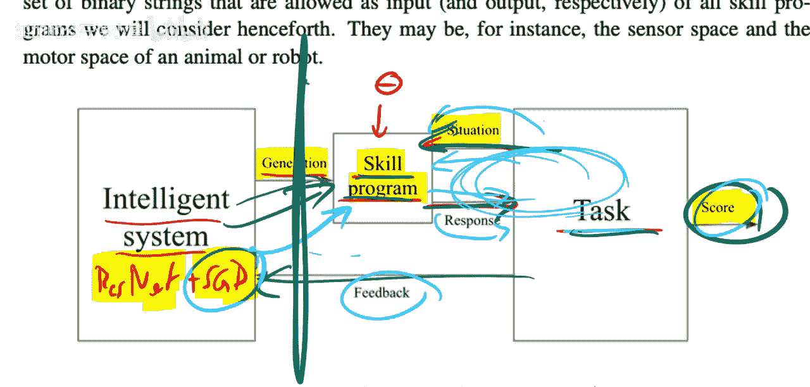

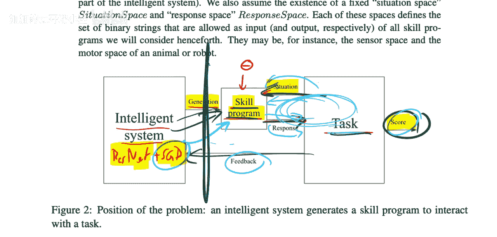

然而，直接比较性能 `V` 并不公平，因为它受到任务本身难度、系统已有先验知识以及训练经验量的影响。因此，我们需要一个标准化的度量。

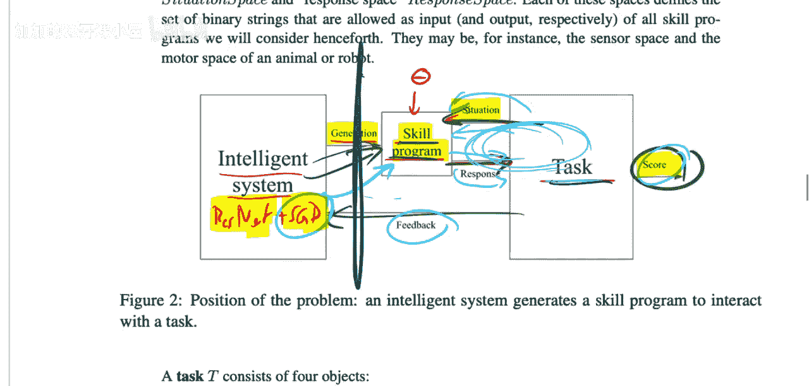

### 智能度量的核心公式 🧮

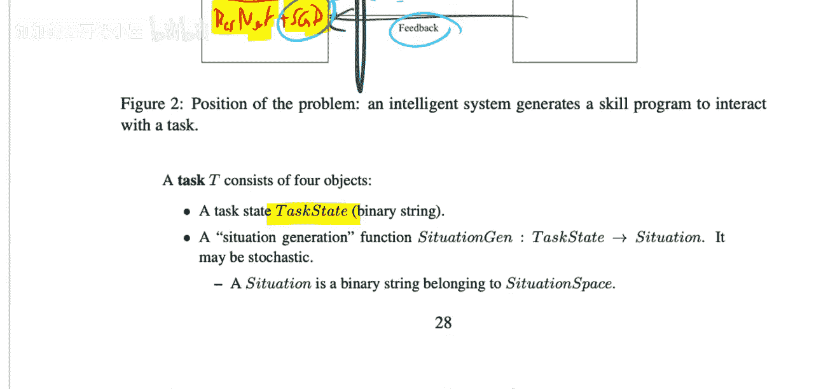

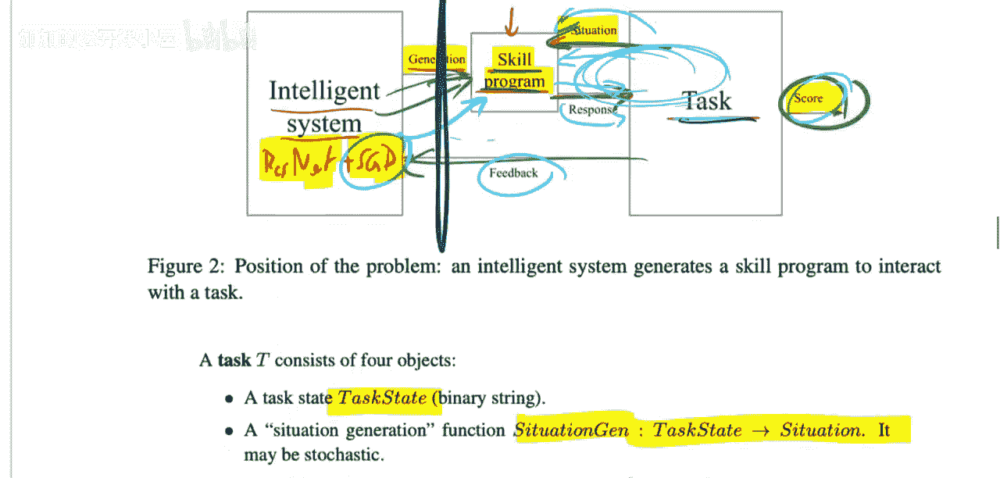

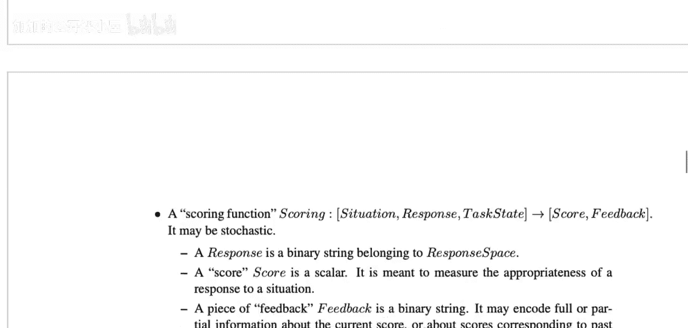

系统的智能 `Ψ(π)` 被定义为，在一个广泛且有代表性的任务分布 `D` 上，其性能的期望值，同时需考虑每个任务的最佳课程和最优经验量。公式表达如下：

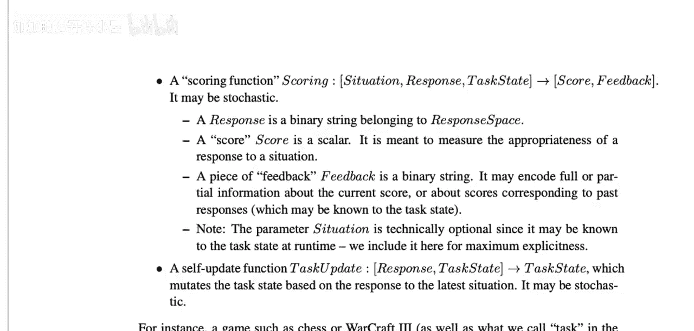

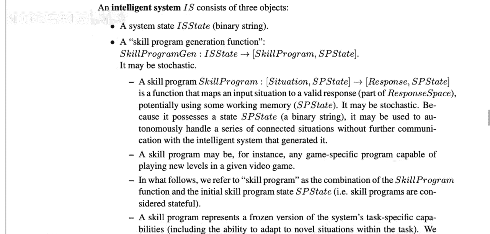

**`Ψ(π) = E_{T ~ D} [ max_{C ∈ C_T} ( lim_{m→∞} ( V(π, T, C, m, n_T) / ξ_T ) ) ]`**

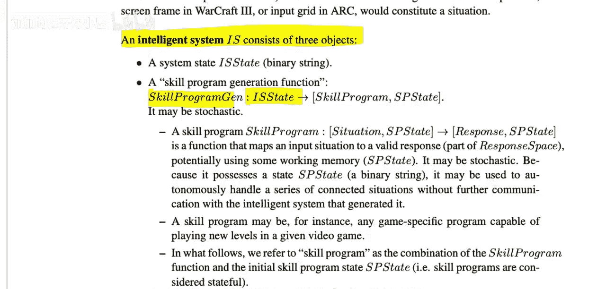

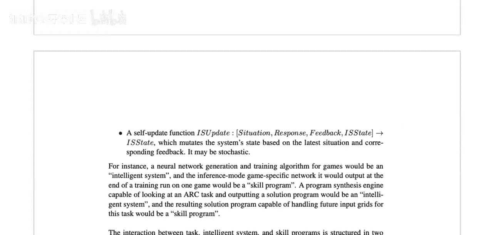

让我们分解这个公式：
1.  **`E_{T ~ D}`**：表示对从任务分布 `D` 中采样的任务 `T` 求期望。这确保了衡量是基于一个任务范围（如人类能解决的任务），而非单一任务。
2.  **`max_{C ∈ C_T}`**：对于每个任务 `T`，我们从所有可能的课程 `C_T` 中选择能使智能系统 `π` 表现最好的那个课程。这模拟了为学习者提供最优教学序列。
3.  **`lim_{m→∞}`**：让训练步数 `m` 趋向于无穷大。这意味着我们衡量的是系统在获得无限经验后的**渐近性能**，排除了因经验不足导致的性能差异，专注于系统的学习能力上限。
4.  **`V(π, T, C, m, n_T)`**：即系统在特定条件下的性能得分。
5.  **`ξ_T`**：这是任务 `T` 的**泛化难度**系数。它是一个大于0的数，用于标准化性能得分。任务越难，`ξ_T` 可能越大，使得 `V/ξ_T` 相对变小，从而在衡量智能时公平地对待不同难度的任务。
6.  **`n_T`**：任务 `T` 的测试步数。

**公式的核心思想**：智能 `Ψ(π)` 是系统在无限经验下，于最优教学序列中，跨越一系列任务所能达到的标准化渐近性能的平均水平。它剥离了先验知识（通过选择最优课程来“教”系统）和特定经验量（取极限）的影响，并考虑了任务本身的固有难度。

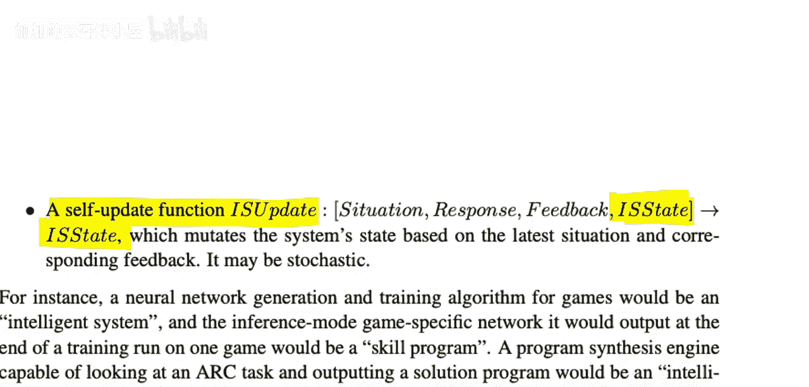

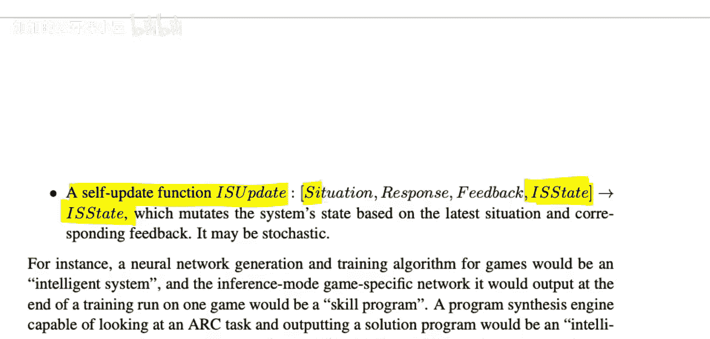

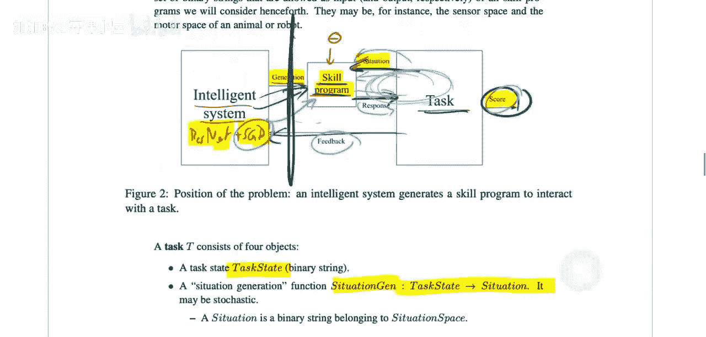

## 关键要点总结 ✨

本节课中我们一起学习了肖莱智能衡量理论的数学原理。

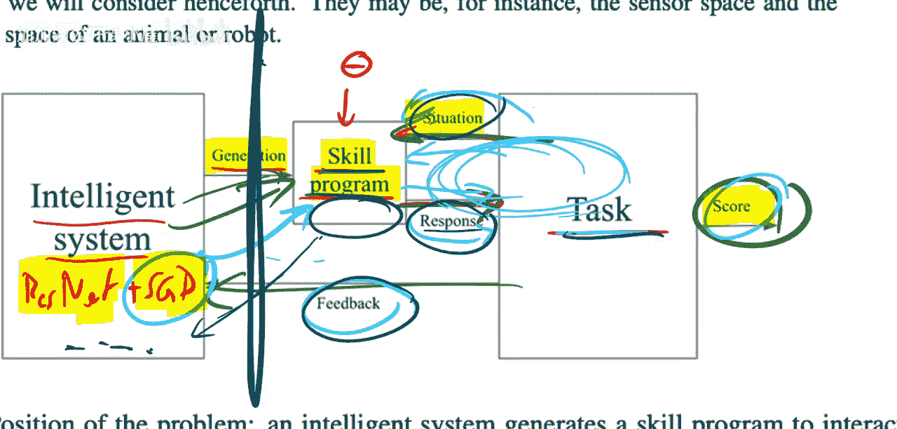

1.  **系统模型**：智能系统通过生成和更新“技能程序”来解决问题，分为可干预的训练阶段和独立运行的测试阶段。
2.  **性能评估**：通过测试阶段技能程序获得的累计分数 `V` 来评估。
3.  **智能公式**：智能 `Ψ(π)` 是一个标准化度量。它计算系统在**最优教学**和**无限经验**条件下，跨越一个**任务分布**所能达到的**平均标准化性能**。
4.  **公式意义**：该公式旨在隔离并量化纯粹的“技能获取效率”。它通过取极限排除经验多寡的影响，通过选择最优课程来最小化不利先验的负面影响，并通过除以泛化难度 `ξ_T` 来公平比较不同难度的任务。

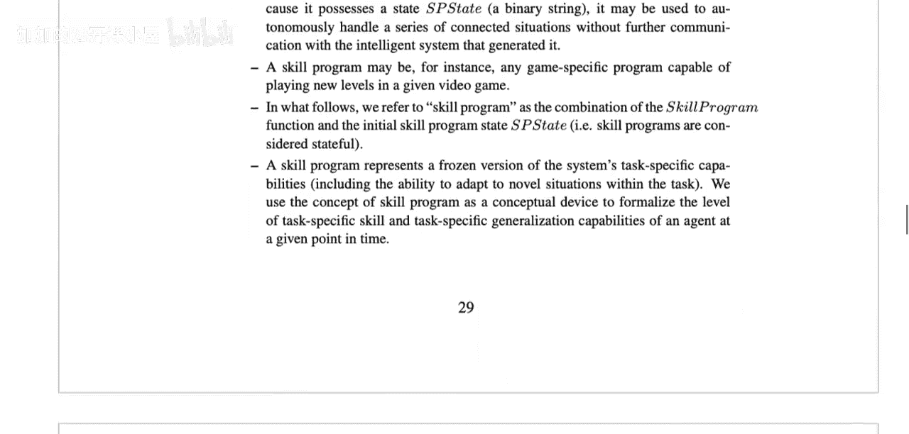

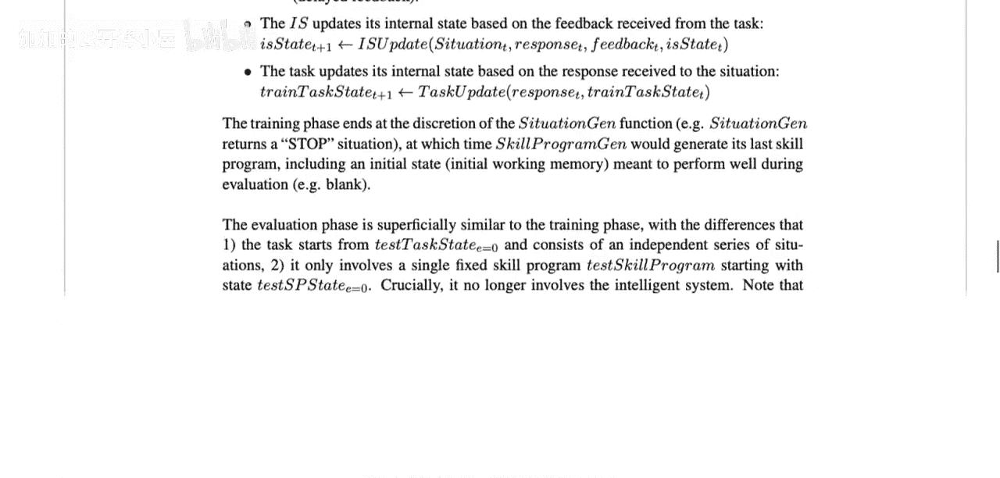

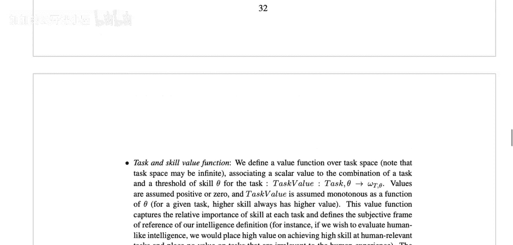

最终，这个框架试图提供一个理论上严谨、可比较的智能标尺，用于评估从人类到人工智能的各种系统。